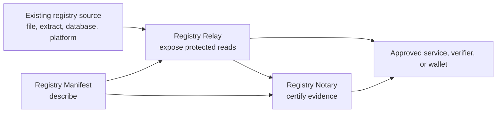

# Registry Stack

[](https://github.com/registrystack/registry-stack/actions/workflows/ci.yml)
[](https://docs.registrystack.org/)
[](LICENSE)

Registry Stack helps institutions build registry-facing services over data they
already hold: protected read APIs, governed evidence responses, credentials, and
audit records, without turning the registry into a shared database.

This repository is the monorepo source of truth for Registry Stack product code,
release manifests, docs, and lab evidence.

> **Status:** Registry Stack is a pre-1.0 technical release for evaluation,
> integration pilots, and public review. APIs and deployment contracts may
> change before a production-stability release.

## Start Here

| Goal | Start here |
|---|---|
| Understand the product | [registrystack.org](https://registrystack.org/) |
| Read the technical docs | [docs.registrystack.org](https://docs.registrystack.org/) |
| Try it without installing anything | [Hosted lab](https://lab.registrystack.org/) |
| Run the local demo topology | `cd lab && just quick` |
| Work on the monorepo | See [Development](#development) |
| Review release evidence | See [Release And External Inputs](#release-and-external-inputs) |

## What It Includes

Registry Stack is organized around two runtime patterns:

- **Protected Registry APIs:** scoped, read-only HTTP APIs over existing files,
  extracts, databases, or legacy registry systems. Registry Relay implements
  this surface.
- **Evidence Gateway:** governed evidence responses, claim evaluation,
  credential issuance, disclosure policy, and audit provenance. Registry Notary
  implements claim evaluation and credential issuance; governed Registry Relay
  routes use the same Policy Decision Point pattern for protected reads.

The stack also includes Registry Manifest for portable metadata, Registry
Platform shared primitives, `registryctl` adopter tooling, Registry Lab demos,
and release tooling for validating the public source model.



## Repository Layout

- `crates/`: Rust crates and runnable binaries for Platform, Manifest, Notary,
  Relay, `registryctl`, and shared release tooling.
- `products/`: product-owned docs, examples, Docker inputs, specs, security
  material, scripts, performance harnesses, and fixtures that are not normal
  workspace crates.
- `docs/site/`: the public Registry Stack docs site.
- `lab/`: Registry Lab compose files, fixtures, demos, tutorials, and source
  proof scripts.
- `release/`: stack release manifests, schemas, import audit records, and public
  release tooling.
- `external/`: notes for external inputs that intentionally stay outside this
  source tree.

## Development

Prerequisites:

- Rust toolchain from `rust-toolchain.toml`.
- Python 3 for release and lab helper tests.
- Node.js 22.12.0 and npm for `docs/site`.
- Docker Compose and `just` for the full local Lab.

Useful first checks:

```bash
cargo metadata --locked --format-version 1
cargo fmt --check
cargo check --locked --workspace --all-targets
cargo test --locked -p registryctl
```

Release and lab source checks:

```bash
python3 -m unittest release/scripts/test_registry_release.py
release/scripts/registry-release validate release/manifests/registry-stack-beta-6.yaml
release/scripts/registry-release audit release/manifests/import-map-2026-06-24.yaml
REGISTRY_LAB_RELEASE_SOURCE_MODE=monorepo lab/scripts/check-release-source-model.sh
python3 -m unittest lab/scripts/test_check_release_source_model.py
```

Docs checks:

```bash
cd docs/site
npm ci
npm test
npm run check
```

The GitHub Actions workflow in `.github/workflows/ci.yml` is the reference for
the current pull request gate.

## Release And External Inputs

Crosswalk remains an external pinned input and is not imported into this
repository. Release builds use the pinned Git dependency declared in the root
workspace manifest and record the exact ref in `release/manifests/*.yaml`.

Registry Atlas and the eSignet relay authenticator remain Lab-only external
inputs unless a later product decision promotes them into Registry Stack.

Release evidence lives in:

- `release/manifests/`
- `release/schemas/`
- `release/notes/`
- `release/scripts/`

## Support And Contribution

Use [GitHub issues](https://github.com/registrystack/registry-stack/issues) for
non-security bugs, questions, and feature discussion. Before opening a pull
request, run the relevant checks from [Development](#development) and keep
changes scoped to the owning crate, product, docs, lab, or release area.

## Security

Report vulnerabilities privately. See [SECURITY.md](SECURITY.md) before opening
a public issue for suspected credential disclosure, auth bypass, audit redaction
failure, source connector data leakage, or signing key handling bugs.

## License

Registry Stack is released under the [Apache License 2.0](LICENSE).
