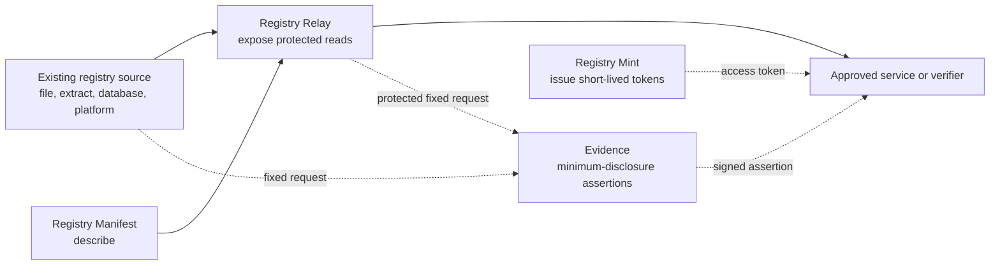

# Registry Stack

[](https://github.com/registrystack/registry-stack/actions/workflows/ci.yml)
[](https://scorecard.dev/viewer/?uri=github.com/registrystack/registry-stack)
[](https://www.bestpractices.dev/projects/13372)
[](https://github.com/registrystack/registry-stack/releases)
[](https://docs.registrystack.org/)
[](LICENSE)

Registry Stack helps institutions build registry-facing services over data they
already hold: protected read APIs, signed minimum-disclosure assertions, and
audit records, without turning the registry into a shared database.

This repository is the monorepo source of truth for Registry Stack product code,
release manifests, and docs.

> **Status:** Registry Stack is pre-1.0 Beta software for self-hosted
> institutional pilots. APIs and deployment contracts may still change.
> Adopters should use matching release artifacts and documentation for one
> version.

## Start Here

| Goal | Start here |
|---|---|
| Understand the product | [registrystack.org](https://registrystack.org/) |
| Read the technical docs | [docs.registrystack.org](https://docs.registrystack.org/) |
| Get a first minimum-disclosure assertion | [Evidence quickstart](https://docs.registrystack.org/dev/start/evidence-quickstart/) |
| Build and run the maintained HTTP project | [Registry Stack 1.0 first run](https://docs.registrystack.org/dev/tutorials/author-registry-project/) |
| Install VS Code or Zed integration | [Editor integrations](editors/README.md) |
| Work on the monorepo | See [Development](#development) |
| Review the public roadmap | [ROADMAP.md](ROADMAP.md) |
| Review release evidence | See [Release And External Inputs](#release-and-external-inputs) |

## What It Includes

Registry Stack contains two independent runtime patterns:

- **Protected Registry APIs:** scoped, read-only HTTP APIs over existing files,
  extracts, databases, or legacy registry systems. Registry Relay implements
  this surface.
- **Evidence:** a small service that returns signed, minimum-disclosure
  assertions from fixed authoritative-source requests. Its first version
  excludes credential lifecycles, documents, federation, and a general policy
  engine.

Evidence can use a Relay-protected API as one of its fixed sources. The stack
also includes Registry Mint for short-lived access tokens, Registry Manifest
for portable metadata, Registry Platform shared primitives, `registryctl` and
`evidencectl` adopter tooling, and release tooling for validating the public
source model.


```mermaid
flowchart LR
    source["Existing registry source<br/>file, extract, database, platform"]
    manifest["Registry Manifest<br/>describe"]
    relay["Registry Relay<br/>expose protected reads"]
    evidence["Evidence<br/>minimum-disclosure assertions"]
    mint["Registry Mint<br/>issue short-lived tokens"]
    caller["Approved service or verifier"]

    source --> relay
    manifest --> relay
    relay --> caller
    source -. fixed request .-> evidence
    relay -. protected fixed request .-> evidence
    evidence -. signed assertion .-> caller
    mint -. access token .-> caller
```

## Repository Layout

- `crates/`: Rust crates and runnable binaries for Platform, Manifest, Relay,
  Evidence, Mint, `registryctl`, and `evidencectl`. Evidence lives in one
  `crates/registry-evidence` crate with one `evidence` binary.
- `products/`: product-owned docs, examples, Docker inputs, specs, security
  material, scripts, performance harnesses, and fixtures that are not normal
  workspace crates.
- `docs/site/`: the public Registry Stack docs site.
- `editors/`: source-installed VS Code and Zed semantic navigation integrations.
- `release/`: stack release manifests, schemas, import audit records, and public
  release and conformance tooling.
- `external/`: notes for external inputs that intentionally stay outside this
  source tree.

## Development

Prerequisites:

- Rust toolchain from `rust-toolchain.toml`.
- Python 3.11 or later for release helper tests and conformance tooling.
- Node.js 22.12.0 and npm for `docs/site`.

Useful first checks:

```bash
cargo metadata --locked --format-version 1
cargo fmt --check
cargo check --locked --workspace --all-targets
cargo test --locked -p registryctl
```

Release source checks:

```bash
python3 -m unittest release/scripts/test_registry_release.py
release/scripts/registry-release validate release/manifests/registry-stack-beta-28.yaml
release/scripts/registry-release audit release/manifests/import-map-2026-06-24.yaml
REGISTRY_RELEASE_SOURCE_MODE=monorepo release/scripts/check-release-source-model.sh
python3 -m unittest release/scripts/test_check_release_source_model.py
```

Docs checks:

```bash
cd docs/site
npm ci
npm test
npm run check
```

The GitHub Actions workflow in `.github/workflows/ci.yml` is the reference for
the current pull request gate.

Major new functionality must include automated tests with the change proposal.
Release candidates are built from exact protected-main source and lockfiles.
Independent repeatability exercises run outside ordinary Beta publication. See
[CONTRIBUTING.md](CONTRIBUTING.md) for the formal test and repeatability
policies.

## Release And External Inputs

Crosswalk remains an external pinned input and is not imported into this
repository. Release builds use the pinned Git dependency declared in the root
workspace manifest and record the exact ref in `release/manifests/*.yaml`.

Historical release manifests retain immutable Registry Atlas and eSignet relay
authenticator refs for releases that used them as lab-only external inputs.

Release evidence lives in:

- `release/manifests/`
- `release/notes/`
- `release/conformance/`
- `release/scripts/`

Release assets are published with an authenticated SHA256 checksum chain. The
exact candidate manifest and bundle are attested and verified before promotion.
See [release/VERIFY.md](release/VERIFY.md) for verification commands and
[release/REPEATABLE-BUILDS.md](release/REPEATABLE-BUILDS.md) for asynchronous
repeatable-build evidence.

## Support And Contribution

Use [GitHub issues](https://github.com/registrystack/registry-stack/issues) for
non-security bugs, questions, and feature discussion. See [SUPPORT.md](SUPPORT.md)
for support expectations and [CONTRIBUTING.md](CONTRIBUTING.md) for contribution
workflow. Before opening a pull request, run the relevant checks from
[Development](#development) and keep changes scoped to the owning crate,
product, docs, or release area. Open issues are triaged with public labels
described in [CONTRIBUTING.md](CONTRIBUTING.md#issue-labels).

## Security

Report vulnerabilities privately. See [SECURITY.md](SECURITY.md) before opening
a public issue for suspected minimum-disclosure failure, auth bypass, audit
redaction failure, source connector data leakage, or signing key handling bugs.

## License

Registry Stack is released under the [Apache License 2.0](LICENSE).
