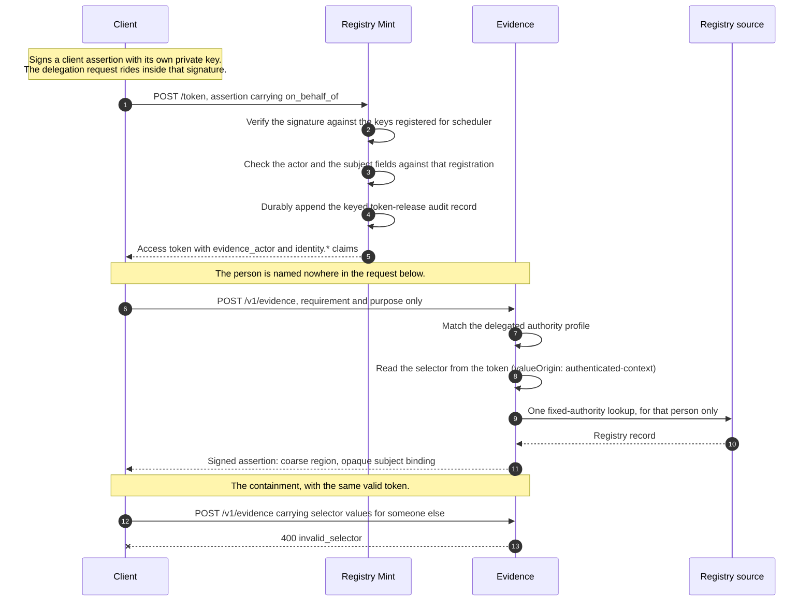

# Delegated, subject-bound access: a runnable demonstration

An agent needs to know which region one person lives in. It must not be able to
learn that about anybody else, even if the agent's own code is wrong.

This directory runs that end to end against the real Mint and the real Evidence
binaries: a real client assertion, a real token, a real signed evidence
assertion, and a real refusal.

```bash
crates/registry-mint/demo/run.sh
```

It needs `cargo`, `uv`, and `openssl`, binds four loopback ports (8080, 8090,
8092, 8443), and leaves its throwaway deployment in `demo/.run/` for inspection.
Everything it generates is disposable: fresh keys per run, synthetic people, a
private CA that exists for the lifetime of the demonstration.

## What to read

- [`walkthrough.py`](walkthrough.py) is the demonstration. Six steps, every
  request printed before it is sent, with the reasoning next to it.
- [`evidence-bundle/evidence.yaml`](evidence-bundle/evidence.yaml) is the
  policy. The security property is one line of it.
- Everything under [`support/`](support/) is deployment plumbing: key
  generation, a TLS terminator, a stand-in registry source. None of it decides
  anything. Read it only if you want to know why the demonstration needs a
  certificate.

## The mechanism, in one paragraph

The client authenticates to Mint with a JWT it signs with its own key
(RFC 7523 `private_key_jwt`), so there is no shared secret and Mint holds only
public keys. The delegation request rides *inside* that signed JWT, in an
`on_behalf_of` member, which is what makes the actor and the subject
tamper-evident between the client and Mint. Mint checks both against the
client's registration and mints them as claims. The Evidence bundle then
declares that subject role's `valueOrigin` as `authenticated-context`, which
means Evidence reads the selector from those claims and **refuses any request
that carries selector values of its own**. That refusal is the containment: it
is not "you named the wrong person", it is "you do not get to name a person".

## The flow



Two properties are visible in the shape of that diagram. Nothing the client
sends after step 1 names a person, and the only arrow that reaches the registry
source is the one Evidence draws for the subject its own authority context
resolved. The final refusal is not a lookup that failed; it is a request that
was never allowed to describe anybody.

## The four requests

These are the requests the walkthrough sends, written as curl so they can be
read without running anything. `run.sh` stops its servers when it exits, so to
issue them by hand you would keep the deployment in `.run/` and start the four
processes yourself.

### 1. The client assertion

The client builds and signs this itself. Nothing between it and Mint can change
who the token is for.

```json
{
  "iss": "scheduler",
  "sub": "scheduler",
  "aud": "https://localhost:8443/token",
  "iat": 1785671511,
  "exp": 1785671631,
  "jti": "demo-1",
  "on_behalf_of": {
    "actor": "urn:example:demo:agent:appointment-scheduler",
    "subject": {"given_name": "Amara", "family_name": "Okafor", "birth_date": "1998-04-02"}
  }
}
```

`on_behalf_of` is Mint's own member, not RFC 8693 `act`. Token exchange presents
a subject's own credential, which is exactly what a deployment without an
identity provider does not have.

### 2. The token request

```bash
curl -sS --cacert crates/registry-mint/demo/.run/ca.pem https://localhost:8443/token \
  -d grant_type=client_credentials \
  -d client_assertion_type=urn:ietf:params:oauth:client-assertion-type:jwt-bearer \
  --data-urlencode "client_assertion@/path/to/assertion.jwt"
```

Mint verifies the signature against the keys registered for `scheduler`, then
checks the delegation request against the same registration:

```yaml
clientId: scheduler
principal: urn:example:demo:principal:scheduler
evidenceAudience: https://scheduler.demo.invalid
requesterTags: [demo-agent]
keys: [...]
delegation:
  actors: [urn:example:demo:agent:appointment-scheduler]
  subjectClaims:
    given_name: identity.given_name
    family_name: identity.family_name
    birth_date: identity.birth_date
```

That block is the whole authorization decision Mint makes: which agents this
client may act as, and which selector fields it may bind, at which claim paths.
Neither answer comes from the request. A client with no `delegation:` block
cannot obtain a delegated token at all.

The resulting token:

```json
{
  "iss": "https://localhost:8443",
  "sub": "urn:example:demo:principal:scheduler",
  "aud": "evidence.demo.invalid",
  "client_id": "scheduler",
  "evidence_tags": ["demo-agent"],
  "evidence_audience": "https://scheduler.demo.invalid",
  "evidence_actor": "urn:example:demo:agent:appointment-scheduler",
  "identity": {"given_name": "Amara", "family_name": "Okafor", "birth_date": "1998-04-02"},
  "exp": 1785671811, "iat": 1785671511, "nbf": 1785671511, "jti": "01KZ..."
}
```

`evidence_actor` says who is acting. `identity.*` says who they are acting for.

### 3. The evidence request

```bash
curl -sS http://127.0.0.1:8080/v1/evidence \
  -H "Authorization: Bearer ${TOKEN}" \
  -H 'Content-Type: application/json' \
  -d '{
        "requestNonce": "<32 random bytes, base64url, unpadded>",
        "requirement": "urn:example:demo:requirement:residence-region:v1",
        "purpose": "demo-routing",
        "subjects": [{"role": "subject", "selector": {"profile": "demographics-v1"}}]
      }'
```

Note what is not in that body: the person. `requestNonce` is a caller
correlation value, echoed into the assertion and kept away from authorization,
sources, and audit. The bundle says where the subject
comes from instead.

```yaml
authorityProfiles:
  delegated-agent-v1:
    kind: delegated
    requesterTags: [demo-agent]
    grants:
      - requirement: urn:example:demo:requirement:residence-region:v1
        purpose: demo-routing
        audienceFrom: authenticated-requester
        subjects:
          - role: subject
            selectorProfile: demographics-v1
            valueOrigin: authenticated-context   # <- the security property
            valueClaims:
              given_name: identity.given_name
              family_name: identity.family_name
              birth_date: identity.birth_date
```

Evidence answers with a signed assertion whose payload carries a coarse region
and an opaque subject binding. The person's name and their residence code are in
neither the request nor the answer:

```json
{
  "supportsRequirement": "urn:example:demo:requirement:residence-region:v1",
  "purpose": "demo-routing",
  "audience": "https://scheduler.demo.invalid",
  "subjects": [{"role": "subject", "binding": "urn:evidence:subject:v1_lARwiBg..."}],
  "supportedValues": [
    {"providesValueFor": "urn:example:demo:concept:residence-region", "value": "REGION-NORTH"}
  ]
}
```

### 4. The same token, pointed at somebody else

```bash
curl -sS http://127.0.0.1:8080/v1/evidence \
  -H "Authorization: Bearer ${TOKEN}" \
  -H 'Content-Type: application/json' \
  -d '{
        "requestNonce": "<32 random bytes, base64url, unpadded>",
        "requirement": "urn:example:demo:requirement:residence-region:v1",
        "purpose": "demo-routing",
        "subjects": [{"role": "subject", "selector": {"profile": "demographics-v1",
          "values": {"given_name": "Kofi", "family_name": "Mensah", "birth_date": "1971-11-30"}}}]
      }'
```

```json
{"type": "https://registrystack.org/problems/evidence/invalid_selector",
 "title": "Request is not valid", "status": 400, "code": "invalid_selector"}
```

There is no request this token can make about Kofi Mensah. The refusal is for
carrying selector values at all, not for carrying the wrong ones, so a client
bug that puts the wrong person in the body cannot reach that person.

## What this does and does not defend against

It defends against a **buggy** client. A client that loops over the wrong list,
reuses a request object, or confuses two sessions cannot cross from one person
to another, because the subject is not a request parameter it controls.

It does not defend against a **compromised** client. A client holding its own
signing key can ask Mint for a token naming a different subject, within the
fields its registration permits. Closing that would mean Mint resolving the
subject from a server-side grant record rather than from the caller's request,
which is a larger change and is not what this builds.

Two further limits worth stating plainly:

- Evidence confines an *actor-bearing* token to `kind: delegated` authority
  profiles, but it does not conversely require an actor to reach one. An
  undelegated token therefore matches this grant and is stopped when the subject
  cannot be resolved, rather than at the authority match. Nothing leaks either
  way, but the two are not interchangeable: were this grant to gain a subject
  role whose values come from the request, an undelegated token would reach it.
- The registry source still receives the person's identifying details. Data
  minimization here is about what the *caller* learns, not about what the source
  is asked.

## Why the demonstration needs a certificate

Evidence requires the token issuer and its key set to be HTTPS, with no
exception for loopback, and Mint expects TLS to be terminated upstream. Rather
than work around that, `run.sh` issues a throwaway CA and puts a small TLS
terminator in front of Mint, exactly where your ingress would sit. The CA is
trusted only by the demonstration's own Evidence process, through `SSL_CERT_FILE`.

## The same property, as a test

Steps 3 and 4 are also asserted in
[`tests/delegated_subject_binding.rs`](../tests/delegated_subject_binding.rs),
which loads this same bundle and runs Evidence's own authorization decision over
a token minted by the real Mint router. The demonstration and the test cannot
drift: they share `evidence-bundle/`, and the test's constants must match it.
