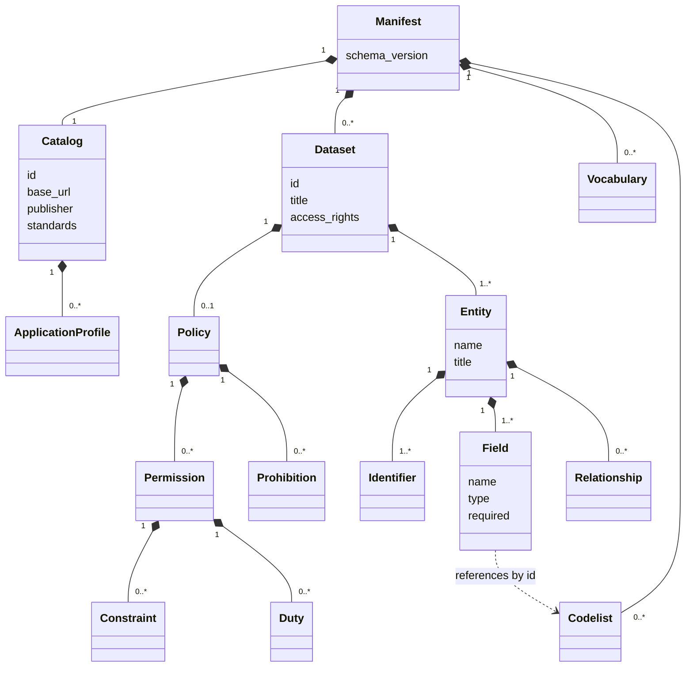

# Portable Metadata

Registry Relay separates portable metadata from runtime configuration.
The standards assumptions behind this publication model are documented in
[`../STANDARDS_ASSUMPTIONS.md`](../STANDARDS_ASSUMPTIONS.md).

Portable metadata describes what a registry means: catalogs, datasets, entities,
fields, identifiers, relationships, vocabularies, codelists, standards, and
application-profile claims. Runtime configuration describes how Relay serves the
data: files, tables, columns, scopes, filters, aggregates, adapters, reloads,
and operational limits.

The split has two goals:

- Let a civil registration application, social benefits application, or similar
  registry system publish standards-friendly metadata without running Registry
  Relay.
- Let Registry Relay validate at startup that its runtime bindings still match
  the public metadata it exposes.

## Files

A runtime config may point at a metadata manifest:

```yaml
metadata:
  source:
    path: ./benefits_casework.metadata.yaml
```

Relative paths are resolved from the runtime config file, not the shell's current
directory. The demo configs use this convention:

```text
demo/config/benefits_casework.yaml
demo/config/benefits_casework.metadata.yaml
```

The runtime YAML keeps operational bindings:

- source paths, table ids, schemas, and physical columns
- API keys, scopes, and access policy
- allowed filters, required filters, limits, and expansions
- aggregates, SP DCI, OGC Features, ingest, refresh, and runtime bindings that keep published evidence offerings aligned with served entities

The metadata manifest keeps standard-facing semantics:

- catalog id, base URL, publisher, standards, and application profiles
- dataset title, description, status, access rights, conformance, and coverage
- descriptive ODRL policy Offers for dataset discovery and governance review
- entity names, titles, identifiers, fields, relationships, concepts, and units
- SHACL constraints, JSON Schema constraints, codelists, and vocabularies
- profile claims for ecosystem-specific validation

Metadata manifests must not contain runtime-only details such as source paths,
table ids, physical columns, auth scopes, Relay runtime backend URLs, or SQL.
Evidence offerings may still declare standards-facing `endpoint_url` and
`discovery_url` values when the offering points to Registry Notary.

## Minimal Manifest

```yaml
schema_version: registry-manifest/v1

catalog:
  id: example-civil-registration-demo
  base_url: https://metadata.example.gov
  title: Example Civil Registration Metadata
  publisher:
    name: Civil Registration Authority
  standards:
    dcat: "3.0"
    shacl: "1.1"
    json_schema: "2020-12"
  application_profiles:
    - id: bregdcat-ap
      version: "3.0"

vocabularies:
  ex: https://example.gov/vocab/

datasets:
  - id: vital_events
    title: Vital Events
    description: Civil registration event metadata
    owner: Civil Registration Authority
    access_rights: restricted
    sensitivity: personal
    policy:
      uid: https://metadata.example.gov/datasets/vital_events#offer
      assigner: did:web:civil-registration.example.gov
      profile:
        - https://example.gov/odrl/profile/government-data-sharing
      permissions:
        - action: odrl:use
          constraints:
            - left_operand: odrl:purpose
              operator: odrl:isA
              right_operand:
                iri: https://example.gov/purpose/service-eligibility
          duties:
            - action: odrl:attribute
      prohibitions:
        - action: odrl:sell
    entities:
      - name: birth_registration
        title: Birth Registration
        identifiers:
          - name: id
            kind: primary
        fields:
          - name: id
            type: string
            required: true
          - name: date_of_birth
            type: date
            required: true
          - name: sex
            type: code
            codelist: sex

codelists:
  - id: sex
    scheme_iri: ex:codelists/sex
    concepts:
      - code: female
      - code: male
      - code: unknown
```



*The portable metadata manifest hierarchy. The catalog, datasets, vocabularies,
and codelists are top-level. Each dataset owns an optional ODRL policy and its
entities; each entity owns its identifiers, fields, and relationships; fields
reference codelists by id.*

## ODRL Policy Metadata

Datasets may include an optional `policy` block. Registry Relay publishes this
as descriptive ODRL metadata for catalog discovery and governance review.
Policies are dataset-scoped; the manifest hierarchy diagram above shows the
`Policy` relationship. For the full field contract, vocabulary, JSON-LD
rendering rules, and validation requirements, see the
[ODRL Policy Metadata Contract](#odrl-policy-metadata-contract) section below.

## CLI Reference

The `just` recipes delegate to the `registry-manifest` CLI via
`scripts/run_registry_manifest_cli.sh`. The script resolves the binary in this
order: an installed `registry-manifest` binary on `PATH`, a sibling
`../registry-manifest` checkout for local development, or a pinned Git commit
fetched and built by `cargo install --locked --git`.

### metadata-validate

Validate one manifest:

```sh
just metadata-validate profiles/example-civil-registration/fixtures/metadata.yaml
```

Validate all ecosystem profile descriptors and fixture manifests:

```sh
just metadata-validate-profiles
```

Validate all demo split configs via the Rust integration test:

```sh
cargo test --test demo_configs_load
```

Startup distinguishes two classes of split failures. These codes appear in
startup stderr output and in the `/ready` response body. They never appear as
direct responses to client requests; any runtime path that surfaces one returns
`500 Internal Server Error`.

| Code | Meaning |
| --- | --- |
| `metadata.manifest.file_not_found` | The configured manifest path cannot be read |
| `metadata.manifest.parse_failed` | YAML did not deserialize |
| `metadata.manifest.version_unsupported` | `schema_version` is not a supported value |
| `metadata.manifest.validation_failed` | Manifest failed semantic validation |
| `metadata.manifest.digest_required` | Governed config requires a manifest digest but none is configured |
| `metadata.manifest.digest_invalid` | The configured digest value is not a valid digest |
| `metadata.manifest.digest_mismatch` | Loaded manifest content does not match the configured digest |
| `runtime.binding.dataset_missing` | Runtime dataset id is absent from the metadata manifest |
| `runtime.binding.entity_missing` | Runtime entity name is absent from the metadata manifest |
| `runtime.binding.table_missing` | Runtime entity references a table that is not configured |
| `runtime.binding.field_missing` | Runtime field or claim binding is absent from the metadata manifest |
| `runtime.binding.filter_missing` | Runtime filter binding is absent from the metadata manifest |
| `runtime.binding.scope_missing` | Runtime scope is missing or does not use a supported scope shape |
| `runtime.binding.relationship_missing` | Runtime relationship binding is absent from the metadata manifest |
| `runtime.binding.unsupported_evidence_offering` | Runtime config declares an evidence offering kind that is not supported |

### metadata-render

Render individual artifacts:

```sh
just metadata-render profiles/example-civil-registration/fixtures/metadata.yaml catalog target/metadata/catalog.json
just metadata-render profiles/example-civil-registration/fixtures/metadata.yaml dcat target/metadata/dcat.jsonld
just metadata-render profiles/example-civil-registration/fixtures/metadata.yaml shacl target/metadata/shacl.jsonld
just metadata-render profiles/example-civil-registration/fixtures/metadata.yaml json-schema target/metadata/person.schema.json "--dataset vital-events --entity person"
```

Supported formats are:

- `catalog`
- `evidence-offerings`
- `evidence-offering`
- `policies`
- `policy`
- `dcat`
- `bregdcat-ap`
- `cpsv-ap`
- `shacl`
- `json-schema`
- `form-json-schema`
- `ogc-records`

`json-schema` renders Draft 2020-12 schemas. OGC Records rendering produces
link-free record bodies; Relay injects runtime HTTP links when serving the OGC
API Records surface.

### metadata-publish

Publish a static bundle:

```sh
just metadata-publish profiles/example-social-benefits/fixtures/metadata.yaml target/metadata/example-social-benefits
```

The bundle contains:

```text
index.json
metadata.yaml
catalog.json
evidence-offerings.json
evidence-offerings/<offering>.json
policies.jsonld
policies/<dataset>.jsonld
dcat.jsonld
dcat.<profile>.jsonld
cpsv-ap
cpsv-ap.jsonld
shacl.jsonld
schema/<dataset>/<entity>/schema.json
forms/<form>/schema.json
profiles/<profile>.json
```

The `index.json` file is the discovery entry point. A project can serve the
bundle under `/metadata/`, link to `/metadata/index.json` with
`rel="describedby"`, and expose `/.well-known/api-catalog` for standards-facing
API and metadata discovery. `/.well-known/dcat-catalog` can remain a
compatibility alias when a specific harvester expects that informal path.

Do not use a custom well-known path as the main discovery surface for this
project. The portable route is ordinary static web publishing plus standard
links.

## Validating Published Catalogs

The generated `/metadata/dcat/bregdcat-ap` document is JSON-LD with embedded
entity SHACL node shapes. Use the following recipes to validate a saved catalog
file or a live endpoint.

### Local SHACL validation with pyshacl

```sh
just validate-catalog-shacl catalog=target/metadata.bregdcat-ap.jsonld
```

The recipe calls `scripts/validate_dcat_shacl.py` via `uv`, using the local
smoke profile at `scripts/shacl/dcat-ap-catalog-smoke.ttl`. Pass a live
endpoint instead of a file path when Relay is running:

```sh
just validate-catalog-shacl catalog=http://127.0.0.1:8080/metadata/dcat/bregdcat-ap
```

Or run the script directly with a bearer token or stricter external shapes:

```sh
uv run --with 'pyshacl>=0.27,<0.31' --with 'rdflib-jsonld>=0.6' \
  python scripts/validate_dcat_shacl.py \
  --catalog http://127.0.0.1:8080/metadata/dcat/bregdcat-ap \
  --header "Authorization: Bearer $PROGRAM_SYSTEM_API_KEY"

uv run --with 'pyshacl>=0.27,<0.31' --with 'rdflib-jsonld>=0.6' \
  python scripts/validate_dcat_shacl.py \
  --catalog target/metadata.bregdcat-ap.jsonld \
  --shapes path/to/external-dcat-ap-shapes.ttl
```

To exercise the external SHACL engine from Rust tests, set
`REGISTRY_RELAY_RUN_EXTERNAL_SHACL=1` before running:

```sh
cargo test --test catalog_entity generated_catalog_can_run_external_shacl_validation_when_enabled
```

### External SEMIC DCAT-AP validation

Export a catalog and submit it to the European Commission SEMIC SHACL
validator. The default profile is `dcatap.3_0_1_base`:

```sh
curl -H "Authorization: Bearer $PROGRAM_SYSTEM_API_KEY" \
  http://127.0.0.1:8080/metadata/dcat/bregdcat-ap \
  > target/metadata.bregdcat-ap.jsonld

just validate-catalog-semic catalog=target/metadata.bregdcat-ap.jsonld
```

Use a stricter profile for release checks:

```sh
just validate-catalog-semic catalog=target/metadata.bregdcat-ap.jsonld validation_type=dcatap.3_0_1_full
```

### Offline SEMIC compatibility check

For repeatable offline diagnostics against vendored SEMIC SHACL shapes, use
the local compatibility check. The default profile is `bregdcatap.2_1_0`. This
is useful for BRegDCAT-AP gap reports and CI triage when the external validator
is unavailable, but it is not a replacement for the live SEMIC ITB validation
service:

```sh
just validate-catalog-semic-local catalog=target/metadata.bregdcat-ap.jsonld
just validate-catalog-semic-local catalog=target/metadata.bregdcat-ap.jsonld profile=bregdcatap.2_1_0
```

## ODRL Policy Metadata Contract

This section is the canonical reference for how Registry Relay publishes ODRL
policy metadata. Registry Relay publishes descriptive ODRL Offers for dataset
discovery and governance review. Governed evidence-gateway routes may evaluate
the supported PDP subset declared by `registry-evidence-gateway-pdp/v1` before
serving data. Registry Relay does not create ODRL Agreements, negotiate
Dataspace Protocol contracts, or grant access from metadata alone.

### Dataset-scoped Offers

Each dataset may include an optional `policy` block. When present, Registry
Relay renders a configured `odrl:Offer` from the manifest. When absent, Relay
emits a minimal default Offer: one `odrl:use` permission, explicit dataset
target, explicit assigner, and no invented purpose, recipient, duty, assignee,
or prohibition.

Relay publishes one Offer per dataset. `GET /metadata/policies` returns the
ODRL Offers for datasets visible to the caller. `GET
/metadata/datasets/{dataset_id}/policy` returns a single visible dataset's
Offer. A catalog-level policy describes publication terms for the catalog
document itself and must not describe access conditions for individual
datasets.

### Manifest YAML shape

The `policy` block sits inside a dataset entry:

```yaml
datasets:
  - id: farmer_registry
    title: Farmer Registry
    policy:
      uid: https://data.example.gov/datasets/farmer_registry#offer
      assigner: did:web:agriculture.example.gov
      profile:
        - https://example.gov/odrl/profile/government-data-sharing
      permissions:
        - action: odrl:use
          target: https://data.example.gov/datasets/farmer_registry
          assignee: did:web:benefits.example.gov
          constraints:
            - left_operand: odrl:purpose
              operator: odrl:isA
              right_operand:
                iri: https://example.gov/purpose/social-protection-eligibility
          duties:
            - action: odrl:attribute
            - action: odrl:delete
              constraints:
                - left_operand: odrl:elapsedTime
                  operator: odrl:lteq
                  right_operand:
                    value: P90D
                  datatype: xsd:duration
      prohibitions:
        - action: odrl:sell
        - action: https://example.gov/odrl/action/reidentify
```

`right_operand` must be an object with exactly one of `iri` or `value`. Use
`iri` for controlled terms (purposes, recipients, spatial regions). Use `value`
for typed literals (durations, counts, dates); pair it with `datatype` when
you need explicit typing.

The `profile` field renders as a JSON-LD array even when only one IRI is
provided. `assignee` is optional; omitting it means the Offer is
non-assignee-specific. `target` on rules defaults to the containing dataset
IRI.

### Default assigner resolution

When `policy.assigner` is absent, the renderer resolves the assigner in this
order:

1. `dataset.policy.assigner`
2. `catalog.participant_id`
3. dataset publisher IRI, if configured
4. catalog base URL

### Supported vocabulary

All policy identifiers must be explicit IRIs or compact IRIs expanded from the
manifest `vocabularies` block.

Accepted absolute URI schemes: `http`, `https`, `urn`, `did`.

Built-in prefixes:

| Prefix | Expansion |
| --- | --- |
| `odrl` | `http://www.w3.org/ns/odrl/2/` |
| `dcterms` | `http://purl.org/dc/terms/` |
| `xsd` | `http://www.w3.org/2001/XMLSchema#` |

Recommended ODRL actions: `odrl:use`, `odrl:read`, `odrl:aggregate`,
`odrl:derive`, `odrl:distribute`, `odrl:extract`, `odrl:attribute`,
`odrl:delete`, `odrl:inform`, `odrl:obtainConsent`, `odrl:reviewPolicy`,
`odrl:sell`.

Recommended left operands: `odrl:purpose`, `odrl:recipient`,
`odrl:elapsedTime`, `odrl:dateTime`, `odrl:spatial`, `odrl:count`,
`odrl:systemDevice`, `odrl:industry`.

Recommended operators: `odrl:eq`, `odrl:neq`, `odrl:isA`, `odrl:isPartOf`,
`odrl:isAnyOf`, `odrl:isAllOf`, `odrl:isNoneOf`, `odrl:lt`, `odrl:lteq`,
`odrl:gt`, `odrl:gteq`.

Custom actions or operands must be full IRIs or compact IRIs resolvable through
`vocabularies`. Deployments that use custom terms should declare the
corresponding `odrl:profile`.

### Operand IRI requirement

Some left operands require IRI right operands for strict discovery:

| Left operand | Right operand |
| --- | --- |
| `odrl:purpose` | IRI only |
| `odrl:recipient` | IRI only |
| `odrl:spatial` | IRI only |
| `odrl:industry` | IRI only |
| `odrl:systemDevice` | IRI only |
| `odrl:elapsedTime` | literal value, usually `xsd:duration` |
| `odrl:dateTime` | literal value, usually `xsd:dateTime` |
| `odrl:count` | literal value, usually `xsd:integer` |

### JSON-LD rendering

Dataset node example:

```json
{
  "@id": "https://data.example.gov/datasets/farmer_registry",
  "@type": "dcat:Dataset",
  "odrl:hasPolicy": {
    "@id": "https://data.example.gov/datasets/farmer_registry#offer",
    "@type": "odrl:Offer",
    "odrl:uid": "https://data.example.gov/datasets/farmer_registry#offer",
    "odrl:assigner": { "@id": "did:web:agriculture.example.gov" },
    "odrl:profile": [{ "@id": "https://example.gov/odrl/profile/government-data-sharing" }],
    "odrl:permission": [{
      "odrl:target": { "@id": "https://data.example.gov/datasets/farmer_registry" },
      "odrl:assigner": { "@id": "did:web:agriculture.example.gov" },
      "odrl:action": { "@id": "odrl:use" },
      "odrl:constraint": [{
        "odrl:leftOperand": { "@id": "odrl:purpose" },
        "odrl:operator": { "@id": "odrl:isA" },
        "odrl:rightOperand": { "@id": "https://example.gov/purpose/social-protection-eligibility" }
      }],
      "odrl:duty": [{ "odrl:action": { "@id": "odrl:attribute" } }]
    }],
    "odrl:prohibition": [{
      "odrl:target": { "@id": "https://data.example.gov/datasets/farmer_registry" },
      "odrl:assigner": { "@id": "did:web:agriculture.example.gov" },
      "odrl:action": { "@id": "odrl:sell" }
    }]
  }
}
```

Rendering rules:

- `@id` identifies the JSON-LD node; `odrl:uid` carries the ODRL policy
  identifier.
- `odrl:target` defaults to the containing dataset IRI when not configured.
- `odrl:assigner` appears on the Offer and on each atomic rule.
- `odrl:assignee` is omitted unless explicitly configured.
- `odrl:profile` renders as an array even when only one IRI is given.
- `odrl:permission` and `odrl:prohibition` are arrays; empty arrays are not
  emitted.
- `odrl:duty` is nested under a permission rule.
- Top-level `odrl:obligation` is not emitted.
- Rule-level `odrl:constraint` is an array.
- IRI operands render as `{"@id": "..."}`.
- Literal operands render as `{"@value": "...", "@type": "..."}` when
  `datatype` is configured, otherwise as a plain JSON string.

The JSON-LD context types all ODRL IRI-valued properties as `@type: @id`:
`odrl:action`, `odrl:assignee`, `odrl:assigner`, `odrl:hasPolicy`,
`odrl:leftOperand`, `odrl:operator`, `odrl:profile`, `odrl:target`,
`odrl:uid`, `odrl:unit`. `odrl:rightOperand` is not globally coerced to `@id`
because ODRL permits both IRI and literal operands; IRI operands are rendered
as explicit `{"@id": "..."}` objects.

### Validation rules

Manifest validation rejects:

- malformed IRIs or unresolved compact IRIs
- policy IRIs with unsupported absolute URI schemes
- configured policy with no permission and no prohibition
- configured Offer with no assigner after defaulting
- rule without an action
- duty without an action
- constraint without left operand, operator, or right operand
- constraint with both `right_operand.iri` and `right_operand.value`
- constraint with a literal right operand for a left operand that requires an
  IRI (such as `odrl:purpose` or `odrl:recipient`)
- literals used where controlled IRI terms are required
- unknown short token values (such as bare `use`) that cannot be expanded
- unsupported datatype aliases

Validation warns but does not reject: custom full-IRI actions, custom full-IRI
operands, policy profile IRIs that Relay does not dereference, and
assignee-specific Offers (which are metadata only and do not grant access).

All validation failures carry the stable code `metadata.manifest.validation_failed`
with the failing field path in the error payload.

### Boundary

Registry Relay publishes descriptive ODRL policy metadata. It does not:

- evaluate ODRL terms outside the supported governed evidence-gateway PDP subset
- create ODRL Agreements
- negotiate DSP contracts or Transfer Processes
- enforce ODRL Offers as accepted agreements at the API layer
- emit `dspace:dataServiceType` on normal Relay REST, OGC API, or SP DCI
  endpoints (those endpoints use `dcat:endpointURL`,
  `dcat:endpointDescription`, `dcterms:conformsTo`, and `dcterms:format`)

Downstream systems may use published ODRL Offers as catalog evidence. They
still require separate authorization, governance, and contract processes before
production data use.

## Relay Endpoints

Authenticated callers can access scoped metadata through these routes. When the
runtime config loads a split manifest, Relay renders from that compiled portable
manifest; otherwise it derives a scoped metadata view from runtime config.

```text
GET /.well-known/api-catalog
HEAD /.well-known/api-catalog
GET /metadata
GET /metadata/catalog
GET /metadata/dcat
GET /metadata/dcat/{profile}
GET /metadata/shacl
GET /metadata/policies
GET /metadata/profiles
GET /metadata/profiles/{profile}
GET /metadata/datasets
GET /metadata/datasets/{dataset_id}
GET /metadata/datasets/{dataset_id}/policy
GET /metadata/datasets/{dataset_id}/entities
GET /metadata/datasets/{dataset_id}/entities/{entity}
GET /metadata/datasets/{dataset_id}/entities/{entity}/schema
GET /metadata/datasets/{dataset_id}/entities/{entity}/shacl
GET /metadata/schema/{dataset_id}/{entity}/schema.json
GET /metadata/ogc/records
GET /metadata/ogc/records/{record_id}
GET /metadata/evidence-offerings
GET /metadata/evidence-offerings/{offering_id}
```

These routes use the caller's `metadata` scopes. They do not grant row access,
evidence-verification access, aggregate access, or admin access.

`/metadata/*` is the canonical standards-facing metadata surface. `/v1/datasets`
and runtime entity routes remain operational data-plane discovery surfaces for
Relay clients.

## Profiles

The `profiles/` directory contains non-normative data descriptors and fixtures
for consumers of the portable model. The app profiles are hypothetical examples,
not OpenCRVS, OpenSPP, or other upstream conformance claims:

- `profiles/example-civil-registration`
- `profiles/example-social-benefits`
- `profiles/example-person-schema`
- `profiles/example-benefits-sync`

Profiles are data first, not Rust crates. Promote one only when there are
multiple generators or validators that need shared code.

## Boundary Rules

- Keep metadata portable and standards-oriented.
- Keep runtime config operational and deployment-specific.
- Expand compact IRIs syntactically from the manifest's `vocabularies`; do not
  dereference vocabularies during rendering.
- Use application profiles explicitly. Base DCAT and BRegDCAT-AP are separate
  artifacts, not a single generic DCAT output.
- Use OGC Records only for catalog records. Runtime entity rows are rows or
  items, not records.
