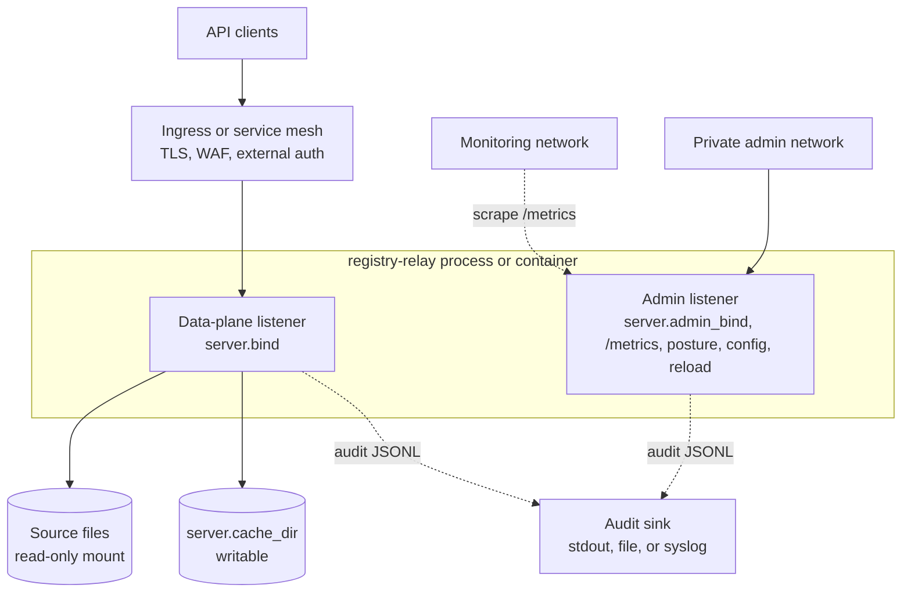

# registry-relay operations runbook

This runbook describes the V1 operating model for running Registry Relay in development, staging, and production-like deployments.

## Deployment model

Recommended production topology:

- Run one `registry-relay` process or container per deployment unit.
- Bind the data plane on `server.bind`, usually `0.0.0.0:8080` in a container.
- Put TLS, WAF rules, and external auth policy at the ingress or service mesh layer.
- Keep source files mounted read-only.
- Keep `server.cache_dir` writable by the Relay runtime identity. In the
  production container, that is distroless non-root UID/GID `65532:65532`.
- Prefer stdout audit records in containers and let the platform log pipeline retain, rotate, and forward them.
- When `server.admin_bind` is enabled, expose it only on an internal address or private network policy.

Container defaults:

```text
/etc/registry-relay/config.yaml       default config path
/var/lib/registry-relay/data          recommended source-data mount
/var/lib/registry-relay/cache         default writable cache mount when configured
/var/log/registry-relay               audit file mount for VM-style deployments
```

The binary exits non-zero if config parsing or validation fails, if required API-key hash environment variables are missing, or if listeners cannot bind.



*Recommended production topology. TLS, WAF, and external auth sit at the
ingress. The admin listener carries metrics, posture, governed config, and
reload operations and is reachable only from the private admin and monitoring
networks. Source files are read-only; the cache is writable; the public
data-plane listener does not mount `/metrics`.*

## Production hardening checklist

Run this gate before promoting any deployment beyond local demo use. Items that
are fully covered by an existing section link to it; items unique to this
checklist carry a one-line note.

### Network boundaries

- [ ] Public data-plane listener is behind TLS at the ingress or service mesh
  layer. See [Deployment model](#deployment-model).
- [ ] `server.admin_bind` is bound only to a private interface or loopback; it
  is not reachable through the public ingress. See [Deployment
  model](#deployment-model) and [Metrics](#metrics).
- [ ] `/metrics`, `/admin/v1/posture`, and reload routes are not accessible from
  `server.bind`. See [Admin posture and config apply](#admin-posture-and-config-apply).
- [ ] Rate-limiting is configured at the ingress for broad metadata discovery
  and aggregate endpoints.
- [ ] `server.trust_proxy` is disabled unless the gateway sits behind documented
  trusted proxy CIDRs. See [Configure](#configure).

### Auth and key rotation

- [ ] OIDC is preferred for multi-service deployments; API keys are acceptable
  only when a rotation and storage workflow is in place. See [API-key
  provisioning and rotation](#api-key-provisioning-and-rotation).
- [ ] Dataset scopes are granted narrowly: metadata, aggregate, rows,
  evidence-verification, and admin scopes are separate and not implied by one
  another.
- [ ] `scope_map` is reviewed whenever IdP role names change (OIDC deployments).
- [ ] Denied callers are tested for every exposed dataset and adapter before
  go-live.

### Secrets handling

- [ ] API-key hashes, `audit.hash_secret_env` material, OIDC client secrets,
  and database passwords are stored in the platform
  secret manager, not in YAML, image layers, shell history, crash reports, or
  issue trackers. See [API-key provisioning and rotation](#api-key-provisioning-and-rotation)
  and [Audit sink and rotation](#audit-sink-and-rotation).
- [ ] Full environment dumps are disabled in diagnostic tooling.

### Source data mounts

- [ ] File sources are mounted read-only. See [Deployment model](#deployment-model).
- [ ] Database credentials have read-only privileges.
- [ ] PostgreSQL sources are bounded by configured projections, filters, and
  limits; table ids, column names, source paths, and query text are not exposed
  through metadata unless explicitly published.
- [ ] `server.cache_dir` is writable only by the Relay service account (UID/GID
  `65532:65532` in the production container). See [Deployment model](#deployment-model).

### Audit sink

- [ ] An audit sink is configured before production use. See [Audit sink and
  rotation](#audit-sink-and-rotation).
- [ ] `audit.hash_secret_env` is set to at least 32 bytes of deployment-specific
  random secret material; the relay fails closed if it is missing or weak.
- [ ] Audit records are shipped off-host when completeness matters; local
  rotating files prove only the retained set's internal chain. See [Audit sink
  and rotation](#audit-sink-and-rotation).
- [ ] Identifier fields that need audit redaction carry `sensitive: true` in
  table or entity field config. Note:
  `sensitive: true` is audit-only; it does not hide fields from authorized
  responses.
- [ ] Bearer tokens, raw API keys, raw query values, row bodies, VC-JWTs, and
  unreviewed `detail` text are not logged.

### Metadata and Notary posture

- [ ] Portable metadata is validated before deployment (`just
  metadata-validate-profiles`). See [Build and release](#build-and-release).
- [ ] Runtime backend URLs, source paths, scope names, and table ids are absent
  from portable metadata manifests.
- [ ] Scoped runtime metadata is not placed in shared public caches.
- [ ] Registry Notary claim evaluation and credential issuance stay outside
  Relay. Relay holds no issuance signing key. Any Relay-native consultation is
  activated only from the complete reviewed artifact closure and a dedicated
  durable state plane.

### Container runtime policy

- [ ] Production images use the `Dockerfile` (distroless `cc-debian12:nonroot`,
  UID/GID `65532:65532`). `Dockerfile.demo` is not used as production runtime
  evidence.
- [ ] No shell, package manager, `curl`, or `wget` dependencies are present in
  the production runtime stage; healthcheck uses `registry-relay healthcheck`.
- [ ] Writable mounts (`server.cache_dir`, `audit.sink: file` path) are owned
  by UID/GID `65532:65532`. See [Deployment model](#deployment-model).
- [ ] TLS client behavior is verified after any base-image change by exercising
  an HTTPS OIDC JWKS/discovery path or a PostgreSQL TLS connection.

### Readiness gates

- [ ] Liveness (`/healthz`) and readiness (`/ready`) probes are configured in
  the orchestrator. See [Readiness and probes](#readiness-and-probes).
- [ ] Startup time allows for the largest XLSX/Parquet ingest before readiness
  is declared. See [Readiness and probes](#readiness-and-probes).
- [ ] Alerts are set on startup validation failures, source ingest failures,
  audit sink failures, and auth provider failures.
  See [Metrics](#metrics).
- [ ] Degraded-source behavior and readiness expectations are tested in staging
  with production-shaped data sizes.
- [ ] The exact config, binary version, feature flags, and metadata manifest are
  recorded for each deployment.

### Pre-promotion test gate

Run the closest practical checks for the enabled feature set before promoting
any image:

```sh
just fmt-check
just lint
just test-default
just test
just build
just metadata-validate-profiles
```

When optional adapters are enabled, run focused all-feature integration tests
for those adapters before exposing them to consumers.

## Build and release

Build a local release binary:

```sh
just build
```

Build a container image:

```sh
scripts/build-image.sh registry-relay:<version>
```

The helper verifies that the local `registry-manifest` build context is a clean
checkout at the reviewed commit. Set
`REGISTRY_RELAY_ALLOW_UNPINNED_LOCAL_CONTEXTS=1` only for local development
builds that will not be published.

The base image is built with no optional Cargo features. Standards-enabled
release or lab images must opt in explicitly:

```sh
REGISTRY_RELAY_FEATURES=spdci-api-standards,standards-cel-mapping,ogcapi-edr \
  scripts/build-image.sh registry-relay:<version>-standards
```

If release notes claim SP DCI, standards CEL mapping, or OGC EDR support, record
the standards-enabled image tag or digest in the release evidence.

The build requires the pinned `registry-platform`, `registry-manifest`, and
`crosswalk` source trees because Relay uses sibling path dependencies. For
local builds, keep those checkouts next to this repository or set
`REGISTRY_PLATFORM_DIR`, `REGISTRY_MANIFEST_DIR`, and `CROSSWALK_DIR` before
running `scripts/build-image.sh`.

Before promoting an image, inspect the effective config and verify that every env-backed `fingerprint.name` is supplied by the runtime environment and resolves to a `sha256:<64 lowercase hex chars>` fingerprint.
Do not bake API keys or API-key hashes into the image.

If the runtime config uses `metadata.source.path`, validate the manifest and
runtime bindings before promotion:

```sh
just metadata-validate path/to/metadata.yaml
cargo test --test demo_configs_load
```

For standalone metadata publication, use `just metadata-publish` and publish the
generated `index.json` as the discovery entry point. See [metadata.md](metadata.md)
for the bundle layout.

For releases that claim DCAT-AP interoperability, validate an exported
`/metadata/dcat/bregdcat-ap` with the SEMIC validator:

```sh
just validate-catalog-semic catalog=target/metadata.bregdcat-ap.jsonld
```

The release workflow uploads both the generated catalog and the SEMIC
JSON report as artifacts. Treat `dcatap.3_0_1_base` as the minimum
external profile; use stricter SEMIC profiles such as
`dcatap.3_0_1_full` when the deployment is intended to satisfy the full
European profile.

## Configure

Set the config path with `--config <path>` or `REGISTRY_RELAY_CONFIG`. The container image defaults to:

```sh
registry-relay --config /etc/registry-relay/config.yaml
```

Important configuration blocks:

- `server.bind`: public data-plane listener.
- `server.admin_bind`: optional admin listener. Intended for metrics, posture, capabilities, and reload on a restricted network.
- `server.cache_dir`: writable cache for normalized Parquet files and ingest state.
- `server.cors.allowed_origins`: default deny when empty.
- `server.trust_proxy`: only enable when the gateway is behind trusted proxies and those proxy CIDRs are configured.
- `auth.api_keys`: key ids, hash env var names, and scopes.
- `consultation`: optional restart-only authorized workload, PostgreSQL state
  plane, hash-pinned artifact closure, pseudonym material references, and
  source credential references.
- `config_trust`: optional signed bundle trust anchor, bundle path, anti-rollback state, and local break-glass override path.
- `datasets[].source.path`: local file path inside the container or host.
- `datasets[].refresh`: `mtime`, `interval`, or `manual`.
- `audit`: audit sink and JSONL options.

Startup config changes remain a rolling restart operation. With
`config_trust`, Relay verifies a signed local Config Bundle v1 directory at
boot, validates anti-rollback state, and starts from the embedded config. There
is no admin config apply route and no hot apply. Dataset reload does not reload
startup `config.yaml`.

## Operating with Registry Notary

Registry Relay is the protected registry consultation service. Registry Notary
owns claim evaluation, credential issuance, and attestation. With a maintained
native consultation profile, Notary sends an authenticated purpose and one
bounded input to Relay. Relay executes only the profile's hash-pinned minimized
source plan and returns its closed result envelope after durable completion.
Relay can also publish metadata evidence offerings that point clients to
Notary. Native consultation does not move claim evaluation or issuance signing
keys into Relay.

For a combined Relay and Notary deployment, use OIDC rather than a Relay API
key. Bind the
`consultation.authorized_workload` audience and exact `azp` or `client_id` to the
Notary service account, grant only the scope pinned by each public contract,
and keep the PostgreSQL URL, pseudonym material, and source credentials behind
the environment references named by the configuration. Configuration changes,
artifact changes, and secret generation changes require a restart.

Keep raw tokens and signing material out of YAML. Use service environment
variables such as `REGISTRY_RELAY_CONFIG`, `REGISTRY_RELAY_BIND`,
`REGISTRY_RELAY_LOG_FORMAT`, and `REGISTRY_RELAY_ENV_FILE`; use secret
indirection fields ending in `_env` for token hashes, audit secrets, signing
keys, database URLs, and source credentials.

### Bootstrap native consultation state

Bootstrap is an offline, idempotent deployment step. Relay does not create a
database or database roles. A DBA must first provision one writable PostgreSQL
16 through 18 primary, one migration login, and four distinct bound roles:

- an existing superuser login used only for the migration session;
- an isolated `NOLOGIN`, non-superuser owner role with `CREATE` on the target
  database;
- an isolated, non-superuser runtime login used by the normal Relay process;
- an isolated, non-superuser audit-pseudonym maintenance login;
- an isolated, non-superuser audit-pseudonym investigation-reader login.

The owner, runtime, maintenance, and reader roles must have no role memberships
and no create-role, create-database, replication, row-security-bypass, or
superuser privilege. The migration login is deliberately not used by the
serving process. The three login roles need `CONNECT` on the target database;
the owner needs `CREATE` there.

Store each connection URL in the deployment secret store. The runtime URL's
environment reference is already named by
`consultation.state_plane.database_url_env`. Supply only the other environment
reference names, the non-secret owner role, and the explicit key lifecycle on
the bootstrap command line:

```sh
registry-relay consultation bootstrap-state \
  --config /etc/registry-relay/config.yaml \
  --env-file /run/secrets/registry-relay-bootstrap.env \
  --migration-database-url-env REGISTRY_RELAY_STATE_MIGRATION_URL \
  --owner-role relay_state_owner \
  --keyring-maintenance-database-url-env REGISTRY_RELAY_STATE_KEYRING_MAINTENANCE_URL \
  --keyring-reader-database-url-env REGISTRY_RELAY_STATE_KEYRING_READER_URL \
  --active-key-id epoch-1 \
  --active-write-deadline-unix-ms "$ACTIVE_WRITE_DEADLINE_UNIX_MS" \
  --audit-event-retention-ms "$AUDIT_EVENT_RETENTION_MS"
```

Use a deployment-reviewed future deadline and a retention interval that matches
the audit policy. PostgreSQL supplies the authoritative activation time. Record
the exact bootstrap inputs in deployment configuration management: rerunning
the same command attests the installed schema and keyring, while a different
schema identity, role binding, lock identity, key id, deadline, or retention
value is refused as drift. Successful output contains only status values:

```json
{"schema":"registry.relay.consultation-bootstrap-state.v1","state_plane":"installed_or_attested","keyring":"initialized"}
```

Run `registry-relay doctor` first, bootstrap before starting the first Relay
replica, then start all replicas with only the runtime database URL. Keep the
migration, maintenance, and reader credentials outside the serving workload.
The maintained DHIS2 profile has an end-to-end deployment checklist in its
[`README`](../profiles/dhis2-2.41.9-enrollment-status/README.md).

For side-by-side local compose stacks, keep the public host ports distinct
while letting each container use its internal default listener. A common
convention is Relay on host `18080` mapped to container `8080`, and Notary on
host `18081` mapped to its container listener. Native local runs usually use
Relay `127.0.0.1:8080` and Notary `127.0.0.1:8081`; align source `base_url`
values with the network where Notary runs.

## API-key provisioning and rotation

API-key config stores only:

- a stable key id;
- an environment variable name holding the SHA-256 fingerprint of the raw key;
- the key's scopes.

Recommended rotation procedure:

1. Run `registry-relay generate-api-key --id <key_id>`.
2. Store the emitted `fingerprint` in the deployment secret store.
3. For a secret-plane rotation, keep the same `fingerprint.name` and restart or roll Relay after the secret changes.
4. For a bundle-governed rotation, publish the fingerprint under a new immutable or versioned reference, ship a signed bundle that changes only that reference, and roll Relay.
5. Confirm the new key can call the intended lowest-privilege endpoint.
6. Update the consumer to use the emitted raw `api_key`.
7. Remove the old key entry or old secret after callers move.

Live keyring reload is not wired in V1. Treat key rotation as a rolling restart operation.

Never log raw keys, fingerprints, or full environment dumps. In issue reports, include only key ids and scope names.

## Credential issuance migration

Relay no longer owns response credential issuance, DID hosting, credential schemas, credential contexts, or signing-key rotation. Remove `provenance:` and entity `publicschema:` blocks from Relay config, remove Relay issuance signing secrets from the runtime secret store, and remove probes for `/.well-known/did.json`, `/schemas/{claim_type}/{version}`, and `/contexts/{vocab}/{version}`.

Use Registry Notary for credential issuance, evidence verification, issuer metadata, and signing-key operations. Relay should only publish evidence offering metadata that lets clients discover the relevant Notary service.

## Audit sink and rotation

Audit records are JSON Lines and are separate from operational logs. Operational logs go to stderr as readable text by default. Set `REGISTRY_RELAY_LOG_FORMAT=json` or `REGISTRY_RELAY_LOG_FORMAT=jsonl` when operational logs should be emitted as JSON Lines for collection or redirected files.

Current runtime behavior:

- The public and admin listeners cap accepted sockets with `server.max_connections`, close incomplete HTTP/1 headers after `server.http1_header_read_timeout`, and bound request-body reads with `server.request_body_timeout`. Direct HTTP/2 serving uses the same finite connection cap and keepalive timeout, but production deployments that terminate HTTP/2 at a reverse proxy must set bounded proxy header/body read timeouts and per-client connection limits before forwarding to the relay.
- `audit.sink: stdout` writes audit JSONL to stdout.
- `audit.sink: file` writes audit JSONL to the configured path and rotates in-process by `rotate.max_size_mb` and `rotate.max_files`.
- `audit.sink: syslog` ships audit JSONL to the local syslog Unix datagram socket.
- Audit output is always wrapped in `registry-platform-audit` envelopes with `prev_hash` and `record_hash` fields. These fields detect edits, reordering, and gaps inside the retained log set, starting from the first retained record. They do not prove that earlier records were never deleted, or protect against a writer that can rewrite the entire local sink. Use off-host audit shipping when completeness matters. `audit.chain` is retained for config compatibility.
- HTTP request completion is logged at `info` with method, matched route template, request id, status, and latency. It does not log raw query strings, request bodies, auth headers, or row values.
- `REGISTRY_RELAY_LOG_FORMAT=json` switches stderr operational logs from text to JSONL.

File sink example:

```yaml
audit:
  sink: file
  format: jsonl
  hash_secret_env: REGISTRY_RELAY_AUDIT_HASH_SECRET
  path: /var/log/registry-relay/audit.jsonl
  rotate:
    max_size_mb: 100
    max_files: 14
```

For container deployments, `stdout` is still the simplest default because the platform log pipeline owns retention, rotation, access control, and SIEM forwarding. For VM deployments, use `file` when the gateway should own audit rotation locally, or `syslog` when the host forwards records to a central collector.

`audit.hash_secret_env` is required for runtime startup and must point to at least 32 bytes of deployment-specific random secret material. The relay fails closed when the setting is missing, empty, unset, or weak, so sensitive audit lookup hashes never silently downgrade to unkeyed SHA-256.

Audit records must not contain raw secrets or raw API keys. Mark identifier fields as `sensitive: true` in table or entity field config when query values should be deterministically hashed in audit rather than omitted entirely. As of v0.8, the flag is audit-only; it does not remove fields from authorized API responses.

**Data-Purpose audit semantics** (frozen): when the `Data-Purpose` header is present on an ordinary entity or feature request, its value is always recorded verbatim in the audit trail (`purpose` field). Header presence can be required per entity via `require_purpose_header: true`; a missing header returns `400 auth.purpose_required`. Without an entity `governed_policy`, purpose values are not enforced or compared on those ordinary reads. With an entity `governed_policy`, governed evidence-gateway routes evaluate the configured PDP purpose allowlist and return stable `pdp.*` denials. Value-level allowlists remain additive opt-in configuration. Native `/v1/consultations/.../execute` requests instead validate the purpose against the hash-pinned public contract before dispatch and record pseudonymous durable consultation evidence.

## Dataset refresh and reload

Refresh modes:

- `mtime`: poll source file modification time and reload when it changes. The default poll interval is 60 seconds.
- `interval`: reload unconditionally on the configured interval.
- `manual`: reload only through an admin request.

The original source file is never modified. On single-resource ingest failure, the service keeps serving the previously loaded table and marks readiness degraded when no prior generation is ready.

Manual table reload:

```sh
curl -X POST -H "Authorization: Bearer $ADMIN_API_KEY" \
  http://127.0.0.1:8081/admin/v1/datasets/social_registry/tables/individuals_table/reload
```

Manual source-resource reload:

```sh
curl -X POST -H "Authorization: Bearer $ADMIN_API_KEY" \
  http://127.0.0.1:8081/admin/v1/reload
```

The reload-all response includes `status` and aggregate `counts` for total, succeeded, and failed resources. Reload-all prepares every configured source resource before publishing any of them; if any resource cannot prepare, Relay keeps the previous coherent generation active and returns HTTP 500 with `status: "failed"`. Inspect the audit and operational logs for the resource-level failure context. This route reloads configured source resources, not startup runtime config.

## Admin posture and config bundles

Admin capabilities and operations posture are read-only admin-listener routes with their own scope:

```sh
curl -H "Authorization: Bearer $OPS_READ_API_KEY" \
  http://127.0.0.1:8081/admin/v1/capabilities

curl -H "Authorization: Bearer $OPS_READ_API_KEY" \
  http://127.0.0.1:8081/admin/v1/posture
```

Use `?tier=restricted` only for trusted operations users who need the restricted projection. The default projection is redacted for broader operational sharing.

The independent `registry_relay:admin` scope still protects reload operations:

```text
POST /admin/v1/reload
POST /admin/v1/datasets/{dataset_id}/tables/{table_id}/reload
```

There are no Relay admin routes for config verify, dry-run, or apply. Signed
config bundles are local boot artifacts. Verify a candidate bundle before
promotion with `registry-relay config verify-bundle`, place the accepted bundle
and trust anchor on the node, then restart Relay. Startup verification emits the
acceptance audit event before anti-rollback state is advanced.

Break-glass is file-based and evaluated only during boot. A rollback override
may accept the exact signed bundle hash named by the root-owned override file.
An `accept_unsigned` override may pin an absolute local config path and hash for
emergency startup; it does not advance the signed bundle high-water mark.

## Governed config CLI

The `registry-relay config` command group verifies boot-time signed config
bundles from the command line.

```text
registry-relay config verify-bundle <flags>
```

### config verify-bundle

`verify-bundle` verifies the local bundle directory, checks anti-rollback state
read-only, validates the embedded Relay config, and prints a
`registry.platform.config_apply_report.v1` JSON report to stdout. It never
persists state and never contacts a running gateway.

Flags:

- `--bundle-dir`: local config bundle directory. Required.
- `--anchor-path`: local trust anchor JSON path. Required.
- `--state-path`: anti-rollback state path. Required.

The result vocabulary is `verified`, `rejected_signature`,
`rejected_binding`, `rejected_validation`, `rejected_rollback`, and
`internal_error`.

Example:

```sh
registry-relay config verify-bundle \
  --bundle-dir /etc/registry-relay/config/bundle \
  --anchor-path /etc/registry-relay/config/trust-anchor.json \
  --state-path /var/lib/registry-relay/config-state/antirollback.json
```

## Readiness and probes

Use:

```text
GET /healthz
GET /ready
```

`/healthz` is liveness only and does not check datasets. `/ready` returns 200 only when configured resources have ingested successfully once the readiness watch is installed. On ingest failures it returns `503 application/problem+json` with failed or not-ready resources.

In orchestrators:

- Use `/healthz` for liveness.
- Use `/ready` for readiness and traffic gating.
- Give startup enough time for the largest XLSX/Parquet ingest.

## Metrics

When `server.admin_bind` is configured, the admin listener exposes:

```text
GET /metrics
```

The response is Prometheus-style `text/plain` suitable for scraping from the private admin network. The public data-plane listener does not mount `/metrics`.

Metrics are intentionally bounded. Request metrics use low-cardinality labels such as method, route or endpoint class, and status, plus request-duration buckets. Readiness metrics are gauges derived from the ingest readiness snapshot. Metrics must not include raw query values, raw bearer tokens, request ids, API-key ids, key fingerprints, `Data-Purpose` values, or dataset row content.

Recommended scrape posture:

- Scrape only the admin listener from a private monitoring network.
- Use a credential with `registry_relay:metrics_read`.
- Treat `/metrics` as operational telemetry, not an audit record or per-request trace.
- Use audit logs for security review and request-level accountability.
- Alert on readiness gauges and elevated 5xx/error counters before routing traffic away.

## Troubleshooting

Config fails at startup:

- Check YAML shape against [config/example.yaml](../config/example.yaml).
- Confirm every env-backed `fingerprint.name` variable is set.
- Confirm each referenced fingerprint value is a `sha256:<64 lowercase hex chars>` fingerprint.
  For API keys, regenerate a raw key and fingerprint with `registry-relay generate-api-key --id <key_id>`, then store the emitted fingerprint under the configured reference.
- Confirm ids are lower-snake and unique.
- Check vocabulary prefixes used by `concept_uri` and `conforms_to`.
- For `metadata.manifest.*` errors, validate the portable metadata manifest.
- For `runtime.binding.*` errors, compare runtime dataset, entity, field, filter, and relationship ids with the compiled metadata manifest.

Protected endpoint returns 401:

- Confirm the request has `Authorization: Bearer <key>` or `x-api-key`.
- Confirm the raw key hashes to one configured fingerprint.
- Confirm the process was restarted after key changes.

Protected endpoint returns 403:

- Confirm the key has the exact scope named by the entity access block.
- Remember that metadata, aggregate, rows, evidence verification, and admin scopes do not imply one another.
- For row or OGC feature endpoints on entities with `require_purpose_header: true`, include `Data-Purpose`.

Dataset or entity returns unknown-resource errors:

- Confirm the public path uses the entity `name`, not the backing table id.
- Confirm entity relationships target entities in the same dataset.
- Confirm field filters use exposed entity field names, not hidden storage columns.

Readiness is 503:

- Inspect stderr operational logs for ingest errors.
- Check the source file exists at the path visible to the container or process.
- For XLSX, ensure the configured sheet is a clean rectangular table. Use `header_row` and `data_range` when the file has surrounding notes.
- Confirm strict schema fields match the source columns and types.
- Confirm `server.cache_dir` is writable.

Audit records missing:

- In containers, check stdout, not stderr.
- Confirm `audit.include_health` if expecting `/healthz` records. `/ready` is
  always excluded so its zero-backlog shipping check cannot invalidate itself.
- For `audit.sink: file`, confirm the parent directory exists or can be created
  by the Relay runtime identity. In the production container, that is UID/GID
  `65532:65532`.
- For `audit.sink: syslog`, confirm the host exposes the expected Unix datagram socket (`/var/run/syslog` on macOS, `/dev/log` on other Unix platforms).

Admin reload fails:

- Confirm `server.admin_bind` is configured and reachable only from the private admin network.
- Confirm the key has the independent `registry_relay:admin` scope.
- Check the per-resource `error_code` in the reload-all response. Use the table-specific endpoint to retry one failed source after correcting the underlying data or connectivity issue.

Metrics missing:

- Confirm you are scraping the admin listener, not `server.bind`.
- Confirm `server.admin_bind` is configured and reachable from the monitoring network.
- Confirm the scrape credential has `registry_relay:metrics_read`.
- Expect `/metrics` on the public listener to be unavailable. Depending on the auth stack, the response may be `401` rather than `404`.
