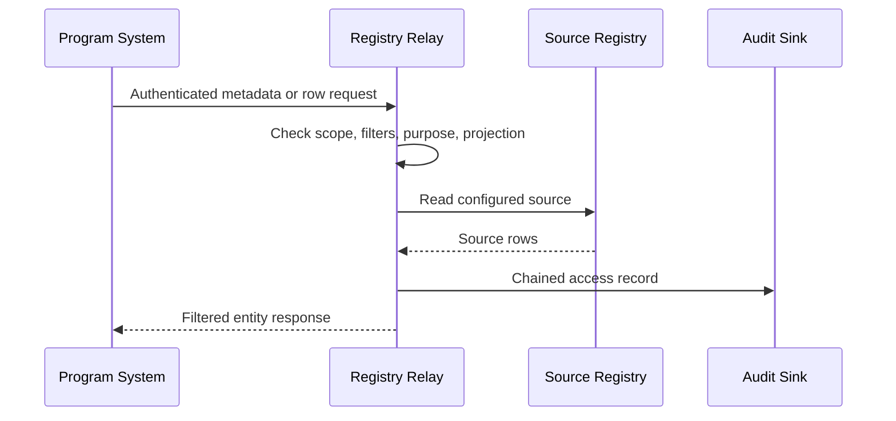
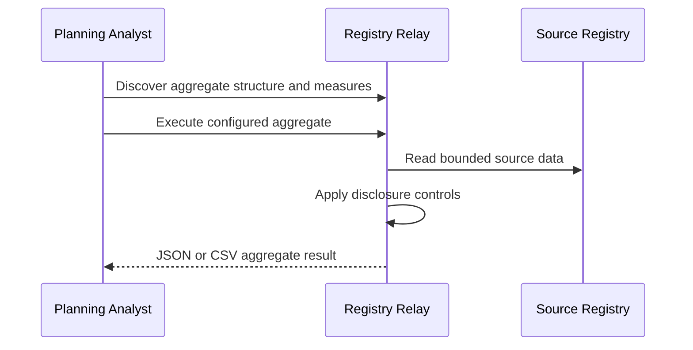
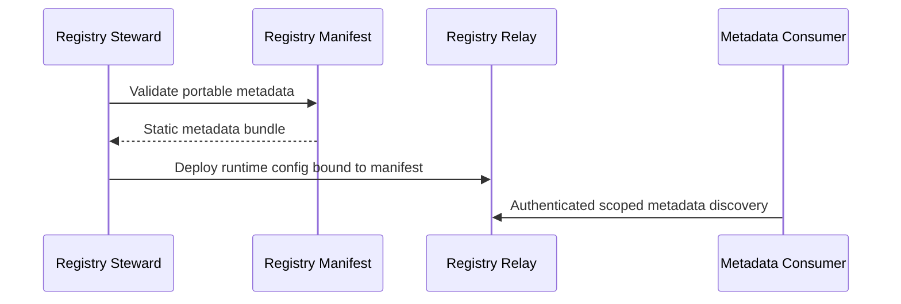
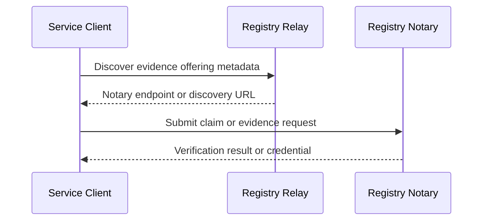

# Registry Relay scenario catalog

This catalog describes where Registry Relay fits in registry programs. It is a
product and demo guide, not a REST specification.

Status labels:

| Status | Meaning |
| --- | --- |
| Supported | Works in the current Relay runtime with focused tests or demo coverage |
| Lab-supported | Can be shown with demo config or scripts, but still needs operator hardening |
| Partial | Important runtime pieces exist, with named gaps |
| Planned | Not yet supported |
| Out of scope | Not a Relay responsibility |

## Personas

| Persona | What They Need |
| --- | --- |
| Registry steward | Publish protected consultation APIs without exposing source systems directly |
| Program system | Read the minimum registry data or aggregate needed for a service workflow |
| Planning analyst | Query configured aggregates without enumerating sensitive rows |
| Metadata consumer | Discover datasets, schemas, policies, profiles, and standards surfaces |
| Auditor | Reconstruct who accessed what, for which purpose, and under which scope |
| Standards integrator | Consume Relay through DCAT, OGC, SP DCI, or Registry Notary discovery contracts |

## Systems

| System | Role |
| --- | --- |
| Source registry | Operational system of record, such as CSV, XLSX, Parquet, or PostgreSQL |
| Registry Relay | Read-only gateway, metadata publisher, standards adapter, and audit emitter |
| Registry Manifest | Portable metadata source used for static publication and runtime metadata |
| Registry Notary | Claim evaluation, evidence verification, credential issuance, and verification semantics |
| Service portal or case system | Calls Relay or Notary during a service workflow |
| Audit sink | Receives chained platform audit records |
| Standards consumer | Reads OGC, DCAT, SP DCI, Registry Notary discovery, or OpenAPI views |

## Reusable patterns

### Protected registry consultation

### Aggregate-only planning

### Metadata publication

### Relay to Registry Notary handoff

## Scenario matrix

| # | Scenario | Pattern | Status | Main Gap |
| --- | --- | --- | --- | --- |
| 1 | Case system reads a household record with required filters | Protected consultation | Supported | Clients must use the dataset-scoped V1 route shape |
| 2 | Case system follows a dataset-local relationship | Protected consultation | Supported | Cross-dataset relationships remain client-composed |
| 3 | Planning analyst runs district-level eligibility aggregates | Aggregate-only planning | Supported | Per-caller query budgets are not a V1 feature |
| 4 | Operator publishes portable metadata separately from Relay runtime | Metadata publication | Supported | Static publication is manual; no managed release process yet. |
| 5 | Metadata consumer reads DCAT and SHACL views | Metadata publication | Supported | Profile coverage depends on manifest quality |
| 6 | Auditor traces row access through platform audit records | Governance | Supported | External audit storage is deployment-owned |
| 7 | Client requests a signed credential from Registry Notary after Relay discovery | Notary handoff | Supported | Relay publishes evidence offering discovery only |
| 8 | Client discovers evidence offerings and calls Registry Notary | Notary handoff | Supported | Notary request semantics live in Notary docs |
| 9 | GIS consumer reads spatial entities through OGC API Features | Standards adapter | Supported | Requires spatial config and feature build |
| 10 | Catalog consumer reads metadata through OGC API Records | Standards adapter | Supported | Records surface is metadata-only |
| 11 | EDR consumer queries admin-area aggregates | Standards adapter | Lab-supported | Requires configured spatial aggregates and feature build |
| 12 | SP DCI sync consumer calls a configured registry adapter | Standards adapter | Lab-supported | Async DCI APIs are out of scope |
| 14 | Program system writes registry data through Relay | Write workflow | Out of scope | Relay V1 is read-only |
| 15 | Relay performs local evidence verification | Evidence verification | Out of scope | Registry Notary owns verification execution |
| 16 | Relay enforces row-level authorization expressions | Fine-grained auth | Planned | V1 uses scopes, filters, purpose headers, and projection |

## Demo coverage

The demo configs cover benefits casework, clinic capacity, education, public
works, subject linkage, disability registry sync, and cross-demo workflows. Use
them as scenario fixtures rather than as production policy.
