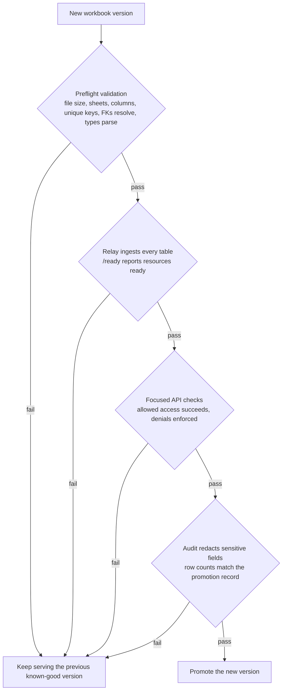

# XLSX Readiness Contract

A government office, agricultural authority, or other registry owner keeps its
records in an Excel workbook. You want callers to read those records through a
protected HTTPS API, without anyone touching the file directly or seeing raw
sheet names and columns. That is what Registry Relay does over an XLSX source.

It works only if the workbook behaves like a small read-only database: stable
columns, real keys, parseable types, no formulas pretending to be data. This
document lists the conditions a workbook has to meet before Relay can serve
it.

The contract does not make a spreadsheet trustworthy on its own.
Authorization, purpose limitation, audit, and legal basis stay on the
deployment. See [configuration.md](configuration.md) and [ops.md](ops.md) for
how the items below map to runtime config and the steps to publish a new
version.

## When To Use XLSX

Good fit:

- Someone else owns the file and produces it on a schedule (weekly export,
  monthly extract).
- Callers only need to read.
- The data fits in memory and reloads cleanly on a clock or admin trigger.

Bad fit:

- Writes, concurrent editing, transactional updates.
- Caller-controlled queries or live sync.

For those, use a database source instead.

## Workbook Contract

A workbook is ready to use as a Relay source only when every item below is
true.

### Structure

Relay reads a workbook by addressing one rectangular range per table. Anything
outside that range (titles, totals, comments, formatting) is invisible to
ingest; anything inside it has to parse cleanly.

- Sheet names used by Relay are stable and documented.
- Each Relay table maps to one rectangular worksheet range.
- The configured `header_row` points to a single row of unique column names.
- Required columns are present with stable names.
- Notes, titles, and totals are outside `data_range`.
- Merged cells, hidden rows or columns, comments, styling, and filters carry
  no ingestion semantics.

### Identity

Relay uses the primary key to address rows in URLs, audit records, and foreign
keys from other sheets. A key that changes between exports, duplicates within
a sheet, or is just a row number breaks all of that.

- Every exposed entity has one configured primary key column.
- Primary key values are non-empty after trimming, unique within the range,
  and stable across exports. Row numbers are not keys.

### References

Foreign keys are how Relay stitches sheets together into entities and
relationships. A reference that points at a row that doesn't exist (or used
to) surfaces as a silent join failure, worse than no reference at all.

- Foreign key columns reference documented target sheets and key columns.
- Required references resolve before promotion. Optional references are
  declared nullable in the Relay schema.
- Broken or unresolved references surface as explicit data quality records,
  not silent key corruption.

### Types

Relay parses each column according to a configured type. Excel can present the
same value as a number, a string, or a formula result depending on the cell,
so the workbook has to pick one form per column and stick with it.

- Dates use a parseable date format or native Excel dates, consistently within
  each column.
- Numbers use numeric cells, not display-formatted strings, unless the field
  is intentionally typed `string`.
- Booleans use one declared convention per column (`true`/`false`, `yes`/`no`,
  `1`/`0`).
- Non-nullable fields have no empty cells. Nullable fields declare what empty
  means.
- Formulas are not the source of truth unless formula output is explicitly
  tested. Prefer materialized values.

### Codes

Registries usually carry local code lists for status, type, role, and
lifecycle. Relay treats them as opaque strings unless told otherwise, so
undocumented or inconsistent values flow through unchecked and surface in
caller queries.

- Local code lists for status, type, role, eligibility, and lifecycle fields
  are documented.
- Code values are normalized (case, spelling, whitespace) before promotion, or
  Relay/mapping logic handles the variants explicitly.
- Unknown code values fail validation or route to manual review; they are not
  accepted as ordinary active records.
- Cross-system mappings (local fields to PublicSchema concepts) live in
  metadata or mapping config, not the workbook.

### Privacy

The workbook is the perimeter. Anything in a cell is something Relay might
serve, filter on, audit, or include in an error message.

- Sensitive columns are identified before exposure and marked
  `sensitive: true` in Relay config when they may appear in filters, audit, or
  errors.
- The workbook avoids unnecessary direct identifiers (full phone numbers,
  exact addresses, national IDs) unless the use case requires them.

### Provenance

Relay treats a workbook as immutable between reloads. If you edit the file
underneath, Relay's view of the data drifts from the source, and replaying an
old audit log no longer matches what callers now see.

- Source authority, export date, and dataset version are recorded inside or
  alongside the workbook.
- The file is mounted read-only for Relay and is not edited in place while
  Relay is reading it.
- Same workbook plus same config produces the same entity records.

## Anti-Patterns

- Worksheet row numbers as public identifiers.
- Color coding, comments, hidden columns, or filters carrying data meaning.
- Exposing a whole operational workbook when a minimized projection is enough.
- Multiple logical tables inside one worksheet range.
- Formulas, pivots, or external workbook links defining served values without
  tests.
- Accepting unknown statuses as ordinary active records.
- Using aggregates to leak small groups or rare records.
- Storing API keys or secrets in workbook cells.
- Editing source files in place while Relay is reading them.

## Example Workbook Contract

Illustrative. Relay does not require this file; deployments can use one to
make preflight validation concrete.

```yaml
workbook: farmer-registry.xlsx
owner: ministry-of-agriculture
tables:
  - sheet: Farmers
    header_row: 1
    primary_key: farmer_id
    required_columns: [farmer_id, given_name, family_name, registration_status]
    sensitive_columns: [national_id]
    fields:
      registration_status:
        type: string
        allowed_values: [active, inactive, pending_verification, deceased_reported]
  - sheet: FarmerIdentifiers
    header_row: 1
    primary_key: identifier_id
    foreign_keys:
      - column: farmer_id
        references: { sheet: Farmers, column: farmer_id }
```

## Promotion Check

A workbook version is ready when:

- Preflight validation passes (file exists and is under
  `server.xlsx_max_file_bytes`, sheets and columns exist, primary keys are
  unique, required FKs resolve, types parse).
- Relay ingests every configured table on a clean startup or admin reload,
  and `/ready` reports the dataset resources as ready.
- Focused API checks confirm allowed access succeeds and missing credentials,
  scopes, or purpose are denied where configured.
- Audit logs redact sensitive fields and retain enough context for
  investigation.
- Row counts and data quality exceptions match the promotion record.

If any item fails, keep serving the previous known-good version until the
source file or Relay config is fixed.



*The promotion pipeline. A workbook version is promoted only when every gate
passes; any failure keeps the previous known-good version in service.*
