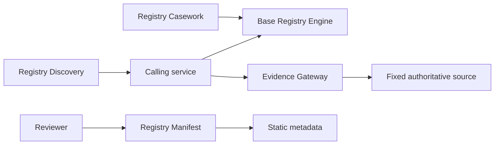

Registry Stack is a set of focused products. Each product owns its data, configuration, API, and
operational boundary. Base Registry Engine (BReg) is the governed record service.

## Product boundaries

- **Base Registry Engine** owns writable PostgreSQL records, governed changes, history, events, and
  its record API.
- **Evidence Gateway** evaluates predefined requirements against fixed sources and returns signed,
  minimum-disclosure assertions.
- **Registry Manifest** validates and renders portable static metadata.
- **Registry Discovery** serves a curated public index. Current contracts index Evidence providers.
- **Registry Casework** coordinates human review while mutations remain with the source system.
- **Registry Platform** supplies bounded primitives. It does not decide product policy.

Products are configured and deployed independently. A package, credential, trust decision, or audit
record from one product does not silently authorize another.

## Composition

Applications integrate through documented APIs and portable artifacts. BReg can supply governed
records through its own API. Evidence Gateway can call an explicitly configured source. Manifest
output can describe a service without controlling it. Discovery returns inert metadata that an
application must validate and accept locally.

A fixed authoritative source remains outside the Evidence Gateway product boundary. An
authenticated Base Registry Engine route can serve as such a source when its own authorization
permits the request; that composition does not merge the two products' trust boundaries.

The [Registry Manifest reference](../../products/registry-manifest/reference/) owns the current
metadata keys and field schemas.

{/* Evidence: crates/registry-breg/src/api/mod.rs; crates/registry-evidence/src/server.rs;
    crates/registry-manifest-core/src/lib.rs; crates/registry-discovery/src/query.rs. */}

## Next

- [Boundaries and map](../../map/boundaries-and-map/)
- [Records stay home](../records-stay-home/)
- [Security overview](../../security/)
