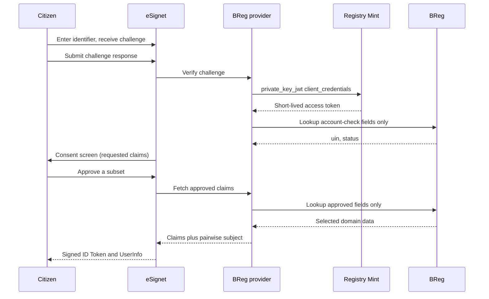

You run a population or civil registry on Base Registry Engine (BReg) and you want citizens to sign
in to public services with [eSignet](https://docs.esignet.io/), the open-source identity and
authentication service from the MOSIP project. The eSignet BReg provider is the piece that connects
the two. It lets eSignet resolve a verified identifier against your registry through one governed
lookup, and release only the demographic claims each citizen approves. This page explains what the
provider does, what your registry must grant it, and what it deliberately leaves out. It is the
adopter-facing account of
[registrystack/esignet-relay-authenticator v0.3.0](https://github.com/registrystack/esignet-relay-authenticator/releases/tag/v0.3.0).

{/* TODO[evidence]: provider behaviour (challenge verifier interface, PSUT derivation, claim
mapping, error codes, build outputs) lives in the separate registrystack/esignet-relay-authenticator
repository and cannot be anchored from this one. Re-verify the statements below against that
repository's README, docs/esignet-configuration.md, and docs/breg-lookup-contract.md at the next
release tag. */}

## Who owns what

eSignet owns the login experience and the OpenID Connect (OIDC) surface: the relying-party
registration, the authorization and token endpoints, the consent screen, and the signing and optional
encryption of ID Tokens and UserInfo responses. Relying parties talk to eSignet only. They never see
BReg.

BReg owns the registry: the population records, the access profiles that decide which client may
read which fields, the revision history, and the audit journal. It knows nothing about eSignet as a
product. From its side, the provider is one more client with one narrow grant.

Registry Mint issues the short-lived access token the provider presents to BReg. The provider
authenticates to Mint as a registered `private_key_jwt` client and never holds a long-lived registry
credential.

The provider itself is a Go module compiled into the eSignet host. eSignet selects it by setting the
authentication provider to `breg` and pointing it at one YAML configuration file. The provider
contributes three things: it verifies the citizen's challenge, it performs the governed lookup, and it
derives the claims and the pairwise subject that eSignet then signs. Everything else stays with
eSignet.

{/* Evidence: crates/registry-mint/src/lib.rs, crates/registry-mint/src/assertion.rs, and
crates/registry-mint/src/clients.rs implement RFC 7523 private_key_jwt client authentication for
the client_credentials grant that the provider uses to obtain its BReg access token. */}

## The login flow

A login takes two round trips into your registry at most, and none until the citizen has proved
possession of their identifier.



The order matters for data protection:

1. **Challenge first.** The provider verifies the citizen's one-time code or other challenge before
   any registry call. A wrong code never reaches BReg or Mint, so the registry is not an oracle for
   guessing identifiers.
2. **Account check with the smallest projection.** After a correct challenge, the provider looks up
   the identifier and asks BReg for only the fields named in `account_check_fields`, typically the
   identifier and a status field. Which records resolve at all is the access profile's decision: a
   profile scoped to active records makes inactive ones unresolvable, and the provider reports that
   as a denied subject.
3. **Fresh consent every time.** eSignet shows the consent screen on every login. The provider
   installs no remembered consent, so a citizen who approved their birthdate last month is asked
   again today.
4. **Second lookup limited to the approved intersection.** The provider computes the intersection of
   the claims the citizen approved, the claims named in `claim_map`, and the fields the access profile
   provisions. It asks BReg for exactly that set. If the intersection is empty, it makes no call at
   all.
5. **Only domain data becomes claims.** The provider reads the record's domain data and ignores
   envelope metadata such as revision numbers, timestamps, and links.

Authentication state between the challenge and consent steps is held server-side for five minutes and
bound to the relying party, the client, and the transaction. A context that expires or is presented
by a different party fails with a dedicated error code rather than a silent retry.

## The governed lookup

The provider reaches your registry through a single fixed BReg operation: a lookup on the route you
name, with the selector you name, under the access profile you grant. On the wire that is a `POST`
to the route's `:lookup` operation, with `accessProfile` and `$select` query parameters and a JSON
body carrying the selector and the verified identifier.

```http
POST /v1/records/population:lookup?accessProfile=esignet-source&$select=uin,status
Authorization: Bearer <Mint access token>
Content-Type: application/json
Accept: application/json

{"selector":"by-uin","values":{"uin":"<verified identifier>"}}
```

The `$select` list is never wider than the configured provisioned fields, and BReg enforces the
same ceiling on its side through the access profile. A misconfigured provider that asked for more
than the profile grants receives a denial, not extra data.

{/* Evidence: crates/registry-breg/src/compiler.rs maps Operation::Lookup to POST on the
"{base}:lookup" path, and crates/registry-breg/src/api/metadata.rs documents the accessProfile and
$select query parameters the lookup accepts. docs/site/src/content/docs/reference/breg-api.mdx is
the adopter-facing reference for the same route family. */}

## What your registry must grant

On the BReg side, integration is an access-control decision expressed in the registry project, not
a code change. The provider needs:

- **One selector profile** on the population route, for example `by-uin`, that resolves exactly one
  record from one identifier field. The provider fails rather than picking among several matches.
- **One access profile** dedicated to eSignet, for example `esignet-source`, granting only the
  `lookup` operation and only the fields the provider may ever project. Leave `get`, `list`, and all
  write operations out of it. The provider never lists or writes, so a profile that permits either is
  wider than the integration needs.
- **A required scope only the provider holds.** `accessProfile` is a request parameter, so the
  profile's name isolates nothing on its own: any authenticated caller whose token satisfies the
  profile's principal claim, purposes, and row boundaries can select it. Give the profile a
  `requiredScopes` entry, for example `registry:esignet:lookup`. A profile with no required scope
  raises `access.profile.no_required_scope` when you check the project.
- **A field list that mirrors the profile.** The provider's `provisioned_fields` must match what the
  profile grants, and `account_check_fields` must be a non-empty subset of it that contains the
  selector field. Keep the account check to the identifier and a status field.
- **A separate administrative client** for anyone who edits records. The eSignet client's key is
  lookup-only by construction, and it stays that way only if nobody reuses it for change requests.

{/* Evidence: crates/registry-breg/src/api/mod.rs, authorize_profile_claims: the selected profile
admits a request when every entry in required_scopes is present in the verified token, so an empty
set admits any caller that satisfies the principal claim and the row boundaries.
crates/registry-breg/src/access.rs raises access.profile.no_required_scope for that case.
crates/registry-mint/src/token.rs joins a client's registered scopes into the minted scope claim. */}

On the Mint side, register the provider as a `private_key_jwt` client with an ES256 or RS256 key,
and put the profile's required scope in that client's `authorization.scopes` and nowhere else. The
provider's token request carries no scope of its own, so the registration is the only thing that
lets it select the profile. Mint issues tokens the BReg access profile trusts, and the provider
caches each one for at most five minutes.

The pages on [BReg access profiles](../../configure/breg-access/),
[Registry Mint](../../configure/mint/), and
[governed registry actions](../governed-registry-actions/) explain the surrounding model.

## Claims and the pairwise subject

`claim_map` in the provider configuration ties each OIDC claim name to a registry field. Three
rules shape it:

- **The subject is never a registry identifier.** `claim_map.sub` must be the literal `$psut`. The
  provider derives a pairwise pseudonymous subject per relying party and client, as a base64url
  HMAC-SHA256 over the tuple of a fixed version string, the relying party, the client, the
  identifier type, and the identifier, keyed by a secret of at least 32 bytes read from a mounted
  file. Two relying parties therefore receive different subjects for the same citizen, and neither
  can recover the registry identifier from its value.
- **Only mapped fields can ever leave.** A field that the access profile grants but `claim_map`
  omits is never requested. A claim the citizen approves that is not mapped is silently absent.
- **eSignet signs, the provider does not.** The provider returns plain claims and the subject.
  Signing, JWE encryption for relying parties that request it, and key rotation are eSignet's.

An eSignet ID Token or UserInfo JWT authenticates a citizen to a relying party. It is not a registry
credential. BReg and Evidence Gateway verify access tokens against their configured issuer and
required token type, so forwarding a citizen's ID Token to either one is rejected. The only
credential that reaches the registry is the provider's own Mint access token.

{/* Evidence: crates/registry-breg/src/runtime_config.rs and crates/registry-evidence/src/auth.rs
both build TokenVerifierConfig::access_token_profile, whose allowed_typ list is required and fails
closed when empty (crates/registry-platform-oidc/src/lib.rs, access_token_profile). Neither runtime
calls verify_id_token or verify_userinfo_jwt. */}

## Failure behaviour

The provider collapses registry-side failures into a fixed set of error codes so that a relying
party or a citizen never learns whether an identifier exists, is inactive, or is concealed:

| Code | When |
|---|---|
| `registry_auth_invalid_request` | The request to the provider is malformed or the configuration rejects it. |
| `registry_auth_challenge_failed` | The one-time code or other challenge did not verify. No registry call was made. |
| `registry_auth_subject_denied` | The lookup resolved no record the profile may disclose. |
| `registry_auth_unavailable` | Mint or BReg did not answer within the configured timeout, returned an oversized body, redirected, or omitted a configured account-check field. |
| `registry_auth_context_invalid` | The authentication context does not match the relying party, client, or transaction. |
| `registry_auth_context_expired` | The five-minute authentication context has lapsed. |

Outbound calls require HTTPS unless you explicitly allow insecure HTTP for a local fixture. They
carry a bounded timeout (10 seconds by default), a bounded response size (1 MiB by default), and
follow no redirects. The provider never logs selectors, tokens, or source values.

## A configuration example

The full grammar lives with the provider. This example shows the shape and the relationships the
earlier sections described.

```yaml
subject_id_type: uin
psut_secret_file: /run/secrets/registry-psut
breg:
  base_url: https://population.example.org
  route: population
  selector: by-uin
  selector_field: uin
  access_profile: esignet-source
  provisioned_fields: [uin, status, givenName, familyName, birthdate, gender]
  account_check_fields: [uin, status]
mint:
  token_endpoint: https://mint.example.org/token
  client_id: esignet-source
  private_key_file: /run/secrets/registry-client.jwk
claim_map:
  sub: $psut
  given_name: givenName
  family_name: familyName
  birthdate: birthdate
  gender: gender
http:
  timeout_seconds: 10
  max_response_bytes: 1048576
demo:
  static_otp_enabled: false
```

Secrets arrive as mounted files, never as inline values or environment variables. The pairwise
subject secret and the Mint client key are the two the deployment must protect and rotate on its
own schedule.

:::caution[The demo verifier is for fixtures only]
The `demo` block enables a synthetic one-time code verifier that reads codes from a static file.
It exists for fixtures such as Solmara Lab. Production deployments supply a real challenge verifier
through the provider's Go interface, and the host refuses to start with no verifier configured.
:::

## Boundaries

Version 0.3.0 draws its lines deliberately:

- **BReg only.** The provider reads from a Base Registry Engine registry. Reading through Registry
  Relay is deferred, and Evidence Gateway is not involved: an eSignet login is an authentication,
  not a signed minimum-disclosure assertion.
- **No production challenge delivery.** Sending one-time codes over SMS or email, enrollment,
  wallet-based login, and identity assurance levels are out of scope. Deployments bring their own
  verifier.
- **No Java path.** Earlier releases shipped a Java authenticator and JAR injection. Version 0.3.0
  replaces them with the Go provider, strict YAML, and mounted secret files, with no compatibility
  layer.
- **Source-integrated build.** The provider is compiled into a pinned eSignet release rather than
  loaded as a plugin, and ships as an OCI image with checksums, an SBOM, and provenance. Publishing
  that image and running it as a hosted service are separate operator actions.

## Try it in Solmara Lab

[Solmara Lab](../../tutorials/first-run-with-solmara-lab/) carries a synthetic population registry
authored for BReg and an isolated eSignet fixture that embeds this provider. Its journey exercises
each guarantee above in order: a wrong code is rejected before any registry call, the account check
projects only the identifier and status, consent is explicit and can be refused on a later login, a
missing required claim ends the login, and the relying party verifies the signed UserInfo and
correlates the pairwise subject. It also proves the negative: the eSignet client cannot list, cannot
write, and cannot read inactive or ungranted records or fields.

{/* TODO[evidence]: the Solmara Lab eSignet topology and journey checks are maintained in the
separate registrystack/solmara-lab repository (docs/esignet.md) and cannot be anchored here. */}

## Next

- [Configure BReg access profiles](../../configure/breg-access/) to define the lookup-only grant.
- [Run Registry Mint](../../configure/mint/) and register the provider as a `private_key_jwt`
  client.
- [Request an access token](../../configure/request-an-access-token/) to test the permission before
  wiring eSignet.
- [BReg HTTP API reference](../../reference/breg-api/) for the lookup route and problem documents.
- [Data minimization and purpose limitation](../data-minimization-and-purpose-limitation/) for the
  principles this integration applies.
