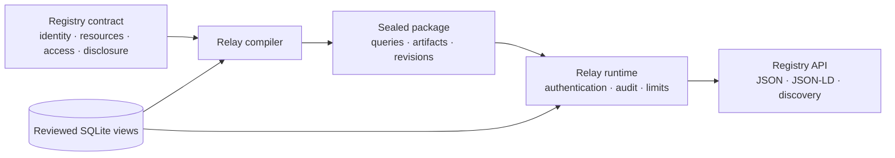

Registry Relay is for an institution that needs to publish selected read-only
Registry Records without exposing its database as a general API. The
institution reviews one Registry contract that connects identity, meaning,
disclosure, authorization, provenance, documentation, and runtime behavior to
specific SQLite views.

## Start with the Registry, not the database

A Relay process serves one Registry in one administrative trust domain. A
Registry is an authoritative collection with a stable identifier, name,
accountable Registry Authority, optional technical operator, declared scope,
and base URI.

A resource is one governed Record type inside that Registry. It is not a table
and not another Registry. One reviewed SQLite view can support several
resources, and several tables can feed one view. A database object without a
contract binding is not visible to Relay.

Every returned Record has two parts:

- Mandatory record context identifies the Registry, Record, revision,
  lifecycle state, Authority, recorded time, response schema, and semantic
  model. The contract calls this Registry Core context.
- `domainData` contains only the properties permitted by the operation's
  disclosure profile and any smaller subset requested by the caller.

The pair `(registryIdentifier, recordIdentifier)` identifies a Record. A JSON
for Linked Data (JSON-LD) `@id` can add a global Internationalized Resource
Identifier, but does not replace either authoritative identifier.

## Compile one reviewed agreement

The compiler resolves source bindings, validates the SQLite structure,
expands classifications, fixes the allowed queries, derives access and
disclosure plans, and generates OpenAPI and semantic artifacts. The sealed
package binds those results to the governed input digests and one contract
revision.

At request time, callers can select only a compiled operation, declared
equality filters, a bounded page size and cursor, and fewer properties from the
authorized disclosure profile. They cannot introduce SQL, choose a table,
change ordering, or turn a private column into a public property.

## Offer only the required read capabilities

The GovStack Digital Registries specification groups Registry reads under the
Consultation API family. Relay advertises only the capabilities compiled for a
deployment:

| Contract operation | Advertised capability | Result |
| --- | --- | --- |
| Identifier read | `consultation.retrieve` | One Record by its stable identifier. |
| Deterministic list | `consultation.list` | A bounded collection with declared filters and ordering. |
| Named exact lookup | `consultation.search` | One resolved Record or one indistinguishable unresolved outcome. |

An exact lookup does not return candidates, confidence scores, rankings, or a
matching explanation. A lookup-only sensitive resource publishes no list or
identifier-read route, even when a token contains broader scopes.

`GET /v2` identifies the Registry and lists the capabilities visible to the
caller. The service metadata names the GovStack Digital Registries and API
Design Guide versions used as alignment targets. This is alignment evidence,
not a conformance or certification claim.

## Keep access and disclosure separate

A protected request crosses six distinct gates:

1. JSON Web Token verification establishes one principal, audience, issuer,
   lifetime, token identifier, and set of scopes.
2. The access rule requires the operation scope and can also require a trusted
   purpose or an authority-to-row claim.
3. Relay builds the fixed parameterized query for the reviewed view.
4. The selected source Record passes complete source-shape validation.
5. The disclosure plan emits the operation's maximum property set or a
   caller-requested subset.
6. Durable terminal audit succeeds before Relay releases the held response.

Purpose and row authority come from verified token claims named by the
contract. Request headers and query parameters cannot create authority.
Different operations can expose different reviewed property sets. Within one
operation, two clients share the same maximum property set; a caller can only
request less.

## Protect metadata with the same boundary

Registry identity is public. Resource, schema, semantic, classification, and
processing artifacts can be public, operation-bound, or operator-only.
Operation-bound artifacts require the same static access rule as the Record
that links to them. A public sibling resource does not reveal a protected
resource's existence or artifacts.

Relay publishes a safe public OpenAPI document and retains the full OpenAPI
document in the sealed package. The public document omits protected request
shapes and operator-only metadata. Relay does not generate caller-specific
OpenAPI documents at request time.

## Choose reproducibility or live publication

Snapshot mode captures an immutable read-only SQLite file with stable identity,
digest, and reproducible source revision. Live read-only mode allows a separate
trusted publisher to update a compatible database while Relay keeps one fixed
contract and one consistent read transaction per request.

Snapshot is stronger but optional. Live sources are explicitly unversioned,
support identifier read and named exact lookup, and return no ETag or cacheable
response. Both profiles deny writes, arbitrary SQL, undeclared functions,
schema drift, unbounded rows, and unbounded response values. The
[operations guide](../../operate/relay/) compares the deployment tradeoffs.

## Keep Relay, Evidence Gateway, and Mint distinct

Relay responses are unsigned. Transport Layer Security (TLS) protects
transport, OAuth 2.0 protects controlled operations, and revisions plus
tamper-evident audit support accountability.

Evidence Gateway is the separate product for portable signed,
minimum-disclosure assertions. Registry Mint is an optional OAuth issuer when
an institution lacks a suitable authorization server. Relay does not issue
assertions or tokens and has no production runtime dependency on either
component.

## Know the product boundary

Relay publishes governed, semantically described, read-only Registry Records
from SQLite. Relay is not:

- A generic SQLite REST generator or SQL proxy.
- A write API, Registry administration service, or workflow engine.
- A Resource Description Framework (RDF) store, SPARQL endpoint, or runtime
  inference engine.
- A general policy engine, consent system, or identity provider.
- A matching, eligibility, case-management, aggregate, or analytics service.
- A credential issuer or signed-assertion service.
- A multi-Registry hosting layer.

SQLite is the supported source. PostgreSQL, GeoJSON and SpatiaLite, other API
families, historical retrieval, and runtime semantic inference are not
supported by this contract.

## Next

- [Publish a governed SQLite registry](../../tutorials/publish-governed-sqlite-registry/)
  for a complete local run with synthetic data.
- [Review semantics, classification, and disclosure](../relay-semantics-and-disclosure/)
  before naming and classifying real fields.
- [Author a Registry Relay project](../../configure/relay/) to bind an
  institution-owned SQLite view.
- [Operate Registry Relay](../../operate/relay/) to deploy one reviewed
  package.
