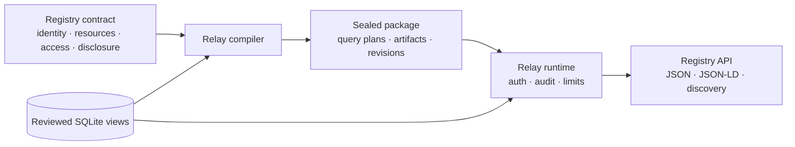

Registry Relay publishes one institution-owned Registry as a small set of
governed, semantically described, read-only resources. SQLite is the first
source adapter, not the product identity. The product is the compiled agreement
between Registry identity, meaning, disclosure, authorization, provenance,
documentation, and runtime behavior.

The concise promise is:

> Give Relay an authoritative SQLite database and a Registry contract. Relay
> produces a protected registry API whose meaning, disclosure, authorization,
> provenance, and documentation agree by construction.

## Start with the Registry, not the database

A Relay process serves exactly one Registry in one administrative trust
domain. The Registry has a stable identifier, name, Authority, optional
operator, authoritative scope, base URI, and declared standards-alignment
targets.

A resource is a governed Record type within that Registry. A resource is not a
table and not another Registry. One view can support several resources, and
several source tables can feed one reviewed view. Database objects without a
contract binding remain invisible.

Every returned Record carries two layers:

- Registry Core context identifies the Registry, Record, revision, lifecycle
  state, Authority, recorded time, schema, and semantic model.
- `domainData` contains only the properties permitted by the operation's
  disclosure profile and optional caller minimization.

The pair `(registryIdentifier, recordIdentifier)` identifies a Record. A
JSON-LD `@id` can provide a global IRI, but does not replace either
authoritative identifier.

## Compile one agreement

The compiler resolves source bindings, validates the schema fingerprint,
expands classifications, fixes query plans, derives access and disclosure
plans, and generates OpenAPI and semantic artifacts. The sealed package binds
those outputs to governed-file digests and one contract revision.

The runtime never reconstructs policy from request parameters. The caller can
choose only a compiled operation, declared equality filters, a bounded page
size and cursor, and fewer properties from the authorized disclosure profile.

## Expose only the needed Consultation patterns

Relay uses API families as external capability and trust groupings. Families
are not internal crates, service names, or URL prefixes. Version 1 compiles
three Consultation patterns:

| Authored operation | Advertised pattern | Boundary |
| --- | --- | --- |
| Identifier read | `consultation.retrieve` | One Record by its stable identifier. |
| Deterministic list | `consultation.list` | A bounded collection with declared filters and ordering. |
| Named exact lookup | `consultation.search` | One resolved Record or one indistinguishable unresolved outcome. |

Named exact lookup is not Record Match. Relay returns no candidate list,
confidence score, ranking, or matching explanation. A lookup-only sensitive
Registry compiles no list or identifier-read route, even when a token carries
broader scopes.

The service document at `GET /v2` derives its visible capability inventory
from the compiled operations. A deployment advertises only the patterns it
implements. The current GovStack Digital Registries and API Design Guide drafts
are directional inputs. Generated material is alignment evidence, not a
conformance or certification claim
(`products/relay-v2/STANDARDS-ALIGNMENT.md`).

## Keep access and disclosure separate

A protected request crosses distinct gates:

1. Strict JWT verification establishes one principal, audience, issuer,
   lifetime, token identifier, and scopes.
2. The compiled access rule requires one operation scope and can require a
   trusted purpose and an authority-to-row binding.
3. Relay builds a fixed parameterized query over the reviewed view.
4. The selected source Record passes complete source-shape validation.
5. The disclosure plan emits the operation's maximum property set or a
   caller-requested subset.
6. Durable terminal audit succeeds before the held response bytes are
   released.

Purpose and row authority come from verified claims named by the contract.
Caller headers and query parameters cannot create authority. Different
operations can have different disclosure profiles. Version 1 does not provide
dynamic per-client property permissions within one operation.

## Make public and protected metadata follow the same boundary

Registry identity is public. Resource, schema, semantic, classification, and
processing artifacts can be public, operation-bound, or operator-only.
Operation-bound artifacts use the same access gate as the Record that links
them. A public sibling resource cannot reveal a protected resource's existence
or artifacts.

Relay publishes a safe public OpenAPI projection and retains the full OpenAPI
document in the sealed package. The public document omits protected selector
shapes and operator-only metadata. Relay does not create caller-specific
OpenAPI at request time.

## Understand the source profiles

Snapshot mode captures an immutable read-only SQLite file with stable identity,
digest, and reproducible source revision. Live read-only mode permits a
separate trusted publisher to update the database while Relay keeps one fixed
contract and one consistent transaction per request.

Snapshot is stronger but optional. Version 1 live sources are unversioned,
support read and named lookup only, and return no ETag or cacheable response.
Both profiles deny writes, arbitrary SQL, undeclared functions, schema drift,
unbounded rows, and unbounded response values.

## Keep Relay, Evidence, and Mint distinct

Relay responses are unsigned. TLS protects transport, OAuth protects
controlled operations, and revisions plus tamper-evident audit support
accountability.

Evidence Gateway remains the product for a portable signed,
minimum-disclosure assertion. Evidence can later consume a Relay-protected
exact lookup as an ordinary fixed HTTP source without moving signing into
Relay. Registry Mint is an optional OAuth issuer when an institution lacks a
suitable authorization server. Relay has no production dependency on either
product.

## Know the product boundary

Relay is a governed semantic Registry publisher and a protected read-only API
over existing authoritative data. Relay is not:

- a generic SQLite REST generator or SQL proxy;
- a write API, registry administration service, or workflow engine;
- an RDF store, SPARQL endpoint, or runtime inference engine;
- a general policy engine, consent system, or identity provider;
- a matching, eligibility, case-management, aggregate, or analytics service;
- a credential issuer or signed-assertion service;
- a multi-Registry hosting layer.

PostgreSQL, GeoJSON and SpatiaLite, additional API families, and richer
semantic profiles remain later extensions. Version 1 does not introduce a
generic storage abstraction before a second adapter proves the boundary.

Continue with [Publish a governed SQLite registry](../../tutorials/publish-governed-sqlite-registry/)
for a complete first run, or [review semantics, classification, and disclosure](../relay-semantics-and-disclosure/)
for the metadata and minimization model.
