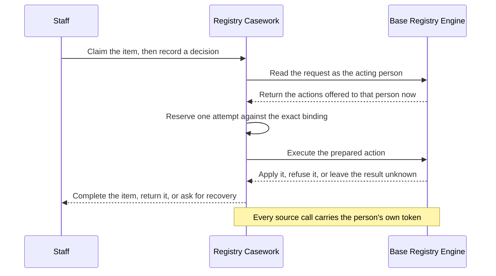

You have run [Decide your first work item](../../tutorials/first-casework/) and want the model behind it.
This page explains what a work item is, where one comes from, who is allowed to act on it, and how a decision reaches the system that owns the record, so that authoring a project and operating a deployment read as consequences of one model rather than as separate features.
If you are still deciding whether the product fits, start with the [Registry Casework overview](../../start/casework/).

{/* Evidence: crates/registry-casework-core/src/model.rs, WorkItem; crates/registry-casework-core/src/config.rs, CaseworkProject; products/casework/README.md. */}

## What a work item is

A [work item](../../reference/glossary/#work-item) is one piece of human work that a team can see, claim, and finish.
It carries the subject it concerns, the [queue](../../reference/glossary/#queue) it sits in, its lifecycle state, at most one holder, and the history of everything that has happened to it.
Registry Casework owns that coordination record, and only that record.

{/* Evidence: crates/registry-casework-core/src/model.rs, WorkItem and OccurrenceState;
    crates/registry-casework/src/store.rs, SourceBinding. */}

Every item has one of two origins. A Casework project declares one origin or both, and a project that declares no source and no hosted kind is refused when you check it, because it describes no work.

| What differs | Source-backed item | Hosted item |
| ------ | ------ | ------ |
| Where it starts | A governed [change request](../../reference/glossary/#change-request) that a [Base Registry Engine](../../reference/glossary/#base-registry-engine) already holds | A Requester service creating one directly under a declared [hosted kind](../../reference/glossary/#hosted-kind) |
| What Casework holds | Assignment, routing, clocks, private drafts, attempts, and recovery | The whole item: its display fields, its history, its outcome, and its retention |
| What stays with the source | Eligibility, current visibility, and the record change itself | Nothing, because no other system is in the loop |
| How it finishes | An accountable attempt against the source, made by a person | One outcome from the list the hosted kind declares |

{/* Evidence: crates/registry-casework-core/src/config.rs, CaseworkProject and NoConfiguredWork. */}

A source-backed item mirrors work that a Base Registry Engine (BReg) already governs.
Casework reaches that registry through one source adapter, and the adapter is the only place the registry's protocol exists: it verifies a lifecycle transition, reads authoritative state under a service reader profile, discovers active requests, reads one request as the calling person, prepares an action, and executes a prepared action.
Everything a source-backed item shows a caller comes from a read made for that caller at that moment, so eligibility, visibility, and the mutation stay with the registry that owns them.

{/* Evidence: crates/registry-casework-core/src/adapter.rs, SourceAdapter, discover_active, and read_for_caller;
    crates/registry-casework-breg/src/lib.rs, read_authoritative. */}

A [hosted item](../../reference/glossary/#hosted-item) lives in Casework alone.
A Requester service creates it under a hosted kind the project declares, and that kind fixes what the item can become: which human profiles may decide it, which outcomes they may record, whether a reason is required, and how long the item and its accountability record survive.
The policy is pinned onto the item at creation, so publishing a changed policy later shapes new items and never rewrites existing ones.
The starter project ships one such kind, a generic decision with two outcomes, which is enough to run a deployment with no registry behind it.

{/* Evidence: crates/registry-casework-core/src/hosted.rs, HostedKindPolicy, HostedPolicyDigest, and standalone_decision_starter_kind;
    crates/registry-casework/src/hosted.rs, decide_hosted_item. */}

## Who may act

Four profiles exist, and a request selects exactly one of them.

| Profile | What it may do |
| --- | --- |
| Staff | Work the queues their teams serve: claim an item, release it, keep a private draft, delegate an item they hold, and record a decision. |
| Supervisor | Work those queues, and also assign visible work, maintain absence records for staff they supervise, move a caseload, and read the accountability record behind a hosted outcome. |
| Administrator | Maintain the directory and publish holiday revisions while the service runs. |
| Requester | Create hosted items, page its own terminal feed, and cancel an item it created. It cannot claim or decide. |

{/* Evidence: crates/registry-casework-core/src/config.rs, AccessProfile and access_roles_are_separately_scoped;
    products/casework/README.md. */}

Staff, Supervisor, and Administrator are the three profiles a person holds, and Casework admits them only when the token carries the human-identity assertion the deployment names: one claim, one exact string value, set by the issuer for an interactive session.
Every request is checked twice over, once for the scopes the selected profile requires and once for that assertion.
Requester stands for a service integration and is exempt from the assertion, and a human value on a Requester token grants no Staff, Supervisor, or Administrator authority.

{/* Evidence: crates/registry-casework/src/auth.rs, CaseworkAuthenticator and NotHuman;
    products/casework/README.md. */}

Scopes are the first authority check and the [directory](../../reference/glossary/#directory) is the second.
The directory is runtime state the Administrator maintains through the authenticated API rather than policy you write in a file: which teams exist, who belongs to each as staff or supervisor, and which queues each team serves.
A served queue belongs to one team at a time, and every mutation rechecks current membership inside the same transaction as the change, so removing a person from a team takes effect on their next request rather than at the next deployment.
Bounded maintenance then releases held items whose holder is no longer eligible and records that release as a visible lifecycle event.

{/* Evidence: crates/registry-casework-core/src/model.rs, TeamRecord and DirectoryMember;
    crates/registry-casework/src/store.rs, can_view_item;
    products/casework/README.md. */}

Administrator authority covers the directory and the calendars, not the work.
Reading an item is granted to a staff member or a supervisor of the team currently serving that item's queue, so an Administrator who can rename a team and reassign its queues still cannot open a single item sitting in them.
The directory response itself contains no work-item identifiers.

{/* Evidence: crates/registry-casework/src/store.rs, can_view_item and DirectoryMember;
    products/casework/README.md. */}

## The life of an item

Work reaches a person as an inbox: the items in the queues their teams currently serve, filtered again by what that person may see right now.
[Claiming](../../reference/glossary/#claim) an item makes that person its holder, and releasing it returns the item to its queue.
One holder at a time is a fence rather than a courtesy, because the store checks the holder, the item's revision, and current membership in the same transaction as any change, so two people racing for one item produce one winner and one refusal.

{/* Evidence: crates/registry-casework-core/src/transition.rs, transition();
    crates/registry-casework/src/store.rs, OccurrenceState and AssignmentContext. */}

A holder can keep a [private draft](../../reference/glossary/#private-draft) while thinking.
A draft is keyed by the item and its author, so one person's draft is absent to everyone else, and it is bound to the exact source proposal it was written against.
When that proposal moves on, the draft is retained and the person is told the proposal changed, which keeps a long piece of reasoning from being silently applied to a different request.

{/* Evidence: crates/registry-casework/src/service.rs, source_draft and save_source_draft;
    crates/registry-casework/src/problem.rs, WorkItemProposalChanged. */}

Deciding a source-backed item is not a local state change.
Casework re-reads the request as the acting person, under that person's own bearer token and the [source profile](../../reference/glossary/#casework-source-profile) the request selects, and promotes only an action the registry offers that person for that exact binding at that moment.
It then reserves one [attempt](../../reference/glossary/#attempt) and executes an inert prepared capsule that holds the exact binding and the evidence needed to replay it, and no credential.
Approval does not apply: completing a review and applying a request are separate actions, discovered separately, taken separately.

{/* Evidence: crates/registry-casework/src/service.rs, decide and prepare_action;
    crates/registry-casework-breg/src/lib.rs, execute_prepared;
    crates/registry-casework-core/src/adapter.rs, PreparedSourceAttempt. */}

Three outcomes follow, and the third one shapes the rest of the model.
A definitive refusal from the registry returns the item to its holder, who can act on it again.
A confirmed application completes the attempt and records a receipt.
Anything else, including a timeout, is preserved as uncertain rather than retried: the item is fenced, and the next call receives a recovery problem that names the original attempt and nothing else.
Recovery replays that exact prepared capsule under the same person, the same Casework profile, and the same source profile, so a lost response cannot become a second decision.

{/* Evidence: crates/registry-casework-core/src/adapter.rs, SourceAdapterError and PreparedExecution;
    crates/registry-casework/src/problem.rs, WorkItemRecoveryPending;
    crates/registry-casework-core/src/transition.rs, AttemptUncertain. */}

When recovery still cannot observe what happened, the deployment operator settles the attempt after confirming the real outcome with the source owner.
Settlement is reviewed before it is applied, records the reason and the person who decided, and names no actor as having decided inside Casework.
Settling as not applied returns the item to its holder; settling as applied completes the attempt with no receipt and leaves the item synchronizing until Casework observes the source's next revision.
[Deploy Registry Casework](../../operate/casework/) covers that operator path.

{/* Evidence: crates/registry-casework-core/src/attempt_settlement.rs;
    crates/registry-casework/src/store.rs, settle_attempt. */}

### Why refusal and absence look the same

An item the caller may not see and an item that does not exist produce the same answer: one 404 carrying the `work-item.not-visible` problem, worded the same way in both cases.
The inbox behaves the same way, skipping a candidate the source conceals or denies without saying that it did, which is also why a page can come back shorter than the limit you asked for.
That is deliberate. A caller who could tell the two apart could enumerate the existence of requests it is not allowed to read, and an inbox is exactly the surface where that probing is cheap.

{/* Evidence: crates/registry-casework/src/http.rs, HttpError and WorkItemNotVisible;
    crates/registry-casework/src/service.rs, assemble_caller_visible_item. */}

## Assignment, cover, and caseload moves

Assignment is explicit and is recorded as such.
A Supervisor assigns visible work in a queue their team currently serves, and the person holding an item can delegate it.
Casework records the assignment owner, the person who acted, and every absence record it traversed on the way, so a later reader sees who was accountable and how the item got there.

{/* Evidence: crates/registry-casework-core/src/assignment.rs, AbsenceRecord;
    crates/registry-casework-core/src/model.rs, AssignmentContext;
    crates/registry-casework/src/assignment.rs. */}

An absence record sends one person's work to another for a period, and cover resolves when the assignment happens rather than when the absence was written down.
Casework walks the chain, following the next link when a cover is also absent, and refuses self-cover, overlapping absences for one person, and cycles.
When the chain ends with nobody eligible, the item stays open in its serving queue and reports a staffing diagnostic on the item itself instead of failing the request, which keeps an unstaffed queue visible rather than silent.

{/* Evidence: crates/registry-casework-core/src/assignment.rs, resolve_absence_cover and validate_absence;
    crates/registry-casework-core/src/model.rs, StaffingDiagnostic. */}

Moving a caseload is one operation in two halves: review, then apply.
The review lists only the items the supervisor can currently see that the named person holds, omitting the ones the source conceals, and the apply step accepts between 1 and 100 of those reviewed items, each named with the revision it was reviewed at.
Each selection commits in its own transaction and reports its own result, so one stale or newly concealed item cannot fail the rest of the move or disclose itself by failing differently.

{/* Evidence: crates/registry-casework-core/src/assignment.rs, CaseloadMoveRequest, CaseloadApplyRequest, and CaseloadItemOutcome;
    products/casework/README.md. */}

## Routing and clocks

Routing decides which queue a source-backed item lands in.
A source declares a bounded projection, up to 32 logical fields it copies from the registry as routing facts, and up to 64 ordered rules over those fields.
A rule matches with closed `equals` or `oneOf` predicates, carries a `because` string an operator can read, and selects a declared queue; the first match wins and the request's own queue is the fallback.
Projection grants nothing: a projected field is a routing fact, not a licence to display, decide, or apply.

{/* Evidence: crates/registry-casework-core/src/routing.rs, evaluate_routing, MAXIMUM_ROUTING_RULES, and MAXIMUM_ROUTING_PROJECTION_FIELDS;
    products/casework/README.md. */}

Clocks say when work is late. A project declares at most 16 calendars and 32 clocks.
A subject clock measures the whole review from first submission to completion and pauses while the subject is waiting on the applicant.
An activity clock measures one stage against a calendar, in 1 to 3650 working days ending at a local time of day, with at most eight reminders and eight due steps.
A calendar names a timezone and its working weekdays, and its holiday dates arrive as a separate immutable revision the Administrator publishes at runtime rather than as dates frozen into deployed policy.
Republishing holidays never silently rewrites a running deadline: an Administrator previews the recompute in batches, reviews it, and applies the reviewed preview.

{/* Evidence: crates/registry-casework-core/src/policy.rs, MAXIMUM_CLOCKS, MAXIMUM_CALENDARS, and MAXIMUM_CLOCK_REMINDERS;
    crates/registry-casework-core/src/calendar.rs, evaluate_working_day_deadline;
    crates/registry-casework/src/clocks.rs, apply_clock_recompute. */}

What a clock does when it fires is narrow and local.
It records a reminder in the item's history, and a due step appends its own history entry, releases the holder, and moves the item to the queue the step names, with a system actor rather than a person.
An effect commits only after a fresh authoritative read confirms the item the clock was computed against, so an unanswering registry makes the effect wait rather than fire on stale state, and the pinned calculation generation keeps a restart from repeating one.
A clock reads the source and changes nothing there, decides no outcome, and sends nothing to anyone: its effect is a visible change to the item, and a person still has to open it.
[Author a Casework policy](../../configure/casework/) carries the grammar for routing rules, calendars, and clocks.

{/* Evidence: crates/registry-casework/src/clocks.rs, process_due_clocks, defer_clock_claim, apply_clock_claim, and ClockStepApplied;
    crates/registry-casework-core/src/clock_runtime.rs, ClockNextEffect;
    crates/registry-casework-core/src/policy.rs, ClockStepAction. */}

## What Casework keeps

A hosted kind sets two periods, and the second is at least as long as the first.
The terminal period is how long a finished item keeps the content a decision was made on.
The accountability period is how long the [accountability record](../../reference/glossary/#accountability-record) behind the outcome survives: who decided, when, and why.
When both expire, Casework deletes the accountability record and the terminal event, and strips the requester-supplied and display content from the item.

{/* Evidence: crates/registry-casework-core/src/hosted.rs, HostedRetentionPolicy and HostedAccountabilityRecord;
    crates/registry-casework/src/hosted.rs, erase_expired_hosted_at. */}

The outcome a Requester reads names no person.
A terminal result carries an opaque actor reference, a prefixed token that stands for the deciding person without disclosing an issuer, a subject, a display name, or an internal note.
The identity behind that reference is reachable only by a Supervisor with current authority over the item's queue, only while the accountability period lasts, and every such read writes its own audit record in the same transaction as the read.
Accountability is therefore a deliberate, recorded act rather than a field on a response.

{/* Evidence: crates/registry-casework-core/src/hosted.rs, OpaqueActorRef and HostedTerminalState;
    crates/registry-casework/src/hosted.rs, hosted_accountability. */}

Idempotency outlives the payload it protected.
When a hosted item is erased, Casework keeps a payload-free tombstone holding a hash of the original request and hashed binding metadata, which is enough to recognise a replayed key and refuse a changed body under the same key.
After the accountability deadline, the tombstone goes too and the key becomes reusable, so a retry that arrives years late is answered as expired rather than answered from retained content.

{/* Evidence: crates/registry-casework/src/hosted.rs, erase_expired_hosted_at;
    crates/registry-casework/src/problem.rs, IdempotencyExpired;
    products/casework/README.md. */}

Source-backed copies erase on a different trigger.
Casework holds only the copies it needed to coordinate the work, and it erases them when the source owner authorises erasure for one exact request, as an operator action against the database rather than a schedule.
A pending or uncertain attempt blocks that erasure until the attempt is recovered or settled, so erasure can never be the reason an outcome is unknown.
[Retention in Registry Casework](../../operate/casework-retention/) states what each period removes and what it leaves.

{/* Evidence: crates/registry-casework/src/source_retention.rs;
    crates/registry-casework-core/src/source_retention.rs;
    crates/registry-caseworkctl/src/project.rs, retention_erase. */}

## Where the product stops

- Decisions are one item at a time, by one accountable person. There are no bulk decisions and no automatic outcomes.
- There is no consultation step. An item has one holder, and a second opinion is a delegation or an assignment, both recorded.
- Nothing is delivered outward. Casework records reminders and applies authored queue steps inside the item, and sends no message to a person or a system.
- Casework serves an API and renders no interface of its own. The Registry App Kit is a separate project that provides a staff interface for BReg-backed work.
- The API does not enable CORS, because a browser talks to its own host and that host calls Casework server to server on a private network.
- Casework issues no tokens and stores no users. Identity belongs to your OpenID Connect provider.
- A source-neutral core and generic clients hold no registry protocol types, and no registry depends on Casework.

{/* Evidence: products/casework/CHANGELOG.md;
    crates/registry-casework/src/http.rs, security_headers;
    products/casework/contracts/security-invariant-matrix.yaml. */}

## Next

- [Author a Casework policy](../../configure/casework/): hosted kinds, sources, routing rules, calendars, and clocks.
- [Deploy Registry Casework](../../operate/casework/): database setup, the operator file, directory bootstrap, and the operator paths for recovery.
- [Retention in Registry Casework](../../operate/casework-retention/): what each retention period removes and what survives it.
- [Registry Casework API](../../reference/apis/registry-casework/): every route, header, and problem code.
