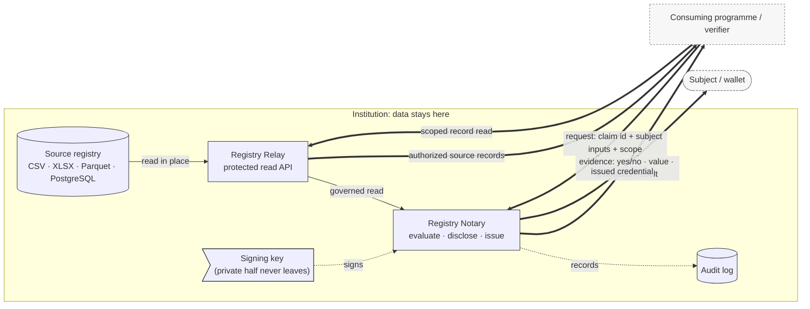

An institution that runs a civil registry, a social-protection database, or a health
registry already holds the records it needs.
Registry Stack lets it **answer evidence questions about those records** (*is this person alive?
is this programme enrollment active?*) and return a result another system can trust, while the
records themselves are **read where they already live, never written back, and not copied into a
central exchange**.
This page explains what that means in practice: what stays inside the institution's
boundary, what crosses it, and (equally important) what the design does and does not
guarantee.

## A question goes in, an answer comes out

The combined Relay and Notary mental model is one sentence: **a scoped evidence question crosses
into the institution, Relay reads and normalizes the source, Notary returns a governed evidence
answer, and the consuming programme decides what to do.**

A Notary caller never sends the value it is asking about and never receives the
underlying record as the answer.
It sends the id of an *evidence claim* (an atomic, precisely defined evidence statement) and only
the typed target, requester, or variable inputs that the claim admits.
It receives one of a few narrow shapes of answer: a yes/no, a single value, a
machine-readable evaluation result, or a credential the subject can carry in a wallet.
The source row that the answer was computed from stays behind.

## The boundary

*Two governed surfaces can cross the boundary.* Registry Relay turns an existing file or
database table into a read-only, access-controlled API without replacing the source.
Its scoped record routes can return source records to authorized callers that hold the
dataset's row-read permission.
Registry Notary evaluates one modelled question against the typed result of a compiler-pinned
Relay consultation and returns a shaped answer; it is the only component that evaluates claims,
applies disclosure policy, and issues credentials.
Notary is the strongest minimization surface.
Relay record reads are scoped and audited, not open data.

The policy boundary remains separate across the two products and their consumers. Relay owns
source access and adaptation policy. Notary owns evidence authorization and disclosure policy.
The consuming programme owns eligibility, prioritization, workflow, and action policy.
Purpose-bound authorization can restrict an evidence request without changing which component owns
the programme decision.

## What stays home

- Source data is read in place: Relay reads sources as batch snapshots or table scans;
  there is no write-back to the source registry, and runtime services expose no
  data-mutation routes. The source keeps running as it always has. "No write-back to the
  source and no external handoff" is not the same as "no copy exists": in snapshot mode
  (the default), Relay materializes a projected copy into its local cache (`cache_dir`), which
  carries its own retention and access considerations.
- Storage internals stay private: The paths, table names, and backend credentials that
  point at the source live in Relay's runtime configuration, decided at startup. They
  are never part of the public API surface, and never part of a portable metadata file that
  gets distributed.
- The institution keeps custody: The design premise is *distributed custody*: each
  authority retains control of its own registry data, and the stack does not aggregate
  records into a central system. It provides the exchange surface, not a data lake.
- Private signing keys never leave the issuer: The institution publishes the *public*
  half of its signing key so anyone can verify a signed credential or signed result; the
  private half stays inside.

## What crosses the boundary

What crosses depends on the surface.
Registry Relay can return scoped source records to an authorized caller through a
governed, audited read bounded by the caller's per-dataset row scope and the dataset's
configured filters and limits.
Registry Notary returns the answer a rule computes from typed consultation outputs rather than the
source row; keeping that answer narrow is a modelling discipline, because a well-modelled claim
returns one reusable evidence statement or one extracted value.
A Notary answer takes one of a few shapes:

- A yes/no: only the true/false satisfaction of the modelled rule.
- A single value: the evaluated value itself, when the claim's disclosure mode is
  `value` (this returns the full value).
- A machine-readable evaluation result: a claim-result document carrying *provenance
  metadata*: which evaluation produced it, under which policy, across how many sources. This
  provenance lets a receiving system trace the result; it is not a cryptographic signature.
- An issued credential: an SD-JWT VC the subject can store in a wallet and present later.
  Unlike the plain result, the credential is cryptographically verifiable against the
  issuer's published keys. Credential profiles are holder-bound by default, but an
  operator can explicitly configure an unbound profile.

Across a federation boundary (one institution's Notary asking another's), what crosses is
a scoped, signed evaluation result, never a credential.

## How much an answer reveals: the three disclosure modes

Every claim carries a **disclosure mode** that fixes how much of the answer the caller
receives. There are exactly three:

| Mode | Discloses | Withholds |
|------|-----------|-----------|
| `value` | the evaluated value, less any object fields the policy redacts | nothing beyond policy-redacted object fields |
| `predicate` | only the true/false satisfaction, for a claim whose rule yields a boolean | the underlying value |
| `redacted` | neither: the result carries no value **and** no yes/no | the value *and* the outcome |

The mode is policy-bound: a claim defines an `allowed` set, a `default`, and a downgrade
policy.
A caller may request a mode.
Under the default `deny` downgrade, the service refuses a requested mode outside the
allowed set; a `default` or `redacted` downgrade substitutes that fallback mode when the
fallback is itself allowed.
The default mode applies when the caller requests none, and every result records which
mode was applied.
A privacy-sensitive claim is expected to default to the least-revealing mode that still
answers the question.

This is the mechanism behind "prove a fact without sharing the record". To check whether a
person has a registered record, model the question as an *existence* rule and disclose it
as a `predicate`: a resolved record returns `true`, and the row never crosses the
boundary.
By default, a record that does not resolve collapses to a single not-available reason
rather than a `false`, which hides the reason matching failed. An authorized caller can
still distinguish a resolved record from a not-available response, so use this pattern for
minimization, not for hiding whether a requested subject matched.
To report whether a source records a vaccination dose, derive that evidence predicate from the
declared typed source output. The consuming programme can combine the result with other evidence
and its own case state to decide whether outreach or follow-up is required.
Registry Notary can attest an eligibility or other decision already made by an authoritative
source only when the claim identifier and its review documentation identify the fact as a
source-owned decision. Notary does not recompute that decision.

## Why the answer is not the record

A credential is not a copy of the record. It is an **SD-JWT VC**: the signed body carries a
SHA-256 *digest* of each selectively disclosable field rather than the field value, so a
field the holder does not present stays hidden.
Holder binding is set by the credential profile.
By default, a profile with no `holder_binding` block uses `did:jwk` holder binding.
A holder-bound profile ties the credential to the holder's key so it is not presentable
without the matching private key; an operator that intentionally needs a bearer-style
credential can set `holder_binding.mode: none`.
Each selectively disclosable field is a whole claim output, so an object-valued output is
revealed as a unit unless an explicit projection splits it into separately disclosable
fields.
Anyone can verify the credential against the issuer's published public keys, served
without authentication so a verifier needs no credential of its own.
The issued credential carries no full record payload.

## How the boundary is enforced

The "stays home" property rests on a few enforced rules, covered in depth in the Trust &
Security material:

- Scope-before-source, deny-by-default: A service checks the caller's scope *before* it
  reads any source or evaluates any claim, and does not widen a caller's reach at request
  time beyond what its configuration grants. Anything that touches a record or a claim
  requires authentication. Routes reachable without it return no record or claim result on
  their own: liveness and readiness probes, public verification keys, public metadata, and,
  where OID4VCI issuance or credential status is enabled, the protocol surfaces that run
  their own flow checks.
- A permit, or a closed door: On a governed read, the policy decision point must return
  a permit before data is returned; a denial fails closed with a stable reason rather than
  falling back to an ungoverned read.
- Every person-level request is audited: An audit record captures at least the caller,
  the scopes exercised, a request id, and the declared purpose where one was supplied.
  A deployment can run audit fail-closed, so a request whose audit record cannot be
  written does not return success.

## What this guarantees, and what it does not

"Records stay home" is a precise, narrow promise.

- It is not "data never moves" and not "air-gapped": The promise is *read-in-place, no
  write-back, retained custody*. Authorized, minimized answers do leave the boundary by
  design: that is the point of the system.
- Minimization is modelled, not automatic: `value` mode discloses the evaluated value,
  less any object fields the policy marks for redaction; it is not constrained to a
  scalar, so a claim modelled to return an object or extracted record returns one. A claim
  reveals only what its author configured it to reveal; least disclosure is a design choice
  the claim makes, not a property the stack imposes on every answer.
- Correctness depends on the source: Relay reports what the reviewed source consultation says,
  and Notary evaluates that typed result. Neither product independently vouches for whether the
  source is correct or current.
- A plain result is provenance-tagged, not signed: The everyday evaluation response
  carries provenance metadata, not a cryptographic signature. Cryptographic verifiability
  comes from the SD-JWT VC credential and the signed federation result: a receiving system
  that must verify an answer cryptographically uses the credential, not the default response.
- Matching is only as strict as the Relay integration contract: Relay returns `match`,
  `no_match`, or `ambiguous` under the compiled selector and output rules. Notary does not
  replace that result with direct source matching or choose between ambiguous records.
- Missing evidence is not a negative fact: A matched source value of `false`, a matched `null`
  value, `no_match`, `ambiguous`, and source failure have different reviewed meanings. Claim rules
  must not collapse `null`, unavailable evidence, or failures to `false`. An explicitly named
  existence predicate can map `matched == false` to `false` when its reviewed meaning is exactly
  whether one admissible match exists; ambiguity and failure remain unavailable.
- Notary is not a programme decision engine: Notary returns governed evidence. The consuming
  programme owns eligibility, prioritization, workflow, and action unless Notary is attesting a
  decision explicitly owned by the authoritative source.
- This is not zero-knowledge: A `predicate` answer is a policy-enforced boolean computed
  inside the service; SD-JWT selective disclosure is digest omission. Neither is a
  zero-knowledge proof.

This page's promise also sits inside the wider set of stack-wide limits: revocation and
erasure gaps, which guarantees are left to the operator to provide, and the draft status of
the underlying specifications. Weigh those alongside the limits in this section; see the
[known limitations hub](../known-limitations/) for the full inventory.

## Related

- The security model and protocol contracts: [RS-SEC-G](../../spec/rs-sec-g/),
  [RS-PR-RELAY](../../spec/rs-pr-relay/), [RS-PR-NOTARY](../../spec/rs-pr-notary/),
  [RS-DM-CLAIM](../../spec/rs-dm-claim/)
- [Evidence issuance, end to end](../evidence-issuance/)
- [Disclosure modes and computed answers](../disclosure-modes-and-computed-answers/)
- [Threat model](../threat-model/)
