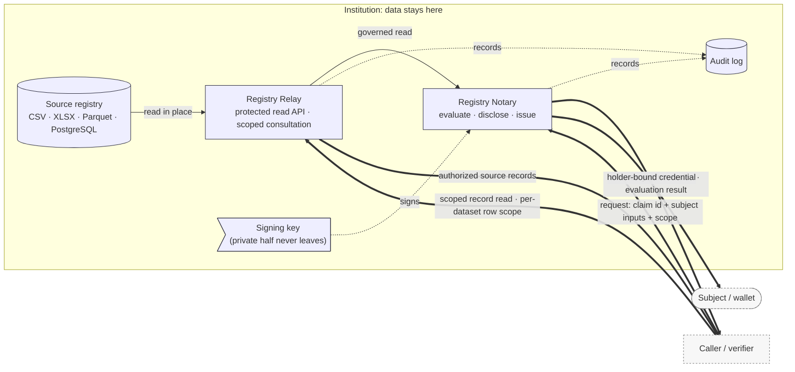

An institution that runs a civil registry, a social-protection database, or a health
registry already holds the records it needs. Registry Stack lets it **answer questions
about those records** (*is this person alive? is this household eligible?*) and return
a result another system can trust, while the records themselves are **read where they
already live, never written back, and never returned as the answer**.

This page explains what that means in practice: what stays inside the institution's
boundary, what crosses it, and, equally important, what the design does and does not
guarantee.

## A question goes in, an answer comes out

The mental model is one sentence: **a scoped question crosses into the institution, the
record is read in place, and only a computed answer crosses back out.**

A caller never sends the value it is asking about and never receives the underlying
record. It sends the id of a *claim* (a single, pre-modelled question) and the inputs that
claim needs to resolve the subject: a subject identifier, plus, where the claim's matching
policy requires them, target or requester attributes, further identifiers, or relationship
attributes. It receives one of a few narrow shapes of answer: a yes/no, a single value, a
machine-readable evaluation result, or a credential the subject can carry in a wallet. The source row that the
answer was computed from stays behind.

## The boundary

*Two surfaces cross the boundary, both governed.* Registry Notary evaluates one modelled
question against a source and returns a shaped, minimized answer; it is the only component
that evaluates claims, applies disclosure policy, and issues credentials. Registry Relay
turns an existing file or database table into a read-only, access-controlled API without
replacing the source, and publishes restricted, scoped consultation routes that return
source records to authorized callers holding the dataset's `<dataset_id>:rows` permission. Notary is the
strongest minimization; Relay record reads are scoped and audited, not open data. Either
way the source is read in place, never written back, and never aggregated centrally.

## What stays home

- **Source data is read in place.** Relay reads sources as batch snapshots or table scans;
  there is no write-back to the source registry, and runtime services expose no
  data-mutation routes. The source keeps running as it always has.
- **Storage internals stay private.** The paths, table names, and backend credentials that
  point at the source live in the service's runtime configuration, decided at startup. They
  are never part of the public API surface, and never part of a portable metadata file that
  gets distributed.
- **The institution keeps custody.** The design premise is *distributed custody*: each
  authority retains control of its own registry data, and the stack does not aggregate
  records into a central system. It provides the exchange surface, not a data lake.
- **Private signing keys never leave the issuer.** The institution publishes the *public*
  half of its signing key so anyone can verify a signed credential or signed result; the
  private half stays inside.

## What crosses the boundary

What crosses depends on the surface. Registry Relay returns scoped records to an
authorized caller: a governed, audited, paginated read bounded by the caller's per-dataset row
scope (`<dataset_id>:rows`) and the dataset's configured filters and limits. Registry Notary returns the answer a
rule computes rather than the source row;
keeping that answer narrow is a modelling discipline, since a well-modelled claim returns
one decision or one extracted value. A Notary answer takes one of a few shapes:

- **A yes/no**: only the true/false satisfaction of the modelled rule.
- **A single value**: the evaluated value itself, when the claim's disclosure mode is
  `value`.
- **A machine-readable evaluation result**: a claim-result document carrying *provenance
  metadata*: which evaluation produced it, under which policy, across how many sources. This
  provenance lets a receiving system trace the result; it is not a cryptographic signature.
- **A holder-bound credential**: an SD-JWT VC the subject can store in a wallet and present
  later. Unlike the plain result, the credential is cryptographically verifiable against the
  issuer's published keys.

Across a federation boundary (one institution's Notary asking another's) what crosses is
a scoped, signed evaluation result, never a credential.

## How much an answer reveals: the three disclosure modes

Every claim carries a **disclosure mode** that fixes how much of the answer the caller
receives. There are exactly three:

| Mode | Discloses | Withholds |
|------|-----------|-----------|
| `value` | the evaluated value, less any object fields the policy redacts | nothing beyond policy-redacted object fields |
| `predicate` | only the true/false satisfaction, for a claim whose rule yields a boolean | the underlying value |
| `redacted` | neither: the result carries no value **and** no yes/no | the value *and* the outcome |

The mode is policy-bound: a caller may request a mode, but a claim defines an `allowed`
set, a `default`, and a `downgrade` policy. Under the default `deny` downgrade the service
refuses a requested mode outside the allowed set; a `default` or `redacted` downgrade
instead substitutes that fallback mode when the fallback is itself allowed. The default mode
applies when the caller requests none, and every result records which mode was applied. A privacy-sensitive claim is expected to default to the
least-revealing mode that still answers the question.

This is the mechanism behind "prove a fact without sharing the record". To check whether a
person has a registered record, model the question as an *existence* rule and disclose it
as a `predicate`: the caller learns `true` or `false`, and the row never crosses the
boundary. To check eligibility without exposing an income figure, derive the decision with
an expression rule and disclose the eligibility boolean as a `predicate`; the income value
stays home.

## Why the answer is not the record

A credential is not a copy of the record. It is an **SD-JWT VC**: the signed body carries a
SHA-256 *digest* of each selectively disclosable field rather than the field value, so a
field the holder does not present stays hidden. Holder binding is set by the credential profile. A holder-bound profile ties the credential
to the holder's key so it is not presentable without the matching private key; the default
`none` mode issues an unbound credential. Either way, the holder chooses which fields to
reveal to which verifier. Each selectively disclosable field is a whole claim output, so an
object-valued output is revealed as a unit, not field by field within the object. Anyone can
verify it against the issuer's
published public keys, served without authentication so a verifier needs no credential of
its own. The issued credential carries no full record payload.

## How the boundary is enforced

The "stays home" property rests on a few enforced rules, covered in depth in the Trust &
Security material:

- **Scope-before-source, deny-by-default.** A service checks the caller's scope *before* it
  reads any source or evaluates any claim, and does not widen a caller's reach at request
  time beyond what its configuration grants. Anything that touches a record or a claim
  requires authentication. The routes reachable without it return no record or claim result on
  their own: liveness and readiness probes, the public verification keys, the public metadata
  routes (API, issuer, and credential type), and, where OID4VCI issuance or credential status
  is enabled, the issuance-flow and status routes that protocol defines, which run their own
  flow checks.
- **A permit, or a closed door.** On a governed read, the policy decision point must return
  a permit before data is returned; a denial fails closed with a stable reason rather than
  falling back to an ungoverned read.
- **Every person-level request is audited.** An audit record captures at least the caller,
  a request id, the scope or claim the request exercised, and the declared purpose where
  one was supplied. A
  deployment can run audit fail-closed, so a request whose audit record cannot be written
  does not return success.

## What this guarantees, and what it does not

"Records stay home" is a precise, narrow promise. Reading it as more than it is would be a
mistake, so the limits are stated plainly here.

- **It is not "data never moves" and not "air-gapped".** The promise is *read-in-place, no
  write-back, retained custody*. Authorized, minimized answers do leave the boundary by
  design: that is the point of the system.
- **Minimization is modelled, not automatic.** `value` mode discloses the evaluated value,
  less any object fields the matching policy marks for redaction; it is not constrained to a
  scalar, so a claim modelled to return an object or extracted record returns one. A claim
  reveals only what its author configured it to reveal; least disclosure is a design choice
  the claim makes, not a property the stack imposes on every answer.
- **Correctness depends on the source.** Notary reports what the configured source says; it
  does not independently vouch for whether the source is correct or current.
- **A plain result is provenance-tagged, not signed.** The everyday evaluation response
  carries provenance metadata, not a cryptographic signature. Cryptographic verifiability
  comes from the SD-JWT VC credential and the signed federation result. A receiving system
  that must verify an answer cryptographically uses the credential, not the default response.
- **Matching is only as strict as it is configured.** Notary resolves a subject through its
  configured matching policy and does not independently verify identity beyond that. By
  default a matching failure collapses to a single public reason, so the matching surface
  cannot be used as an existence oracle.
- **This is not zero-knowledge.** A `predicate` answer is a policy-enforced boolean computed
  inside the service; SD-JWT selective disclosure is digest omission. Neither is a
  zero-knowledge proof, and the documentation should not imply one.
- **No revocation or erasure flow is specified; revocation is an optional operator surface.**
  The `RS-*` specifications define no credential revocation, credential status, or
  data-subject erasure. The implementation ships an optional credential-status surface (a status
  list with states `valid`, `suspended`, `revoked`, and `expired`),
  disabled by default and enabled per deployment; with it enabled, an admin-scoped route can
  move a credential to `revoked`. Data-subject erasure is absent from both the specifications
  and the implementation. A key rotated out may remain published so existing results stay
  verifiable; that is not a revocation mechanism.
- **Several guarantees are the operator's to provide.** Network egress limits, key custody,
  tenant isolation, audit retention, and transport security are supplied by the deployment,
  not guaranteed by the stack.
- **The model is specified in draft.** The behaviour above is defined in the `RS-*`
  specifications, which are still drafts and may change. Alignment with an external standard
  is not a claim of conformance to it or of legal compliance.

## Related

- The security model and protocol contracts: [RS-SEC-G](../../spec/rs-sec-g/),
  [RS-PR-RELAY](../../spec/rs-pr-relay/), [RS-PR-NOTARY](../../spec/rs-pr-notary/),
  [RS-DM-CLAIM](../../spec/rs-dm-claim/)
- Evidence issuance, end to end *(explanation)*
- Disclosure and minimization in depth *(Trust &amp; Security)*
- The threat model and security posture *(Trust &amp; Security)*
