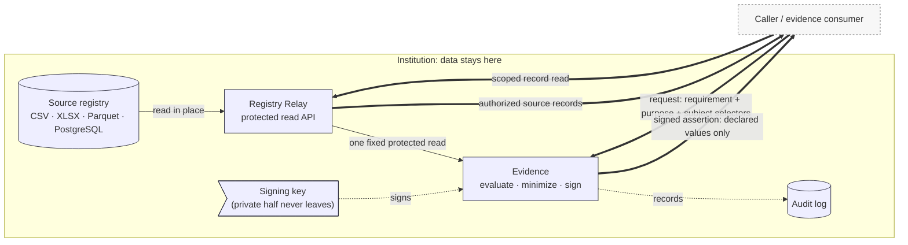

An institution that runs a civil registry, a social-protection database, or a health
registry already holds the records it needs.
Registry Stack lets it **answer bounded questions about those records** (*is this person an
adult? does this licence hold? is this person a legal parent of that child?*) and return a
result another system can trust, while the records themselves are **read where they already
live, never written back, and not copied into a central exchange**.
This page explains what that means in practice: what stays inside the institution's
boundary, what crosses it, and (equally important) what the design does and does not
guarantee.

If you arrive from an older version of this page, one thing has changed. Registry Notary,
the evidence gateway this page used to describe alongside Registry Relay, is retired. The
minimum-disclosure surface an institution runs today is Evidence, and this page describes
that arrangement.

## A question goes in, an answer comes out

The combined Relay and Evidence mental model is one sentence: **a bounded question crosses
into the institution, Relay reads and normalizes the source, Evidence returns one signed
assertion carrying the answer, an evidence consumer uses it, and the decision owner remains
accountable for what happens next.**

An Evidence caller never sends the value it is asking about and never receives the
underlying record as the answer.
It sends the identifier of a *predefined requirement* at an exact revision, the purpose it
acts under, one selector per declared subject role, and a per-request nonce. That is the
whole request: the schema is closed and rejects anything else
(`products/evidence/contracts/request.schema.yaml`).
It receives one signed assertion carrying the values the requirement declares, and nothing
else (`products/evidence/contracts/evidence.schema.yaml`).
The source record the answer was computed from stays behind.

Four questions carry equal weight in the Evidence contract, and none of them is the
canonical one: adult status, residence region, professional licence status, and
legal-parent relationship. All four run the same path, and none is a built-in type or a
special route (`products/evidence/README.md`, `products/evidence/CONCEPT.md`). The
legal-parent question shows the shape most plainly: the caller already holds a reference to
a child and a reference to a candidate parent, and asks whether the relationship holds. The
answer is one boolean. The register's list of that child's parents never travels
(`products/evidence/fixtures/acceptance/legal-parent-relationship/`).

## The boundary

```mermaid
flowchart LR
    subgraph inst["Institution: data stays here"]
        src[("Source registry\nCSV · XLSX · Parquet · PostgreSQL")]
        relay["Registry Relay\nprotected read API"]
        evidence["Evidence\nevaluate · minimize · sign"]
        key>"Signing key\n(private half never leaves)"]
        audit[("Audit log")]
        src -- read in place --> relay
        relay -- one fixed protected read --> evidence
        evidence -. records .-> audit
        key -. signs .-> evidence
    end
    caller["Caller / evidence consumer"]
    caller == "request: requirement + purpose + subject selectors" ==> evidence
    evidence == "signed assertion: declared values only" ==> caller
    caller == "scoped record read" ==> relay
    relay == "authorized source records" ==> caller

    classDef inside fill:#eef,stroke:#334,stroke-width:1px;
    classDef outside fill:#f7f7f7,stroke:#777,stroke-dasharray:3 3;
    class src,relay,evidence,key,audit inside;
    class caller outside;
```

*Two governed surfaces can cross the boundary.* Registry Relay turns an existing file or
database table into a read-only, access-controlled API without replacing the source.
Its scoped record routes can return source records to authorized callers that hold the
dataset's row-read permission.
Evidence answers one predefined requirement about one set of subjects and returns a signed
assertion; it is the only component that evaluates a requirement, minimizes the result, and
signs it.
Evidence is the stronger minimization surface.
Relay record reads are scoped and audited, not open data.

The policy boundary remains separate across the two products and their consumers. Relay
owns source access and adaptation policy. Evidence owns evidence authorization and the
declared disclosure of each requirement.
The evidence consumer determines how evidence is used, and the decision owner remains
accountable for requirements, eligibility, qualification, prioritization, approval, routing,
payment, workflow, and action policy.
Purpose-bound authorization can restrict an evidence request without changing which
component owns the consumer decision. The caller that invokes Evidence can be the evidence
consumer or a technical intermediary acting for it.

## What stays home

- Source data is read in place: Relay reads sources as batch snapshots or table scans;
  there is no write-back to the source registry, and runtime services expose no
  data-mutation routes. The source keeps running as it always has. "No write-back to the
  source and no external handoff" is not the same as "no copy exists": in snapshot mode
  (the default), Relay materializes a projected copy into its local cache (`cache_dir`), which
  carries its own retention and access considerations.
- Storage internals stay private: The paths, table names, and backend credentials that
  point at the source live in Relay's runtime configuration, decided at startup. They
  are never part of the public API surface, and never part of a portable metadata file that
  gets distributed.
- The institution keeps custody: The design premise is *distributed custody*: each
  authority retains control of its own registry data, and the stack does not aggregate
  records into a central system. It provides the exchange surface, not a data lake.
- Evidence keeps no copy of what it read: Version 1 has no application database and
  persists no selector, source, evidence, or response data. Raw source responses are never
  persisted or logged, and selector, source, and disclosed values never reach logs or the
  native audit record (`products/evidence/OPERATOR-CONTRACT.md`, invariants `V1-I14` and
  `V1-I15` in `products/evidence/contracts/security-invariant-matrix.yaml`).
- Private signing keys never leave the issuer: The institution publishes the *public*
  half of its signing key so anyone can verify a signed assertion; the private half stays
  inside, owned by the service core and absent from configuration values, scripts, logs,
  audit, and errors (invariant `V1-I23`).

## What crosses the boundary

What crosses depends on the surface.
Registry Relay can return scoped source records to an authorized caller through a
governed, audited read bounded by the caller's per-dataset row scope and the dataset's
configured filters and limits.
Evidence returns the values a requirement declares rather than the source row; keeping that
answer narrow is a modelling discipline, because a well-modelled requirement declares the
coarsest value form that still answers the question.

An Evidence assertion is a closed document. It carries the requirement it supports, the
evidence type it conforms to, the named issuer and the technical provider, the observation
and validity timestamps, the purpose, the audience, the configuration revision it was
produced under, one opaque binding per subject role, and one to sixteen declared values
(`products/evidence/contracts/evidence.schema.yaml`).
It carries nothing else: the schema rejects additional properties, and subject selector
profiles and selector values never appear in it.

The values themselves are shaped by the requirement's *concept declaration*, which fixes
the exact form each value takes. A boolean answers a yes-or-no question. A controlled code
answers with membership in a reviewed codelist rather than the register's own code. A date
bucket answers with a bucket rather than the underlying date
(`products/evidence/contracts/supported-value-forms.yaml`).
[Disclosure modes and computed answers](../disclosure-modes-and-computed-answers/) works
through what each form does and does not reveal.

## Why the answer is not the record

A subject appears in an assertion only as a role-bound, audience-scoped opaque binding: a
keyed derivation over the audience, purpose, role, profile, binding-key version, and the
complete canonical selector bundle. The same person asked about by two relying parties, or
under two purposes, produces two unrelated bindings, so an assertion is not a correlatable
identifier (`products/evidence/contracts/evidence.schema.yaml`, invariant `V1-I17`).

The same assertion can also be serialized as an **SD-JWT VC** under a frozen local profile,
selected by its own exact media type and released only when both the deployment's reviewed
configuration and the caller's matched grant permit it. That serialization carries one
disclosure per declared value and adds a second encoding of one answer, never a credential
lifecycle: there is no offer, no status list, no revocation, and no persisted credential
state (`products/evidence/contracts/sd-jwt-vc-profile.yaml`).
Its subject binding stays audience-scoped, so it is meaningful to the relying party named
in the assertion and to no other. It is not a general multi-verifier credential.

Anyone can verify a signed assertion against the issuer's published public keys, served
without authentication so a verifier needs no credential of its own. A signature
authenticates the provider and the payload's integrity; it does not assert legal-signature
status or that the source is correct (invariant `V1-I24`).

## How the boundary is enforced

The "stays home" property rests on a few enforced rules, covered in depth in the Trust &
Security material:

- One authorization decision, before any source read: Evidence resolves a single decision
  binding the requester, the requirement revision, the purpose, the audience, the authority
  path, and every subject role's profile and value origin, and denies before it resolves a
  source credential or contacts a source. Permissions are never unioned across grants
  (invariant `V1-I05`). Possession of an identifier does not authorize a lookup
  (invariant `V1-I06`).
- Caller data cannot widen the question: the request schema is closed, so a caller cannot
  supply thresholds, expressions, scripts, paths, headers, source fields, or response
  projections. Every one of those is fixed by reviewed configuration that is immutable for
  the life of the process (invariants `V1-I02` and `V1-I18`).
- Every request is audited, at two gates: Evidence durably accepts an access-attempt record
  after authorization and before it touches a source, and a disclosure-release record after
  the final response bytes exist and before those exact bytes are released. A sink failure
  blocks the step rather than releasing unaudited evidence (invariants `V1-I13` and
  `V1-I29`).
- A refusal reveals nothing: no-match, ambiguous, missing-fact, and inconsistent-derivation
  outcomes collapse to one public problem with the same status, title, and body shape, so a
  caller cannot use the response as an existence oracle for who is in the register
  (invariant `V1-I16`, `products/evidence/contracts/problem-contract.yaml`).

## What this guarantees, and what it does not

"Records stay home" is a precise, narrow promise.

- It is not "data never moves" and not "air-gapped": The promise is *read-in-place, no
  write-back, retained custody*. Authorized, minimized answers do leave the boundary by
  design: that is the point of the system.
- Minimization is modelled, not automatic: A requirement reveals exactly what its concept
  declaration says it reveals. A requirement authored to disclose a precise value discloses
  that precise value. Least disclosure is a design choice the requirement makes, not a
  property the runtime imposes on every answer.
- Purpose does not narrow the answer: A requirement returns the same values and the same
  forms for every purpose authorized to invoke it. Purpose gates whether a caller may ask at
  all; a purpose that justifies a coarser answer needs its own requirement
  (`products/evidence/OPERATOR-CONTRACT.md`).
- One requirement is not the whole disclosure surface: Two requirements that are each safe
  alone can reconstruct a protected value between them. The complete enabled configuration
  is reviewed as one disclosure surface, and that review is an operator duty rather than
  something the runtime can decide (invariant `V1-I03`).
- Correctness depends on the source: Relay reports what the reviewed source consultation says,
  and Evidence derives its answer from what the source returned. Neither product
  independently vouches for whether the source is correct or current.
- Signed is the default, unsigned is not evidence: The signed flattened JWS is mandatory and
  the default result. A separately typed unsigned envelope exists only when both the
  reviewed configuration and the matched grant permit it, carries no integrity protection,
  is never later-verifiable evidence, and is never produced as a fallback from a signing
  failure (invariants `V1-I21` and `V1-I22`).
- Matching is only as strict as the lookup contract: A lookup resolves to exactly one
  match, no match, or ambiguity. Evidence never surfaces or chooses between candidates, and
  emits no candidate count, score, or comparison (invariant `V1-I10`).
- Missing evidence is not a negative fact: A source value of `false`, an absent value,
  no match, ambiguity, and source failure have different reviewed meanings. A derivation
  must not collapse an absent value, an unresolved lookup, or a failure into `false`.
  Existence may be disclosed only as a separately authorized declared value, never as error
  detail (`products/evidence/contracts/problem-contract.yaml`).
- Evidence is not a consumer decision engine: Evidence returns governed evidence. The
  evidence consumer determines how that evidence is used, and the decision owner remains
  accountable for requirements, decisions, workflow, and actions.
- This is not zero-knowledge: A boolean answer is a value computed inside the service from
  data the service read, and SD-JWT selective disclosure is digest omission. Neither is a
  zero-knowledge proof.

This page's promise also sits inside the wider set of stack-wide limits: revocation and
erasure gaps, which guarantees are left to the operator to provide, and the draft status of
the underlying specifications. Weigh those alongside the limits in this section; see the
[known limitations hub](../known-limitations/) for the full inventory.

## Related

- The security model and protocol contracts: [RS-SEC-G](../../spec/rs-sec-g/),
  [RS-PR-RELAY](../../spec/rs-pr-relay/), [RS-PR-EVIDENCE](../../spec/rs-pr-evidence/)
- [Evidence security model](../../security/evidence/)
- [Disclosure modes and computed answers](../disclosure-modes-and-computed-answers/)
- [Threat model](../threat-model/)
