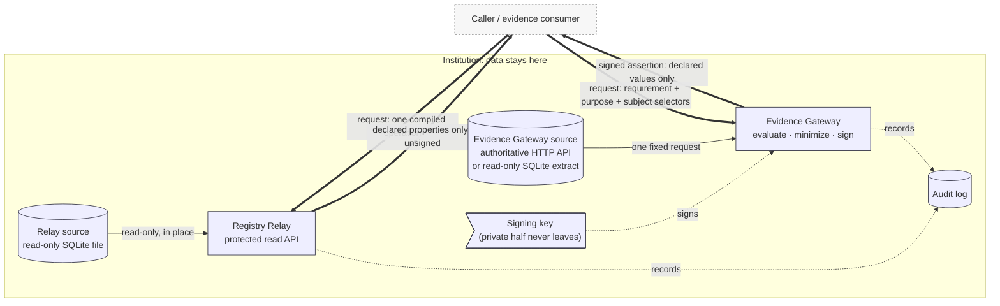

An institution that runs a business register, a facility registry, or a public-authority
directory already holds the records it needs.
Registry Stack lets it **answer bounded questions about those records** (*is this business registered?
is this permit active? does this authority have responsibility for this jurisdiction?*) and return a
result another system can trust, while the records themselves are **read where they already
live, never written back, and not copied into a central exchange**.
This page explains what that means in practice: what stays inside the institution's
boundary, what crosses it, and (equally important) what the design does and does not
guarantee.

## A question goes in, an answer comes out

The Evidence Gateway mental model is one sentence: **a bounded question crosses into the
institution, Evidence Gateway reads its configured authoritative source and returns one signed
assertion carrying the answer, an evidence consumer uses it, and the decision owner remains
accountable for what happens next.** Registry Relay offers a separate protected-read path and is
not part of the Evidence Gateway request.

An Evidence Gateway caller never sends the value it is asking about and never receives the
underlying record as the answer.
It sends the identifier of a *predefined requirement* at an exact revision, the purpose it
acts under, one selector per declared subject role, and a per-request nonce. That is the
whole request: the schema is closed and rejects anything else
(`products/evidence/contracts/request.schema.yaml`).
It receives one signed assertion carrying the values the requirement declares, and nothing
else (`products/evidence/contracts/evidence.schema.yaml`).
The source record the answer was computed from stays behind.

A professional-licence question illustrates the boundary: the caller supplies a reference,
and the configured source returns the facts needed to answer whether the licence is active.
The assertion carries the selected answer instead of the full licence record. This uses the
same runtime as other configured questions, without a built-in licensing endpoint.

{/* Evidence: products/evidence/fixtures/acceptance/professional-licence/;
    products/evidence/README.md; products/evidence/CONCEPT.md. */}

## The boundary

```mermaid
flowchart LR
    subgraph inst["Institution: data stays here"]
        relaySrc[("Relay source\nread-only SQLite file")]
        evidenceSrc[("Evidence Gateway source\nauthoritative HTTP API\nor read-only SQLite extract")]
        relay["Registry Relay\nprotected read API"]
        evidence["Evidence Gateway\nevaluate · minimize · sign"]
        key>"Signing key\n(private half never leaves)"]
        audit[("Audit log")]
        relaySrc -- read-only, in place --> relay
        evidenceSrc -- one fixed request --> evidence
        evidence -. records .-> audit
        relay -. records .-> audit
        key -. signs .-> evidence
    end
    caller["Caller / evidence consumer"]
    caller == "request: requirement + purpose + subject selectors" ==> evidence
    evidence == "signed assertion: declared values only" ==> caller
    caller == "request: one compiled operation" ==> relay
    relay == "declared properties only, unsigned" ==> caller

    classDef inside fill:#eef,stroke:#334,stroke-width:1px;
    classDef outside fill:#f7f7f7,stroke:#777,stroke-dasharray:3 3;
    class relaySrc,evidenceSrc,relay,evidence,key,audit inside;
    class caller outside;
```

*Two governed surfaces can cross the boundary.* Registry Relay compiles a reviewed registry
contract into a fixed set of read-only operations over a read-only SQLite source, without
replacing that source. Its record routes can return published properties to authorized callers,
bounded by the access profile that guards the operation and the disclosure profile that shapes
the response.
Evidence Gateway answers one predefined requirement about one set of subjects and returns a signed
assertion; it is the only component that evaluates a requirement, minimizes the result, and
signs it. It contacts its own configured authoritative source rather than calling Relay, over one
of two coequal transports: a fixed HTTP JSON request to a fixed origin, or one reviewed SQL
statement against a read-only SQLite extract file mounted beside the process.
Evidence Gateway is the stronger minimization surface.
Relay reads are compiled, authorized, and audited, not open data.

{/* Evidence: "A fixed source request reaches its source over one of two coequal transports",
     products/evidence/CONCEPT.md; contracts registry.evidence.fixed-http-json-source/v1,
     products/evidence/contracts/source-contract.yaml, and
     registry.evidence.fixed-sqlite-extract-source/v1,
     products/evidence/contracts/sqlite-extract-source-contract.yaml (both frozen). */}

The policy boundary remains separate across the two products and their consumers. Relay
owns its compiled contract and disclosure policy. Evidence Gateway owns evidence authorization and
the declared disclosure of each requirement.
The evidence consumer determines how evidence is used, and the decision owner remains
accountable for requirements, eligibility, qualification, prioritization, approval, routing,
payment, workflow, and action policy.
Purpose-bound authorization can restrict an evidence request without changing which
component owns the consumer decision. The caller that invokes Evidence Gateway can be the evidence
consumer or a technical intermediary acting for it.

## What stays home

- Source data is read in place, and Relay keeps no copy: Relay opens its SQLite source file
  with `SQLITE_OPEN_READ_ONLY`, and neither of the two source profiles copies it. A `snapshot`
  source is digested and pinned where it sits, and the file must be immutable to this process
  (a read-only filesystem, or a file with no write bits) or Relay refuses it. A
  `live-read-only` source is bound by device and inode and re-checked before use. In both
  profiles Relay refuses a symlinked database and refuses a database with a `-wal` or
  `-journal` sidecar, so it never adapts to a database another process is mid-write on. There
  is no `cache_dir`, no materialization, and no projected local copy.
  {/* Evidence: SQLITE_OPEN_READ_ONLY | SQLITE_OPEN_URI | SQLITE_OPEN_NO_MUTEX,
       crates/registry-platform-sqlite/src/schema.rs:131-133 and src/statement.rs:494-496;
       snapshot immutability requires a read-only filesystem or non-writable mode bits,
       src/capture.rs:42-45; SNAPSHOT_SIDECARS = ["-wal", "-journal"], src/capture.rs:11;
       symlink refusal, src/capture.rs:34-36; snapshot identity is dev/ino/len/mode/mtime/ctime
       (same_file, src/capture.rs:285-296) and live identity is dev+ino (same_live_file,
       src/capture.rs:305-309). */}
- There is no write path at all: Relay serves fourteen fixed routes and exactly one of them
  is a `POST`, which carries a JSON selector body for a read. There is no `PUT`, `PATCH`, or
  `DELETE` anywhere, no provisioning surface, and no administrative endpoint. The source keeps
  running as it always has.
  {/* Evidence: the complete router, crates/registry-relay-v2/src/server.rs router(); the
       compiled statement type is ReadOnlyStatement throughout
       crates/registry-relay-v2/src/sqlite_runtime.rs. */}
- Only reviewed views are readable: Relay observes a source's schema through a filter that
  keeps only SQL views, so a resource can bind to a reviewed view and never to a raw table.
  Whatever the view does not select is unreachable from the API, whether or not any contract
  names it.
  {/* Evidence: observe_sources() filters catalog objects to SchemaObjectKind::View,
       crates/registry-relay-v2/src/source_observation.rs; ObservedSourceSchema carries a
       views field and no tables field, crates/registry-relay-v2/src/model.rs:53-73. This is
       Relay policy, not a registry-platform-sqlite guarantee: that crate owns the SQLite
       safety boundary, not a disclosure policy. */}
- Storage internals stay private: The SQLite file paths live in Relay's deployment-local
  runtime file, which is never served. The source views and columns a contract binds live in
  the compiled registry sealed inside the package, which Relay verifies at startup and does
  not publish. Neither appears in a response body, and an artifact marked operator-only is
  answered with a not-found problem rather than served.
- The institution keeps custody: The design premise is *distributed custody*: each
  authority retains control of its own registry data, and the stack does not aggregate
  records into a central system. It provides the exchange surface, not a data lake.
- Evidence Gateway keeps no copy of what it read: Version 1 has no application database and
  persists no selector, source, evidence, or response data. Raw source responses are never
  persisted or logged, and selector, source, and disclosed values never reach logs or the
  native audit record (`products/evidence/OPERATOR-CONTRACT.md`, invariants `V1-I14` and
  `V1-I15` in `products/evidence/contracts/security-invariant-matrix.yaml`).
- Private signing keys never leave the issuer: The institution publishes the *public*
  half of its signing key so anyone can verify a signed assertion; the private half stays
  inside, owned by the service core and absent from configuration values, scripts, logs,
  audit, and errors (invariant `V1-I23`).

## What crosses the boundary

What crosses depends on the surface.
Registry Relay returns the properties a compiled disclosure profile declares, through a
governed, audited read. An operation's access profile is either public or protected; a protected
operation requires a scope, may require a declared purpose, and may pin every returned row to
the caller's own authority through a bound `:row_authority` parameter derived from a token claim
or from the token's principal identifier. Two fixed transforms can narrow a property further: a
partial string reveal (`***`) and a date reduced to year or year-month. Relay signs nothing; its
responses carry no assertion.
{/* Evidence: an access profile is AccessRule::Public or AccessRule::Protected, whose
     ProtectedAccess carries scope, purpose, and authorityRowBinding, and a row binding is
     AuthorityRowBinding::Claim or AuthorityRowBinding::Principal,
     crates/registry-relay-v2/src/contract.rs; the authorityRowBinding key is spelled that way in
     crates/registry-relayctl/schemas/authoring/registry.schema.json; row authority is injected as a bound
     parameter with an exact-equality COLLATE BINARY predicate, never string concatenation,
     crates/registry-relay-v2/src/sqlite_runtime.rs add_row_authority(). */}
Evidence Gateway returns the values a requirement declares rather than the source row; keeping that
answer narrow is a modelling discipline, because a well-modelled requirement declares the
coarsest value form that still answers the question.

An Evidence Gateway assertion is a closed document. It carries the requirement it supports, the
evidence type it conforms to, the named issuer and the technical provider, the observation
and validity timestamps, the purpose, the audience, the configuration revision it was
produced under, one opaque binding per subject role, and one to sixteen declared values
(`products/evidence/contracts/evidence.schema.yaml`).
It carries nothing else: the schema rejects additional properties, and subject selector
profiles and selector values never appear in it.

The values themselves are shaped by the requirement's *concept declaration*, which fixes
the exact form each value takes. A boolean answers a yes-or-no question. A controlled code
answers with membership in a reviewed codelist rather than the register's own code. A date
bucket answers with a bucket rather than the underlying date
(`products/evidence/contracts/supported-value-forms.yaml`).
[Disclosure modes and computed answers](../disclosure-modes-and-computed-answers/) works
through what each form does and does not reveal.

## Why the answer is not the record

A subject appears in an assertion only as a role-bound opaque binding: a keyed derivation
over one binding scope plus the purpose, role, profile, binding-key version, operator trust
domain, and the complete canonical selector bundle. By default the scope is the audience, so
the same person asked about by two relying parties, or under two purposes, produces two
unrelated bindings and the assertion is not a correlatable identifier
(`products/evidence/contracts/evidence.schema.yaml`, invariant `V1-I17`).

The same assertion can also be serialized as an **SD-JWT VC** under a frozen local profile,
selected by its own exact media type and released only when both the deployment's reviewed
configuration and the caller's matched grant permit it. That serialization carries one
disclosure per declared value and adds a second encoding of one answer, never a credential
lifecycle: there is no offer, no status list, no revocation, and no persisted credential
state (`products/evidence/contracts/sd-jwt-vc-profile.yaml`).
By default its subject binding stays audience-scoped, so it is meaningful to the relying
party named in the assertion and to no other, and it is not a general multi-verifier
credential.

A requirement can instead declare the **holder-bound** binding mode, which is where the
boundary this page describes is deliberately relaxed. The binding then derives from the RFC
7638 thumbprint of the holder key rather than the audience, so one credential is presentable
to several verifiers and the holder decides which. The record still stays home: nothing about
the source, the selectors, or the underlying values changes, and the credential carries the
same declared answer. What changes is who can join two presentations together. Holder key
reuse links a holder across every verifier that sees the same key, and the service can neither
prevent nor detect it. Possession is proven at presentation by a key-binding JWT the relying
party verifies, not by the audience at issuance, and verifying that JWT proves possession at
signing time and nothing about freshness or replay
(`products/evidence/contracts/holder-bound-profile.yaml`).

Anyone can verify a signed assertion against the issuer's published public keys, served
without authentication so a verifier needs no credential of its own. A signature
authenticates the provider and the payload's integrity; it does not assert legal-signature
status or that the source is correct (invariant `V1-I24`).

## How the boundary is enforced

The "stays home" property rests on a few enforced rules, covered in depth in the Trust &
Security material. Registry Relay enforces these:

- The runtime executes only compiled statements: a caller cannot supply SQL, an expression, a
  path, a projection, or a filter. Every statement Relay runs was produced by the compiler from
  the reviewed contract, and the runtime refuses positional SQL parameters outright, accepting
  only the named parameters the contract declared and binding them by pre-resolved ordinal.
  {/* Evidence: contains_positional_parameter() rejects ?/?N with
       ErrorKind::UndeclaredParameter, crates/registry-platform-sqlite/src/statement.rs:800-851;
       named parameters are bound by resolved 1-based ordinal via raw_bind_parameter,
       src/statement.rs:918-930. */}
- The package is verified before anything else opens: at startup Relay re-derives the compiled
  registry and every generated artifact from the sealed authored inputs and requires
  byte-for-byte equality, before it opens a source, an audit sink, an issuer, or a listener.
  Read `packageRevision` as an integrity digest, not an authenticity proof: the package is not
  signed, and a caller who can rewrite the package can recompute it.
  {/* Evidence: prepare() loads and verifies the package first,
       crates/registry-relay-v2/src/startup.rs:96-104; verify_compiled_derivation and
       verify_artifact_derivation re-run the compiler and artifact generator and compare bytes,
       crates/registry-relay-v2/src/package.rs; the crate's own comment states that
       "packageRevision is an integrity digest, not an authenticity proof". */}
- Audit fails closed, with no switch: if the audit sink cannot durably accept the attempt or
  terminal record, the request is refused with a 503 `audit.unavailable` problem rather than
  answered. This is not configurable, and readiness re-checks the sink, so replacing the audit
  file live takes the deployment out of `/ready`.
  {/* Evidence: every audit failure path returns ProblemCode::AuditUnavailable,
       crates/registry-relay-v2/src/api.rs; ProblemCode::AuditUnavailable maps to 503,
       crates/registry-relay-v2/src/problem.rs; test audit_path_replacement_revokes_readiness,
       crates/registry-relay-v2/src/startup.rs. */}
- Nothing that identifies a person reaches a log: operational logging maps a URI onto a closed
  set of literal route shapes before recording it, so no identifier, selector, or query value
  can appear. `RELAY_LOG` accepts only `off`, `error`, `warn`, `info`, `debug`, and `trace`, and
  any other value collapses to `info`, so it cannot be used to switch on a dependency's own
  logging of URLs or headers. The audit record itself carries identifiers, revisions, profile
  names, and transform identifiers, never row values.
  {/* Evidence: operational_route() and the tests
       operational_dimensions_never_include_request_values and
       operational_trace_identifier_is_closed_and_bounded,
       crates/registry-relay-v2/src/server.rs; operational_log_directive() and the test
       operational_log_filter_cannot_enable_dependency_targets,
       crates/registry-relay-v2/src/main.rs; AUDIT_SCHEMA registry.relay.audit/v2alpha1 and the
       value-free AuditContext, crates/registry-relay-v2/src/audit.rs. */}

Evidence Gateway enforces these:

- One authorization decision, before any source read: Evidence Gateway resolves a single decision
  binding the requester, the requirement revision, the purpose, the audience, the authority
  path, and every subject role's profile and value origin, and denies before it resolves a
  source credential or contacts a source. Permissions are never unioned across grants
  (invariant `V1-I05`). Possession of an identifier does not authorize a lookup
  (invariant `V1-I06`).
- Caller data cannot widen the question: the request schema is closed, so a caller cannot
  supply thresholds, expressions, scripts, paths, headers, source fields, or response
  projections. Every one of those is fixed by reviewed configuration that is immutable for
  the life of the process (invariants `V1-I02` and `V1-I18`).
- Every request is audited, at two gates: Evidence Gateway durably accepts an access-attempt record
  after authorization and before it touches a source, and a disclosure-release record after
  the final response bytes exist and before those exact bytes are released. A sink failure
  blocks the step rather than releasing unaudited evidence (invariants `V1-I13` and
  `V1-I29`).
- A refusal reveals nothing: no-match, ambiguous, missing-fact, and inconsistent-derivation
  outcomes collapse to one public problem with the same status, title, and body shape, so a
  caller cannot use the response as an existence oracle for who is in the register
  (invariant `V1-I16`, `products/evidence/contracts/problem-contract.yaml`).

## What this guarantees, and what it does not

"Records stay home" is a precise, narrow promise.

- It is not "data never moves" and not "air-gapped": The promise is *read-in-place, no
  write-back, retained custody*. Authorized, minimized answers do leave the boundary by
  design: that is the point of the system.
- Minimization is modelled, not automatic: A requirement reveals exactly what its concept
  declaration says it reveals. A requirement authored to disclose a precise value discloses
  that precise value. Least disclosure is a design choice the requirement makes, not a
  property the runtime imposes on every answer.
- Purpose does not narrow the answer: A requirement returns the same values and the same
  forms for every purpose authorized to invoke it. Purpose gates whether a caller may ask at
  all; a purpose that justifies a coarser answer needs its own requirement
  (`products/evidence/OPERATOR-CONTRACT.md`).
- One requirement is not the whole disclosure surface: Two requirements that are each safe
  alone can reconstruct a protected value between them. The complete enabled configuration
  is reviewed as one disclosure surface, and that review is an operator duty rather than
  something the runtime can decide (invariant `V1-I03`).
- Correctness depends on the source: Relay reports what the reviewed source view returns, and
  Evidence Gateway derives its answer from what the source returned. Neither product
  independently vouches for whether the source is correct or current.
- Relay minimization is contract-level, not per-caller: an operation returns the properties its
  disclosure profile declares, the same way for every caller authorized to invoke it. Narrowing
  what one audience sees means compiling a second operation with its own disclosure profile, not
  configuring the runtime.
- A Relay response is not evidence: Relay signs nothing. Its responses carry no signature and no
  assertion, so a recipient can rely on the transport and on the deployment it called, and on
  nothing that survives being forwarded. Only Evidence Gateway issues a later-verifiable
  artifact.
  {/* Evidence: the crate has no signing path; products/relay-v2/CONCEPT.md lists response
       signing among the non-goals and states Relay V2 is not a credential or signed-assertion
       issuer. */}
- Snapshot immutability is an operator duty: Relay refuses a writable snapshot file and detects
  a replaced or altered one, but a privileged writer that changes bytes and restores them
  between two verifications is outside what the process can exclude. A snapshot deployment
  should place the file on a read-only mount.
  {/* Evidence: the verify_unchanged_until comment states that a process cannot exclude a
       privileged writer changing and restoring bytes entirely between the two hashes,
       crates/registry-platform-sqlite/src/capture.rs. */}
- Signed is the default, unsigned is not evidence: The signed flattened JWS is mandatory and
  the default result. A separately typed unsigned envelope exists only when both the
  reviewed configuration and the matched grant permit it, carries no integrity protection,
  is never later-verifiable evidence, and is never produced as a fallback from a signing
  failure (invariants `V1-I21` and `V1-I22`).
- Matching is only as strict as the lookup contract: A lookup resolves to exactly one
  match, no match, or ambiguity. Evidence Gateway never surfaces or chooses between candidates, and
  emits no candidate count, score, or comparison (invariant `V1-I10`).
- Missing evidence is not a negative fact: A source value of `false`, an absent value,
  no match, ambiguity, and source failure have different reviewed meanings. A derivation
  must not collapse an absent value, an unresolved lookup, or a failure into `false`.
  Existence may be disclosed only as a separately authorized declared value, never as error
  detail (`products/evidence/contracts/problem-contract.yaml`).
- Evidence Gateway is not a consumer decision engine: Evidence Gateway returns governed evidence. The
  evidence consumer determines how that evidence is used, and the decision owner remains
  accountable for requirements, decisions, workflow, and actions.
- This is not zero-knowledge: A boolean answer is a value computed inside the service from
  data the service read, and SD-JWT selective disclosure is digest omission. Neither is a
  zero-knowledge proof.

This page's promise also sits inside the wider set of stack-wide limits: revocation and
erasure gaps, which guarantees are left to the operator to provide, and the draft status of
the underlying specifications. Weigh those alongside the limits in this section; see the
[known limitations hub](../known-limitations/) for the full inventory.

## Related

- The security model and protocol contracts: [RS-SEC-G](../../spec/rs-sec-g/),
  [RS-PR-RELAY](../../spec/rs-pr-relay/), [RS-PR-EVIDENCE](../../spec/rs-pr-evidence/)
- [Evidence Gateway security model](../../security/evidence/)
- [Disclosure modes and computed answers](../disclosure-modes-and-computed-answers/)
- [Threat model](../threat-model/)
