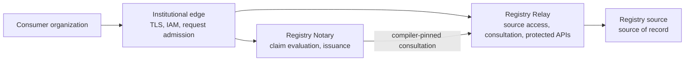

Use this guide when an institution runs a single-node Docker Compose deployment behind its own
reverse proxy and identity and access management layer. The proxy owns public Transport Layer
Security (TLS), hostnames, request admission, and edge logs. Relay and Notary still enforce their
own authentication, scopes, purpose, disclosure, and audit contracts.

## When to use this

Use this topology when:

- One virtual machine runs the product containers.
- An institutional reverse proxy already owns public TLS and front rate limiting.
- The proxy reaches the containers over loopback or a private network.
- The deployment has an approved Registry Stack project and separately verified product bundles.

Do not use this guide for Kubernetes, active-active high availability, service mesh, or native
exchange-layer adapters.

## Boundary map



Relay owns every registry source origin, credential, adaptation recipe, and minimized
consultation result. Notary consumes a compiler-pinned Relay consultation for registry-backed
claims. A Notary-only deployment evaluates source-free or self-attested claims and has no source
connection.

## Before you start

You need:

- Docker Compose on the virtual machine
- Public Relay and Notary hostnames for the selected topology
- An institutional secret store and audit destination
- A reviewed project environment with private source and workload bindings
- Verified Relay and Notary Config Bundles for the products in the topology
- An edge policy that forwards only the required authentication, purpose, tracing, and content
  headers

## Author and verify the project

Run the offline fixture and semantic gates before deployment:

```sh
registryctl test --project-dir <project>
registryctl check \
  --project-dir <project> \
  --environment <environment> \
  --explain
registryctl build \
  --project-dir <project> \
  --environment <environment>
```

The test and build JSON reports contain `"status": "passed"` and `"status": "built"`.
The human-readable check report marks the project `valid`.
Confirm the selected topology emits only the expected product inputs. A combined project emits
separate Relay and Notary inputs with the same approval state. It does not emit a signed
project-level root.

Package and sign each generated product input, then verify it against the product trust anchor:

```sh
registryctl bundle sign \
  --input <product-input> \
  --key <approved-signing-key> \
  --product <product-id> \
  --environment <environment> \
  --stream-id <stream-id> \
  --sequence <sequence> \
  --bundle-id <bundle-id> \
  --out <signed-bundle>
registryctl bundle verify \
  --bundle-dir <signed-bundle> \
  --anchor-path <product-trust-anchor>
```

Activation remains product-specific. Keep each verified bundle, trust anchor, anti-rollback state,
and secret provider binding within the owning product's deployment boundary.

## Bind Compose ports to the proxy side

Publish product ports only to loopback when the proxy runs on the same virtual machine:

```yaml
services:
  registry-relay:
    ports:
      - "127.0.0.1:4242:8080"
  registry-notary:
    ports:
      - "127.0.0.1:4255:8080"
```

Omit the product that is not part of the selected topology. When the proxy runs on another host,
bind the private interface and block direct public access at the firewall.

Do not publish admin, metrics, posture, or reload routes through the public edge. Keep internal
Notary-to-Relay traffic on the private Compose network. The Notary Relay binding is a workload
consultation client, not a registry source connector.

Validate the Compose file:

```sh
docker compose -f compose.yaml config
```

The command prints the normalized Compose configuration and exits non-zero for an invalid file.

## Configure the edge

The institutional edge owns:

| Responsibility | Placement |
| --- | --- |
| Public TLS certificate and HTTPS redirect | Reverse proxy listeners for the public product hostnames |
| Organization membership or IAM admission | Before proxying to the virtual machine |
| Front rate limiting | At the same edge, before forwarding to Relay or Notary |
| Header normalization | Strip caller-supplied identity headers and forward only reviewed headers |
| Body, header, and connection timeouts | Reverse proxy listeners before the product containers |
| Correlation trail | Edge access logs joined to product audit references |

Proxy authentication does not replace product authentication. Relay and Notary must validate the
API key or bearer token they receive. Do not authorize a product route from `X-User`, `X-Org`, or
another forwarded identity header.

## Preserve the combined boundary

For a combined deployment, verify these properties before starting public traffic:

- Only Relay receives registry source origins, credentials, private certificates, and protocol
  adaptation configuration.
- Notary receives the compiler-pinned Relay profile, contract hash, workload client id, and token
  file required by the generated claim configuration.
- The private Notary-to-Relay route is reachable without traversing the public proxy.
- The Relay workload policy admits only the consultation profiles required by the active Notary
  claims.
- Public callers never receive the Notary workload credential or a source credential.

For a Notary-only deployment, verify that no Relay service or registry source binding is present.

## Start and verify

Start the activated product configuration:

```sh
docker compose -f compose.yaml up -d
docker compose -f compose.yaml ps
```

Check the products in the selected topology through the public edge:

```sh
curl -fsS https://registry.example.gov/healthz
curl -fsS https://registry.example.gov/ready
curl -fsS https://notary.example.gov/healthz
curl -fsS https://notary.example.gov/ready
```

Omit checks for a product that is not deployed. Then run an authorized protected Relay read or
Notary evaluation using synthetic identifiers. Confirm anonymous calls fail, required purpose and
scope checks run before source work, and the edge and product audit references can be joined
without exposing credentials or raw subject identifiers.

## Troubleshooting

| Symptom | Cause | Fix |
| --- | --- | --- |
| All clients appear as the proxy IP | The trusted proxy address is absent or incorrect. | Bind the exact proxy address or reviewed CIDR in the owning product configuration. |
| Authenticated calls fail through the proxy | The proxy removed a required authentication or purpose header. | Forward only the reviewed product headers and keep caller identity headers untrusted. |
| Notary cannot call Relay | The private service name, workload credential, or Relay policy does not match the generated combined topology. | Restore the compiler-generated Relay binding and keep the call on the private Compose network. |
| Notary contains a source credential | The deployment bypassed the convergence boundary. | Remove the direct binding and rebuild the combined project so Relay owns source access. |
| The edge rate limit is not visible to product diagnostics | Deployment evidence was asserted before the edge control was active. | Activate and test the edge policy before recording the deployment evidence. |

## Next

- [Back up and restore a deployment](../backup-and-restore/)
- [Retention and persistent state](../retention-and-persistent-state/)
- [Upgrade and roll back a deployment](../upgrade-and-rollback/)
- [Harden a production deployment](../../security/hardening-checklist/)
- [Registry Stack project authoring](../../tutorials/author-registry-project/)
