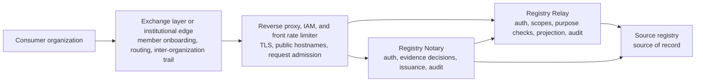

Use this guide when a government IT team runs a single-node Docker Compose deployment on a
virtual machine behind an institution-owned reverse proxy and identity and access management
(IAM) layer.
The reverse proxy owns public Transport Layer Security (TLS), hostnames, IAM integration,
front rate limiting, and edge logs.
Registry Relay and Registry Notary still own service authentication, scopes, purpose checks,
minimized source reads, posture, and audit inside the registry boundary.

X-Road and Registry Stack solve complementary parts of a secure data-exchange architecture.
For 1.0, this guide stays generic: it shows where an exchange layer or equivalent institutional
edge sits, but product-specific X-Road onboarding and message profiles are deferred to later
guides.

## When to use this

Use this topology when:

- the deployment runs on one virtual machine with Docker Compose;
- an existing reverse proxy or gateway already owns public TLS certificates and IAM;
- the proxy can reach the VM on a loopback or private address;
- a front rate limiter terminates before traffic reaches Relay or Notary.

Do not use this guide for Kubernetes, active-active high availability, service mesh, or
native X-Road adapter setup.
Those topologies are outside the 1.0 deployment profile.

## Boundary map



The front rate limiter terminates at the reverse-proxy edge, before requests enter the
Registry Relay or Registry Notary containers.
The exchange or institutional edge can authenticate the organization and protect the
inter-organization channel, while Relay and Notary still authenticate the API caller they see.
Do not turn a proxy login page or a forwarded identity header into product authorization unless
Relay or Notary is configured to verify the token itself.

## Before you start

- Install Docker Compose and `registryctl` on the VM.
- Choose the public hostnames, such as `registry.example.gov` and `notary.example.gov`.
- Choose whether Relay and Notary use generated API keys or OpenID Connect (OIDC) bearer tokens.
- Confirm the reverse proxy can forward `Authorization`, `x-api-key`, `Data-Purpose`,
  `traceparent`, and one normalized request-id header.
- Configure or request a front rate limiter at the same edge that terminates TLS.
- Follow [Back up and restore a deployment](../backup-and-restore/) before moving an existing
  generated project.

## Generate and smoke-test locally

Generate the project and add Notary before exposing it through the proxy:

```sh
registryctl init relay my-registry --sample benefits
cd my-registry
registryctl add notary --from local-relay
registryctl start
registryctl smoke
registryctl notary smoke
```

`registryctl init` and `registryctl add notary` print the generated Bruno collection path.
The smoke commands print `PASS` lines for health, readiness, denied anonymous calls, and the
configured sample reads or claim checks.
Keep this local smoke run before hardening the public deployment; later steps gate OpenAPI
and change the public base URLs.

## Bind Compose ports to the proxy side only

Edit `compose.yaml` so host ports are not exposed on every interface.
When the reverse proxy runs on the same VM, bind Relay and Notary to loopback:

```yaml
services:
  registry-relay:
    ports:
      - "127.0.0.1:4242:8080"
  registry-notary:
    ports:
      - "127.0.0.1:4255:8080"
```

When the reverse proxy runs on another host in a private subnet, bind the VM's private address
instead of `127.0.0.1` and block direct public access to those ports at the firewall.
Also edit `registryctl.yaml` so local probes use the private address from the host where you run
`registryctl restart`, `registryctl smoke`, and `registryctl notary smoke`:

```yaml
runtime:
  relay_base_url: http://10.0.0.5:4242
  notary_base_url: http://10.0.0.5:4255
```

Keep the generated loopback URLs when the proxy and `registryctl` run on the same VM.
Do not publish product admin, metrics, posture, or reload routes through the public edge.
If Relay uses `server.admin_bind`, keep that listener on loopback or a private operations
network.

Validate the edited Compose file:

```sh
docker compose -f compose.yaml config
```

Expected output is the normalized Compose configuration.

## Set public URLs and gate discovery

Edit `relay/config.yaml` so public metadata points at the reverse proxy hostname and runtime
OpenAPI is gated before the service is public:

```yaml
server:
  bind: 0.0.0.0:8080
  openapi_requires_auth: true
  trust_proxy:
    enabled: true
    trusted_proxies:
      - 127.0.0.1/32

catalog:
  base_url: https://registry.example.gov
```

Replace `127.0.0.1/32` with the proxy address or CIDR range that connects to Relay.
Relay uses `server.trust_proxy` to resolve the client address for audit and local auth-failure
throttling; an empty `trusted_proxies` list means `X-Forwarded-For` is ignored.

If the project includes Notary, edit `notary/config.yaml`:

```yaml
server:
  bind: 0.0.0.0:8080
  openapi_requires_auth: true

evidence:
  api_base_url: https://notary.example.gov
  source_connections:
    relay:
      base_url: http://registry-relay:8080
```

Keep Notary's source connection to Relay on the internal Compose network unless your deployment
intentionally calls Relay through the proxy.
Set every public issuer, status, and OpenID for Verifiable Credential Issuance URL to the public
Notary HTTPS origin before issuing credentials.

## Keep IAM and product auth separate

The proxy can enforce institutional IAM before forwarding a request, but Relay and Notary still
need their own API authentication.

- In generated API-key mode, keep `secrets/local.env` out of Git and pass the caller credential
  through unchanged: Relay expects `Authorization: Bearer ...`, and Notary expects `x-api-key`.
- In OIDC mode, configure Relay or Notary with the identity provider issuer, audience, JSON Web
  Key Set discovery, allowed algorithms, and scope mapping. A proxy-authenticated session is not
  enough unless the product validates the bearer token.
- Do not authorize product routes from `X-User`, `X-Org`, or similar forwarded headers.
  Use those headers only for edge logs or upstream systems that explicitly trust that proxy.

Rotate generated demo credentials before production use.
For API keys, store only fingerprints in product config and distribute raw keys through the
institution's secret process.

## Configure the edge

Configure the reverse proxy or gateway with these responsibilities:

| Edge responsibility | Placement |
|---|---|
| Public TLS certificate and HTTPS redirect | Reverse proxy listener on `registry.example.gov` and `notary.example.gov` |
| IAM login or organization membership check | Before proxying to the VM |
| Front rate limiting | Same edge, before forwarding to Relay or Notary |
| Header normalization | Strip caller-supplied identity headers, then set only reviewed headers |
| Request body and header timeouts | Reverse proxy listener before product containers |
| Correlation trail | Edge access logs plus product audit records |

The rate limiter is required for this 1.0 topology.
After it is configured, Relay deployments that declare a production or evidence-grade profile can
set `deployment.evidence.ingress_rate_limit: true` because the gateway now enforces the control.
Do not set that flag until the gateway rule is active.

## Preserve correlation and audit references

Pick one edge request id and keep it stable across the exchange trail, proxy logs, and product
calls.
If the exchange layer or workflow engine already emits W3C `traceparent`, forward it only when
your logging policy allows that trace context to cross the boundary.
For request-id headers, prefer a value generated or normalized by the proxy over a raw caller
header.

Preserve these references where allowed:

- exchange message id or member id in the exchange evidence trail;
- proxy request id and trace id in edge logs;
- product audit record ids or audit hashes from Relay and Notary;
- source-system transaction id when the source registry returns one.

Do not log bearer tokens, API keys, full query strings containing personal identifiers, raw subject
records, or credential bodies in the proxy.
Metrics are for operations, not request-level accountability; use audit records for security
review and incident reconstruction.

## Restart and verify through the proxy

Restart after config edits:

```sh
registryctl restart
registryctl doctor --profile local --format json
```

`doctor` prints a JSON report.
Resolve any `startup_fail` finding before routing public traffic.

Check Relay through the proxy:

```sh
set -a
. secrets/local.env
set +a

curl -fsS https://registry.example.gov/healthz
curl -fsS https://registry.example.gov/ready
curl -fsS -G \
  -H "Authorization: Bearer $ROW_READER_RAW" \
  -H "Data-Purpose: https://example.local/purpose/tutorial" \
  --data-urlencode "household_id=hh-1001" \
  https://registry.example.gov/v1/datasets/benefits_casework/entities/person/records
```

The health and readiness calls return HTTP 200.
The protected read returns a JSON response with records from the sample dataset.

Check Notary through the proxy when the project includes it:

```sh
curl -fsS https://notary.example.gov/healthz
curl -fsS https://notary.example.gov/ready
curl -fsS \
  -H "x-api-key: $REGISTRY_NOTARY_TUTORIAL_EVALUATOR_RAW" \
  -H "Content-Type: application/json" \
  -H "Accept: application/vnd.registry-notary.claim-result+json" \
  -H "Data-Purpose: https://example.local/purpose/tutorial" \
  -d '{
    "target": {"type": "person", "id": "per-2001"},
    "claims": ["benefits-person-exists"],
    "disclosure": "predicate",
    "purpose": "https://example.local/purpose/tutorial"
  }' \
  https://notary.example.gov/v1/evaluations
```

The evaluation returns a claim-result JSON response for `benefits-person-exists`.

Finally, verify operational controls:

- unauthenticated protected routes return `401`;
- `GET /openapi.json` requires authentication unless this is a controlled tooling environment;
- `/admin/*`, `/metrics`, and posture routes are not reachable from the public edge;
- the front rate limiter returns `429` when its threshold is exceeded;
- new Relay and Notary audit records can be joined to the edge request id without exposing secrets.

## Troubleshooting

| Symptom | Cause | Fix |
|---|---|---|
| All clients appear as the proxy IP in Relay audit records | `server.trust_proxy` is disabled or `trusted_proxies` is empty | Add the proxy address or CIDR range to `server.trust_proxy.trusted_proxies` |
| `registryctl smoke` fails after hardening | The generated local smoke assumes unauthenticated OpenAPI and local URLs | Use the explicit proxy verification commands on this page after setting public URLs |
| Authenticated calls work locally but fail through the proxy | The proxy stripped `Authorization`, `x-api-key`, or `Data-Purpose` | Allow only the required product auth and purpose headers through the proxy |
| `doctor` reports missing ingress rate-limit evidence | Relay cannot observe the gateway control | Configure the front rate limiter, then set `deployment.evidence.ingress_rate_limit: true` |
| Notary cannot call Relay | `evidence.source_connections.relay.base_url` points at the public hostname but the container cannot reach it | Keep the source connection on `http://registry-relay:8080` unless the proxy path is intentional and reachable |

## Next

- [Back up and restore a deployment](../backup-and-restore/)
- [Retention and persistent state](../retention-and-persistent-state/)
- [Upgrade and roll back a deployment](../upgrade-and-rollback/)
- [Harden a production deployment](../../security/hardening-checklist/)
- [Integration patterns](../../explanation/integration-patterns/)
