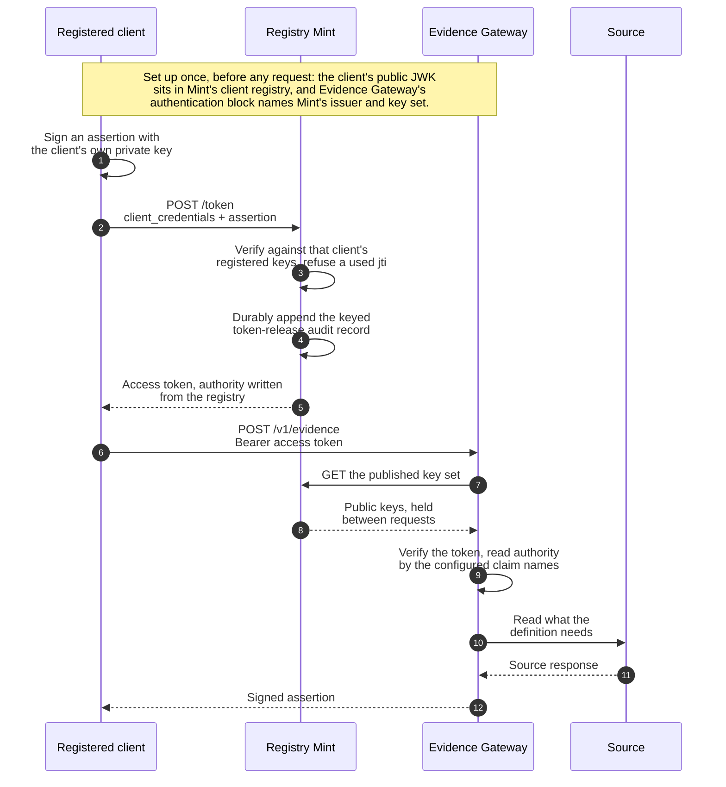

Registry Mint is the `mint` binary built from the `registry-mint` crate. It issues short-lived
access tokens to registered machine clients, for deployments that have callers and no identity
provider.

## Contract status

Registry Stack as a whole is a pre-1.0 technical release. Registry Mint's configuration, HTTP, and
CLI surfaces do not appear among the covered surfaces in
[API stability and versioning](../api-stability/), so those surfaces may change without a major
release until Mint is added to that table. The released Mint image name and digest-verification
interface are covered release artifacts.

The current implementation enforces the `client_credentials` grant, registered client
authentication with `private_key_jwt` (RFC 7523) as the default or an explicitly selected
client-secret compatibility profile, the collapse of every client-authentication failure to
`invalid_client`, and the rule that authority is written from the client registry and never from
the caller's own request. These are current properties, not compatibility promises.

## Source of truth

The `registry-mint` crate at `crates/registry-mint/` is the source of truth for Mint runtime,
configuration, HTTP, token, and audit behavior. Configuration parsing and validation live in
`crates/registry-mint/src/config.rs` and
`crates/registry-mint/src/clients.rs`, the HTTP surface in
`crates/registry-mint/src/server.rs`, token minting in `crates/registry-mint/src/token.rs`, and
client-secret generation in `crates/registry-mint/src/client_secret.rs`, and the keyed audit
boundary in `crates/registry-mint/src/audit.rs`. The public error shape lives in
`crates/registry-mint/src/error.rs`. Release image and digest claims are owned under `release/`;
Evidence and Relay verification claims are owned by those runtimes and their shared OIDC code.
`crates/registry-mint/README.md` covers the Mint surface in prose.

## Official container image

Starting with `v0.21.0`, Registry Stack publishes Registry Mint as
`ghcr.io/registrystack/mint:v0.21.0`. The image uses the distroless nonroot
runtime identity, UID and GID 65532, with no shell or package tools. Pin the digest recorded in the
checksum-covered `registry-stack-v0.21.0-release-manifest.json` public release asset, following
[`release/VERIFY.md`](https://github.com/registrystack/registry-stack/blob/v0.21.0/release/VERIFY.md).

The image reads `MINT_CONFIG`, which defaults to
`/etc/registry-mint/config.yaml`. Mount the configuration and immutable relative inputs read-only
under `/etc/registry-mint`. Set `audit.path` to an absolute path under the writable
`/var/lib/registry-mint/audit` directory and attach persistent storage
owned by UID and GID 65532. The image exposes port `8081` and serves
`GET /health` for an external HTTP probe; it does not include a Docker
`HEALTHCHECK`.

## Configuration reference

One YAML document, loaded by `MintConfig::load`. Fields use `camelCase` keys, reject unknown
fields, and every relative path resolves against the configuration file's own directory. The
following tables group the surface by the struct that owns each field.

### Top level

| Field | Type | Default | Notes |
| --- | --- | --- | --- |
| `version` | integer | required | Must equal `1`. |
| `validationMode` | `strict` or `supervised-local-development` | `strict` | Strict mode requires Transit. Supervised local development also permits `local-jwk`. |
| `issuer` | string (URL) | required | Strict mode requires HTTPS with a host and no credentials, query, or fragment. Supervised local mode also accepts only canonical `http://127.0.0.1:<nonzero-port>`, aligned with the listener, JWKS path, and `${issuer}/token` assertion audience. |
| `listener` | object | required | See [Listener](#listener). |
| `signing` | object | required | See [Signing](#signing). |
| `signer` | object | required | The local-JWK or Transit signing provider. |
| `secretProviders` | object | required | File-secret root for local signing and audit masters. |
| `audit` | object | required | See [Audit](#audit). |
| `accessTokens` | object | required | See [Access tokens](#access-tokens). |
| `clientAssertion` | object | required | See [Client assertion](#client-assertion). |
| `clients` | object | required | See [Clients](#clients). |

### Listener

| Field | Type | Default | Notes |
| --- | --- | --- | --- |
| `address` | string (IP address) | required | Parsed as an `IpAddr`. |
| `port` | integer (`u16`) | required | |
| `maximumRequestBytes` | integer (`u32`) | `16384` | Bounded `1024..=1048576`. |
| `requestTimeoutMilliseconds` | integer (`u64`) | `5000` | Bounded `1..=30000`. |

### Signing

| Field | Type | Default | Notes |
| --- | --- | --- | --- |
| `algorithm` | `ES256` | required | Fixed service-token signing algorithm. Client assertions have their own allowlist. |
| `activePublicJwkFile` | path | required | Exact six-member public ES256 P-256 JWK for the signer. Its `kid` must be the 43-character RFC 7638 thumbprint, and the file name must be `<thumbprint>.jwk.json`. |
| `publishedPublicJwkFiles` | list of paths | `[]` | Other current public P-256 JWKs that remain in JWKS during a planned rotation. Active plus published is limited to 33 unique keys. |
| `revokedKeyIds` | list of thumbprints | `[]` | At most 33 unique RFC 7638 thumbprints. They cannot be active, published, or returned by JWKS. |
| `jwksPath` | string | `/.well-known/jwks.json` | A plain absolute path: one or more non-empty segments of `A-Z a-z 0-9 - . _ ~`, no dot segments, and no query, fragment, or route pattern. Must not be `/token`, `/health`, `/ready`, `/.well-known/oauth-authorization-server`, or `/.well-known/openid-configuration`. |

### Signer

`signer.kind` is `transit` in strict mode and `local-jwk` only for supervised local development.
A Transit configuration has an absolute `unixSocketPath`; non-empty `mount` and `keyName` values of
at most 128 ASCII letters, digits, `-`, or `_`; a nonzero pinned `keyVersion`; and
`timeoutMilliseconds` from 1 through 30000. The socket points to a workload-local proxy, not a
network provider. Mint verifies the public key, Transit custody controls, key version, and a
signature before readiness admits traffic. A local-JWK configuration has only `privateKeyRef`; its
resolved key must match `activePublicJwkFile`.

### Secret provider

`secretProviders.file.root` must be absolute. Every secret reference uses the exact
`secret:file/<name>` grammar. The name starts with a lowercase ASCII letter, continues with lowercase
letters, digits, `.`, `_`, or `-`, and is at most 128 characters.

### Audit

| Field | Type | Default | Notes |
| --- | --- | --- | --- |
| `path` | path | required | One keyed JSONL chain. The parent directory and existing chain must be owner-only. |
| `maximumFileBytes` | integer (`u64`) | required | Per-segment rotation threshold, from `1048576` through `1099511627776` bytes. |
| `hashKeyRef` | `secret:file/<name>` | required | At least 32 bytes in a regular, owner-only file beneath `secretProviders.file.root`. Must differ from the local signing key reference. |
| `hashKeyVersion` | integer (`u32`) | required | Must be non-zero. Labels keyed pseudonyms so an operator can identify the correlating key generation. |

Mint takes a single-writer lock, verifies the active chain at startup, and synchronizes the chain
and its parent directory for each append. When an append would exceed `maximumFileBytes`, Mint
seals the active segment as `<path>.<eight-digit-sequence>` and opens a new active segment online.
The keyed chain continues across segments. Mint does not delete or compact sealed segments, so the
operator owns total capacity, backup, and retention. Verify retained records with:

```sh
mint verify-audit --config /etc/registry-mint/config.yaml
```

The command verifies every sealed segment and reports a missing sequence distinctly. It verifies
the active segment when no Mint process owns the writer lock; otherwise it reports
`active-segment: not verified`. Archive sealed segments oldest first. Do not rename or archive the
active segment while Mint is running.

The chain stores a random operation id for every decision. Successful release records add the
token `jti`, signing key id, expiry, delegated status, and keyed pseudonyms for correlation.
Denial records carry only a value-free error category. Raw assertions, access tokens, client ids,
principals, authority values, actors, and subject values are not stored.

### Access tokens

| Field | Type | Default | Notes |
| --- | --- | --- | --- |
| `audiences` | list of strings (1..=16 entries, 1..=512 bytes each) | required | Written as the minted token's `aud`. |
| `lifetimeSeconds` | integer (`u64`) | required | Bounded `60..=3600`; a deployment with any standard authorization registration is further bounded to `<=900`. |
| `claims` | object | none | Evidence claim names. Required when any client uses the Evidence authority profile. Scoped-only deployments omit it. |

### Access token claim names

| Field | Type | Default | Notes |
| --- | --- | --- | --- |
| `principal` | string | `sub` | |
| `requesterTags` | string | required | |
| `evidenceAudience` | string | required | |
| `grantId` | string | required | |
| `grantAuthority` | string | required | |
| `actor` | string, optional | none | Required only to issue delegated tokens. |

These names must match Evidence Gateway's own claim-name configuration exactly. Claim names
must be distinct, must not shadow the registered JWT claims Registry Mint writes itself
(`iss`, `aud`, `exp`, `iat`, `nbf`, `jti`, `client_id`, `scope`), and `sub` may only be used for
`principal`.

### Client assertion

| Field | Type | Default | Notes |
| --- | --- | --- | --- |
| `audience` | string (URL with host) | required | The value client assertions must carry as `aud`. Strict mode requires HTTPS. Canonical supervised local HTTP requires exactly `${issuer}/token`. |
| `maximumLifetimeSeconds` | integer (`u64`) | `300` | Bounded `30..=600`. |
| `algorithms` | list of enum: `EdDSA`, `ES256`, `RS256` | required, non-empty | Accepted client assertion signature algorithms. |
| `replayCacheEntries` | integer (`usize`) | `8192` | Minimum `256`. |

### Clients

| Field | Type | Default | Notes |
| --- | --- | --- | --- |
| `directory` | path | required | Directory of at most 4096 per-client `*.yaml` registration files. The one reloadable part of the configuration: `SIGHUP` loads a complete replacement in place; a failed reload retains the prior registry. |

### Client registration fields (`clients/*.yaml`)

One file per client, parsed by `crates/registry-mint/src/clients.rs`.

| Field | Type | Default | Notes |
| --- | --- | --- | --- |
| `clientId` | string (1..=256 bytes) | required | Unique across the loaded registry. |
| `principal` | string (1..=512 bytes) | required | Must not be blank. |
| `evidenceAudience` | URL string (at most 512 bytes) | Evidence profile only | Required with `requesterTags`; cannot coexist with `authorization`. |
| `requesterTags` | 1..=32 unique strings, each 1..=256 bytes | Evidence profile only | Required with `evidenceAudience`; cannot coexist with `authorization`. |
| `grant` | object: `id`, `authority` | Evidence profile only, optional | Both values are 1..=512 bytes when present. Cannot coexist with `authorization`. |
| `delegation` | object: `actors`, `subjectClaims` | Evidence profile only, optional | `actors`, when present, has 1..=64 unique values of 1..=512 bytes. `subjectClaims` has 1..=16 non-overlapping claim paths. Cannot coexist with `authorization`. |
| `authorization` | object: `scopes`, `claims` | Standard profile only | `scopes` has 1..=64 unique RFC 6749 scope-tokens. `claims` has at most 32 direct strings. Cannot coexist with Evidence fields. |
| `clientAuthentication` | object | `method: private-key-jwt` | Selects `private-key-jwt` or `client-secret`. The secret method is valid only with standard `authorization` and carries one or two canonical `sha256:` fingerprints under `secretFingerprints`. |
| `keys` | list of public JWKs (1..=8 entries) | required for `private-key-jwt` | Key ids are non-empty, at most 256 bytes, and unique per client. A document carrying a private key member is rejected. Must be omitted for `client-secret`. |

Every registration selects exactly one profile. Evidence authority consists of
`evidenceAudience` plus `requesterTags`, with optional `grant` and `delegation`. Standard
authorization consists of `authorization.scopes` plus optional `authorization.claims`. A
registration that selects neither profile or combines both profiles fails the whole registry
load. Omitting `clientAuthentication` preserves `private-key-jwt`; the client-secret method must
be selected explicitly and cannot be combined with client keys, Evidence authority, or
delegation. Each registration must be a regular file no larger than 256 KiB. Loading is all-or-nothing:
one malformed or duplicated registration refuses the complete startup or reload.

Each standard scope is 1 to 256 bytes and follows the RFC 6749 scope-token grammar. Direct claim
names are 1 to 128 bytes. Direct claim values are non-empty strings of at most 512 bytes. The
names `iss`, `aud`, `exp`, `iat`, `nbf`, `jti`, `client_id`, `sub`, and `scope` are reserved and
cannot be configured as direct claims. When `accessTokens.claims` is present, direct standard
claims also cannot reuse any configured Evidence claim name.
Mint projects the complete maximum-width signed response for each standard registration and
refuses startup or reload when that response could exceed the shared client response ceiling of
16 KiB.

## Token endpoint contract

### Request

Each registration accepts exactly one authentication method. A `private-key-jwt` registration
uses this form:

```text
POST /token
Content-Type: application/x-www-form-urlencoded

grant_type=client_credentials
&client_assertion_type=urn:ietf:params:oauth:client-assertion-type:jwt-bearer
&client_assertion=<compact JWS>
```

The path `/token` is fixed and not configurable. `grant_type` must equal `client_credentials`
exactly, and `client_assertion_type` must equal
`urn:ietf:params:oauth:client-assertion-type:jwt-bearer` exactly. `client_assertion` is a
compact JWS whose payload carries `iss` and `sub` equal to the client id, `aud` equal to the
configured `clientAssertion.audience`, a `jti`, and `iat`/`exp` inside
`clientAssertion.maximumLifetimeSeconds`.

The protected header uses one configured algorithm, a `typ` of `JWT` or
`client-assertion+jwt`, and a `kid` present in that client's registered public keys. The compact
assertion is at most 16 KiB; its decoded header and claims are each at most 8 KiB; and the client id
and `jti` are each at most 256 bytes. A delegated request adds the signed
`on_behalf_of: {actor, subject}` claim.

A valid assertion's `(client_id, jti)` is accepted at most once while the assertion remains
acceptable, including clock skew. Client-registry reloads do not clear spent identifiers. A
delegation refused before authentication completes does not spend the identifier.

An explicitly selected client-secret registration accepts HTTP Basic authentication
(`client_secret_basic`):

```text
POST /token
Authorization: Basic <base64(form-encode(client-id):form-encode(client-secret))>
Content-Type: application/x-www-form-urlencoded

grant_type=client_credentials
```

Form-encode the client id and client secret separately before joining them with the colon delimiter
and Base64-encoding the result. Encoding the combined string is not equivalent when either component
contains a reserved character such as `:`.

Alternatively, use form-body authentication (`client_secret_post`):

```text
POST /token
Content-Type: application/x-www-form-urlencoded

grant_type=client_credentials
&client_id=<client-id>
&client_secret=<client-secret>
```

A request that mixes authentication methods is refused. A caller may send the optional OAuth
`scope` form member for client compatibility, but Registry Mint ignores it and writes only the
registration's server-governed scopes and direct claims. Registry Mint returns no refresh token;
a client obtains a new short-lived token by repeating Client Credentials authentication.

### Response

`200 OK`, `Content-Type: application/json`:

```json
{
  "access_token": "SYNTHETIC_FIXTURE_TOKEN",
  "token_type": "Bearer",
  "expires_in": 300
}
```

`access_token` is a compact JWS with header `{"alg": "ES256", "typ": "at+jwt",
"kid": "<RFC-7638-thumbprint>"}`. Its claims carry the standard `iss`, `aud`, `iat`, `nbf`,
`exp`, `jti`, `client_id`, and `sub` (the principal). An Evidence-profile token adds the
authority claims named under `accessTokens.claims` and omits the response `scope` member. A
standard-profile token adds its space-delimited `scope` claim and direct registered string
claims; its response adds the same `scope` string. `expires_in` equals
`accessTokens.lifetimeSeconds`. Mint durably appends the matching token-release audit record
before sending this response. If that append fails, the token is not released.

### Errors

Token and protocol error responses use `{"error": "<code>"}`, from
`crates/registry-mint/src/error.rs`. Readiness has the separate response described in [Other endpoints](#other-endpoints).

| Code | Status | When |
| --- | --- | --- |
| `invalid_request` | `400` | The content type is wrong; the bounded request body is unreadable, oversized, or timed out; a recognized form field is missing or duplicated; authentication methods are mixed; or `client_assertion_type` is not the exact `jwt-bearer` URN. Unknown form members are ignored. A missing `grant_type` lands here, not under `unsupported_grant_type`. |
| `unsupported_grant_type` | `400` | `grant_type` is present but is not `client_credentials`. |
| `invalid_client` | `401` | Every client authentication failure: unknown client id, wrong authentication method, bad signature or secret, replayed `jti`, or expired assertion. Registry Mint collapses these into one code so the endpoint cannot be used to probe which client ids are registered. A failed HTTP Basic attempt carries `WWW-Authenticate: Basic realm="registry-mint"`. |
| `server_error` | `500` | An internal failure, including failure to durably audit the token decision. |

### Other endpoints

| Path | Purpose |
| --- | --- |
| `GET <signing.jwksPath>` (default `/.well-known/jwks.json`) | Public keys for verifying minted tokens, `application/jwk-set+json`. |
| `GET /.well-known/oauth-authorization-server` | Metadata pointing at the token endpoint and key set and advertising `private_key_jwt`, `client_secret_basic`, and `client_secret_post`. |
| `GET /.well-known/openid-configuration` | The same metadata at the OIDC discovery path used by Registry Relay and other OIDC-compatible verifiers. |
| `GET /health` | Liveness. |
| `GET /ready` | Readiness. Returns `503` while no client is registered, after an audit write failure poisons the writer, or while the signing provider is unavailable. Provider readiness recovers after a successful self-test. |

## How a client, Registry Mint, and Evidence Gateway interact

This sequence shows the preferred private-key client path, from a client that holds only its own
private key to a signed assertion. Every
label in this diagram is stated in the prose and tables on this page; the diagram is a summary of
those contracts, not a second source for them.



Everything through the access-token return is the whole of Registry Mint's job. It never sees the
source, the acceptance definition, or the Evidence assertion. Evidence Gateway has no Mint runtime
dependency. It treats Mint as an ordinary issuer configured with exact issuer, audiences, token
types, algorithms, JWKS URI, authority claim names, maximum token lifetime, and denied key ids. Any
issuer can be used only when it satisfies that complete token profile.

The exact wire shapes the diagram abbreviates are given in full:
[Token endpoint contract](#token-endpoint-contract) for the assertion and token,
[Other endpoints](#other-endpoints) for the key set path, and
[How Evidence Gateway verifies these tokens](#how-evidence-gateway-verifies-these-tokens) for the claim names.

Two failures collapse deliberately and are worth reading beside the diagram. A client
authentication failure has the same public `401 invalid_client` response whether the asserted
client id is unknown or its assertion fails another check. A key-set retrieval failure prevents
Evidence Gateway from verifying a token: with no key set ever retrieved, every request is rejected
until one can be, and with a key set already held, that held set keeps being accepted only until its
allowance runs out. Caller-facing authentication errors remain generic; readiness and bounded
operational records expose the dependency failure to operators.

## How Evidence Gateway verifies these tokens

Evidence Gateway's own `authentication` configuration block, defined in
`crates/registry-evidence/src/config.rs` (`AuthenticationConfig`), names the same claims Registry
Mint writes: `principalClaim`, `requesterTagsClaim`, `evidenceAudienceClaim`, `grantIdClaim`,
`grantAuthorityClaim`, and an optional `actorClaim`, alongside `issuer`, `audiences`,
`tokenTypes`, `algorithms`, and `jwksUri`. Evidence Gateway verifies a presented token against that
configuration in `crates/registry-evidence/src/auth.rs` (`Authenticator`), reading each claim by
the name configured there rather than any hardcoded name. Setting `authentication.issuer` and
`authentication.jwksUri` to Registry Mint's own `issuer` and published key set, and setting each
claim name to match `accessTokens.claims` on Registry Mint, and setting its required maximum token
lifetime and `revokedKeyIds`, is what lets one token flow between the two. Evidence Gateway checks
the key denylist before it selects a cached JWKS entry.

This is proven by tests, not only by matching configuration. `registry-mint`'s
`tests/evidence_compatibility.rs` drives the real Registry Mint router over a real on-disk
deployment and feeds the minted token to Evidence Gateway's own authenticator;
`tests/delegated_subject_binding.rs` does the same for delegated, subject-bound tokens, running
Evidence Gateway's own entitlement match and selector resolution over a token minted by the real Registry
Mint router. The dependency runs one way only: Registry Mint's tests exercise Evidence Gateway's
authenticator, and Evidence Gateway does not depend on Registry Mint.

## How Registry Relay verifies these tokens

Registry Relay configures one issuer and one exact audience per deployment. Its ordinary OAuth
JWT verifier validates Mint's issuer, audience, `at+jwt` token type, ES256 signature, key,
lifetime, principal, token identifier, and space-delimited `scope` claim. The selected operation
or access profile then requires one exact compiled scope. Optional purpose and row-authority
checks read direct verified string claims.

Pairing therefore requires these exact configuration matches:

- `accessTokens.audiences` is a one-entry list equal to the Relay runtime's issuer audience.
- Relay's `discoveryUrl` points to Mint's discovery document and its algorithm allowlist contains
  `ES256`.
- `authorization.scopes` includes every exact compiled operation or access-profile scope required
  by that client. Keeping the registration to the minimum needed set is governance guidance; Relay
  checks required-scope membership rather than rejecting unrelated extra scopes.
- `authorization.claims` supplies the configured purpose or row-authority values that the
  selected Relay access rule requires.
- `accessTokens.lifetimeSeconds` is between 60 and 900 seconds, within Relay's fixed 15-minute
  token-lifetime ceiling.

Registry Mint fixes these values in the server-side registration. A token request's optional
`scope` member is ignored, no authority form member is accepted, and Mint does not copy authority
from the client assertion.
Registry Relay has no Mint-specific verifier branch and keeps working with any authorization
server that emits the same token profile.

The compatibility test in `crates/registry-relay-v2/tests/acceptance_http.rs` starts the real
Mint router and the real Relay router. The Registry Relay client obtains a token through its
shared private-key-JWT provider and uses the registered scope, purpose, and row authority to
complete a protected, disclosure-limited lookup.

`crates/registry-mint/tests/client_secret_compatibility.rs` separately drives both standard
client-secret methods through Registry Mint's real router, verifies the released token with the
shared OIDC verifier, and covers token reacquisition, rotation, revocation, authority
containment, and audit redaction.

## Next

- [Configure Registry Mint](../../configure/mint/)
- [Use Registry Mint with QGIS and standard OAuth clients](../../configure/use-mint-with-qgis-and-standard-oauth-clients/)
- [API stability and versioning](../api-stability/)
