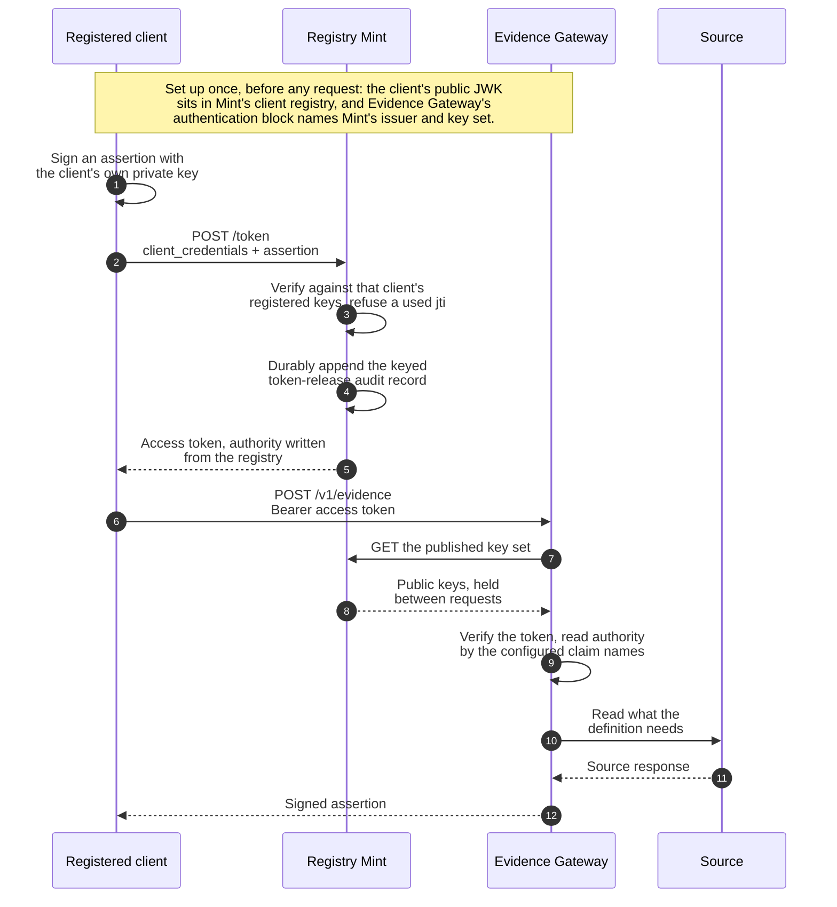

Registry Mint is the `mint` binary built from the `registry-mint` crate. It issues short-lived
access tokens to registered machine clients, for deployments that have callers and no identity
provider.

## Contract status

Registry Stack as a whole is a pre-1.0 technical release, and Registry Mint's surfaces carry that
same status individually: they do not appear among the covered surfaces listed in
[API stability and versioning](../api-stability/), so nothing on this page is a compatibility
promise. Configuration fields, the token endpoint shape, and CLI flags may change without a major
release until Registry Mint is added to that covered-surfaces table.

What is stable in practice: the `client_credentials` grant with `private_key_jwt` client
authentication (RFC 7523), the collapse of every client-authentication failure to
`invalid_client`, and the rule that authority is written from the client registry and never from
the caller's own request. Those are structural properties this crate exists to hold, not
incidental implementation choices.

## Source of truth

The `registry-mint` crate at `crates/registry-mint/` is the source of truth for every claim on
this page. Configuration parsing and validation live in `crates/registry-mint/src/config.rs` and
`crates/registry-mint/src/clients.rs`, the HTTP surface in
`crates/registry-mint/src/server.rs`, token minting in `crates/registry-mint/src/token.rs`, and
the keyed audit boundary in `crates/registry-mint/src/audit.rs`. The public error shape lives in
`crates/registry-mint/src/error.rs`. `crates/registry-mint/README.md` covers the same surface in
prose. Where this page and the crate disagree, the crate wins.

## Configuration reference

One YAML document, loaded by `MintConfig::load`. Fields use `camelCase` keys, reject unknown
fields, and every relative path resolves against the configuration file's own directory. The
following tables group the surface by the struct that owns each field.

### Top level

| Field | Type | Default | Notes |
| --- | --- | --- | --- |
| `version` | integer | required | Must equal `1`. |
| `validationMode` | `strict` or `supervised-local-development` | `strict` | Strict mode requires Transit. Supervised local development also permits `local-jwk`. |
| `issuer` | string (URL) | required | Must be `https`, have a host, and carry no credentials, query, or fragment. |
| `listener` | object | required | See [Listener](#listener). |
| `signing` | object | required | See [Signing](#signing). |
| `signer` | object | required | The local-JWK or Transit signing provider. |
| `secretProviders` | object | required | File-secret root for local signing and audit masters. |
| `audit` | object | required | See [Audit](#audit). |
| `accessTokens` | object | required | See [Access tokens](#access-tokens). |
| `clientAssertion` | object | required | See [Client assertion](#client-assertion). |
| `clients` | object | required | See [Clients](#clients). |

### Listener

| Field | Type | Default | Notes |
| --- | --- | --- | --- |
| `address` | string (IP address) | required | Parsed as an `IpAddr`. |
| `port` | integer (`u16`) | required | |
| `maximumRequestBytes` | integer (`u32`) | `16384` | Bounded `1024..=1048576`. |
| `requestTimeoutMilliseconds` | integer (`u64`) | `5000` | Bounded `1..=30000`. |

### Signing

| Field | Type | Default | Notes |
| --- | --- | --- | --- |
| `algorithm` | `ES256` | required | Fixed service-token signing algorithm. Client assertions have their own allowlist. |
| `activePublicJwkFile` | path | required | Exact public P-256 JWK for the signer. Its `kid` must be the derived RFC 7638 thumbprint. |
| `publishedPublicJwkFiles` | list of paths | `[]` | Other current public P-256 JWKs that remain in JWKS during a planned rotation. |
| `revokedKeyIds` | list of thumbprints | `[]` | Denylisted service keys. They cannot be active, published, or returned by JWKS. |
| `jwksPath` | string | `/.well-known/jwks.json` | A plain absolute path: one or more non-empty segments of `A-Z a-z 0-9 - . _ ~`, no dot segments, and no query, fragment, or route pattern. Must not be `/token`, `/health`, `/ready`, or `/.well-known/oauth-authorization-server`. |

### Signer

`signer.kind` is `transit` in strict mode and `local-jwk` only for supervised local development.
A Transit configuration has `unixSocketPath`, `mount`, `keyName`, `keyVersion`, and
`timeoutMilliseconds`. The Unix socket points to a workload-local proxy, not a network provider.
The key version is nonzero and pinned. Mint verifies the public key, Transit custody controls, key
version, and a signature before readiness admits traffic. A local-JWK configuration has only
`privateKeyRef`; its resolved key must match `activePublicJwkFile`.

### Audit

| Field | Type | Default | Notes |
| --- | --- | --- | --- |
| `path` | path | required | One keyed JSONL chain. The parent directory and existing chain must be owner-only. |
| `maximumFileBytes` | integer (`u64`) | required | Per-segment rotation threshold, from `1048576` through `1099511627776` bytes. |
| `hashKeyRef` | `secret:file/<name>` | required | At least 32 bytes in a regular, owner-only file beneath `secretProviders.file.root`. Must differ from the local signing key reference. |
| `hashKeyVersion` | integer (`u32`) | required | Must be non-zero. Labels keyed pseudonyms so an operator can identify the correlating key generation. |

Mint takes a single-writer lock, verifies the active chain at startup, and synchronizes the chain
and its parent directory for each append. When an append would exceed `maximumFileBytes`, Mint
seals the active segment as `<path>.<eight-digit-sequence>` and opens a new active segment online.
The keyed chain continues across segments. Mint does not delete or compact sealed segments, so the
operator owns total capacity, backup, and retention. Verify retained records with:

```sh
mint verify-audit --config /etc/mint/mint.yaml
```

The command verifies every sealed segment and reports a missing sequence distinctly. It verifies
the active segment when no Mint process owns the writer lock; otherwise it reports
`active-segment: not verified`. Archive sealed segments oldest first. Do not rename or archive the
active segment while Mint is running.

The chain stores a random operation id for every decision. Successful release records add the
token `jti`, signing key id, expiry, delegated status, and keyed pseudonyms for correlation.
Denial records carry only a value-free error category. Raw assertions, access tokens, client ids,
principals, authority values, actors, and subject values are not stored.

### Access tokens

| Field | Type | Default | Notes |
| --- | --- | --- | --- |
| `audiences` | list of strings (1..=16 entries, 1..=512 bytes each) | required | Written as the minted token's `aud`. |
| `lifetimeSeconds` | integer (`u64`) | required | Bounded `60..=3600`. |
| `claims` | object | required | See [Access token claim names](#access-token-claim-names). |

### Access token claim names

| Field | Type | Default | Notes |
| --- | --- | --- | --- |
| `principal` | string | `sub` | |
| `requesterTags` | string | required | |
| `evidenceAudience` | string | required | |
| `grantId` | string | required | |
| `grantAuthority` | string | required | |
| `actor` | string, optional | none | Required only to issue delegated tokens. |

These names must match the resource server's own claim-name configuration exactly. Claim names
must be distinct, must not shadow the registered JWT claims Registry Mint writes itself
(`iss`, `aud`, `exp`, `iat`, `nbf`, `jti`, `client_id`), and `sub` may only be used for
`principal`.

### Client assertion

| Field | Type | Default | Notes |
| --- | --- | --- | --- |
| `audience` | string (URL with host) | required | The value client assertions must carry as their own `aud`. |
| `maximumLifetimeSeconds` | integer (`u64`) | `300` | Bounded `30..=600`. |
| `algorithms` | list of enum: `EdDSA`, `ES256`, `RS256` | required, non-empty | Accepted client assertion signature algorithms. |
| `replayCacheEntries` | integer (`usize`) | `8192` | Minimum `256`. |

### Clients

| Field | Type | Default | Notes |
| --- | --- | --- | --- |
| `directory` | path | required | Directory of per-client registration files. The one reloadable part of the configuration: `SIGHUP` re-reads it in place. |

### Client registration fields (`clients/*.yaml`)

One file per client, parsed by `crates/registry-mint/src/clients.rs`.

| Field | Type | Default | Notes |
| --- | --- | --- | --- |
| `clientId` | string | required | |
| `principal` | string (at most 512 bytes) | required | |
| `evidenceAudience` | string | required | |
| `requesterTags` | list of strings (at most 32 entries) | required | |
| `grant` | object: `id`, `authority` | none, optional | Required together or not at all. |
| `delegation` | object: `actors`, `subjectClaims` | none, optional | Enables delegated tokens bound to one subject; see `crates/registry-mint/README.md`. |
| `keys` | list of public JWKs (at most 8 entries) | required | A document carrying a private key member is rejected. |

## Token endpoint contract

### Request

```text
POST /token
Content-Type: application/x-www-form-urlencoded

grant_type=client_credentials
&client_assertion_type=urn:ietf:params:oauth:client-assertion-type:jwt-bearer
&client_assertion=<compact JWS>
```

The path `/token` is fixed and not configurable. `grant_type` must equal `client_credentials`
exactly, and `client_assertion_type` must equal
`urn:ietf:params:oauth:client-assertion-type:jwt-bearer` exactly. `client_assertion` is a
compact JWS whose payload carries `iss` and `sub` equal to the client id, `aud` equal to the
configured `clientAssertion.audience`, a `jti`, and `iat`/`exp` inside
`clientAssertion.maximumLifetimeSeconds`. Every `jti` is accepted once.

### Response

`200 OK`, `Content-Type: application/json`:

```json
{
  "access_token": "SYNTHETIC_FIXTURE_TOKEN",
  "token_type": "Bearer",
  "expires_in": 300
}
```

`access_token` is a compact JWS with header `{"alg": "ES256", "typ": "at+jwt",
"kid": "<RFC-7638-thumbprint>"}`. Its claims carry the standard `iss`, `aud`, `iat`, `nbf`,
`exp`, `jti`, `client_id`, and `sub` (the principal), plus the authority claims named under
`accessTokens.claims`. `expires_in` equals `accessTokens.lifetimeSeconds`. Mint durably appends
the matching token-release audit record before sending this response. If that append fails, the
token is not released.

### Errors

Every response body is `{"error": "<code>"}`, from
`crates/registry-mint/src/error.rs`:

| Code | Status | When |
| --- | --- | --- |
| `invalid_request` | `400` | A required form field is missing or duplicated, or `client_assertion_type` is not the exact `jwt-bearer` URN. A missing `grant_type` is a missing field and lands here, not below. |
| `unsupported_grant_type` | `400` | `grant_type` is present but is not `client_credentials`. |
| `invalid_client` | `401` | Every client authentication failure: unknown client id, bad signature, replayed `jti`, expired assertion. Registry Mint collapses these into one code so the endpoint cannot be used to probe which client ids are registered. Carries a `WWW-Authenticate: Bearer error="invalid_client"` header. |
| `server_error` | `500` | An internal failure, including failure to durably audit the token decision. |

### Other endpoints

| Path | Purpose |
| --- | --- |
| `GET <signing.jwksPath>` (default `/.well-known/jwks.json`) | Public keys for verifying minted tokens, `application/jwk-set+json`. |
| `GET /.well-known/oauth-authorization-server` | Metadata pointing at the token endpoint and the key set. |
| `GET /health` | Liveness. |
| `GET /ready` | Readiness. Returns `503` while no client is registered, after an audit write failure poisons the writer, or while the signing provider is unavailable. Provider readiness recovers after a successful self-test. |

## How a client, Registry Mint, and Evidence Gateway interact

One round trip, from a client that holds only its own private key to a signed assertion. Every
label in this diagram is stated in the prose and tables on this page; the diagram is a summary of
those contracts, not a second source for them.



Everything through the access-token return is the whole of Registry Mint's job. It never sees the
source, the acceptance definition, or the assertion. The remaining exchanges are Evidence Gateway's, and
Evidence Gateway's only knowledge of Registry Mint is a URL and a key set: it reads the token by the claim
names in its own
configuration, so any issuer writing those claims would serve equally well.

The exact wire shapes the diagram abbreviates are given in full below:
[Token endpoint contract](#token-endpoint-contract) for the assertion and token,
[Other endpoints](#other-endpoints) for the key set path, and
[How Evidence Gateway verifies these tokens](#how-evidence-gateway-verifies-these-tokens) for the claim names.

Two failures collapse deliberately and are worth reading beside the diagram. A client
authentication failure returns `401 invalid_client` whatever went wrong, so the token endpoint
cannot be used to probe which client ids are registered. A key-set retrieval failure prevents
Evidence Gateway from verifying a token: with no key set ever retrieved, every request is rejected until
one can be, and with a key set already held, that held set keeps being accepted only until its
allowance runs out. Evidence Gateway names the outage in either case rather than failing silently.

## How Evidence Gateway verifies these tokens

Evidence Gateway's own `authentication` configuration block, defined in
`crates/registry-evidence/src/config.rs` (`AuthenticationConfig`), names the same claims Registry
Mint writes: `principalClaim`, `requesterTagsClaim`, `evidenceAudienceClaim`, `grantIdClaim`,
`grantAuthorityClaim`, and an optional `actorClaim`, alongside `issuer`, `audiences`,
`tokenTypes`, `algorithms`, and `jwksUri`. Evidence Gateway verifies a presented token against that
configuration in `crates/registry-evidence/src/auth.rs` (`Authenticator`), reading each claim by
the name configured there rather than any hardcoded name. Setting `authentication.issuer` and
`authentication.jwksUri` to Registry Mint's own `issuer` and published key set, and setting each
claim name to match `accessTokens.claims` on Registry Mint, and setting its required maximum token
lifetime and `revokedKeyIds`, is what lets one token flow between the two. Evidence Gateway checks
the key denylist before it selects a cached JWKS entry.

This is proven by tests, not only by matching configuration. `registry-mint`'s
`tests/evidence_compatibility.rs` drives the real Registry Mint router over a real on-disk
deployment and feeds the minted token to Evidence Gateway's own authenticator;
`tests/delegated_subject_binding.rs` does the same for delegated, subject-bound tokens, running
Evidence Gateway's own entitlement match and selector resolution over a token minted by the real Registry
Mint router. The dependency runs one way only: Registry Mint's tests exercise Evidence Gateway's
authenticator, and Evidence Gateway does not depend on Registry Mint.

## Next

- [Configure Registry Mint](../../configure/mint/)
- [API stability and versioning](../api-stability/)
