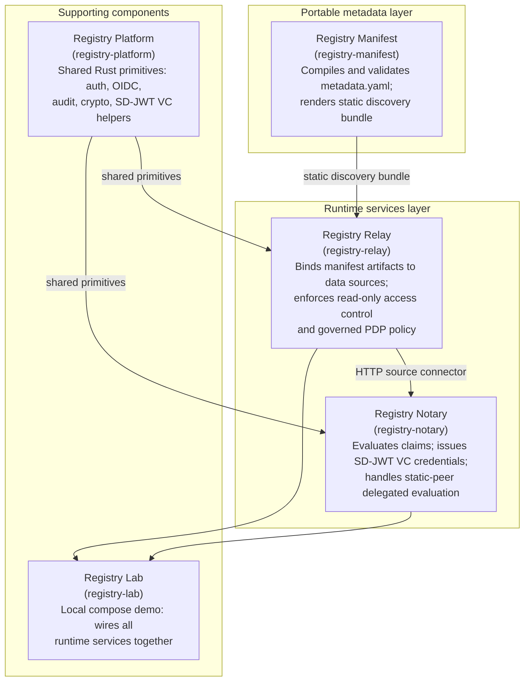

This document defines the architecture of the registry stack. It is the authoritative reference that protocol specifications (RS-PR-*), security specifications (RS-SEC-*), and data-model specifications (RS-DM-*) refine. It names the components, states their boundaries, describes the data and contract flow across them, and records the binding invariants that every implementation MUST respect.

The key words in this document are interpreted per [RS-DOC](../rs-doc/) Section 2.

For a narrative explanation with worked examples, see the [architecture overview](../../explanation/architecture/). This document is the precise, citable version of that overview.

## Version history

| Version | Date | Status | Change |
| --- | --- | --- | --- |
| 0.1.0 | 2026-06-13 | draft | Initial architecture, distilled from the current architecture overview and boundary map. |
| 0.2.0 | 2026-06-13 | draft | Added REQ-ARC-G-010: the portable metadata layer describes but does not authorize, enforce, or assert facts about live data. |
| 0.3.0 | 2026-06-20 | draft | Clarified governed runtime PDP enforcement for the supported Evidence Gateway profile while preserving the descriptive metadata boundary. |
| 0.3.1 | 2026-06-22 | draft | Clarified static-peer delegated evaluation as distinct from delegated self-attestation. |
| 0.4.0 | 2026-07-07 | draft | Clarified REQ-ARC-G-009's replay storage scope: shared within a deployment's own replicas, never across a federation trust boundary. Reframed Registry Lab as a non-normative demonstration topology. |
| 0.4.1 | 2026-07-07 | draft | Stated plainly in REQ-ARC-G-009 that the per-peer replay storage isolation is deployment topology and that Registry Notary enforces no runtime gate for it. |

## 1. Scope and audience

This specification covers:

- The two-layer design principle that governs the separation between portable metadata and runtime services.
- The five components that make up the registry stack, their responsibilities, and their boundaries.
- The ordered data and contract flow from metadata authoring through claim evaluation.
- The binding invariants that hold across all conforming deployments.

This document does not define API surfaces, wire formats, or configuration schemas. Those belong to the RS-PR-* and RS-DM-* series. It does not define the security model; that belongs to the RS-SEC-* series.

The intended audience is implementors building or deploying registry stack components, governance teams auditing a deployment, and authors of specifications that refine this one.

## 2. The two-layer design

The registry stack separates its concerns into two layers.

The **portable metadata layer** is responsible for describing what a registry exposes. It operates entirely without touching production data sources. The layer produces static, standards-shaped artifacts (catalogs, schemas, policy documents, evidence offerings, OGC Records item collections, and embedded codelist metadata) that can be hosted, distributed, and inspected offline. A governance team, an integrator, or an auditor can validate the full description of a registry before any runtime service is deployed or connected.

The **runtime services layer** is responsible for enforcing what the registry description promises. It binds the portable metadata artifacts to actual data sources, enforces access control, evaluates claims against live data, and issues credentials. The runtime layer starts from the portable artifacts; it does not define the schema or policy contracts itself.

This split separates two distinct obligations: the obligation to describe (what a registry declares it can expose and under what policy) from the obligation to enforce (what a running service will actually return to an authorized caller). The separation enables offline audit of metadata, offline validation of schemas and claim shapes, and governance updates to policy documents without touching deployment configuration.

The diagram in this section shows the five components and how they relate to the two layers.

The diagram captures five components. This section restates the essential relationships as text: Registry Manifest produces a static discovery bundle consumed by Registry Relay, static publishers, and clients that inspect the metadata offline. Registry Platform supplies shared primitives to both runtime services. Registry Notary is reached through its configured HTTP sources, evidence endpoints, and runtime configuration rather than by consuming the Registry Manifest output directly. Registry Lab assembles all runtime services into a runnable local demo.

## 3. Components

### Registry Platform

Registry Platform (`registry-platform`) is a shared Rust crate workspace that provides security and operational primitives consumed by both runtime services. Its scope includes authentication helpers, OpenID Connect (OIDC) verification, audit envelopes, HTTP security, outbound HTTP policy, cryptography, Selective Disclosure JWT Verifiable Credential (SD-JWT VC) helpers, and test fixtures. Registry Platform does not run a service and does not define product routing or policy. A primitive lives in Registry Platform only when it must behave identically across multiple runtime services.

### Registry Manifest

Registry Manifest (`registry-manifest`) is a pure Rust library and command-line interface (CLI) with no runtime data dependencies. It accepts a portable `metadata.yaml` document (schema version `registry-manifest/v1`) that describes datasets, entities, fields, public services, forms, requirements, policies, codelists, and evidence offerings. It validates the document and renders a static discovery bundle containing: a catalog (`catalog.json`), Data Catalog Vocabulary (DCAT) and BRegDCAT-AP JSON-LD, Core Public Service Vocabulary Application Profile (CPSV-AP) JSON-LD, Shapes Constraint Language (SHACL) node shapes, JSON Schema documents, OGC API Records item collection, Open Digital Rights Language (ODRL) policy documents, Core Criterion and Core Evidence Vocabulary (CCCEV) metadata, embedded SKOS-shaped codelist metadata, and an `index.json`. Registry Manifest does not serve HTTP, does not connect to databases, and does not handle authentication, audit, or secrets. Production source configuration (source paths, table identifiers, scopes) does not belong in the manifest; it belongs in Registry Relay configuration.

### Registry Relay

Registry Relay (`registry-relay`) is a config-driven Rust service that turns sensitive government tabular files and database tables into protected, read-only, domain-oriented consultation APIs. At startup it reads runtime configuration that binds the manifest's logical datasets and entities to actual data sources (CSV, XLSX, Parquet, PostgreSQL). It exposes entity routes, metadata routes, evidence-offering endpoints, and (behind feature flags) OGC API Records, OGC API Features, OGC API EDR, SP DCI, and SDMX-JSON aggregate surfaces. It publishes a `did:web` document when signed response credentials are enabled in gateway issuer mode.

Registry Relay is not an open-data portal; it serves restricted consultation APIs for authorized systems only. Source-registry data mutation is out of scope for v1. On governed runtime routes, Relay can enforce the supported Evidence Gateway PDP profile (`registry-evidence-gateway-pdp/v1`) for access, freshness, and redaction decisions using runtime configuration, compiled policy metadata, and trusted per-request context. This is runtime policy enforcement for the configured gateway surface; it is not claim evaluation, credential issuance, full Evidence Gateway interoperability, or full OID4VCI behavior. Registry Relay does not own the manifest schema, claim evaluation, credential issuance, or the shared primitives supplied by Registry Platform.

### Registry Notary

Registry Notary (`registry-notary`) is a standalone Rust service for claim evaluation, disclosure policy, credential issuance, and audit. It is decoupled from Registry Relay application code by design; it calls Registry Relay over HTTP using a `registry_data_api` or `dci` source connector and does not import or link Registry Relay libraries. Registry Notary evaluates configured evidence rules against data from one or more source services and returns evaluation results as `application/vnd.registry-notary.claim-result+json` or CCCEV-shaped JSON-LD (`application/ld+json; profile="cccev"`). It materializes SD-JWT VC credentials (`application/dc+sd-jwt`) through its credential issuance surfaces, including an OpenID for Verifiable Credential Issuance (OID4VCI) flow as a profiled subset of OID4VCI Draft 13. It supports static-peer delegated evaluation through `POST /federation/v1/evaluations`. Static-peer delegated evaluation is separate from delegated self-attestation, the local citizen/OIDC access mode defined in [RS-PR-NOTARY](../rs-pr-notary/). Registry Notary does not produce DCAT, BRegDCAT-AP, SHACL, or OGC Records artifacts. The current federation implementation is static-peer only; dynamic trust-chain discovery, replay storage shared across federation peers, and federated credential issuance are not part of this version. Each federation peer maintains its own replay scope; a peer does not share replay storage with the peers it federates with.

### Registry Lab

Registry Lab (`registry-lab`) is a compose-based local demo. It starts Registry Relay instances, Registry Notary instances, Postgres, Zitadel, a static metadata publisher, and narrated clients together in a single compose topology. It is a non-normative demonstration topology that illustrates how the services connect to each other at runtime; it is not itself a specified component, and it carries no conformance weight against this specification. Registry Lab does not own any normative API or metadata contract; those belong to the runtime service and manifest repositories. It does not provide production deployment guidance; it uses fixture credentials and demo-grade configuration.

## 4. Data and contract flow

The following ordered flow describes how a request moves through the stack from metadata authoring to credential delivery.

1. **Shared primitives.** Registry Platform provides reusable security and operational primitives (authentication, OIDC verification, audit envelopes, HTTP security, outbound HTTP policy, cryptography, SD-JWT VC helpers) consumed by both runtime services.

2. **Manifest authoring.** An operator authors a portable `metadata.yaml` document (schema `registry-manifest/v1`) describing datasets, entities, fields, public services, forms, requirements, policies, and evidence offerings. The manifest does not contain runtime bindings.

3. **Compilation and bundle rendering.** Registry Manifest validates the manifest and renders a static discovery bundle. The bundle contains the catalog, DCAT and BRegDCAT-AP JSON-LD, CPSV-AP JSON-LD, SHACL node shapes, JSON Schema documents, OGC API Records item collection, ODRL policy documents, CCCEV metadata, evidence-offering metadata, embedded SKOS-shaped codelist metadata, and an `index.json`. The bundle can be hosted as static files without running any runtime service.

4. **Runtime binding and access control.** Registry Relay starts with runtime configuration that binds the manifest's logical datasets and entities to actual data sources. Clients reach entity routes, metadata routes, and evidence-offering endpoints through configured authentication. Relay records a `Data-Purpose` header in audit envelopes where present. On governed runtime routes, Relay evaluates the supported Evidence Gateway PDP profile before disclosure and applies redaction when the decision permits only a minimized response.

5. **Claim evaluation.** Registry Notary evaluates claims against configured HTTP sources (`registry_data_api` or `dci` connectors). It applies disclosure policy (value, predicate, or redacted), returns evaluation results as claim-result JSON or CCCEV-shaped JSON-LD, and can materialize eligible stored evaluations into SD-JWT VC credentials.

6. **Static-peer delegated evaluation.** A trusted Registry Notary instance can call another trusted Registry Notary instance through `POST /federation/v1/evaluations` for signed delegated evaluation. Registry Manifest can publish discovery metadata for that relationship, but local Notary peer policy grants access. Peer lists are loaded from configuration at startup. This federation path is distinct from delegated self-attestation in the Notary citizen/OIDC flow.

## 5. Architectural invariants

This section states the binding constraints that hold across all conforming registry stack deployments. Each is tagged with a stable requirement identifier per RS-DOC Section 5.

REQ-ARC-G-001: The portable metadata layer MUST render discovery artifacts without accessing production data sources. Registry Manifest MUST NOT connect to databases, serve HTTP, or handle authentication or secrets during compilation and rendering.

REQ-ARC-G-002: A metadata manifest (schema `registry-manifest/v1`) MUST NOT include runtime bindings such as source paths, table names, or scopes. Runtime bindings belong in Registry Relay configuration.

REQ-ARC-G-003: In v1, runtime services MUST NOT expose source-registry data mutation routes. Consultation APIs are read-only.

REQ-ARC-G-004: Every request that touches person-level data MUST be audited. Registry Platform provides the audit envelope primitives, verified to exist in the shared crate; Registry Relay and Registry Notary MUST compose those primitives on routes that return person-level records or claim results. This requirement states an invariant a conforming deployment meets; it is not a claim that every route in a given build has been individually audited.

REQ-ARC-G-005: A primitive that must behave identically across runtime services (authentication, OIDC, audit, HTTP security, outbound HTTP policy, cryptography, SD-JWT VC helpers) SHOULD be sourced from Registry Platform rather than reimplemented in Registry Relay or Registry Notary. This keeps cross-service security behavior consistent and auditable in one place.

REQ-ARC-G-006: Registry Relay MUST own the runtime binding between manifest logical concepts and data sources. The manifest schema and its renderers are owned by Registry Manifest; Registry Relay MUST NOT define or version the manifest format.

REQ-ARC-G-007: Registry Notary MUST own claim evaluation, disclosure policy, and credential issuance. Registry Relay MUST NOT perform claim evaluation or issue credentials. This boundary does not prohibit Registry Relay from enforcing runtime access, freshness, and redaction policy for its own governed consultation routes.

REQ-ARC-G-008: Registry Notary credentials MUST use SD-JWT VC format (`application/dc+sd-jwt`). No W3C Verifiable Credentials Data Model JSON-LD envelope or namespace is present in the issued credential.

REQ-ARC-G-009: Registry Notary's federation implementation is static-peer delegated evaluation. Peer lists are loaded from configuration at startup. Within a single deployment, replay storage MAY be shared across that deployment's own replicas through a durable shared backend, for example the Redis-backed replay store in Registry Platform; that sharing does not extend across a federation trust boundary. Each federation peer MUST maintain its own replay scope and MUST NOT share replay storage with the peers it federates with; that isolation is deployment topology, and Registry Notary enforces no runtime gate that prevents two peers from sharing a replay storage backend. Dynamic trust-chain discovery, replay storage shared across federation peers, audit checkpoint exchange, and federated credential issuance are not part of this version and MUST NOT be implied by conformance claims against this specification.

REQ-ARC-G-010: The portable metadata layer describes; it does not authorize and it does not assert facts about live data. Publishing a dataset, schema, policy, evidence offering, ecosystem binding, or federation relationship in a discovery artifact MUST NOT be construed as granting access to it, as enforcing it, or as asserting that any particular record exists or satisfies it. Access control, governed PDP enforcement, and the existence or value of a record are determined only by an authorized runtime read under runtime configuration and trusted request or source context. A published ODRL policy is descriptive until a runtime service explicitly binds it into an enforced, supported profile. A conformance claim against a metadata artifact MUST NOT imply a runtime guarantee that the runtime layer has not made.

REQ-ARC-G-011: Where Registry Relay exposes governed runtime routes, it MUST enforce only the supported Evidence Gateway PDP profile (`registry-evidence-gateway-pdp/v1`) as implemented by the runtime stack. A conformance claim against this specification MUST NOT imply full Evidence Gateway interoperability, full OID4VCI issuer behavior, dynamic external policy discovery, or enforcement of ODRL terms outside the supported profile.

## 6. Capability sequence

The two-layer design supports one natural capability sequence: describe what the registry can provide, then expose protected access, then certify evidence.

**Describe.** Registry Manifest compiles the manifest and renders a standards-shaped discovery bundle. Other teams can inspect fields, schemas, policies, services, and evidence offerings before any integration is built.

**Expose.** Registry Relay binds the manifest artifacts to actual data sources and exposes protected, read-only consultation APIs. A file, an extract, a database, or a legacy registry gains a governed API without replacing the source.

**Certify.** Registry Notary evaluates configured evidence rules, applies disclosure policy, and issues a credential that a caller can present to a verifier. The credential is narrower than the source record when the configured use case supports selective disclosure.

The sequence is ordered because metadata must be available before a runtime service can be safely deployed: a caller cannot validate schemas, review claim shapes, or inspect evidence offerings against an opaque service. The portable metadata bundle is the contract; the runtime services enforce it.

Registry Platform supports both runtime services with the shared primitives that make each stage auditable. Registry Lab exercises the full sequence in a local compose environment.

## Conformance

An implementation conforms to this specification when it respects the following requirements from Section 5:

- REQ-ARC-G-001: the metadata compilation step does not access production sources.
- REQ-ARC-G-002: the metadata manifest contains no runtime bindings.
- REQ-ARC-G-003: runtime services expose no source-registry data mutation routes in v1.
- REQ-ARC-G-004: every request touching person-level data produces an audit record.
- REQ-ARC-G-005: shared security primitives that must behave identically across services are sourced from Registry Platform (recommended).
- REQ-ARC-G-006: Registry Relay owns runtime binding; the manifest format is owned by Registry Manifest.
- REQ-ARC-G-007: claim evaluation and credential issuance are owned by Registry Notary.
- REQ-ARC-G-008: issued credentials use SD-JWT VC format (`application/dc+sd-jwt`).
- REQ-ARC-G-009: federation is static-peer delegated evaluation; no dynamic discovery is implied.
- REQ-ARC-G-010: discovery artifacts are treated as description, not as authorization, enforcement, or proof that a record exists.
- REQ-ARC-G-011: governed Relay runtime routes enforce only the supported Evidence Gateway PDP profile and do not imply broader interoperability.

Conformance to this specification does not imply conformance to any external standard cited in the `standards_referenced` frontmatter field. Each standard's adoption mode and scope are documented in the [standards register](../../reference/standards/).

## Evidence

This specification is `verified`: it is distilled from published artifacts a reader can inspect, per RS-DOC REQ-DOC-014.

- The [boundary map](../../map/boundaries-and-map/) records each component's boundaries with their source citations. It is the primary distillation source for the components (Section 3) and the invariants (Section 5).
- The [architecture overview](../../explanation/architecture/) gives the narrative data and contract flow that Section 4 makes precise.
- The [Registry Relay](../../reference/apis/registry-relay/) and [Registry Notary](../../reference/apis/registry-notary/) API references show the runtime surfaces named in Section 3.
- The [standards register](../../reference/standards/) records the adoption mode for each standard listed in `standards_referenced`.

## Next

- [RS-DOC](../rs-doc/) defines the documentation framework this specification conforms to.
- [RS-TERMS](../rs-terms/) defines the shared vocabulary the other specifications use.
- [Architecture overview](../../explanation/architecture/) is the narrative explanation with a worked data flow and capability table.
- [Evidence issuance](../../explanation/evidence-issuance/) explains claim evaluation, disclosure policy, delegated evaluation, and credential issuance in Registry Notary.
