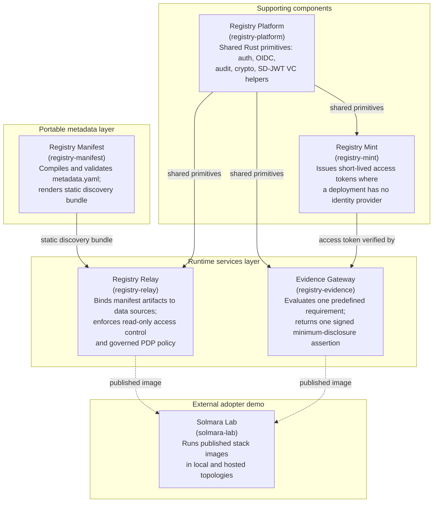

This document defines the architecture of the registry stack. It is the authoritative reference that protocol specifications (RS-PR-*), security specifications (RS-SEC-*), and data-model specifications (RS-DM-*) refine. It names the components, states their boundaries, describes the data and contract flow across them, and records the binding invariants that every implementation MUST respect.

The key words in this document are interpreted per [RS-DOC](../rs-doc/) Section 2.

For a narrative explanation with worked examples, see the [architecture overview](../../explanation/architecture/). This document is the precise, citable version of that overview.

## Version history

| Version | Date | Status | Change |
| --- | --- | --- | --- |
| 0.1.0 | 2026-06-13 | draft | Initial architecture, distilled from the current architecture overview and boundary map. |
| 0.2.0 | 2026-06-13 | draft | Added REQ-ARC-G-010: the portable metadata layer describes but does not authorize, enforce, or assert facts about live data. |
| 0.3.0 | 2026-06-20 | draft | Clarified governed runtime PDP enforcement for the supported Relay profile while preserving the descriptive metadata boundary. |
| 0.3.1 | 2026-06-22 | draft | Clarified static-peer delegated evaluation as distinct from delegated subject access. |
| 0.4.0 | 2026-07-07 | draft | Clarified REQ-ARC-G-009's replay storage scope: shared within a deployment's own replicas, never across a federation trust boundary. Reframed Registry Lab as a non-normative demonstration topology. |
| 0.4.1 | 2026-07-07 | draft | Stated plainly in REQ-ARC-G-009 that the per-peer replay storage isolation is deployment topology and that Registry Notary enforces no runtime gate for it. REQ-ARC-G-009 is retired as of 0.6.0. |
| 0.5.0 | 2026-07-16 | draft | Defined four formal Registry Stack products and moved the non-normative demo boundary to the separate Solmara Lab adopter project. |
| 0.6.0 | 2026-08-03 | draft | Registry Notary is retired. Removed its component section, its federation flow step, and REQ-ARC-G-008, REQ-ARC-G-009, REQ-ARC-G-012, and REQ-ARC-G-013. Restated REQ-ARC-G-007 with Evidence Gateway as the owner of requirement evaluation. Added Evidence Gateway and Registry Mint as components and added REQ-ARC-G-014, REQ-ARC-G-015, and REQ-ARC-G-016. |

## 1. Scope and audience

This specification covers:

- The two-layer design principle that governs the separation between portable metadata and runtime services.
- The four formal products that make up the registry stack, the supporting service beside them, their responsibilities, and their boundaries.
- The boundary between the formal products and the separate Solmara Lab adopter demo.
- The ordered data and contract flow from metadata authoring through assertion delivery.
- The binding invariants that hold across all conforming deployments.

This document does not define API surfaces, wire formats, or configuration schemas. Those belong to the RS-PR-* and RS-DM-* series. It does not define the security model; that belongs to the RS-SEC-* series.

The intended audience is implementors building or deploying registry stack components, governance teams auditing a deployment, and authors of specifications that refine this one.

## 2. The two-layer design

The registry stack separates its concerns into two layers.

The **portable metadata layer** is responsible for describing what a registry exposes. It operates entirely without touching production data sources. The layer produces static, standards-shaped artifacts (catalogs, schemas, policy documents, evidence offerings, OGC Records item collections, and embedded codelist metadata) that can be hosted, distributed, and inspected offline. A governance team, an integrator, or an auditor can validate the full description of a registry before any runtime service is deployed or connected.

The **runtime services layer** is responsible for enforcing what the registry description promises. It binds the portable metadata artifacts to actual data sources, enforces access control, evaluates predefined requirements against live data, and returns signed minimum-disclosure assertions. The runtime layer starts from the portable artifacts; it does not define the schema or policy contracts itself.

This split separates two distinct obligations: the obligation to describe (what a registry declares it can expose and under what policy) from the obligation to enforce (what a running service will actually return to an authorized caller). The separation enables offline audit of metadata, offline validation of schemas and assertion shapes, and governance updates to policy documents without touching deployment configuration.

The diagram in this section shows the four formal products, their relationship to the two layers,
the supporting token service, and the separate adopter demo.

```mermaid
flowchart TD
    subgraph portable["Portable metadata layer"]
        manifest["Registry Manifest<br/>(registry-manifest)<br/>Compiles and validates metadata.yaml;<br/>renders static discovery bundle"]
    end

    subgraph runtime["Runtime services layer"]
        relay["Registry Relay<br/>(registry-relay)<br/>Binds manifest artifacts to data sources;<br/>enforces read-only access control<br/>and governed PDP policy"]
        evidence["Evidence Gateway<br/>(registry-evidence)<br/>Evaluates one predefined requirement;<br/>returns one signed minimum-disclosure assertion"]
    end

    subgraph support["Supporting components"]
        platform["Registry Platform<br/>(registry-platform)<br/>Shared Rust primitives: auth, OIDC,<br/>audit, crypto, SD-JWT VC helpers"]
        mint["Registry Mint<br/>(registry-mint)<br/>Issues short-lived access tokens where<br/>a deployment has no identity provider"]
    end

    subgraph adopter["External adopter demo"]
        solmara["Solmara Lab<br/>(solmara-lab)<br/>Runs published stack images<br/>in local and hosted topologies"]
    end

    manifest -- "static discovery bundle" --> relay
    platform -- "shared primitives" --> relay
    platform -- "shared primitives" --> evidence
    platform -- "shared primitives" --> mint
    mint -- "access token verified by" --> evidence
    relay -. "published image" .-> solmara
    evidence -. "published image" .-> solmara
```

The diagram captures four formal products, one supporting token service, and one external adopter
demo. This section restates the
essential relationships as text: Registry Manifest produces a static discovery bundle consumed by
Registry Relay, static publishers, and clients that inspect the metadata offline. Registry Platform
supplies shared primitives to the runtime services. Registry Relay owns registry source access and
product-neutral adaptation. Evidence Gateway answers one bounded question about one subject from its own
configured sources. Registry Mint issues the access tokens a resource server such as Evidence Gateway
verifies, and that dependency runs one way only. Solmara Lab
consumes published stack images in runnable local and hosted demo topologies, but it is not a formal
Registry Stack product.

## 3. Components

### Registry Platform

Registry Platform (`registry-platform`) is a shared Rust crate workspace that provides security and operational primitives consumed by the runtime services. Its scope includes authentication helpers, OpenID Connect (OIDC) verification, audit envelopes, HTTP security, outbound HTTP policy, cryptography, Selective Disclosure JWT Verifiable Credential (SD-JWT VC) helpers, and test fixtures. Registry Platform does not run a service and does not define product routing or policy. A primitive lives in Registry Platform only when it must behave identically across multiple runtime services.

### Registry Manifest

Registry Manifest (`registry-manifest`) is a pure Rust library and command-line interface (CLI) with no runtime data dependencies. It accepts a portable `metadata.yaml` document (schema version `registry-manifest/v1`) that describes a registry through its catalog and defined collections. The [Registry Manifest reference](../../products/registry-manifest/reference/) is authoritative for the current top-level keys and field schemas. It validates the document and renders a static discovery bundle containing: a catalog (`catalog.json`), Data Catalog Vocabulary (DCAT) and BRegDCAT-AP JSON-LD, Core Public Service Vocabulary Application Profile (CPSV-AP) JSON-LD, Shapes Constraint Language (SHACL) node shapes, JSON Schema documents, OGC API Records item collection, Open Digital Rights Language (ODRL) policy documents, Core Criterion and Core Evidence Vocabulary (CCCEV) metadata, embedded SKOS-shaped codelist metadata, and an `index.json`. Registry Manifest does not serve HTTP, does not connect to databases, and does not handle authentication, audit, or secrets. Production source configuration (source paths, table identifiers, scopes) does not belong in the manifest; it belongs in Registry Relay configuration.

### Registry Relay

Registry Relay (`registry-relay`) is a config-driven Rust service that turns sensitive government tabular files and database tables into protected, read-only, domain-oriented consultation APIs. At startup it reads runtime configuration that binds the manifest's logical datasets and entities to actual data sources (CSV, XLSX, Parquet, PostgreSQL). It exposes entity routes, metadata routes, evidence-offering endpoints, and (behind feature flags) OGC API Records, OGC API Features, OGC API EDR, SP DCI, and SDMX-JSON aggregate surfaces.

Registry Relay is not an open-data portal; it serves restricted consultation APIs for authorized systems only. Source-registry data mutation is out of scope for v1. On governed runtime routes, Relay can enforce the supported Relay PDP profile (`registry-evidence-gateway-pdp/v1`) for access, freshness, and redaction decisions using runtime configuration, compiled policy metadata, and trusted per-request context. The legacy profile identifier names Relay's configured policy surface; it does not name or connect to Evidence Gateway. This is runtime policy enforcement for the configured Relay surface; it is not requirement evaluation, assertion signing, interoperability with Evidence Gateway, or full OID4VCI behavior. Registry Relay does not own the manifest schema, requirement evaluation, assertion signing, or the shared primitives supplied by Registry Platform.

### Evidence Gateway

Evidence Gateway (`registry-evidence`) is a single-crate Rust service and the `evidence` binary. It answers one bounded question about one subject with one signed assertion that carries the answer and not the record. It loads one reviewed governed bundle and one closed operator runtime file at startup, treats both as immutable for the process lifetime, and holds no application database: it persists no selector, no source payload, no evidence value, and no response body. It authenticates callers with strict OIDC bearer tokens against exactly one trusted issuer, matches exactly one authority path per request, calls the fixed bounded HTTP JSON sources its bundle declares, and releases the assertion as a flattened JWS JSON document by default. Where the bundle and the matched grant both enable it, the same assertion can also be serialized as an SD-JWT VC (`application/dc+sd-jwt`) or as a visibly unsigned envelope for local diagnosis.

Evidence Gateway Version 1 has no credential issuance lifecycle, no OID4VCI surface, no holder binding, no status list or revocation, no delegated or federated evaluation between peers, no policy decision point, no replay subsystem, and no worker or document subsystem. It does not depend on Registry Relay, does not consult it, and does not read the metadata manifest.

### Registry Mint

Registry Mint (`registry-mint`) is a supporting service rather than a fourth runtime pattern: it is a minimal OAuth 2.0 token issuer and the `mint` binary, for deployments that have no identity provider of their own. A registered client authenticates with an RFC 7523 `private_key_jwt` client assertion, which is verified only against the keys registered for the client the assertion names. The authority claims carried by the minted access token are read from the server-side client registry and never from the assertion. Issuer identity, signing keys, listener, and token policy are startup-only and immutable for the process lifetime; the client registry is reloadable, so onboarding, offboarding, and client key rotation do not require restarting a resource server. Registry Mint evaluates no requirement, reads no registry source, and issues no assertion.

The dependency runs one way. A resource server such as Evidence Gateway verifies a Mint-issued token as an ordinary OIDC access token, and Evidence Gateway carries no dependency on Registry Mint. In the workspace, `registry-mint` takes `registry-evidence` as a development dependency so that Mint's tests drive the Evidence Gateway authenticator against real tokens.

### Solmara Lab

Solmara Lab (`solmara-lab`) is a separately maintained adopter demo for the fictional Republic of
Solmara. It runs published stack images together with static metadata, generated synthetic data,
and demo clients in local and hosted topologies. It illustrates
how the formal products connect at runtime, but it is not a specified component and carries no
conformance weight against this specification. Solmara Lab does not own any normative API or
metadata contract and does not provide production deployment guidance.
{/* TODO[evidence]: the exact Solmara Lab topology (which images and supporting services it runs)
cannot be anchored from this repository; it is maintained in the separate registrystack/solmara-lab
project. Restore the specific enumeration once that repository's current topology is citable. */}

## 4. Data and contract flow

The following ordered flow describes how a request moves through the stack from metadata authoring to assertion delivery.

1. **Shared primitives.** Registry Platform provides reusable security and operational primitives (authentication, OIDC verification, audit envelopes, HTTP security, outbound HTTP policy, cryptography, SD-JWT VC helpers) consumed by the runtime services.

2. **Manifest authoring.** An operator authors a portable `metadata.yaml` document (schema `registry-manifest/v1`) describing a registry through its catalog and defined collections. The [Registry Manifest reference](../../products/registry-manifest/reference/) is authoritative for the current top-level keys and field schemas. The manifest does not contain runtime bindings.

3. **Compilation and bundle rendering.** Registry Manifest validates the manifest and renders a static discovery bundle. The bundle contains the catalog, DCAT and BRegDCAT-AP JSON-LD, CPSV-AP JSON-LD, SHACL node shapes, JSON Schema documents, OGC API Records item collection, ODRL policy documents, CCCEV metadata, evidence-offering metadata, embedded SKOS-shaped codelist metadata, and an `index.json`. The bundle can be hosted as static files without running any runtime service.

4. **Runtime binding and access control.** Registry Relay starts with runtime configuration that binds the manifest's logical datasets and entities to actual data sources. Clients reach entity routes, metadata routes, and evidence-offering endpoints through configured authentication. Relay records a `Data-Purpose` header in audit envelopes where present. On governed runtime routes, Relay evaluates the supported Relay PDP profile before disclosure and applies redaction when the decision permits only a minimized response.

5. **Access-token issuance.** Where a deployment has no identity provider of its own, Registry Mint issues the short-lived access token the caller presents. A registered client authenticates with a `private_key_jwt` client assertion, and Mint reads the token's authority claims from its server-side client registry. A deployment that already runs an identity provider skips this step entirely.

6. **Assertion.** Evidence Gateway authenticates the caller's access token against its one trusted issuer, matches exactly one authority path, evaluates one predefined requirement over its own fixed bounded sources, and returns one signed minimum-disclosure assertion. Caller identity and authorization details may authorize or parameterize the request, but do not become evidence. The response carries the answer the requirement defines, not the source record behind it.

## 5. Architectural invariants

This section states the binding constraints that hold across all conforming registry stack deployments. Each is tagged with a stable requirement identifier per RS-DOC Section 5.

REQ-ARC-G-001: The portable metadata layer MUST render discovery artifacts without accessing production data sources. Registry Manifest MUST NOT connect to databases, serve HTTP, or handle authentication or secrets during compilation and rendering.

REQ-ARC-G-002: A metadata manifest (schema `registry-manifest/v1`) MUST NOT include runtime bindings such as source paths, table names, or scopes. Runtime bindings belong in Registry Relay configuration.

REQ-ARC-G-003: In v1, runtime services MUST NOT expose source-registry data mutation routes. Consultation APIs are read-only.

REQ-ARC-G-004: Every request that touches person-level data MUST be audited. Registry Platform provides the audit envelope primitives, verified to exist in the shared crate; Registry Relay and Evidence Gateway MUST compose those primitives on routes that return person-level records or evidence assertions. This requirement states an invariant a conforming deployment meets; it is not a claim that every route in a given build has been individually audited.

REQ-ARC-G-005: A primitive that must behave identically across runtime services (authentication, OIDC, audit, HTTP security, outbound HTTP policy, cryptography, SD-JWT VC helpers) SHOULD be sourced from Registry Platform rather than reimplemented in Registry Relay, Evidence Gateway, or Registry Mint. This keeps cross-service security behavior consistent and auditable in one place.

REQ-ARC-G-006: Registry Relay MUST own the runtime binding between manifest logical concepts and data sources. The manifest schema and its renderers are owned by Registry Manifest; Registry Relay MUST NOT define or version the manifest format.

REQ-ARC-G-007: Evidence Gateway MUST own requirement evaluation, disclosure shape, and assertion signing. Registry Relay MUST NOT evaluate a requirement or sign an evidence assertion. This boundary does not prohibit Registry Relay from enforcing runtime access, freshness, and redaction policy for its own governed consultation routes.

REQ-ARC-G-010: The portable metadata layer describes; it does not authorize and it does not assert facts about live data. Publishing a dataset, schema, policy, evidence offering, ecosystem binding, or federation relationship in a discovery artifact MUST NOT be construed as granting access to it, as enforcing it, or as asserting that any particular record exists or satisfies it. Access control, governed PDP enforcement, and the existence or value of a record are determined only by an authorized runtime read under runtime configuration and trusted request or source context. A published ODRL policy is descriptive until a runtime service explicitly binds it into an enforced, supported profile. A conformance claim against a metadata artifact MUST NOT imply a runtime guarantee that the runtime layer has not made.

REQ-ARC-G-011: Where Registry Relay exposes governed runtime routes, it MUST enforce only the supported Relay PDP profile (`registry-evidence-gateway-pdp/v1`) as implemented by the runtime stack. A conformance claim against this specification MUST NOT imply interoperability with Evidence Gateway, full OID4VCI issuer behavior, dynamic external policy discovery, or enforcement of ODRL terms outside the supported profile.

REQ-ARC-G-014: Evidence Gateway MUST return only the answer its predefined requirement defines, never the source record behind that answer. The response MUST be constructed by the service core after the complete declared concept set has been produced and validated; configured bundle logic MUST NOT construct a response envelope, a subject identifier, or any claim outside that declared set.

REQ-ARC-G-015: A signed Evidence Gateway response MUST be a flattened JWS JSON document over the exact evidence payload, and a signing failure MUST fail closed rather than release unsigned output. Where a deployment enables the SD-JWT VC serialization (`application/dc+sd-jwt`), that serialization MUST project the identical payload and MUST NOT be read as a credential lifecycle: Evidence Gateway Version 1 defines no issuance session, no holder-binding ceremony, no status list, no revocation, and no presentation verification.

REQ-ARC-G-016: The dependency between Registry Mint and a resource server MUST run one way. Registry Mint issues an access token that a resource server such as Evidence Gateway verifies as an ordinary OIDC access token; Evidence Gateway MUST NOT depend on Registry Mint, and a deployment that already operates an identity provider MUST be able to run Evidence Gateway without Registry Mint.

REQ-ARC-G-008, REQ-ARC-G-009, REQ-ARC-G-012, and REQ-ARC-G-013 are retired. Each constrained the retired `registry-notary` component's credential format, federation topology, issuance provenance, or state ownership, so no component in this stack implements them. Per RS-DOC REQ-DOC-008 the identifiers are not reused and are not reassigned to the requirements added in this version.

## 6. Capability sequence

The two-layer design supports one natural capability sequence: describe what the registry can provide, then expose protected access, then assert a single fact.

**Describe.** Registry Manifest compiles the manifest and renders a standards-shaped discovery bundle. Other teams can inspect fields, schemas, policies, services, and evidence offerings before any integration is built.

**Expose.** Registry Relay binds the manifest artifacts to actual data sources and exposes protected, read-only consultation APIs. A file, an extract, a database, or a legacy registry gains a governed API without replacing the source.

**Assert.** Evidence Gateway evaluates one predefined requirement over its own configured sources and returns
one signed assertion a caller can present to a verifier. The assertion is narrower than the source
record by construction: it carries the answer the requirement defines and nothing else.

The sequence is ordered because metadata must be available before a runtime service can be safely deployed: a caller cannot validate schemas, review response shapes, or inspect evidence offerings against an opaque service. The portable metadata bundle is the contract; the runtime services enforce it.

Registry Platform supports the runtime services with the shared primitives that make each stage
auditable, and Registry Mint supplies access tokens where a deployment has no identity provider. The
external Solmara Lab adopter demo exercises the full sequence using published stack
images.

## Conformance

An implementation conforms to this specification when it respects the following requirements from Section 5:

- REQ-ARC-G-001: the metadata compilation step does not access production sources.
- REQ-ARC-G-002: the metadata manifest contains no runtime bindings.
- REQ-ARC-G-003: runtime services expose no source-registry data mutation routes in v1.
- REQ-ARC-G-004: every request touching person-level data produces an audit record.
- REQ-ARC-G-005: shared security primitives that must behave identically across services are sourced from Registry Platform (recommended).
- REQ-ARC-G-006: Registry Relay owns runtime binding; the manifest format is owned by Registry Manifest.
- REQ-ARC-G-007: requirement evaluation and assertion signing are owned by Evidence Gateway.
- REQ-ARC-G-010: discovery artifacts are treated as description, not as authorization, enforcement, or proof that a record exists.
- REQ-ARC-G-011: governed Relay runtime routes enforce only the supported Relay PDP profile and do not imply broader interoperability.
- REQ-ARC-G-014: an Evidence Gateway response carries the defined answer and not the source record behind it.
- REQ-ARC-G-015: a signed response is a flattened JWS JSON document, signing failure fails closed, and the SD-JWT VC serialization projects the same payload without adding a credential lifecycle.
- REQ-ARC-G-016: the Registry Mint dependency runs one way, and Evidence Gateway runs without Registry Mint where an identity provider already exists.

Conformance to this specification does not imply conformance to any external standard cited in the `standards_referenced` frontmatter field. Each standard's adoption mode and scope are documented in the [standards register](../../reference/standards/).

## Evidence Gateway

This specification is `verified`: it is distilled from published artifacts a reader can inspect, per RS-DOC REQ-DOC-014.

- The [boundary map](../../map/boundaries-and-map/) records each component's boundaries with their source citations. It is the primary distillation source for the components (Section 3) and the invariants (Section 5).
- The [architecture overview](../../explanation/architecture/) gives the narrative data and contract flow that Section 4 makes precise.
- The [Registry Relay](../../reference/apis/registry-relay/) and [Evidence Gateway](../../reference/apis/registry-evidence/) API references show the runtime surfaces named in Section 3.
- The [Registry Mint reference](../../reference/mint/) records the token issuer described in Section 3.
- The [standards register](../../reference/standards/) records the adoption mode for each standard listed in `standards_referenced`.

## Next

- [RS-DOC](../rs-doc/) defines the documentation framework this specification conforms to.
- [RS-TERMS](../rs-terms/) defines the shared vocabulary the other specifications use.
- [Architecture overview](../../explanation/architecture/) is the narrative explanation with a worked data flow and capability table.
- [RS-PR-EVIDENCE](../rs-pr-evidence/) defines the protocol surface of the Evidence Gateway service this architecture places.
