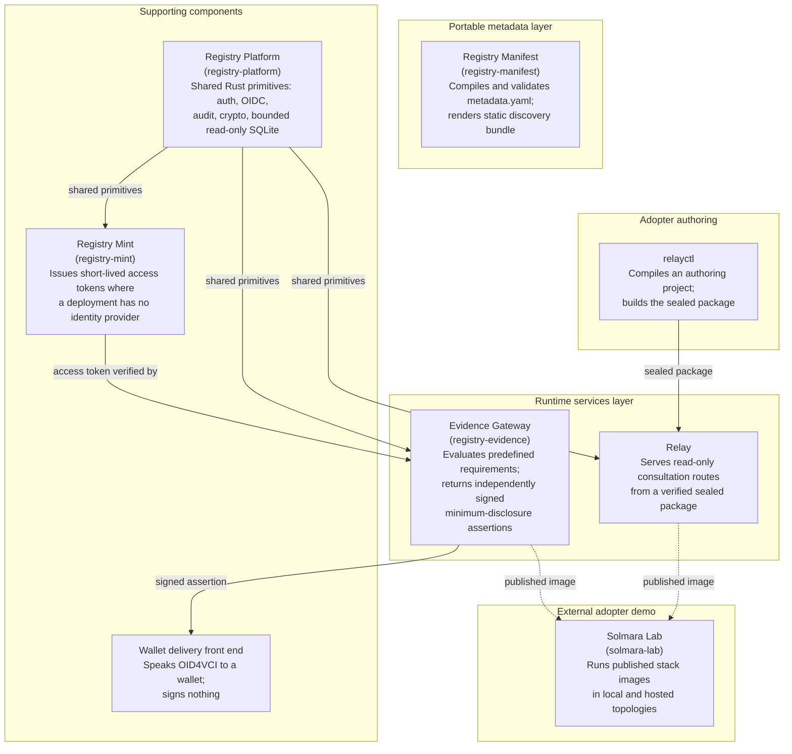

This document defines the architecture of the registry stack. It is the authoritative reference that protocol specifications (RS-PR-*), security specifications (RS-SEC-*), and data-model specifications (RS-DM-*) refine. It names the components, states their boundaries, describes the data and contract flow across them, and records the binding invariants that every implementation MUST respect.

The key words in this document are interpreted per [RS-DOC](../rs-doc/) Section 2.

For a narrative explanation with worked examples, see the [architecture overview](../../explanation/architecture/). This document is the precise, citable version of that overview.

## Version history

| Version | Date | Status | Change |
| --- | --- | --- | --- |
| 0.1.0 | 2026-06-13 | draft | Initial architecture, distilled from the current architecture overview and boundary map. |
| 0.2.0 | 2026-06-13 | draft | Added REQ-ARC-G-010: the portable metadata layer describes but does not authorize, enforce, or assert facts about live data. |
| 0.3.0 | 2026-06-20 | draft | Clarified governed runtime PDP enforcement for the supported Relay profile while preserving the descriptive metadata boundary. |
| 0.3.1 | 2026-06-22 | draft | Clarified static-peer delegated evaluation as distinct from delegated subject access. |
| 0.4.0 | 2026-07-07 | draft | Clarified REQ-ARC-G-009's replay storage scope: shared within a deployment's own replicas, never across a federation trust boundary. Reframed Registry Lab as a non-normative demonstration topology. |
| 0.4.1 | 2026-07-07 | draft | Stated plainly in REQ-ARC-G-009 that the per-peer replay storage isolation is deployment topology and that Registry Notary enforces no runtime gate for it. REQ-ARC-G-009 is retired as of 0.6.0. |
| 0.5.0 | 2026-07-16 | draft | Defined four formal Registry Stack products and moved the non-normative demo boundary to the separate Solmara Lab adopter project. |
| 0.6.0 | 2026-08-03 | draft | Registry Notary is retired. Removed its component section, its federation flow step, and REQ-ARC-G-008, REQ-ARC-G-009, REQ-ARC-G-012, and REQ-ARC-G-013. Restated REQ-ARC-G-007 with Evidence Gateway as the owner of requirement evaluation. Added Evidence Gateway and Registry Mint as components and added REQ-ARC-G-014, REQ-ARC-G-015, and REQ-ARC-G-016. |
| 0.7.0 | 2026-08-09 | draft | Added the Evidence Gateway multi-subject request-batch boundary and REQ-ARC-G-017, preserving one independently signed assertion per available evaluation and separating request batching from holder-bound issuance batching. |
| 0.8.0 | 2026-08-11 | draft | Replaced the Registry Relay component with the contract-compiled Relay runtime, added its `relayctl` authoring tool and the Evidence wallet delivery front end, and removed the retired Relay policy decision point. Retired REQ-ARC-G-006 (manifest-to-Relay runtime binding) and REQ-ARC-G-011 (the Relay PDP profile), which have no successor. Restated REQ-ARC-G-002, REQ-ARC-G-003, REQ-ARC-G-007, and REQ-ARC-G-010 without the retired coupling. Added REQ-ARC-G-018 through REQ-ARC-G-021. |

## 1. Scope and audience

This specification covers:

- The two-layer design principle that governs the separation between portable metadata and runtime services.
- The formal products that make up the registry stack, the supporting services and adopter tooling beside them, their responsibilities, and their boundaries.
- The boundary between the formal products and the separate Solmara Lab adopter demo.
- The ordered data and contract flow from authoring through assertion delivery.
- The binding invariants that hold across all conforming deployments.

This document does not define API surfaces, wire formats, or configuration schemas. Those belong to the RS-PR-* and RS-DM-* series. It does not define the security model; that belongs to the RS-SEC-* series.

The intended audience is implementors building or deploying registry stack components, governance teams auditing a deployment, and authors of specifications that refine this one.

## 2. The two-layer design

The registry stack separates its concerns into two layers.

The **portable metadata layer** is responsible for describing what a registry exposes. It operates entirely without touching production data sources. The layer produces static, standards-shaped artifacts (catalogs, schemas, policy documents, evidence offerings, OGC Records item collections, and embedded codelist metadata) that can be hosted, distributed, and inspected offline. A governance team, an integrator, or an auditor can validate the full description of a registry before any runtime service is deployed or connected.

The **runtime services layer** is responsible for enforcing what a registry promises. It binds governed declarations to actual data sources, enforces access control, evaluates predefined requirements against live data, and returns signed minimum-disclosure assertions. Each runtime service starts from a reviewed, immutable input it verifies before it opens a listener.

This split separates two distinct obligations: the obligation to describe (what a registry declares it can expose and under what policy) from the obligation to enforce (what a running service will actually return to an authorized caller). The separation enables offline audit of published descriptions, offline validation of schemas and assertion shapes, and governance updates without touching a running process.

The two layers share a design principle rather than a file. A Relay deployment compiles and seals its own governed contract; it does not read a portable metadata manifest, and Registry Manifest does not configure a runtime service.

The diagram in this section shows the formal products, their relationship to the two layers, the supporting services, the adopter tooling, and the separate adopter demo.

```mermaid
flowchart TD
    subgraph portable["Portable metadata layer"]
        manifest["Registry Manifest<br/>(registry-manifest)<br/>Compiles and validates metadata.yaml;<br/>renders static discovery bundle"]
    end

    subgraph authoring["Adopter authoring"]
        relayctl["relayctl<br/>Compiles an authoring project;<br/>builds the sealed package"]
    end

    subgraph runtime["Runtime services layer"]
        relay["Relay<br/>Serves read-only consultation routes<br/>from a verified sealed package"]
        evidence["Evidence Gateway<br/>(registry-evidence)<br/>Evaluates predefined requirements;<br/>returns independently signed<br/>minimum-disclosure assertions"]
    end

    subgraph support["Supporting components"]
        platform["Registry Platform<br/>(registry-platform)<br/>Shared Rust primitives: auth, OIDC,<br/>audit, crypto, bounded read-only SQLite"]
        mint["Registry Mint<br/>(registry-mint)<br/>Issues short-lived access tokens where<br/>a deployment has no identity provider"]
        oid4vci["Wallet delivery front end<br/>Speaks OID4VCI to a wallet;<br/>signs nothing"]
    end

    subgraph adopter["External adopter demo"]
        solmara["Solmara Lab<br/>(solmara-lab)<br/>Runs published stack images<br/>in local and hosted topologies"]
    end

    relayctl -- "sealed package" --> relay
    platform -- "shared primitives" --> relay
    platform -- "shared primitives" --> evidence
    platform -- "shared primitives" --> mint
    mint -- "access token verified by" --> evidence
    evidence -- "signed assertion" --> oid4vci
    relay -. "published image" .-> solmara
    evidence -. "published image" .-> solmara
```

This section restates the essential relationships as text. Registry Manifest produces a static discovery bundle for static publishers and for clients that inspect a description offline. Registry Platform supplies shared primitives to the runtime services, including the bounded read-only SQLite boundary. `relayctl` compiles an adopter's authoring project into a sealed package; a Relay process verifies that package and serves read-only consultation routes from it. Each Evidence Gateway evaluation answers one bounded question about one complete subject-role set from its own configured sources, and a request batch can group up to sixteen independent audience-scoped evaluations. Registry Mint issues the access tokens a resource server such as Evidence Gateway verifies, and that dependency runs one way only. The wallet delivery front end carries an Evidence-signed credential to a holder wallet over the one protocol Evidence declines to speak. Solmara Lab consumes published stack images in runnable demo topologies, but it is not a formal Registry Stack product.

## 3. Components

### Registry Platform

Registry Platform (`registry-platform`) is a shared Rust crate workspace that provides security and operational primitives consumed by the runtime services. Its scope includes authentication helpers, OpenID Connect (OIDC) verification, audit envelopes, HTTP security, outbound HTTP policy, cryptography, Selective Disclosure JWT Verifiable Credential (SD-JWT VC) helpers, a bounded read-only SQLite access boundary, and test fixtures. Registry Platform does not run a service and does not define product routing or policy. A primitive lives in Registry Platform only when it must behave identically across multiple runtime services.

The SQLite boundary owns the safety guarantee, not a disclosure policy: it opens a database read-only, installs a statement authorizer that denies by default, and reports every failure categorically without a source value. A consumer still decides which schema objects and columns a compiled statement may read.

### Registry Manifest

Registry Manifest (`registry-manifest`) is a pure Rust library and command-line interface (CLI) with no runtime data dependencies. It accepts a portable `metadata.yaml` document (schema version `registry-manifest/v1`) that describes a registry through its catalog and defined collections. [RS-DM-MANIFEST](../rs-dm-manifest/) specifies the document, and the [Registry Manifest reference](../../products/registry-manifest/reference/) is authoritative for the current top-level keys and field schemas. Registry Manifest validates that document and renders a static discovery bundle containing: a catalog (`catalog.json`), Data Catalog Vocabulary (DCAT) and BRegDCAT-AP JSON-LD, Core Public Service Vocabulary Application Profile (CPSV-AP) JSON-LD, Shapes Constraint Language (SHACL) node shapes, JSON Schema documents, an OGC API Records item collection, Open Digital Rights Language (ODRL) policy documents, Core Criterion and Core Evidence Vocabulary (CCCEV) metadata, embedded SKOS-shaped codelist metadata, and an `index.json`. Registry Manifest does not serve HTTP, does not connect to databases, and does not handle authentication, audit, or secrets. It configures no runtime service.

### Relay

Relay is a contract-compiled, read-only consultation runtime and the `relay` binary. It serves a fixed route set over a sealed package: an adopter's governed contract, the canonical compiled model derived from it, and the artifacts generated from that model. At startup the process re-derives the compiled model and every artifact from the authored inputs and refuses to serve when a byte differs, so the package is the governed trust root rather than a convenience bundle. Only deployment-local bindings (listener, issuer, source paths, audit destination, quotas) arrive separately, and the runtime schema rejects every governed field.

Relay reads adopter data through the shared bounded read-only SQLite boundary, over the views an adopter declared, under a snapshot or live read-only source profile. It exposes no write route, no administrative route, and no reload endpoint: a governed change is a new package and a new process. [RS-PR-RELAY](../rs-pr-relay/) specifies the protocol; [RS-OP-POSTURE](../rs-op-posture/) specifies the operational posture.

### relayctl

`relayctl` is the adopter command line beside Relay. It initializes an authoring project, inspects SQLite structure without reading row values, compiles and validates the project, generates deterministic artifacts, runs offline fixtures, classifies the change between two project revisions, and builds the sealed package. Every operation is performed by linking the same shared library the runtime uses, so the authoring path and the serving path cannot diverge. `relayctl` starts no process, reaches no running deployment, and signs nothing. [RS-PR-RELAYCTL](../rs-pr-relayctl/) specifies its contract.

### Evidence Gateway

Evidence Gateway (`registry-evidence`) is a single-crate Rust service and the `evidence` binary, depending on the portable `registry-evidence-verifier` library for the response formats, the Evidence payload contract, and relying-party verification, so client tooling can verify a signed response without the service. Each evaluation answers one bounded question about one complete subject-role set with one signed assertion that carries the answer and not the record. Its request-batch route groups up to sixteen independent audience-scoped evaluations under one common requirement and purpose, while preserving one independently signed assertion per available item. It loads one reviewed governed bundle and one closed operator runtime file at startup, treats both as immutable for the process lifetime, and holds no application database: it persists no selector, no source payload, no evidence value, and no response body. It authenticates callers with strict OIDC bearer tokens against exactly one trusted issuer, matches exactly one authority path per evaluation, calls the fixed bounded HTTP JSON or SQLite extract sources its bundle declares, and releases an assertion as a flattened JWS JSON document by default. Where the bundle and the matched grant both enable it, the same assertion can also be serialized as an SD-JWT VC (`application/dc+sd-jwt`) or as a visibly unsigned envelope for local diagnosis.

Evidence Gateway Version 1 supports its declared holder-bound subject-binding mode and bounded issuance envelope, but has no credential lifecycle, no interactive holder-binding ceremony or issuance session, no status list, no revocation, no delegated or federated evaluation between peers, no policy decision point, no replay subsystem, and no worker or document subsystem. It does not depend on Relay, does not consult it, and does not read a metadata manifest. Evidence Gateway may consume a Relay-protected API through its ordinary fixed HTTP source contract, and that consumption grants it none of Relay's authorization model.

### Registry Mint

Registry Mint (`registry-mint`) is a supporting service rather than a third runtime pattern: it is a minimal OAuth 2.0 token issuer and the `mint` binary, for deployments that have no identity provider of their own. A registered client authenticates with an RFC 7523 `private_key_jwt` client assertion by default, which is verified only against the keys registered for the client the assertion names. A standard authorization client that cannot sign assertions may explicitly select `client_secret_basic` or `client_secret_post`; the secret is verified only against that client's registered fingerprints and cannot be combined with Evidence authority or delegation. The authority claims carried by the minted access token are read from the server-side client registry and never from the assertion or token request. Issuer identity, signing keys, listener, and token policy are startup-only and immutable for the process lifetime; the client registry is reloadable, so onboarding, offboarding, and client credential rotation do not require restarting a resource server. Registry Mint evaluates no requirement, reads no registry source, and issues no assertion.

The dependency runs one way. A resource server such as Evidence Gateway verifies a Mint-issued token as an ordinary OIDC access token, and Evidence Gateway carries no dependency on Registry Mint. In the workspace, `registry-mint` takes `registry-evidence` as a development dependency so that Mint's tests drive the Evidence Gateway authenticator against real tokens.

### Wallet delivery front end

The wallet delivery front end (`registry-evidence-oid4vci`) is a supporting service in the same sense as Registry Mint. It speaks OID4VCI 1.0 Final to a holder wallet, the wallet-facing protocol Evidence Gateway deliberately refuses to speak, and delivers an Evidence-signed credential over it. It never signs a credential and holds no Evidence signing key. It never holds a holder private key: it receives holder public keys inside wallet-signed proofs and passes them to Evidence Gateway unchanged. It adds no Evidence semantics, so every authorization decision, every source acquisition, and every signature stays behind the Evidence Gateway runtime contract.

Everything the service remembers lives in memory, bounded, for minutes. A restart therefore invalidates every outstanding offer, and single use is enforced per process. Both are documented limits of a single-replica deployment.

### Solmara Lab

Solmara Lab (`solmara-lab`) is a separately maintained adopter demo for the fictional Republic of
Solmara. It runs published stack images together with static metadata, generated synthetic data,
and demo clients in local and hosted topologies. It illustrates
how the formal products connect at runtime, but it is not a specified component and carries no
conformance weight against this specification. Solmara Lab does not own any normative API or
metadata contract and does not provide production deployment guidance.
{/* TODO[evidence]: the exact Solmara Lab topology (which images and supporting services it runs)
cannot be anchored from this repository; it is maintained in the separate registrystack/solmara-lab
project. Restore the specific enumeration once that repository's current topology is citable. */}

## 4. Data and contract flow

The following ordered flow describes how a request moves through the stack from authoring to assertion delivery.

1. **Shared primitives.** Registry Platform provides reusable security and operational primitives (authentication, OIDC verification, audit envelopes, HTTP security, outbound HTTP policy, cryptography, SD-JWT VC helpers, bounded read-only SQLite access) consumed by the runtime services.

2. **Description.** An operator authors a portable `metadata.yaml` document and Registry Manifest renders a static discovery bundle from it. The bundle can be hosted as static files without running any runtime service. This step is independent: it does not produce input for a runtime service, and a runtime service does not wait on it.

3. **Contract authoring.** An adopter authors a Relay project: the governed contract, the governance review documents that record institutional judgment, and the codelists the contract references. `relayctl` compiles the project, reports diagnostics, and generates artifacts. Under the production profile an unreviewed classification or an unobserved source schema is an error rather than a warning.

4. **Sealing.** `relayctl` builds a sealed package containing the authored contract, the governed closure, the canonical compiled model, the generated artifacts, and a manifest that digests every file. Deployment-local bindings are excluded by construction.

5. **Serving.** A Relay process verifies the package by re-deriving it, opens its issuer, audit sink, source, and listener only after that verification succeeds, and serves read-only consultation routes. Every attempt is recorded to the audit chain before the source is read, and the request is refused when the audit sink cannot accept the record.

6. **Access-token issuance.** Where a deployment has no identity provider of its own, Registry Mint issues the short-lived access token the caller presents. A registered client authenticates with `private_key_jwt` by default, or a standard authorization client explicitly selects a compatible client-secret method, and Mint reads the token's authority claims from its server-side client registry. A deployment that already runs an identity provider skips this step entirely.

7. **Assertion.** Evidence Gateway authenticates the caller's access token against its one trusted issuer, matches exactly one authority path per evaluation, evaluates one predefined requirement over its own fixed bounded sources, and returns one signed minimum-disclosure assertion per available evaluation. A singular request carries one evaluation; a request batch groups up to sixteen ordered audience-scoped evaluations under one common requirement and purpose. Caller identity and authorization details may authorize or parameterize an evaluation, but do not become evidence. Each assertion carries the answer the requirement defines, not the source record behind it.

8. **Wallet delivery.** Where a deployment enables it, the wallet delivery front end carries an Evidence-signed credential to a holder wallet over OID4VCI. It adds no claim and no signature of its own.

## 5. Architectural invariants

This section states the binding constraints that hold across all conforming registry stack deployments. Each is tagged with a stable requirement identifier per RS-DOC Section 5.

REQ-ARC-G-001: The portable metadata layer MUST render discovery artifacts without accessing production data sources. Registry Manifest MUST NOT connect to databases, serve HTTP, or handle authentication or secrets during compilation and rendering.

REQ-ARC-G-002: A metadata manifest (schema `registry-manifest/v1`) MUST NOT include runtime bindings such as source paths, connection details, or scopes. A runtime binding belongs to the deployment-local configuration of the service that opens the source, never to a portable description.

REQ-ARC-G-003: A runtime service MUST NOT expose a source-registry data mutation route. Consultation APIs are read-only, and a governed change reaches a running service only by replacing the immutable input it verified at startup.

REQ-ARC-G-004: Every request that touches person-level data MUST be audited. Registry Platform provides the audit envelope primitives, verified to exist in the shared crate; Relay and Evidence Gateway MUST compose those primitives on routes that return person-level records or evidence assertions. This requirement states an invariant a conforming deployment meets; it is not a claim that every route in a given build has been individually audited.

REQ-ARC-G-005: A primitive that must behave identically across runtime services (authentication, OIDC, audit, HTTP security, outbound HTTP policy, cryptography, SD-JWT VC helpers, bounded read-only SQLite access) SHOULD be sourced from Registry Platform rather than reimplemented in Relay, Evidence Gateway, or Registry Mint. This keeps cross-service security behavior consistent and auditable in one place.

REQ-ARC-G-007: Evidence Gateway MUST own requirement evaluation, disclosure shape, and assertion signing. Relay MUST NOT evaluate a requirement or sign an evidence assertion. Where Evidence Gateway consumes a Relay-protected API, it MUST do so through its ordinary fixed HTTP source contract and MUST NOT inherit Relay's authorization model.

REQ-ARC-G-010: The portable metadata layer describes; it does not authorize and it does not assert facts about live data. Publishing a dataset, schema, policy, evidence offering, or ecosystem binding in a discovery artifact MUST NOT be construed as granting access to it, as enforcing it, or as asserting that any particular record exists or satisfies it. Access control and the existence or value of a record are determined only by an authorized runtime read under the governed input the serving process verified. A published ODRL policy is descriptive. A conformance claim against a metadata artifact MUST NOT imply a runtime guarantee that the runtime layer has not made.

REQ-ARC-G-014: Evidence Gateway MUST return only the answer its predefined requirement defines, never the source record behind that answer. The response MUST be constructed by the service core after the complete declared concept set has been produced and validated; configured bundle logic MUST NOT construct a response envelope, a subject identifier, or any claim outside that declared set.

REQ-ARC-G-015: Every signed Evidence Gateway assertion, whether returned directly or nested in a request-batch envelope, MUST be a flattened JWS JSON document over the exact evidence payload, and a signing failure MUST fail closed rather than release unsigned output. Where a deployment enables the SD-JWT VC serialization (`application/dc+sd-jwt`), that serialization MUST project the identical payload and MUST NOT be read as a credential lifecycle: Evidence Gateway Version 1 defines no issuance session, no holder-binding ceremony, no status list, no revocation, and no presentation verification.

REQ-ARC-G-016: The dependency between Registry Mint and a resource server MUST run one way. Registry Mint issues an access token that a resource server such as Evidence Gateway verifies as an ordinary OIDC access token; Evidence Gateway MUST NOT depend on Registry Mint, and a deployment that already operates an identity provider MUST be able to run Evidence Gateway without Registry Mint.

REQ-ARC-G-017: An Evidence Gateway request batch MUST preserve the boundary of each independent audience-scoped evaluation. The service MUST validate and authorize every item before source access, return results in request order, sign each available assertion independently, and release the complete response or nothing. An unavailable item MAY be represented only by its closed positional sentinel; any other item failure MUST abort the complete request. Request batching several subject sets MUST remain distinct from holder-bound issuance batching several credentials for one subject evaluation. An optional source-batch optimization MAY reduce physical HTTP calls but MUST NOT transfer authorization, source transport, result association, evidence construction, signing, or audit authority out of the Rust core.

REQ-ARC-G-018: A Relay deployment MUST serve only from a sealed package it verified before opening any other resource, and verification MUST re-derive the compiled model and every generated artifact from the authored inputs rather than trust a recorded digest. The package digest is an integrity check, not an authenticity proof. A Relay process MUST NOT expose an administrative route, a reload route, or any other surface that changes governed meaning while the process runs.

REQ-ARC-G-019: Authoring and serving MUST be separate processes with separate binaries. The authoring tool MUST NOT start, contact, or configure a running deployment, and the serving process MUST NOT compile an authoring project. Both MUST perform their shared work through the same library, so a rule an adopter validated at authoring time is the rule the deployment enforces.

REQ-ARC-G-020: Relay MUST own no source of truth. It MUST read adopter data through a bounded read-only boundary over the schema objects its governed contract declares, and MUST NOT persist a record value. The append-only audit chain is the only state a Relay deployment writes.

REQ-ARC-G-021: A wallet delivery front end MUST NOT sign a credential, hold an Evidence signing key, hold a holder private key, or add a claim of its own. It MUST pass a wallet-supplied holder public key to Evidence Gateway unchanged, and the dependency MUST run one way: no Evidence Gateway crate depends on it at runtime.

REQ-ARC-G-006, REQ-ARC-G-008, REQ-ARC-G-009, REQ-ARC-G-011, REQ-ARC-G-012, and REQ-ARC-G-013 are retired. REQ-ARC-G-008, REQ-ARC-G-009, REQ-ARC-G-012, and REQ-ARC-G-013 constrained the retired `registry-notary` component's credential format, federation topology, issuance provenance, or state ownership. REQ-ARC-G-006 bound a metadata manifest's logical concepts to Relay runtime configuration, and REQ-ARC-G-011 scoped the Relay policy decision point to the `registry-evidence-gateway-pdp/v1` profile; the current Relay runtime reads no manifest and operates no policy decision point, so neither requirement has a subject or a successor. Per RS-DOC REQ-DOC-008 the identifiers are not reused and are not reassigned to the requirements added in this version.

## 6. Capability sequence

The two-layer design supports one natural capability sequence: describe what the registry can provide, then expose protected access, then assert bounded facts.

**Describe.** Registry Manifest compiles a portable description and renders a standards-shaped discovery bundle. Other teams can inspect fields, schemas, policies, services, and evidence offerings before any integration is built.

**Expose.** An adopter authors a governed contract over an existing source, `relayctl` seals it, and a Relay process serves protected, read-only consultation routes from the sealed package. A database or extract gains a governed API without replacing the source and without granting the API a write path back to it.

**Assert.** Evidence Gateway evaluates one predefined requirement over its own configured sources and
returns one signed assertion per available evaluation. A caller can submit one evaluation or group
up to sixteen independent audience-scoped evaluations in a request batch. Each assertion is narrower
than the source record by construction: it carries the answer the requirement defines and nothing
else.

The sequence is ordered by increasing commitment rather than by data dependency. Describing a registry costs nothing and can be reviewed offline. Exposing it commits an institution to a governed contract that a reviewer can read before a listener opens. Asserting commits it to a signed answer about a live record.

Registry Platform supports the runtime services with the shared primitives that make each stage
auditable, Registry Mint supplies access tokens where a deployment has no identity provider, and the
wallet delivery front end carries a signed credential to a holder wallet. The external Solmara Lab
adopter demo exercises the sequence using published stack images.

## Conformance

An implementation conforms to this specification when it respects the following requirements from Section 5:

- REQ-ARC-G-001: the metadata compilation step does not access production sources.
- REQ-ARC-G-002: a portable description contains no runtime bindings.
- REQ-ARC-G-003: runtime services expose no source-registry data mutation routes.
- REQ-ARC-G-004: every request touching person-level data produces an audit record.
- REQ-ARC-G-005: shared security primitives that must behave identically across services are sourced from Registry Platform (recommended).
- REQ-ARC-G-007: requirement evaluation and assertion signing are owned by Evidence Gateway.
- REQ-ARC-G-010: discovery artifacts are treated as description, not as authorization, enforcement, or proof that a record exists.
- REQ-ARC-G-014: an Evidence Gateway response carries the defined answer and not the source record behind it.
- REQ-ARC-G-015: a signed response is a flattened JWS JSON document, signing failure fails closed, and the SD-JWT VC serialization projects the same payload without adding a credential lifecycle.
- REQ-ARC-G-016: the Registry Mint dependency runs one way, and Evidence Gateway runs without Registry Mint where an identity provider already exists.
- REQ-ARC-G-017: request batching preserves independent evaluation boundaries, ordered results, per-assertion signing, atomic release, and Rust ownership of source and result association.
- REQ-ARC-G-018: a Relay deployment serves only from a re-derived sealed package and exposes no administrative plane.
- REQ-ARC-G-019: authoring and serving are separate processes over one shared library.
- REQ-ARC-G-020: Relay reads through a bounded read-only boundary, persists no record value, and owns no source of truth.
- REQ-ARC-G-021: a wallet delivery front end signs nothing, holds no holder private key, and adds no claim.

Conformance to this specification does not imply conformance to any external standard cited in the `standards_referenced` frontmatter field. Each standard's adoption mode and scope are documented in the [standards register](../../reference/standards/).

## Evidence

This specification is `verified`: it is distilled from published artifacts a reader can inspect, per RS-DOC REQ-DOC-014.

{/* Evidence: crates/registry-relay-v2/src/startup.rs verifies the sealed package before opening
     issuer, audit, source, or listener resources. */}
{/* Evidence: crates/registry-relay-v2/src/package.rs re-derives the compiled model and every
     artifact, and records that the package revision is an integrity digest, not an authenticity
     proof. */}
{/* Evidence: crates/registry-relay-v2/src/server.rs defines the fixed route set with no
     administrative or reload route. */}
{/* Evidence: crates/registry-relayctl/src/shared.rs and tests/cli_contract.rs pin the single
     library seam and that the authoring tool never spawns the runtime. */}
{/* Evidence: crates/registry-platform-sqlite/src/lib.rs owns the read-only boundary and its
     deny-by-default statement authorizer. */}
{/* Evidence: crates/registry-evidence-oid4vci/src/lib.rs states the three non-negotiable
     properties of the wallet delivery front end. */}
{/* Evidence: an Evidence Gateway source request reaches its source over one of two coequal
     transports, contract registry.evidence.fixed-http-json-source/v1 in
     products/evidence/contracts/source-contract.yaml and contract
     registry.evidence.fixed-sqlite-extract-source/v1 in
     products/evidence/contracts/sqlite-extract-source-contract.yaml (both frozen). */}

- The [boundary map](../../map/boundaries-and-map/) records each component's boundaries with their source citations. It is a distillation source for the components (Section 3) and the invariants (Section 5).
- The [architecture overview](../../explanation/architecture/) gives the narrative data and contract flow that Section 4 makes precise.
- The [relayctl reference](../../reference/relayctl/) and the [Evidence Gateway API reference](../../reference/apis/registry-evidence/) show the surfaces named in Section 3.
- The [Registry Mint reference](../../reference/mint/) records the token issuer described in Section 3.
- The [standards register](../../reference/standards/) records the adoption mode for each standard listed in `standards_referenced`.

## Next

- [RS-DOC](../rs-doc/) defines the documentation framework this specification conforms to.
- [RS-TERMS](../rs-terms/) defines the shared vocabulary the other specifications use.
- [Architecture overview](../../explanation/architecture/) is the narrative explanation with a worked data flow and capability table.
- [RS-PR-RELAY](../rs-pr-relay/) defines the consultation protocol this architecture places.
- [RS-PR-EVIDENCE](../rs-pr-evidence/) defines the protocol surface of the Evidence Gateway service this architecture places.
