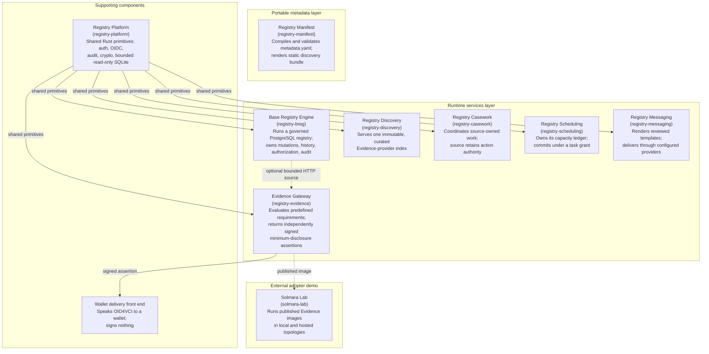

This document defines the architecture of the registry stack. It is the authoritative reference that protocol specifications (RS-PR-*), security specifications (RS-SEC-*), and data-model specifications (RS-DM-*) refine. It names the components, states their boundaries, describes the data and contract flow across them, and records the binding invariants that every implementation MUST respect.

The key words in this document are interpreted per [RS-DOC](../rs-doc/) Section 2.

For a narrative explanation with worked examples, see the [architecture overview](../../explanation/architecture/). This document is the precise, citable version of that overview.

## Version history

| Version | Date | Status | Change |
| --- | --- | --- | --- |
| 0.1.0 | 2026-06-13 | draft | Initial architecture, distilled from the current architecture overview and boundary map. |
| 0.2.0 | 2026-06-13 | draft | Added REQ-ARC-G-010: the portable metadata layer describes but does not authorize, enforce, or assert facts about live data. |
| 0.3.0 | 2026-06-20 | draft | Clarified governed runtime PDP enforcement for the supported Relay profile while preserving the descriptive metadata boundary. |
| 0.3.1 | 2026-06-22 | draft | Clarified static-peer delegated evaluation as distinct from delegated subject access. |
| 0.4.0 | 2026-07-07 | draft | Clarified REQ-ARC-G-009's replay storage scope: shared within a deployment's own replicas, never across a federation trust boundary. Reframed Registry Lab as a non-normative demonstration topology. |
| 0.4.1 | 2026-07-07 | draft | Stated plainly in REQ-ARC-G-009 that the per-peer replay storage isolation is deployment topology and that Registry Notary enforces no runtime gate for it. REQ-ARC-G-009 is retired as of 0.6.0. |
| 0.5.0 | 2026-07-16 | draft | Defined four formal Registry Stack products and moved the non-normative demo boundary to the separate Solmara Lab adopter project. |
| 0.6.0 | 2026-08-03 | draft | Registry Notary is retired. Removed its component section, its federation flow step, and REQ-ARC-G-008, REQ-ARC-G-009, REQ-ARC-G-012, and REQ-ARC-G-013. Restated REQ-ARC-G-007 with Evidence Gateway as the owner of requirement evaluation. Added Evidence Gateway and Registry Mint as components and added REQ-ARC-G-014, REQ-ARC-G-015, and REQ-ARC-G-016. |
| 0.7.0 | 2026-08-09 | draft | Added the Evidence Gateway multi-subject request-batch boundary and REQ-ARC-G-017, preserving one independently signed assertion per available evaluation and separating request batching from holder-bound issuance batching. |
| 0.8.0 | 2026-08-11 | draft | Replaced the Registry Relay component with the contract-compiled Relay runtime, added its `relayctl` authoring tool and the Evidence wallet delivery front end, and removed the retired Relay policy decision point. Retired REQ-ARC-G-006 (manifest-to-Relay runtime binding) and REQ-ARC-G-011 (the Relay PDP profile), which have no successor. Restated REQ-ARC-G-002, REQ-ARC-G-003, REQ-ARC-G-007, and REQ-ARC-G-010 without the retired coupling. Added REQ-ARC-G-018 through REQ-ARC-G-021. |
| 0.8.1 | 2026-09-25 | draft | Described Relay's audit as a log without a hash chain in the serving flow and REQ-ARC-G-020. |
| 0.9.0 | 2026-10-03 | draft | Retired the Registry Relay component and REQ-ARC-G-003, REQ-ARC-G-018, REQ-ARC-G-019, and REQ-ARC-G-020 without reassigning their identifiers. Retained the maintained product boundaries, portable metadata, shared platform, and wallet delivery. |

## 1. Scope and audience

This specification covers:

- The two-layer design principle that governs the separation between portable metadata and runtime services.
- The formal products that make up the registry stack, the supporting services and adopter tooling beside them, their responsibilities, and their boundaries.
- The boundary between the formal products and the separate Solmara Lab adopter demo.
- An example ordered data and contract flow from metadata authoring through assertion delivery.
- The binding invariants that hold across all conforming deployments.

This document does not define API surfaces, wire formats, or configuration schemas. Those belong to the RS-PR-* and RS-DM-* series. It does not define the security model; that belongs to the RS-SEC-* series.

The intended audience is implementors building or deploying registry stack components, governance teams auditing a deployment, and authors of specifications that refine this one.

## 2. The two-layer design

The registry stack separates its concerns into two layers.

The **portable metadata layer** is responsible for describing what a registry exposes. It operates entirely without touching production data sources. The layer produces static, standards-shaped artifacts (catalogs, schemas, policy documents, evidence offerings, OGC Records item collections, and embedded codelist metadata) that can be hosted, distributed, and inspected offline. A governance team, an integrator, or an auditor can validate the full description of a registry before any runtime service is deployed or connected.

The **runtime services layer** is responsible for enforcing what a registry promises. It binds governed declarations to actual data sources, enforces access control, evaluates predefined requirements against live data, and returns signed minimum-disclosure assertions. Each product owns validation of its governed input and the deployment configuration that binds it to runtime resources.

This split separates two distinct obligations: the obligation to describe (what a registry declares it can expose and under what policy) from the obligation to enforce (what a running service will actually return to an authorized caller). The separation enables offline audit of published descriptions, offline validation of schemas and assertion shapes, and governance updates without touching a running process.

The two layers share a design principle rather than a file. Evidence Gateway loads its own governed bundle and runtime configuration; it does not read a portable metadata manifest, and Registry Manifest does not configure a runtime service.

The diagram in this section shows the retained portable, runtime, and supporting boundaries.

```mermaid
flowchart TD
    subgraph portable["Portable metadata layer"]
        manifest["Registry Manifest<br/>(registry-manifest)<br/>Compiles and validates metadata.yaml;<br/>renders static discovery bundle"]
    end

    subgraph runtime["Runtime services layer"]
        breg["Base Registry Engine<br/>(registry-breg)<br/>Runs a governed PostgreSQL registry;<br/>owns mutations, history, authorization, audit"]
        evidence["Evidence Gateway<br/>(registry-evidence)<br/>Evaluates predefined requirements;<br/>returns independently signed<br/>minimum-disclosure assertions"]
        discovery["Registry Discovery<br/>(registry-discovery)<br/>Serves one immutable, curated<br/>Evidence-provider index"]
        casework["Registry Casework<br/>(registry-casework)<br/>Coordinates source-owned work;<br/>source retains action authority"]
        scheduling["Registry Scheduling<br/>(registry-scheduling)<br/>Owns its capacity ledger;<br/>commits under a task grant"]
        messaging["Registry Messaging<br/>(registry-messaging)<br/>Renders reviewed templates;<br/>delivers through configured providers"]
    end

    subgraph support["Supporting components"]
        platform["Registry Platform<br/>(registry-platform)<br/>Shared Rust primitives: auth, OIDC,<br/>audit, crypto, bounded read-only SQLite"]
        oid4vci["Wallet delivery front end<br/>Speaks OID4VCI to a wallet;<br/>signs nothing"]
    end

    subgraph adopter["External adopter demo"]
        solmara["Solmara Lab<br/>(solmara-lab)<br/>Runs published Evidence images<br/>in local and hosted topologies"]
    end

    platform -- "shared primitives" --> breg
    platform -- "shared primitives" --> evidence
    platform -- "shared primitives" --> discovery
    platform -- "shared primitives" --> casework
    platform -- "shared primitives" --> scheduling
    platform -- "shared primitives" --> messaging
    breg -. "optional bounded HTTP source" .-> evidence
    evidence -- "signed assertion" --> oid4vci
    evidence -. "published image" .-> solmara
```

This section restates the essential relationships as text. Registry Manifest produces a static discovery bundle for static publishers and for clients that inspect a description offline. Registry Platform supplies shared primitives to the runtime services, including the bounded read-only SQLite boundary. Base Registry Engine (BReg), Registry Casework, Registry Scheduling, and Registry Messaging each own their product state and authority. Registry Discovery serves an inert, immutable index of Evidence providers and grants no trust or invocation authority. A BReg authenticated route can be one optional fixed bounded HTTP source for Evidence Gateway, but each product keeps its own authorization boundary. Each Evidence Gateway evaluation answers one bounded question about one complete subject-role set from its own configured sources, and a request batch can group up to sixteen independent audience-scoped evaluations. The wallet delivery front end carries an Evidence-signed credential to a holder wallet over the one protocol Evidence declines to speak. Solmara Lab runs published Evidence images in local and hosted runnable topologies, but it is not a formal Registry Stack product and carries no conformance weight.

## 3. Components

### Registry Platform

Registry Platform (`registry-platform`) is a shared Rust crate workspace that provides security and operational primitives consumed by the runtime services. Its scope includes authentication helpers, OpenID Connect (OIDC) verification, audit envelopes, HTTP security, outbound HTTP policy, cryptography, Selective Disclosure JWT Verifiable Credential (SD-JWT VC) helpers, a bounded read-only SQLite access boundary, and test fixtures. Registry Platform does not run a service and does not define product routing or policy. A primitive lives in Registry Platform only when it must behave identically across multiple runtime services.

The SQLite boundary owns the safety guarantee, not a disclosure policy: it opens a database read-only, installs a statement authorizer that denies by default, and reports every failure categorically without a source value. A consumer still decides which schema objects and columns a compiled statement may read.

### Registry Manifest

Registry Manifest (`registry-manifest`) is a pure Rust library and command-line interface (CLI) with no runtime data dependencies. It accepts a portable `metadata.yaml` document (schema version `registry-manifest/v1`) that describes a registry through its catalog and defined collections. [RS-DM-MANIFEST](../rs-dm-manifest/) specifies the document, and the [Registry Manifest reference](../../products/registry-manifest/reference/) is authoritative for the current top-level keys and field schemas. Registry Manifest validates that document and renders a static discovery bundle containing: a catalog (`catalog.json`), Data Catalog Vocabulary (DCAT) and BRegDCAT-AP JSON-LD, Core Public Service Vocabulary Application Profile (CPSV-AP) JSON-LD, Shapes Constraint Language (SHACL) node shapes, JSON Schema documents, an OGC API Records item collection, Open Digital Rights Language (ODRL) policy documents, Core Criterion and Core Evidence Vocabulary (CCCEV) metadata, embedded SKOS-shaped codelist metadata, and an `index.json`. Registry Manifest does not serve HTTP, does not connect to databases, and does not handle authentication, audit, or secrets. It configures no runtime service.

### Base Registry Engine

Base Registry Engine (`registry-breg`) is a PostgreSQL system of record whose data model and REST surface are compiled from governed configuration. The runtime loads one verified Registry package and owns configured reads and mutations, per-profile authorization, record revisions and history, events, audit ordering, idempotency, and governed migrations. This maintained writable product is why the former global read-only invariant REQ-ARC-G-003 is retired. BReg can expose an authenticated route as one fixed bounded HTTP source for Evidence Gateway, but that integration creates no Evidence authority or inherited authorization.

### Registry Discovery

Registry Discovery (`registry-discovery`) serves one curated, immutable index until restart. Its current profile contains Evidence provider publications only. A provider result or persisted selection is inert metadata: it establishes no trust, grants no caller authority, and invokes nothing. The relying application validates and accepts the endpoint under its current trust configuration, then calls the native Evidence client directly.

### Registry Casework

Registry Casework (`registry-casework`) gives authorized human teams an accountable inbox over source-owned work and source-neutral reviews. An adapter can present current source work and promote a source action, but the source retains current visibility, eligibility, and mutation authority. Casework owns its coordination, review, directory, and accountability state; it does not become the source of record for the work it presents.

### Registry Scheduling

Registry Scheduling (`registry-scheduling`) is a capacity ledger over anchored supply. It owns that ledger absolutely: every hold or appointment is created, moved, or released inside Scheduling's PostgreSQL capacity transaction under a verified task grant, and no other product writes the ledger. Another product can publish bookable supply or display a Scheduling appointment without transferring source eligibility or capacity authority.

### Registry Messaging

Registry Messaging (`registry-messaging`) delivers one operational message to one destination and channel for an authorized caller. The caller owns why and when to send, the recipient and contact source, and consent to be contacted. Messaging owns rendering from reviewed templates, delivery through operator-configured providers, and the accountable record and delivery report for each attempt. It inherits no authorization from another product and writes no other product's database.

### Evidence Gateway

Evidence Gateway (`registry-evidence`) is a single-crate Rust service and the `evidence` binary, depending on the portable `registry-evidence-verifier` library for the response formats, the Evidence payload contract, and relying-party verification, so client tooling can verify a signed response without the service. Each evaluation answers one bounded question about one complete subject-role set with one signed assertion that carries the answer and not the record. Its request-batch route groups up to sixteen independent audience-scoped evaluations under one common requirement and purpose, while preserving one independently signed assertion per available item. It loads one reviewed governed bundle and one closed operator runtime file at startup, treats both as immutable for the process lifetime, and holds no application database: it persists no selector, no source payload, no evidence value, and no response body. It authenticates callers with strict OIDC bearer tokens against exactly one trusted issuer, matches exactly one authority path per evaluation, calls the fixed bounded HTTP JSON or SQLite extract sources its bundle declares, and releases an assertion as a flattened JWS JSON document by default. Where the bundle and the matched grant both enable it, the same assertion can also be serialized as an SD-JWT VC (`application/dc+sd-jwt`) or as a visibly unsigned envelope for local diagnosis.

Evidence Gateway Version 1 supports its declared holder-bound subject-binding mode and bounded issuance envelope, but has no credential lifecycle, no interactive holder-binding ceremony or issuance session, no status list, no revocation, no delegated or federated evaluation between peers, no policy decision point, no replay subsystem, and no worker or document subsystem. It does not read a metadata manifest.

### Wallet delivery front end

The wallet delivery front end (`registry-evidence-oid4vci`) is a supporting service outside the runtime product patterns. It speaks OID4VCI 1.0 Final to a holder wallet, the wallet-facing protocol Evidence Gateway deliberately refuses to speak, and delivers an Evidence-signed credential over it. It never signs a credential and holds no Evidence signing key. It never holds a holder private key: it receives holder public keys inside wallet-signed proofs and passes them to Evidence Gateway unchanged. It adds no Evidence semantics, so every authorization decision, every source acquisition, and every signature stays behind the Evidence Gateway runtime contract.

Everything the service remembers lives in memory, bounded, for minutes. A restart therefore invalidates every outstanding offer, and single use is enforced per process. Both are documented limits of a single-replica deployment.

### Solmara Lab

Solmara Lab (`solmara-lab`) is a separately maintained adopter demo for the fictional Republic of
Solmara. It runs published stack images together with static metadata, generated synthetic data,
and demo clients in local and hosted topologies. It illustrates
how the formal products connect at runtime, but it is not a specified component and carries no
conformance weight against this specification. Solmara Lab does not own any normative API or
metadata contract and does not provide production deployment guidance.
{/* TODO[evidence]: the exact Solmara Lab topology (which images and supporting services it runs)
cannot be anchored from this repository; it is maintained in the separate registrystack/solmara-lab
project. Restore the specific enumeration once that repository's current topology is citable. */}

## 4. Data and contract flow

The following ordered flow is one example showing how portable description and assertion delivery remain separate. It is not a complete sequence for every maintained product.

1. **Shared primitives.** Registry Platform provides reusable security and operational primitives (authentication, OIDC verification, audit envelopes, HTTP security, outbound HTTP policy, cryptography, SD-JWT VC helpers, bounded read-only SQLite access) consumed by the runtime services.

2. **Description.** An operator authors a portable `metadata.yaml` document and Registry Manifest renders a static discovery bundle from it. The bundle can be hosted as static files without running any runtime service. This step is independent: it does not produce input for a runtime service, and a runtime service does not wait on it.

3. **Assertion.** Evidence Gateway authenticates the caller's access token against its one trusted issuer, matches exactly one authority path per evaluation, evaluates one predefined requirement over its own fixed bounded sources, and returns one signed minimum-disclosure assertion per available evaluation. A singular request carries one evaluation; a request batch groups up to sixteen ordered audience-scoped evaluations under one common requirement and purpose. Caller identity and authorization details may authorize or parameterize an evaluation, but do not become evidence. Each assertion carries the answer the requirement defines, not the source record behind it.

4. **Wallet delivery.** Where a deployment enables it, the wallet delivery front end carries an Evidence-signed credential to a holder wallet over OID4VCI. It adds no claim and no signature of its own.

## 5. Architectural invariants

This section states the binding constraints that hold across all conforming registry stack deployments. Each is tagged with a stable requirement identifier per RS-DOC Section 5.

REQ-ARC-G-001: The portable metadata layer MUST render discovery artifacts without accessing production data sources. Registry Manifest MUST NOT connect to databases, serve HTTP, or handle authentication or secrets during compilation and rendering.

REQ-ARC-G-002: A metadata manifest (schema `registry-manifest/v1`) MUST NOT include runtime bindings such as source paths, connection details, or scopes. A runtime binding belongs to the deployment-local configuration of the service that opens the source, never to a portable description.

REQ-ARC-G-004: Every request that touches person-level data MUST be audited. Registry Platform provides the audit envelope primitives, verified to exist in the shared crate; maintained runtime products MUST compose those primitives on routes that return person-level records or evidence assertions. This requirement states an invariant a conforming deployment meets; it is not a claim that every route in a given build has been individually audited.

REQ-ARC-G-005: A primitive that must behave identically across runtime services (authentication, OIDC, audit, HTTP security, outbound HTTP policy, cryptography, SD-JWT VC helpers, bounded read-only SQLite access) SHOULD be sourced from Registry Platform rather than reimplemented in each runtime product. This keeps cross-service security behavior consistent and auditable in one place.

REQ-ARC-G-007: Evidence Gateway MUST own requirement evaluation, disclosure shape, and assertion signing.

REQ-ARC-G-010: The portable metadata layer describes; it does not authorize and it does not assert facts about live data. Publishing a dataset, schema, policy, evidence offering, or ecosystem binding in a discovery artifact MUST NOT be construed as granting access to it, as enforcing it, or as asserting that any particular record exists or satisfies it. Access control and the existence or value of a record are determined only by an authorized runtime read under the governed input the serving process verified. A published ODRL policy is descriptive. A conformance claim against a metadata artifact MUST NOT imply a runtime guarantee that the runtime layer has not made.

REQ-ARC-G-014: Evidence Gateway MUST return only the answer its predefined requirement defines, never the source record behind that answer. The response MUST be constructed by the service core after the complete declared concept set has been produced and validated; configured bundle logic MUST NOT construct a response envelope, a subject identifier, or any claim outside that declared set.

REQ-ARC-G-015: Every signed Evidence Gateway assertion, whether returned directly or nested in a request-batch envelope, MUST be a flattened JWS JSON document over the exact evidence payload, and a signing failure MUST fail closed rather than release unsigned output. Where a deployment enables the SD-JWT VC serialization (`application/dc+sd-jwt`), that serialization MUST project the identical payload and MUST NOT be read as a credential lifecycle: Evidence Gateway Version 1 defines no issuance session, no holder-binding ceremony, no status list, no revocation, and no presentation verification.

REQ-ARC-G-017: An Evidence Gateway request batch MUST preserve the boundary of each independent audience-scoped evaluation. The service MUST validate and authorize every item before source access, return results in request order, sign each available assertion independently, and release the complete response or nothing. An unavailable item MAY be represented only by its closed positional sentinel; any other item failure MUST abort the complete request. Request batching several subject sets MUST remain distinct from holder-bound issuance batching several credentials for one subject evaluation. An optional source-batch optimization MAY reduce physical HTTP calls but MUST NOT transfer authorization, source transport, result association, evidence construction, signing, or audit authority out of the Rust core.

REQ-ARC-G-021: A wallet delivery front end MUST NOT sign a credential, hold an Evidence signing key, hold a holder private key, or add a claim of its own. It MUST pass a wallet-supplied holder public key to Evidence Gateway unchanged, and the dependency MUST run one way: no Evidence Gateway crate depends on it at runtime.

REQ-ARC-G-003 is retired. It required every runtime service to expose no source-registry data mutation route and required governed runtime changes to arrive only through immutable replacement input. Base Registry Engine owns governed record mutation routes, so that global read-only invariant no longer describes the maintained stack. Per RS-DOC REQ-DOC-008 the identifier is reserved and MUST NOT be reused.

REQ-ARC-G-006, REQ-ARC-G-008, REQ-ARC-G-009, REQ-ARC-G-011, REQ-ARC-G-012, and REQ-ARC-G-013 remain retired. REQ-ARC-G-008, REQ-ARC-G-009, REQ-ARC-G-012, and REQ-ARC-G-013 constrained the retired `registry-notary` component's credential format, federation topology, issuance provenance, or state ownership. REQ-ARC-G-006 bound a metadata manifest's logical concepts to Relay runtime configuration, and REQ-ARC-G-011 scoped the Relay policy decision point to the `registry-evidence-gateway-pdp/v1` profile. Neither requirement has a subject or a successor. Per RS-DOC REQ-DOC-008 the identifiers are reserved and MUST NOT be reused.

REQ-ARC-G-016 remains retired with Registry Mint. It required the dependency between Registry Mint and a resource server to run one way: Mint issued an access token that the resource server verified as an ordinary OIDC token, Evidence Gateway did not depend on Mint, and a deployment with another identity provider could run Evidence Gateway without Mint. Per RS-DOC REQ-DOC-008 the identifier is reserved and MUST NOT be reused.

REQ-ARC-G-018, REQ-ARC-G-019, and REQ-ARC-G-020 are retired with Registry Relay. REQ-ARC-G-018 required a Relay deployment to serve only from a sealed package whose compiled model and generated artifacts it re-derived before opening resources, and forbade an administrative or reload surface. REQ-ARC-G-019 required authoring and serving to remain separate processes and binaries over one shared implementation. REQ-ARC-G-020 required Relay to own no source of truth, read through its bounded read-only boundary, persist no record value, and write only its audit log. Per RS-DOC REQ-DOC-008 the identifiers are reserved and MUST NOT be reused.

## 6. Capability sequence

The two-layer design supports a capability sequence: describe what the registry can provide, then assert bounded facts from an independently governed runtime.

**Describe.** Registry Manifest compiles a portable description and renders a standards-shaped discovery bundle. Other teams can inspect fields, schemas, policies, services, and evidence offerings before any integration is built.

**Assert.** Evidence Gateway evaluates one predefined requirement over its own configured sources and
returns one signed assertion per available evaluation. A caller can submit one evaluation or group
up to sixteen independent audience-scoped evaluations in a request batch. Each assertion is narrower
than the source record by construction: it carries the answer the requirement defines and nothing
else.

The sequence is ordered by increasing commitment rather than by data dependency. Describing a registry costs nothing and can be reviewed offline. Asserting commits it to a signed answer about a live record.

Registry Platform supports the runtime services with the shared primitives that make each stage
auditable, and the wallet delivery front end carries a signed credential to a holder wallet. The external Solmara Lab
adopter demo exercises the sequence using published stack images.

## Conformance

An implementation conforms to this specification when it respects the following requirements from Section 5:

- REQ-ARC-G-001: the metadata compilation step does not access production sources.
- REQ-ARC-G-002: a portable description contains no runtime bindings.
- REQ-ARC-G-004: every request touching person-level data produces an audit record.
- REQ-ARC-G-005: shared security primitives that must behave identically across services are sourced from Registry Platform (recommended).
- REQ-ARC-G-007: requirement evaluation and assertion signing are owned by Evidence Gateway.
- REQ-ARC-G-010: discovery artifacts are treated as description, not as authorization, enforcement, or proof that a record exists.
- REQ-ARC-G-014: an Evidence Gateway response carries the defined answer and not the source record behind it.
- REQ-ARC-G-015: a signed response is a flattened JWS JSON document, signing failure fails closed, and the SD-JWT VC serialization projects the same payload without adding a credential lifecycle.
- REQ-ARC-G-017: request batching preserves independent evaluation boundaries, ordered results, per-assertion signing, atomic release, and Rust ownership of source and result association.
- REQ-ARC-G-021: a wallet delivery front end signs nothing, holds no holder private key, and adds no claim.

Conformance to this specification does not imply conformance to any external standard cited in the `standards_referenced` frontmatter field. Each standard's adoption mode and scope are documented in the [standards register](../../reference/standards/).

## Evidence

This specification is `verified`: it is distilled from published artifacts a reader can inspect, per RS-DOC REQ-DOC-014.

{/* Evidence: crates/registry-manifest-core/src/lib.rs owns portable metadata validation and
     rendering without a runtime source binding. */}
{/* Evidence: crates/registry-platform-sqlite/src/lib.rs owns the read-only boundary and its
     deny-by-default statement authorizer. */}
{/* Evidence: crates/registry-breg/src/mutation.rs owns governed record mutation, so the former
     global read-only invariant REQ-ARC-G-003 no longer describes the maintained stack. */}
{/* Evidence: crates/registry-breg/src/package.rs, crates/registry-breg/src/revision.rs,
     crates/registry-breg/src/auth.rs, and crates/registry-breg/src/audit.rs own BReg package,
     history, authorization, and audit behavior. */}
{/* Evidence: crates/registry-casework-core/src/adapter.rs and
     crates/registry-casework-core/src/model.rs preserve the source-owned work and action boundary. */}
{/* Evidence: crates/registry-scheduling/src/store.rs and
     crates/registry-scheduling/src/service.rs own capacity transactions and task-grant checks. */}
{/* Evidence: crates/registry-messaging/src/messages.rs,
     crates/registry-messaging/src/providers.rs, crates/registry-messaging/src/dispatch.rs, and
     crates/registry-messaging/src/receipts.rs own message acceptance, provider dispatch, and
     delivery reporting. */}
{/* Evidence: products/discovery/DECISIONS.md, crates/registry-discovery/src/startup.rs,
     crates/registry-discovery/src/query.rs, and crates/registry-discovery-client/src/selection.rs
     define the immutable Evidence-only index and inert selection boundary. */}
{/* Evidence: crates/registry-evidence-oid4vci/src/lib.rs states the three non-negotiable
     properties of the wallet delivery front end. */}
{/* Evidence: an Evidence Gateway source request reaches its source over one of two coequal
     transports, contract registry.evidence.fixed-http-json-source/v1 in
     products/evidence/contracts/source-contract.yaml and contract
     registry.evidence.fixed-sqlite-extract-source/v1 in
     products/evidence/contracts/sqlite-extract-source-contract.yaml (both frozen). */}

- The [boundary map](../../map/boundaries-and-map/) records each component's boundaries with their source citations. It is a distillation source for the components (Section 3) and the invariants (Section 5).
- The [architecture overview](../../explanation/architecture/) gives the narrative data and contract flow that Section 4 makes precise.
- The [Evidence Gateway API reference](../../reference/apis/registry-evidence/) shows the Evidence surface named in Section 3.
- The [standards register](../../reference/standards/) records the adoption mode for each standard listed in `standards_referenced`.

## Next

- [RS-DOC](../rs-doc/) defines the documentation framework this specification conforms to.
- [RS-TERMS](../rs-terms/) defines the shared vocabulary the other specifications use.
- [Architecture overview](../../explanation/architecture/) is the narrative explanation with a worked data flow and capability table.
- [RS-PR-EVIDENCE](../rs-pr-evidence/) defines the protocol surface of the Evidence Gateway service this architecture places.
