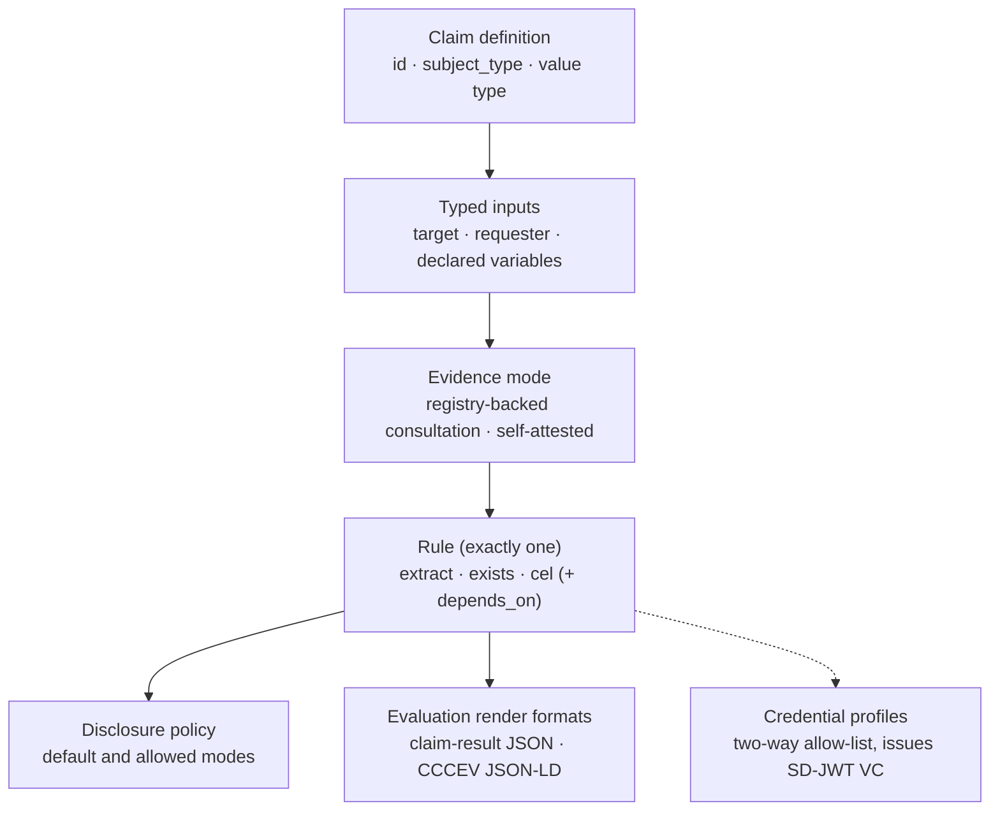

This document defines the target data model of a Registry Notary claim definition: the configuration artifact that declares what Notary can evaluate, whether evidence is registry-backed or self-attested, what typed inputs and Relay consultations it may use, what it discloses, and what it can issue. It is the structural counterpart to the [Registry Notary protocol](../rs-pr-notary/).

Where this document and [RS-PR-NOTARY](../rs-pr-notary/) state the same constraint, RS-PR-NOTARY is the protocol-level (wire) form and this document is the data-model form. Both refine the Registry Notary component of [RS-ARC-G](../rs-arc-g/) Section 3 (REQ-ARC-G-007) one level of detail down, from architectural boundary to the structure a claim takes in configuration. Security-model concerns (the scope and authentication machinery a claim relies on) belong to [RS-SEC-G](../rs-sec-g/); this document refers to them only where they shape the model.

The key words in this document are interpreted per [RS-DOC](../rs-doc/) Section 2. Defined terms are used per [RS-TERMS](../rs-terms/).

## Version history

| Version | Date | Status | Change |
| --- | --- | --- | --- |
| 0.1.0 | 2026-06-13 | draft | Initial claim-definition data model, distilled from the Registry Notary source-and-claim modeling guide, the operator configuration reference, and the two-way credential-eligibility and matching-policy validations the configuration loader enforces. |
| 0.2.0 | 2026-07-07 | draft | Reworded REQ-DM-CLAIM-005 so the controlled-environment restriction on disabling matching-failure collapse reads as operational guidance rather than a runtime-enforced constraint, and documented the extract/exists value-type-checking gap and the empty-`formats`-list evaluation gap in Limitations. |
| 0.3.0 | 2026-07-13 | draft | Replaced direct source bindings and Notary matching with registry-backed Relay consultations and self-attested evidence modes. |
| 0.3.1 | 2026-07-14 | draft | Updated load-time validation limits after duplicate ids, disclosure defaults, evidence-mode rules, and registry-backed output types became startup checks. |

## 1. Scope and references

This specification covers the structure and invariants of a claim definition:

- The claim's identity and the value it evaluates.
- Inputs: the request lookup paths a claim consumes.
- Evidence mode and compiler-pinned Relay consultation bindings for registry-backed claims.
- The rule and its dependencies.
- The disclosure policy.
- Response formats and value typing.
- Credential eligibility.
- Batch behavior.

This specification does not define:

- The exact configuration schema: Every field, its YAML key, and its default belong to the [Registry Notary operator configuration reference](../../products/registry-notary/operator-config-reference/) and to the generated OpenAPI document rendered as the [Registry Notary API reference](../../reference/apis/registry-notary/). This document states the model's structure and the invariants a deployment enforces, and does not restate field schemas that would drift from the source.
- Protocol and wire behavior: How a caller submits an evaluation, negotiates a format, or receives an error belongs to [RS-PR-NOTARY](../rs-pr-notary/).
- The security model: How scopes, authentication, workload credentials, and key material are configured and enforced belongs to [RS-SEC-G](../rs-sec-g/).
- The other data models of the stack: The Registry Relay dataset surface and the portable metadata manifest are separate data models, reserved for their own RS-DM-\* specifications.

For the authoring guidance behind this model, see [Author an HTTP Registry Stack project](../../tutorials/author-registry-project/). For the worked claim pipeline, see [Evidence issuance, end to end](../../explanation/evidence-issuance/).

## 2. Anatomy of a claim definition

A claim definition is a named capability. It declares an identity, one evidence mode, the typed inputs and Relay consultations it may use, the single rule that decides its value, and the disclosure, format, and credential rules that shape what leaves the service.

The diagram restates the model: a claim receives either compiler-pinned Relay outputs or permitted self-attestation inputs, a single rule decides the value, and the disclosure policy, formats, and credential profiles govern the result. A claim definition describes one decision or one extracted value; a claim that tries to return a whole record over-collects and is hard to authorize.

REQ-DM-CLAIM-001: A claim definition MUST carry a stable identifier (`id`); the `id` is the reference callers use to evaluate the claim and the reference a credential profile uses to name it. The `id` SHOULD be stable, specific, and unique across the configuration.

## 3. Inputs and evidence modes

A claim's inputs are the named request paths it may consume, drawn from the target subject, requester, and declared variables. A claim selects one evidence mode. `registry_backed` binds compiler-pinned Relay consultations whose typed outputs feed the rule. `self_attested` uses only the configured authenticated context and request inputs. Notary has no direct registry source mode.

REQ-DM-CLAIM-002: Each claim MUST declare exactly one evidence mode. A registry-backed claim MUST bind every Relay consultation by profile id and contract hash and MUST map only declared typed request inputs. A self-attested claim MUST NOT declare a Relay consultation. Registry Notary MUST enforce the claim's required scopes before either mode performs work.

REQ-DM-CLAIM-003: A registry-backed claim SHOULD bind only the Relay outputs its rule needs. Consultation input mapping MUST NOT select a Relay origin, credential, method, capability, output projection, or response mapper. Request paths outside the closed mapping MUST be rejected.

## 4. Relay consultation contract

A Registry Stack project compiles subject selection, cardinality, source adaptation, and output minimization into Relay. Notary sees only the consultation inputs and typed output contract.

REQ-DM-CLAIM-004: A registry-backed claim MUST require the request purpose, Relay profile id, contract hash, input map, and output contract to match the compiled consultation before Relay work. A mismatch MUST fail closed and MUST NOT fall back to another profile or evidence mode.

REQ-DM-CLAIM-005: Relay no-match, ambiguity, contract, and source failures MUST map into the configured Notary public error posture without exposing raw source rows or unreviewed source diagnostics. Delegated proof failures MUST use the stable delegated denial codes defined by RS-PR-NOTARY.

## 5. Rule and dependencies

The rule is the single decision at the center of a claim. Registry Notary implements three rule kinds: `exists` (the presence represented by a consultation result), `extract` (a typed value from a consultation output), and `cel` (a value derived from closed evidence inputs or earlier claim results through a hardened expression).

REQ-DM-CLAIM-006: A claim definition MUST declare exactly one rule, and that rule MUST be one of the implemented kinds `extract`, `exists`, or `cel`. The `plugin` rule kind is declared in configuration but unimplemented; a conforming claim MUST NOT depend on it. This is the data-model form of REQ-PR-NOTARY-007.

REQ-DM-CLAIM-007: A `cel` rule MAY reuse earlier claim results through `depends_on`. Every `depends_on` entry MUST name a claim defined in the same configuration, and the dependency graph MUST be acyclic; a deployment MUST reject a configuration whose `depends_on` names an unknown claim or forms a cycle.

## 6. Disclosure policy

A claim's disclosure policy is a `default` mode and an `allowed` set drawn from the three disclosure profile modes defined in [RS-TERMS](../rs-terms/) Section 2: `value` (the full value), `predicate` (only the true/false satisfaction), and `redacted` (the value fully hidden).

REQ-DM-CLAIM-008: Registry Notary MUST apply a claim's `default` disclosure mode when the caller requests none, and MUST refuse a mode that is not in the claim's `allowed` set. This is the data-model form of REQ-PR-NOTARY-009. A claim's `default` SHOULD be a member of its `allowed` set, and a privacy-sensitive claim SHOULD default to the least-revealing useful mode.

## 7. Response formats and value typing

A claim's `formats` list declares the response formats it can render, and its value descriptor declares the type the evaluated value takes.

REQ-DM-CLAIM-009: A claim MUST be renderable as the claim-result JSON media type, and MAY additionally declare CCCEV-shaped JSON-LD in its `formats` (the data-model form of REQ-PR-NOTARY-011). SD-JWT VC issuance is governed by credential profiles, not by the evaluation render `formats` list. A claim declares the type its evaluated value takes; where that type is one Registry Notary recognizes, the evaluated value MUST conform to it or the evaluation is refused rather than returned.

## 8. Credential eligibility

A claim is not issuable as a credential by default. Issuance is gated by a two-way allow-list between the claim and a credential profile, so neither a claim nor a profile can issue a credential the other was not designed for.

REQ-DM-CLAIM-010: A credential MUST be issuable from a claim only when both sides agree: the claim lists the credential profile in its `credential_profiles`, and the profile lists the claim in its `allowed_claims`. A profile's `allowed_claims` MUST NOT be empty. The issued credential is an SD-JWT VC bound to its holder by `did:jwk`, per REQ-PR-NOTARY-013 and REQ-PR-NOTARY-015.

## 9. Batch behavior

Batch evaluation lets one request evaluate claims for several subjects. It is an outer Notary API envelope, not a second evidence model: it adds no authorization, disclosure, consultation, or issuance behavior of its own.

REQ-DM-CLAIM-011: Batch evaluation MUST be semantically equivalent to evaluating each item independently. Registry-backed batches MUST validate the complete outer request before the first Relay call, require idempotency where the API contract specifies it, preserve item order, and MUST NOT coalesce duplicate subjects across item positions or bypass single-evaluation authorization and disclosure.

## 10. Limitations

These constraints are stated so a reader does not infer a capability from a declared but unusable
shape.

- Plugin rule: The enum is declared, but configuration validation rejects it for both
  registry-backed and self-attested evidence modes (REQ-DM-CLAIM-006).
- Empty formats list: A claim definition whose `formats` list is empty (the default) can never be evaluated, because format checking rejects any format not listed, including the default-requested claim-result JSON format (REQ-DM-CLAIM-009). This is not rejected at configuration load. Tracked in [GH#170](https://github.com/registrystack/registry-stack/issues/170).

## Conformance

A claim definition, and the Registry Notary deployment that serves it, conforms to the target model in this specification when it:

- carries a stable identifier by which it is evaluated and named (REQ-DM-CLAIM-001);
- declares exactly one evidence mode, pins every registry-backed Relay consultation, enforces caller scopes before work, and rejects inputs outside the closed mapping (REQ-DM-CLAIM-002, REQ-DM-CLAIM-003);
- verifies the complete Relay consultation contract before work and preserves the configured public error posture without source leakage (REQ-DM-CLAIM-004, REQ-DM-CLAIM-005);
- declares exactly one rule of an implemented kind and never depends on the unimplemented plugin kind (REQ-DM-CLAIM-006);
- keeps `depends_on` references resolvable and acyclic (REQ-DM-CLAIM-007);
- applies the default disclosure mode and refuses modes outside the allowed set (REQ-DM-CLAIM-008);
- renders the claim-result format and produces a value matching its declared type
  (REQ-DM-CLAIM-009);
- issues a credential only under the two-way claim-and-profile allow-list (REQ-DM-CLAIM-010);
- treats batch evaluation as equivalent to repeated single evaluation and never as a way around per-evaluation rules (REQ-DM-CLAIM-011).

Conformance to this specification does not imply conformance to any external standard cited in the `standards_referenced` frontmatter field. Each standard's adoption mode and scope are documented in the [standards register](../../reference/standards/).

## Evidence

This specification is `partial`: most requirements describe shipped behavior a reader can inspect, per RS-DOC REQ-DOC-014, but Section 10 records two target-model gaps that keep REQ-DM-CLAIM-009 from being fully verified today.

- [Registry Stack project authoring](../../tutorials/author-registry-project/) walks the authored claim, Relay consultation, disclosure, fixture, review, and unsigned-build workflow.
- The [Registry Notary operator configuration reference](../../products/registry-notary/operator-config-reference/) lists the claim, Relay, self-attestation, and credential-profile fields.
- [RS-PR-NOTARY](../rs-pr-notary/) carries the protocol-level form of the scope, rule, disclosure, format, and credential requirements this document gives a data-model form (REQ-PR-NOTARY-004/006/007/009/011/013/015).
- [RS-ARC-G](../rs-arc-g/) Section 3 holds the Registry Notary component invariant (REQ-ARC-G-007) that both this document and RS-PR-NOTARY refine.
- The [standards register](../../reference/standards/) records the adoption mode for SD-JWT VC and the W3C DID method named in `standards_referenced`.
- [GH#170](https://github.com/registrystack/registry-stack/issues/170) and [GH#232](https://github.com/registrystack/registry-stack/issues/232) track the empty-`formats` evaluation gap and the non-CEL value-type conformance gap called out in Section 10.

## Next

- [RS-PR-NOTARY](../rs-pr-notary/) is the protocol contract that operates on this data model.
- [RS-ARC-G](../rs-arc-g/) places Registry Notary and its claim model in the registry stack architecture.
- [RS-SEC-G](../rs-sec-g/) holds the security model the scope and credential rules here rely on.
- [RS-TERMS](../rs-terms/) defines the claim and credential vocabulary used here.
- [Evidence issuance, end to end](../../explanation/evidence-issuance/) is the narrative walk-through of a claim from request to credential.
