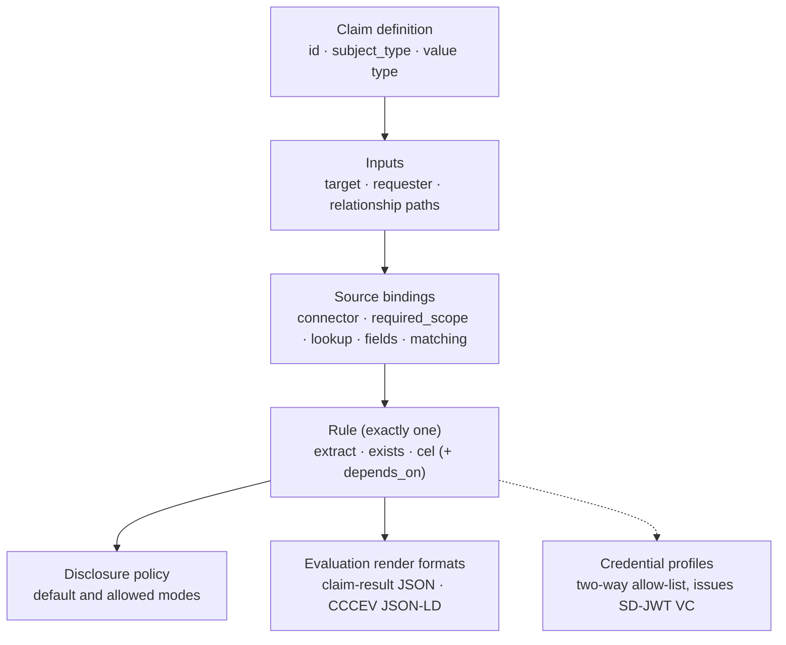

This document defines the target data model of a Registry Notary claim definition: the configuration artifact that declares what Notary can evaluate, what it reads to evaluate it, what it discloses, and what it can issue. It is the structural counterpart to the [Registry Notary protocol](../rs-pr-notary/): it closes the claim-definition carve-out that specification makes in its Section 1, where the model's source bindings, rule, disclosure policy, and formats are deferred here. The Evidence section distinguishes shipped behavior from the implementation gaps tracked in Section 10.

Where this document and [RS-PR-NOTARY](../rs-pr-notary/) state the same constraint, RS-PR-NOTARY is the protocol-level (wire) form and this document is the data-model form. Both refine the Registry Notary component of [RS-ARC-G](../rs-arc-g/) Section 3 (REQ-ARC-G-007) one level of detail down, from architectural boundary to the structure a claim takes in configuration. Security-model concerns (the scope and authentication machinery a claim relies on) belong to [RS-SEC-G](../rs-sec-g/); this document refers to them only where they shape the model.

The key words in this document are interpreted per [RS-DOC](../rs-doc/) Section 2. Defined terms are used per [RS-TERMS](../rs-terms/).

## Version history

| Version | Date | Status | Change |
| --- | --- | --- | --- |
| 0.1.0 | 2026-06-13 | draft | Initial claim-definition data model, distilled from the Registry Notary source-and-claim modeling guide, the operator configuration reference, and the two-way credential-eligibility and matching-policy validations the configuration loader enforces. |
| 0.2.0 | 2026-07-07 | draft | Reworded REQ-DM-CLAIM-005 so the controlled-environment restriction on disabling matching-failure collapse reads as operational guidance rather than a runtime-enforced constraint, and documented the extract/exists value-type-checking gap and the empty-`formats`-list evaluation gap in Limitations. |

## 1. Scope and references

This specification covers the structure and invariants of a claim definition:

- The claim's identity and the value it evaluates.
- Inputs: the request lookup paths a claim consumes.
- Source bindings: how a claim reaches its source data, and the matching policy that gates a read.
- The rule and its dependencies.
- The disclosure policy.
- Response formats and value typing.
- Credential eligibility.
- Batch behavior.

This specification does not define:

- **The exact configuration schema.** Every field, its YAML key, and its default belong to the [Registry Notary operator configuration reference](../../products/registry-notary/operator-config-reference/) and to the generated OpenAPI document rendered as the [Registry Notary API reference](../../reference/apis/registry-notary/). This document states the model's structure and the invariants a deployment enforces, and does not restate field schemas that would drift from the source.
- **Protocol and wire behavior.** How a caller submits an evaluation, negotiates a format, or receives an error belongs to [RS-PR-NOTARY](../rs-pr-notary/).
- **The security model.** How scopes, authentication, and key material are configured and enforced belongs to [RS-SEC-G](../rs-sec-g/). This document names a binding's required scope only as part of the model.
- **The other data models of the stack.** The Registry Relay dataset surface and the portable metadata manifest are separate data models, reserved for their own RS-DM-\* specifications.

For the modeling guidance behind this model, see the [source and claim modeling guide](../../products/registry-notary/source-claim-modeling-guide/); for the matching outcome model, see [identity and record matching](../../products/registry-notary/identity-and-record-matching/); for the worked claim pipeline, see [Evidence issuance, end to end](../../explanation/evidence-issuance/).

## 2. Anatomy of a claim definition

A claim definition is a named capability. It declares an identity, the inputs and source bindings that read the data it needs, the single rule that decides its value, and the disclosure, format, and credential rules that shape what leaves the service.

The diagram restates the model: a claim reads its source data through bindings shaped by its inputs, a single rule decides the value, and the disclosure policy, formats, and credential profiles govern the result. A claim definition describes one decision or one extracted value; a claim that tries to return a whole record over-collects and is hard to authorize.

REQ-DM-CLAIM-001: A claim definition MUST carry a stable identifier (`id`); the `id` is the reference callers use to evaluate the claim and the reference a credential profile uses to name it. The `id` SHOULD be stable, specific, and unique across the configuration.

## 3. Inputs and source bindings

A claim's inputs are the named request lookup paths it may consume, drawn from the target subject, the requester, and the relationship between them (for example `target.id`, `target.attributes.<name>`, `requester.identifiers.<scheme>`, `relationship.attributes.<name>`). A source binding connects the claim to one source read: it names the connector and connection, the lookup that resolves the subject to a source record, the fields the rule needs, and the scope the read requires.

REQ-DM-CLAIM-002: Each source binding declares the source read that backs a claim and the caller scope that read requires (its `required_scope`, or the dataset scope Registry Notary synthesizes when none is set). Registry Notary MUST enforce that scope before the binding reads its source. This is the data-model form of REQ-PR-NOTARY-004; the connector kinds a binding may use are fixed by REQ-PR-NOTARY-006.

REQ-DM-CLAIM-003: A source binding SHOULD read only the fields its rule needs. Where a binding declares an input allow-list (`allowed_target_inputs` or `allowed_requester_inputs`), a request that supplies an input path outside that allow-list MUST be rejected, so a binding cannot over-collect by accident.

## 4. Matching policy

A source binding MAY carry a matching policy that gates and shapes how a request is resolved to a source record before the read runs. The policy binds the read to a declared purpose and relationship context and constrains which inputs identify the subject. With no matching policy, a binding falls back to unrestricted, identifier-only resolution (Section 9).

REQ-DM-CLAIM-004: Where a source binding declares a matching policy, Registry Notary MUST enforce the policy's purpose, relationship, and sufficient-input constraints before it reads the source: a request whose purpose, relationship, or supplied inputs the policy does not admit MUST be refused before source access.

REQ-DM-CLAIM-005: By default, a matching failure MUST collapse to a single public reason (`evidence.not_available`), with the granular reason retained only in the audit record, so the matching surface cannot be used as an existence oracle. A deployment MAY disable this collapse. Operators are expected to disable it only in a controlled environment where exposing not-found, ambiguous, and rejected outcomes to the caller is acceptable; that restriction is operational guidance, and Registry Notary enforces no runtime gate that confines the setting to such an environment.

## 5. Rule and dependencies

The rule is the single decision at the center of a claim. Registry Notary implements three rule kinds: `exists` (the presence of exactly one source record), `extract` (a value read from a source field), and `cel` (a value derived from source fields or earlier claim results through a hardened expression).

REQ-DM-CLAIM-006: A claim definition MUST declare exactly one rule, and that rule MUST be one of the implemented kinds `extract`, `exists`, or `cel`. The `plugin` rule kind is declared in configuration but unimplemented; a conforming claim MUST NOT depend on it. This is the data-model form of REQ-PR-NOTARY-007.

REQ-DM-CLAIM-007: A `cel` rule MAY reuse earlier claim results through `depends_on`. Every `depends_on` entry MUST name a claim defined in the same configuration, and the dependency graph MUST be acyclic; a deployment MUST reject a configuration whose `depends_on` names an unknown claim or forms a cycle.

## 6. Disclosure policy

A claim's disclosure policy is a `default` mode and an `allowed` set drawn from the three disclosure profile modes defined in [RS-TERMS](../rs-terms/) Section 2: `value` (the full value), `predicate` (only the true/false satisfaction), and `redacted` (the value fully hidden).

REQ-DM-CLAIM-008: Registry Notary MUST apply a claim's `default` disclosure mode when the caller requests none, and MUST refuse a mode that is not in the claim's `allowed` set. This is the data-model form of REQ-PR-NOTARY-009. A claim's `default` SHOULD be a member of its `allowed` set, and a privacy-sensitive claim SHOULD default to the least-revealing useful mode.

## 7. Response formats and value typing

A claim's `formats` list declares the response formats it can render, and its value descriptor declares the type the evaluated value takes.

REQ-DM-CLAIM-009: A claim MUST be renderable as the claim-result JSON media type, and MAY additionally declare CCCEV-shaped JSON-LD in its `formats` (the data-model form of REQ-PR-NOTARY-011). SD-JWT VC issuance is governed by credential profiles, not by the evaluation render `formats` list. A claim declares the type its evaluated value takes; where that type is one Registry Notary recognizes, the evaluated value MUST conform to it or the evaluation is refused rather than returned.

## 8. Credential eligibility

A claim is not issuable as a credential by default. Issuance is gated by a two-way allow-list between the claim and a credential profile, so neither a claim nor a profile can issue a credential the other was not designed for.

REQ-DM-CLAIM-010: A credential MUST be issuable from a claim only when both sides agree: the claim lists the credential profile in its `credential_profiles`, and the profile lists the claim in its `allowed_claims`. A profile's `allowed_claims` MUST NOT be empty. The issued credential is an SD-JWT VC bound to its holder by `did:jwk`, per REQ-PR-NOTARY-013 and REQ-PR-NOTARY-015.

## 9. Batch behavior

Batch evaluation lets one request evaluate a claim for many subjects. It is a source-read optimization, not a second model: it adds no authorization, disclosure, matching, or issuance behavior of its own.

REQ-DM-CLAIM-011: Batch evaluation MUST be semantically equivalent to evaluating the same claim for each subject individually. A claim's configured batch cap bounds the number of subjects one request may carry, and a deployment MUST NOT use batch evaluation to bypass the authorization, matching, or disclosure rules that apply to a single evaluation.

## 10. Limitations

These constraints are stated so a reader does not infer an invariant the reviewed implementation does not enforce at configuration load.

- **Plugin rule.** Declared in configuration, unimplemented; an evaluation that reaches a `plugin` rule is refused at evaluation time, not at configuration load (REQ-DM-CLAIM-006).
- **Identifier uniqueness.** The configuration loader does not reject two claims that share an `id`; uniqueness is an operator responsibility (REQ-DM-CLAIM-001).
- **Disclosure default.** The loader does not verify that `default` is a member of `allowed`; a `default` outside `allowed` surfaces as a request error when the result is rendered, not as a startup failure (REQ-DM-CLAIM-008).
- **Rule source reference.** The loader does not verify that a rule's `source` names a declared source binding; a dangling reference surfaces when the source is read at evaluation, not at configuration load (REQ-DM-CLAIM-006).
- **Matching fallback.** A source binding with no matching policy resolves on identifiers alone, with no purpose, relationship, or input-minimization gating (Section 4).
- Value-type conformance: Registry Notary checks that an evaluated value conforms to its declared `value.type` only for a `cel` rule; the `extract` and `exists` rule paths return their result without checking it against `value.type` (REQ-DM-CLAIM-009). Tracked in [GH#232](https://github.com/registrystack/registry-stack/issues/232).
- Empty formats list: A claim definition whose `formats` list is empty (the default) can never be evaluated, because format checking rejects any format not listed, including the default-requested claim-result JSON format (REQ-DM-CLAIM-009). This is not rejected at configuration load. Tracked in [GH#170](https://github.com/registrystack/registry-stack/issues/170).

## Conformance

A claim definition, and the Registry Notary deployment that serves it, conforms to the target model in this specification when it:

- carries a stable identifier by which it is evaluated and named (REQ-DM-CLAIM-001);
- binds each source read to the caller scope it requires, enforced before the read, and rejects inputs outside a declared allow-list (REQ-DM-CLAIM-002, REQ-DM-CLAIM-003);
- enforces a declared matching policy before reading, and collapses matching failures to a single public reason by default (REQ-DM-CLAIM-004, REQ-DM-CLAIM-005);
- declares exactly one rule of an implemented kind and never depends on the unimplemented plugin kind (REQ-DM-CLAIM-006);
- keeps `depends_on` references resolvable and acyclic (REQ-DM-CLAIM-007);
- applies the default disclosure mode and refuses modes outside the allowed set (REQ-DM-CLAIM-008);
- renders the claim-result format and produces a value matching its declared type after the gaps in Section 10 are closed (REQ-DM-CLAIM-009);
- issues a credential only under the two-way claim-and-profile allow-list (REQ-DM-CLAIM-010);
- treats batch evaluation as equivalent to repeated single evaluation and never as a way around per-evaluation rules (REQ-DM-CLAIM-011).

Conformance to this specification does not imply conformance to any external standard cited in the `standards_referenced` frontmatter field. Each standard's adoption mode and scope are documented in the [standards register](../../reference/standards/).

## Evidence

This specification is `partial`: most requirements describe shipped behavior a reader can inspect, per RS-DOC REQ-DOC-014, but Section 10 records two target-model gaps that keep REQ-DM-CLAIM-009 from being fully verified today.

- The [source and claim modeling guide](../../products/registry-notary/source-claim-modeling-guide/) walks the claim structure, the three rule kinds, source bindings, the disclosure policy, the two-way credential eligibility, and batch behavior that Sections 2 through 9 make precise.
- The [Registry Notary operator configuration reference](../../products/registry-notary/operator-config-reference/) lists the claim, matching-policy, and credential-profile fields and the loader validations they carry (non-empty matching labels and lists, the rejected empty `allowed_claims`, the input allow-list minimization) that Sections 3, 4, and 8 state normatively.
- [Identity and record matching](../../products/registry-notary/identity-and-record-matching/) is the outcome model behind the matching policy in Section 4.
- [RS-PR-NOTARY](../rs-pr-notary/) carries the protocol-level form of the scope, rule, disclosure, format, and credential requirements this document gives a data-model form (REQ-PR-NOTARY-004/006/007/009/011/013/015).
- [RS-ARC-G](../rs-arc-g/) Section 3 holds the Registry Notary component invariant (REQ-ARC-G-007) that both this document and RS-PR-NOTARY refine.
- The [standards register](../../reference/standards/) records the adoption mode for SD-JWT VC, the W3C DID method, and SP DCI named in `standards_referenced`.
- [GH#170](https://github.com/registrystack/registry-stack/issues/170) and [GH#232](https://github.com/registrystack/registry-stack/issues/232) track the empty-`formats` evaluation gap and the non-CEL value-type conformance gap called out in Section 10.

## Next

- [RS-PR-NOTARY](../rs-pr-notary/) is the protocol contract that operates on this data model.
- [RS-ARC-G](../rs-arc-g/) places Registry Notary and its claim model in the registry stack architecture.
- [RS-SEC-G](../rs-sec-g/) holds the security model the scope and credential rules here rely on.
- [RS-TERMS](../rs-terms/) defines the claim and credential vocabulary used here.
- [Evidence issuance, end to end](../../explanation/evidence-issuance/) is the narrative walk-through of a claim from request to credential.
