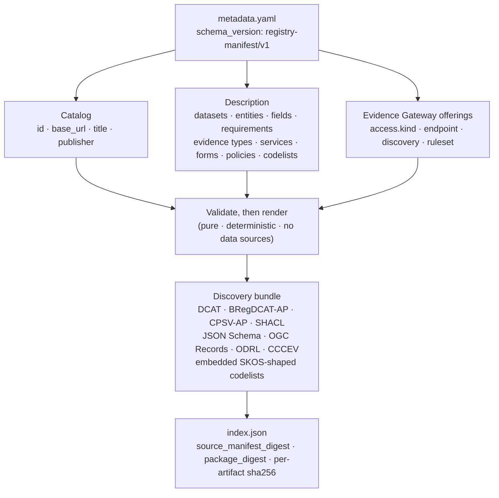

This document defines the data model of the Registry Manifest portable metadata manifest: the `metadata.yaml` document (schema version `registry-manifest/v1`) that describes a registry's catalog, datasets, services, requirements, evidence, and policies, and from which Registry Manifest renders a static, standards-shaped discovery bundle.

The manifest format is owned by Registry Manifest, a pure library and command-line interface with no runtime data dependencies. It configures no runtime service. A manifest is a description an institution publishes for readers, crawlers, and integrators; it is not an input a Registry Stack runtime loads, and no maintained runtime in the stack reads one. This document and [RS-ARC-G](../rs-arc-g/) state that boundary at different altitudes: RS-ARC-G fixes it as an architectural invariant (REQ-ARC-G-001, REQ-ARC-G-002), and this document refines the Registry Manifest component of RS-ARC-G Section 3 one level down, into the structure the manifest takes and the invariants its validator enforces at load. This document is the data-model form of the portable metadata layer.

The key words in this document are interpreted per [RS-DOC](../rs-doc/) Section 2. Defined terms are used per [RS-TERMS](../rs-terms/).

## Version history

| Version | Date | Status | Change |
| --- | --- | --- | --- |
| 0.1.0 | 2026-06-13 | draft | Initial portable metadata data model, distilled from the Registry Manifest overview, the validate-and-render guide, and the reference, and graded against the schema types and the load-time validator the Registry Manifest core enforces. |
| 0.2.0 | 2026-06-20 | draft | Added governed evidence gateway metadata, policy id/hash binding, ODRL enforcement profile validation, and the runtime PDP boundary. |
| 0.2.1 | 2026-06-21 | draft | Clarified federation discovery trust boundaries, manifest validation limits, and static publication provenance. |
| 0.3.1 | 2026-08-04 | draft | Recorded that Registry Notary is retired: Section 7 and REQ-DM-MANIFEST-010 now state that the `registry-notary` access kind and its federation vocabulary are validated published surface with no maintained runtime behind them, and the retired product's claim data model is no longer cross-referenced. No validator behavior changed. |
| 0.3.0 | 2026-07-07 | draft | Corrected REQ-DM-MANIFEST-007 to require a unique `(id, version)` pair rather than independently unique `id` and `version` values, corrected the REQ-DM-MANIFEST-002 runtime-only-key example, renamed the static discovery bundle consistently, and rewrote REQ-DM-MANIFEST-013 from the additive-evolution rule to strict unknown-key rejection at parse time (issue #249, issue #285). |
| 0.4.0 | 2026-08-04 | draft | Removed the `federation` block and the `registry-notary` access kind from the manifest schema and rewrote REQ-DM-MANIFEST-010 around the `registry-evidence` access kind. The `access.kind` vocabulary is now open: any other kind is left to the consuming runtime. The `registry-manifest/v1` schema version is unchanged; a manifest carrying the removed block is rejected at parse time by REQ-DM-MANIFEST-013. |
| 0.5.0 | 2026-08-09 | draft | Revised REQ-DM-MANIFEST-013 to permit a pre-1.0 stack minor release to retain `registry-manifest/v1` for a breaking change only when the Registry Manifest changelog marks it `BREAKING:`, provides concrete migration steps, and this history records the specification change. Stable releases still require a new schema version. |
| 0.6.0 | 2026-08-11 | draft | Removed the retired Relay policy-decision-point coupling. The Relay runtime that read a manifest and enforced its governed evidence policy is retired, and the current Relay compiles and seals its own governed contract with no manifest dependency. Section 6 and REQ-DM-MANIFEST-007 through REQ-DM-MANIFEST-009 now state governed evidence pack metadata as validated published surface with no maintained runtime behind it, and the `registry-evidence-gateway-pdp/v1` identifier is recorded as a retained legacy name. Cross-references to the retired REQ-PR-RELAY-011 and REQ-ARC-G-006 and REQ-ARC-G-009 are replaced. No validator behavior changed. |

## 1. Scope and references

This specification covers the structure and invariants of a portable metadata manifest:

- The manifest's identity and schema version.
- Portability: the runtime-binding boundary that keeps the manifest deployment-independent.
- The catalog and the top-level collections that describe a registry.
- Reference integrity and identifier and vocabulary constraints.
- Requirements and grouped evidence.
- Governed evidence pack metadata.
- Evidence-offering access discovery metadata.
- The standards-shaped render set and the static discovery bundle.
- Compatibility and evolution.

This specification does not define:

- **The exact manifest schema.** Every key, its type, and its default belong to the [Registry Manifest reference](../../products/registry-manifest/reference/), and the rendered artifacts are themselves the authoritative schema documents Registry Manifest emits. This document states the model's structure and the invariants the validator enforces, and does not restate field schemas that would drift from the source.
- **Runtime serving and scoping.** No maintained Registry Stack runtime consumes a manifest. Relay compiles and seals its own governed contract, described by [RS-PR-RELAY](../rs-pr-relay/), and reads no portable description at startup or at request time. A manifest and a Relay contract can describe the same registry, and nothing in the stack derives one from the other.
- **Assertion evaluation.** How a runtime evaluates a question about a subject and returns a signed, minimum-disclosure answer belongs to [RS-PR-EVIDENCE](../rs-pr-evidence/). The manifest describes a source portably; it does not define an assertion, a requirement, or how one is evaluated.

For the narrative two-layer pipeline, see the [architecture overview](../../explanation/architecture/); for the authoring and command surface, see the [Registry Manifest overview](../../products/registry-manifest/) and the [validate and render guide](../../products/registry-manifest/validate-and-render/).

## 2. Anatomy of a metadata manifest

A metadata manifest is a single portable document. It declares a schema version, a catalog that identifies the publisher, the collections that describe a registry, and, optionally, the evidence offerings that point at a service which answers evidence requests. Registry Manifest validates the document and renders it, as a pure function, into a static discovery bundle.

The diagram restates the model: one portable document is validated and rendered into a bundle of standards-shaped artifacts plus an index that digests them. The manifest is the single source; every artifact is derived from it and nothing in the bundle reaches back to a runtime service.

REQ-DM-MANIFEST-001: A metadata manifest MUST declare `schema_version: registry-manifest/v1`. A document whose schema version is absent or different MUST be rejected before any further validation or rendering.

## 3. Portability and the runtime-binding boundary

The manifest is portable: it carries the static description of a registry and nothing about a particular deployment. This boundary is what lets a manifest be authored, reviewed, hosted, and pinned without access to any production system, and what keeps Registry Manifest a pure library with no data dependencies (REQ-ARC-G-001).

REQ-DM-MANIFEST-002: A metadata manifest MUST be runtime-independent: it MUST NOT carry runtime bindings such as source paths, table identifiers, caller scopes, backend credentials, caller allow-lists, signing keys, replay stores, or token URLs. Registry Manifest MUST reject a manifest that contains any of the runtime-only keys it enumerates. This is the data-model form of REQ-ARC-G-002. Relay draws the same line inside its own contract set, keeping governed meaning and deployment binding in separate closed documents (REQ-PR-RELAY-104): a runtime binding belongs to the configuration of the process that opens the source, never to a portable description.

## 4. Catalog and top-level structure

A manifest's required core is its catalog; the rest of a manifest is the collections through which it describes a registry. RS-TERMS summarizes those collections as datasets, entities, fields, public services, forms, requirements, policies, and evidence offerings; the full top-level set the reference defines is broader, and this document names it so a reader does not infer the manifest stops at that summary.

REQ-DM-MANIFEST-003: A metadata manifest MUST declare a `catalog` carrying at least an identifier, a base URL, a title, and a publisher, each validated (an identifier matching the manifest identifier pattern, an HTTP or HTTPS base URL, a non-empty title, and a non-empty publisher name). Beyond the catalog, a manifest describes a registry through the top-level collections the reference defines: `vocabularies`, `profiles`, `requirements`, `evidence_types`, `authorities`, `public_services`, `data_services`, `forms`, `datasets` (each with its `entities`, `fields`, `relationships`, `policies`, and `evidence_offerings`), `codelists`, `evaluation_profiles`, and `ecosystem_bindings`. This document does not restate their field schemas; the [Registry Manifest reference](../../products/registry-manifest/reference/) is authoritative.

REQ-DM-MANIFEST-004: Within a manifest, every cross-reference between objects MUST resolve to a defined object of the expected kind: an evidence type to a requirement it proves, an evidence offering to an entity and that entity's fields, a public service to its authority and its referenced requirements, forms, and data services, a form to its service and channel, a field to a codelist, and a relationship to an entity in the same dataset. Registry Manifest MUST reject a manifest with a dangling or mistyped reference at load.

REQ-DM-MANIFEST-005: Object identifiers MUST match the manifest identifier pattern and MUST be unique within their defining scope, and a field constrained to a closed vocabulary, including sensitivity, access rights, update frequency, dataset status, field type, relationship cardinality, form fulfillment mode, and declared application profile, MUST take a value from that vocabulary. Registry Manifest MUST reject a manifest that violates an identifier or closed-vocabulary constraint.

## 5. Requirements and grouped evidence

A manifest can describe what a public service requires and what evidence satisfies it, using the Core Criterion and Core Evidence Vocabulary (CCCEV) shape. Grouped evidence is the load-bearing structure: it distinguishes evidence that is required together from evidence that is an alternative.

REQ-DM-MANIFEST-006: An evidence type MUST prove at least one requirement defined in the same manifest. Grouped evidence is explicit: all evidence types within one evidence-type-list group MUST be treated as required together, and multiple groups on the same requirement MUST be treated as alternatives. Registry Manifest MUST reject an evidence type that proves no requirement and an evidence-type-list entry that names an unknown evidence type or one that does not prove the owning requirement.

## 6. Governed evidence pack metadata

A manifest can publish governed evidence pack metadata inside an `ecosystem_bindings` entry: a policy identity and digest, the gates the arrangement claims, the outputs it allows, and the enforcement terms it names. Registry Manifest validates that metadata's shape and internal consistency, and nothing more.

This is published description, not enforcement, and no maintained Registry Stack runtime reads it. The gateway that once selected a policy decision point (PDP) from these fields is retired, and the current Relay runtime operates no policy decision point and has no dependency on Registry Manifest. The fields stay validated published surface so a manifest an institution already publishes keeps a stable, checkable meaning.

REQ-DM-MANIFEST-007: Where an `ecosystem_bindings` entry declares `type: governed-evidence`, it MUST carry `id` and `version` values whose `(id, version)` pair is unique among the manifest's ecosystem bindings, a non-empty `profile`, and `evidence_pack` metadata. The evidence pack MUST declare `pack_id`, `pack_version`, `source_basis`, `semantic_profile`, `evidence_envelope`, `required_gates`, `allowed_outputs`, `policy_id`, `policy_hash`, and `odrl_enforcement`. `source_basis`, `semantic_profile`, `evidence_envelope`, `source_mapping`, `policy`, fixtures, and synthetic data remain JSON metadata values where the manifest validates presence and object shape where implemented; this requirement MUST NOT be read as a fully typed evidence-pack metadata model.

REQ-DM-MANIFEST-008: A governed evidence pack MUST bind its policy reference to a policy identity and digest: `policy_id` MUST be non-empty, `policy_hash` MUST be a lowercase `sha256:` digest, and, when an inline `policy` object is present, Registry Manifest MUST verify `policy_hash` against the canonical JSON form of that inline policy. `required_gates` MUST include the gates Registry Manifest requires for governed evidence, including purpose, source freshness, source binding, route scope, requester and subject identity, assurance, legal basis, consent, jurisdiction, requested disclosure, credential format, authority basis, and subject relationship. `allowed_outputs` MUST include `minimized_json`. Registry Manifest checks that these declarations are present, well-formed, and mutually consistent; it does not evaluate a gate, and neither does any maintained runtime.

REQ-DM-MANIFEST-009: A governed evidence pack MUST declare `odrl_enforcement.profile: registry-evidence-gateway-pdp/v1`, and its `constraint_terms` MUST contain at least one unique term from the profile vocabulary: `odrl:purpose` and `odrl:spatial`. A term outside that vocabulary, a repeated term, and a different profile identifier MUST each be rejected. The wider manifest policy renderer MAY publish broader Open Digital Rights Language (ODRL) metadata, but a governed evidence pack MUST NOT name an enforcement term outside this profile vocabulary.

The profile identifier is a retained legacy name. It named the policy-decision-point profile of the retired Relay gateway, it has no connection to the Evidence Gateway product, and no maintained runtime evaluates it. Registry Manifest validates the name and the terms as published metadata, and a reader MUST NOT infer from either that a process enforces them.

## 7. Evidence-offering access discovery metadata

An evidence offering's `access` block says where an evidence request is answered and how a relying party verifies the answer. It is public discovery: it describes where a service is and what it evaluates, not who may call it.

The `access.kind` vocabulary is open. A manifest may name any access kind, and the runtime that consumes the manifest decides which kinds it can serve. Registry Manifest checks the endpoint shape of exactly one kind, `registry-evidence`, because that kind names a service whose shape this repository defines. For every other kind, `conforms_to` is validated as an ordinary optional URI and the rest of the `access` block is left to the consuming runtime.

REQ-DM-MANIFEST-010: Where an evidence offering declares `access.kind: registry-evidence`, the offering MUST declare a non-blank `access.conforms_to` naming the response profile the endpoint returns, an HTTPS `access.endpoint_url`, and an HTTPS `access.discovery_url`. Where `access.ruleset` is present and non-blank, it MUST name a declared evaluation profile ruleset. This metadata is public discovery only and MUST NOT be read as an access grant (REQ-ARC-G-010).

Registry Manifest does not pin `conforms_to` to a particular response-profile version. The portable metadata layer stays independent of any one product's contract version, so the value is checked for presence, not membership in a fixed set.

Access discovery metadata is also not a trust bootstrap by itself. A consumer that reads an `access` block from an external manifest validates the endpoint and discovery hosts against local trust policy before treating any key or endpoint as authoritative.

## 8. Rendered artifacts and standards

From a valid manifest, Registry Manifest renders a set of standards-shaped artifacts. The renderers are the reason the manifest exists: one authored document becomes the catalog, schema, policy, and service descriptions other systems already know how to read.

REQ-DM-MANIFEST-011: Registry Manifest MUST render its discovery artifacts as a pure, deterministic function of the manifest, with no network access and no data-source access (the data-model form of REQ-ARC-G-001). The rendered set is standards-shaped: a catalog, Data Catalog Vocabulary (DCAT) and BRegDCAT-AP JSON-LD, Core Public Service Vocabulary Application Profile (CPSV-AP) JSON-LD, Shapes Constraint Language (SHACL) node shapes, JSON Schema (Draft 2020-12), Open Geospatial Consortium (OGC) API Records item collection, Open Digital Rights Language (ODRL) policies, CCCEV evidence metadata, and embedded SKOS-shaped codelist concept-scheme nodes inside linked-data outputs. Rendering an artifact in a standard's shape is not a claim of conformance to that standard's specification.

## 9. Discovery bundle and digests

The `publish` operation writes the rendered artifacts as a static bundle that can be hosted as files and pinned by digest, with no runtime service in the loop. The bundle describes itself through an index.

REQ-DM-MANIFEST-012: The `publish` operation MUST produce a self-describing static bundle whose `index.json` (schema version `registry-manifest-index/v1`) carries a canonical `source_manifest_digest` over the typed manifest (insensitive to YAML formatting, comments, and key order, but sensitive to semantic change), a `package_digest` over the published artifact inventory, and a per-artifact `sha256` for every published artifact, including the OGC Records item collection. The digests MUST let a reader pin and compare a bundle without running Registry Relay or any other runtime service.

The digest inventory describes the bundle that was published, not the history of the output directory. Release publication workflows use an empty output directory or remove prior generated files before publishing, so the package digest cannot accidentally bless stale local files that happened to be present beside the newly rendered artifacts.

## 10. Compatibility and evolution

The manifest and its generated formats carry a versioned compatibility promise: a schema version names the exact field set a reader accepts, and the schema evolves through Registry Manifest releases, not through keys an individual producer adds on its own.

REQ-DM-MANIFEST-013: The `registry-manifest/v1` manifest and its generated `*/v1` formats MUST reject a key that is not modeled at its nesting depth, at parse time, and MUST name the offending key by its dotted field path in the resulting error. A reader MUST NOT silently drop or ignore a field it does not recognize. Extending the schema, including adding an optional field to an existing object, requires a Registry Manifest code change; a producer MUST NOT rely on an unmodeled key being tolerated. Fields modeled to carry arbitrary JSON, such as the governed evidence pack's `source_basis`, `semantic_profile`, and `evidence_envelope`, or an ecosystem binding's `vocabulary` and related envelope fields, remain the modeled surface for producer-specific content. Before Registry Stack v1.0.0, a breaking change MAY retain `registry-manifest/v1` only in a stack minor release whose Registry Manifest changelog marks the change `BREAKING:`, supplies concrete migration steps, and whose specification version history records the change. From Registry Stack v1.0.0, a breaking change, including removing or renaming a required field or changing the meaning or type of an existing field, MUST carry a new schema version.

## 11. Limitations

These constraints are stated so a reader does not infer an invariant the reviewed implementation does not enforce.

- **Runtime-binding exclusion is an enumerated list.** Registry Manifest rejects the runtime-only keys it enumerates, not every conceivable runtime key. This check and the general unknown-key rejection REQ-DM-MANIFEST-013 requires both operate over an intermediate JSON value, so a rejection error carries the offending key's dotted field path but not its YAML line or column (REQ-DM-MANIFEST-002).
- **Standards conformance is not validated.** The renderers emit standards-shaped artifacts but do not validate them against the external standard bodies. A rendered CPSV-AP, DCAT, or SHACL document is well-formed by construction, not certified against the standard (REQ-DM-MANIFEST-011).
- **URI checks are shallow.** A field required to be a URI is checked for an HTTP or HTTPS scheme or for the identifier pattern, not for full RFC 3987 IRI validity (REQ-DM-MANIFEST-004, REQ-DM-MANIFEST-005).
- **Access discovery metadata is not a trust anchor.** Registry Manifest validates required access fields and selected URL shapes, but a published manifest does not bind an external consumer to trust an endpoint, a discovery document, or an issuer identity. Host pinning and trust bootstrap belong to the consumer's local policy (REQ-DM-MANIFEST-010).
- **Library callers own untrusted-input resource limits.** The command-line path may impose its own input limits, but callers that embed Registry Manifest as a library and accept manifests from untrusted parties still need request size, nesting, collection-count, and time limits appropriate to their service boundary. Manifest validation is not a general resource sandbox.
- **The access checks are keyed to one access kind and validate shape, not reachability.** They apply only where the manifest declares `access.kind: registry-evidence`. A `conforms_to` value or a well-formed HTTPS URL alone must not be treated by consumers as proof that an endpoint is live, that it returns the named profile, or that the endpoint set is safe to trust. Manifest validation does not fetch either URL.
- **Publication provenance depends on a clean destination.** The `package_digest` pins the artifact inventory it sees. It is not proof that every file was created by the current publish invocation if the output directory already contained local files.
- **Governed evidence pack metadata remains partly opaque.** Governed evidence packs require key metadata and validate selected object shapes, supported gate names, supported output names, policy digest shape, inline-policy digest binding, and supported ODRL enforcement terms. The implementation still represents several fields as JSON values rather than a fully typed external evidence-pack schema, and validation proves only that the published description is well formed, never that anything enforces it (REQ-DM-MANIFEST-007 through REQ-DM-MANIFEST-009).
- **Profile fixtures are non-normative.** The example profiles shipped with Registry Manifest are illustrative until reviewed against official artifacts; they are not authoritative profiles for any named external system (see the [profile fixtures guide](../../products/registry-manifest/profile-fixtures/)).

## Conformance

A metadata manifest, and the Registry Manifest tooling that validates and renders it, conforms to this specification when it:

- declares the `registry-manifest/v1` schema version and is rejected if that version is absent or different (REQ-DM-MANIFEST-001);
- carries no runtime bindings, and rejects the runtime-only keys it enumerates (REQ-DM-MANIFEST-002);
- declares a validated catalog core and describes a registry only through the defined top-level collections (REQ-DM-MANIFEST-003);
- keeps every cross-reference resolvable and correctly typed, and rejects a dangling reference (REQ-DM-MANIFEST-004);
- keeps identifiers patterned and unique in scope and closed-vocabulary fields within their vocabulary (REQ-DM-MANIFEST-005);
- proves every evidence type against a requirement and treats grouped evidence as conjunction within a list and alternatives across lists (REQ-DM-MANIFEST-006);
- validates governed evidence pack metadata, policy id/hash binding, required gates and outputs, and supported ODRL enforcement terms as published description, without claiming a fully typed evidence-pack model or enforcement by any runtime (REQ-DM-MANIFEST-007 through REQ-DM-MANIFEST-009);
- advertises evidence-offering access metadata as discovery only, with the required response profile, HTTPS endpoint and discovery URLs, and ruleset binding for `registry-evidence` access, and never as an access grant (REQ-DM-MANIFEST-010);
- renders its artifacts as a pure, deterministic, standards-shaped set without asserting external-standard conformance (REQ-DM-MANIFEST-011);
- publishes a self-describing bundle digested for pinning and comparison without a runtime service (REQ-DM-MANIFEST-012);
- rejects an unmodeled key at parse time, naming its dotted field path, without relaxing other validation, and applies the pre-1.0 or stable-version rule to every breaking change (REQ-DM-MANIFEST-013).

Conformance to this specification does not imply conformance to any external standard cited in the `standards_referenced` frontmatter field. Each standard's adoption mode and scope are documented in the [standards register](../../reference/standards/).

## Evidence

This specification is `verified`: every requirement describes shipped behavior a reader can inspect, per RS-DOC REQ-DOC-014.

- The [Registry Manifest overview](../../products/registry-manifest/) describes the pure render pipeline, the multi-pass validator, the minimal manifest and its required core, grouped evidence, governed evidence ecosystem bindings, and the discovery-is-not-a-grant rule that Sections 2 through 8 make precise.
- The [Registry Manifest reference](../../products/registry-manifest/reference/) lists the top-level keys, the catalog core, the runtime-only key list, the render formats, the schema-version markers, the publish bundle layout, the digest fields, and the extension policy that Sections 3 through 11 state normatively.
- The [validate and render guide](../../products/registry-manifest/validate-and-render/) walks the validation checks, the render and publish commands, and the `index.json` digest fields behind Sections 8 and 9.
- [RS-PR-RELAY](../rs-pr-relay/) keeps the same governed-versus-deployment boundary inside Relay's own contract set (REQ-PR-RELAY-104), which is why a manifest and a Relay contract stay separate documents with separate owners.
- [RS-ARC-G](../rs-arc-g/) holds the architectural invariants this document refines: the metadata layer's purity (REQ-ARC-G-001), the runtime-binding exclusion (REQ-ARC-G-002), and description without authorization (REQ-ARC-G-010).
- The [standards register](../../reference/standards/) records the adoption mode for DCAT, BRegDCAT-AP, CPSV-AP, CCCEV, SHACL, JSON Schema, JSON-LD, ODRL, OGC API Records, and SKOS named in `standards_referenced`.

{/* Evidence: crates/registry-manifest-core/src/lib.rs holds RUNTIME_ONLY_KEYS and
    is_runtime_only_key(), the render entry points render_catalog() and render_shacl(), and
    source_manifest_digest(), which Sections 3, 4, 8, and 9 state normatively.
    tests/metadata_unknown_fields.rs pins that an unknown key is rejected at parse time rather than
    ignored (REQ-DM-MANIFEST-013). */}
{/* Evidence: crates/registry-manifest-cli/tests/cli.rs pins the validate and publish surfaces in
    validate_prints_source_digest_and_rejects_runtime_only_keys and
    publish_writes_stable_package_digest_and_artifact_digests (Sections 8 and 9). */}

{/* Evidence: crates/registry-manifest-core/src/lib.rs holds ODRL_ENFORCEMENT_PROFILE,
    SUPPORTED_ODRL_ENFORCEMENT_TERMS, SUPPORTED_EVIDENCE_PACK_OUTPUTS, and the governed-evidence
    validation Section 6 states. crates/registry-relay-v2 and crates/registry-relayctl declare no
    registry-manifest dependency, which is the retired coupling this revision removed. */}

## Next

- [RS-PR-RELAY](../rs-pr-relay/) is the protocol a Relay deployment serves from its own sealed contract, which a manifest may describe in portable form and never supplies.
- [RS-PR-EVIDENCE](../rs-pr-evidence/) is the protocol for evaluating a reviewed question about a subject over a source this model can describe.
- [RS-ARC-G](../rs-arc-g/) places Registry Manifest and the portable metadata layer in the registry stack architecture.
- [RS-TERMS](../rs-terms/) defines the metadata manifest, evidence, and policy vocabulary used here.
- [Architecture overview](../../explanation/architecture/) is the narrative data flow that places the portable metadata layer and the runtime services side by side.
