This document defines the HTTP protocol contract that Evidence Gateway exposes: how a caller authenticates,
discovers the request shapes it may invoke, submits one closed request against a predefined
requirement, and receives the smallest sufficient assertion in an authorized response format, plus
the problem, audit, and configuration-immutability behavior every request carries.
Evidence Gateway is a minimum-disclosure assertion service over data institutions already hold.
It returns the answer a requirement asks for, not the record behind it.

Every requirement statement in this document restates a frozen Version 1 contract that lives in the
repository, and names that contract file beside it.
The contract files are the source of truth; this document is their protocol-level reading.
Where a contract carries a numeric limit, a field name, or an enumerated value, this document points
at the file rather than copying the value, so the two cannot drift apart.

Evidence Gateway is a separate product from Registry Relay.
It is the Evidence Gateway counterpart to [RS-PR-RELAY](../rs-pr-relay/), and it is not a Registry Relay
mode, rewrite, or reduced configuration (`products/evidence/README.md`).

The key words in this document are interpreted per [RS-DOC](../rs-doc/) Section 2.
Defined terms are used per [RS-TERMS](../rs-terms/).

{/* RS-ARC-G 0.6.0 places Evidence Gateway in the architecture as its own component and states its
    boundary in REQ-ARC-G-007, REQ-ARC-G-014, and REQ-ARC-G-015. This document still does not claim
    to refine a numbered RS-ARC-G requirement; adding that mapping is a separate normative
    decision. */}

{/* TODO[evidence]: src/data/standards.yaml records sd-jwt-vc, cccev, openapi, and json-schema
    without listing registry-evidence under `used_by`. The register entries need an Evidence Gateway row
    before this page's standards claims are traceable from the register itself. */}

## Version history

| Version | Date | Status | Change |
| --- | --- | --- | --- |
| 0.1.0 | 2026-08-03 | draft | Initial profile derived from the frozen V1 contracts. |
| 0.2.0 | 2026-08-04 | draft | Registry Notary is retired. Removed the RS-PR-NOTARY relationship statements and the `registry-notary*` dependency prohibition, and recorded that RS-ARC-G 0.6.0 now places Evidence Gateway in the architecture. |
| 0.3.0 | 2026-08-05 | draft | Added the governed assurance-profile boundary, corrected the evaluation pipeline and three-format response surface, and specified bounded startup verification plus complete out-of-band verification for segmented audit history. |

## 1. Scope and references

This specification covers Evidence Gateway's externally observable protocol behavior:

- The service surface, the generated OpenAPI document, and requester-scoped definition discovery.
- Authentication of callers and the single authorization decision that gates a request.
- The governed assurance profile and its local-only authoring exceptions.
- The closed request contract and the request nonce.
- Evaluation, the four coequal acceptance definitions, and the output gate.
- Disclosure minimization, subject binding, and the combined-bundle disclosure surface.
- The three response formats: the signed JSON Web Signature (JWS) assertion, the separately typed
  unsigned envelope, and the SD-JWT VC (SD-JWT-based Verifiable Credentials) serialization of the
  same assertion.
- The problem contract, including existence collapse.
- The audit obligation and its two durable gates.
- The immutability of deployment input.

This specification does not define:

- Exact routes and schemas: The generated OpenAPI document,
  `products/evidence/generated/registry-evidence.openapi.json`, is the authoritative route and schema
  reference. This document states behavior a schema cannot, and does not restate request and response
  shapes that would drift from the generated source.
- Bundle authoring: How an operator declares requirements, selector profiles, authority profiles,
  sources, and scripts belongs to `products/evidence/contracts/bundle.schema.yaml` and the trusted
  request-adapter reference under `products/evidence/reference/request-adapter/`.
- Deployment duties: Supported deployment shape, secret and key custody, readiness, audit storage,
  and rotation belong to `products/evidence/OPERATOR-CONTRACT.md`.
- Verifier procedure: The relying-party policy document and the offline `evidence verify` command are
  specified by `products/evidence/contracts/verification-policy.schema.yaml`.

Evidence Gateway Version 1 has explicit non-goals, recorded in
`products/evidence/contracts/README.md` and `products/evidence/README.md`.
It stops before documents, credential issuance protocols and credential lifecycle, status lists and
revocation, OpenID for Verifiable Credential Issuance (OID4VCI) in any part, presentation-side
verification, replay or nonce state beyond the stateless request-nonce echo, server-issued
challenges, federation, delegated agents, workflow, public or federated catalogs, runtime bundle
mutation, source planning, multi-source fulfillment, and an application database.
The SD-JWT VC output is a second encoding of one stateless assertion under a frozen profile; it is
never a credential lifecycle.
Registry Relay's protocol is specified by RS-PR-RELAY; it does not govern Evidence Gateway, and Evidence Gateway
inherits no requirement from it.

## 2. Service surface and discovery

Evidence Gateway is one `registry-evidence` crate, one `evidence` binary, one serving process, and one
operator-controlled trust domain, beside the portable `registry-evidence-verifier` library the
runtime depends on for the response formats, the Evidence payload contract, and relying-party
verification (`products/evidence/README.md`).

REQ-PR-EVIDENCE-001: The reachable HTTP surface MUST be exactly the operations declared in
`products/evidence/generated/registry-evidence.openapi.json`: one evidence operation, one
definition-discovery operation, public key discovery, JWT VC Issuer Metadata, liveness, readiness,
and publication of that OpenAPI document itself.
A conforming deployment MUST NOT add a route outside that generated document.

REQ-PR-EVIDENCE-002: Definition discovery MUST be authenticated, rate limited, and requester-scoped.
The response MUST contain only complete request shapes that match exactly one configured authority
path, and MUST omit unentitled and ambiguous shapes, so an unentitled caller receives an empty list
(`products/evidence/contracts/definitions.schema.yaml`, invariant `V1-I26` in
`products/evidence/contracts/security-invariant-matrix.yaml`).

REQ-PR-EVIDENCE-003: Discovery MUST NOT create authority and MUST NOT expose deployment internals.
It MUST NOT reveal source plans, scripts, credentials, requester tags, authority-profile identifiers,
selector values, codelist values, or unrelated definitions, MUST perform no provider request, and
MUST NOT emit an evidence-data audit event
(`products/evidence/contracts/definitions.schema.yaml`, invariant `V1-I26`).

REQ-PR-EVIDENCE-004: Public key discovery MUST serve public keys only, and JWT VC Issuer Metadata
MUST carry only the members named in `products/evidence/contracts/sd-jwt-vc-profile.yaml`.
Neither document is a trust anchor: a verifier MUST pin the provider identity and key set through
governed verifier configuration (`products/evidence/contracts/jws-profile.yaml`,
`products/evidence/contracts/sd-jwt-vc-profile.yaml`).

## 3. Authentication and authorization

Evidence Gateway runs one authentication kind, `oidc-access-token`, whose issuer, audiences, accepted token
types, algorithms, JWKS URI, and claim paths are fixed in the immutable bundle
(`products/evidence/contracts/bundle.schema.yaml`).

REQ-PR-EVIDENCE-005: The evidence and definition-discovery operations MUST require exactly one
`Authorization` header carrying one bearer token, verified against the configured authentication
profile (`products/evidence/generated/registry-evidence.openapi.json`,
`products/evidence/contracts/bundle.schema.yaml`).

REQ-PR-EVIDENCE-006: The principal MUST derive only from the one configured principal claim.
A missing claim MUST deny, with no client-identifier, authorized-party, header, or request fallback
(`products/evidence/contracts/authority-context.schema.yaml`, invariant `V1-I04`).

REQ-PR-EVIDENCE-007: One authorization decision MUST cover the complete request.
The exact inputs are the principal, the optional actor, the exact requirement revision, the purpose,
the audience, the authority profile and kind, the optional authenticated grant identifier, and the
complete set of role, selector-profile, and value-origin tuples.
Permissions MUST NOT be unioned across entitlements, and denial MUST occur before source credential
resolution or source access (`products/evidence/contracts/authority-context.schema.yaml`, invariant
`V1-I05`).

REQ-PR-EVIDENCE-008: Caller data MUST NOT create authority.
Possession of an identifier or a demographic tuple MUST NOT authorize a lookup, and a caller-supplied
consent, approval, or grant reference MUST NOT escalate authority; a grant identifier is accepted
only from authenticated context and must already be bound to the matched entitlement
(`products/evidence/contracts/selector-contract.yaml`,
`products/evidence/contracts/authority-context.schema.yaml`, invariants `V1-I06` and `V1-I07`).

REQ-PR-EVIDENCE-009: Selector values MUST be absent for the authenticated-context and
authenticated-grant value origins and present only for the request origin.
Context-derived and grant-derived values MUST resolve only through the complete configured claim map
over the already verified token (`products/evidence/contracts/selector-contract.yaml`,
`products/evidence/contracts/request.schema.yaml`).

REQ-PR-EVIDENCE-010: An access token carrying a proof-of-possession confirmation claim MUST be
denied before any authenticated context is constructed, and MUST NOT be accepted as an ordinary
bearer token (invariant `V1-I32`).

REQ-PR-EVIDENCE-011: Rate controls MUST be applied per principal using the configured request, burst,
and failed-selector limits in `products/evidence/contracts/bundle.schema.yaml`.
They are defense in depth: bundle-combination validation under REQ-PR-EVIDENCE-025 remains mandatory
independently of any configured rate limit (invariant `V1-I20`).

## 4. Request contract

REQ-PR-EVIDENCE-012: The request body MUST validate against
`products/evidence/contracts/request.schema.yaml`, which closes the member set and rejects unknown
members.
Transport validation MUST be followed by named-profile validation, which closes the exact field
names, scalar types, byte and numeric bounds, aggregate size, value origin, and source placements
declared by the profile (`products/evidence/contracts/selector-contract.yaml`).

REQ-PR-EVIDENCE-013: A caller MUST NOT supply thresholds, expressions, scripts, paths, headers,
source fields, relationship types, adapter parameters, or response projections.
Preparation, extraction, derivation, source transport, and concept projection are bundle-owned
(invariant `V1-I02`).

REQ-PR-EVIDENCE-014: Every request MUST carry one request nonce in the canonical form fixed by
`products/evidence/contracts/request.schema.yaml`, generated independently per request by a
cryptographically secure random source.
Evidence Gateway MUST echo it into the assertion payload and cover it by the signature, and MUST NOT store
it, uniqueness-check it, or expose it to authorization, rate limits, scripts, source requests, logs,
metrics, traces, or native audit (invariant `V1-I27`).
Nonce reuse is not rejected, so the nonce is transaction binding only for a relying party that
independently retained the original request (`products/evidence/contracts/evidence.schema.yaml`).

REQ-PR-EVIDENCE-015: Only a predefined requirement, at an exact enabled revision, MAY be evaluated.
The request resolver MUST reject anything else before authorization, and unknown and unauthorized
requirement identifiers MUST be indistinguishable to a caller lacking authorization
(invariant `V1-I01`, `products/evidence/contracts/problem-contract.yaml`).

REQ-PR-EVIDENCE-016: Subject roles MUST be resolved by name, not by array position.
Duplicate, missing, unknown, or wrong-profile roles MUST fail before credential acquisition or source
access, and accepted roles MUST be canonicalized to requirement declaration order
(`products/evidence/contracts/request.schema.yaml`,
`products/evidence/contracts/selector-contract.yaml`).

## 5. Evaluation and acceptance definitions

One evaluation runs a fixed pipeline. Rust owns every trust decision; the trusted bundle scripts own
only requirement-specific preparation, extraction, and derivation.

```mermaid
flowchart LR
    request["Closed request<br/>requirement, purpose, subjects, nonce"]
    authz["One authorization decision<br/>complete entitlement match"]
    access["Access audit<br/>durably accepted"]
    prepare["Bounded preparation<br/>validate fixed request parts"]
    source["One fixed source request<br/>core-owned transport"]
    derive["Bounded extraction and derivation<br/>extract, then derive on match"]
    gate["Output gate<br/>exact concept set and forms"]
    sign["Construct and sign<br/>core-owned payload"]
    release["Release audit, then exact bytes"]
    request --> authz --> access --> prepare --> source --> derive --> gate --> sign --> release
```

The diagram restates the ordering the contracts fix: authorization precedes audit, access audit and
validated preparation precede credential acquisition and source access, extraction precedes
derivation, the output gate precedes evidence construction, and the disclosure-release audit
precedes release of the exact serialized bytes.

REQ-PR-EVIDENCE-017: Rust MUST own authentication, authorization, minimized script inputs, fixed
source execution, response projection, output validation, evidence construction, response protection,
and audit.
Scripts MUST be confined to the closed `prepare`, `extract`, and `derive` entry points and MUST NOT
perform input or output (`products/evidence/contracts/rhai-abi.yaml`,
`products/evidence/contracts/primitive-library.yaml`, invariant `V1-I11`).

REQ-PR-EVIDENCE-018: Exactly one evidence-data request MUST be made per evaluation, after successful
authorization and durable access audit.
Origin, method, path, fixed headers, authentication, TLS trust, redirect denial, proxy denial,
timeout, response byte limit, concurrency, and the one-request ceiling are fixed by trusted
configuration and executed only by the core
(`products/evidence/contracts/source-contract.yaml`, invariant `V1-I09`).

REQ-PR-EVIDENCE-019: Provider lookup MUST return only the closed union of match, no-match, and
ambiguous outcomes, and only a match MAY carry facts.
Evidence Gateway MUST NOT expose or choose candidates, and MUST NOT emit candidate counts, scores,
confidence, hints, diagnostics, or comparisons
(`products/evidence/contracts/rhai-abi.yaml`, invariant `V1-I10`).

REQ-PR-EVIDENCE-020: Adult status, controlled residence region, professional licence status, and
legal-parent relationship are coequal full-path acceptance definitions.
All four MUST pass the same offline and production path on one revision before Version 1 is called
implemented.
None MAY become a Rust domain type, a built-in operation, a special route, or a preferred
implementation phase (`products/evidence/README.md`, `products/evidence/CONCEPT.md`).

REQ-PR-EVIDENCE-021: The derivation result MUST pass the output gate before evidence construction.
The exact concept identifier set, declared form, lexical type, numeric precision and range, codelist
or scheme version and membership, collection cardinality and uniqueness, structured schema, and size
bounds are closed by `products/evidence/contracts/supported-value-forms.yaml` and the selected
concept declaration.
Undeclared concepts, extra fields, and out-of-contract values MUST be rejected
(`products/evidence/contracts/evidence.schema.yaml`, invariant `V1-I12`).

REQ-PR-EVIDENCE-022: Missing facts, undefined decisions, script failures, audit failures, and
evaluation failures MUST fail closed.
Partial, stale, fabricated, or unaudited evidence MUST NOT be released (invariant `V1-I13`).

## 6. Disclosure minimization

REQ-PR-EVIDENCE-023: The assertion MUST carry only the members declared by
`products/evidence/contracts/evidence.schema.yaml`, which closes the payload and rejects additional
properties.
Subject selector profiles and selector values MUST NOT appear in evidence.
The disclosed content is the declared supported values for the selected requirement, never the source
record (`products/evidence/contracts/cccev-field-mapping.yaml`).

REQ-PR-EVIDENCE-024: A subject MUST appear only as a role-bound, audience-scoped opaque binding.
The binding MUST be a domain-separated keyed derivation over the audience, purpose, role, profile,
binding-key version, and complete canonical selector bundle, so it is not globally linkable across
relying parties or purposes
(`products/evidence/contracts/evidence.schema.yaml`, invariant `V1-I17`).

REQ-PR-EVIDENCE-025: The complete enabled bundle MUST be reviewed as one disclosure surface.
Individually safe definitions MUST be rejected when their combination reconstructs a protected value,
and startup bundle-combination validation MUST enforce the reviewed decision
(invariant `V1-I03`, `products/evidence/contracts/bundle.schema.yaml`).

REQ-PR-EVIDENCE-026: Raw source responses MUST NOT be persisted or logged, and selector, source, and
disclosed values MUST NOT appear in logs or native audit.
Response ownership is bounded and in memory, with centralized structured-log redaction
(invariants `V1-I14` and `V1-I15`).

REQ-PR-EVIDENCE-027: Purpose MUST NOT narrow disclosure.
A requirement returns the same concepts and disclosure forms for every purpose authorized to invoke
it; a purpose that justifies a coarser answer needs its own requirement and its own place in the
combined disclosure review (`products/evidence/OPERATOR-CONTRACT.md`).

## 7. Response formats and signing

Evidence Gateway releases one stateless assertion.
The bundle-level and grant-level `responseFormats` permission decides which serializations may carry
it (`products/evidence/contracts/bundle.schema.yaml`).

REQ-PR-EVIDENCE-028: The signed flattened JWS format MUST be available to every authorized grant and
MUST be the default result.
The Accept matrix is closed and MUST be resolved before source access; the exact media types and
their selection rules are fixed by `products/evidence/contracts/jws-profile.yaml`.
Every response varies on Accept and remains no-store (invariant `V1-I21`).

REQ-PR-EVIDENCE-029: A response format other than the signed default MUST be released only when both
the immutable bundle and the one complete matched grant permit it.
Format selection creates no permission, and a refusal MUST use the ordinary authorization problem
without revealing which layer withheld it
(`products/evidence/contracts/jws-profile.yaml`,
`products/evidence/contracts/sd-jwt-vc-profile.yaml`, invariant `V1-I28`).

REQ-PR-EVIDENCE-030: Missing or failed signing MUST NOT fall back to unsigned output or to any other
response format.
A signing failure MUST surface as the safe transient failure defined by
`products/evidence/contracts/jws-profile.yaml` (invariant `V1-I22`).

REQ-PR-EVIDENCE-031: Private signing material MUST be core-owned and absent from bundle values,
scripts, logs, audit, and errors.
The bundle MUST reference the active key only through a supported runtime secret provider, retired
public keys MUST be public JWKs, and a key identifier MUST NOT be reused for different key material
(`products/evidence/contracts/jws-profile.yaml`, invariant `V1-I23`).

REQ-PR-EVIDENCE-032: The final immutable response bytes MUST exist before the disclosure-release
audit is durably accepted, and the exact pre-audited bytes MUST be the bytes released afterward, for
every response format (`products/evidence/contracts/jws-profile.yaml`, invariant `V1-I29`).

### 7.1 Signed flattened JWS

REQ-PR-EVIDENCE-033: The signed response MUST be a flattened JWS JSON serialization carrying exactly
the members required by `products/evidence/contracts/jws-profile.yaml`, with the unprotected header
prohibited.
The protected header MUST carry exactly the allowlisted members with the allowlisted algorithm, and
MUST NOT carry any of the key-reference or criticality members that file prohibits.

REQ-PR-EVIDENCE-034: The payload MUST be the exact UTF-8 assertion bytes, base64url encoded without
padding.
A verifier MUST verify the signature before parsing or acting on payload claims, and MUST validate
the payload against the committed assertion schema before applying relying-procedure policy
(`products/evidence/contracts/jws-profile.yaml`,
`products/evidence/contracts/evidence.schema.yaml`).

REQ-PR-EVIDENCE-035: A signature authenticates the technical provider and payload integrity only.
It MUST NOT be read as asserting legal-signature status, source truth, holder binding, or single-use
semantics, and cryptographic authenticity MUST be reported separately from current validity
(`products/evidence/contracts/jws-profile.yaml`, invariants `V1-I24` and `V1-I31`).

REQ-PR-EVIDENCE-036: The unsigned envelope MUST be a separately typed, visibly unsigned document with
the member set fixed by `products/evidence/contracts/jws-profile.yaml`.
It carries no integrity protection, is never later-verifiable evidence, and MUST NOT be produced as a
fallback from any signed-path failure.
The strict JWS verifier MUST reject it, and Version 1 MUST NOT use an unsecured JWS, an empty
signature, or a JWS-shaped unsigned object.

### 7.2 SD-JWT VC serialization

REQ-PR-EVIDENCE-037: The SD-JWT VC format MUST be a serialization of the same Version 1 assertion and
MUST NOT introduce a credential lifecycle.
Everything before serialization is the unchanged path: one authorization decision, fixed source
execution, bounded derivation, output validation, audience-scoped subject binding, and the same
durable access and disclosure-release audit ordering
(`products/evidence/contracts/sd-jwt-vc-profile.yaml`).

REQ-PR-EVIDENCE-038: The profile non-goals in
`products/evidence/contracts/sd-jwt-vc-profile.yaml` MUST NOT be implemented, stubbed,
feature-flagged, or left as an extension seam.
They include OID4VCI in any part, persistent issuance state, status lists and revocation,
presentation-side verification and key-binding JWT validation, wallet onboarding and attestation,
holder-scoped or cross-verifier subject identifiers, and reissuance, refresh, batch issuance, or
persistent credential identifiers.

REQ-PR-EVIDENCE-039: The credential claim set MUST be closed.
The always-disclosed claims, root-value disclosure rule, optional direct-field disclosure for a
configured `reviewed-structured-value`, digest ordering, fresh per-disclosure salt, and prohibited
claims are fixed by
`products/evidence/contracts/sd-jwt-vc-profile.yaml`.
Nested field values remain atomic, and the complete structured value MUST pass its reviewed schema
before serialization.
The issuer MUST NOT append a key-binding JWT.

REQ-PR-EVIDENCE-040: A holder confirmation claim MUST be present only when the caller supplied a
holder public key in the request, and Evidence Gateway MUST NOT validate a presentation.
The accepted key type and the prohibited private members are fixed by
`products/evidence/contracts/request.schema.yaml` and
`products/evidence/contracts/sd-jwt-vc-profile.yaml`; a key carrying any private member, a
non-allowlisted algorithm, or an unparseable body MUST fail before credential acquisition or source
access.

REQ-PR-EVIDENCE-041: The credential's subject binding MUST remain audience-scoped, so the credential
is meaningful only to the relying party named in the assertion's audience.
Adopter-facing material MUST state this limit rather than implying a general multi-verifier
credential (`products/evidence/contracts/sd-jwt-vc-profile.yaml`).

## 8. Problem reporting

REQ-PR-EVIDENCE-042: A failure MUST be reported as `application/problem+json`
([RFC 9457](https://www.rfc-editor.org/info/rfc9457)) carrying exactly the members and one of the
codes declared by `products/evidence/contracts/problem-contract.yaml`.
The prohibited content list in that file MUST hold: no request body or selector material, no
principal, actor, grant, token, credential, or authorization input, no source detail, no script
detail, no supported value or subject binding, and no candidate count, score, hint, or comparison.

REQ-PR-EVIDENCE-043: The unresolved internal classes named in
`products/evidence/contracts/problem-contract.yaml` MUST collapse by default to one public code with
the same status, title, and body shape.
Processing and response handling MUST be uniform and bounded to avoid class-dependent delay, and
existence MAY be disclosed only as a separately authorized fixed concept, never as error detail
(invariant `V1-I16`).

REQ-PR-EVIDENCE-044: A duplicate, combined, parameterized, quality-weighted, or unknown content
negotiation MUST return the negotiation problem before source access, and a recognized but
unpermitted format request MUST return the ordinary authorization problem
(`products/evidence/contracts/problem-contract.yaml`).

REQ-PR-EVIDENCE-045: Transient failures MUST be mapped to the public transient codes in
`products/evidence/contracts/problem-contract.yaml`.
A retry hint is permitted only for bounded transient failures and MUST NOT be derived from protected
source content.

## 9. Audit behavior

REQ-PR-EVIDENCE-046: Evidence Gateway MUST durably accept an access-attempt event after authorization and
before credential acquisition or source access, and a disclosure-release event after the final
immutable response bytes are serialized and before those exact bytes are released.
A sink failure MUST block the applicable step
(`products/evidence/contracts/audit-event.schema.yaml`, invariants `V1-I13` and `V1-I29`).

REQ-PR-EVIDENCE-047: Every native audit event MUST validate against
`products/evidence/contracts/audit-event.schema.yaml`, which closes the member set, the phase and
decision enumerations, and the conditional members.

REQ-PR-EVIDENCE-048: Every native event MUST record the closed response-protection mode resolved with
authorization.
A signing key identity MUST be present exactly for cryptographically protected disclosure release and
MUST be absent for unsigned output
(`products/evidence/contracts/audit-event.schema.yaml`, invariant `V1-I30`).

REQ-PR-EVIDENCE-049: Audit MUST NOT record the values listed under the never-record rule in
`products/evidence/contracts/audit-event.schema.yaml`, including raw principal, actor, grant,
selector, source, and supported values, the request nonce, credentials and bodies, candidate counts
and comparisons, and script inputs, outputs, or signing material.
Identity MUST travel only as domain-separated keyed pseudonyms (invariant `V1-I15`).

REQ-PR-EVIDENCE-050: Authentication, unmatched-authority, and invalid-selector failures occur before
a privacy-safe authority and complete selector bundle exist, so Evidence Gateway MUST NOT fabricate a native
event from that untrusted or protected request material
(`products/evidence/contracts/audit-event.schema.yaml`).

REQ-PR-EVIDENCE-051: At startup and after restart, Evidence Gateway MUST recover the prior chain head from
the newest sealed segment, when one exists, and MUST verify the complete active segment from that
head before serving.
Startup and readiness MUST NOT rescan sealed history.
External replacement or modification of the active segment or lock file MUST fail readiness and
close future appends for the process lifetime.
The operator MUST run `evidence verify-audit` to verify complete retained history across every
available sealed segment and, when the writer is stopped, the active segment.
Mutation within older sealed history is detected by that complete out-of-band verification, not by
serving-process startup or readiness
(`products/evidence/contracts/audit-event.schema.yaml`,
`products/evidence/OPERATOR-CONTRACT.md`).

## 10. Immutability of deployment input

REQ-PR-EVIDENCE-052: Configuration MUST be immutable for the serving process lifetime.
Evidence Gateway MUST load one read-only atomic governed bundle and one separately digested closed runtime
file at startup; runtime override, reload, merge, fallback, and mutation paths MUST NOT exist
(invariant `V1-I18`, `products/evidence/contracts/runtime.schema.yaml`).

REQ-PR-EVIDENCE-053: The runtime file MUST own only the process-local bindings enumerated under
`ownership.allowed` in `products/evidence/contracts/runtime.schema.yaml` and MUST NOT override
governed semantics or source authority.
Unknown keys MUST be rejected at every level.

REQ-PR-EVIDENCE-054: A missing, writable, or unreviewed bundle MUST NOT be treated as trusted
configuration.
Version 1 has no in-bundle trust override, and absence or a failed immutability check MUST fail
readiness (`products/evidence/contracts/security-invariant-matrix.yaml`, cross-cutting config trust).

REQ-PR-EVIDENCE-055: One process MUST serve one operator-controlled trust domain, with one service
trust domain, issuer governance boundary, bundle lifecycle, signer, and audit boundary
(invariant `V1-I19`).

REQ-PR-EVIDENCE-056: The bundle revision MUST be a digest over the complete atomic bundle bytes and
layout manifest, and MUST be carried in every assertion and in every native audit event in the form
fixed by `products/evidence/contracts/evidence.schema.yaml` and
`products/evidence/contracts/audit-event.schema.yaml`
(`products/evidence/contracts/cccev-field-mapping.yaml`).

## 11. Assurance profiles

The immutable bundle carries exactly one governed `assuranceProfile`: `local`, `production`, or
`evidence-grade`.
The profile describes the bundle's reviewed assurance boundary; it does not replace authentication,
authorization, source, signing, audit, or disclosure controls.

REQ-PR-EVIDENCE-057: Every definition-discovery response, assertion encoding, and native audit event
MUST carry the governed assurance profile.
Verification of either protected assertion format MUST compare that value with an independently
configured expected assurance profile and MUST use the generic policy failure for a mismatch
(`products/evidence/contracts/definitions.schema.yaml`,
`products/evidence/contracts/evidence.schema.yaml`,
`products/evidence/contracts/audit-event.schema.yaml`,
`products/evidence/contracts/verification-policy.schema.yaml`, invariant `V1-I35`).

REQ-PR-EVIDENCE-058: Only the `local` assurance profile MAY omit requirement fixture references
during authoring.
`production` and `evidence-grade` bundles MUST provide complete referenced fixtures and MUST fail
bundle loading when that fixture contract is absent or incomplete.
The `local` exception MUST NOT weaken any serving-path authentication, authorization, immutability,
source, signing, audit, or disclosure control (invariant `V1-I34`,
`products/evidence/contracts/bundle.schema.yaml`).

REQ-PR-EVIDENCE-059: Credential-free source access MUST be accepted only under the `local` assurance
profile, for one canonical numeric-loopback HTTP origin with an explicit non-zero port and no TLS
trust profile.
It MUST send no authentication header.
`production` and `evidence-grade` bundles MUST reject credential-free source authentication
(invariant `V1-I36`, `products/evidence/contracts/source-contract.yaml`,
`products/evidence/contracts/bundle.schema.yaml`).

## 12. Limitations

These constraints are stated so a reader does not infer a capability from the route list or the
credential format that the frozen Version 1 contracts do not provide.

- Credential lifecycle: The SD-JWT VC output adds a response format only. No offer, code, nonce,
  status, revocation, presentation verification, or persisted credential state exists
  (REQ-PR-EVIDENCE-037, REQ-PR-EVIDENCE-038).
- Cross-verifier use: The credential subject binding is audience-scoped, so it is meaningful to one
  relying party and correlatable across none (REQ-PR-EVIDENCE-041).
- Nonce semantics: The request nonce is uninterpreted correlation data. Reuse is not rejected, and
  the nonce is not replay prevention (REQ-PR-EVIDENCE-014).
- Unsigned output: Transport-authenticated convenience only, never later-verifiable evidence and
  never a fallback from a signed-path failure (REQ-PR-EVIDENCE-036).
- Signature meaning: Provider authentication and payload integrity only, not legal-signature status,
  source truth, or holder possession (REQ-PR-EVIDENCE-035).
- Identity resolution: Lookup is match, no-match, or ambiguous. Evidence Gateway is not an
  identity-resolution engine and returns no candidate material (REQ-PR-EVIDENCE-019).
- Purpose attestation: A declared purpose is an authorized selection from the granted set, not an
  identity-provider attestation, unless the operator issues a distinct requester tag per purpose
  (`products/evidence/OPERATOR-CONTRACT.md`).
- Rate-limit scope: Rate controls are per process and in memory, so replicas multiply every
  configured limit and a restart resets every budget
  (`products/evidence/OPERATOR-CONTRACT.md`, REQ-PR-EVIDENCE-011).
- Disclosure-family review: The declared disclosure families are a trusted bundle-review attestation,
  not a semantic classifier. Combined-surface review is an operator duty
  (`products/evidence/OPERATOR-CONTRACT.md`, REQ-PR-EVIDENCE-025).
- Assurance profile: `local` identifies authoring assurance, not deployable assurance. A verifier
  expecting `production` or `evidence-grade` rejects an authentic `local` assertion
  (REQ-PR-EVIDENCE-057, REQ-PR-EVIDENCE-058).
- Credential-free sources: The exception exists only for `local` authoring against an exact numeric
  loopback origin. It is not available to `production` or `evidence-grade` bundles
  (REQ-PR-EVIDENCE-059).
- Telemetry: Metrics are off by default and, when enabled, are served on a separate operator-private
  listener that the public evidence contract does not describe
  (`products/evidence/contracts/runtime.schema.yaml`, invariant `V1-I33`).
- Platform: Version 1 supports Unix targets only, because its secret and audit invariants require
  owner, mode, no-follow, link-count, and file-identity guarantees
  (`products/evidence/contracts/runtime.schema.yaml`).
- Standards claims: The CCCEV alignment is a documented mapping with explicit Evidence Gateway extensions,
  and the SD-JWT VC output follows a frozen local profile
  (`products/evidence/contracts/cccev-field-mapping.yaml`,
  `products/evidence/contracts/sd-jwt-vc-profile.yaml`).

## Conformance

An Evidence Gateway deployment conforms to this specification when it:

- exposes only the generated OpenAPI surface, keeps definition discovery authenticated and
  requester-scoped, grants no authority through discovery, and publishes key material as
  non-anchoring discovery (REQ-PR-EVIDENCE-001, REQ-PR-EVIDENCE-002, REQ-PR-EVIDENCE-003,
  REQ-PR-EVIDENCE-004);
- authenticates every protected operation with one bearer token, derives the principal only from the
  configured claim, and resolves one complete authorization decision without unioning entitlements
  (REQ-PR-EVIDENCE-005, REQ-PR-EVIDENCE-006, REQ-PR-EVIDENCE-007);
- refuses authority from caller data, enforces value origins, denies sender-constrained tokens, and
  applies rate controls as defense in depth (REQ-PR-EVIDENCE-008, REQ-PR-EVIDENCE-009,
  REQ-PR-EVIDENCE-010, REQ-PR-EVIDENCE-011);
- validates the closed request, rejects caller-supplied query material, enforces the request nonce
  contract, admits only predefined requirement revisions, and resolves subject roles by name
  (REQ-PR-EVIDENCE-012, REQ-PR-EVIDENCE-013, REQ-PR-EVIDENCE-014, REQ-PR-EVIDENCE-015,
  REQ-PR-EVIDENCE-016);
- keeps trust decisions in Rust with scripts confined to the closed entry points, makes exactly one
  fixed source request per evaluation, returns only the closed lookup union, and fails closed
  (REQ-PR-EVIDENCE-017, REQ-PR-EVIDENCE-018, REQ-PR-EVIDENCE-019, REQ-PR-EVIDENCE-022);
- treats adult status, controlled residence region, professional licence status, and legal-parent
  relationship as coequal full-path acceptance definitions with no privileged domain type, and
  enforces the output gate before evidence construction (REQ-PR-EVIDENCE-020, REQ-PR-EVIDENCE-021);
- discloses only declared supported values, binds subjects as audience-scoped opaque values, reviews
  the enabled bundle as one disclosure surface, keeps source and selector values out of logs and
  audit, and does not vary disclosure by purpose (REQ-PR-EVIDENCE-023, REQ-PR-EVIDENCE-024,
  REQ-PR-EVIDENCE-025, REQ-PR-EVIDENCE-026, REQ-PR-EVIDENCE-027);
- makes signed JWS the mandatory default, gates every other format on bundle and grant permission,
  never falls back on signing failure, keeps private key material core-owned, and releases only
  pre-audited bytes (REQ-PR-EVIDENCE-028, REQ-PR-EVIDENCE-029, REQ-PR-EVIDENCE-030,
  REQ-PR-EVIDENCE-031, REQ-PR-EVIDENCE-032);
- serializes the signed format with the closed header and payload rules, states the limited meaning
  of a signature, and keeps the unsigned envelope separately typed and never a fallback
  (REQ-PR-EVIDENCE-033, REQ-PR-EVIDENCE-034, REQ-PR-EVIDENCE-035, REQ-PR-EVIDENCE-036);
- serializes SD-JWT VC as the same assertion under the frozen profile, implements none of its
  non-goals, closes the claim set, embeds a holder key only when supplied, and keeps the binding
  audience-scoped (REQ-PR-EVIDENCE-037, REQ-PR-EVIDENCE-038, REQ-PR-EVIDENCE-039,
  REQ-PR-EVIDENCE-040, REQ-PR-EVIDENCE-041);
- reports failures as closed problem documents, collapses unresolved classes, refuses unacceptable
  negotiation before source access, and bounds retry hints (REQ-PR-EVIDENCE-042,
  REQ-PR-EVIDENCE-043, REQ-PR-EVIDENCE-044, REQ-PR-EVIDENCE-045);
- audits at both durable gates, validates every event against the closed schema, records the
  response-protection mode and signing key identity correctly, records no protected value, fabricates
  no event from untrusted material, and verifies the keyed chain (REQ-PR-EVIDENCE-046,
  REQ-PR-EVIDENCE-047, REQ-PR-EVIDENCE-048, REQ-PR-EVIDENCE-049, REQ-PR-EVIDENCE-050,
  REQ-PR-EVIDENCE-051);
- treats deployment input as immutable, restricts the runtime file to process-local bindings, fails
  readiness on an untrusted bundle, serves one trust domain, and carries the bundle revision in every
  assertion and audit event (REQ-PR-EVIDENCE-052, REQ-PR-EVIDENCE-053, REQ-PR-EVIDENCE-054,
  REQ-PR-EVIDENCE-055, REQ-PR-EVIDENCE-056);
- carries the governed assurance profile through discovery, assertions, audit, and verification,
  confines fixture omission and credential-free loopback sources to `local`, and refuses those
  exceptions under `production` and `evidence-grade` (REQ-PR-EVIDENCE-057,
  REQ-PR-EVIDENCE-058, REQ-PR-EVIDENCE-059).

Conformance to this specification does not imply conformance to any external standard cited in the
`standards_referenced` frontmatter field.
Each standard's adoption mode and scope are documented in the
[standards register](../../reference/standards/).

## Evidence Gateway

This specification is `verified`: its requirements cite inspectable frozen contracts, generated
artifacts, implementation tests, or operator material, per RS-DOC REQ-DOC-014.
The standards register does not yet list `registry-evidence` under the entries this page references;
that evidence gap remains marked with an author comment in the source of this page.

- The frozen source contracts live in `products/evidence/contracts/`, indexed by
  `products/evidence/contracts/README.md`. Each requirement in Sections 2 through 11 names the file
  it restates.
- The route and schema surface is `products/evidence/generated/registry-evidence.openapi.json`, and
  the running service publishes that same document.
- The `evidence-contracts` job in `.github/workflows/ci.yml` runs
  `products/evidence/scripts/check-contracts.sh`, which regenerates the artifacts under
  `products/evidence/generated/` from the `registry-evidence` crate into a temporary directory and
  fails on any byte difference from the committed set. The same job runs
  `products/evidence/scripts/check-source-neutrality.sh`.
- Narrative contracts and requirements that are not generated remain review-owned. Their cited tests
  and traceability entries are inspectable evidence, not a claim that CI mechanically proves every
  sentence in those documents.
- Every trust and privacy invariant cited by identifier in this document is a row in
  `products/evidence/contracts/security-invariant-matrix.yaml`, carrying its threat, Rust enforcement
  point, and required negative test.
- `products/evidence/contracts/security-test-traceability.yaml` and
  `products/evidence/contracts/acceptance-test-traceability.yaml` resolve those named requirements to
  exact executable Rust tests; the package contract test rejects a missing, extra, duplicated, or
  stale reference.
- Product framing, the Version 1 boundary, and the four coequal acceptance definitions are stated in
  `products/evidence/README.md` and `products/evidence/CONCEPT.md`.
- Operational duties cited throughout this specification are stated in
  `products/evidence/OPERATOR-CONTRACT.md`.

## Next

- [Evidence Gateway API reference](../../reference/apis/registry-evidence/) is the route-level
  reference and the link to the generated OpenAPI document.
- [RS-ARC-G](../rs-arc-g/) places the registry stack services in one architecture.
- [RS-SEC-G](../rs-sec-g/) holds the cross-product security model this protocol sits inside.
- [RS-PR-RELAY](../rs-pr-relay/) specifies Registry Relay, the separate product that serves
  protected reads over data an institution already holds.
