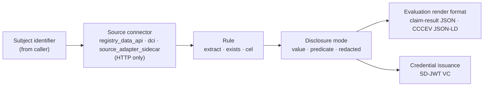

This document defines the HTTP protocol contract that Registry Notary exposes: how a caller authenticates, discovers capabilities, passes governed source policy decisions before source reads, evaluates a claim, controls disclosure, receives an evaluation result in a supported render format, obtains an SD-JWT VC credential directly or through an OID4VCI wallet flow, uses delegated self-attestation for dependent claims, delegates evaluation to a peer, and what audit and error behavior every request carries. It is the precise, citable version of the behavior the [Registry Notary API reference](../../reference/apis/registry-notary/) describes narratively.

It refines the Registry Notary component defined in [RS-ARC-G](../rs-arc-g/) Section 3 (specifically REQ-ARC-G-004, REQ-ARC-G-007, REQ-ARC-G-008, and REQ-ARC-G-009) one level of detail down, from architectural boundary to wire behavior. Where this document and RS-ARC-G state the same constraint, RS-ARC-G is the general invariant and this document is its protocol-level form.

The key words in this document are interpreted per [RS-DOC](../rs-doc/) Section 2. Defined terms are used per [RS-TERMS](../rs-terms/).

## Version history

| Version | Date | Status | Change |
| --- | --- | --- | --- |
| 0.1.0 | 2026-06-13 | draft | Initial protocol contract, distilled from the Registry Notary API reference, the evidence-issuance explanation, and the generated OpenAPI document. |
| 0.1.1 | 2026-06-20 | draft | Document governed source policy decisions, source-bound purpose and freshness constraints, self-attestation trust context, audit provenance, and scoped OID4VCI behavior. |
| 0.1.2 | 2026-06-21 | draft | Clarified source adapter sidecar isolation assumptions and demo/template freshness boundaries. |
| 0.1.3 | 2026-06-22 | draft | Document delegated self-attestation, proof-claim gating, explicit dependent-target binding, delegated denial reasons, and the OID4VCI delegated-token rejection boundary. |
| 0.1.4 | 2026-06-27 | draft | Clarified OIDC principal derivation, issuer-bound Notary transaction authorization details, and nonce expiry enforcement for OID4VCI holder proofs. |
| 0.1.5 | 2026-07-07 | draft | Editorial: pointed the Relay-protocol reference at published RS-PR-RELAY and added explicit evidence citations for REQ-PR-NOTARY-034/035/036. |

## 1. Scope and references

This specification covers Registry Notary's externally observable protocol behavior:

- Authentication and per-claim authorization.
- The discovery surface and its access posture.
- Governed source policy decisions before source reads.
- The claim-evaluation request and response contract, including disclosure semantics and response formats.
- Credential issuance over the direct API and over the OID4VCI wallet flow.
- Delegated self-attestation for configured requester-dependent relationships.
- Delegated (federated) evaluation between configured peers.
- The audit obligation and the error format.

This specification does not define:

- **Exact routes and schemas.** The generated OpenAPI document, rendered as the [Registry Notary API reference](../../reference/apis/registry-notary/), is the authoritative route and schema reference. This document states behavior a schema cannot, and does not restate request and response shapes that would drift from the generated source.
- **The claim definition data model.** How a `ClaimDefinition` declares its source bindings, rule, disclosure policy, formats, and credential eligibility belongs to [RS-DM-CLAIM](../rs-dm-claim/). This document refers to those fields only where they govern protocol behavior.
- **Security model internals.** Key management, token fingerprinting, and the OIDC trust configuration belong to [RS-SEC-G](../rs-sec-g/) and deeper security specifications. This document states the authorization behavior a caller observes.
- Registry Relay's protocol: Relay's own consultation API is a separate surface, specified in [RS-PR-RELAY](../rs-pr-relay/). This document treats Relay only as a source a Notary connector reads over HTTP.

For the motivation and worked examples behind this contract, see [Evidence issuance, end to end](../../explanation/evidence-issuance/). For the architecture this protocol sits in, see [RS-ARC-G](../rs-arc-g/). Media types are named per [RS-TERMS](../rs-terms/) Section 2.

## 2. Service surface and discovery

Registry Notary is a standalone HTTP service for claim evaluation, disclosure policy, credential issuance, and audit (REQ-ARC-G-007). The link between Notary and Registry Relay is metadata and an HTTP source connector, not shared application code: a deployment can run Notary without running Relay.

REQ-PR-NOTARY-001: Registry Notary MUST be independently deployable. It MUST NOT require a running Registry Relay to start or to serve routes that do not read from a Relay-backed source.

A caller discovers Notary's capabilities and claim catalog at `GET /.well-known/evidence-service`. The issuer's public verification keys are published at `GET /.well-known/evidence/jwks.json`, and the OID4VCI issuer metadata at `GET /.well-known/openid-credential-issuer`.

REQ-PR-NOTARY-002: The capability-discovery route (`GET /.well-known/evidence-service`) MUST require authentication; it is not a public discovery endpoint. The issuer JWKS (`GET /.well-known/evidence/jwks.json`) MUST be served without authentication, because a verifier needs the public key without holding a Notary credential.

## 3. Authentication and authorization

Registry Notary runs in one of two authentication modes, selected by configuration.

- **Static credentials.** The caller presents an `x-api-key` token or an `Authorization: Bearer` token. Notary fingerprints the presented token and compares it, in constant time, against `sha256:<...>` values loaded at startup. Each credential carries a `scopes` list.
- **OIDC.** Notary delegates token verification to Registry Platform OIDC primitives (issuer, JWKS URI, audiences, algorithms, scope mapping) and still owns the scopes its claim routes require.

REQ-PR-NOTARY-003: Every claim-bearing route MUST authenticate the caller, in static-credential mode (constant-time fingerprint comparison of an `x-api-key` or `Authorization: Bearer` token) or in OIDC mode (token verification delegated to Registry Platform primitives).

REQ-PR-NOTARY-004: Registry Notary MUST enforce a claim's required scopes before it evaluates the claim or reads any source. A caller whose credential lacks a required scope MUST be refused before source access, not after.

REQ-PR-NOTARY-034: In OIDC mode, Registry Notary MUST derive its authenticated principal from the configured principal claim, using `sub` by default.
A matched client id, authorized party, or audience MAY participate in token verification, scope mapping, or self-attestation classification, but MUST NOT substitute for a missing configured principal claim.

When a claim source binding declares matching policy, Notary evaluates the supported Evidence Gateway PDP profile before reading protected source rows. The supported profile covers policy identity and hash, supported ODRL purpose and spatial terms, claim-level and source-bound purpose constraints, jurisdiction, assurance allow-list and minimum assurance, source freshness, required legal basis and consent, relationship and relationship-purpose constraints, requested fact, requested disclosure, requested credential format, source binding, route identity, checked scope, redaction, and unsupported policy terms. Self-asserted target fields do not satisfy trust-context gates that require a trusted principal authorization context.

REQ-PR-NOTARY-023: Before a source read, Registry Notary MUST obtain the applicable policy decision for the claim and source binding. A denial MUST fail closed with the stable PDP denial code produced for that gate, and MUST NOT be retried as an ungoverned source read.

REQ-PR-NOTARY-024: Source-bound purpose constraints MUST combine the claim's permitted purposes with the source binding's permitted purposes. If either configured purpose set rejects the request purpose, Notary MUST deny before source access.

The internals of key handling and OIDC trust configuration are a security-model concern specified by [RS-SEC-G](../rs-sec-g/).

## 4. Claim evaluation

A claim evaluation moves a subject identifier through a configured pipeline: a source connector resolves facts about the subject, a rule evaluates the configured condition, a disclosure mode shapes what leaves the service, and a response format carries the result. The narrative form of this pipeline, with worked examples, is in [Evidence issuance, end to end](../../explanation/evidence-issuance/).

The diagram restates the pipeline: a caller supplies a subject identifier and a claim id; the configured source connector reads facts over HTTP; the configured rule evaluates; the disclosure mode constrains the output; and the result can be rendered as claim-result JSON or CCCEV-shaped JSON-LD. SD-JWT VC output is materialized through the credential issuance surface in Section 7. A caller does not supply the evaluated value.

REQ-PR-NOTARY-005: Claim evaluation MUST be performed by Registry Notary against its configured sources. The caller supplies a subject identifier and a claim id and MUST NOT supply the evaluated value. This is the protocol-level form of REQ-ARC-G-007.

REQ-PR-NOTARY-006: A source connector MUST reach its target over HTTP. The supported connector kinds are `registry_data_api` (a Registry Relay instance), `dci` (an SP DCI search source), and the source adapter sidecar (which uses built-in `http_json`, `http_flow`, or `fhir` engines to reach external sources such as DHIS2 or FHIR servers). There is no file-based or database connector, and a conforming deployment MUST NOT assume one.

The source adapter sidecar is a private deployment surface behind Registry Notary, not a public subject-facing API. A static bearer token on the Notary-to-sidecar hop authenticates that internal hop; it is not by itself an end-user, tenant, or subject authorization boundary. Deployments keep direct sidecar access off the public network, scope sidecar credentials to the configured source, and scope cache, retry, and backoff state so one caller or source path cannot make authorization-relevant decisions for another.

REQ-PR-NOTARY-007: A claim's rule MUST be one of the implemented rule types: `extract`, `exists`, or `cel`. The `plugin` rule type is declared in configuration but is unimplemented at the reviewed commit; a conforming claim MUST NOT depend on it.

REQ-PR-NOTARY-025: When a source binding configures freshness, Registry Notary MUST derive freshness from configured source metadata, not from caller-supplied freshness. Where the connector can preflight the source observation time, stale or missing freshness MUST deny before the protected source row is read. Where the row itself carries the configured observation field, Notary MUST recheck that timestamp after the row read and before disclosure or credential materialization.

`POST /v1/evaluations` evaluates a single claim; `POST /v1/batch-evaluations` evaluates several in one request. An evaluation is retained under an `evaluation_id` so it can later be rendered (Section 6) or materialized into a credential (Section 7) without re-reading the source.

## 5. Disclosure semantics

Registry Notary controls what a caller receives through three disclosure modes, each governed by `default` and `allowed` settings in the claim definition: `value` (the full value), `predicate` (only the true/false satisfaction), and `redacted` (the value fully hidden).

REQ-PR-NOTARY-008: Every evaluation result MUST record the disclosure mode applied (`value`, `predicate`, or `redacted`).

REQ-PR-NOTARY-009: When the caller requests a disclosure mode, Registry Notary MUST refuse a mode not in the claim's `allowed` set, and MUST apply the claim's `default` mode when the caller requests none.

REQ-PR-NOTARY-010: A `redacted` result MUST NOT carry the underlying source value, and MUST NOT convey the satisfaction outcome: the result body withholds both the value and the predicate. The evaluation stays identified by its `evaluation_id`, and the audit record carries a `verification_id` and a `claim_hash` so the evaluation can be referenced and verified without disclosing the value.

## 6. Response formats

An evaluation can be returned in two render formats, selected by content negotiation and constrained by the claim's configured `formats`:

- Claim-result JSON: `application/vnd.registry-notary.claim-result+json`.
- CCCEV-shaped JSON-LD: `application/ld+json; profile="cccev"`.

A stored evaluation can be re-rendered through `POST /v1/evaluations/{evaluation_id}/render`. The supported render formats are listed at `GET /v1/formats`. SD-JWT VC credentials are materialized from stored evaluations through Section 7, not returned by the render endpoint.

REQ-PR-NOTARY-011: Registry Notary MUST be able to return an evaluation as the claim-result JSON media type (`application/vnd.registry-notary.claim-result+json`). It MAY also return CCCEV-shaped JSON-LD when the claim's `formats` permit and the caller negotiates for it. It MUST NOT treat SD-JWT VC credential issuance as a render format; SD-JWT VC materialization is governed by Section 7 and Section 8.

REQ-PR-NOTARY-012: CCCEV-shaped output MUST NOT assert conformance to CCCEV 2.00. The output is a profiled subset, consumed by parsing the `@graph` for `cccev:Evidence` nodes; the [standards register](../../reference/standards/) records the claim level.

## 7. Credential issuance

Registry Notary materializes a credential from a stored evaluation through `POST /v1/credentials`. The credential is an SD-JWT VC, which gives the holder selective disclosure: the holder chooses which fields to reveal to which verifier.

REQ-PR-NOTARY-013: An issued credential MUST be an SD-JWT VC with media type and `typ` header `dc+sd-jwt`, signed with EdDSA (Ed25519). No W3C Verifiable Credentials Data Model JSON-LD envelope or namespace is present in the issued credential. This is the protocol-level form of REQ-ARC-G-008.

REQ-PR-NOTARY-014: The signed credential body MUST carry the SHA-256 digest of each selectively disclosable field rather than the field value, so an unselected field stays hidden and a holder cannot present a disclosure that was not in the original credential.

REQ-PR-NOTARY-015: A credential MUST bind its holder by naming the holder's public key as a `did:jwk` in the `cnf` claim. `did:jwk` is the only supported binding method. Presentation MUST require a fresh holder proof from that key, audience-bound to the verifier, so a credential without the matching private key is not presentable.

The issuer signing key is sourced from configuration as an OKP Ed25519 JWK; its public half is the key published at `GET /.well-known/evidence/jwks.json`.

Self-attestation is a constrained trust context, not a caller-provided claim value. It binds the authenticated citizen principal to configured claims, purposes, disclosures, formats, credential profiles, subject binding, assurance requirements, and token age limits before evaluation or issuance.

REQ-PR-NOTARY-026: For self-attestation flows, Registry Notary MUST derive the subject and assurance context from the authenticated principal and configured subject binding. It MUST NOT let the caller choose a different subject, claim, purpose, disclosure, format, or credential profile outside the self-attestation policy, and MUST audit self-attestation decisions without raw subject identifiers or bearer tokens.

REQ-PR-NOTARY-035: Where self-attestation evaluate receives a Notary-issued transaction token, Registry Notary MUST require scoped authorization details for the requested evaluation.
A Notary-issued transaction token is identified by the configured Notary access-token signing issuer and the transaction-token type, not by the `typ` value alone.
Externally issued OIDC tokens that use a standard access-token `typ` MAY rely on configured self-attestation scopes and MUST NOT be forced into the Notary transaction-details profile solely because of that `typ`.

Registry Notary has two self-attestation access modes:

- `self_attestation`: the authenticated principal is the credential subject.
- `delegated_attestation`: the authenticated principal is the requester, and a configured dependent target can be evaluated only when scoped authorization details name the same target, relationship, and proof claim.

Delegated self-attestation is distinct from Section 9 federation. It does not delegate trust to a peer Notary. It stays inside the citizen/OIDC trust context and uses relationship proof evaluation before dependent source access.

REQ-PR-NOTARY-029: For delegated self-attestation, Registry Notary MUST derive the requester from the authenticated principal, derive the relationship from scoped authorization details, require the scoped authorization details to bind the same dependent target by `target.id_type` and `target.id`, and reject caller-supplied `requester`, `relationship`, or `on_behalf_of` fields before any source read.

REQ-PR-NOTARY-030: A delegated relationship MUST be enabled in `self_attestation.delegation.allowed_relationships`. The relationship MUST name a `proof_claim`; that proof claim MUST read a source binding whose lookup inputs bind both `requester.*` and `target.*`. Every dependent claim allowed for that relationship MUST be explicitly allow-listed and MUST list the proof claim in `depends_on`.

REQ-PR-NOTARY-031: A delegated source-read capability MUST bind the requester subject and dependent target with keyed hashes. Registry Notary MUST evaluate the proof claim before the dependent claim reads its source, and MUST deny the dependent claim when the proof claim is missing, fails, or returns anything other than boolean `true`. Rendering or issuing from a stored delegated evaluation MUST revalidate the current delegated authorization details, including the dependent-target binding, against the stored metadata.

## 8. OID4VCI issuance flow

For a wallet caller rather than a backend, Registry Notary exposes a scoped OpenID for Verifiable Credential Issuance (OID4VCI) flow. The wallet learns the endpoints from the issuer metadata at `GET /.well-known/openid-credential-issuer`, obtains a credential offer, requests a nonce, signs a proof of possession with its `did:jwk` key, and posts the access token plus the proof to the credential endpoint. The flow is a Notary self-attestation issuance path, not a general-purpose wallet interoperability claim.

REQ-PR-NOTARY-016: The OID4VCI surface is a profiled subset of OID4VCI Draft 13 advertising the `dc+sd-jwt` format. Registry Notary MUST NOT advertise full OID4VCI issuer conformance; its capability-discovery document (`GET /.well-known/evidence-service`) declares `openid4vci.support: not_full_issuer`.

REQ-PR-NOTARY-017: The credential endpoint (`POST /oid4vci/credential`) MUST require a valid access token and a holder proof of possession.
Registry Notary MUST NOT issue a credential without proof of possession.
Where `oid4vci.nonce.enabled` is set (off by default), the proof MUST additionally be bound to a fresh issuer nonce.
A nonce is fresh only when it is reserved for the credential issuer and configuration being requested, has not expired at consume time, and has not already been consumed.
The offer MAY carry an authorization-code grant or a pre-authorized-code grant.

REQ-PR-NOTARY-027: OID4VCI credential issuance MUST be scoped to configured credential configurations and the authenticated self-attestation principal. The credential endpoint MUST evaluate the configured claim under the self-attestation and source policies before issuance, MUST enforce the configured credential profile, and MUST NOT imply compatibility with arbitrary external wallets beyond the profiled endpoints and metadata this specification names.

REQ-PR-NOTARY-036: When an OID4VCI credential request uses a Notary-issued access token, Registry Notary MUST require transaction-scoped authorization details that match the selected credential configuration, action, service, claims, disclosure, format, purpose, subject binding, and direct self-attestation access mode.
Missing, empty, or context-only authorization details MUST be denied before holder-proof nonce consumption.
Registry Notary MUST identify Notary-issued access tokens by the configured Notary signing issuer and supported Notary token types, so externally issued OIDC access tokens can continue to use scope-based authorization where the configured flow permits it.

REQ-PR-NOTARY-032: The OID4VCI credential endpoint MUST reject delegated-attestation transaction tokens. This OID4VCI profile issues only for direct self-attestation principals in this version.

## 9. Delegated (federated) evaluation

A configured peer Registry Notary can delegate an evaluation through `POST /federation/v1/evaluations`. The peer posts a compact signed JWT request and receives a compact signed JWT response carrying a scoped evaluation result. This path does not issue a credential.

REQ-PR-NOTARY-018: Delegated evaluation (`POST /federation/v1/evaluations`) MUST accept a compact signed JWT request and return a compact signed JWT response. Before any source read, the serving Registry Notary MUST verify peer policy, replay state, purpose, profile, and audience.

REQ-PR-NOTARY-019: Federation MUST be static-peer only: peers are loaded from configuration at startup, and a request from an unconfigured peer MUST be rejected. Delegated evaluation returns a scoped evaluation result, not a credential. Dynamic trust-chain discovery, shared replay storage, and federated credential issuance are out of scope for this version and MUST NOT be implied by a conformance claim against this specification. This is the protocol-level form of REQ-ARC-G-009.

## 10. Audit and error behavior

Registry Notary records every evaluation, credential or not, in a Registry Platform audit envelope. Audit is not best-effort: a request that cannot be recorded does not succeed.

REQ-PR-NOTARY-020: Every evaluated request MUST emit an `EvidenceAuditEvent` in a Registry Platform audit envelope to the configured sink (stdout, file (JSONL), or syslog). This is the protocol-level form of REQ-ARC-G-004.

REQ-PR-NOTARY-021: An audit write failure MUST surface as a request error. Registry Notary MUST NOT return a successful evaluation it could not record, and MUST NOT swallow an audit failure as a silent log entry.

REQ-PR-NOTARY-022: Error responses on the claim, credential, and federation routes MUST use the problem-details media type `application/problem+json` ([RFC 9457](https://www.rfc-editor.org/info/rfc9457)). The OID4VCI routes (`/oid4vci/*`) instead return the OID4VCI error envelope their flow defines.

REQ-PR-NOTARY-028: Public claim results MUST carry claim provenance using the `registry-notary-claim-provenance/v1` shape. Audit records for policy-governed evaluations and denials MUST preserve the relevant evaluation policy or matching-policy id, hash, and evaluated rule ids when that policy was selected, while omitting requester-side raw identifiers and secrets from public provenance.

REQ-PR-NOTARY-033: Self-attestation policy denials MUST use the public problem code `self_attestation.denied` while preserving the granular denial reason in audit context. Delegated self-attestation denial reasons are `delegated.relationship_unproven`, `delegated.relationship_not_allowed`, `delegated.claim_denied`, `delegated.subject_not_permitted`, and `delegated.proof_denied`.

## 11. Limitations

These constraints are stated so a reader does not infer a capability from the route list that the reviewed implementation does not provide.

- **Plugin rule type.** Declared in configuration, unimplemented (REQ-PR-NOTARY-007).
- **Holder binding.** `did:jwk` is the only supported proof-of-possession binding method (REQ-PR-NOTARY-015).
- **OID4VCI profile.** The OID4VCI surface is a scoped self-attestation issuance profile, not a full issuer or general external-wallet interoperability claim (REQ-PR-NOTARY-016, REQ-PR-NOTARY-027).
- **Delegated OID4VCI.** Delegated-attestation transaction tokens are rejected by the OID4VCI credential endpoint (REQ-PR-NOTARY-032).
- **Notary transaction details.** Notary-issued transaction and credential access tokens are bound to the configured Notary issuer before the transaction-details requirement applies. Externally issued OIDC tokens are not treated as Notary tokens by `typ` alone (REQ-PR-NOTARY-035, REQ-PR-NOTARY-036).
- **Federation.** Static-peer delegated evaluation only; no dynamic discovery, shared replay storage, or federated credential issuance (REQ-PR-NOTARY-019).
- **Source adapter sidecar.** The sidecar is an internal source connector surface. Direct public access, broad reuse of one sidecar token across unrelated sources, or shared cache/backoff state across authorization contexts is outside the security model (REQ-PR-NOTARY-006).
- **Demo and template integrations.** Demo helper code and generated workflow snippets are integration examples, not a production freshness or replay-protection profile. Teams that copy them into production must add request freshness, expiry, or nonce checks appropriate to their workflow.
- **Admin reload.** The admin reload route returns HTTP 501 with code `registry.admin.capability.not_supported` in the standalone router; it performs no reload, and key and configuration changes require a service restart.

## Conformance

A Registry Notary deployment conforms to this specification when it:

- runs independently of Registry Relay (REQ-PR-NOTARY-001) and gates capability discovery while publishing its JWKS openly (REQ-PR-NOTARY-002);
- authenticates every claim-bearing route and enforces per-claim scopes before source access (REQ-PR-NOTARY-003, REQ-PR-NOTARY-004);
- derives OIDC principals only from the configured principal claim, without client-identity fallback (REQ-PR-NOTARY-034);
- enforces governed source policy decisions, source-bound purpose constraints, and source-derived freshness before disclosure or issuance (REQ-PR-NOTARY-023, REQ-PR-NOTARY-024, REQ-PR-NOTARY-025);
- evaluates claims itself, over HTTP-only source connectors, using only implemented rule types (REQ-PR-NOTARY-005, REQ-PR-NOTARY-006, REQ-PR-NOTARY-007);
- records and honors the disclosure mode, and never leaks a redacted value (REQ-PR-NOTARY-008, REQ-PR-NOTARY-009, REQ-PR-NOTARY-010);
- returns the claim-result format, may render CCCEV-shaped JSON-LD, and states its CCCEV output as a profiled subset (REQ-PR-NOTARY-011, REQ-PR-NOTARY-012);
- issues only SD-JWT VC credentials, with digest-based selective disclosure and `did:jwk` holder binding (REQ-PR-NOTARY-013, REQ-PR-NOTARY-014, REQ-PR-NOTARY-015);
- treats self-attestation as constrained authenticated trust context, including delegated self-attestation only when requester, dependent target, relationship proof, and stored-evaluation metadata all bind to the configured policy (REQ-PR-NOTARY-026, REQ-PR-NOTARY-029, REQ-PR-NOTARY-030, REQ-PR-NOTARY-031, REQ-PR-NOTARY-035);
- exposes OID4VCI as a scoped non-full-issuer subset that requires holder proof of possession, rejects expired or already-consumed nonces where nonces are enabled, requires Notary-issued access tokens to carry matching transaction details, and rejects delegated-attestation transaction tokens (REQ-PR-NOTARY-016, REQ-PR-NOTARY-017, REQ-PR-NOTARY-027, REQ-PR-NOTARY-032, REQ-PR-NOTARY-036);
- restricts federation to verified, static peers and never issues credentials over it (REQ-PR-NOTARY-018, REQ-PR-NOTARY-019);
- audits every evaluation, fails the request when it cannot, reports errors as problem+json, and carries policy/provenance context without raw requester secrets (REQ-PR-NOTARY-020, REQ-PR-NOTARY-021, REQ-PR-NOTARY-022, REQ-PR-NOTARY-028, REQ-PR-NOTARY-033).

Conformance to this specification does not imply conformance to any external standard cited in the `standards_referenced` frontmatter field. Each standard's adoption mode and scope are documented in the [standards register](../../reference/standards/).

## Evidence

This specification is `verified`: every requirement describes shipped behavior a reader can inspect, per RS-DOC REQ-DOC-014.

- The [Registry Notary API reference](../../reference/apis/registry-notary/) carries the narrative context and links the generated OpenAPI (Redoc) document, the authoritative route and schema reference for every route named here.
- [Evidence issuance, end to end](../../explanation/evidence-issuance/) walks the claim pipeline, the four consume paths, and the selective-disclosure mechanics that Sections 4 through 9 make precise.
- The [standards register](../../reference/standards/) records the adoption mode for SD-JWT VC, OID4VCI, CCCEV, and the other standards listed in `standards_referenced`, including the profiled-subset claims this document refers to.
- [RS-ARC-G](../rs-arc-g/) Section 3 and Section 5 hold the architectural invariants (REQ-ARC-G-004/007/008/009) that this document refines.
- Delegated self-attestation access modes, source capabilities, stored metadata, and denial reasons are implemented in [`model.rs`](https://github.com/registrystack/registry-stack/blob/v0.8.4/crates/registry-notary-core/src/model.rs).
- Delegated relationship configuration validation is implemented in [`config.rs`](https://github.com/registrystack/registry-stack/blob/v0.8.4/crates/registry-notary-core/src/config.rs).
- Request context derivation, stored-evaluation revalidation, OID4VCI delegated-token rejection, explicit target binding, and proof-gated source reads are implemented in [`api.rs`](https://github.com/registrystack/registry-stack/blob/v0.8.4/crates/registry-notary-server/src/api.rs) and [`runtime.rs`](https://github.com/registrystack/registry-stack/blob/v0.8.4/crates/registry-notary-server/src/runtime.rs).
- OIDC principal derivation from the configured principal claim, without client id, authorized party, or audience fallback (REQ-PR-NOTARY-034), is implemented in [`standalone.rs`](https://github.com/registrystack/registry-stack/blob/v0.8.4/crates/registry-notary-server/src/standalone.rs)'s `principal_from_oidc` function and its `oidc_principal_requires_configured_principal_claim` test.
- The issuer-bound self-attestation transaction-token gate (REQ-PR-NOTARY-035) is implemented in [`api.rs`](https://github.com/registrystack/registry-stack/blob/v0.8.4/crates/registry-notary-server/src/api.rs)'s `self_attestation_requires_authorization_details` function.
- The issuer-bound OID4VCI transaction-detail gate (REQ-PR-NOTARY-036) is implemented in [`api.rs`](https://github.com/registrystack/registry-stack/blob/v0.8.4/crates/registry-notary-server/src/api.rs)'s `oid4vci_requires_authorization_details` and `require_oid4vci_issuance_authorization_details` functions.

## Next

- [RS-ARC-G](../rs-arc-g/) places Registry Notary in the registry stack architecture.
- [RS-TERMS](../rs-terms/) defines the protocol and credential vocabulary used here.
- [Evidence issuance, end to end](../../explanation/evidence-issuance/) is the narrative explanation with worked examples.
- [Registry Notary API reference](../../reference/apis/registry-notary/) is the route-level reference and the link to the generated OpenAPI document.
