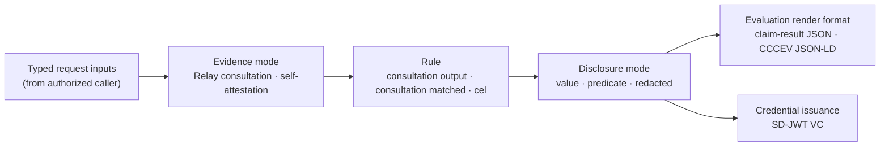

This document defines the HTTP protocol contract that Registry Notary exposes: how a caller authenticates, discovers capabilities, authorizes compiler-pinned Relay consultations or self-attestation before evaluation, controls disclosure, receives an evaluation result in a supported render format, obtains an SD-JWT VC credential directly or through an OID4VCI wallet flow, uses delegated self-attestation for dependent claims, delegates evaluation to a peer, and what audit and error behavior every request carries. It is the precise, citable version of the behavior the [Registry Notary API reference](../../reference/apis/registry-notary/) describes narratively.

It refines the Registry Notary component defined in [RS-ARC-G](../rs-arc-g/) Section 3 (specifically REQ-ARC-G-004, REQ-ARC-G-007, REQ-ARC-G-008, and REQ-ARC-G-009) one level of detail down, from architectural boundary to wire behavior. Where this document and RS-ARC-G state the same constraint, RS-ARC-G is the general invariant and this document is its protocol-level form.

The key words in this document are interpreted per [RS-DOC](../rs-doc/) Section 2. Defined terms are used per [RS-TERMS](../rs-terms/).

## Version history

| Version | Date | Status | Change |
| --- | --- | --- | --- |
| 0.1.0 | 2026-06-13 | draft | Initial protocol contract, distilled from the Registry Notary API reference, the evidence-issuance explanation, and the generated OpenAPI document. |
| 0.1.1 | 2026-06-20 | draft | Document governed source policy decisions, source-bound purpose and freshness constraints, self-attestation trust context, audit provenance, and scoped OID4VCI behavior. |
| 0.1.2 | 2026-06-21 | draft | Clarified source adapter sidecar isolation assumptions and demo/template freshness boundaries. |
| 0.1.3 | 2026-06-22 | draft | Document delegated self-attestation, proof-claim gating, explicit dependent-target binding, delegated denial reasons, and the OID4VCI delegated-token rejection boundary. |
| 0.1.4 | 2026-06-27 | draft | Clarified OIDC principal derivation, issuer-bound Notary transaction authorization details, and nonce expiry enforcement for OID4VCI holder proofs. |
| 0.1.5 | 2026-07-07 | draft | Editorial: pointed the Relay-protocol reference at published RS-PR-RELAY and added explicit evidence citations for REQ-PR-NOTARY-034/035/036. |
| 0.2.0 | 2026-07-13 | draft | Removed direct registry source connectors and sidecars. Registry-backed claims now consume compiler-pinned Relay consultations; Notary-only claims are source-free or self-attested. |
| 0.3.0 | 2026-07-19 | draft | Restricted OID4VCI to registry-backed issuer-initiated pre-authorized code, and defined algorithm, transaction-code, status, topology, and unsupported-profile boundaries. |

## 1. Scope and references

This specification covers Registry Notary's externally observable protocol behavior:

- Authentication and per-claim authorization.
- The discovery surface and its access posture.
- Authorization and policy decisions before Relay consultation or claim evaluation.
- The claim-evaluation request and response contract, including disclosure semantics and response formats.
- Credential issuance over the direct API and over the OID4VCI wallet flow.
- Delegated self-attestation for configured requester-dependent relationships.
- Delegated (federated) evaluation between configured peers.
- The audit obligation and the error format.

This specification does not define:

- Exact routes and schemas: The generated OpenAPI document, rendered as the [Registry Notary API reference](../../reference/apis/registry-notary/), is the authoritative route and schema reference. This document states behavior a schema cannot, and does not restate request and response shapes that would drift from the generated source.
- The claim definition data model: How a `ClaimDefinition` declares its evidence mode, Relay consultation bindings, rule, disclosure policy, formats, and credential eligibility belongs to [RS-DM-CLAIM](../rs-dm-claim/). This document refers to those fields only where they govern protocol behavior.
- Security model internals: Key management, token fingerprinting, and the OIDC trust configuration belong to [RS-SEC-G](../rs-sec-g/) and deeper security specifications. This document states the authorization behavior a caller observes.
- Registry Relay's protocol: Relay's consultation API is a separate surface, specified in [RS-PR-RELAY](../rs-pr-relay/). This document specifies only how Notary binds and invokes a compiler-pinned Relay consultation.

For the motivation and worked examples behind this contract, see [Evidence issuance, end to end](../../explanation/evidence-issuance/). For the architecture this protocol sits in, see [RS-ARC-G](../rs-arc-g/). Media types are named per [RS-TERMS](../rs-terms/) Section 2.

## 2. Service surface and discovery

Registry Notary is a standalone HTTP service for claim evaluation, disclosure policy, credential issuance, and audit (REQ-ARC-G-007). A Notary-only deployment supports source-free and self-attested evaluation only. A registry-backed claim requires a combined deployment in which Notary calls a compiler-pinned Registry Relay consultation, and credential issuance accepts only that registry-backed mode.

REQ-PR-NOTARY-001: Registry Notary MUST be independently deployable. It MUST NOT require Registry Relay to start or to evaluate source-free and self-attested claims. A claim configured as registry-backed MUST NOT become ready without its pinned Relay consultation contract.

A caller discovers Notary's capabilities and claim catalog at `GET /.well-known/evidence-service`. The issuer's public verification keys are published at `GET /.well-known/evidence/jwks.json`, and the OID4VCI issuer metadata at `GET /.well-known/openid-credential-issuer`.

REQ-PR-NOTARY-002: The capability-discovery route (`GET /.well-known/evidence-service`) MUST require authentication; it is not a public discovery endpoint. The issuer JWKS (`GET /.well-known/evidence/jwks.json`) MUST be served without authentication, because a verifier needs the public key without holding a Notary credential.

## 3. Authentication and authorization

Registry Notary runs in one of two authentication modes, selected by configuration.

- Static credentials: The caller presents an `x-api-key` token or an `Authorization: Bearer` token. Notary fingerprints the presented token and compares it, in constant time, against `sha256:<...>` values loaded at startup. Each credential carries a `scopes` list.
- OIDC: Notary delegates token verification to Registry Platform OIDC primitives (issuer, JWKS URI, audiences, algorithms, scope mapping) and still owns the scopes its claim routes require.

REQ-PR-NOTARY-003: Every claim-bearing route MUST authenticate the caller, in static-credential mode (constant-time fingerprint comparison of an `x-api-key` or `Authorization: Bearer` token) or in OIDC mode (token verification delegated to Registry Platform primitives).

REQ-PR-NOTARY-004: Registry Notary MUST enforce a claim's required scopes before it evaluates the claim or calls Registry Relay. A caller whose credential lacks a required scope MUST be refused before Relay or claim work, not after.

REQ-PR-NOTARY-034: In OIDC mode, Registry Notary MUST derive its authenticated principal from the configured principal claim, using `sub` by default.
A matched client id, authorized party, or audience MAY participate in token verification, scope mapping, or self-attestation classification, but MUST NOT substitute for a missing configured principal claim.

When a claim declares governed policy, Notary evaluates the supported Evidence Gateway PDP profile before a Relay consultation or self-attested evaluation. The supported profile covers policy identity and hash, supported ODRL purpose and spatial terms, claim purpose, jurisdiction, assurance, freshness represented by trusted Relay provenance, required legal basis and consent, relationship and relationship-purpose constraints, requested fact, requested disclosure, requested credential format, route identity, checked scope, redaction, and unsupported policy terms. Self-asserted target fields do not satisfy trust-context gates that require a trusted principal authorization context.

REQ-PR-NOTARY-023: Before a Relay consultation or self-attested evaluation, Registry Notary MUST obtain the applicable policy decision for the claim. A denial MUST fail closed with the stable PDP denial code produced for that gate and MUST NOT be retried through a less governed evidence mode.

REQ-PR-NOTARY-024: Notary MUST require the request purpose to match the claim purpose and the compiler-pinned Relay consultation purpose for a registry-backed claim. A mismatch MUST deny before Relay access.

The internals of key handling and OIDC trust configuration are a security-model concern specified by [RS-SEC-G](../rs-sec-g/).

## 4. Claim evaluation

A claim evaluation moves typed request inputs through one configured evidence mode, then a rule, disclosure policy, and response format. Registry-backed claims consume compiler-pinned Relay outputs. Source-free and self-attested claims use only permitted request inputs. The narrative form of this pipeline, with worked examples, is in [Evidence issuance, end to end](../../explanation/evidence-issuance/).

The diagram restates the pipeline: an authorized caller supplies the configured target and request inputs plus a claim id. A registry-backed claim invokes exactly the pinned Relay consultation; a self-attested claim uses only its configured authenticated context and request inputs. The rule evaluates, disclosure constrains the output, and the result can be rendered as claim-result JSON or CCCEV-shaped JSON-LD. SD-JWT VC output is materialized through the credential issuance surface in Section 7. A caller does not supply the evaluated value.

REQ-PR-NOTARY-005: Claim evaluation MUST be performed by Registry Notary over its configured evidence mode. The caller supplies only the configured request inputs and claim id and MUST NOT supply the evaluated value. This is the protocol-level form of REQ-ARC-G-007.

REQ-PR-NOTARY-006: Registry Notary MUST NOT configure or execute a direct registry source connector. A registry-backed claim MUST bind one or more compiler-pinned Registry Relay consultations by profile id and contract hash. The request purpose and typed inputs MUST match the pinned contract before Notary calls Relay. Source origins, credentials, HTTP or script execution, protocol helpers, snapshots, and output minimization belong to Relay.

REQ-PR-NOTARY-007: A claim's rule MUST be one of the implemented rule types: `consultation_output`, `consultation_matched`, or `cel`. The `plugin` rule type is declared in configuration but is unimplemented at the reviewed commit; a conforming claim MUST NOT depend on it.

REQ-PR-NOTARY-025: When a registry-backed claim requires freshness, Registry Notary MUST derive freshness from the verified Relay consultation provenance, not from caller-supplied freshness. Stale, absent, or malformed required provenance MUST deny before disclosure or credential materialization.

`POST /v1/evaluations` evaluates a single claim; `POST /v1/batch-evaluations` evaluates several in one request. An evaluation is retained under an `evaluation_id` so it can later be rendered (Section 6) or materialized into a credential (Section 7) without re-reading the source.

## 5. Disclosure semantics

Registry Notary controls what a caller receives through three disclosure modes, each governed by `default` and `allowed` settings in the claim definition: `value` (the full value), `predicate` (only the true/false satisfaction), and `redacted` (the value fully hidden).

REQ-PR-NOTARY-008: Every evaluation result MUST record the disclosure mode applied (`value`, `predicate`, or `redacted`).

REQ-PR-NOTARY-009: When the caller requests a disclosure mode, Registry Notary MUST refuse a mode not in the claim's `allowed` set, and MUST apply the claim's `default` mode when the caller requests none.

REQ-PR-NOTARY-010: A `redacted` result MUST NOT carry the underlying source value, and MUST NOT convey the satisfaction outcome: the result body withholds both the value and the predicate. The evaluation stays identified by its `evaluation_id`, and the audit record carries a `verification_id` and a `claim_hash` so the evaluation can be referenced and verified without disclosing the value.

## 6. Response formats

An evaluation can be returned in two render formats, selected by content negotiation and constrained by the claim's configured `formats`:

- Claim-result JSON: `application/vnd.registry-notary.claim-result+json`.
- CCCEV-shaped JSON-LD: `application/ld+json; profile="cccev"`.

A stored evaluation can be re-rendered through `POST /v1/evaluations/{evaluation_id}/render`. The supported render formats are listed at `GET /v1/formats`. SD-JWT VC credentials are materialized from stored evaluations through Section 7, not returned by the render endpoint.

REQ-PR-NOTARY-011: Registry Notary MUST be able to return an evaluation as the claim-result JSON media type (`application/vnd.registry-notary.claim-result+json`). It MAY also return CCCEV-shaped JSON-LD when the claim's `formats` permit and the caller negotiates for it. It MUST NOT treat SD-JWT VC credential issuance as a render format; SD-JWT VC materialization is governed by Section 7 and Section 8.

REQ-PR-NOTARY-012: CCCEV-shaped output MUST NOT assert conformance to CCCEV 2.00. The output is a profiled subset, consumed by parsing the `@graph` for `cccev:Evidence` nodes; the [standards register](../../reference/standards/) records the claim level.

## 7. Credential issuance

Registry Notary materializes a credential from a stored evaluation through `POST /v1/credentials`. The credential is an SD-JWT VC, which gives the holder selective disclosure: the holder chooses which fields to reveal to which verifier.

Source-free claims are evaluation-only. Credential profiles, credential-capable
subject-access allow-lists, and OID4VCI projections select only mutually bound
`registry_backed` claims.

REQ-PR-NOTARY-013: An issued credential MUST be an SD-JWT VC with media type and `typ` header `dc+sd-jwt`, signed with the credential profile's configured EdDSA (Ed25519) or ES256 (P-256) key. No W3C Verifiable Credentials Data Model JSON-LD envelope or namespace is present in the issued credential. This is the protocol-level form of REQ-ARC-G-008.

REQ-PR-NOTARY-014: The signed credential body MUST carry the SHA-256 digest of each selectively disclosable field rather than the field value, so an unselected field stays hidden and a holder cannot present a disclosure that was not in the original credential.

REQ-PR-NOTARY-015: A credential MUST bind its holder by naming the holder's public key as a `did:jwk` in the `cnf` claim. `did:jwk` is the only supported binding method. Presentation MUST require a fresh holder proof from that key, audience-bound to the verifier, so a credential without the matching private key is not presentable.

The issuer signing key is sourced from configuration as an Ed25519 or P-256 JWK. Its public half is published at `GET /.well-known/evidence/jwks.json`.

REQ-PR-NOTARY-038: A credential with a `status.status_list` claim MUST keep that top-level claim outside selective disclosure. A conforming client verifier MUST retrieve the signed status token only from the configured exact HTTPS trusted origin and MUST fail closed when status is missing, malformed, untrusted, unavailable, suspended, revoked, expired, or otherwise invalid.

REQ-PR-NOTARY-037: Before direct or OID4VCI issuance, Registry Notary MUST
reconstruct every selected root's executed registry-backed dependency closure.
It MUST require exactly one private compiler-pin record for every claim in the
combined closure and exactly one normalized execution record for every unique
executed consultation ULID, with no missing, duplicate, or extra record. Claim
pins MUST match the active claim id and version, Relay profile id and contract
hash, canonical purpose, and referenced consultation ULID. Execution records
MUST match the acquired time. Each claim pin MUST carry a deterministic
SHA-256 execution binding over the pin, execution ULID and acquisition time,
evaluation and result time, and exact claim provenance; Notary MUST recompute
that binding before signer access. Each public root result's
`relay_consultation_count` MUST equal the number of unique executed ULIDs in
that root's closure. One coalesced Relay execution MAY support several claims
but MUST appear once in the normalized execution set. Legacy, source-free,
stale, or modified provenance MUST be denied before signer access, signing,
credential identifiers, or status writes. Direct issuance MUST perform this
check before holder-proof replay mutation. OID4VCI MUST reject a source-free
credential configuration, create and evaluate the registry transaction before
rendering an offer, consume the transaction-bound proof nonce at the credential
endpoint, and verify the stored transaction and evaluation before signer
access. Existing stored evaluations without the private records MAY remain
readable and renderable but MUST be re-evaluated before issuance.

The private claim pins and execution records MUST be retained only when all
selected roots share a mutually validated credential profile. A
registry-backed evaluation-only selection MUST remain evaluatable and
renderable without retaining private Relay ids or acquisition times. The
execution binding is an unkeyed partial-mutation check, not an authenticity
guarantee against an operator able to rewrite all committed fields and
recompute it.

Self-attestation is a constrained trust context, not a caller-provided claim value. It binds the authenticated citizen principal to configured claims, purposes, disclosures, formats, subject binding, assurance requirements, and token age limits before evaluation. Direct subject access can authorize issuance only for a non-delegated registry-backed claim with a mutually bound credential profile. Source-free and delegated self-attestation remain evaluation-only.

REQ-PR-NOTARY-026: For self-attestation flows, Registry Notary MUST derive the subject and assurance context from the authenticated principal and configured subject binding. It MUST NOT let the caller choose a different subject, claim, purpose, disclosure, format, or credential profile outside the self-attestation policy, and MUST audit self-attestation decisions without raw subject identifiers or bearer tokens.

REQ-PR-NOTARY-035: Where self-attestation evaluate receives a Notary-issued transaction token, Registry Notary MUST require scoped authorization details for the requested evaluation.
A Notary-issued transaction token is identified by the configured Notary access-token signing issuer and the transaction-token type, not by the `typ` value alone.
Externally issued OIDC tokens that use a standard access-token `typ` MAY rely on configured self-attestation scopes and MUST NOT be forced into the Notary transaction-details profile solely because of that `typ`.

Registry Notary has two self-attestation access modes:

- `self_attestation`: the authenticated principal is the credential subject.
- `delegated_attestation`: the authenticated principal is the requester, and a configured dependent target can be evaluated only when scoped authorization details name the same target, relationship, and proof claim.

Delegated self-attestation is distinct from Section 9 federation. It does not delegate trust to a peer Notary. It stays inside the citizen/OIDC trust context and uses a compiler-pinned Relay relationship proof before the dependent claim.

REQ-PR-NOTARY-029: For delegated self-attestation, Registry Notary MUST derive the requester from the authenticated principal, derive the relationship from scoped authorization details, require the scoped authorization details to bind the same dependent target by `target.id_type` and `target.id`, and reject caller-supplied `requester`, `relationship`, or `on_behalf_of` fields before any Relay consultation.

REQ-PR-NOTARY-030: A delegated relationship MUST be enabled in `subject_access.delegation.allowed_relationships`. The relationship MUST name a registry-backed `proof_claim`. That proof claim MUST bind exactly one compiler-pinned Relay consultation whose closed input mapping includes both requester and target identifiers. Every dependent claim allowed for that relationship MUST be explicitly allow-listed and MUST list the proof claim in `depends_on`. Delegated relationship and dependent-claim credential-profile bindings MUST be empty in 1.0; configuration load MUST reject them with remediation to remove the delegated credential capability or use a registry-backed, non-delegated credential claim.

REQ-PR-NOTARY-031: A delegated Relay capability MUST bind the requester subject and dependent target with keyed hashes. Registry Notary MUST evaluate the proof consultation before the dependent claim and MUST deny the dependent claim when the proof is missing, fails, is ambiguous, or returns anything other than boolean `true`. It MUST NOT fall back to another consultation or self-attestation. Rendering a stored delegated evaluation MUST revalidate the current delegated authorization details, including the dependent-target binding, against the stored metadata. Direct and OID4VCI credential issuance MUST reject delegated evaluations before signer access.

## 8. OID4VCI issuance flow

For a wallet caller, Registry Notary exposes a narrow OpenID for Verifiable
Credential Issuance (OID4VCI) profile. A citizen first authenticates in a
browser. Notary consumes the identity provider's authorization code, derives
the configured subject binding, creates and evaluates a registry transaction,
and then renders an issuer-initiated pre-authorized offer. The wallet redeems
that offer at Notary and proves control of an EdDSA `did:jwk` holder key. The
flow does not create a source-free credential trust surface.

REQ-PR-NOTARY-016: The OID4VCI surface MUST advertise `dc+sd-jwt`, EdDSA
`did:jwk` holder proof, and the credential profile's exact EdDSA or ES256 issuer
algorithm. Registry Notary MUST NOT advertise full issuer, EUDI, HAIP, PAR,
DPoP, wallet-attestation, ES256-holder, or general external-wallet conformance.
Its capability-discovery document MUST declare
`openid4vci.support: not_full_issuer`.

REQ-PR-NOTARY-039: The only wallet-facing grant MUST be
`urn:ietf:params:oauth:grant-type:pre-authorized_code`. The authorization code
returned by the configured identity provider MUST remain an internal
browser-to-Notary authentication input and MUST NOT be exposed or accepted as a
wallet grant. Registry Notary MUST NOT expose the former public credential-offer
or nonce routes, advertise a nonce endpoint, or return a next nonce from the
credential endpoint.

REQ-PR-NOTARY-027: Before rendering an offer, Registry Notary MUST validate the
identity-provider response, derive the configured subject binding, create a
transaction for the selected credential configuration, execute the exact
compiler-pinned Relay consultation, and store the evaluation provenance. It
MUST NOT render an offer for a source-free, delegated, failed, ambiguous,
missing, or stale evaluation.

REQ-PR-NOTARY-040: A pre-authorized offer MUST require a numeric `tx_code` by
default. The code and PIN requirement MUST be bound to the signed offer. Missing
or wrong PINs MUST fail, repeated wrong attempts MUST be bounded per offer, and
invalid redemption attempts MUST be rate limited. An explicit `required: false`
profile MAY support a wallet that cannot present a PIN, including the Walt
compatibility profile, only when the pre-authorized code lifetime is no more
than 300 seconds. In both modes the pre-authorized code MUST be single-use. The
no-PIN offer MUST be treated as bearer credential material that a thief can
redeem during its bounded lifetime.

REQ-PR-NOTARY-017: The credential endpoint (`POST /oid4vci/credential`) MUST
require a valid Notary-issued access token and one holder proof of possession.
The holder proof MUST use EdDSA with `did:jwk`, MUST bind the credential issuer
as audience, and MUST contain the fresh transaction-bound nonce returned by the
token response. The nonce MUST be unexpired and single-use. ES256 holder proof
MUST be rejected.

REQ-PR-NOTARY-036: A Notary-issued access token MUST carry transaction-scoped
authorization details that exactly match the stored transaction's credential
configuration, action, service, claims, disclosure, format, purpose, subject
binding, and direct subject-access mode. Missing, empty, context-only, or
mismatched details MUST be denied before signer access. The credential endpoint
MUST reload the stored transaction and evaluation and enforce
REQ-PR-NOTARY-037 before signing.

REQ-PR-NOTARY-032: Direct and OID4VCI credential endpoints MUST reject
source-free, delegated-attestation, and registry-backed evaluation-only records
before signer access. Credential issuance is available only for non-delegated
registry-backed claims.

REQ-PR-NOTARY-041: A deployment authority MUST pair one Registry Notary
authority with one Registry Relay authority. Notary MUST own the PostgreSQL
correctness state used for its transactions, pre-authorized codes, proof replay,
evaluations, audit, and credential status. Explicit in-memory state MAY be used
only for local single-process development.

## 9. Delegated (federated) evaluation

A configured peer Registry Notary can delegate an evaluation through `POST /federation/v1/evaluations`. The peer posts a compact signed JWT request and receives a compact signed JWT response carrying a scoped evaluation result. This path does not issue a credential.

REQ-PR-NOTARY-018: Delegated evaluation (`POST /federation/v1/evaluations`) MUST accept a compact signed JWT request and return a compact signed JWT response. Before claim evaluation, the serving Registry Notary MUST verify peer policy, replay state, purpose, profile, and audience. Federation evaluation profiles MUST be source-free in this version and MUST NOT select a `registry_backed` claim; Relay-backed federation remains deferred until its cross-service audit correlation contract is implemented.

REQ-PR-NOTARY-019: Federation MUST be static-peer only: peers are loaded from configuration at startup, and a request from an unconfigured peer MUST be rejected. Delegated evaluation returns a scoped evaluation result, not a credential. Dynamic trust-chain discovery, shared replay storage, and federated credential issuance are out of scope for this version and MUST NOT be implied by a conformance claim against this specification. This is the protocol-level form of REQ-ARC-G-009.

## 10. Audit and error behavior

Registry Notary records every evaluation, credential or not, in a Registry Platform audit envelope. Audit is not best-effort: a request that cannot be recorded does not succeed.

REQ-PR-NOTARY-020: Every evaluated request MUST emit an `EvidenceAuditEvent` in a Registry Platform audit envelope to the configured sink (stdout, file (JSONL), or syslog). This is the protocol-level form of REQ-ARC-G-004.

REQ-PR-NOTARY-021: An audit write failure MUST surface as a request error. Registry Notary MUST NOT return a successful evaluation it could not record, and MUST NOT swallow an audit failure as a silent log entry.

REQ-PR-NOTARY-022: Error responses on the claim, credential, and federation routes MUST use the problem-details media type `application/problem+json` ([RFC 9457](https://www.rfc-editor.org/info/rfc9457)). The OID4VCI routes (`/oid4vci/*`) instead return the OID4VCI error envelope their flow defines.

REQ-PR-NOTARY-028: Public claim results MUST carry claim provenance using the `registry-notary-claim-provenance/v2` shape. Registry-backed provenance MUST count the verified Relay consultations without exposing source credentials, consultation identifiers, or raw subject identifiers. Audit records for policy-governed evaluations and denials MUST preserve the relevant policy id, hash, and evaluated rule ids when that policy was selected.

REQ-PR-NOTARY-033: Self-attestation policy denials MUST use the public problem code `self_attestation.denied` while preserving the granular denial reason in audit context. Delegated self-attestation denial reasons are `delegated.relationship_unproven`, `delegated.relationship_not_allowed`, `delegated.claim_denied`, `delegated.subject_not_permitted`, and `delegated.proof_denied`.

## 11. Limitations

These constraints are stated so a reader does not infer a capability from the route list that the reviewed implementation does not provide.

- Plugin rule type: Declared in configuration, unimplemented (REQ-PR-NOTARY-007).
- Holder binding: OID4VCI supports EdDSA `did:jwk` holder proof only. ES256 holder proof is not supported (REQ-PR-NOTARY-015, REQ-PR-NOTARY-017).
- OID4VCI profile: The OID4VCI surface is a registry-backed issuer-initiated pre-authorized profile, not a full issuer or general external-wallet interoperability claim. EUDI, HAIP, PAR, DPoP, and wallet attestation are not supported profiles (REQ-PR-NOTARY-016, REQ-PR-NOTARY-039).
- Delegated issuance: Delegated self-attestation is evaluation and rendering only. Direct and OID4VCI credential issuance reject delegated evaluations, and delegated credential-profile bindings are invalid configuration (REQ-PR-NOTARY-030, REQ-PR-NOTARY-031, REQ-PR-NOTARY-032).
- Notary transaction details: Notary-issued transaction and credential access tokens are bound to the configured Notary issuer before the transaction-details requirement applies. Externally issued OIDC tokens are not treated as Notary tokens by `typ` alone (REQ-PR-NOTARY-035, REQ-PR-NOTARY-036).
- Federation: Static-peer delegated evaluation only; no dynamic discovery, shared replay storage, or federated credential issuance (REQ-PR-NOTARY-019).
- Relay dependency: Registry-backed claims require their exact compiler-pinned Relay consultation to be ready. Notary does not provide a direct-source or self-attested fallback (REQ-PR-NOTARY-006).
- Issuance provenance: Source-free and legacy evaluations are nonissuable. Every selected root must retain an exact compiler pin for every registry-backed claim in its executed dependency closure and one normalized execution record per unique consultation ULID. Direct issuance performs the exact-set check before holder-proof replay mutation; OID4VCI evaluates and stores the registry transaction before rendering an offer, then revalidates it after holder-proof nonce consumption (REQ-PR-NOTARY-027, REQ-PR-NOTARY-037).
- Status: A status-bearing credential cannot selectively hide status, and verification fails closed if the signed status cannot be validated from the exact trusted HTTPS origin (REQ-PR-NOTARY-038).
- External evidence: Source tests establish the implemented profile. Wallet, verifier, and OpenID conformance claims require immutable evidence from a frozen candidate artifact and are otherwise candidate-only.
- Project fixtures: Offline fixtures prove the compiled request and response contract against synthetic observations. They do not prove live source interoperability or production approval.
- Admin reload: The admin reload route returns HTTP 501 with code `registry.admin.capability.not_supported` in the standalone router; it performs no reload; runtime configuration changes require deploying a signed local bundle and restarting the service.

## Conformance

A Registry Notary deployment conforms to this specification when it:

- runs independently for source-free and self-attested claims, while requiring the exact Relay contract for registry-backed claims (REQ-PR-NOTARY-001), and gates capability discovery while publishing its JWKS openly (REQ-PR-NOTARY-002);
- authenticates every claim-bearing route and enforces per-claim scopes before Relay or claim work (REQ-PR-NOTARY-003, REQ-PR-NOTARY-004);
- derives OIDC principals only from the configured principal claim, without client-identity fallback (REQ-PR-NOTARY-034);
- enforces governed claim policy, purpose agreement with pinned Relay consultations, and Relay-derived freshness before disclosure or issuance (REQ-PR-NOTARY-023, REQ-PR-NOTARY-024, REQ-PR-NOTARY-025);
- evaluates claims itself from pinned Relay outputs or permitted self-attestation, without direct source connectors, using only implemented rule types (REQ-PR-NOTARY-005, REQ-PR-NOTARY-006, REQ-PR-NOTARY-007);
- records and honors the disclosure mode, and never leaks a redacted value (REQ-PR-NOTARY-008, REQ-PR-NOTARY-009, REQ-PR-NOTARY-010);
- returns the claim-result format, may render CCCEV-shaped JSON-LD, and states its CCCEV output as a profiled subset (REQ-PR-NOTARY-011, REQ-PR-NOTARY-012);
- issues only SD-JWT VC credentials from exact registry-backed evaluation provenance, with EdDSA or ES256 issuer signing, digest-based selective disclosure, EdDSA `did:jwk` OID4VCI holder binding, and fail-closed status verification for status-bearing credentials (REQ-PR-NOTARY-013, REQ-PR-NOTARY-014, REQ-PR-NOTARY-015, REQ-PR-NOTARY-037, REQ-PR-NOTARY-038);
- treats self-attestation as constrained authenticated trust context, including delegated self-attestation only when requester, dependent target, relationship proof, and stored-evaluation metadata all bind to the configured policy (REQ-PR-NOTARY-026, REQ-PR-NOTARY-029, REQ-PR-NOTARY-030, REQ-PR-NOTARY-031, REQ-PR-NOTARY-035);
- exposes OID4VCI as a registry-backed non-full-issuer subset with issuer-initiated pre-authorized code only, secure transaction-code defaults, EdDSA `did:jwk` holder proof, matching stored transaction details, one Notary per Relay authority, and no source-free or delegated issuance (REQ-PR-NOTARY-016, REQ-PR-NOTARY-017, REQ-PR-NOTARY-027, REQ-PR-NOTARY-032, REQ-PR-NOTARY-036, REQ-PR-NOTARY-039, REQ-PR-NOTARY-040, REQ-PR-NOTARY-041);
- restricts federation to verified, static peers and never issues credentials over it (REQ-PR-NOTARY-018, REQ-PR-NOTARY-019);
- audits every evaluation, fails the request when it cannot, reports errors as problem+json, and carries policy/provenance context without raw requester secrets (REQ-PR-NOTARY-020, REQ-PR-NOTARY-021, REQ-PR-NOTARY-022, REQ-PR-NOTARY-028, REQ-PR-NOTARY-033).

Conformance to this specification does not imply conformance to any external standard cited in the `standards_referenced` frontmatter field. Each standard's adoption mode and scope are documented in the [standards register](../../reference/standards/).

## Evidence

This specification is `verified`: every requirement describes shipped behavior a reader can inspect, per RS-DOC REQ-DOC-014.

- The [Registry Notary API reference](../../reference/apis/registry-notary/) carries the narrative context and links the generated OpenAPI (Redoc) document, the authoritative route and schema reference for every route named here.
- [Evidence issuance, end to end](../../explanation/evidence-issuance/) walks the claim pipeline, the four consume paths, and the selective-disclosure mechanics that Sections 4 through 9 make precise.
- The [standards register](../../reference/standards/) records the adoption mode for SD-JWT VC, OID4VCI, CCCEV, and the other standards listed in `standards_referenced`, including the profiled-subset claims this document refers to.
- [RS-ARC-G](../rs-arc-g/) Section 3 and Section 5 hold the architectural invariants (REQ-ARC-G-004/007/008/009) that this document refines.
- Delegated self-attestation access modes, Relay consultation capabilities, stored metadata, and denial reasons are implemented in Registry Notary Core and Server.
- Delegated relationship configuration validation is implemented in [`config.rs`](https://github.com/registrystack/registry-stack/blob/v0.11.0/crates/registry-notary-core/src/config.rs).
- Request context derivation, stored-evaluation revalidation, OID4VCI delegated-token rejection, explicit target binding, and proof-gated Relay consultations are implemented in Registry Notary Server.
- Private evaluation provenance capture and the shared direct/OID4VCI issuance verifier (REQ-PR-NOTARY-037) are implemented in Registry Notary Server's evaluation and render runtime modules.
- Complete pre-authorized browser callback, token, credential, EdDSA and ES256 issuer, EdDSA holder, route-removal, replay, and unsupported-profile coverage is implemented in Registry Notary Server standalone HTTP tests.
- OIDC principal derivation from the configured principal claim, without client id, authorized party, or audience fallback (REQ-PR-NOTARY-034), is implemented in [`standalone.rs`](https://github.com/registrystack/registry-stack/blob/v0.11.0/crates/registry-notary-server/src/standalone.rs)'s `principal_from_oidc` function and its `oidc_principal_requires_configured_principal_claim` test.
- The issuer-bound self-attestation transaction-token gate (REQ-PR-NOTARY-035) is implemented in [`api.rs`](https://github.com/registrystack/registry-stack/blob/v0.11.0/crates/registry-notary-server/src/api.rs)'s `self_attestation_requires_authorization_details` function.
- The issuer-bound OID4VCI transaction-detail gate (REQ-PR-NOTARY-036) is implemented in [`api.rs`](https://github.com/registrystack/registry-stack/blob/v0.11.0/crates/registry-notary-server/src/api.rs)'s `oid4vci_requires_authorization_details` and `require_oid4vci_issuance_authorization_details` functions.

## Next

- [RS-ARC-G](../rs-arc-g/) places Registry Notary in the registry stack architecture.
- [RS-TERMS](../rs-terms/) defines the protocol and credential vocabulary used here.
- [Evidence issuance, end to end](../../explanation/evidence-issuance/) is the narrative explanation with worked examples.
- [Registry Notary API reference](../../reference/apis/registry-notary/) is the route-level reference and the link to the generated OpenAPI document.
