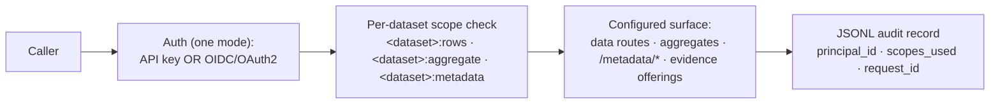

This document defines the HTTP protocol contract that Registry Relay exposes: the configuration-driven service model that fixes a gateway's surface, how a caller authenticates and is scoped per dataset, how governed Evidence Gateway PDP enforcement applies to configured read routes, the consultation and aggregate routes that read configured sources, the scope-filtered metadata publication, the evidence-offering descriptors, the optional signed response credentials, and the audit and error behavior every request carries. It is the precise, citable version of the behavior the [Registry Relay API reference](../../reference/apis/registry-relay/) describes narratively.

It refines the Registry Relay component defined in [RS-ARC-G](../rs-arc-g/) Section 3 (specifically REQ-ARC-G-003, REQ-ARC-G-004, REQ-ARC-G-006, and REQ-ARC-G-007) one level of detail down, from architectural boundary to wire behavior. Where this document and RS-ARC-G state the same constraint, RS-ARC-G is the general invariant and this document is its protocol-level form. It is the Relay counterpart to [RS-PR-NOTARY](../rs-pr-notary/), which specifies Registry Notary.

The key words in this document are interpreted per [RS-DOC](../rs-doc/) Section 2. Defined terms are used per [RS-TERMS](../rs-terms/).

## Version history

| Version | Date | Status | Change |
| --- | --- | --- | --- |
| 0.1.0 | 2026-06-13 | draft | Initial protocol contract, distilled from the Registry Relay API reference, the publishing-pipeline explanation, the boundary map, and the generated OpenAPI document. |
| 0.1.1 | 2026-06-20 | draft | Document governed Evidence Gateway PDP enforcement, aggregate authorization ordering, metadata filtering boundaries, and PDP audit provenance. |
| 0.1.2 | 2026-06-21 | draft | Clarified aggregate disclosure limits and privacy-budget boundaries. |
| 0.2.0 | 2026-07-07 | draft | Corrected REQ-PR-RELAY-020's trust-context header names to the actual wire names, and clarified that the signed response credential surfaces of Section 8 are gated by runtime configuration (the `provenance` key), not a Cargo feature, distinguishing them from the genuinely feature-gated OGC and SP DCI adapters. |
| 0.2.1 | 2026-07-07 | draft | Documented the five further trust-context headers Relay parses without a scope guard alongside REQ-PR-RELAY-020, noting they are not currently wired to any Relay policy decision. |

## 1. Scope and references

This specification covers Registry Relay's externally observable protocol behavior:

- The configuration-driven service model and its fail-closed startup.
- Authentication and per-dataset scope enforcement, including the purpose header.
- Governed Evidence Gateway PDP enforcement for configured read routes.
- The consultation data routes (entities, records, relationships, schemas) and the aggregate routes.
- Scope-filtered metadata publication at `/metadata/*`.
- Evidence-offering descriptors and their boundary with Registry Notary.
- The optional signed response credentials.
- The audit obligation, the error format, and the feature-gated surfaces.

This specification does not define:

- Exact routes and schemas: The generated OpenAPI document, rendered as the [Registry Relay API reference](../../reference/apis/registry-relay/), is the authoritative abstract route and schema reference. A configured gateway can also expose its instance-specific `GET /openapi.json` when `openapi_requires_auth` allows it. This document states behavior a schema cannot, and does not restate request and response shapes that would drift from the generated source.
- The metadata manifest format: The `metadata.yaml` schema and its renderers are owned by Registry Manifest and specified by [RS-DM-MANIFEST](../rs-dm-manifest/). This document refers to the manifest only where Relay serves or scopes its compiled artifacts.
- Security model internals: Key management, the OIDC trust configuration, and audit-envelope structure belong to [RS-SEC-G](../rs-sec-g/) and deeper security specifications. This document states the authorization behavior a caller observes.
- Per-deployment shape: Concrete dataset ids, entity names, aggregate ids, scope strings, and evidence-offering ids are runtime configuration, not contract data.

For how a manifest's compiled artifacts flow into the runtime services, see the [architecture overview](../../explanation/architecture/) and [RS-ARC-G](../rs-arc-g/) Section 4. For the component boundaries, see [RS-ARC-G](../rs-arc-g/) Section 3 and the [boundary map](../../map/boundaries-and-map/). Media types and feature names are used per [RS-TERMS](../rs-terms/).

## 2. Service surface and configuration model

Registry Relay turns sensitive government tabular files and database tables (CSV, XLSX, Parquet, PostgreSQL) into protected, read-only, domain-oriented consultation APIs. A gateway's reachable surface is fixed by its configuration: the routes, datasets, and scopes a caller can use are decided at startup, not at request time.

REQ-PR-RELAY-001: Registry Relay MUST NOT mutate source registry data in v1. Sources are read as batch snapshots or table scans; there is no event-stream backend and no source-registry write-back or domain-data mutation route. This is the protocol-level form of REQ-ARC-G-003.

REQ-PR-RELAY-002: The routes, datasets, and scopes a gateway exposes MUST be fixed by configuration. Registry Relay MUST NOT widen a caller's reach at request time beyond what configuration grants.

REQ-PR-RELAY-003: At startup, Registry Relay MUST validate the compiled manifest and cross-check that every runtime binding resolves to a declared dataset and entity. It MUST exit non-zero when manifest validation fails (`metadata.manifest.validation_failed`) or a binding does not resolve (`runtime.binding.*`), so misconfiguration is visible before the service accepts traffic rather than as a runtime error.

REQ-PR-RELAY-004: Public route paths MUST identify resources by dataset and entity identifiers, not by storage table names or SQL. Internal source shapes are configuration internals and MUST NOT appear in the public surface.

## 3. Authentication and authorization

A Relay instance runs exactly one authentication mode, configured under `auth`. Access is scope-based per dataset.

The diagram restates the request path: a caller authenticates in the instance's single mode, the request is checked against the dataset-scoped permission for the surface it touches, the configured surface answers, and the request is recorded. Liveness and readiness probes sit outside this path and are unauthenticated.

REQ-PR-RELAY-005: A Registry Relay instance MUST run exactly one authentication mode, either API key or OIDC/OAuth2, configured under `auth`.

REQ-PR-RELAY-006: Access MUST be scope-checked per dataset: a caller MUST hold the dataset-scoped permission for the surface it reads (for example `<dataset_id>:rows` for record reads, `<dataset_id>:aggregate` for aggregate reads, or `<dataset_id>:metadata` for catalog artifacts). Liveness and readiness probes MUST be served without authentication.

REQ-PR-RELAY-007: Where an entity or aggregate source sets `api.require_purpose_header: true`, a request that omits the `Data-Purpose` header MUST be rejected with `400 auth.purpose_required`. Where the header is present, it MUST be recorded in the request's audit record.

Governed Evidence Gateway policy enforcement is an additional runtime decision, not a replacement for authentication or dataset scopes. Relay uses the supported PDP profile when runtime configuration selects a governed ecosystem binding or declares a governed policy for an entity or aggregate source. The supported profile covers policy identity and hash, supported ODRL purpose and spatial terms, purpose, jurisdiction, assurance allow-list and minimum assurance, source freshness, required legal basis and consent, redaction, requested fact and disclosure, source binding, route identity, and checked scope. Unsupported ODRL terms or invalid policy identity fail closed.

REQ-PR-RELAY-019: A governed Relay read MUST receive a PDP permit before returning entity-backed data or aggregate data. If the PDP denies the request, Relay MUST fail closed and return a stable `pdp.*` problem code rather than falling back to an ungoverned read. The stable denial codes include `pdp.purpose_not_permitted`, `pdp.assurance_insufficient`, `pdp.evidence_stale`, `pdp.legal_basis_required`, `pdp.consent_required`, `pdp.jurisdiction_not_permitted`, `pdp.unsupported_policy_term`, `pdp.policy_id_required`, and `pdp.policy_hash_invalid`.

REQ-PR-RELAY-020: Relay MUST ignore request trust-context headers unless the authenticated principal is scoped to assert that exact trust value. The supported trust-context headers are `x-registry-trust-jurisdiction`, `x-registry-trust-assurance`, `x-registry-trust-legal-basis`, `x-registry-trust-consent`, and `x-registry-source-observed-age-seconds`. Unscoped or malformed trust metadata MUST NOT satisfy the PDP gate.

Relay also parses five further headers without a scope guard: `x-registry-subject-ref`, `x-registry-relationship`, `x-registry-on-behalf-of`, `x-registry-credential-format`, and `x-registry-source-observed-at-unix-seconds`. These populate the request's trust context for the PDP, but none of them are currently wired to any Relay policy decision.

REQ-PR-RELAY-021: Aggregate routes MUST perform ordinary aggregate and source-read scope authorization before invoking governed PDP enforcement. A scope denial MUST return `auth.scope_denied` and MUST NOT report PDP policy provenance. For aggregate execution, the PDP checked-scope value MUST be the source entity read scope unless the aggregate is configured for aggregate-only execution, in which case it MUST be the aggregate scope.

REQ-PR-RELAY-022: A governed PDP decision MUST be audit-provenanced. Relay MUST attach the PDP policy id, policy hash, evaluated rule ids, stable problem code when denied, ecosystem binding id and version when selected, route identity, source binding, checked scopes, and trust provenance that the PDP evaluated to the request audit context.

The internals of key handling and OIDC trust configuration are a security-model concern specified by [RS-SEC-G](../rs-sec-g/).

## 4. Consultation data routes

Registry Relay serves each configured entity as a domain-oriented read surface: a record collection, a single record, declared relationships between records, and the entity's JSON Schema. The crosswalk feature maps source field names and values to canonical domain terms, so a route returns domain fields rather than raw source columns.

REQ-PR-RELAY-008: Registry Relay MUST serve configured entities as read-only, domain-oriented routes covering record retrieval, single-record retrieval, declared relationships, and the entity JSON Schema. Only the entities, fields, and relationships the configuration binds are reachable; nothing outside the bound surface is exposed.

## 5. Aggregate routes

A gateway may declare aggregates: configured numeric computations (`measures`) over dimensions, returned as statistical observations. The aggregate output follows an SDMX-JSON shape.

REQ-PR-RELAY-009: A declared aggregate MUST return statistical observations computed from its configured `measures` over its dimensions, accompanied by the structure (dimensions and measures) needed to interpret them. The exact field layout is defined by the generated OpenAPI document, and the native and SDMX-JSON serializations differ in where they place that structure. When serialized as SDMX-JSON, the media type is `application/vnd.sdmx.data+json;version=2.1`. The aggregate's dimensions and measures are discoverable on their respective routes.

Aggregate routes are statistical outputs, not a longitudinal privacy-budget mechanism. A deployment may configure suppression, minimum cell sizes, PDP policy, or downstream review around aggregate routes, but Relay v1 does not by itself track cumulative disclosure across repeated or overlapping aggregate queries. Documentation, data protection impact assessments, and client guidance must not describe a Relay aggregate route as privacy-budgeted unless a separate deployed control provides that guarantee.

## 6. Metadata publication

Registry Relay can serve the manifest's standards-shaped metadata at `/metadata/*`, using the Registry Manifest renderers at request time. Unlike a static publication, the runtime view is filtered by the caller's identity: a caller sees only the datasets, entities, and aggregate metadata its `metadata` scope permits. This publication filtering is distinct from the governed PDP enforcement in Section 3: metadata routes reveal scoped descriptions of the configured surface, while PDP gates runtime reads of governed data.

REQ-PR-RELAY-010: Where metadata publication is enabled, Registry Relay MAY serve catalog, DCAT, BRegDCAT-AP, SHACL, JSON Schema, ODRL, evidence-offering, and OGC API Records artifacts at `/metadata/*`. The runtime view MUST be filtered by the caller's `metadata` scope, so a caller whose scope covers one dataset does not receive metadata for datasets it cannot read. Relay does not expose a current CPSV-AP runtime metadata route.

REQ-PR-RELAY-011: Registry Relay MUST NOT define or version the metadata manifest format. The schema and its renderers are owned by Registry Manifest; Registry Relay serves compiled artifacts and scopes them for callers but does not own the contract. This is the protocol-level form of REQ-ARC-G-006.

REQ-PR-RELAY-023: Metadata publication MUST remain an authorization-filtered publication surface. Relay MUST NOT treat publication of scoped ODRL, catalog, schema, or evidence-offering metadata as a PDP permit for a later data read, and MUST NOT treat a data-read PDP permit as authorization to publish metadata outside the caller's metadata scopes.

## 7. Evidence offerings

Registry Relay publishes evidence-offering metadata describing where a caller reaches a Registry Notary for verification. Relay routes the caller to Notary; it does not perform the verification.

REQ-PR-RELAY-012: Registry Relay MAY publish evidence-offering metadata at `GET /metadata/evidence-offerings` and `GET /metadata/evidence-offerings/{offering_id}`, naming the Registry Notary endpoint, the claim ids, and the supported disclosure modes and formats for an offering. Registry Relay MUST NOT perform claim evaluation or issue credentials itself. This is the protocol-level form of REQ-ARC-G-007.

## 8. Signed response credentials

Signed response credentials are an opt-in feature that attaches verifiable provenance to a consultation response. They are distinct from the credentials Registry Notary issues.

REQ-PR-RELAY-013: Signed response credentials are opt-in, enabled by the `provenance` configuration key. When the feature is enabled and a caller requests one of the configured `accepted_media_types` (by default `application/vc+jwt` or `application/jwt`), Registry Relay MAY attach a W3C Verifiable Credentials Data Model (VCDM) 2.0 VC-JWT to an entity-record or aggregate response, and MUST publish the supporting JSON Schemas under `/schemas/...` and JSON-LD contexts under `/contexts/...`. In gateway issuer mode, Registry Relay MUST publish the issuer `did:web` document at `/.well-known/did.json`; in delegated issuer mode it MUST NOT, because the delegating ministry hosts the DID document for its own domain.

REQ-PR-RELAY-014: A signed response credential is a VCDM 2.0 VC-JWT over a Relay consultation response. It MUST NOT be described as an SD-JWT VC, and a Registry Notary SD-JWT VC credential MUST NOT be described as a VCDM VC-JWT. REQ-ARC-G-008's prohibition on a VCDM envelope binds Registry Notary credentials (RS-PR-NOTARY), not Relay's optional response provenance; the two are different artifacts produced by different services.

## 9. Audit and error behavior

Registry Relay records every data and metadata read in a JSONL audit trail. Audit covers the principal, the scopes exercised, and the request, so a reviewer can reconstruct who read what under which permission.

REQ-PR-RELAY-015: Every record read and every metadata request MUST produce a JSONL audit record carrying the caller's `principal_id`, the `scopes_used`, and the `request_id`. This is the protocol-level form of REQ-ARC-G-004.

REQ-PR-RELAY-016: Error responses MUST use the problem-details media type `application/problem+json` ([RFC 9457](https://www.rfc-editor.org/info/rfc9457)).

## 10. Feature-gated surfaces

Several surfaces mount only when the gateway is built with the matching Cargo feature; others mount only when runtime configuration enables them. A reader MUST NOT infer their presence from the route catalog of a different build or a different configuration.

REQ-PR-RELAY-017: The OGC API Features, Records, and EDR adapters, and the SP DCI sync routes, mount only when the gateway is built with the matching Cargo feature. The signed response credential surfaces of Section 8 mount only when runtime configuration enables the `provenance` key; they are not gated by a Cargo feature. A conformance claim against this specification MUST NOT imply a surface that the deployed build does not mount or that the running configuration does not enable.

REQ-PR-RELAY-018: Admin routes MUST be served on a separate, optional admin listener and MUST NOT appear in the public OpenAPI document. Reload and configuration mutation routes MUST require the `registry_relay:admin` scope, metrics MUST require `registry_relay:metrics_read`, and operational posture reads MUST require `registry_relay:ops_read`. Runtime deployments gate the public OpenAPI document by default; it is exposed without authentication only when `openapi_requires_auth` is disabled for demos or controlled tooling.

## 11. Limitations

These constraints are stated so a reader does not infer a capability from the route list that the reviewed implementation does not provide.

- No source mutation, no streaming: Registry Relay does not mutate source registry data in v1 and reads sources as batch snapshots or table scans; there is no event-stream backend (REQ-PR-RELAY-001).
- Feature-gated and config-gated surfaces: OGC adapters and SP DCI sync are present only in builds compiled with the matching Cargo feature; signed response credentials are present only when runtime configuration enables the `provenance` key, not via a Cargo feature (REQ-PR-RELAY-017).
- No claim evaluation: Relay describes evidence offerings but never evaluates a claim or issues a credential; that is Registry Notary's role (REQ-PR-RELAY-012).
- Manifest format not owned here: The metadata schema and renderers belong to Registry Manifest; Relay serves and scopes the artifacts only (REQ-PR-RELAY-011).
- PDP enforcement boundary: Governed PDP enforcement applies to configured runtime reads; scoped metadata publication remains a separate publication and discovery surface (REQ-PR-RELAY-019, REQ-PR-RELAY-023).
- Aggregate disclosure boundary: Aggregate routes return configured statistical observations and may be protected by scopes and PDP policy, but they do not provide a built-in longitudinal privacy budget or cumulative differencing protection (REQ-PR-RELAY-009).

## Conformance

A Registry Relay deployment conforms to this specification when it:

- exposes no source-registry mutation route and never widens a caller's reach at request time (REQ-PR-RELAY-001, REQ-PR-RELAY-002);
- fails closed at startup on manifest or binding errors, and keeps storage internals out of the public surface (REQ-PR-RELAY-003, REQ-PR-RELAY-004);
- runs a single auth mode, scope-checks per dataset, leaves probes unauthenticated, and enforces the purpose header where configured (REQ-PR-RELAY-005, REQ-PR-RELAY-006, REQ-PR-RELAY-007);
- enforces the supported Evidence Gateway PDP profile for governed reads, filters trust metadata by principal scope, preserves aggregate authorization ordering, and audits PDP provenance (REQ-PR-RELAY-019, REQ-PR-RELAY-020, REQ-PR-RELAY-021, REQ-PR-RELAY-022);
- serves only the bound entities, fields, and relationships as read-only routes (REQ-PR-RELAY-008);
- returns aggregate observations computed from configured measures, in both native and SDMX-JSON serializations (REQ-PR-RELAY-009);
- scope-filters the metadata it serves, does not own the manifest format, and keeps metadata publication separate from runtime PDP authorization (REQ-PR-RELAY-010, REQ-PR-RELAY-011, REQ-PR-RELAY-023);
- describes evidence offerings without performing verification (REQ-PR-RELAY-012);
- treats signed response credentials as opt-in VCDM VC-JWT provenance, distinct from Notary's SD-JWT VC (REQ-PR-RELAY-013, REQ-PR-RELAY-014);
- audits every data and metadata read, and reports errors as problem+json (REQ-PR-RELAY-015, REQ-PR-RELAY-016);
- mounts Cargo-feature-gated, configuration-gated, and admin surfaces only as built and configured (REQ-PR-RELAY-017, REQ-PR-RELAY-018).

Conformance to this specification does not imply conformance to any external standard cited in the `standards_referenced` frontmatter field. Each standard's adoption mode and scope are documented in the [standards register](../../reference/standards/).

## Evidence

This specification is `verified`: every requirement describes shipped behavior a reader can inspect, per RS-DOC REQ-DOC-014.

- The [Registry Relay API reference](../../reference/apis/registry-relay/) carries the narrative context and links the generated OpenAPI (Redoc) document, the authoritative route and schema reference for every route named here.
- The [boundary map](../../map/boundaries-and-map/) records Registry Relay's boundaries with source citations, including the read-only, manifest-not-owned, no-claim-evaluation, and storage-internals-hidden constraints that Sections 2, 6, and 7 make precise.
- The [architecture overview](../../explanation/architecture/) gives the narrative data and contract flow, including the scope-filtered runtime metadata views, that Sections 2 and 6 refine.
- The [standards register](../../reference/standards/) records the adoption mode for DCAT, BRegDCAT-AP, SHACL, ODRL, OGC API Records, OGC API Features, OGC API EDR, SDMX, SP DCI, and the W3C standards listed in `standards_referenced`.
- [RS-ARC-G](../rs-arc-g/) Section 3 and Section 5 hold the architectural invariants (REQ-ARC-G-003/004/006/007) that this document refines.

## Next

- [RS-PR-NOTARY](../rs-pr-notary/) specifies Registry Notary, the verification counterpart that Relay's evidence offerings point to.
- [RS-ARC-G](../rs-arc-g/) places Registry Relay in the registry stack architecture.
- [RS-TERMS](../rs-terms/) defines the consultation, metadata, and credential vocabulary used here.
- [Registry Relay API reference](../../reference/apis/registry-relay/) is the route-level reference and the link to the generated OpenAPI document.
