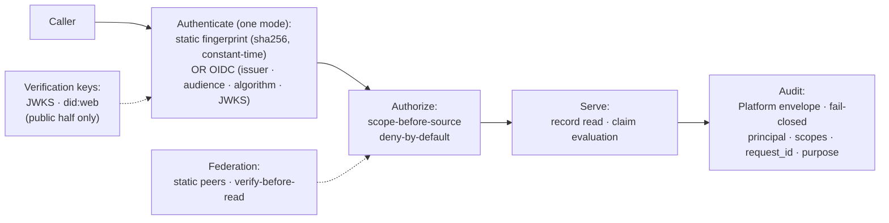

This document defines the security model shared across the registry stack: where the security-critical primitives live, how a caller authenticates and is authorized, how a service publishes the keys a verifier needs, what every request that touches person-level data MUST record, how delegated evaluation is trusted, and where the operator's responsibility begins. It is the cross-cutting (general) security specification that the protocol specifications refine for their own surfaces.

It refines the security-relevant invariants of [RS-ARC-G](../rs-arc-g/) Section 5 (specifically REQ-ARC-G-004 and REQ-ARC-G-005) one level of detail down, from architectural invariant to security model. Where this document and RS-ARC-G state the same constraint, RS-ARC-G is the general invariant and this document is its security-model form. The wire-level form of these constraints lives in [RS-PR-NOTARY](../rs-pr-notary/) and [RS-PR-RELAY](../rs-pr-relay/); where this document and a protocol specification state the same constraint, this document is the cross-cutting model and the protocol specification is its surface-specific form.

The key words in this document are interpreted per [RS-DOC](../rs-doc/) Section 2. Defined terms are used per [RS-TERMS](../rs-terms/).

## Version history

| Version | Date | Status | Change |
| --- | --- | --- | --- |
| 0.1.0 | 2026-06-13 | draft | Initial security model, distilled from the boundary map, the architecture overview, the Registry Relay and Registry Notary API references, the Registry Notary signing-key reference, and the two protocol specifications. |
| 0.1.1 | 2026-06-21 | draft | Clarified key custody, readiness, public error detail, and principal-scoped cache boundaries. |

## 1. Scope and references

This specification covers the security model that holds across the runtime services:

- The shared security primitives and where they are sourced.
- Authentication: the two modes and what each one verifies.
- Authorization: the scope model and its deny-by-default, scope-before-source posture.
- Verification-key publication and the public/private key boundary.
- The audit obligation and its fail-closed posture.
- Federation trust: static peers and verify-before-read.
- The transport and error posture, and the outbound-call policy.
- The operator boundary: what this model leaves to the deployment.

This specification does not define:

- **Exact configuration schemas, algorithms, and parameters.** Concrete signing algorithms and key sizes, token and cache windows, entropy floors, the precise security-header set, and the precise outbound allow and deny rules are configuration and operational detail, not contract data. For the configurable surface, see the [Registry Notary operator configuration reference](../../products/registry-notary/operator-config-reference/), the [Registry Notary signing-key reference](../../products/registry-notary/signing-key-provider/), and the [Registry Relay client integration](../../products/registry-relay/client-integration/) guide.
- **Surface-specific protocol behavior.** How each service applies this model to its own routes, request shapes, and error codes belongs to [RS-PR-NOTARY](../rs-pr-notary/) and [RS-PR-RELAY](../rs-pr-relay/).
- **Key custody and secret provisioning.** How private keys and credentials are stored, injected, and rotated in a deployment (environment, file, hardware module) is an operator responsibility, addressed in Section 9.
- **Deeper service-internal security mechanisms.** The internal structure of credential fingerprints, the audit envelope, and the replay store, beyond the externally observable behavior stated here, is reserved for future deeper specifications.

For the components named here and their boundaries, see [RS-ARC-G](../rs-arc-g/) Section 3 and the [boundary map](../../map/boundaries-and-map/). For the narrative security context, see the [architecture overview](../../explanation/architecture/) and [Evidence issuance, end to end](../../explanation/evidence-issuance/).

## 2. Shared security primitives

The registry stack concentrates its security-critical behavior in Registry Platform so that it behaves identically across services and can be reviewed in one place. Registry Platform supplies authentication helpers, OpenID Connect (OIDC) verification, audit envelopes, HTTP security, outbound HTTP policy, cryptography, and Selective Disclosure JWT Verifiable Credential (SD-JWT VC) helpers. Registry Relay and Registry Notary own how those primitives are configured and enforced on their own routes.

REQ-SEC-G-001: A security-critical primitive that must behave identically across runtime services (authentication, OIDC verification, audit envelopes, HTTP security, outbound HTTP policy, cryptography, and SD-JWT VC helpers) SHOULD be sourced from Registry Platform rather than reimplemented per service. This is the security-model form of REQ-ARC-G-005, and it keeps cross-service security behavior consistent and auditable in one place.

## 3. Authentication

A runtime service authenticates in exactly one mode, fixed by configuration. The security pipeline every request follows, and the trust inputs that feed it, are shown below.

The diagram restates the model: a caller authenticates in the instance's single mode, the request is authorized against the scope its target requires before any source is read, the service serves the configured surface, and the request is recorded. Verification keys are published so a verifier can check issued artifacts; delegated evaluation is admitted only from configured peers.

REQ-SEC-G-002: A runtime service MUST run exactly one authentication mode, either static credentials or OIDC, and MUST authenticate every route that returns person-level records or claim results before it produces a response.

REQ-SEC-G-003: In static-credential mode, the configured trust material MUST be a credential fingerprint (`sha256:<...>`), not the raw secret, and the service MUST compare the presented token against the configured fingerprints in constant time, so neither the stored configuration nor the comparison timing discloses the secret.

REQ-SEC-G-004: In OIDC mode, the service MUST delegate token verification to the Registry Platform OIDC primitive. A token MUST be trusted only after its signature is verified against the configured issuer's JWKS and its issuer, an accepted audience, and a permitted signing algorithm are checked. The service still owns the scopes its routes require (Section 4).

## 4. Authorization

Authorization is scope-based and deny-by-default: a caller reaches only what its scopes grant, and the grant is fixed by configuration rather than widened at request time.

REQ-SEC-G-005: Authorization MUST be scope-based and deny-by-default. A caller MUST hold the scope a route requires, and the service MUST enforce that scope before it reads any source or evaluates any claim (scope-before-source), so a caller that lacks a required scope is refused before source access, not after.

REQ-SEC-G-006: A service MUST NOT widen a caller's reach at request time beyond what configuration grants. Only liveness and readiness probes and public verification-key discovery (the issuer JWKS and, where published, the `did:web` document) are served without authentication; every claim-bearing and record-bearing route requires authentication.

## 5. Verification-key publication

A verifier needs the issuer's public key to check a credential or a signed response, and it needs that key without holding a credential of its own. The model therefore separates the published public half from the private signing material, which never leaves the issuer.

REQ-SEC-G-007: An issuer MUST sign with an asymmetric key and MUST publish only the public half, through the issuer JWKS and, for Registry Relay response provenance in gateway mode, a `did:web` document (per REQ-PR-RELAY-013). Private key material MUST NOT be published and MUST NOT be required by a verifier. A key that is being rotated out MAY remain published for verification while credentials it signed are still within their validity, so a verifier can check previously issued artifacts across a rotation.

The custody mechanism for the private key (environment, file, or hardware module) is a deployment choice, described in the [signing-key reference](../../products/registry-notary/signing-key-provider/) and out of scope here (Section 9).

Readiness, liveness, and protocol conformance checks show that a service has loaded configuration and can serve the expected protocol surface. They do not certify production-grade private-key custody. A deployment that uses software keys, local JWK files, or demo-generated keys can still be reachable and internally consistent; production custody, rotation, and approval of a key provider remain operator responsibilities under Section 9.

## 6. Audit

Every request that touches person-level data is recorded. Audit is a security control, not best-effort logging: a deployment can require that a request which cannot be recorded does not succeed.

REQ-SEC-G-008: Every request that returns person-level records or claim results MUST be recorded in a Registry Platform audit envelope, capturing at least the caller principal, the scopes exercised, a request identifier, and the `Data-Purpose` value where the caller supplied one. This is the security-model form of REQ-ARC-G-004; it states an invariant a conforming deployment meets, not a claim that every route in a given build has been individually audited.

REQ-SEC-G-009: A deployment MUST be able to run audit fail-closed, so that a request whose audit record cannot be written does not return a successful result. A service MUST NOT silently drop an audit record on the success path.

## 7. Federation trust

Delegated evaluation crosses a trust boundary between two services. The model admits only configured peers and verifies the full request before any source is read.

REQ-SEC-G-010: Delegated evaluation MUST be static-peer only: peers are loaded from configuration at startup, and a request from an unconfigured peer MUST be rejected. Before any source read, the serving service MUST verify the peer's identity and request signature, the request's freshness and single use, and its purpose, profile, and audience. This is the security-model form of REQ-ARC-G-009 and the cross-cutting form of REQ-PR-NOTARY-018 and REQ-PR-NOTARY-019. Dynamic trust-chain discovery, shared replay storage, and federated credential issuance are out of scope for this version and MUST NOT be implied by a conformance claim against this specification.

## 8. Transport and outbound-call posture

Services present a consistent error surface and constrain the calls they make outward.

REQ-SEC-G-011: Error responses MUST use the problem-details media type `application/problem+json` ([RFC 9457](https://www.rfc-editor.org/info/rfc9457)), except on a route whose own protocol defines a different error envelope (for example the OID4VCI routes, per REQ-PR-NOTARY-022).

REQ-SEC-G-012: A runtime service SHOULD apply the Registry Platform HTTP-security primitive (security response headers) on its served surface, and outbound source fetches SHOULD be governed by the Registry Platform outbound-HTTP-policy primitive, which constrains the destinations a source connector may reach. The concrete header set and the outbound allow and deny rules are operational detail (Section 1).

Problem details are a client-facing protocol surface, not an operator diagnostic channel. Stable problem codes and titles belong in responses; raw bearer tokens, private keys, source values, local filesystem paths, and unbounded internal error chains belong in protected operator logs. Principal-scoped responses, including scoped metadata and claim results, are not public cache entries: where a response varies by authenticated principal, scope, purpose, or authorization context, deployments use cache controls appropriate to that sensitivity, such as private or no-store semantics and `Vary: Authorization` where a response is cacheable.

## 9. The operator boundary

The security model ends where the deployment begins. The following are operator responsibilities, not behavior this specification defines: secret and key provisioning, key custody and the rotation schedule, audit retention and storage, tenant isolation, transport termination and certificate management, network rate limiting at the edge, deployment configuration, and incident response. Registry Platform and the runtime services provide the primitives; the operator provisions, configures, and operates them.

REQ-SEC-G-013: An implementation MUST NOT embed secret material (private keys, credential secrets, audit-chain secrets) in a portable metadata artifact or in any artifact intended for distribution or inspection. Secrets are provided to a running service by the operator at deployment time.

## Conformance

A registry stack deployment conforms to this specification when it:

- sources its cross-service security primitives from Registry Platform (REQ-SEC-G-001);
- runs a single authentication mode and authenticates every claim- or record-bearing route (REQ-SEC-G-002);
- compares static credentials as constant-time fingerprint checks and never configures the raw secret (REQ-SEC-G-003);
- verifies OIDC tokens by signature, issuer, audience, and permitted algorithm before trusting them (REQ-SEC-G-004);
- authorizes scope-before-source and deny-by-default, and never widens reach at request time (REQ-SEC-G-005, REQ-SEC-G-006);
- publishes only public verification keys and keeps private material unpublished (REQ-SEC-G-007);
- audits every request touching person-level data and can run audit fail-closed (REQ-SEC-G-008, REQ-SEC-G-009);
- admits delegated evaluation only from verified static peers, fully checked before any source read (REQ-SEC-G-010);
- reports errors as problem+json outside route-specific error envelopes, and applies the shared HTTP-security and outbound-policy primitives (REQ-SEC-G-011, REQ-SEC-G-012);
- keeps secrets out of distributable artifacts and leaves provisioning to the operator (REQ-SEC-G-013).

Conformance to this specification does not imply conformance to any external standard cited in the `standards_referenced` frontmatter field, nor to OpenID Connect, OAuth 2.0, or any other authentication or authorization framework named in prose. Each cited standard's adoption mode and scope are documented in the [standards register](../../reference/standards/).

## Evidence

This specification is `verified`: every requirement describes shipped behavior a reader can inspect, per RS-DOC REQ-DOC-014.

- The [boundary map](../../map/boundaries-and-map/) records that the security primitives (authentication, OIDC, audit envelopes, HTTP security, outbound HTTP policy, cryptography, SD-JWT VC helpers) are owned by Registry Platform and that secret provisioning, audit retention, tenant isolation, deployment configuration, and incident response are operator responsibilities, which Sections 2 and 9 make precise.
- The [Registry Notary API reference](../../reference/apis/registry-notary/) and [Registry Relay API reference](../../reference/apis/registry-relay/) describe the two authentication modes, the constant-time fingerprint comparison, the OIDC trust inputs, the per-dataset and per-claim scopes, and the unauthenticated probes that Sections 3 and 4 state normatively.
- The [Registry Notary signing-key reference](../../products/registry-notary/signing-key-provider/) describes JWKS publication, the public/private key boundary, and rotation, which Section 5 states normatively.
- [RS-PR-NOTARY](../rs-pr-notary/) and [RS-PR-RELAY](../rs-pr-relay/) carry the surface-level form of the authentication, authorization, key-publication, audit, federation, and error requirements this document generalizes.
- [RS-ARC-G](../rs-arc-g/) Section 5 holds the architectural invariants (REQ-ARC-G-004, REQ-ARC-G-005) that Sections 2 and 6 refine.
- The [standards register](../../reference/standards/) records the adoption mode for SD-JWT VC, OID4VCI, and the W3C DID method listed in `standards_referenced`.

## Next

- [RS-ARC-G](../rs-arc-g/) places the security model in the registry stack architecture.
- [RS-PR-NOTARY](../rs-pr-notary/) and [RS-PR-RELAY](../rs-pr-relay/) apply this model to each service's protocol surface.
- [RS-TERMS](../rs-terms/) defines the security and credential vocabulary used here.
- [Evidence issuance, end to end](../../explanation/evidence-issuance/) is the narrative explanation of claim evaluation, disclosure, and audit.
