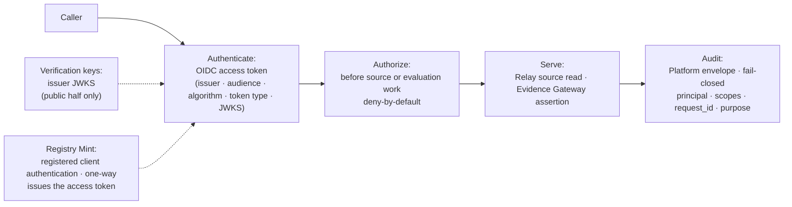

This document defines the security model shared across the registry stack: where the security-critical primitives live, how a caller authenticates and is authorized, how a service publishes the keys a verifier needs, what every request that touches person-level data MUST record, how replay decisions remain authoritative, and where the operator's responsibility begins. It is the cross-cutting (general) security specification that the protocol specifications refine for their own surfaces.

It refines the security-relevant invariants of [RS-ARC-G](../rs-arc-g/) Section 5 (specifically REQ-ARC-G-004 and REQ-ARC-G-005) one level of detail down, from architectural invariant to security model. Where this document and RS-ARC-G state the same constraint, RS-ARC-G is the general invariant and this document is its security-model form. The wire-level form of these constraints lives in [RS-PR-EVIDENCE](../rs-pr-evidence/) and [RS-PR-RELAY](../rs-pr-relay/); where this document and a protocol specification state the same constraint, this document is the cross-cutting model and the protocol specification is its surface-specific form.

The key words in this document are interpreted per [RS-DOC](../rs-doc/) Section 2. Defined terms are used per [RS-TERMS](../rs-terms/).

## Version history

| Version | Date | Status | Change |
| --- | --- | --- | --- |
| 0.1.0 | 2026-06-13 | draft | Initial security model, distilled from the boundary map, the architecture overview, the Registry Relay and the now-removed Registry Notary API references, the Registry Notary signing-key reference, and the two protocol specifications. |
| 0.1.1 | 2026-06-21 | draft | Clarified key custody, readiness, public error detail, and principal-scoped cache boundaries. |
| 0.2.0 | 2026-07-07 | draft | Enumerated the full unauthenticated surface in REQ-SEC-G-006 and anchored the evidence section to the enforcing code. |
| 0.3.0 | 2026-07-13 | draft | Assigned registry source access to Relay and restated Notary authorization and federation gates in terms of compiler-pinned Relay consultations. Those Notary gates are retired as of 0.5.0. |
| 0.4.0 | 2026-07-19 | draft | Defined the product-owned Relay and Notary replay-protection boundaries, retention references, failure posture, and stale-recovery invariant. The Notary boundary is retired as of 0.5.0. |
| 0.5.0 | 2026-08-03 | draft | Registry Notary is retired. Removed Section 7 (federation trust) and REQ-SEC-G-010, renumbered the following sections, restated REQ-SEC-G-002, REQ-SEC-G-005, REQ-SEC-G-006, REQ-SEC-G-011, REQ-SEC-G-014, and REQ-SEC-G-015 for Registry Relay, Evidence Gateway, and Registry Mint, and added REQ-SEC-G-016 and REQ-SEC-G-017. |
| 0.6.0 | 2026-08-07 | draft | Clarified that Evidence Gateway durably records an access attempt before every actual source stage in a closed acquisition. |
| 0.7.0 | 2026-08-11 | draft | The Relay V1 runtime and its adopter tooling are retired. Restated REQ-SEC-G-002, REQ-SEC-G-004, REQ-SEC-G-005, REQ-SEC-G-006, REQ-SEC-G-009, and REQ-SEC-G-012 for the Relay V2 runtime, rewrote Section 7 around the one replay authority the stack still holds, retired REQ-SEC-G-003, REQ-SEC-G-014, and REQ-SEC-G-015, and added REQ-SEC-G-018. |
| 0.8.0 | 2026-08-13 | draft | Added Registry Mint's explicit client-secret compatibility path to REQ-SEC-G-016 while retaining asymmetric client assertions as the default and sole method for Evidence and delegated authority. |

## 1. Scope and references

This specification covers the security model that holds across the runtime services:

- The shared security primitives and where they are sourced.
- Authentication: the caller modes and what each one verifies.
- Authorization: the scope model and its deny-by-default, scope-before-source posture.
- Verification-key publication and the public/private key boundary.
- The audit obligation and its fail-closed posture.
- Product-owned replay protection: where a replay decision may live, how it is bounded, and what a service that holds none may claim.
- The transport and error posture, and the outbound-call policy.
- The operator boundary: what this model leaves to the deployment.

This specification does not define:

- **Exact configuration schemas, algorithms, and parameters.** Concrete signing algorithms and key sizes, configurable token and cache windows, entropy floors, the precise security-header set, and the precise outbound allow and deny rules are configuration and operational detail, not contract data. For the configurable surface, see [Configure Relay](../../configure/relay/), [Configure Evidence Gateway](../../configure/evidence/), and [Configure Registry Mint](../../configure/mint/).
- **Surface-specific protocol behavior.** How each service applies this model to its own routes, request shapes, and error codes belongs to [RS-PR-EVIDENCE](../rs-pr-evidence/) and [RS-PR-RELAY](../rs-pr-relay/).
- **Key custody and secret provisioning.** How private keys and credentials are stored, injected, and rotated in a deployment (environment, file, hardware module) is an operator responsibility, addressed in Section 9.
- **Deeper service-internal security mechanisms.** The internal structure of the audit envelope, and of any product replay state beyond the authority, binding, retention, and failure behavior Section 7 states, is reserved for product specifications and operator guidance.

For the components named here and their boundaries, see [RS-ARC-G](../rs-arc-g/) Section 3 and the [boundary map](../../map/boundaries-and-map/). For the narrative security context, see the [architecture overview](../../explanation/architecture/) and the [Evidence Gateway security model](../../security/evidence/).

## 2. Shared security primitives

The registry stack concentrates its security-critical behavior in Registry Platform so that it behaves identically across services and can be reviewed in one place. Registry Platform supplies authentication helpers, OpenID Connect (OIDC) verification, audit envelopes, HTTP security, outbound HTTP policy, cryptography, and Selective Disclosure JWT Verifiable Credential (SD-JWT VC) helpers. Registry Relay, Evidence Gateway, and Registry Mint own how those primitives are configured and enforced on their own routes.

REQ-SEC-G-001: A security-critical primitive that must behave identically across runtime services (authentication, OIDC verification, audit envelopes, HTTP security, outbound HTTP policy, cryptography, and SD-JWT VC helpers) SHOULD be sourced from Registry Platform rather than reimplemented per service. This is the security-model form of REQ-ARC-G-005, and it keeps cross-service security behavior consistent and auditable in one place.

## 3. Authentication

A runtime service verifies its callers against exactly one issuer, fixed by configuration. The following diagram shows the security pipeline every request follows and the trust inputs that feed it.

```mermaid
flowchart LR
    caller["Caller"]
    authn["Authenticate:<br/>OIDC access token<br/>(issuer · audience · algorithm · token type · JWKS)"]
    authz["Authorize:<br/>before source or evaluation work<br/>deny-by-default"]
    serve["Serve:<br/>Relay source read · Evidence Gateway assertion"]
    audit["Audit:<br/>Platform envelope · fail-closed<br/>principal · scopes · request_id · purpose"]
    caller --> authn --> authz --> serve --> audit
    keys["Verification keys:<br/>issuer JWKS<br/>(public half only)"] -.-> authn
    mint["Registry Mint:<br/>registered client authentication · one-way<br/>issues the access token"] -.-> authn
```

The diagram restates the model: a caller presents an access token the service verifies against its one configured issuer, the request is authorized against the scope its target requires before source or evaluation work, the service serves the configured surface, and the request is recorded. Verification keys are published so a verifier can check issued artifacts. Where a deployment has no identity provider, Registry Mint issues the access token the caller presents, and the resource server verifies it as an ordinary OIDC token.

REQ-SEC-G-002: A runtime service MUST verify caller credentials against exactly one issuer, fixed by configuration at startup, and MUST authenticate every route that returns person-level records or evidence assertions before it produces a response. Registry Relay and Evidence Gateway both verify OIDC access tokens against one trusted issuer. Registry Relay MUST refuse to start when its compiled contract carries a protected access profile and no issuer is configured, so a deployment cannot serve a protected operation with caller verification switched off.

REQ-SEC-G-004: The service MUST delegate token verification to the Registry Platform OIDC primitive. A token MUST be trusted only after its signature is verified against the configured issuer's JSON Web Key Set (JWKS) and its issuer, an accepted audience, a permitted signing algorithm, and, where the service configures one, an accepted token type are checked. The service still owns the scopes its routes require (Section 4). Registry Relay and Evidence Gateway both derive the caller's identity only from the verified token and never from a proxy-supplied identity header.

REQ-SEC-G-016: A token issuer that mints access tokens for registered clients MUST authenticate each client with exactly one method selected by that client's server-side registration. The default method MUST be an asymmetric client assertion verified only against the public keys registered for the client the assertion names. A client-secret compatibility method MAY be explicitly enabled only for a standard authorization client and MUST NOT be enabled for Evidence authority or delegation. Its secret MUST be generated from at least 256 bits of operating-system randomness, provisioned outside the registration, represented in the registration only by a canonical SHA-256 fingerprint, and verified in constant time. The authority the minted token carries MUST be read from the issuer's server-side client registry and MUST NOT be read from the assertion or token request. The issuer MUST enforce single use of an assertion identifier (Section 7) and MUST NOT distinguish an unknown client, an authentication-method mismatch, a bad signature or secret, a replayed identifier, and an expired assertion in its public error response, so the token endpoint cannot be used to probe the client registry.

## 4. Authorization

Authorization is scope-based and deny-by-default: a caller reaches only what its scopes grant, and the grant is fixed by configuration rather than widened at request time.

REQ-SEC-G-005: Authorization MUST be scope-based and deny-by-default. A caller MUST hold the scope its target requires. Relay MUST resolve the access profile a request selects and MUST enforce that profile's scope, and any purpose or row-authority constraint the profile carries, before it opens a source query. Evidence Gateway MUST match exactly one configured authority path and MUST enforce the grant it carries before any source read. A caller that lacks a required scope is refused before a protected effect, not after.

REQ-SEC-G-006: A service MUST NOT widen a caller's reach at request time beyond what configuration grants. Every route that returns person-level records or evidence assertions MUST require authentication, and the unauthenticated surface MUST be limited to routes that carry no person-level data:

- liveness and readiness probes;
- public verification-key discovery through the issuer JWKS;
- served documentation and discovery metadata: documentation routes, well-known discovery documents, and published JSON Schemas and JSON-LD contexts;
- the token endpoint of a token issuer, which accepts no anonymous request even though it carries no bearer token of its own.

A route exempt from bearer authentication MAY still enforce a stronger check of its own: the token endpoint admits only a client whose registered authentication method REQ-SEC-G-016 has verified. Evidence Gateway exempts only its probes, its OpenAPI document, its issuer JWKS, and its issuer metadata document; the assertion route and the evidence-definition discovery route both require a verified access token. Registry Relay exempts its two probes, its per-deployment OpenAPI document, and its service metadata document unconditionally, and exempts its resource metadata routes and its generated-artifact route to the extent the deployment's own contract marks that metadata public.

Registry Relay also serves data operations that a governed contract marks as anonymous. Those are not an exception to this requirement. The compiler MUST refuse a contract that gives an anonymous access profile any reviewed source column, or any disclosed property, classified more restrictively than `public` handling, so what an anonymous Relay operation can reach is bounded by the publisher's reviewed classification rather than by operator discipline. That classification is the publisher's declaration of what may be read without a credential, and this specification does not certify it.

## 5. Verification-key publication

A verifier needs the issuer's public key to check a signed artifact, and it needs that key without holding a credential of its own. The model therefore separates the published public half from the private signing material, which never leaves the issuer.

REQ-SEC-G-007: An issuer MUST sign with an asymmetric key and MUST publish only the public half through the issuer JWKS. Private key material MUST NOT be published and MUST NOT be required by a verifier. A key that is being rotated out MAY remain published for verification while artifacts it signed are still within their validity, so a verifier can check previously signed artifacts across a rotation. Evidence Gateway signs with exactly one active ES256/P-256 key, identifies service keys by their RFC 7638 thumbprints, and retains a previous public key for at least the maximum assertion validity plus the accepted clock skew.

The approved custody mechanism depends on assurance: local assurance uses a file-backed private JWK, while production and evidence-grade assurance require Vault/OpenBao Transit through a workload-local Unix-socket proxy. See [Configure Transit signing for Evidence Gateway and Registry Mint](../../tutorials/move-evidence-to-production-signing/).

Readiness, liveness, and protocol conformance checks show that a service has loaded configuration and can serve the expected protocol surface. They do not certify production-grade private-key custody. A deployment that uses software keys, local JWK files, or demo-generated keys can still be reachable and internally consistent; production custody, rotation, and approval of a key provider remain operator responsibilities under Section 9.

## 6. Audit

Every request that touches person-level data is recorded. Audit is a security control, not best-effort logging: a deployment can require that a request which cannot be recorded does not succeed.

REQ-SEC-G-008: Every request that returns person-level records or evidence assertions MUST be recorded in a Registry Platform audit envelope, capturing at least the caller principal, the scopes exercised, a request identifier, and the `Data-Purpose` value where the caller supplied one. This is the security-model form of REQ-ARC-G-004; it states an invariant a conforming deployment meets, not a claim that every route in a given build has been individually audited.

REQ-SEC-G-009: A deployment MUST be able to run audit fail-closed, so that a request whose audit record cannot be written does not return a successful result. A service MUST NOT silently drop an audit record on the success path. In Evidence Gateway the fail-closed posture is not configurable: one access-attempt record is durable before every actual source stage, the disclosure-release record is durable after signing and before the response is released, and an audit write that cannot be completed fails the request. In Registry Relay it is likewise not configurable: readiness requires a writable audit sink, and an audit write that cannot be completed at any phase of a request refuses that request rather than releasing a response the runtime has already prepared, as [RS-OP-POSTURE](../rs-op-posture/) Section 4 states for the serving path.

## 7. Replay-protection authority

Replay protection is product correctness state, not a shared storage service.
Registry Platform can supply replay vocabulary and mechanism-only helpers, but each product defines
and holds its own replay decisions.
The [retention and persistent-state reference](../../operate/retention-and-persistent-state/)
defines the complete product retention inventory, and
[Operate Relay](../../operate/relay/) defines the Relay recovery procedure.

| Product | Protected execution or domain | Identity and request binding | Retention |
| --- | --- | --- | --- |
| Registry Mint | Single use of a client assertion identifier at the token endpoint. | The assertion's `jti` is remembered once its signature has been verified against the named client's registered keys, so a captured assertion cannot be spent twice inside its own lifetime. | The assertion's own expiry, bounded by the configured maximum assertion lifetime, in a per-process cache with a configured entry ceiling. |

Registry Mint's client-assertion cache is the only replay authority this stack holds. No maintained
service persists a replay decision across restart, and none keeps replay correctness state in a
database.

Registry Relay holds no replay state. Every compiled operation is a read, so no request it accepts
commits an effect a second identical request could commit twice. Its pagination cursors are
client-held and authenticated, bound to the source revision, contract revision, operation, access
profile, disclosure profile, and authorization context, and expiring against
`cursor.maximumAgeSeconds`. A cursor is bound request context, not a single-use token, and a
deployment MUST NOT present it as one.

Evidence Gateway holds no replay state at all. Its request nonce is echoed in the response so a caller can
correlate its own request, and it is never stored, uniqueness-checked, or exposed elsewhere.
Evidence Gateway Version 1 therefore makes no single-use or freshness guarantee of its own, and a
deployment MUST NOT present the echoed nonce as one.

REQ-SEC-G-018: A service that holds no replay state MUST NOT be presented as providing replay,
single-use, or freshness protection. A value such a service echoes, issues, or validates for another
purpose MUST NOT be documented, configured, or relied on as one of those guarantees, and a
deployment MUST NOT compose two such services into a claim neither one makes.
Registry Relay and Evidence Gateway both hold no replay state.

REQ-SEC-G-017: A product that enforces single use in process rather than in persistent state MUST
bound the cache, MUST retain an identifier until at least its own expiry, and MUST fail closed when
the cache is saturated rather than evict a live entry, so that a caller cannot flush the cache and
then replay what it evicted.
Such enforcement is scoped to one process: a deployment that runs more than one instance MUST NOT
claim single use across those instances, and MUST NOT be documented as if it did.
Registry Mint's client-assertion cache is the only in-process enforcement in this stack.

## 8. Transport and outbound-call posture

Services present a consistent error surface and constrain the calls they make outward.

REQ-SEC-G-011: Error responses MUST use the problem-details media type `application/problem+json` ([RFC 9457](https://www.rfc-editor.org/info/rfc9457)), except on a route whose own protocol defines a different error envelope (for example a token endpoint, which returns the OAuth 2.0 error object [RFC 6749](https://www.rfc-editor.org/info/rfc6749) Section 5.2 defines).

REQ-SEC-G-012: A runtime service SHOULD apply the Registry Platform HTTP-security primitive (security response headers) on its served surface, and outbound HTTP calls SHOULD be governed by the Registry Platform outbound-policy primitive. Relay reads its source through the shared bounded read-only SQLite boundary and makes no other outbound call to serve a request: its only outbound traffic is the issuer discovery and JWKS retrieval a configured issuer requires, over an exact HTTPS discovery URL. The concrete header set and the outbound allow and deny rules are operational detail (Section 1).

Problem details are a client-facing protocol surface, not an operator diagnostic channel. Stable problem codes and titles belong in responses; raw bearer tokens, private keys, source values, local filesystem paths, and unbounded internal error chains belong in protected operator logs. Principal-scoped responses, including scoped metadata and evidence assertions, are not public cache entries: where a response varies by authenticated principal, scope, purpose, or authorization context, deployments use cache controls appropriate to that sensitivity, such as private or no-store semantics and `Vary: Authorization` where a response is cacheable.

## 9. The operator boundary

The security model ends where the deployment begins. The following are operator responsibilities, not behavior this specification defines: secret and key provisioning, key custody and the rotation schedule, audit retention and storage, tenant isolation, transport termination and certificate management, network rate limiting at the edge, deployment configuration, and incident response. Registry Platform and the runtime services provide the primitives; the operator provisions, configures, and operates them.

REQ-SEC-G-013: An implementation MUST NOT embed secret material (private keys, credential secrets, audit-chain secrets) in a portable metadata artifact or in any artifact intended for distribution or inspection. Secrets are provided to a running service by the operator at deployment time.

## Conformance

A registry stack deployment conforms to this specification when it:

- sources its cross-service security primitives from Registry Platform (REQ-SEC-G-001);
- verifies caller credentials against one configured issuer, authenticates every assertion- or record-bearing route, and refuses to start a Relay whose contract carries a protected access profile with no issuer configured (REQ-SEC-G-002);
- verifies OIDC tokens by signature, issuer, audience, permitted algorithm, and configured token type before trusting them (REQ-SEC-G-004);
- authenticates a token issuer's clients by the one registered method, keeping asymmetric assertions as the default and constraining secret compatibility to standard authority, and takes the minted token's authority from the server-side registry (REQ-SEC-G-016);
- authorizes before source or evaluation work, denies by default, and never widens reach at request time (REQ-SEC-G-005, REQ-SEC-G-006);
- publishes only public verification keys and keeps private material unpublished (REQ-SEC-G-007);
- audits every request touching person-level data and can run audit fail-closed (REQ-SEC-G-008, REQ-SEC-G-009);
- claims no replay, single-use, or freshness protection from a service that holds no replay state (REQ-SEC-G-018);
- bounds in-process single-use enforcement, fails closed on saturation, and claims no cross-instance guarantee for it (REQ-SEC-G-017);
- reports errors as problem+json outside route-specific error envelopes, and applies the shared HTTP-security and outbound-policy primitives (REQ-SEC-G-011, REQ-SEC-G-012);
- keeps secrets out of distributable artifacts and leaves provisioning to the operator (REQ-SEC-G-013).

REQ-SEC-G-010 is retired. It required delegated evaluation to be static-peer only and fully verified before any Relay consultation or claim evaluation. The retired `registry-notary` component held the only delegated-evaluation surface in this stack, so no service here evaluates on behalf of a peer and nothing implements that requirement. Per RS-DOC REQ-DOC-008 the identifier is not reused.

REQ-SEC-G-003 is retired. It required a resource server's static bearer-credential mode to configure a `sha256:` fingerprint rather than the raw bearer secret. That mode shipped only in the retired Relay V1 runtime and its adopter tooling, so no maintained resource server implements the requirement and the identifier is not reused. Registry Mint's distinct token-endpoint client-secret compatibility method is governed by REQ-SEC-G-016; it authenticates a client before issuing a short-lived access token and grants no bearer access to a resource route by itself.

REQ-SEC-G-014 and REQ-SEC-G-015 are retired together. They required a persisted replay decision to live in PostgreSQL state owned by the deciding product, forbade two products from sharing replay tables or correctness transactions, required product-owned atomic reservation and completion operations, and required a potentially stale recovery point to stay offline until product recovery rules passed. The retired Relay V1 runtime held the only persisted replay authority in this stack. Registry Relay V2 keeps no database of its own, Evidence Gateway holds no replay state, and Registry Mint enforces single use in a bounded per-process cache under REQ-SEC-G-017, so nothing implements those requirements. REQ-SEC-G-018 states what a service holding no replay state may claim. Per RS-DOC REQ-DOC-008 the identifiers are not reused.

Conformance to this specification does not imply conformance to any external standard cited in the `standards_referenced` frontmatter field, nor to OpenID Connect, OAuth 2.0, or any other authentication or authorization framework named in prose. Each cited standard's adoption mode and scope are documented in the [standards register](../../reference/standards/).

## Evidence

This specification is `verified`: every requirement describes shipped behavior a reader can inspect, per RS-DOC REQ-DOC-014.

- The [boundary map](../../map/boundaries-and-map/) records that the security primitives (authentication, OIDC, audit envelopes, HTTP security, outbound HTTP policy, cryptography, SD-JWT VC helpers) are owned by Registry Platform and that secret provisioning, audit retention, tenant isolation, deployment configuration, and incident response are operator responsibilities, which Sections 2 and 9 make precise.
- The [Evidence Gateway API reference](../../reference/apis/registry-evidence/), the [Registry Mint reference](../../reference/mint/), and [Configure Relay](../../configure/relay/) describe the OIDC trust inputs, the per-dataset, per-grant, and per-access-profile scopes, and the unauthenticated probes that Sections 3 and 4 state normatively. Relay publishes no shared API reference: its route set and its security requirements are described per deployment by the OpenAPI document the runtime serves, as [RS-PR-RELAY](../rs-pr-relay/) states.
- The [Evidence Gateway security model](../../security/evidence/) and [Configure Evidence Gateway](../../configure/evidence/) describe JWKS publication, the public/private key boundary, and rotation, which Section 5 states normatively.
- [RS-PR-EVIDENCE](../rs-pr-evidence/) and [RS-PR-RELAY](../rs-pr-relay/) carry the surface-level form of the authentication, authorization, key-publication, audit, and error requirements this document generalizes.
- [RS-ARC-G](../rs-arc-g/) Section 5 holds the architectural invariants (REQ-ARC-G-004, REQ-ARC-G-005) that Sections 2 and 6 refine.
- The [retention and persistent-state reference](../../operate/retention-and-persistent-state/) records the complete product retention inventory and states that Relay V2 keeps no database-backed correctness state, which is the inventory Section 7 states normatively. [Operate Relay](../../operate/relay/) carries the recovery procedure that replaced the retired backup and restore page.
- The [standards register](../../reference/standards/) records the adoption mode for the standards listed in `standards_referenced`.
- The enforcing code is inspectable in the workspace: OIDC verification in `crates/registry-platform-oidc`, the Evidence Gateway authenticator in `crates/registry-evidence/src/auth.rs`, and the Relay authenticator in `crates/registry-relay-v2/src/auth.rs` (REQ-SEC-G-004); the Relay startup refusal that pairs a protected access profile with a configured issuer in `crates/registry-relay-v2/src/startup.rs` (REQ-SEC-G-002); registered client authentication and provisioning in `crates/registry-mint/src/assertion.rs`, `crates/registry-mint/src/clients.rs`, and `crates/registry-mint/src/client_secret.rs` (REQ-SEC-G-016); authority matching before source work in `crates/registry-evidence` and Relay's access-profile preflight in `crates/registry-relay-v2/src/api.rs` (REQ-SEC-G-005); the unauthenticated-surface allow-lists in Relay's router assembly (`crates/registry-relay-v2/src/server.rs`) and the Evidence Gateway router (`crates/registry-evidence/src/server.rs`), together with the `access.public_nonpublic_forbidden` and `disclosure.public_nonpublic_forbidden` compiler refusals in `crates/registry-relay-v2/src/compiler.rs` (REQ-SEC-G-006); the audit envelope in `crates/registry-platform-audit` and the services' fail-closed audit paths (REQ-SEC-G-008, REQ-SEC-G-009); Registry Mint's bounded assertion cache in `crates/registry-mint/src/replay.rs` (REQ-SEC-G-017); and the secret-material rejection lists in `crates/registry-manifest-core` (REQ-SEC-G-013).
- No maintained crate holds a replay table, a replay reservation, or a persistent single-use record: `crates/registry-relay-v2` and `crates/registry-relayctl` declare no database dependency beyond the read-only `crates/registry-platform-sqlite` boundary, and Registry Mint's only single-use state is the in-process cache REQ-SEC-G-017 bounds (REQ-SEC-G-018).
- The frozen Evidence Gateway Version 1 security invariant matrix (`products/evidence/contracts/security-invariant-matrix.yaml`) records the Evidence Gateway-specific form of the audit-ordering, fail-closed, transport-identity, and nonce invariants that Sections 3, 6, and 7 state at stack level.

{/* Evidence: crates/registry-platform-oidc verifies bearer tokens for both services, and the
    authenticators that call it are crates/registry-evidence/src/auth.rs and
    crates/registry-relay-v2/src/auth.rs (REQ-SEC-G-004). crates/registry-relay-v2/src/startup.rs
    refuses to serve a protected access profile with no configured issuer (REQ-SEC-G-002),
    crates/registry-platform-audit carries the audit envelope both services append to
    (REQ-SEC-G-008, REQ-SEC-G-009), and crates/registry-mint/src/replay.rs bounds the only single-use
    state Registry Mint keeps (REQ-SEC-G-017, REQ-SEC-G-018). */}

## Next

- [RS-ARC-G](../rs-arc-g/) places the security model in the registry stack architecture.
- [RS-PR-EVIDENCE](../rs-pr-evidence/) and [RS-PR-RELAY](../rs-pr-relay/) apply this model to each service's protocol surface.
- [RS-TERMS](../rs-terms/) defines the security and disclosure vocabulary used here.
- The [Evidence Gateway security model](../../security/evidence/) is the narrative explanation of authentication, minimum disclosure, and audit.
