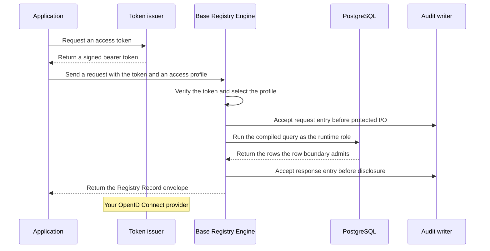

Base Registry Engine (BReg) is a PostgreSQL system of record whose data model and REST API are
compiled from a registry project. The runtime carries no built-in domain types: a business, a plot, a
permit, or an asset exists only when the active package declares it.

A [registry project](../../reference/glossary/#registry-project) is a directory of YAML files that
declares the entities, fields, relationships, access profiles, change requests, and events one
registry exposes. A [package](../../reference/glossary/#package) is the compiled and verified form
of one project: `bregctl` builds it, `breg` serves it, and a production package carries detached
signatures from keys the deployment trusts. An
[access profile](../../reference/glossary/#access-profile) is a named grant inside the project that
states what a token must carry and which operations, fields, and rows the caller may reach.

{/* Evidence: products/breg/README.md; crates/registry-breg/src/contract.rs, RegistryProject and RegistryModule;
    products/breg/contracts/package-layout.yaml; crates/registry-breg/src/access.rs. */}

The token issuer is your OpenID Connect provider; Base Registry Engine verifies tokens and issues
none. You provision PostgreSQL with
a migration role that owns the schema and a runtime role the serving process uses. The process
verifies the active package at startup, serves the compiled routes, appends every admitted request
to a per-process [audit stream](../../reference/glossary/#audit-journal). Records and history stay
in PostgreSQL; audit uses a durable file or a best-effort stdout destination.

{/* Evidence: crates/registry-breg/src/auth.rs, RegistryAuthenticator; crates/registry-breg/src/runtime_config.rs, SqlRoles;
    crates/registry-breg/src/audit.rs; release/docker/Dockerfile.breg; products/breg/README.md. */}

## Make your first request

For this unreleased audit contract, use the [matching source-built tools](../../operate/breg/#obtain-the-runtime)
in place of the tutorial's released installer. Keep released deployments paired with their release
documentation archive.

[Create and query your first registry](../../tutorials/first-breg/) starts disposable PostgreSQL
and the maintained stock identity provider on your machine, initializes a domain-neutral project with `bregctl init`,
activates an unsigned local package, and creates and reads one record over HTTP with a short-lived
token. It lists the tools it needs and runs on the platforms in
[platform support](../../explanation/known-limitations/#platform-support).

The local path keeps authentication, access profiles, row boundaries, and audit active. It is not a
substitute for production package signing, operated database roles, TLS to the database,
migration review, or secret custody; those arrive in the deploy phase.

{/* Evidence: crates/registry-bregctl/src/dev/mod.rs, start(); crates/registry-bregctl/src/lib.rs, init_files();
    docs/site/src/content/docs/tutorials/first-breg.mdx. */}

## Choose your role

### Author a registry

Start with [Author a registry project](../../configure/breg/) for `registry.yaml`, entities,
fields, related records, and modules, then [Control access per profile](../../configure/breg-access/)
and [Declare change requests and actions](../../configure/breg-change-control/). `bregctl check`,
`explain`, and `generate` open no database, so the modeling loop needs no infrastructure.
[Test with journeys](../../configure/breg-journeys/) adds the scenario tests that `bregctl test`
runs against a schema-test database before anything is packaged.

### Operate a registry

Start with [What you need to run Base Registry Engine](../../operate/breg-requirements/) to plan
the database, token issuer, and signing process a deployment needs. Then
[Build a production candidate](../../tutorials/build-a-breg-production-candidate/) takes a project
through production checks, tests, packaging, signing, and verification on your machine, and
[Deploy a registry](../../operate/breg/) covers provisioning, the runtime configuration, activation
with the migration credential, and metrics.

### Call a registry from an application

Start with [Query a registry from Python and Node](../../tutorials/query-breg-client/), which
reads, lists, and creates records through the client packages with a bearer token and needs a
registry and client packages from matching builds, then keep the
[Registry Stack client API reference](../../reference/client-api/#base-registry-engine) open for
the full surface. If you call the REST API directly, the
[Base Registry Engine API reference](../../reference/breg-api/) describes every route, the
[Registry Record envelope](../../reference/glossary/#registry-record-envelope), the query options,
and the problem codes.

{/* Evidence: crates/registry-bregctl/src/lib.rs, Command; crates/registry-breg-client/src/lib.rs;
    crates/registry-breg/src/api/mod.rs. */}

## Where the product stops

Base Registry Engine ships no business, facility, authority, permit, or asset model: every entity,
route, and profile comes from the active package. It issues no tokens and stores no users;
identity belongs to your OpenID Connect provider. It is not a proxy over data
held elsewhere: it owns its records in its own PostgreSQL database, and Registry Relay and
Evidence Gateway remain the products for sources that already exist.
[How a configured registry works](../../explanation/configuration-defined-registry/) explains the
compiled model, the three write paths, history, and events behind that boundary.

{/* Evidence: products/breg/README.md; crates/registry-breg/src/auth.rs; crates/registry-breg/src/postgres/mutation.rs. */}

## Next

- [Create and query your first registry](../../tutorials/first-breg/)
- [How a configured registry works](../../explanation/configuration-defined-registry/)
- [What you need to run Base Registry Engine](../../operate/breg-requirements/)
