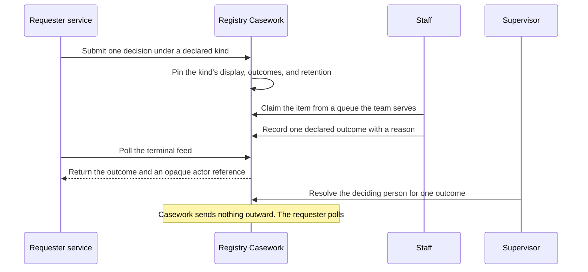

Registry Casework gives an authorized human team one coordinated inbox: over work a source system
owns, such as a governed [change request](../../reference/glossary/#change-request) a
[Base Registry Engine](../../reference/glossary/#base-registry-engine) (BReg) holds, and over
bounded decisions a calling service submits directly. Casework keeps the coordination: which queue
a [work item](../../reference/glossary/#work-item) sits in, who holds it, what was drafted, and who
decided; the source keeps eligibility, current visibility, and the record change itself.

{/* Evidence: crates/registry-casework-core/src/model.rs, WorkItem;
    crates/registry-casework-core/src/adapter.rs, SourceAdapter and read_for_caller;
    products/casework/README.md. */}

If your team decides on registry change requests, or on decisions another service submits and waits
for, Casework is where that work is held, routed, and recorded. Staff claim one item at a
time and record an outcome, Supervisors assign work and cover absence, Administrators maintain the
[directory](../../reference/glossary/#directory) of teams and served queues, and a Requester
service reads back only the items it created. The Registry App Kit is a separate project that
provides a staff interface for BReg-backed work, and a standalone deployment calls the HTTP API
from its own host.

{/* Evidence: crates/registry-casework-core/src/config.rs, AccessProfile;
    crates/registry-casework/src/auth.rs, CaseworkAuthenticator; products/casework/README.md. */}



A [hosted item](../../reference/glossary/#hosted-item) lives in Casework alone, and the policy
pinned at acceptance fixes what it can become, so publishing a changed policy later shapes new
items and leaves this one as it was accepted. The Requester reads its own outcomes from the
[terminal feed](../../reference/glossary/#terminal-feed) and sees an opaque actor reference; a
Supervisor who leads a serving team resolves the deciding person through a separate audited route.
A source-backed item follows the same path with the registry in the loop: every field a caller sees
comes from a read made for that caller, and the decision reaches the registry as an
[attempt](../../reference/glossary/#attempt) made with the person's own token and selected source
profile.

{/* Evidence: crates/registry-casework/src/http.rs, create_hosted_item, decide_hosted_item, and
    hosted_terminal_items; crates/registry-casework/src/hosted.rs, hosted_accountability;
    crates/registry-casework-core/src/adapter.rs, prepare_action and execute_prepared. */}

## Make your first request

Put a local deployment on your machine:

```sh
curl -fsSL https://github.com/registrystack/registry-stack/releases/latest/download/casework-install.sh | bash
caseworkctl init tutorial-work/casework --template standalone-decision
caseworkctl dev tutorial-work/casework
```

The installer verifies the release `SHA256SUMS` before it installs `casework`, `caseworkctl`, and
`mint` into `~/.local/bin`. The `standalone-decision` template writes a project that declares one
decision kind and needs no registry behind it. `caseworkctl dev` starts PostgreSQL in a container,
starts Registry Mint and `casework` against it, seeds the directory, and prints a report carrying a
ready status, the service URL, the token endpoint, and one credential directory per local client.

[Decide your first work item](../../tutorials/first-casework/) takes it from there: submit one
decision as a Requester, claim and decide it as Staff, and read the outcome back from the terminal
feed.

{/* Evidence: crates/registry-casework/install.sh; crates/registry-caseworkctl/src/project.rs, init;
    crates/registry-caseworkctl/src/dev/mod.rs, start and report. */}

## Choose your role

| What you want to do | Where to start |
| --- | --- |
| Author a policy: hosted kinds, sources, routing rules, and clocks | [Author a Casework policy](../../configure/casework/) |
| Run a deployment: database, runtime file, directory, and recovery | [Deploy Registry Casework](../../operate/casework/) |
| Understand the model behind an item | [How Registry Casework works](../../explanation/how-casework-works/) |
| Integrate a Requester service | [Registry Stack client API reference](../../reference/client-api/) and the [Registry Casework API](../../reference/apis/registry-casework/) |

{/* Evidence: crates/registry-caseworkctl/src/lib.rs, Command; crates/registry-casework/src/http.rs, router;
    crates/registry-casework-client/src/lib.rs. */}

## Where the product stops

Casework decides one item at a time, by one accountable person, against the policy pinned on that
item. There are no bulk decisions and no automatic outcomes, and a second opinion is a delegation
or an assignment, both recorded on the item. Clocks do act on a running item: when an authored
reminder or due step falls due, Casework reads the source afresh, then records the reminder or
moves the item to the queue the step names, under the actor `system:clock`. Those effects stay
inside the item, because Casework delivers nothing outward and sends no message to a person or a
system.

{/* Evidence: crates/registry-casework/src/clocks.rs, process_due_clocks, HistoryKind::ClockReminder,
    and HistoryKind::ClockStepApplied; products/casework/CHANGELOG.md. */}

Casework serves an API and renders no interface of its own. A browser never calls it directly: a
staff host calls Casework server to server on a private network, which is why the API enables no
CORS. It issues no tokens and stores no users, so identity stays with your OpenID Connect provider,
or with [Registry Mint](../../configure/mint/) when you have none.

{/* Evidence: crates/registry-casework/src/http.rs, router and security_headers;
    crates/registry-casework/src/auth.rs, CaseworkAuthenticator; products/casework/README.md. */}

## Next

- [Decide your first work item](../../tutorials/first-casework/)
- [Review Base Registry Engine changes in Casework](../../tutorials/review-breg-changes-in-casework/)
- [How Registry Casework works](../../explanation/how-casework-works/)
- [Author a Casework policy](../../configure/casework/)
- [Deploy Registry Casework](../../operate/casework/)
