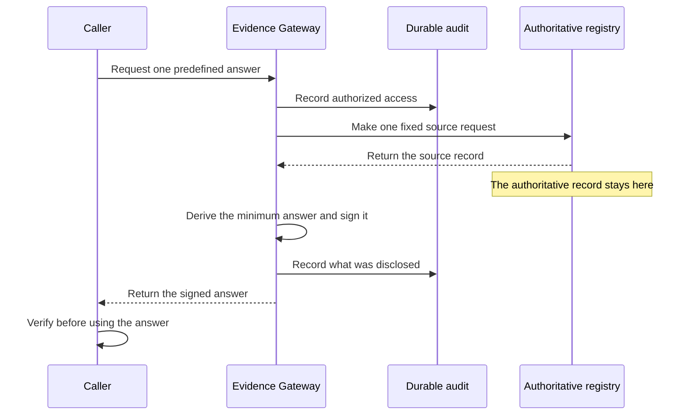

Evidence Gateway answers one [predefined question](../../reference/glossary/#bounded-question) about
one or more subjects and returns a signed minimum answer. The caller receives the answer needed for an authorized purpose, not the authoritative
record that settled the answer.

The authoritative registry remains the source of truth. Evidence Gateway makes the fixed request defined
by the provider, derives only the reviewed answer, and does not return the source response to the
caller. The caller verifies the signature and retained transaction expectations before using the
answer.

The audit trail records the authorized access and the released disclosure. The audit trail does
not repeat the source record, prove that the source fact was true, or automatically provide a
complete citizen-facing history of registry access.

## Make your first Evidence Gateway request

[Get your first Evidence Gateway assertion](../../tutorials/first-evidence-assertion/) starts a small
Python registry that you control. You use its OpenAPI description to author an adult-status
question, send a real HTTP request with `curl`, and verify a signed boolean answer. The source
response contains a name and date of birth; the verified assertion contains neither.

The tutorial uses disposable local trust and synthetic data. The local profile keeps
authentication, bounded source access, signing, verification, and audit active while the Evidence Gateway
tooling handles development process orchestration.

## Choose your role

### Provide Evidence Gateway

Start with the first assertion, then adapt the same workflow to your institution's OpenAPI source.
The provider decides the authorized purpose, subject mapping, derivation, and permitted answer.
OpenAPI describes transport and data shapes but cannot make those governed decisions.

[Return a governed value](../../tutorials/return-a-governed-value/) first extends the same
local project with a non-boolean answer. The second tutorial demonstrates that minimum disclosure
depends on the purpose and can return a reviewed value when a boolean is insufficient.

[See Evidence Gateway refuse unsafe changes](../../tutorials/refuse-unsafe-evidence-requests/) then tests
the same boundary with an unauthorized purpose and a modified signed response.

When you are ready to use your own system, [draft an Evidence Gateway source from
OpenAPI](../../tutorials/connect-an-institution-source/), then add only the
[project-specific fixtures](../../tutorials/prove-an-evidence-project/) your reviewers need.
Build a reviewed candidate only after that local work is complete. Registry Mint is optional when
the deployment has no suitable OIDC issuer.

### Consume Evidence Gateway

Retain the request expectations and trusted issuer keys before the response arrives. Verify the
stored response against that independent context, then expose the verified answer to application
logic.

[Verify Evidence Gateway as a consumer](../../tutorials/verify-an-assertion-as-a-consumer/) continues the
local journey with every service stopped. Then
[manage verifier trust](../../tutorials/manage-evidence-verifier-trust/) through an independent
onboarding and rotation process. [SD-JWT VC](../../tutorials/request-evidence-as-sd-jwt-vc/) is an
optional second serialization of the same assertion.

### Operate Evidence Gateway

Bind the provider-approved definition to production identity, source trust, signing keys, and
durable audit storage. The operator owns readiness, key rotation, audit-chain verification,
retention, backup, and recovery.

[Verify and interpret the Evidence Gateway audit chain](../../operate/evidence-audit/) covers the integrity
proof, event phases, privacy-preserving pseudonyms, and the current lack of a supported citizen
history query.

## Keep the product boundary visible

Evidence Gateway does not decide whether an institution has legal authority to use a source, whether a
purpose is legitimate, or whether a source record is true. Those decisions and assurances come
from governance, authorization, and the authoritative institution. A valid signature proves who
signed the exact assertion bytes and whether the assertion matches the retained verification
expectations.

Evidence Gateway is separate from Registry Relay. Registry Relay exposes protected, selected records.
Evidence Gateway contacts its own configured authoritative sources and retains its own authorization,
derivation, signing, verification, and audit boundaries. Registry Mint is optional supporting
infrastructure that supplies short-lived caller tokens when a deployment has no identity provider.

{/* Evidence: a fixed source request reaches its source over one of two coequal transports, a fixed
     HTTP JSON request or one reviewed SQL statement against a read-only SQLite extract,
     products/evidence/CONCEPT.md; the closed http-json and sqlite-extract source variants under
     `source` in products/evidence/contracts/bundle.schema.yaml (frozen). */}

## Next

- [Get your first Evidence Gateway assertion](../../tutorials/first-evidence-assertion/)
- [Build and deploy an Evidence Gateway project](../../tutorials/build-and-deploy-evidence-project/)
- [Decide when Registry Stack fits](../when-to-use/)
- [Evaluate Evidence Gateway's operating requirements](../evaluate-evidence/)
- [Review the Evidence Gateway security model](../../security/evidence/)
