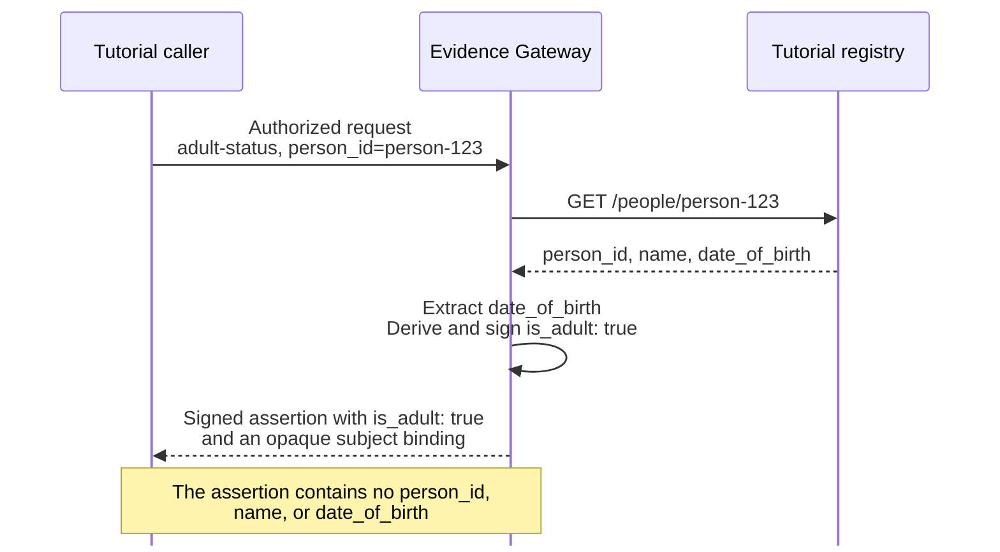

import QuickstartMeta from '../../../components/QuickstartMeta.astro';
import ClientLanguageTabs from '../../../components/ClientLanguageTabs.astro';

Evidence Gateway reads an authorized source record, answers a preconfigured question, and signs only the
governed answer. In this tutorial, you will ask "Is this person an adult?" without returning the
person's name or date of birth.

:::caution[Unreleased API]
This development-docs tutorial exercises the progressive client API from a source checkout.
Registry Stack `v0.22.0` ships the client bindings, but not this API. Build the checkout as shown
below instead of substituting the `v0.22.0` client assets.
:::

<QuickstartMeta
  outcome="One governed adult-status answer verified as signed JWS and SD-JWT VC, without the source record."
  time="About 30 minutes after the toolchain is installed"
  level="Local development with synthetic data"
  prerequisites={['Git', 'Rust and Cargo', 'Python 3', 'Node.js 22.12 or later for the Node.js lane', 'A shell with curl', 'An editor', 'Linux or macOS']}
/>

## Understand the flow



Before the request, Registry Mint gives the tutorial caller short-lived local authorization.
Evidence Gateway and the registry process the identifier and date of birth to answer the question, but the
released assertion contains only the governed answer and an opaque subject binding.

## Build the preview toolset

Clone Registry Stack and build the exact Evidence Gateway toolset this development tutorial exercises:

```sh
git clone https://github.com/registrystack/registry-stack.git registry-stack-progressive
REGISTRY_STACK_SOURCE="$PWD/registry-stack-progressive"
cargo build --locked --release \
  --manifest-path "$REGISTRY_STACK_SOURCE/Cargo.toml" \
  -p registry-evidence \
  -p registry-evidencectl \
  -p registry-mint
export REGISTRY_STACK_SOURCE
export PATH="$REGISTRY_STACK_SOURCE/target/release:$PATH"
evidencectl --version
```

The build provides `evidencectl` and the local Evidence Gateway and Registry Mint runtimes used later
in the tutorial. The `REGISTRY_STACK_SOURCE` path is also used to build the two client bindings.

## Preview a synthetic source

Create a working directory:

```sh
mkdir first-evidence-assertion
cd first-evidence-assertion
```

Open `tutorial-source.openapi.yaml` in your editor and add this OpenAPI description:

```yaml
openapi: 3.1.0
info:
  title: Tutorial registry
  version: 1.0.0
servers:
  - url: http://127.0.0.1:4010
paths:
  /people/{person_id}:
    get:
      operationId: getPerson
      parameters:
        - name: person_id
          in: path
          required: true
          schema:
            type: string
      responses:
        "200":
          description: A synthetic person record
          content:
            application/json:
              schema:
                type: object
                additionalProperties: false
                required: [person_id, name, date_of_birth]
                properties:
                  person_id:
                    type: string
                    minLength: 1
                    maxLength: 64
                    x-evidencectl-mock:
                      fromRequest:
                        pathParameter: person_id
                  name:
                    type: string
                    minLength: 1
                    maxLength: 100
                    x-evidencectl-mock:
                      faker:
                        kind: person.fullName
                  date_of_birth:
                    type: string
                    format: date
                    x-evidencectl-mock:
                      distribution:
                        kind: age
                        min: 1
                        max: 90
```

Three details connect this contract to Evidence Gateway:

- `/people/{person_id}` returns a complete person record.
- `getPerson` is the OpenAPI operation that the Evidence Gateway question will select.
- The mock hints echo the requested ID, create a plausible name, and keep generated ages between 1 and 90.

Start a write-free preview directly from the OpenAPI description:

```sh
evidencectl source mock serve --openapi tutorial-source.openapi.yaml --seed 1
```

```text
Source mock ready: mode=ephemeral origin=http://127.0.0.1:4010 contract=evidencectl-source-mock-v1 seed=1 asOf=2025-01-01 digest=sha256:<digest> served=1 skipped=0
Next: evidencectl source mock generate --openapi <file>
```

This mode writes nothing. It checks the compatible `GET` operation, generates schema-valid synthetic
responses deterministically, and binds only to numeric loopback.

In another terminal, return to `first-evidence-assertion` and inspect the source shape:

```sh
curl -s http://127.0.0.1:4010/people/person-123 | python3 -c \
  'import json,sys; print(sorted(json.load(sys.stdin)))'
```

```text
['date_of_birth', 'name', 'person_id']
```

The preview generated one complete record with the documented fields. The verified assertion will contain
none of those source values. Return to the first terminal and press `Ctrl+C` to stop the ephemeral preview.

## Create the Evidence Gateway project

Create a local project from the source's OpenAPI description:

```sh
evidencectl new adult-status \
  --openapi tutorial-source.openapi.yaml \
  --profile local
cd adult-status
```

`--profile local` creates a loopback-only development project, not a production deployment.
The command creates owner-only local keys for signing, subject binding, and audit integrity.
OpenAPI describes the source, but you still decide the question and what the answer may disclose.

The new project separates those decisions from the retained API description:

```text
adult-status/
├── source.openapi.yaml
├── selectors/
├── sources/
├── adapters/
├── schemas/
├── questions/
├── derivations/
└── secrets/
```

This first question uses the compact OpenAPI form, so you will add only a question and its
derivation. Evidence Gateway keeps the source-mock hints out of the narrowed authoring schema.
Later institution integrations use the reusable source, selector, adapter, and schema directories.

### `questions/adult-status.yaml`

Open `questions/adult-status.yaml` in your editor and add the question definition:

```yaml
id: adult-status
question: Is the person at least 18 years old?
purpose: age-check
subject:
  role: person
  selector: person_id
source:
  operation: getPerson
  facts:
    - name: date_of_birth
      path: /date_of_birth
      combine: exactly-one
  collectionBounds: {}
answers:
  - concept: is_adult
    type: boolean
responseFormats: [signed-jws, sd-jwt-vc]
derivation: derivations/adult-status.rhai
disclosure:
  allow: [is_adult]
```

The definition closes four decisions:

- `subject` says that `person_id` selects the person in `/people/{person_id}`.
- `source` selects `getPerson` and allows only `date_of_birth` to reach the derivation. It does not
  change the complete record returned by the registry.
- `answers` declares one permitted result, a boolean named `is_adult`.
- `responseFormats` keeps signed JWS as the default and also permits the same answer to be returned
  as SD-JWT VC.
- `disclosure` is the explicit release boundary. It must name exactly the answers returned by the
  derivation.

`combine: exactly-one` rejects a missing or repeated `date_of_birth`. `collectionBounds: {}` is
empty because this fact does not traverse a collection. The request purpose must be `age-check`,
matching the purpose declared here.

### `derivations/adult-status.rhai`

Open `derivations/adult-status.rhai` in your editor and add the answer logic. Rhai is the bounded
scripting language Evidence Gateway uses for requirement-specific derivations:

```rhai
fn answer(facts, selectors, context) {
    let born = parse_date(required(facts.date_of_birth, "date_of_birth_missing"));
    let adult_on = add_calendar_years(born, 18);
    #{is_adult: compare_dates(context.legal_local_date, adult_on) >= 0}
}
```

The derivation performs four operations:

1. Require and parse the selected date of birth.
2. Calculate the eighteenth birthday using calendar arithmetic.
3. Compare it with `context.legal_local_date`, which Evidence Gateway derives from the observation instant
   in the configured timezone.
4. Return a map containing exactly the declared `is_adult` answer.

Evidence Gateway validates the returned name and boolean form before signing.

## Materialize exact cases for the tutorial

The ephemeral preview is the shortest route from OpenAPI to a running source. The remaining tutorials
need three exact records that stay unchanged between runs. Materialize the previewed record, then add
two more generated cases to the same reviewed plan:

```sh
evidencectl source mock generate \
  --project . \
  --operation "GET /people/{person_id}" \
  --case person-123 \
  --path-parameter person_id=person-123 \
  --seed 1
evidencectl source mock generate \
  --config mocks/source.yaml \
  --operation "GET /people/{person_id}" \
  --case person-456 \
  --path-parameter person_id=person-456
evidencectl source mock generate \
  --config mocks/source.yaml \
  --operation "GET /people/{person_id}" \
  --case person-789 \
  --path-parameter person_id=person-789
```

```text
Created mocks/cases/get-people-b85b6e66/person-123-57f2bb2e.json
Created mocks/source.yaml
Generated synthetic values: explicit=3 inferred=0 format=0 generic=1
Updated mocks/source.yaml
Created mocks/cases/get-people-b85b6e66/person-456-cbcaa053.json
Generated synthetic values: explicit=3 inferred=0 format=0 generic=1
Updated mocks/source.yaml
Created mocks/cases/get-people-b85b6e66/person-789-0dc95a4d.json
Generated synthetic values: explicit=3 inferred=0 format=0 generic=1
```

Seed `1` gives the preview and materialized `person-123` request the same synthetic response.
The plan retains the seed, generation date, OpenAPI digest, request parameters, and generated body paths.
Adding a case updates that plan and creates a new body, but never replaces an existing case body.

Check the plan and every authored body offline:

```sh
evidencectl source mock check --config mocks/source.yaml
```

```text
Mock plan valid: operations=1 cases=3
```

The check does not bind a port or rewrite a file. For another API, select one compatible operation and
provide one `--path-parameter name=<value>` for each path parameter. Review or edit the materialized
bodies, run `check`, and serve those exact checked bytes.

Keep the reusable starter free of access policy changes by making a request-specific copy:

```sh
cd ..
cp -R adult-status adult-status-request
cd adult-status-request
```

The copy contains the same reviewed mock cases and question. It is local tutorial state, not a
production deployment pattern. Register one local client in that copy, then create the small
application-owned client profile used by all three request paths:

```sh
evidencectl access policy add first-assertion-policy --question adult-status
evidencectl access client add first-assertion-client \
  --policy first-assertion-policy \
  --generate-local-key
evidencectl client profile create \
  --base-url http://127.0.0.1:8080 \
  --client-id first-assertion-client \
  --private-key-file .evidence/clients/first-assertion-client/private.jwk \
  --local-loopback-discovery \
  --out client.json
```

```text
Added access policy first-assertion-policy for adult-status.
Added client first-assertion-client with policy first-assertion-policy.
Created client profile
```

The private client key remains owner-only under `.evidence/clients/`. `client.json` contains its
relative file reference, the public Evidence origin, and the registered client ID. It contains no
token endpoint, copied signing keys, selectors, or subject database. The SDK discovers the public
service metadata and signing keys before closing the request's verification policy.

Start the materialized source and leave it running:

```sh
evidencectl source mock serve --config mocks/source.yaml
```

```text
Source mock ready: mode=materialized origin=http://127.0.0.1:4010 served=3 skipped=0
```

Start Evidence Gateway and Registry Mint:

```sh
evidencectl dev --detach
```

```text
Evidence ready at http://127.0.0.1:8080
Mint ready at http://127.0.0.1:8081
```

This command starts Evidence Gateway and Mint only. The source mock remains the process you started in
the first terminal.

## Request an assertion

Choose one client path. The curl path uses the `evidencectl` build from the start of this tutorial. The
Python and Node.js paths build the same checked-out client source, so no lane claims an unreleased
artifact contains the progressive API.

<ClientLanguageTabs>
<Fragment slot="curl">

The curl path needs no additional download:

```sh
command -v curl >/dev/null
command -v evidencectl >/dev/null
echo ready
```

</Fragment>
<Fragment slot="python">

Python requires Python 3.10 or later. Create a virtual environment, build the extension module, and
place it in an owner-local import directory:

```sh
python3 -m venv .venv
. .venv/bin/activate

CARGO_TARGET_DIR="$REGISTRY_STACK_SOURCE/target/tutorial-client"
cargo build --locked --release \
  --manifest-path "$REGISTRY_STACK_SOURCE/Cargo.toml" \
  -p registry-evidence-client-py --lib \
  --features registry-evidence-client-py/extension-module \
  --target-dir "$CARGO_TARGET_DIR"
case "$(uname -s)" in
  Darwin) BUILT_MODULE="$CARGO_TARGET_DIR/release/libregistry_evidence_client.dylib" ;;
  Linux) BUILT_MODULE="$CARGO_TARGET_DIR/release/libregistry_evidence_client.so" ;;
  *) echo "The Evidence Python client preview supports Linux and macOS" >&2; exit 1 ;;
esac
mkdir -p python-module
cp "$BUILT_MODULE" python-module/registry_evidence_client.so
export PYTHONPATH="$PWD/python-module"
echo ready
```

</Fragment>
<Fragment slot="node">

Node.js requires version 22.12 or later. Build and pack the binding from the same checkout, then
install the local package without fetching its optional released native packages:

```sh
mkdir -p node-client
NODE_CLIENT_DIR="$PWD/node-client"
CLIENT_PACKAGE_SOURCE="$REGISTRY_STACK_SOURCE/crates/registry-evidence-client-node"
npm --prefix "$CLIENT_PACKAGE_SOURCE" ci
npm --prefix "$CLIENT_PACKAGE_SOURCE" run build
PACKAGE_NAME="$(cd "$CLIENT_PACKAGE_SOURCE" && npm pack --silent --pack-destination "$NODE_CLIENT_DIR")"
cd "$NODE_CLIENT_DIR"
npm init -y >/dev/null
npm install --omit=optional "./${PACKAGE_NAME}"
cd ..
echo ready
```

</Fragment>
</ClientLanguageTabs>

The final line in each path is `ready`.

<ClientLanguageTabs>
<Fragment slot="curl">

Prepare the request, short-lived authorization, and closed verification context before sending:

```sh
evidencectl request prepare \
  --profile client.json \
  --requirement adult-status \
  --subject person_id=person-123 \
  --name first-assertion
```

```text
Prepared request: .evidence/requests/first-assertion/request.json
Prepared verification context: .evidence/requests/first-assertion/verification.json
Prepared curl config: .evidence/requests/first-assertion/curl.config
```

Send one assertion request and keep the response opaque:

```sh
curl --silent --show-error --fail-with-body \
  --config .evidence/requests/first-assertion/curl.config \
  --output assertion.jws.json
```

Verify offline, then read only the verified output:

```sh
evidencectl verify assertion.jws.json \
  --context .evidence/requests/first-assertion/verification.json \
  --output verified.json
grep -Fq '"value":true' verified.json
echo 'person-123 is_adult=true'
```

</Fragment>
<Fragment slot="python">

Create `first-assertion.py`. The client profile supplies the public origin and client identity. The
SDK discovers the remaining public metadata, sends once, and returns only locally verified evidence:

```python
from registry_evidence_client import EvidenceClient

client = EvidenceClient.from_profile("client.json")
result = client.request(requirement="adult-status", person_id="person-123")
print(f"person-123 is_adult={str(result.value).lower()}")
```

Run it:

```sh
python first-assertion.py
```

</Fragment>
<Fragment slot="node">

Create `node-client/first-assertion.js`. It applies the same profile-driven discovery, one-send, and
local-verification boundary:

```js
const { EvidenceClient } = require('@registrystack/evidence-client');

async function main() {
  const client = EvidenceClient.fromProfile('client.json');
  const response = await client.request({
    requirement: 'adult-status',
    selectors: { person_id: 'person-123' },
  });
  console.log(`person-123 is_adult=${response.value}`);
}

main().catch((error) => { console.error(error); process.exitCode = 1; });
```

Run it:

```sh
node node-client/first-assertion.js
```

</Fragment>
</ClientLanguageTabs>

Each path prints:

```text
person-123 is_adult=true
```

The assertion request carries a fresh nonce and produces a signed flattened JSON Web Signature
(JWS). A successful HTTP response is not yet a trusted assertion. The curl path exposes the payload
only after `evidencectl verify` succeeds. The SDK methods close the policy before their one POST and
return only a typed, locally verified result.

For this one-shot local tutorial, the result reports `FirstUse` with an opaque binding receipt. That
means the signature, nonce, audience, procedure, and output verified, but the application did not
compare this subject with a receipt it already held. The SDK stores nothing. An application needing
continuity atomically retains the receipt with its own account or case record and supplies it on a
later request. Continue with
[Request Evidence Gateway from an application](../request-evidence-from-an-application/) for that
durable pattern.

The verified document contains generated identifiers, timestamps, and a pseudonymous subject
binding. The fields relevant to this question look like this excerpt:

```json
{
  "assuranceProfile": "local",
  "purpose": "age-check",
  "subjects": [
    {
      "binding": "urn:evidence:subject:v1_…",
      "role": "person"
    }
  ],
  "supportedValues": [
    {
      "providesValueFor": "urn:registrystack:evidence:local:concept:adult-status:is_adult",
      "value": true
    }
  ],
  "supportsRequirement": "urn:registrystack:evidence:local:requirement:adult-status"
}
```

`supportsRequirement` names the requirement that the question you authored under `questions/`
compiles to. It is the unit named by the deployed configuration and the audit record.

The verified payload does not include `person_id`, `name`, or `date_of_birth`. The assertion
answers the authored question without becoming another copy of the registry record.

The curl path's owner-only `request.json` records that this transaction concerned `person-123`, while
`verification.json` records the request nonce and the complete pre-response verification context.
Retain those files with the signed response to continue with [Verify Evidence Gateway as a
consumer](../verify-an-assertion-as-a-consumer/). The identifier cannot be recovered from the
assertion alone.

{/* The v0.21.1 Python and Node.js assets are intentionally unavailable until that release is published. */}

## Try the SD-JWT VC serialization

Prepare a second request for the same governed question, this time recording SD-JWT VC as the
expected response format:

```sh
evidencectl request prepare \
  --profile client.json \
  --requirement adult-status \
  --subject person_id=person-123 \
  --format sd-jwt-vc \
  --name first-vc
```

```text
Prepared request: .evidence/requests/first-vc/request.json
Prepared verification context: .evidence/requests/first-vc/verification.json
Prepared curl config: .evidence/requests/first-vc/curl.config
```

Send the request with the exact SD-JWT VC media type:

```sh
curl --silent --show-error --fail-with-body \
  --config .evidence/requests/first-vc/curl.config \
  --output assertion.sd-jwt \
  --write-out 'HTTP %{http_code}\n'
```

```text
HTTP 200
```

Treat the compact credential as opaque until verification succeeds:

```sh
evidencectl verify assertion.sd-jwt \
  --context .evidence/requests/first-vc/verification.json \
  --output verified-vc.json
```

```text
VERIFIED
```

Now inspect the verified Evidence payload:

```sh
python3 -m json.tool verified-vc.json
```

It has the same governed `is_adult: true` answer and minimum-disclosure boundary as the signed JWS
response. Only the serialization changed. This is a stateless credential response, not a wallet
issuance, revocation, or presentation workflow.

Continue with [Explore SD-JWT VC locally](../request-evidence-as-sd-jwt-vc/) to inspect disclosures,
issuer metadata, tamper refusal, and structured-field projection.

## Stop the local services

Stop Evidence Gateway and Mint before reading the completed audit chain:

```sh
evidencectl dev stop
```

```text
Local Evidence stopped
```

## Inspect the audit entry

Verify the completed audit chain and show its last operation:

```sh
evidencectl audit show --last-operation
```

```text
ACCESS AUTHORIZED adult-status age-check requester=<pseudonym>
DISCLOSURE RELEASED is_adult
```

The requester value changes on each fresh project. The view identifies the question, purpose,
requester pseudonym, authorization decision, and disclosed concept. It does not repeat the source
record or access token.

## Clean up

Remove the stopped local generation, including the sealed bundle that Evidence Gateway used:

```sh
evidencectl dev clean
umask 077
mkdir -p ../adult-status/.evidence/requests
cp -R .evidence/requests/first-assertion ../adult-status/.evidence/requests/
cp assertion.jws.json verified.json ../adult-status/
cd ../adult-status
```

```text
Removed stopped local Evidence state
```

This removes `.evidence/dev`, whose runtime files are deliberately read-only while a generation
exists. Run `dev stop` and then `dev clean` instead of changing those permissions by hand. The
command refuses to remove a running or unrecognized generation. The next commands retain only the
assertion, verified result, and independently recorded verification context in the reusable
`adult-status` starter, with owner-only permissions, then leave you in that directory. Its implicit
tutorial caller remains unchanged for the authoring follow-ups. The access policy, registered
client, and private client key remain isolated in `adult-status-request`.

Return to the first terminal and press `Ctrl+C` to stop the source mock.

Keep the tutorial directory to continue with the governed-value or offline-verification tutorial.
If you do not plan to continue, you can remove the complete directory with ordinary file commands.

## If local ports are already in use

Choose two different unused ports when you start the local services:

```sh
mv client.json client.default-ports.json
evidencectl client profile create \
  --base-url http://127.0.0.1:8180 \
  --client-id first-assertion-client \
  --private-key-file .evidence/clients/first-assertion-client/private.jwk \
  --local-loopback-discovery \
  --out client.json
evidencectl dev --detach --evidence-port 8180 --mint-port 8181
```

Evidence Gateway uses the selected ports consistently in its runtime, Mint authorization, readiness
checks, client profile, and generated request artifacts. The SDK and curl lanes continue to read
`client.json`, now bound to `http://127.0.0.1:8180`.

The source mock separately uses `127.0.0.1:4010`, the origin retained in `source.openapi.yaml`. If that
port is unavailable, change the OpenAPI server URL before creating the project and pass the same origin
with `source mock serve --http-addr`.

The development profile binds both services to loopback in the environment where the command
runs. If that environment is a Docker container, run the tutorial's `curl` commands in the same
container. Use the operator deployment configuration when the service must listen beyond
loopback.

## Next

- [Explore SD-JWT VC locally](../request-evidence-as-sd-jwt-vc/)
- [Return a governed value](../return-a-governed-value/)
- [Bind two people to one relationship assertion](../assert-a-role-bound-relationship/)
- [Review the Evidence Gateway overview](../../start/evidence-quickstart/)
- [Evaluate Evidence Gateway's operating requirements](../../start/evaluate-evidence/)
