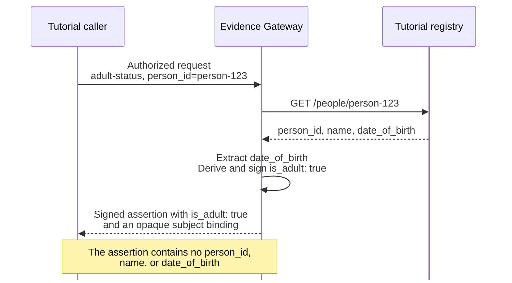

import QuickstartMeta from '../../../components/QuickstartMeta.astro';
import ClientLanguageTabs from '../../../components/ClientLanguageTabs.astro';

Evidence Gateway reads an authorized source record, answers a preconfigured question, and signs only the
governed answer. In this tutorial, you will ask "Is this person an adult?" without returning the
person's name or date of birth.

<QuickstartMeta
  outcome="One governed adult-status answer verified as signed JWS and SD-JWT VC, without the source record."
  time="About 20 minutes"
  level="Local development with synthetic data"
  prerequisites={['Python 3', 'A shell with curl', 'An editor', 'Linux or macOS']}
/>

## Understand the flow



Before the request, Registry Mint gives the tutorial caller short-lived local authorization.
Evidence Gateway and the registry process the identifier and date of birth to answer the question, but the
released assertion contains only the governed answer and an opaque subject binding.

## Install Evidence Gateway

Install the latest Evidence Gateway toolset:

```sh
curl -fsSL https://github.com/registrystack/registry-stack/releases/latest/download/evidencectl-install.sh | bash
evidencectl --version
```

The installer provides `evidencectl` and the local Evidence Gateway and Registry Mint runtimes used later
in the tutorial.

## Preview a synthetic source

Create a working directory:

```sh
mkdir first-evidence-assertion
cd first-evidence-assertion
```

Open `tutorial-source.openapi.yaml` in your editor and add this OpenAPI description:

```yaml
openapi: 3.1.0
info:
  title: Tutorial registry
  version: 1.0.0
servers:
  - url: http://127.0.0.1:4010
paths:
  /people/{person_id}:
    get:
      operationId: getPerson
      parameters:
        - name: person_id
          in: path
          required: true
          schema:
            type: string
      responses:
        "200":
          description: A synthetic person record
          content:
            application/json:
              schema:
                type: object
                additionalProperties: false
                required: [person_id, name, date_of_birth]
                properties:
                  person_id:
                    type: string
                    minLength: 1
                    maxLength: 64
                    x-evidencectl-mock:
                      fromRequest:
                        pathParameter: person_id
                  name:
                    type: string
                    minLength: 1
                    maxLength: 100
                    x-evidencectl-mock:
                      faker:
                        kind: person.fullName
                  date_of_birth:
                    type: string
                    format: date
                    x-evidencectl-mock:
                      distribution:
                        kind: age
                        min: 18
                        max: 90
```

Three details connect this contract to Evidence Gateway:

- `/people/{person_id}` returns a complete person record.
- `getPerson` is the OpenAPI operation that the Evidence Gateway question will select.
- The mock hints echo the requested ID, create a plausible name, and keep generated ages between 18 and 90.

Start a write-free preview directly from the OpenAPI description:

```sh
evidencectl source mock serve --openapi tutorial-source.openapi.yaml
```

```text
Source mock ready: mode=ephemeral origin=http://127.0.0.1:4010 contract=evidencectl-source-mock-v1 seed=0 asOf=2025-01-01 digest=sha256:<digest> served=1 skipped=0
Next: evidencectl source mock generate --openapi <file>
```

This mode writes nothing. It checks the compatible `GET` operation, generates schema-valid synthetic
responses deterministically, and binds only to numeric loopback.

In another terminal, return to `first-evidence-assertion` and inspect the source shape:

```sh
curl -s http://127.0.0.1:4010/people/person-123 | python3 -c \
  'import json,sys; print(sorted(json.load(sys.stdin)))'
```

```text
['date_of_birth', 'name', 'person_id']
```

The preview generated one complete record with the documented fields. The verified assertion will contain
none of those source values. Return to the first terminal and press `Ctrl+C` to stop the ephemeral preview.

## Create the Evidence Gateway project

Create a local project from the source's OpenAPI description:

```sh
evidencectl new adult-status \
  --openapi tutorial-source.openapi.yaml \
  --profile local
cd adult-status
```

`--profile local` creates a loopback-only development project, not a production deployment.
The command creates owner-only local keys for signing, subject binding, and audit integrity.
OpenAPI describes the source, but you still decide the question and what the answer may disclose.

The new project separates those decisions from the retained API description:

```text
adult-status/
├── source.openapi.yaml
├── selectors/
├── sources/
├── adapters/
├── schemas/
├── questions/
├── derivations/
└── secrets/
```

This first question uses the compact OpenAPI form, so you will add only a question and its
derivation. Evidence Gateway keeps the source-mock hints out of the narrowed authoring schema.
Later institution integrations use the reusable source, selector, adapter, and schema directories.

### `questions/adult-status.yaml`

Open `questions/adult-status.yaml` in your editor and add the question definition:

```yaml
id: adult-status
question: Is the person at least 18 years old?
purpose: age-check
subject:
  role: person
  selector: person_id
source:
  operation: getPerson
  facts:
    - name: date_of_birth
      path: /date_of_birth
      combine: exactly-one
  collectionBounds: {}
answers:
  - concept: is_adult
    type: boolean
responseFormats: [signed-jws, sd-jwt-vc]
derivation: derivations/adult-status.rhai
disclosure:
  allow: [is_adult]
```

The definition closes four decisions:

- `subject` says that `person_id` selects the person in `/people/{person_id}`.
- `source` selects `getPerson` and allows only `date_of_birth` to reach the derivation. It does not
  change the complete record returned by the registry.
- `answers` declares one permitted result, a boolean named `is_adult`.
- `responseFormats` keeps signed JWS as the default and also permits the same answer to be returned
  as SD-JWT VC.
- `disclosure` is the explicit release boundary. It must name exactly the answers returned by the
  derivation.

`combine: exactly-one` rejects a missing or repeated `date_of_birth`. `collectionBounds: {}` is
empty because this fact does not traverse a collection. The request purpose must be `age-check`,
matching the purpose declared here.

### `derivations/adult-status.rhai`

Open `derivations/adult-status.rhai` in your editor and add the answer logic. Rhai is the bounded
scripting language Evidence Gateway uses for requirement-specific derivations:

```rhai
fn answer(facts, selectors, context) {
    let born = parse_date(required(facts.date_of_birth, "date_of_birth_missing"));
    let adult_on = add_calendar_years(born, 18);
    #{is_adult: compare_dates(context.legal_local_date, adult_on) >= 0}
}
```

The derivation performs four operations:

1. Require and parse the selected date of birth.
2. Calculate the eighteenth birthday using calendar arithmetic.
3. Compare it with `context.legal_local_date`, which Evidence Gateway derives from the observation instant
   in the configured timezone.
4. Return a map containing exactly the declared `is_adult` answer.

Evidence Gateway validates the returned name and boolean form before signing.

## Keep exact cases for the tutorial

The ephemeral preview is the shortest route from OpenAPI to a running source. The remaining tutorials
need three exact records that stay unchanged between runs, so materialize a small reviewed plan instead.

Create its directory:

```sh
mkdir -p mocks/cases
```

Open `mocks/source.yaml` and add the three request cases:

```yaml
version: 1
openapi: ../source.openapi.yaml
operations:
  - method: GET
    path: /people/{person_id}
    operationId: getPerson
    response:
      status: 200
      mediaType: application/json
    cases:
      - name: person-123
        request:
          pathParameters: {person_id: person-123}
        body: cases/person-123.json
      - name: person-456
        request:
          pathParameters: {person_id: person-456}
        body: cases/person-456.json
      - name: person-789
        request:
          pathParameters: {person_id: person-789}
        body: cases/person-789.json
```

Add the exact synthetic bodies.

### `mocks/cases/person-123.json`

```json
{
  "person_id": "person-123",
  "name": "Amina Example",
  "date_of_birth": "2000-01-01"
}
```

### `mocks/cases/person-456.json`

```json
{
  "person_id": "person-456",
  "name": "Mateo Example",
  "date_of_birth": "2012-05-20"
}
```

### `mocks/cases/person-789.json`

```json
{
  "person_id": "person-789",
  "name": "Noor Example",
  "date_of_birth": "1988-11-03"
}
```

Check the plan and every authored body offline:

```sh
evidencectl source mock check --config mocks/source.yaml
```

```text
Mock plan valid: operations=1 cases=3
```

The check does not bind a port or rewrite a file. For another API, start an editable case with
`evidencectl source mock generate --project . --operation "GET /path/{id}" --case adult-positive` and add one
`--path-parameter id=<value>` for each path parameter. Generation creates an initial plan and response
body without overwriting an existing mock directory. Edit the body, run `check`, and serve those exact
checked bytes.

Register one local client that may ask this question, then pin the project's public signing key for
response verification:

```sh
evidencectl access policy add first-assertion-policy --question adult-status
evidencectl access client add first-assertion-client \
  --policy first-assertion-policy \
  --generate-local-key
evidencectl jwks --out trusted-issuer-keys.json secrets/signing-p256-public.jwk.json
```

```text
Added access policy first-assertion-policy for adult-status.
Added client first-assertion-client with policy first-assertion-policy.
wrote trusted-issuer-keys.json
```

The private client key remains owner-only under `.evidence/clients/`. The JWKS contains only the
public key that each client path will trust. This local setup keeps both files in one project; a
deployed relying application receives its trust material and client key through separate governed
channels.

Start the materialized source and leave it running:

```sh
evidencectl source mock serve --config mocks/source.yaml
```

```text
Source mock ready: mode=materialized origin=http://127.0.0.1:4010 served=3 skipped=0
```

Start Evidence Gateway and Registry Mint:

```sh
evidencectl dev --detach
```

```text
Evidence ready at http://127.0.0.1:8080
Mint ready at http://127.0.0.1:8081
```

This command starts Evidence Gateway and Mint only. The source mock remains the process you started in
the first terminal.

## Request an assertion

Choose one client path. The curl path uses the `evidencectl` installation from the start of this
tutorial. The Python and Node.js clients are release assets rather than packages published to PyPI
or npm. They require Cosign and download the client from Registry Stack v0.19.1, the first release
that carries these examples.

<ClientLanguageTabs>
<Fragment slot="curl">

The curl path needs no additional download:

```sh
command -v curl >/dev/null
command -v evidencectl >/dev/null
echo ready
```

</Fragment>
<Fragment slot="python">

Python requires Python 3.10 or later. Create a virtual environment, download the wheel for this
machine, and authenticate the release checksum before installing it:

```sh
python3 -m venv .venv
. .venv/bin/activate

VERSION=0.19.1
case "$(uname -s)-$(uname -m)" in
  Linux-x86_64) PLATFORM="linux_x86_64" ;;
  Linux-aarch64|Linux-arm64) PLATFORM="linux_aarch64" ;;
  Darwin-arm64) PLATFORM="macosx_11_0_arm64" ;;
  *) echo "No prebuilt Evidence Python client for this platform" >&2; exit 1 ;;
esac
ASSET="registry_evidence_client-${VERSION}-cp310-abi3-${PLATFORM}.whl"
RELEASE="https://github.com/registrystack/registry-stack/releases/download/v${VERSION}"
BUNDLE="registry-stack-v${VERSION}-SHA256SUMS.sigstore.json"
curl -fLO "${RELEASE}/${ASSET}"
curl -fLO "${RELEASE}/SHA256SUMS"
curl -fLO "${RELEASE}/${BUNDLE}"
cosign verify-blob SHA256SUMS \
  --bundle "${BUNDLE}" \
  --certificate-identity \
    'https://github.com/registrystack/registry-stack/.github/workflows/release.yml@refs/heads/main' \
  --certificate-oidc-issuer 'https://token.actions.githubusercontent.com'
awk -v asset="${ASSET}" '$2 == asset {print}' SHA256SUMS > client-SHA256SUMS
test "$(wc -l < client-SHA256SUMS)" -eq 1
case "$(uname -s)" in
  Darwin) shasum -a 256 --check client-SHA256SUMS ;;
  Linux) sha256sum --check --strict client-SHA256SUMS ;;
esac
python -m pip install "./${ASSET}"
echo ready
```

</Fragment>
<Fragment slot="node">

Node.js requires version 22.12 or later. Create an application directory, download the package for
this machine, and authenticate the release checksum before installing it:

```sh
mkdir -p node-client
cd node-client
npm init -y >/dev/null

VERSION=0.19.1
case "$(uname -s)-$(uname -m)" in
  Linux-x86_64) PLATFORM="linux-amd64-glibc" ;;
  Linux-aarch64|Linux-arm64) PLATFORM="linux-arm64-glibc" ;;
  Darwin-arm64) PLATFORM="macos-arm64" ;;
  *) echo "No prebuilt Evidence Node.js client for this platform" >&2; exit 1 ;;
esac
ASSET="evidence-client-node-v${VERSION}-${PLATFORM}.tgz"
RELEASE="https://github.com/registrystack/registry-stack/releases/download/v${VERSION}"
BUNDLE="registry-stack-v${VERSION}-SHA256SUMS.sigstore.json"
curl -fLO "${RELEASE}/${ASSET}"
curl -fLO "${RELEASE}/SHA256SUMS"
curl -fLO "${RELEASE}/${BUNDLE}"
cosign verify-blob SHA256SUMS \
  --bundle "${BUNDLE}" \
  --certificate-identity \
    'https://github.com/registrystack/registry-stack/.github/workflows/release.yml@refs/heads/main' \
  --certificate-oidc-issuer 'https://token.actions.githubusercontent.com'
awk -v asset="${ASSET}" '$2 == asset {print}' SHA256SUMS > client-SHA256SUMS
test "$(wc -l < client-SHA256SUMS)" -eq 1
case "$(uname -s)" in
  Darwin) shasum -a 256 --check client-SHA256SUMS ;;
  Linux) sha256sum --check --strict client-SHA256SUMS ;;
esac
npm install "./${ASSET}"
cd ..
echo ready
```

</Fragment>
</ClientLanguageTabs>

The final line in each path is `ready`.

<ClientLanguageTabs>
<Fragment slot="curl">

Prepare the request, short-lived authorization, and closed verification context before sending:

```sh
evidencectl request prepare adult-status \
  --client first-assertion-client \
  --purpose age-check \
  --subject person_id=person-123 \
  --name first-assertion
```

```text
Prepared request: .evidence/requests/first-assertion/request.json
Prepared verification context: .evidence/requests/first-assertion/verification.json
Prepared authorization: .evidence/requests/first-assertion/authorization.curl
```

Send one assertion request and keep the response opaque:

```sh
curl --silent --show-error --fail-with-body \
  --config .evidence/requests/first-assertion/authorization.curl \
  --request POST \
  --url http://127.0.0.1:8080/v1/evidence \
  --header 'Content-Type: application/json' \
  --header 'Accept: application/jose+json' \
  --data-binary @.evidence/requests/first-assertion/request.json \
  --output assertion.jws.json
```

Verify offline, then read only the verified output:

```sh
evidencectl verify assertion.jws.json \
  --context .evidence/requests/first-assertion/verification.json \
  --output verified.json
python3 - <<'PY'
import json

evidence = json.load(open("verified.json"))
answer = evidence["supportedValues"][0]["value"]
print(f"person-123 is_adult={str(answer).lower()}")
PY
```

</Fragment>
<Fragment slot="python">

Create `first-assertion.py`. The client authenticates to Registry Mint, closes the expected response
before the assertion request, stores the signed response as untrusted bytes, and verifies before
reading the answer:

```python
import json
import os
from pathlib import Path

from registry_evidence_client import EvidenceClient


os.umask(0o077)


def load(path):
    return json.loads(Path(path).read_text())


client = EvidenceClient(
    base_url="http://127.0.0.1:8080",
    trusted_jwks=load("trusted-issuer-keys.json"),
    revoked_key_ids=[],
    token={"private_key_jwt": {
        "token_endpoint": "http://127.0.0.1:8081/token",
        "client_id": "first-assertion-client",
        "client_key": load(".evidence/clients/first-assertion-client/private.jwk"),
    }},
)
published = client.discover()
requirement = "urn:registrystack:evidence:local:requirement:adult-status"
matches = [item for item in published["definitions"] if item["requirement"] == requirement]
if len(matches) != 1:
    raise SystemExit("expected one adult-status definition")
definition = matches[0]
concept = "urn:registrystack:evidence:local:concept:adult-status:is_adult"
if definition["concepts"] != [{"id": concept, "form": "boolean"}]:
    raise SystemExit("the published concept set moved")
subject = definition["subjects"][0]
prepared = client.prepare({
    "response_format": "signed-jws",
    "requirement": requirement,
    "purpose": "age-check",
    "audience": "urn:registrystack:evidence:local:client:first-assertion-client",
    "evidence_type": definition["evidenceType"],
    "issued_by": published["issuedBy"],
    "provided_by": published["providedBy"],
    "configuration_revision": definition["configurationRevision"],
    "expected_assurance_profile": published["assuranceProfile"],
    "expected_outputs": [{"concept": concept, "form": "boolean"}],
    "maximum_assertion_lifetime_seconds": 300,
    "clock_skew_seconds": 30,
    "subjects": [{
        "role": subject["role"],
        "selector_profile": subject["selector"]["profile"],
        "selector_values": {"person_id": "person-123"},
    }],
    "subject_expectations": "accept_first_use",
})
response = client.send(prepared)
Path("assertion.jws.json").write_bytes(response.body)
verified = client.verify(prepared, response)
Path("verified.json").write_text(json.dumps(verified.evidence, indent=2) + "\n")
answer = verified.evidence["supportedValues"][0]["value"]
print(f"person-123 is_adult={str(answer).lower()}")
```

Run it:

```sh
python first-assertion.py
```

</Fragment>
<Fragment slot="node">

Create `node-client/first-assertion.js`. It applies the same prepare, send, retain, verify, then read
boundary:

```js
const fs = require('node:fs');
const { EvidenceClient } = require('@registrystack/evidence-client');

process.umask(0o077);
const load = (path) => JSON.parse(fs.readFileSync(path, 'utf8'));
const client = new EvidenceClient({
  baseUrl: 'http://127.0.0.1:8080',
  trustedJwks: load('trusted-issuer-keys.json'),
  revokedKeyIds: [],
  token: { privateKeyJwt: {
    tokenEndpoint: 'http://127.0.0.1:8081/token',
    clientId: 'first-assertion-client',
    clientKey: load('.evidence/clients/first-assertion-client/private.jwk'),
  }},
});

async function main() {
  const published = await client.discover();
  const requirement = 'urn:registrystack:evidence:local:requirement:adult-status';
  const matches = published.definitions.filter((item) => item.requirement === requirement);
  if (matches.length !== 1) throw new Error('expected one adult-status definition');
  const definition = matches[0];
  const concept = 'urn:registrystack:evidence:local:concept:adult-status:is_adult';
  if (
    definition.concepts.length !== 1 ||
    definition.concepts[0].id !== concept ||
    definition.concepts[0].form !== 'boolean'
  ) {
    throw new Error('the published concept set moved');
  }
  const subject = definition.subjects[0];
  const prepared = client.prepare({
    responseFormat: 'signed-jws',
    requirement,
    purpose: 'age-check',
    audience: 'urn:registrystack:evidence:local:client:first-assertion-client',
    evidenceType: definition.evidenceType,
    issuedBy: published.issuedBy,
    providedBy: published.providedBy,
    configurationRevision: definition.configurationRevision,
    expectedAssuranceProfile: published.assuranceProfile,
    expectedOutputs: [{ concept, form: 'boolean' }],
    maximumAssertionLifetimeSeconds: 300,
    clockSkewSeconds: 30,
    subjects: [{
      role: subject.role,
      selectorProfile: subject.selector.profile,
      selectorValues: { person_id: 'person-123' },
    }],
    subjectExpectations: 'acceptFirstUse',
  });
  const response = await client.send(prepared);
  fs.writeFileSync('assertion.jws.json', response.body, { mode: 0o600 });
  const verified = client.verify(prepared, response);
  fs.writeFileSync('verified.json', `${JSON.stringify(verified.evidence, null, 2)}\n`, { mode: 0o600 });
  const answer = verified.evidence.supportedValues[0].value;
  console.log(`person-123 is_adult=${answer}`);
}

main().catch((error) => { console.error(error); process.exitCode = 1; });
```

Run it:

```sh
node node-client/first-assertion.js
```

</Fragment>
</ClientLanguageTabs>

Each path prints:

```text
person-123 is_adult=true
```

The assertion request carries a fresh nonce and produces a signed flattened JSON Web Signature
(JWS). A successful HTTP response is not yet a trusted assertion. The curl path exposes the payload
only after `evidencectl verify` succeeds. The SDK paths keep the response in a distinct untrusted
type until `verify` returns a verified result.

For this one-shot local tutorial, the SDK paths use authenticated discovery and accept the first
verified subject binding. A relying application instead reviews and retains the procedure and pins
the returned binding for later requests. Continue with
[Request Evidence Gateway from an application](../request-evidence-from-an-application/) for that
durable pattern.

The verified document contains generated identifiers, timestamps, and a pseudonymous subject
binding. The fields relevant to this question look like this excerpt:

```json
{
  "assuranceProfile": "local",
  "purpose": "age-check",
  "subjects": [
    {
      "binding": "urn:evidence:subject:v1_…",
      "role": "person"
    }
  ],
  "supportedValues": [
    {
      "providesValueFor": "urn:registrystack:evidence:local:concept:adult-status:is_adult",
      "value": true
    }
  ],
  "supportsRequirement": "urn:registrystack:evidence:local:requirement:adult-status"
}
```

`supportsRequirement` names the requirement that the question you authored under `questions/`
compiles to, which is the unit the deployed configuration and the audit record.

The verified payload does not include `person_id`, `name`, or `date_of_birth`. The assertion
answers the authored question without becoming another copy of the registry record.

The curl path's owner-only `request.json` records that this transaction concerned `person-123`, while
`verification.json` records the expected opaque subject binding and request nonce. Retain those
files with the signed response to continue with [Verify Evidence Gateway as a
consumer](../verify-an-assertion-as-a-consumer/). The identifier cannot be recovered from the
assertion alone. The Python and Node.js paths retain the signed response and verified payload, but
their closed verification policy remains in the prepared client object rather than an
`evidencectl` context file.

{/* The v0.19.1 Python and Node.js assets are intentionally unavailable until that release is published. */}

## Try the SD-JWT VC serialization

Prepare a second request for the same governed question, this time recording SD-JWT VC as the
expected response format:

```sh
evidencectl request prepare adult-status \
  --client first-assertion-client \
  --purpose age-check \
  --subject person_id=person-123 \
  --format sd-jwt-vc \
  --name first-vc
```

```text
Prepared request: .evidence/requests/first-vc/request.json
Prepared verification context: .evidence/requests/first-vc/verification.json
Prepared authorization: .evidence/requests/first-vc/authorization.curl
```

Send the request with the exact SD-JWT VC media type:

```sh
curl --silent --show-error --fail-with-body \
  --config .evidence/requests/first-vc/authorization.curl \
  --request POST \
  --url http://127.0.0.1:8080/v1/evidence \
  --header 'Content-Type: application/json' \
  --header 'Accept: application/dc+sd-jwt' \
  --data-binary @.evidence/requests/first-vc/request.json \
  --output assertion.sd-jwt \
  --write-out 'HTTP %{http_code}\n'
```

```text
HTTP 200
```

Treat the compact credential as opaque until verification succeeds:

```sh
evidencectl verify assertion.sd-jwt \
  --context .evidence/requests/first-vc/verification.json \
  --output verified-vc.json
```

```text
VERIFIED
```

Now inspect the verified Evidence payload:

```sh
python3 -m json.tool verified-vc.json
```

It has the same governed `is_adult: true` answer and minimum-disclosure boundary as the signed JWS
response. Only the serialization changed. This is a stateless credential response, not a wallet
issuance, revocation, or presentation workflow.

Continue with [Explore SD-JWT VC locally](../request-evidence-as-sd-jwt-vc/) to inspect disclosures,
issuer metadata, tamper refusal, and structured-field projection.

## Stop the local services

Stop Evidence Gateway and Mint before reading the completed audit chain:

```sh
evidencectl dev stop
```

```text
Local Evidence stopped
```

## Inspect the audit entry

Verify the completed audit chain and show its last operation:

```sh
evidencectl audit show --last-operation
```

```text
ACCESS AUTHORIZED adult-status age-check requester=<pseudonym>
DISCLOSURE RELEASED is_adult
```

The requester value changes on each fresh project. The view identifies the question, purpose,
requester pseudonym, authorization decision, and disclosed concept. It does not repeat the source
record or access token.

## Clean up

Remove the stopped local generation, including the sealed bundle that Evidence Gateway used:

```sh
evidencectl dev clean
```

```text
Removed stopped local Evidence state
```

This preserves your editable questions, derivations, keys, and request artifacts. It removes
`.evidence/dev`, whose runtime files are deliberately read-only while a generation exists. Run
`dev stop` and then `dev clean` instead of changing those permissions by hand. The command refuses
to remove a running or unrecognized generation.

Return to the first terminal and press `Ctrl+C` to stop the source mock.

Keep the tutorial directory to continue with the governed-value tutorial. If you do not plan to
continue, you can remove the complete directory with ordinary file commands.

## If local ports are already in use

Choose two different unused ports when you start the local services:

```sh
evidencectl dev --detach --evidence-port 8180 --mint-port 8181
```

Evidence Gateway uses the selected ports consistently in its runtime, Mint authorization, readiness
checks, and generated request artifacts. Send the assertion request to the selected Evidence Gateway port,
such as `http://127.0.0.1:8180/v1/evidence`.

The source mock separately uses `127.0.0.1:4010`, the origin retained in `source.openapi.yaml`. If that
port is unavailable, change the OpenAPI server URL before creating the project and pass the same origin
with `source mock serve --http-addr`.

The development profile binds both services to loopback in the environment where the command
runs. If that environment is a Docker container, run the tutorial's `curl` commands in the same
container. Use the operator deployment configuration when the service must listen beyond
loopback.

## Next

- [Explore SD-JWT VC locally](../request-evidence-as-sd-jwt-vc/)
- [Return a governed value](../return-a-governed-value/)
- [Bind two people to one relationship assertion](../assert-a-role-bound-relationship/)
- [Review the Evidence Gateway overview](../../start/evidence-quickstart/)
- [Evaluate Evidence Gateway's operating requirements](../../start/evaluate-evidence/)
