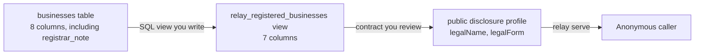

import QuickstartMeta from '../../../components/QuickstartMeta.astro';

Registry Relay compiles one reviewed contract into a read-only HTTP API over a database an
institution already holds. In this tutorial you will publish a small business register that
answers with a company's legal name and legal form, refuses to answer with its address, and
never sees the registrar's internal notes at all.

<QuickstartMeta
  outcome="One public register API serving two reviewed fields, refusing a third, with an audit line for the answer it gave."
  time="About 30 minutes"
  level="Local development with synthetic data"
  prerequisites={['The sqlite3 command line', 'A shell with curl', 'The OpenSSL command line', 'An editor', 'Linux amd64, the platform the relay installer supports']}
/>

## Understand the flow

Two boundaries stand between the database and the caller, and you author both of them.



The view decides which columns can leave the database at all. The disclosure profile decides
which of those the API is willing to answer with. `registrar_note` never crosses the first
boundary, and `registeredAddress` never crosses the second.

## Install Registry Relay

You need two binaries: `relay` serves a sealed package, while `relayctl` authors and checks a
project. The installer accepts Linux amd64 only and places both in `~/.local/bin` unless you set
`RELAY_INSTALL_DIR`:

```sh
curl -fsSL https://github.com/registrystack/registry-stack/releases/latest/download/relay-install.sh | bash
relay --version
relayctl --version
```

If either version command is not found, add `~/.local/bin` to your `PATH`.

The installer checks both binaries against the release `SHA256SUMS` before either one reaches
your `PATH`, which catches a truncated or corrupted download but not a substituted release.
Replace `| bash` with `| less` to read the installer first, and before you run these binaries
anywhere but your own machine, verify the signed checksum chain described in
[OpenSSF and release trust](../../security/openssf-evidence/).

## Start a project

`relayctl init` writes a starter project into a new directory:

```sh
relayctl init business-registry
cd business-registry
```

It reports the files it created. Every `relayctl` command reports in the same shape: one line
saying what happened, then the detail underneath. Add `--json` to any of them for the full report
as JSON, which carries more than the summary a person reads.

```text
Initialized an authoring project. 7 files written.
  registry.yaml
  runtime.yaml
  governance/identifier-lifecycle.yaml
  governance/classification-review.yaml
  governance/legal-basis.yaml
  governance/processing.dpv.yaml
  codelists/record-lifecycle.yaml
```

`registry.yaml` is the contract: what the register means and what it may release. `runtime.yaml`
is the deployment binding: where the database is, where audit goes, what to listen on. The
`governance/` files are the institutional record behind the contract. You will edit all three
kinds before the end.

## Build the register database

The institution's database is an input, not part of the project. Create a small one here.

Create `registry.sql` and put this in it:

```sql
CREATE TABLE businesses (
  registration_number TEXT PRIMARY KEY NOT NULL,
  record_revision     TEXT NOT NULL,
  lifecycle_state     TEXT NOT NULL,
  recorded_at         TEXT NOT NULL,
  legal_name          TEXT NOT NULL,
  legal_form          TEXT NOT NULL,
  registered_address  TEXT NOT NULL,
  registrar_note      TEXT NOT NULL
) STRICT;

INSERT INTO businesses VALUES
  ('BIZ-0001', '3', 'ACTIVE',  '2026-02-11T09:00:00Z', 'Aurora Freight Cooperative', 'COOPERATIVE', '14 Harbour Road, Port Meridian',  'Renewal reviewed by registrar A'),
  ('BIZ-0002', '1', 'ACTIVE',  '2026-01-04T09:00:00Z', 'Meridian Dairy Limited',     'COMPANY',     '3 Mill Lane, Northfield',         'Filed on paper'),
  ('BIZ-0003', '7', 'RETIRED', '2025-11-20T09:00:00Z', 'Kestrel Analytics Limited',  'COMPANY',     '77 Vantage Street, Port Meridian', 'Struck off, registrar B');

CREATE VIEW relay_registered_businesses AS
SELECT registration_number,
       record_revision,
       lifecycle_state,
       recorded_at,
       legal_name,
       legal_form,
       registered_address
FROM businesses;
```

The view is the point of the file. Relay binds a resource to a view, never to a base table, so
the institution decides in SQL which columns are even eligible for publication. `registrar_note`
is not in the view, so nothing later in this tutorial can reach it, whatever the contract says.

Create the database and make it read-only:

```sh
sqlite3 registry.sqlite < registry.sql
chmod 444 registry.sqlite
```

These commands print nothing when they succeed. Relay opens the database read-only in any case;
the file mode makes that visible to anyone reading the deployment.

## Record the schema you reviewed

Ask `relayctl` what it sees in the database:

```sh
relayctl inspect registry.sqlite
```

The report opens with a fingerprint of the whole schema, then lists every table, view, index, and
column:

```text
Inspected the SQLite structure. 3 objects.
  fingerprint  sha256:b3c73e50829bf63f8034bac74ce23c9b387fa4e84ca0afc27bb98d5eccc0fe18

  index  sqlite_autoindex_businesses_1  on businesses
  table  businesses
    registration_number  TEXT  not null  primary key
    record_revision      TEXT  not null
    lifecycle_state      TEXT  not null
    recorded_at          TEXT  not null
    legal_name           TEXT  not null
    legal_form           TEXT  not null
    registered_address   TEXT  not null
    registrar_note       TEXT  not null
  view  relay_registered_businesses
    registration_number  TEXT  nullable
    record_revision      TEXT  nullable
    lifecycle_state      TEXT  nullable
    recorded_at          TEXT  nullable
    legal_name           TEXT  nullable
    legal_form           TEXT  nullable
    registered_address   TEXT  nullable
```

The fingerprint covers the schema statements SQLite stored, not the rows. Inserting or editing
records never changes it. Reformatting a `CREATE TABLE` or `CREATE VIEW` does change it, even
when the resulting schema is the same, because the stored statement text is part of what is
hashed. The same stored schema always produces the same fingerprint, on any machine and on every
run, so a value that differs from the one this tutorial prints means your schema text differs, not
that your run went wrong.

Copy your own fingerprint out of that report. Writing it into the contract is how you say which
schema you reviewed. If someone later adds, drops, or retypes a column, the fingerprint changes
and Relay refuses to serve rather than guessing whether your review still applies.

## Write the contract

The contract names the register, binds the resource to the view, publishes three properties, and
then discloses only two of them. It is shown here one section at a time. Empty `registry.yaml`
first, then append each block below in the order it appears; together they are the file
`relayctl check` reads.

Start with what the document is:

```yaml
apiVersion: relay.registrystack.org/v2alpha1
kind: RegistryContract
metadata:
  id: business-registry
  version: draft-1
  title: Business register
```

`metadata.version` is your own label for this revision of the contract. It is not the revision
Relay computes and reports, which is a digest of the compiled contract and which you cannot set
by hand.

Next, who the register belongs to and what it claims to be authoritative about:

```yaml
registry:
  registryIdentifier: urn:example:registry:businesses
  name: Business register
  authority:
    identifier: urn:example:authority:registrar
    name: Companies Registrar
  authoritativeScope: Reviewed authoritative records in the declared jurisdiction
  baseUri: https://registry.example.invalid/
  identifierLifecyclePolicyRef: governance/identifier-lifecycle.yaml
  alignmentTargets:
    - name: govstack-digital-registries
      version: 3.0.0-alpha.2
      status: directional
```

`authoritativeScope` is the sentence a caller reads to decide whether this register answers their
question at all. `alignmentTargets` needs at least one entry, and `status: directional` is the
honest setting for an alignment you have read but not conformance-tested.

Then the three roles that have to be attributable to someone, and where locally defined terms
live:

```yaml
governance:
  controller: urn:example:authority:registrar
  publisher: urn:example:authority:registrar
  auditOwner: urn:example:authority:registrar

semantics:
  localVocabulary: https://registry.example.invalid/vocabulary/
```

All three roles are the registrar here because one institution holds all three. They are separate
keys because in a real deployment they often are not the same body, and the audit chain is only
meaningful when someone is named as answerable for it.

Next, the vocabularies this contract classifies against:

```yaml
classifications:
  privacy:
    scheme: https://w3id.org/dpv
    version: "2.3"
  institutional:
    scheme: urn:example:classification
    version: draft-1
  handling:
    scheme: https://id.registrystack.org/vocab/handling
    version: "1"
  provenanceRef: governance/classification-review.yaml
```

Every classification later in the file is a term from one of these three schemes, pinned to a
version. `provenanceRef` points at the review record that says a person agreed with those terms,
which is the file the production gate will check later in this tutorial.

Now the source, which is where your fingerprint goes:

```yaml
sources:
  registry:
    kind: sqlite
    profile: snapshot
    expectedSchemaFingerprint: sha256:<your-schema-fingerprint>
```

Replace `sha256:<your-schema-fingerprint>` with the value `relayctl inspect` printed for your
database. Nothing else in the tutorial substitutes for it: a contract carrying anyone else's
fingerprint is refused with `source.schema_fingerprint_mismatch`.

The resource is the largest section, so it arrives in five parts. First its identity and the view
it binds to:

```yaml
resources:
  - id: registered-business
    title: Registered business
    description: One entry in the public business register.
    semanticClass: local:RegisteredBusiness
    source:
      source: registry
      view: relay_registered_businesses
    classificationDefaults:
      privacy: non-personal
      institutional: public
      handling: public
      status: reviewed
```

`view` names the view you wrote, never a base table. `classificationDefaults` applies to anything
in this resource that does not classify itself, so the defaults are what you would have to
override to publish something more sensitive.

Then the four columns that carry record identity rather than content:

```yaml
    recordContext:
      recordIdentifier:
        sourceColumn: registration_number
      revisionIdentifier:
        sourceColumn: record_revision
      lifecycleState:
        sourceColumn: lifecycle_state
        codelist: codelists/record-lifecycle.yaml
      recordedAt:
        sourceColumn: recorded_at
    sourceColumnClassifications: {}
```

`recordContext` is why an answer can say which record it is, which revision of it you got, and
whether that record is still current. The codelist has to list every lifecycle value the view can
produce, so a value the register invents later is a refusal rather than a surprise in an answer.

Then the properties the contract knows about:

```yaml
    properties:
      legalName:
        label: Legal name
        description: Registered legal name.
        sourceColumn: legal_name
        type: string
        sourceRequired: true
        semanticTerm: local:legalName
      legalForm:
        label: Legal form
        description: Registered legal form.
        sourceColumn: legal_form
        type: string
        sourceRequired: true
        semanticTerm: local:legalForm
      registeredAddress:
        label: Registered address
        description: Registered office address.
        sourceColumn: registered_address
        type: string
        sourceRequired: true
        semanticTerm: local:registeredAddress
```

All three properties are declared, including `registeredAddress`. Declaring a property is not
publishing it: the next block decides who gets which of them.

Then the disclosure and access decision:

```yaml
    disclosureProfiles:
      public:
        properties:
          - legalName
          - legalForm
    operations:
      read:
        defaultAccessProfile: public
        accessProfiles:
          public:
            access: public
            disclosureProfile: public
```

`disclosureProfiles.public` lists only `legalName` and `legalForm`. A property that is declared
and not disclosed is one the register knows about and this audience does not get, and declaring
it is what lets you disclose it later to a different audience without touching the view.
`access: public` means anonymous, and that is the whole authorization decision for this
deployment, which is why it will need no identity provider later.

Then why the register is doing this at all:

```yaml
    processingDescriptions:
      - id: consultation
        operationRefs:
          - read
        purpose: reviewed-consultation
        recipientClass: anonymous-public
        legalBasisRef: governance/legal-basis.yaml
        dpvProfileRef: governance/processing.dpv.yaml
        safeguards:
          - property-minimization
```

A processing description binds an operation to a purpose, an audience, and a legal basis on file.
Its identifier is what the audit chain records against each released answer, so a released field
can always be traced back to the stated reason for releasing it.

Finally, what a caller may read about the register itself:

```yaml
metadataVisibility:
  service: public
  resources: public
  semantics: public
  classifications: public
  processing: public
```

`metadataVisibility` is set to `public` throughout because a public audience has to be able to
resolve the schema and vocabulary the answer points at. A contract that publishes an answer
anonymously but hides the documents that explain it is refused, not served.

## Check the contract

```sh
relayctl check .
```

The check compiles the contract, opens the database read-only to confirm the view and columns
exist, and reports the revision of what it compiled. The two counts are the accepted
configuration key paths: how many keys `registry.yaml` and `runtime.yaml` will each take, not how
many yours uses:

```text
Authoring check passed.
  contract revision   sha256:<authoring-contract-revision>
  registry key paths  <n>
  runtime key paths   <n>
```

Your run prints real values where this page shows placeholders. The counts belong to the relayctl
release you installed rather than to anything you wrote, and the revision changes whenever the
compiled contract does, so pinning either one here would only tell you what an older release once
printed. Both are stable for a given release and a given contract, which is what lets a later step
compare one revision against another.

Nothing is running yet. `check` reads, and writes nothing.

## Generate the artifacts

```sh
relayctl generate .
```

This writes the published description of the register under `generated/`: an OpenAPI 3.1
description, JSON Schema and SHACL shapes, a JSON-LD context and vocabulary, the capability
inventory, the audit event schema, and the review reports. Every one of them is derived from the
contract, so none of them can describe a field the contract does not disclose. Running `generate`
again on an unchanged project rewrites the same bytes.

Two of the generated files are review inputs rather than outputs. `generated/reports/classification-inventory.json`
is the list of source columns and output properties with the handling each one carries.
`generated/governance/classification-review-starter.yaml` is a pre-filled review record for
exactly that inventory. Its `classificationInventoryDigest` is a digest of your own inventory,
so it changes whenever the contract changes what is classified:

```yaml
apiVersion: relay.registrystack.org/classification-review/v1
kind: ClassificationReview
registryIdentifier: urn:example:registry:businesses
classificationInventoryDigest: sha256:<inventory-digest>
method: generated
reviewer: urn:example:authority:registrar
reviewDate: pending-review
status: suggested
rationaleRef: pending-review
generatedIdentification: ...
```

`status: suggested` and `reviewDate: pending-review` are the tool saying it has an opinion and no
authority. Only a person supplies the rest.

## See what production refuses

```sh
relayctl check . --production
```

The starter project is refused, and the diagnostics say exactly why. Each one gives its severity,
its code, the file and key it is about, and the sentence underneath:

```text
Production check refused.

  error    codelist.unreviewed  codelists/record-lifecycle.yaml
           production codelists must be institutionally reviewed
  error    classification.review_inventory_stale  governance/classification-review.yaml:classificationInventoryDigest
           the classification review does not bind the current inventory
  error    classification.review_registry_stale  governance/classification-review.yaml:registryIdentifier
           the classification review is bound to another Registry
  error    classification.review_date_invalid  governance/classification-review.yaml:reviewDate
           the review date must be a canonical calendar date
  error    classification.review_unreviewed  governance/classification-review.yaml:status
           production classification requires reviewed institutional evidence

5 errors, 0 warnings.
```

This is the governed result. A contract that compiles is not a contract an institution has
agreed to publish, and `--production` is the difference between the two.

## Record the review

Replace `governance/classification-review.yaml` with the review a person signs off. Copy
`classificationInventoryDigest` out of the starter file `generate` wrote, and use the date on
which you actually read the inventory:

```yaml
apiVersion: relay.registrystack.org/classification-review/v1
kind: ClassificationReview
registryIdentifier: urn:example:registry:businesses
classificationInventoryDigest: sha256:<inventory-digest>
method: manual
reviewer: urn:example:authority:registrar
reviewDate: 2026-08-11
status: reviewed
rationaleRef: governance/classification-review-rationale.md
```

`method: manual` is the honest description of what you just did: a person read the inventory and
accepted it. `method: generated` is for the case where tooling produced the classifications and
the review binds the report and rule pack that produced them, which the starter file shows.

Write the rationale it points at, in `governance/classification-review-rationale.md`:

```markdown
# Classification review

The registrar read `generated/reports/classification-inventory.json` on
2026-08-11 and accepted it unchanged. Legal name and legal form are already
published in the paper register, so disclosing them to anonymous callers adds
no new disclosure. Registered address stays undisclosed pending a separate
review.
```

Mark the legal basis reviewed in `governance/legal-basis.yaml`:

```yaml
status: reviewed
legalBasis: Public inspection of the business register under the Companies Act.
```

And the codelist in `codelists/record-lifecycle.yaml`, which has to list every lifecycle value
the view can produce:

```yaml
id: record-lifecycle
version: draft-1
values: [ACTIVE, RETIRED]
status: reviewed
```

Now run the production check again:

```sh
relayctl check . --production
```

```text
Production check passed.
  contract revision   sha256:<contract-revision>
  registry key paths  <n>
  runtime key paths   <n>
```

The contract revision is not the one the first check reported: run this yourself and you will see
a different digest here than the authoring check printed above. The revision covers the governed
files the contract points at, so recording the review changed it, and every answer the service
gives will carry this value rather than the earlier one.

## Seal the package

```sh
relayctl package . --output package
```

```text
Sealed a deployment package. <n> artifacts, <n> files.
  package version    relay.registrystack.org/package/v1alpha3
  package revision   sha256:<package-revision>
  contract revision  sha256:<contract-revision>
  artifact bindings  <n>

  source schema fingerprints
    registry  sha256:b3c73e50829bf63f8034bac74ce23c9b387fa4e84ca0afc27bb98d5eccc0fe18
```

That report summarizes `package/relay-package.json`, which names every file and artifact in
the package with a digest for each and records the full observed schema of every source. The
package holds the compiled contract, the generated artifacts, and the governed files. It
does not hold the database. Packaging recompiles under the production profile, so a package
cannot be produced from a revision that would fail `check --production`.

## Serve it

`runtime.yaml` from `relayctl init` already points at `registry.sqlite` and `package`, so it
needs no edit. Read it once:

```yaml
apiVersion: relay.registrystack.org/v2alpha1
kind: RelayRuntime
server: {bind: "127.0.0.1:8080"}
packagePath: package
sources: {registry: {path: registry.sqlite}}
authentication: {issuer: null}
audit: {sink: var/audit.jsonl, integrityKeyRef: secret:env/RELAY_AUDIT_KEY}
limits: {requestTimeoutMilliseconds: 1500, concurrentQueries: 8}
```

`authentication: {issuer: null}` works here only because every access profile in the contract is
public. Add one protected profile and Relay refuses to start without a reachable token issuer,
even for requests that would have been anonymous.

Create the audit directory and the integrity key, then start the service:

```sh
mkdir -m 700 var
export RELAY_AUDIT_KEY="$(openssl rand -base64 32)"
relay serve --runtime runtime.yaml
```

Mode `700` is required, not tidiness. The audit directory must be owner-only, and Relay refuses
to start when any group or other bit is set on it. Keep the key for the life of the deployment,
too. The chain is bound to it, so a new key against an existing `var/audit.jsonl` is a startup
failure rather than a fresh start.

Relay writes line-delimited JSON to standard output. It logs `relay startup began`, and then
`relay service listening` with the bound address once the port is actually held. If the second
line does not appear, the service did not start and the log says why.

Leave that running and open a second shell in the same directory.

## Ask the register a question

```sh
curl -s http://127.0.0.1:8080/ready
```

```json
{"status":"ready"}
```

Then ask for a record:

```sh
curl -s http://127.0.0.1:8080/v2/resources/registered-business/records/BIZ-0001
```

The answer, abridged to the part this step is about. The real one also carries the URLs a caller
follows to the generated schema, vocabulary, and JSON-LD context:

```json
{
  "data": {
    "recordIdentifier": "BIZ-0001",
    "revisionIdentifier": "3",
    "lifecycleState": "ACTIVE",
    "recordedAt": "2026-02-11T09:00:00Z",
    "registryIdentifier": "urn:example:registry:businesses",
    "authorityIdentifier": "urn:example:authority:registrar",
    "domainData": {
      "legalName": "Aurora Freight Cooperative",
      "legalForm": "COOPERATIVE"
    }
  },
  "meta": {
    "accessProfile": "public",
    "disclosureProfile": "public",
    "selectedFields": ["legalName", "legalForm"],
    "contractRevision": "sha256:<contract-revision>",
    "sourceRevision": {"profile": "snapshot", "status": "versioned", "value": "sha256:<digest>"}
  }
}
```

`domainData` carries the two disclosed fields. The address is in the view and in the contract,
and it is not here. Every answer also states which contract revision produced it and which
source revision it read, so a caller can tell two answers apart without asking you.

## Ask for less, then try to ask for more

A caller can narrow the answer:

```sh
curl -s 'http://127.0.0.1:8080/v2/resources/registered-business/records/BIZ-0001?fields=legalName'
```

`domainData` now contains `legalName` alone, and `meta.selectedFields` says so.

A caller cannot widen it:

```sh
curl -s 'http://127.0.0.1:8080/v2/resources/registered-business/records/BIZ-0001?fields=registeredAddress'
```

```json
{
  "type": "https://id.registrystack.org/problems/registry-relay/request/fields_invalid",
  "title": "Field selection is invalid",
  "status": 400,
  "code": "request.fields_invalid",
  "detail": "field selection is invalid",
  "traceId": "<trace-id>"
}
```

The refusal is a request error, not a permission error, because from this audience's side the
field does not exist. `traceId` is the same identifier the service logged for that request, which
is how an operator ties a caller's complaint to one log line without the caller quoting the
answer. An unknown record is a separate refusal:

```sh
curl -s http://127.0.0.1:8080/v2/resources/registered-business/records/BIZ-9999
```

```json
{
  "type": "https://id.registrystack.org/problems/registry-relay/consultation/unresolved",
  "title": "Requested record was not resolved",
  "status": 404,
  "code": "consultation.unresolved",
  "detail": "the requested record was not resolved",
  "traceId": "<trace-id>"
}
```

Two more routes are worth a look. `GET /v2` returns the register's own description, authority,
and capability list. `GET /v2/resources` returns the resources this audience may call. Both
answer anonymously here because `metadataVisibility` said they may.

## Read the audit entry

Stop the service with `Ctrl+C` and read the first audit line:

```sh
head -n 1 var/audit.jsonl
```

The line is one JSON object. Abridged to the fields this step is about:

```json
{
  "envelope_id": "<envelope-id>",
  "prev_hash": null,
  "record": {
    "operationIdentifier": "registered-business.read",
    "resourceIdentifier": "registered-business",
    "principalKind": "anonymous",
    "accessProfile": "public",
    "disclosureProfile": "public",
    "selectedProperties": ["legalName", "legalForm"],
    "processingDescriptionIdentifiers": ["consultation"],
    "contractRevision": "sha256:<contract-revision>",
    "sourceRevision": {"profile": "snapshot", "status": "versioned", "value": "sha256:<digest>"},
    "phase": "attempt"
  },
  "record_hash": "<record-hash>"
}
```

The envelope also carries `timestamp_unix_ms`. The full `record` carries more than is shown: the
registry identifier, the revision of the access rules that were applied, the operation surface
and wire format, the trace identifier shared with the log line, and the handling levels the
answer was released under. None of them is a field value either.

Read what is not there. The line records that an anonymous caller reached the
`registered-business.read` operation, and that the contract scoped the answer to the properties
`legalName` and `legalForm` under the `consultation` processing description. It does not record
what the values were.

Read the phase too. `attempt` is written before Relay reads the source, so this line proves the
request was accepted and scoped, not that it was answered. The matching `terminal` line carries
the outcome, and a refusal is written as `refusal` instead. `prev_hash` is `null` on the first
line and links each subsequent line to the one before it, which is what the integrity key
protects.

## Clean up

```sh
cd ..
rm -rf business-registry
unset RELAY_AUDIT_KEY
```

## What you built

- A public read-only API whose whole surface came from one reviewed contract, with no route,
  filter, or field created by convention from the database.
- Two boundaries under separate control: a SQL view the institution owns, and a disclosure
  profile the contract owns.
- A production gate that refused the register until a named reviewer, a date, a rationale, and a
  digest of the exact inventory they reviewed were on file.
- A caller who can narrow an answer and cannot widen it.
- An audit chain that records which properties were released, to whom, under which contract
  revision, without recording the values.

## Troubleshooting

| Symptom | Cause | Fix |
| --- | --- | --- |
| `project.destination_not_empty` from `relayctl init` | The target directory already has files | Initialize into a new directory name. |
| `contract.yaml_invalid` from `relayctl check` | A required key is missing, an unknown key is present, or the YAML does not parse | Every key in the contract above is required. `registry.alignmentTargets` needs at least one entry. |
| `resource.view_unknown` | `source.view` names something that is not a view in the database | Relay binds to views only. Add a `CREATE VIEW` for the columns you intend to publish. |
| `source.schema_fingerprint_invalid` | `expectedSchemaFingerprint` still holds the `sha256:<your-schema-fingerprint>` placeholder | Run `relayctl inspect registry.sqlite` and paste the value it prints. |
| `source.schema_fingerprint_mismatch` | The contract holds a fingerprint from a different schema, usually because the SQL was retyped rather than copied | Run `relayctl inspect registry.sqlite` again and paste the current value. |
| `metadata.reference_visibility_invalid` | A public audience cannot resolve the schema or vocabulary the answer points at | Set `metadataVisibility.resources` and `.semantics` to `public` when any access profile is public. |
| `classification.review_inventory_stale` | The contract changed after the review was recorded | Run `relayctl generate .` again and copy the new digest from `generated/governance/classification-review-starter.yaml`. |
| `the required audit sink is not ready` at startup | `var/` is not owner-only, or `RELAY_AUDIT_KEY` differs from the key that started the existing chain | `chmod 700 var`, and either restore the original key or remove `var/audit.jsonl` to start a new chain. |

## Next

- [Understand Relay's product boundary](../../explanation/governed-registry-publication/) to
  decide whether Relay fits an institutional register.
- [Author a Registry Relay project](../../configure/relay/) to add list and search operations,
  protected access profiles, and a second disclosure profile for a named audience.
- [Review semantics, classification, and disclosure](../../explanation/relay-semantics-and-disclosure/)
  before assigning published names and handling levels to real fields.
- [Operate Registry Relay](../../operate/relay/) to bind a real token issuer, trusted paths,
  audit retention, and a private listener.
