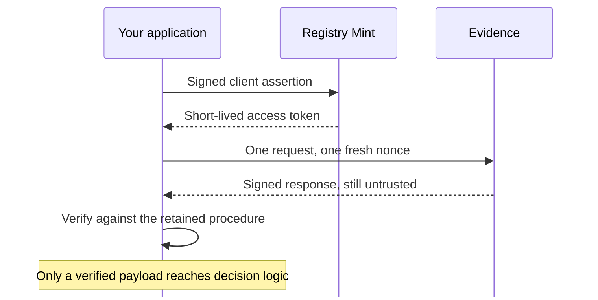

import QuickstartMeta from '../../../components/QuickstartMeta.astro';

Complete [Get your first Evidence assertion](../first-evidence-assertion/) before starting this
tutorial. There you drove the Evidence boundary from a terminal with `evidencectl` and `curl`. Here
you move the same boundary into application code: your program obtains its own access token, sends
one request, and refuses to read the answer until the signed response has satisfied expectations the
program itself retained.

<QuickstartMeta
  outcome="A Python application that answers an adult-status question only from a verified assertion."
  time="About 20 minutes"
  level="Local development with synthetic data"
  prerequisites={[
    'The completed first Evidence assertion tutorial',
    'Its adult-status project and running registry.py',
    'Python 3.10 or later',
    'A Rust toolchain and git, to build the client from source',
  ]}
/>

## Understand what the client owns



The client library performs the token exchange, the request, and the verification. It does not
decide what a valid answer is. Your application states that once, as a relying procedure, and the
library refuses every response that does not match it.

## Give the application its own identity

Enter the existing project:

```sh
cd adult-status
```

An application authenticates as a registered client, not as the project owner. Define a policy for
the question it may ask, then register the client:

```sh
evidencectl access policy add age-checks --question adult-status
evidencectl access client add age-checker \
  --policy age-checks \
  --generate-local-key
```

```text
Added access policy age-checks for adult-status.
Added client age-checker with policy age-checks.
```

The reviewable registration at `access/clients/age-checker.yaml` carries the policy membership and
the public key. The private key stays owner-only at `.evidence/clients/age-checker/private.jwk` and
is the application's identity. The registration also fixes the audience the application must state
for itself:

```sh
grep evidenceAudience access/clients/age-checker.yaml
```

```text
evidenceAudience: urn:registrystack:evidence:local:client:age-checker
```

A project with no access policy has an unnamed development caller. Registering the first policy
removes it, so from now on every request in this project names a client.
[Control who can request Evidence](../control-who-can-request-evidence/) covers policies, live
onboarding, and revocation in full.

## Pin the keys your application trusts

The application must decide which signing keys it accepts before any response exists. Build a JWKS
from the project's own retained public signing key:

```sh
evidencectl jwks --out trusted-issuer-keys.json secrets/signing-ed25519-public.jwk.json
```

```text
wrote trusted-issuer-keys.json
```

In this tutorial the issuer and the relying party are the same person, so a local file stands in for
what production requires: keys received over a channel independent of the responses they verify. The
client never fetches trust from a response or from a discovery document. See
[Manage verifier trust and key rotation](../manage-evidence-verifier-trust/) for the production
handling.

## Build the Python client

The client is not published to a package index yet, so build the extension module from a checkout of
the repository. From inside the project directory:

```sh
git clone --depth 1 https://github.com/registrystack/registry-stack.git ../registry-stack
cargo build --locked --manifest-path ../registry-stack/Cargo.toml \
  -p registry-evidence-client-py --lib \
  --features registry-evidence-client-py/extension-module
```

If you already have a checkout, point the two `../registry-stack` paths at it instead of cloning.

Copy the compiled library into a directory the application imports from:

```sh
mkdir -p python-module
case "$(uname -s)" in
  Darwin) built=libregistry_evidence_client.dylib ;;
  Linux) built=libregistry_evidence_client.so ;;
esac
cp "../registry-stack/target/debug/$built" python-module/registry_evidence_client.so
```

Python imports an extension module from a plain `.so` name on both platforms. macOS and Linux are
the platforms this build path covers. The build needs `python3` on `PATH`, because the binding
configures itself against the interpreter it will be imported by.

## Start the local services

Compile the question and the access policy into a fresh generation, and start Evidence and Registry
Mint:

```sh
evidencectl dev --detach
```

```text
Evidence ready at http://127.0.0.1:8080
Mint ready at http://127.0.0.1:8081
```

The `registry.py` server from the first tutorial must still be running in its own terminal. Evidence
reads the source record through it.

The access policy is now part of the running generation, so a terminal request names a client too.
Confirm that the project no longer accepts an unnamed one:

```sh
evidencectl request prepare adult-status \
  --purpose age-check \
  --subject person_id=person-123 \
  --name unnamed-caller
```

```text
evidencectl: the active project requires a registered client selected with --client
```

## Read the definitions once

Ask the deployment which complete request shapes this client may send, and keep the answer to
review:

```sh
python3 - <<'PY'
import json
import sys
from pathlib import Path

sys.path.insert(0, "python-module")

from registry_evidence_client import EvidenceClient

client = EvidenceClient(
    base_url="http://127.0.0.1:8080",
    trusted_jwks=json.loads(Path("trusted-issuer-keys.json").read_text()),
    token={
        "private_key_jwt": {
            "token_endpoint": "http://127.0.0.1:8081/token",
            "client_id": "age-checker",
            "client_key": json.loads(
                Path(".evidence/clients/age-checker/private.jwk").read_text()
            ),
        },
    },
)
document = json.dumps(client.discover(), indent=2, sort_keys=True)
Path("discovery.json").write_text(document + "\n")
print(document)
PY
```

```json
{
  "assuranceProfile": "local",
  "configurationRevision": "sha256:<revision>",
  "definitions": [
    {
      "concepts": [
        {
          "form": "boolean",
          "id": "urn:registrystack:evidence:local:concept:adult-status:is_adult"
        }
      ],
      "evidenceType": "urn:registrystack:evidence:local:evidence-type:adult-status",
      "kind": "criterion",
      "purpose": "age-check",
      "referenceFrameworks": [
        "urn:registrystack:evidence:local:framework:adult-status"
      ],
      "requirement": "urn:registrystack:evidence:local:requirement:adult-status",
      "subjects": [
        {
          "cardinality": "one",
          "role": "person",
          "selector": {
            "fields": [
              {
                "maximumBytes": 200,
                "minimumBytes": 1,
                "name": "person_id",
                "type": "string"
              }
            ],
            "profile": "local-subject-adult-status-v1",
            "valueOrigin": "request"
          }
        }
      ]
    }
  ],
  "issuedBy": "urn:registrystack:evidence:local:issuer",
  "providedBy": "urn:registrystack:evidence:local:provider",
  "schema": "registry.evidence-definitions/v1"
}
```

Discovery is authenticated, and it grants no authority. It answers exactly one question: which
complete request shapes this client may send. It is not a trust anchor, and a request must never
take an expectation from a discovery response fetched alongside it.

Read it here once, to author the procedure. From now on the procedure supplies every request's
expectations.

## Pin the procedure

Write what you just reviewed into a file the application owns. This step makes no network call: it
transforms the document you already read, so the identifiers and the revision are transcribed rather
than copied by hand. The constants at the top are the application's own, stated rather than read:

```sh
python3 - <<'PY'
import json
import sys
from pathlib import Path

REQUIREMENT = "urn:registrystack:evidence:local:requirement:adult-status"

# Chosen by this application, not published by the deployment.
AUDIENCE = "urn:registrystack:evidence:local:client:age-checker"
EXPECTED_OUTPUTS = [
    {
        "concept": "urn:registrystack:evidence:local:concept:adult-status:is_adult",
        "form": "boolean",
    },
]
MAXIMUM_LIFETIME_SECONDS = 300
CLOCK_SKEW_SECONDS = 30

published = json.loads(Path("discovery.json").read_text())
definition = next(
    (item for item in published["definitions"] if item["requirement"] == REQUIREMENT),
    None,
)
if definition is None:
    sys.exit(f"this client may not request {REQUIREMENT}")

# Fail here, at review time, rather than at verification time.
offered = {concept["id"] for concept in definition["concepts"]}
absent = [item["concept"] for item in EXPECTED_OUTPUTS if item["concept"] not in offered]
if absent:
    sys.exit(f"the deployment no longer publishes {', '.join(absent)}")

document = json.dumps(
    {
        "requirement": definition["requirement"],
        "purpose": definition["purpose"],
        "evidence_type": definition["evidenceType"],
        "issued_by": published["issuedBy"],
        "provided_by": published["providedBy"],
        "configuration_revision": published["configurationRevision"],
        "expected_assurance_profile": published["assuranceProfile"],
        "audience": AUDIENCE,
        "expected_outputs": EXPECTED_OUTPUTS,
        "maximum_assertion_lifetime_seconds": MAXIMUM_LIFETIME_SECONDS,
        "clock_skew_seconds": CLOCK_SKEW_SECONDS,
    },
    indent=2,
    sort_keys=True,
)
Path("procedure.json").write_text(document + "\n")
print(document)
PY
```

```json
{
  "audience": "urn:registrystack:evidence:local:client:age-checker",
  "clock_skew_seconds": 30,
  "configuration_revision": "sha256:<revision>",
  "evidence_type": "urn:registrystack:evidence:local:evidence-type:adult-status",
  "expected_assurance_profile": "local",
  "expected_outputs": [
    {
      "concept": "urn:registrystack:evidence:local:concept:adult-status:is_adult",
      "form": "boolean"
    }
  ],
  "issued_by": "urn:registrystack:evidence:local:issuer",
  "maximum_assertion_lifetime_seconds": 300,
  "provided_by": "urn:registrystack:evidence:local:provider",
  "purpose": "age-check",
  "requirement": "urn:registrystack:evidence:local:requirement:adult-status"
}
```

`procedure.json` is the pinned procedure. In a real deployment you review it, commit it, and ship it
with the application. You do not regenerate it at startup: an application that refreshes its
expectations from the deployment it is checking has no expectations of its own.

Three of those values are the application's own judgement, and no deployment can supply them:

- `audience` is the identifier the client registration assigned this application.
- `maximum_assertion_lifetime_seconds` and `clock_skew_seconds` are its own bounds on how stale an
  answer it will accept.

`expected_outputs` is stated by hand for a different reason. A concept's published `form` and a
verification expectation's `form` are separate vocabularies: a boolean concept is expected as
`boolean`, but controlled codes and bounded decimals are expected as `string`, bounded integers as
`integer`, and the two list forms need explicit bounds. Deriving the expectation from the published
form would work for this requirement and mislead you on the next one. The concept identifiers are
still checked against discovery above, so a deployment that stops publishing one fails at review
time rather than at verification time.

`subject_expectations` is absent from the file because it is per-request: it is what the application
already knows about the subject in front of it.

Regenerating this file is a review step, not a retry. The revision covers the deployment's entire
governed configuration, so it moves whenever an operator changes any of it, and verification then
fails until someone has looked at what changed. When that happens, keep the reviewed copy, write a
new one, and `diff` them before accepting: a changed revision alone is routine, a changed
`evidence_type`, `issued_by`, or concept set means the question itself moved.

## Write the relying procedure

Open `age_check.py` in your editor and add the application. It loads the pinned procedure and never
calls discovery again:

```python
import json
import sys
from pathlib import Path

sys.path.insert(0, "python-module")

from registry_evidence_client import (
    DeniedError,
    EvidenceClient,
    EvidenceClientError,
    NotAvailableError,
    VerificationError,
)

# The reviewed procedure. This program never calls discovery: every expectation
# comes from the file that was pinned when it was written.
PROCEDURE = json.loads(Path("procedure.json").read_text())
IS_ADULT = "urn:registrystack:evidence:local:concept:adult-status:is_adult"
SELECTOR_PROFILE = "local-subject-adult-status-v1"
BINDINGS = Path("subject-bindings.json")


def build_client():
    """Configure the one deployment this application talks to."""
    return EvidenceClient(
        base_url="http://127.0.0.1:8080",
        trusted_jwks=json.loads(Path("trusted-issuer-keys.json").read_text()),
        token={
            "private_key_jwt": {
                "token_endpoint": "http://127.0.0.1:8081/token",
                "client_id": "age-checker",
                "client_key": json.loads(
                    Path(".evidence/clients/age-checker/private.jwk").read_text()
                ),
            },
        },
    )


def expectations_for(person_id):
    """Pin a binding this application has already seen, or accept first use."""
    if BINDINGS.exists():
        return json.loads(BINDINGS.read_text()).get(person_id, "accept_first_use")
    return "accept_first_use"


def remember(person_id, pinned):
    store = json.loads(BINDINGS.read_text()) if BINDINGS.exists() else {}
    store[person_id] = pinned
    BINDINGS.write_text(json.dumps(store, indent=2, sort_keys=True) + "\n")


def ask_is_adult(client, person_id):
    spec = dict(
        PROCEDURE,
        subjects=[
            {
                "role": "person",
                "selector_profile": SELECTOR_PROFILE,
                "selector_values": {"person_id": person_id},
            },
        ],
        subject_expectations=expectations_for(person_id),
    )
    verified = client.request_and_verify(client.prepare(spec))
    answers = {
        value["providesValueFor"]: value["value"]
        for value in verified.evidence["supportedValues"]
    }
    return answers[IS_ADULT], verified.pinned_subject_expectations


person_id = sys.argv[1] if len(sys.argv) > 1 else "person-123"
try:
    is_adult, pinned = ask_is_adult(build_client(), person_id)
except VerificationError as error:
    sys.exit(f"unverifiable response, nothing read ({error.code}): {error}")
except DeniedError as error:
    sys.exit(f"refused by the deployment (status {error.status}): {error}")
except NotAvailableError as error:
    sys.exit(f"no evidence available: {error}")
except EvidenceClientError as error:
    sys.exit(f"exchange did not complete ({error.kind}): {error}")

remember(person_id, pinned)
print(f"{person_id} is_adult={is_adult}")
print(f"pinned binding recorded in {BINDINGS}")
```

Five properties of that code are the point of this tutorial:

- Every expectation comes from `procedure.json`. The program holds no discovery client and cannot
  learn what to expect from the deployment it is checking.
- `prepare` performs no network call. It closes the request, generates a fresh nonce, and builds the
  verification policy while the answer is still unknown. A prepared request is good for one send.
- `request_and_verify` returns only after the response satisfied the policy. There is no object in
  this program that holds a decoded but unverified payload.
- The answer is read from a mapping keyed by the concept identifier, never by position, so a
  response carrying different values cannot be misread as this one.
- Three failures get their own branch, and `EvidenceClientError` catches the rest. Every path exits.
  Nothing falls through to a default answer.

## Run it

The recorded subject binding is scoped to this audience and purpose, so keep it owner-only:

```sh
umask 077
python3 age_check.py
```

```text
person-123 is_adult=True
pinned binding recorded in subject-bindings.json
```

The first run had nothing to pin, so it accepted the binding on first use and recorded it. Run it
again:

```sh
python3 age_check.py
```

```text
person-123 is_adult=True
pinned binding recorded in subject-bindings.json
```

The second run pinned the recorded binding, and the response had to carry that exact value. The
binding is stable for the same subject, audience, and purpose, and unrelated for any other audience
or purpose. First use proves only that a response was signed for the request that was sent; pinning
is what ties later answers to the same subject your application saw before.

Ask about a different record:

```sh
python3 age_check.py person-456
```

```text
person-456 is_adult=False
pinned binding recorded in subject-bindings.json
```

The registry holds a name and a date of birth for both people. Neither answer contains either.

## Refuse before reading

Change one stored binding to prove that the application, not the deployment, decides what it
accepts:

```sh
python3 - <<'PY'
import json
from pathlib import Path

store = json.loads(Path("subject-bindings.json").read_text())
store["person-123"] = store["person-456"]
Path("subject-bindings.json").write_text(json.dumps(store, indent=2, sort_keys=True) + "\n")
PY
python3 age_check.py person-123
```

```text
unverifiable response, nothing read (policy): the Evidence response failed verification: Evidence payload does not match the relying procedure
```

Evidence answered the request successfully. The client discarded the response because it did not
match the retained expectation, and `age_check.py` exited without reading a value. Editing the
`configuration_revision` in `procedure.json` fails the same way, and for the same reason.

Delete `subject-bindings.json` to start the pinning over.

Branch on the exception class or on `kind`, never on the message text, which is not frozen:

| `kind` | Class | Meaning |
| --- | --- | --- |
| `configuration` | `ConfigurationError` | The client cannot be used as configured, or a prepared request was already sent. |
| `nonce` | `NonceError` | The request nonce could not be generated. |
| `token` | `TokenError` | No credential could be obtained. Read `token_kind`. |
| `transport` | `TransportError` | The exchange failed below the HTTP layer. Read `transport_kind`. |
| `denied` | `DeniedError` | The deployment refused with a coded problem response. |
| `not_available` | `NotAvailableError` | The deployment answered that no evidence is available. |
| `protocol` | `ProtocolError` | The deployment answered outside its contract, or the response could not be parsed. |
| `verification` | `VerificationError` | A signed response failed offline verification. Read `code`. |

Every class above inherits from `EvidenceClientError`, which carries `kind`. HTTP 401, 403, and 429
all map to `denied`, whatever the response body's own code says, and every other non-2xx status maps
to `protocol`. No exception carries response bytes, a credential, a header value, a selector value,
or a subject binding.

Two failures sit outside that hierarchy, because neither is a mapped failure of the exchange: the
client's internal runtime failing to start raises `RuntimeError`, and a serialization failure on a
value the client itself built raises `ValueError`.

## Stop the local services

```sh
evidencectl dev stop
evidencectl dev clean
```

```text
Local Evidence stopped
Removed stopped local Evidence state
```

This keeps `age_check.py`, `discovery.json`, `procedure.json`, the pinned JWKS, the recorded
bindings, and the client's private key.
Return to the first terminal and press `Ctrl+C` to stop `registry.py`.

## Next

- [Verify Evidence as a consumer](../verify-an-assertion-as-a-consumer/), for re-verifying a stored
  response at the recorded decision time
- [Control who can request Evidence](../control-who-can-request-evidence/), for policies and
  revocation
- [Request an access token from your own code](../../configure/request-an-access-token/), for the
  token exchange without the client library
- [Review the Evidence Gateway API](../../reference/apis/registry-evidence/)
