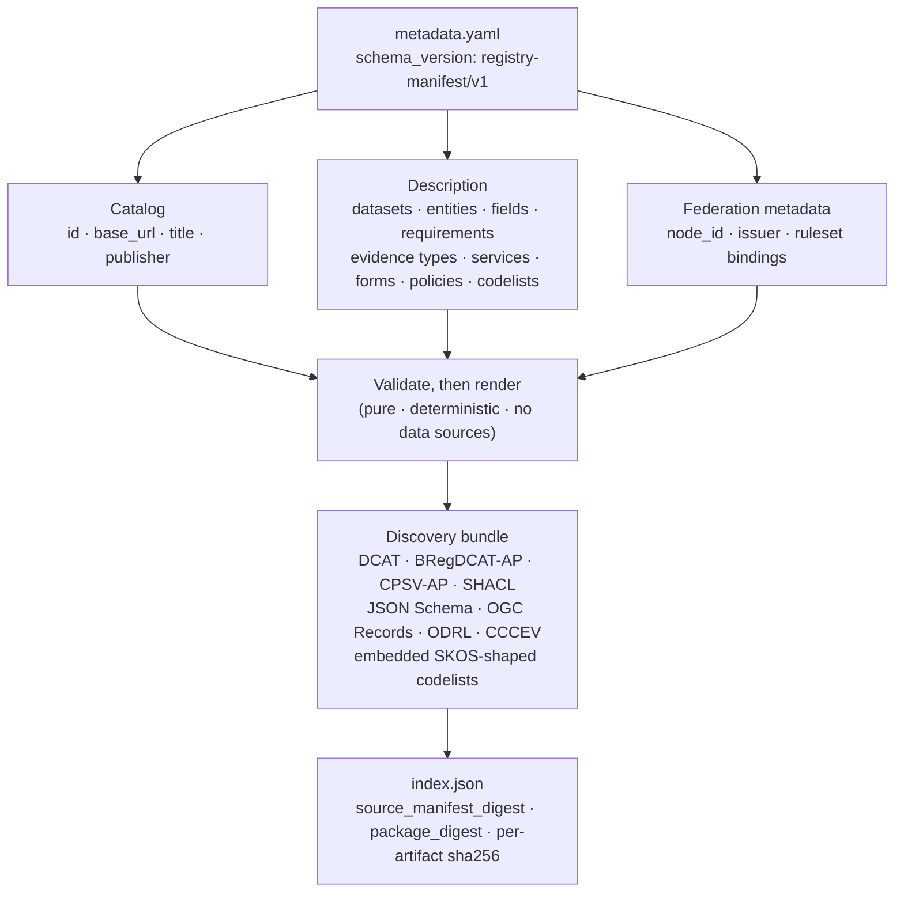

This document defines the data model of the Registry Manifest portable metadata manifest: the `metadata.yaml` document (schema version `registry-manifest/v1`) that describes a registry's catalog, datasets, services, requirements, evidence, and policies, and from which Registry Manifest renders a static, standards-shaped discovery bundle. It is the structural counterpart to the [Registry Relay protocol](../rs-pr-relay/): it closes the metadata-manifest ownership boundary that specification names in its Section 1 and REQ-PR-RELAY-011.

The manifest format is owned by Registry Manifest, a pure library and command-line interface with no runtime data dependencies; Registry Relay serves and scopes the compiled artifacts but does not define or version the format. This document and [RS-ARC-G](../rs-arc-g/) state that boundary at different altitudes: RS-ARC-G fixes it as an architectural invariant (REQ-ARC-G-001, REQ-ARC-G-002, REQ-ARC-G-006), and this document refines the Registry Manifest component of RS-ARC-G Section 3 one level down, into the structure the manifest takes and the invariants its validator enforces at load. As [RS-DM-CLAIM](../rs-dm-claim/) is the data-model form of the Registry Notary protocol, this document is the data-model form of the portable metadata layer.

The key words in this document are interpreted per [RS-DOC](../rs-doc/) Section 2. Defined terms are used per [RS-TERMS](../rs-terms/).

## Version history

| Version | Date | Status | Change |
| --- | --- | --- | --- |
| 0.1.0 | 2026-06-13 | draft | Initial portable metadata data model, distilled from the Registry Manifest overview, the validate-and-render guide, and the reference, and graded against the schema types and the load-time validator the Registry Manifest core enforces. |
| 0.2.0 | 2026-06-20 | draft | Added governed evidence gateway metadata, policy id/hash binding, ODRL enforcement profile validation, and the runtime PDP boundary. |

## 1. Scope and references

This specification covers the structure and invariants of a portable metadata manifest:

- The manifest's identity and schema version.
- Portability: the runtime-binding boundary that keeps the manifest deployment-independent.
- The catalog and the top-level collections that describe a registry.
- Reference integrity and identifier and vocabulary constraints.
- Requirements and grouped evidence.
- Governed evidence pack metadata and the Evidence Gateway PDP binding surface.
- Federation discovery metadata.
- The standards-shaped render set and the static publication bundle.
- Compatibility and evolution.

This specification does not define:

- **The exact manifest schema.** Every key, its type, and its default belong to the [Registry Manifest reference](../../products/registry-manifest/reference/), and the rendered artifacts are themselves the authoritative schema documents Registry Manifest emits. This document states the model's structure and the invariants the validator enforces, and does not restate field schemas that would drift from the source.
- **Runtime serving and scoping.** How Registry Relay serves a compiled bundle, scopes it per caller, and binds its logical concepts to live data sources belongs to [RS-PR-RELAY](../rs-pr-relay/).
- **Claim evaluation.** The Registry Notary claim definition is a separate data model with its own specification, [RS-DM-CLAIM](../rs-dm-claim/); the manifest only advertises the federation metadata that points a caller at a delegated evaluator.

For the narrative two-layer pipeline, see the [architecture overview](../../explanation/architecture/); for the authoring and command surface, see the [Registry Manifest overview](../../products/registry-manifest/) and the [validate and render guide](../../products/registry-manifest/validate-and-render/).

## 2. Anatomy of a metadata manifest

A metadata manifest is a single portable document. It declares a schema version, a catalog that identifies the publisher, the collections that describe a registry, and, optionally, the federation metadata for delegated evaluation. Registry Manifest validates the document and renders it, as a pure function, into a static discovery bundle.

The diagram restates the model: one portable document is validated and rendered into a bundle of standards-shaped artifacts plus an index that digests them. The manifest is the single source; every artifact is derived from it and nothing in the bundle reaches back to a runtime service.

REQ-DM-MANIFEST-001: A metadata manifest MUST declare `schema_version: registry-manifest/v1`. A document whose schema version is absent or different MUST be rejected before any further validation or rendering.

## 3. Portability and the runtime-binding boundary

The manifest is portable: it carries the static description of a registry and nothing about a particular deployment. This boundary is what lets a manifest be authored, reviewed, hosted, and pinned without access to any production system, and what keeps Registry Manifest a pure library with no data dependencies (REQ-ARC-G-001).

REQ-DM-MANIFEST-002: A metadata manifest MUST be runtime-independent: it MUST NOT carry runtime bindings such as source paths, table identifiers, caller scopes, backend credentials, peer allow-lists, federation signing keys, replay stores, or pairwise subject-hash secrets. Registry Manifest MUST reject a manifest that contains any of the runtime-only keys it enumerates. This is the data-model form of REQ-ARC-G-002, and the boundary [RS-PR-RELAY](../rs-pr-relay/) keeps on the Relay side as REQ-PR-RELAY-011: runtime bindings belong in Registry Relay or Registry Notary configuration, never in the manifest.

## 4. Catalog and top-level structure

A manifest's required core is its catalog; the rest of a manifest is the collections through which it describes a registry. RS-TERMS summarizes those collections as datasets, entities, fields, public services, forms, requirements, policies, and evidence offerings; the full top-level set the reference defines is broader, and this document names it so a reader does not infer the manifest stops at that summary.

REQ-DM-MANIFEST-003: A metadata manifest MUST declare a `catalog` carrying at least an identifier, a base URL, a title, and a publisher, each validated (an identifier matching the manifest identifier pattern, an HTTP or HTTPS base URL, a non-empty title, and a non-empty publisher name). Beyond the catalog, a manifest describes a registry through the top-level collections the reference defines: `vocabularies`, `profiles`, `requirements`, `evidence_types`, `authorities`, `public_services`, `data_services`, `forms`, `datasets` (each with its `entities`, `fields`, `relationships`, `policies`, and `evidence_offerings`), `codelists`, `federation`, `evaluation_profiles`, and `ecosystem_bindings`. This document does not restate their field schemas; the [Registry Manifest reference](../../products/registry-manifest/reference/) is authoritative.

REQ-DM-MANIFEST-004: Within a manifest, every cross-reference between objects MUST resolve to a defined object of the expected kind: an evidence type to a requirement it proves, an evidence offering to an entity and that entity's fields, a public service to its authority and its referenced requirements, forms, and data services, a form to its service and channel, a field to a codelist, and a relationship to an entity in the same dataset. Registry Manifest MUST reject a manifest with a dangling or mistyped reference at load.

REQ-DM-MANIFEST-005: Object identifiers MUST match the manifest identifier pattern and MUST be unique within their defining scope, and a field constrained to a closed vocabulary, including sensitivity, access rights, update frequency, dataset status, field type, relationship cardinality, form fulfillment mode, and declared application profile, MUST take a value from that vocabulary. Registry Manifest MUST reject a manifest that violates an identifier or closed-vocabulary constraint.

## 5. Requirements and grouped evidence

A manifest can describe what a public service requires and what evidence satisfies it, using the Core Criterion and Core Evidence Vocabulary (CCCEV) shape. Grouped evidence is the load-bearing structure: it distinguishes evidence that is required together from evidence that is an alternative.

REQ-DM-MANIFEST-006: An evidence type MUST prove at least one requirement defined in the same manifest. Grouped evidence is explicit: all evidence types within one evidence-type-list group MUST be treated as required together, and multiple groups on the same requirement MUST be treated as alternatives. Registry Manifest MUST reject an evidence type that proves no requirement and an evidence-type-list entry that names an unknown evidence type or one that does not prove the owning requirement.

## 6. Governed evidence gateway metadata

A manifest can publish governed evidence metadata for an Evidence Gateway runtime to select a policy decision point (PDP) policy. This is still metadata: Registry Manifest validates the pack shape, policy identity, hash binding, supported ODRL enforcement terms, and required evidence-pack declarations, while runtime enforcement remains with Registry Relay's governed PDP path.

REQ-DM-MANIFEST-007: Where an `ecosystem_bindings` entry declares `type: governed-evidence`, it MUST carry unique `id` and `version` values, a non-empty `profile`, and `evidence_pack` metadata. The evidence pack MUST declare `pack_id`, `pack_version`, `source_basis`, `semantic_profile`, `evidence_envelope`, `required_gates`, `allowed_outputs`, `policy_id`, `policy_hash`, and `odrl_enforcement`. `source_basis`, `semantic_profile`, `evidence_envelope`, `source_mapping`, `policy`, fixtures, and synthetic data remain JSON metadata values where the manifest validates presence and object shape where implemented; this requirement MUST NOT be read as a fully typed evidence-pack metadata model.

REQ-DM-MANIFEST-008: A governed evidence pack MUST bind runtime policy selection to a policy identity and digest: `policy_id` MUST be non-empty, `policy_hash` MUST be a lowercase `sha256:` digest, and, when an inline `policy` object is present, Registry Manifest MUST verify `policy_hash` against the canonical JSON form of that inline policy. `required_gates` MUST include the gateway gates Registry Manifest requires for governed evidence, including source freshness, source binding, route scope, requester and subject identity, assurance, legal basis, consent, jurisdiction, requested disclosure, credential format, authority basis, and subject relationship. `allowed_outputs` MUST include `minimized_json`.

REQ-DM-MANIFEST-009: A governed evidence pack MUST declare `odrl_enforcement.profile: registry-evidence-gateway-pdp/v1`, and its `constraint_terms` MUST contain at least one unique term from the supported runtime-enforcement set: `odrl:purpose` and `odrl:spatial`. The wider manifest policy renderer MAY publish broader Open Digital Rights Language (ODRL) metadata, but a governed evidence pack MUST NOT claim PDP enforcement for ODRL terms outside this supported set.

## 7. Federation discovery metadata

A manifest MAY advertise the metadata a partner needs to configure Registry Notary static-peer delegated evaluation. This metadata is public discovery: it describes where a delegated evaluator is and what it evaluates, not who may call it.

REQ-DM-MANIFEST-010: Where an evidence offering declares `access.kind: registry-notary`, the manifest MUST carry a `federation` block with HTTPS issuer, JWKS, and federation-API URLs, a `did:web` node identifier bound to the issuer host, the supported protocol version `registry-notary-federation/v0.1`, and an `access.ruleset` that names a declared evaluation profile. This metadata is public discovery only and MUST NOT be read as an access grant: peer authorization remains with Registry Notary, which decides at runtime which peers may call it (REQ-ARC-G-009).

## 8. Rendered artifacts and standards

From a valid manifest, Registry Manifest renders a set of standards-shaped artifacts. The renderers are the reason the manifest exists: one authored document becomes the catalog, schema, policy, and service descriptions other systems already know how to read.

REQ-DM-MANIFEST-011: Registry Manifest MUST render its discovery artifacts as a pure, deterministic function of the manifest, with no network access and no data-source access (the data-model form of REQ-ARC-G-001). The rendered set is standards-shaped: a catalog, Data Catalog Vocabulary (DCAT) and BRegDCAT-AP JSON-LD, Core Public Service Vocabulary Application Profile (CPSV-AP) JSON-LD, Shapes Constraint Language (SHACL) node shapes, JSON Schema (Draft 2020-12), Open Geospatial Consortium (OGC) API Records item collection, Open Digital Rights Language (ODRL) policies, CCCEV evidence metadata, and embedded SKOS-shaped codelist concept-scheme nodes inside linked-data outputs. Rendering an artifact in a standard's shape is not a claim of conformance to that standard's specification.

## 9. Publication bundle and digests

The `publish` operation writes the rendered artifacts as a static bundle that can be hosted as files and pinned by digest, with no runtime service in the loop. The bundle describes itself through an index.

REQ-DM-MANIFEST-012: The `publish` operation MUST produce a self-describing static bundle whose `index.json` (schema version `registry-manifest-index/v1`) carries a canonical `source_manifest_digest` over the typed manifest (insensitive to YAML formatting, comments, and key order, but sensitive to semantic change), a `package_digest` over the published artifact inventory, and a per-artifact `sha256` for every published artifact, including the OGC Records item collection. The digests MUST let a reader pin and compare a bundle without running Registry Relay or any other runtime service.

## 10. Compatibility and evolution

The manifest and its generated formats carry a versioned compatibility promise so that producers and readers can evolve without lock-step coordination.

REQ-DM-MANIFEST-013: The `registry-manifest/v1` manifest and its generated `*/v1` formats follow an additive-evolution rule. A producer MAY add optional fields to existing objects without a new major schema version. A reader MUST ignore fields it does not recognize while continuing to require and validate the fields it does. An unrecognized field MUST NOT relax existing validation: required fields, identifier and URI syntax, reference integrity, collection limits, runtime-only-key rejection, and governed evidence pack validation still apply. A breaking change, including removing or renaming a required field or changing the meaning or type of an existing field, MUST carry a new schema version.

## 11. Limitations

These constraints are stated so a reader does not infer an invariant the reviewed implementation does not enforce.

- **Runtime-binding exclusion is an enumerated list.** Registry Manifest rejects the runtime-only keys it enumerates, not every conceivable runtime key. The manifest schema does not reject unknown keys in general (it carries no `deny_unknown_fields`), so an unrecognized key whose name is outside the runtime-only list is ignored rather than rejected. This is the same additive-evolution behavior REQ-DM-MANIFEST-013 relies on (REQ-DM-MANIFEST-002).
- **Standards conformance is not validated.** The renderers emit standards-shaped artifacts but do not validate them against the external standard bodies. A rendered CPSV-AP, DCAT, or SHACL document is well-formed by construction, not certified against the standard (REQ-DM-MANIFEST-011).
- **URI checks are shallow.** A field required to be a URI is checked for an HTTP or HTTPS scheme or for the identifier pattern, not for full RFC 3987 IRI validity (REQ-DM-MANIFEST-004, REQ-DM-MANIFEST-005).
- **Evidence pack metadata remains partly opaque.** Governed evidence packs require key metadata and validate selected object shapes, supported gate names, supported output names, policy digest shape, inline-policy digest binding, and supported ODRL enforcement terms. The implementation still represents several fields as JSON values rather than a fully typed external evidence-pack schema (REQ-DM-MANIFEST-007 through REQ-DM-MANIFEST-009).
- **Profile fixtures are non-normative.** The example profiles shipped with Registry Manifest are illustrative until reviewed against official artifacts; they are not authoritative profiles for any named external system (see the [profile fixtures guide](../../products/registry-manifest/profile-fixtures/)).

## Conformance

A metadata manifest, and the Registry Manifest tooling that validates and renders it, conforms to this specification when it:

- declares the `registry-manifest/v1` schema version and is rejected if that version is absent or different (REQ-DM-MANIFEST-001);
- carries no runtime bindings, and rejects the runtime-only keys it enumerates (REQ-DM-MANIFEST-002);
- declares a validated catalog core and describes a registry only through the defined top-level collections (REQ-DM-MANIFEST-003);
- keeps every cross-reference resolvable and correctly typed, and rejects a dangling reference (REQ-DM-MANIFEST-004);
- keeps identifiers patterned and unique in scope and closed-vocabulary fields within their vocabulary (REQ-DM-MANIFEST-005);
- proves every evidence type against a requirement and treats grouped evidence as conjunction within a list and alternatives across lists (REQ-DM-MANIFEST-006);
- validates governed evidence pack metadata, policy id/hash binding, required gates and outputs, and supported ODRL enforcement terms without claiming a fully typed evidence-pack model or runtime enforcement by Registry Manifest (REQ-DM-MANIFEST-007 through REQ-DM-MANIFEST-009);
- advertises federation metadata as discovery only, with the required HTTPS, `did:web`, protocol-version, and ruleset bindings, and never as an access grant (REQ-DM-MANIFEST-010);
- renders its artifacts as a pure, deterministic, standards-shaped set without asserting external-standard conformance (REQ-DM-MANIFEST-011);
- publishes a self-describing bundle digested for pinning and comparison without a runtime service (REQ-DM-MANIFEST-012);
- evolves additively, ignoring unrecognized fields without relaxing validation, and versions every breaking change (REQ-DM-MANIFEST-013).

Conformance to this specification does not imply conformance to any external standard cited in the `standards_referenced` frontmatter field. Each standard's adoption mode and scope are documented in the [standards register](../../reference/standards/).

## Evidence

This specification is `verified`: every requirement describes shipped behavior a reader can inspect, per RS-DOC REQ-DOC-014.

- The [Registry Manifest overview](../../products/registry-manifest/) describes the pure render pipeline, the multi-pass validator, the minimal manifest and its required core, grouped evidence, governed evidence ecosystem bindings, and the federation-is-discovery-not-grant rule that Sections 2 through 8 make precise.
- The [Registry Manifest reference](../../products/registry-manifest/reference/) lists the top-level keys, the catalog core, the runtime-only key list, the render formats, the schema-version markers, the publish bundle layout, the digest fields, and the extension policy that Sections 3 through 11 state normatively.
- The [validate and render guide](../../products/registry-manifest/validate-and-render/) walks the validation checks, the render and publish commands, and the `index.json` digest fields behind Sections 8 and 9.
- [RS-PR-RELAY](../rs-pr-relay/) carries the Relay-protocol form of the ownership boundary this document gives a data-model form (REQ-PR-RELAY-011).
- [RS-ARC-G](../rs-arc-g/) holds the architectural invariants both this document and RS-PR-RELAY refine: the metadata layer's purity (REQ-ARC-G-001), the runtime-binding exclusion (REQ-ARC-G-002), and the ownership split (REQ-ARC-G-006).
- The [standards register](../../reference/standards/) records the adoption mode for DCAT, BRegDCAT-AP, CPSV-AP, CCCEV, SHACL, JSON Schema, JSON-LD, ODRL, OGC API Records, and SKOS named in `standards_referenced`.

## Next

- [RS-PR-RELAY](../rs-pr-relay/) is the protocol that serves and scopes the compiled artifacts this model describes.
- [RS-DM-CLAIM](../rs-dm-claim/) is the sibling data model for the Registry Notary claim definition this manifest can point a caller toward.
- [RS-ARC-G](../rs-arc-g/) places Registry Manifest and the portable metadata layer in the registry stack architecture.
- [RS-TERMS](../rs-terms/) defines the metadata manifest, evidence, and policy vocabulary used here.
- [Architecture overview](../../explanation/architecture/) is the narrative data flow that places the portable metadata layer and the runtime services side by side.
