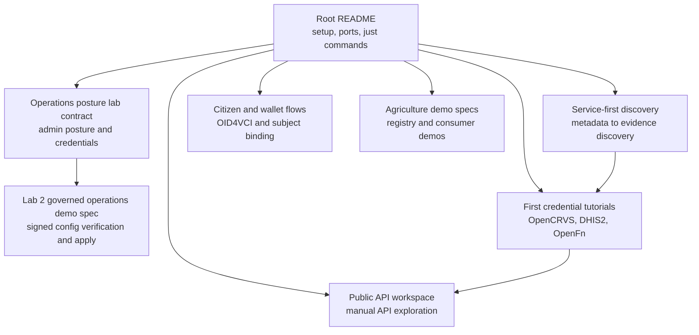

# Registry Lab documentation

Page type: get started
Product: Registry Lab
Layer: evaluation, credential, federation, and consultation
Audience: integrators, demo operators, and maintainers

Use this page to choose the right Registry Lab document. The root
[`README.md`](../README.md) is the source of truth for setup, service ports, and
available `just` commands. The tutorials below focus on one working path each.

## First successful credential

- [OpenCRVS DCI Notary tutorial](opencrvs-dci-notary-tutorial.md): use live
  OpenCRVS Farajaland DCI data and issue a birth-attributes SD-JWT VC.
- [DHIS2 OpenFn Notary tutorial](dhis2-openfn-notary-tutorial.md): use the
  public DHIS2 sandbox through an OpenFn sidecar and issue a child programme
  SD-JWT VC.
- [OpenFn sidecar Notary tutorial](openfn-sidecar-notary-tutorial.md): use the
  local OpenFn sidecar demo and issue a civil date-of-birth SD-JWT VC.

## Citizen and wallet flows

- [Citizen self-attestation eSignet use case](citizen-self-attestation-esignet-use-case.md):
  understand the local eSignet self-attestation flow and the subject-binding
  security boundary.
- [Wallet interop testing](wallet-interop-testing.md): test the citizen OID4VCI
  facade with wallet software after the scripted probe passes.
- [Guided demo scenarios and data plan](guided-demo-scenarios-and-data-plan.md):
  plan fixture cleanup and the guided Relay, Notary, DHIS2, and wallet scenarios.

## Agriculture demo design

- [NAgDI agricultural registries demo spec](nagdi-agricultural-registries-demo-spec.md):
  source-of-truth design for the agricultural registry demo.
- [NAgDI consumer integration demo spec](nagdi-consumer-integration-demo-spec.md):
  source-of-truth design for the agriculture consumer demos.

## Service discovery

- [Service-first discovery](service-first-discovery.md): how the lab walks from
  static metadata to service and evidence discovery.

## Operations

- [Operations posture lab contract](ops-posture-lab-contract.md): admin posture
  endpoints and credentials exposed by the local lab.
- [Lab 2 governed operations demo spec](lab2-governed-operations-demo-spec.md):
  opt-in design for signed governed config verification and apply demos.

## Public API workspace

- [Public API workspace spec](public-api-workspace.md): definition of done and
  delivery plan for the Bruno workspace that exercises the hosted and local demo
  APIs.
- [Public API workspace](../requests/registry-lab/README.md): Bruno collection
  for human-operated hosted and local API exploration.

## Maintainer notes

- [Commons release cleanup plan](commons-release-cleanup-plan.md): maintainer
  cleanup plan for shared Platform, Notary, Relay, and Manifest release work.
