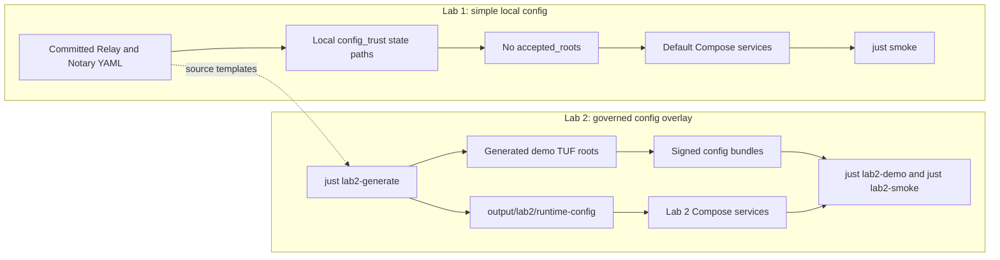
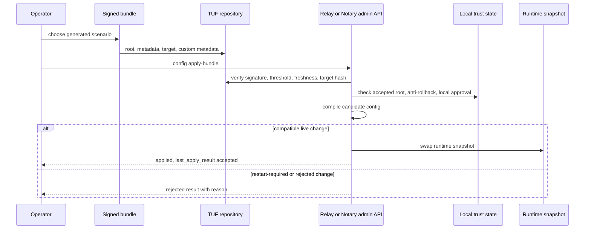

# Lab 2 Governed Operations Demo Spec

Page type: implementation spec
Product: Registry Lab
Layer: operations, configuration governance
Audience: demo operators and maintainers

## Goal

Lab 1 and Lab 2 have separate configuration jobs:

- Lab 1 proves the simple local deployment path still works with the aligned
  Relay and Notary config schema. It boots from committed YAML, uses local
  `config_trust` state paths and local break-glass limits, and intentionally
  does not enable signed governed apply.
- Lab 2 proves the governed runtime configuration path end to end. It is an
  opt-in overlay that renders governed-ready configs with generated demo trust
  roots, then uses signed TUF-profile bundles to verify and apply selected
  runtime changes through Relay and Notary admin APIs.

The product story is not "Lab 1 is old and Lab 2 is new." Lab 1 is the improved
static baseline for simple deployments; Lab 2 is the operations demo that fully
leverages the new governed configuration capabilities.

## Product Dependencies

Lab 2 requires Lab vendor pins that include these product capabilities:

- Registry Platform: governed configuration primitives, Registry trust-root
  authorization, detailed apply result vocabulary, durable file anti-rollback,
  local approvals, local break-glass rate limits, and posture-safe config
  hashing.
- Registry Relay: `config_trust`, signed TUF verify/apply, live
  `public_metadata` apply, governed provenance signing-key rotation,
  `last_apply_result`, and per-`kid` provenance readiness posture.
- Registry Notary: `config_trust`, signed TUF verify/apply, governed
  signing-key rotations for the certified signing paths, `last_apply_result`,
  per-`kid` readiness posture, local approval, and signed break-glass rejection
  for restart-required changes. Relay is the Lab 2 accepted break-glass surface.

The Lab PR must refresh `vendor/registry-platform`, `vendor/registry-relay`, and
`vendor/registry-notary` to product `main` commits containing those capabilities
before the static config baseline is considered valid. Until those pins move,
the committed `config_trust` blocks are incompatible with older vendored config
schemas.

## Demo Story

The demo should tell an operator-facing story, not only run a test suite:

1. Simple is improved and still works: start the default Lab 1 static-config
   topology, show that committed Relay and Notary configs use the aligned
   `config_trust` shape without `accepted_roots`, and run `just smoke`.
2. Governance is opt-in: run `just lab2-generate` and show that the generated
   rendered configs add `accepted_roots` only under `output/lab2/`.
3. Before state is observable: capture Civil Relay and Civil Notary posture with
   config hash, `last_apply_result: null`, and current signing `kid`.
4. Safe live change applies: apply a signed Relay `public_metadata` bundle and
   show no process restart, changed posture config hash, `last_apply_result:
   accepted`, and a still-passing data-plane smoke.
5. Key rotation applies: apply a signed Notary signing-key rotation and show
   rotated-key readiness plus credential issuance with the rotated `kid`.
6. Guardrails fail closed: show rollback, unsigned inline apply, alternate
   root, threshold-minus-one, spoofed metadata, Notary trust authorization, and
   client-supplied `break_glass_rate_limit` attempts rejected without advancing
   anti-rollback state.
7. Break-glass is governed: show one signed Relay emergency apply accepted with
   local approval, then a second request after service restart inside the local
   rate-limit window rejected.

The narrated output should be understandable from saved evidence alone: each
step writes the command, expected result, HTTP status, posture excerpt, and any
anti-rollback state assertion under `output/lab2/evidence/`.

## Non-Goals

- Do not require governed config for the default `just up` path.
- Do not make Lab 1 exercise signed bundle verification, runtime apply,
  key rotation, local approval, or break-glass scenarios.
- Do not commit demo private keys, generated TUF metadata, local approval state,
  anti-rollback state, or rendered configs.
- Do not make Coolify hosted deployment depend on Lab 2 artifacts.
- Do not use unsigned inline YAML as a successful apply path.

## Static Config Baseline

Lab 1 owns the improved static baseline. The committed static Relay and Notary
configs include local `config_trust` state paths and a local break-glass rate
limit. They intentionally omit `accepted_roots`, so governed apply is not
enabled until Lab 2 renders an overlay config with generated demo trust roots.

The Lab 1 baseline is intentionally boring from an operator perspective:

- `just generate`, `just up`, and `just smoke` do not require TUF artifacts,
  generated trust roots, generated signing keys, or `output/lab2/`.
- The static YAML format may use the new aligned schema, but all values are
  local-file values suitable for a simple Compose deployment.
- Local trust-state paths are present so the same product binaries can start
  consistently, but there is no accepted root from which a governed apply can
  be authorized.
- Break-glass policy is local static policy. Lab 1 configures the local limit;
  Lab 2 demonstrates that clients cannot override it through a signed target.

Relay stores local trust state in its existing per-service cache volume:

- `/var/lib/registry-relay/cache/*-config-antirollback.json`
- `/var/lib/registry-relay/cache/*-config-local-approvals.json`

Notary stores local trust state in a shared named volume mounted at:

- `/var/lib/registry-notary/config-state/*-config-antirollback.json`
- `/var/lib/registry-notary/config-state/*-config-local-approvals.json`

Those static configs are valid only once Lab vendor pins include the governed
config schema. The default Lab 1 path still runs from local YAML and does not
apply signed bundles because `accepted_roots` is omitted.

## Runtime Topology

Lab 2 must run beside Lab 1 without port or service-name collisions.

- Compose invocation: `docker compose -f compose.yaml -f compose.lab2.yaml`.
- Civil Relay service: `lab2-civil-registry-relay`.
- Civil Notary service: `lab2-civil-notary`.
- Civil Relay public URL: `http://127.0.0.1:4411`.
- Civil Relay admin URL: `http://127.0.0.1:4419`.
- Civil Notary public URL: `http://127.0.0.1:4421`.
- Civil Notary admin URL: `http://127.0.0.1:4422`.
- Init service: `lab2-config-state-init`.
- Redis service: `lab2-redis`.
- Lab 2 Relay cache/state volume: `lab2-civil-registry-cache`.
- Lab 2 Notary config-state volume: `lab2-notary-config-state`.

`just lab2-up` must fail before invoking Compose if
`output/lab2/runtime-config/` is missing or empty. Every Lab 2 command that
inspects services must pass the same compose file list, so it does not
accidentally inspect the default Lab 1 stack.

`just lab2-down` removes Lab 2 containers and Lab 2-only volumes. It must not
remove Lab 1 volumes. During a single `just lab2-smoke` run, anti-rollback and
break-glass checks must use files inside `lab2-notary-config-state` and the Lab
2 Relay cache volume; tests may delete a specific state file with `docker exec
... rm <path>`, but must not recreate the whole volume as a shortcut.

## Lab 2 Artifacts

Add these generated artifacts under `output/lab2/`, never under committed
config directories:

- `runtime-config/`: rendered Relay and Notary YAML with `accepted_roots`
  injected.
- `tuf-repo/`: local demo TUF repository, targets, metadata, and datastore.
- `keys/`: generated demo TUF signing keys and candidate Notary signing keys.
- `bundles/`: signed config targets for positive and negative scenarios.
- `state-init/`: generated local anti-rollback and local approval seed files
  copied into the Lab 2 volumes by `lab2-config-state-init`.
- `manifest.json`: generated artifact manifest listing every expected output
  file, SHA-256 digest, role, and whether it is secret material.
- `evidence/`: captured posture, apply responses, logs, anti-rollback state
  assertions, secret-scan results, and smoke outputs.

Add these scripts:

- `scripts/lab2-generate-governed-config.sh` and
  `tools/lab2-governed-config/`: generate demo roots, render runtime configs,
  and produce signed bundles.
- `scripts/lab2-smoke-governed-config.sh`: start the Lab 2 overlay, verify
  bundles, apply positive changes, and run negative checks.
- `scripts/lab2-demo-story.sh`: run the narrated operator-facing demo with
  before/after requests, a visible Relay posture owner change, posture
  excerpts, signed apply responses, and a Markdown story under
  `output/lab2/evidence/demo/`.
- `scripts/lab2-secret-scan.sh`: scan generated evidence, rendered configs,
  bundles, and captured container logs for resolved secret values and private
  key structures.

Add these commands:

- `just lab2-generate`
- `just lab2-up`
- `just lab2-demo`
- `just lab2-demo-reset`
- `just lab2-demo-open-evidence`
- `just lab2-smoke`
- `just lab2-down`

## Demo Flow

1. Generate normal Lab 1 fixtures and secrets.
2. Prove the improved Lab 1 static baseline: committed configs load, omit
   `accepted_roots`, and `just smoke` passes without `output/lab2/`.
3. Generate Lab 2 roots, local TUF repository, rendered configs, and bundles.
4. Start Relay and Notary from `output/lab2/runtime-config`.
5. Capture initial admin posture from Civil Relay and Civil Notary.
6. Verify a signed no-op bundle for both products.
7. Apply a signed Relay `public_metadata` change and assert:
   - admin apply returns success;
   - posture `last_apply_result` records success;
   - posture config hash changes;
   - data-plane smoke still passes.
8. Apply a signed Notary signing-key rotation and assert:
   - admin apply returns success without process restart;
   - posture exposes the new key readiness;
   - credential issuance succeeds with the new `kid`;
   - the old key remains publish-only only when the bundle says so.
9. Attempt a rollback bundle and assert:
   - apply is rejected;
   - anti-rollback state is not advanced;
   - posture reports the rejected result.
10. Attempt an unsigned inline apply and assert it does not succeed as governed
   apply.
11. Attempt an alternate-root bundle and assert a valid TUF target signed by an
    unaccepted Registry root is rejected by local authorization.
12. Attempt a break-glass signed target and assert:
    - the request carries approval fields only;
    - the rate-limit policy comes from local config;
    - a second request after service restart inside the configured window is
      rejected.

## Security Checks

Lab 2 is complete only if the smoke proves:

- Secrets never appear in signed bundles, rendered public evidence, posture, or
  captured container logs.
- TUF targets-role verified signer IDs satisfy local Registry role thresholds:
  an exactly-threshold bundle is accepted, a threshold-minus-one bundle is
  rejected with `rejected_threshold`, and a target whose custom metadata claims
  sufficient signers but whose real TUF signatures are below threshold is
  rejected with `rejected_threshold`.
- Alternate TUF roots are rejected: a bundle signed by an unaccepted alternate
  root returns `rejected_signature` or `rejected_threshold` and leaves posture
  and anti-rollback state unchanged.
- A product whose current runtime omits `accepted_roots` must fail closed before
  governed apply can succeed. Lab 1 proves this by keeping committed static
  configs without accepted roots; Lab 2 proves successful apply only from
  rendered configs that include accepted roots.
- Anti-rollback survives the real attack path: after a successful apply, stop
  the Lab 2 service, delete the specific anti-rollback file from the mounted
  state volume, restart, replay an older bundle, and assert either
  `rejected_rollback` or `internal_error` fail-closed behavior. The test must
  distinguish absent-state failure from absent-state reset-to-zero.
- Unsigned inline attempts do not mutate governed runtime state: the posture
  config hash remains unchanged and the detailed result or problem code is the
  documented inline-apply rejection for the governed Lab 2 deployment.
- A client-supplied `break_glass_rate_limit` field is rejected with
  `rejected_break_glass`.
- Break-glass rate limiting survives restart inside the configured window:
  after one accepted Relay emergency apply, a service restart still rejects a
  second request inside the window. N-concurrent acceptance is a product-level
  contract covered by Platform/Relay tests, not by this Lab smoke.

Every negative scenario must include a positive control using the same route,
credentials, and base bundle with only the defect removed. A generic non-`2xx`
response is not sufficient: the smoke must assert the expected detailed
`result` value or documented problem code, the expected posture projection, and
unchanged anti-rollback state where applicable.

## References And Terms

- Posture endpoints and credentials: [ops-posture-lab-contract.md](ops-posture-lab-contract.md).
- `last_apply_result`: the posture projection of the most recent governed apply
  attempt. Positive apply records `accepted`; rejected trust-layer outcomes
  record `rejected`; verification-only outcomes do not apply runtime state.
- `kid`: public key identifier for a signing key.
- No-op bundle: a signed TUF target whose candidate config is byte-for-byte or
  canonically equivalent to the current runtime config and is used only to prove
  verification, threshold, and anti-rollback wiring.
- Local Registry role threshold: the `config_trust.accepted_roots[].roles[]`
  threshold that maps change classes to signer kids after TUF target
  verification.
- Detailed apply results: Lab 2 assertions must use product result strings such
  as `applied`, `rejected_signature`, `rejected_threshold`,
  `rejected_freshness`, `rejected_rollback`,
  `rejected_restart_required`, `rejected_readiness`,
  `rejected_break_glass`, and `rejected_local_approval`.

## Definition Of Done

This work is done only when every item below is true in a clean checkout. Final
evidence must use the Lab vendor pins for Platform, Relay, and Notary. The Lab
2 commands force those vendor paths so sibling checkout overrides cannot
silently change the evidence binary.

- Vendor pins are current: `vendor/registry-platform`,
  `vendor/registry-relay`, and `vendor/registry-notary` point to product
  `main` commits that contain governed runtime configuration, and
  `scripts/check-release-source-model.sh vendor` exits `0`.
- Lab 1 remains simple and improved: every committed Relay and Notary config
  loads with the aligned `config_trust` schema, contains non-empty local
  anti-rollback and local approval paths, contains a local break-glass rate
  limit, and omits `accepted_roots`.
- Lab 1 is independent of Lab 2: after deleting `output/lab2/`, `just generate`
  exits `0`, `just smoke` exits `0`, and no Lab 2 command or generated trust
  material is required.
- Compose definitions are valid: `docker compose -f compose.yaml config`,
  `docker compose -f compose.coolify.yaml config` with placeholder hosted
  secrets, and `docker compose -f compose.yaml -f compose.lab2.yaml config`
  each exit `0`.
- Lab 2 generation is complete: `just lab2-generate` exits `0` and writes only
  ignored files under `output/lab2/`, including `runtime-config/`, `tuf-repo/`,
  `keys/`, `bundles/`, `state-init/`, `evidence/`, and `manifest.json`.
- `output/lab2/manifest.json` enumerates every generated artifact with path,
  SHA-256 digest, artifact role, and secret classification.
- Every rendered Relay and Notary config under `output/lab2/runtime-config/`
  contains non-empty `config_trust.accepted_roots`; no committed static config
  contains `accepted_roots`.
- Lab 2 lifecycle is isolated: `just lab2-up` fails before Compose when
  `output/lab2/runtime-config/` is missing or empty, starts only documented
  `lab2-` services and ports when artifacts exist, and `just lab2-down` removes
  Lab 2 containers and Lab 2-only volumes without removing Lab 1 volumes.
- `just lab2-smoke` exits `0` from an empty `output/lab2/evidence/` directory
  and captures `00-lab1-static-smoke.txt`, generated-config summaries, initial and
  final posture JSON, apply responses, negative-case responses, container logs,
  anti-rollback assertions, secret-scan results, and `summary.md`.
- Relay governed apply is proven: a signed `public_metadata` bundle returns
  HTTP `2xx`, changes the posture config hash, records successful
  `last_apply_result`, does not restart the service, and leaves `just smoke`
  passing.
- Notary governed key rotation is proven: a signed rotation bundle returns HTTP
  `2xx`, does not restart the service, records per-`kid` readiness in posture,
  issues a credential with the new `kid`, and shows the old key as
  `publish_only` in the signed candidate config.
- Guardrails are proven with exact assertions: rollback, unsigned inline apply,
  alternate root, threshold-minus-one signatures, spoofed target custom
  metadata, missing anti-rollback state on cold restart, and client-supplied
  `break_glass_rate_limit` attempts assert the expected detailed `result` or
  documented problem code and do not advance anti-rollback state.
- Break-glass is governed: one matching signed Relay emergency target is
  accepted inside the local rate-limit window, and a second matching request
  after service restart is rejected inside that window.
- `scripts/lab2-secret-scan.sh` exits `0` after scanning generated evidence,
  rendered configs, bundles, captured logs, generated resolved secret values,
  JWK private `d` members, PEM private-key markers, bearer-token patterns,
  OAuth client secrets, and the known break-glass reason test string.
- Release checks pass: `uv run scripts/validate-hosted-deploy.py` with
  placeholder hosted secrets, `python3 scripts/test_validate_hosted_deploy.py`,
  and `git diff --check` all exit `0`.
- `output/lab2/evidence/summary.md` presents the demo story in order
  and links every claim to the saved evidence file that proves it.

## Implementation Plan

Use one Registry Lab worktree and one Registry Lab PR. Product behavior changes
are already merged to the owning Platform, Relay, and Notary `main` branches.
Workers may run in parallel only when their file ownership does not overlap;
the parent integrator owns final sequencing, conflict resolution, verification,
and review handoff.

Bugs found during implementation are handled by ownership and blocking impact:

- Lab-owned bugs that block this spec may be fixed directly in the Lab PR.
- Product-owned bugs in Platform, Relay, Notary, or Manifest that block this
  spec must be fixed in the owning product repo, then pulled into Lab through an
  updated vendor pin.
- Product-owned bugs that do not block this spec must be reported to the owning
  repo with reproduction steps and evidence; they must not be hidden in Lab
  workarounds.
- Every bug fix or report that affects the demo story, evidence, or DoD must be
  called out at the next code-review checkpoint.

### Wave 1: Static Lab 1 Baseline

- Parallel workers: pin worker updates vendor pins; config worker verifies
  committed Relay and Notary YAML; compose worker verifies local Notary
  config-state mounts; reviewer worker checks that Lab 1 does not enable
  governed apply.
- Done when: vendor pins are current, committed configs contain local
  `config_trust` state and break-glass policy but no `accepted_roots`, and
  these commands all exit `0`:
  - `scripts/check-release-source-model.sh vendor`
  - `docker compose -f compose.yaml config`
  - `docker compose -f compose.coolify.yaml config`
  - local and hosted Notary `explain-config`
  - `just smoke` without `output/lab2/`
- Code-review checkpoint CR-L2-1: approve Lab 1 static baseline and vendor pins
  before any Lab 2 generated artifact work is marked done.

### Wave 2: Lab 2 Artifact Generator

- Parallel workers: TUF worker generates demo roots and signed targets;
  renderer worker writes rendered Relay and Notary configs; hygiene worker adds
  manifest and ignored-output/secret-boundary checks.
- Done when: `just lab2-generate` after `just generate` exits `0`; generated
  artifacts exist only under `output/lab2/`; `manifest.json` records path,
  digest, role, and secret classification for every artifact; rendered configs
  contain non-empty `accepted_roots`; private keys exist only under
  `output/lab2/keys/`; state seed files exist only under `output/lab2/state-init/`.
- Code-review checkpoint CR-L2-2: approve artifact shape, reproducibility
  expectations, git hygiene, and secret boundaries before Compose overlay work
  starts.

### Wave 3: Lab 2 Overlay Runtime

- Parallel workers: compose worker adds `compose.lab2.yaml` and `just lab2-*`
  lifecycle commands; ops worker adds posture capture; verification worker
  protects Lab 1 isolation.
- Done when: `docker compose -f compose.yaml -f compose.lab2.yaml config` exits
  `0`; `just lab2-up` fails when runtime configs are missing and starts only
  documented `lab2-` services and ports when present; initial Relay and Notary
  posture files are written; `just lab2-down` removes only Lab 2 containers and
  volumes; `just smoke` still passes without `output/lab2/`.
- Code-review checkpoint CR-L2-3: approve lifecycle commands, service
  isolation, and posture capture before any governed apply scenario is marked
  done.

### Wave 4: Governed Apply Scenarios

- Parallel workers: Relay worker implements signed `public_metadata` apply;
  Notary worker implements signed signing-key rotation; security worker
  implements rollback, signature, threshold, root, spoofing, anti-rollback, and
  break-glass negative scenarios.
- Done when: `just lab2-smoke` verifies signed no-op bundles; Relay apply
  changes posture config hash without restart and leaves `just smoke` passing;
  Notary rotation records readiness and issues with the rotated `kid`; every
  negative scenario asserts the exact detailed `result` or
  documented problem code and unchanged anti-rollback state; Relay break-glass
  accepts one request and rejects the post-restart second request per local
  policy window.
- Code-review checkpoint CR-L2-4: approve positive and negative scenario
  coverage before final evidence and release checks start.

### Wave 5: Evidence And Release Gate

- Parallel workers: evidence worker captures posture, responses, logs, and
  anti-rollback assertions; narration worker writes
  `output/lab2/evidence/summary.md`; secret-scan worker implements and runs
  `scripts/lab2-secret-scan.sh`; release worker runs final validation; final
  reviewer compares implementation to this spec.
- Done when: `just lab2-smoke` exits `0` from a clean evidence directory;
  secret scan exits `0`; `summary.md` links every demo claim to saved evidence;
  Compose config checks, hosted validation, hosted validation tests,
  source-model check, and `git diff --check` all exit `0`.
- Code-review checkpoint CR-L2-5: approve the final evidence bundle and confirm
  no feature is marked done unless its wave DoD and the full Definition Of Done
  are passing.
