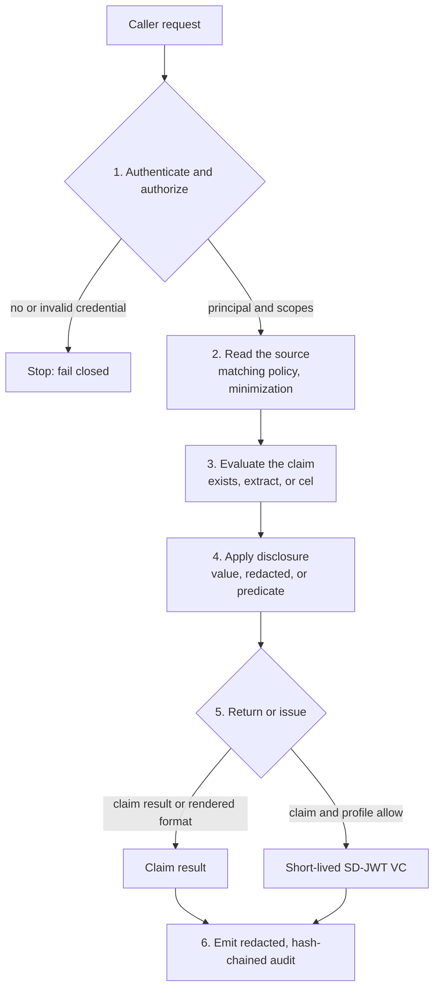
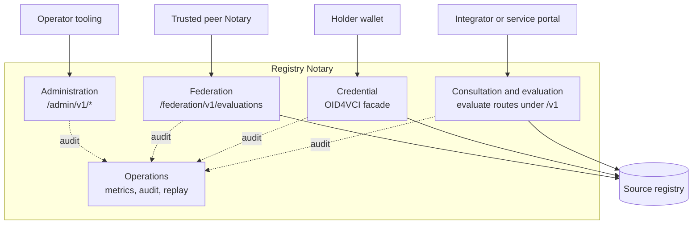

# Architecture overview

> **Page type:** Concept · **Product:** Registry Notary · **Layer:** all · **Audience:** integrator, operator, maintainer

Registry Notary answers a configured claim about a person or entity, such as
"this person has a birth record" or "this farmer works under four hectares", by
reading the minimum data from a source registry. This page explains the shape of
the system and how its layers relate, so you can place a more specific guide in
context.

## What it is, and what it is not

Registry Notary is an evaluation and attestation service. It sits between a
caller that needs an answer and a source registry that holds the data. It checks
the caller, reads only the fields a claim needs, evaluates the claim, and returns
a result the caller is allowed to see.

It is not a registry. The source registry remains the system of record. Notary
does not store a copy of registry data, and a source sidecar does not decide
whether a claim is true. Source connectors stay narrow; claim meaning stays in
Notary config.

OpenFn sidecars are source-read adapters, not embedded workflow engines inside
Notary. Notary owns caller policy, matching policy, minimization, audit,
disclosure, and credential issuance. The sidecar owns adaptor execution,
target-service credentials, source comparison, normalization, and worker
isolation. Batch matching through an OpenFn sidecar is only a way to combine
compatible source reads; it does not change the matching, authorization,
disclosure, identity proof, or credential model.

## The request lifecycle

A claim evaluation moves through a fixed sequence. Each step can stop the
request before the next one runs.

1. **Authenticate and authorize.** The caller presents an API key, a bearer
   token, or an OIDC token. Notary maps it to a principal and scopes, and fails
   closed when no credential is configured.
2. **Read the source.** Notary applies matching policy and minimization, then
   reads the minimum required fields from a configured source connector: a DCI
   search endpoint, a Registry Data API lookup, or an OpenFn sidecar that
   normalizes another system into that shape. Compatible OpenFn sidecar reads
   may be grouped into a private `records:batchMatch` source request.
3. **Evaluate the claim.** A rule turns source fields into an answer. A rule is
   `exists` (a record is present), `extract` (return one field), or `cel` (a
   derived expression over fields or dependent claims).
4. **Apply disclosure.** Disclosure config decides what the caller may see: a
   `value`, a `redacted` assertion, or a predicate. The default is the least
   revealing useful output.
5. **Return or issue.** Notary returns a claim result, renders a supported
   format, or issues a short-lived SD-JWT VC credential when both the claim and a
   credential profile allow it.
6. **Emit audit.** Notary writes a redacted, hash-chained audit envelope that
   records the decision without subject ids, claim values, or source rows.

*The request lifecycle. Authentication fails closed; any earlier step can also
stop the request before the next one runs.*

## The layers

The product is organized into layers, each with its own surface and its own
operator guide.

| Layer | What it does | Surface |
| --- | --- | --- |
| Consultation and evaluation | Evaluate one or many claims for a target | `POST` evaluate routes under `/v1` |
| Credential | Issue holder-bound SD-JWT VC credentials through the OpenID4VCI wallet facade | OID4VCI facade routes |
| Federation | Delegate one claim evaluation to a trusted static peer | `POST /federation/v1/evaluations` |
| Administration | Mutate credential status and other guarded state | `/admin/v1/*`, scope `registry_notary:admin` |
| Operations | Expose metrics, audit, and replay protection | `/metrics`, audit sinks, replay store |

*How the layers relate. Callers reach Notary through layer-specific surfaces.
Consultation, credential, and federation read the source registry, which stays
the system of record; every layer emits a redacted audit record to operations.*

Credentials use `application/dc+sd-jwt`, EdDSA over named Ed25519 keys, and
`did:jwk` holder binding. The OID4VCI surface is a profiled subset of Draft 13;
the server capabilities advertise it as a partial issuer
(`openid4vci.support: not_full_issuer`). Federation is a delegated-evaluation
slice only: it does not implement open federation, dynamic trust chains, or
federated credential issuance.

## How the code is laid out

The behavior above is split across workspace crates, with shared security
primitives (audit envelopes, auth helpers, replay and cache stores, OIDC,
OpenID4VCI, and SD-JWT support) coming from sibling `registry-platform-*`
crates. The [workspace layout](../README.md#layout) lists each crate and what it
owns.

Registry Relay or Registry Manifest may publish metadata pointing to a Notary,
but Notary does not import their code.

## Related

- [Identity and record matching](identity-and-record-matching.md)
- [Model sources and claims](source-claim-modeling-guide.md)
- [Configuration reference](operator-config-reference.md)
- [Design records](../specs/README.md)
