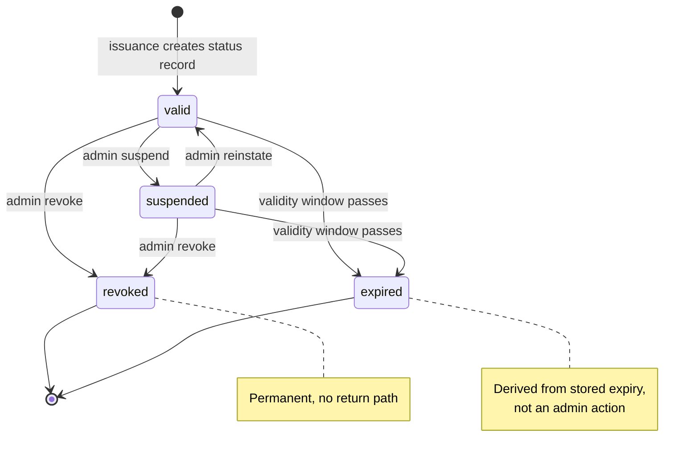

# Credential Lifecycle And Status

> **Page type:** How-to · **Product:** Registry Notary · **Layer:** credential · **Audience:** operator

Registry Notary issues short-lived SD-JWT VC credentials. Live credential status
is optional. This guide explains the default lifecycle, when to enable status,
what status means, and how operators should run it.

## Default Lifecycle

By default, issued credentials are status-free:

- No `status` claim is added to the SD-JWT VC payload.
- No revocation list or status-list profile is published.
- Verifiers rely on issuer trust, holder binding, and credential expiry.
- Credential profiles default to 600 seconds of validity when
  `validity_seconds` is omitted.

The top-level `evidence.max_credential_validity_seconds` is capped at 600
seconds, and profile validity must be between 1 second and that maximum.
Self-attestation profiles are also bounded by
`self_attestation.token_policy.max_credential_validity_seconds`.

This default suits deployments that prefer short expiry as the primary lifecycle
control, avoiding the operational cost of a long-lived revocation surface.

## When To Enable Status

Enable credential status when verifiers need to check a live lifecycle state
after issuance, for example:

- A credential may need temporary suspension.
- A credential may need revocation before its expiry.
- A verifier policy requires live issuer status.
- An operator wants a bounded audit trail for lifecycle actions.

Do not enable status only because it is familiar from other credential systems.
It adds an online dependency for verifiers and creates an operational store that
must be kept available for the retention window.

## Configuration

```yaml
credential_status:
  enabled: true
  base_url: https://notary.example.gov
  storage: redis
  retention_seconds: 86400
  redis:
    url_env: REGISTRY_NOTARY_STATUS_REDIS_URL
    key_prefix: registry-notary
    connect_timeout_ms: 1000
    operation_timeout_ms: 500
```

Fields:

- `enabled`: adds status records during issuance and includes a status claim in
  issued credentials.
- `base_url`: public HTTPS origin used to build status URLs. Use plain HTTP only
  for local or lab deployments.
- `storage`: `in_memory` or `redis`.
- `retention_seconds`: how long status records are retained.
- `redis.url_env`: environment variable containing the Redis URL.
- `redis.key_prefix`: deployment-specific key prefix.
- `connect_timeout_ms` and `operation_timeout_ms`: Redis timeout controls.

Use `in_memory` only for local or lab flows. It is process-local and disappears
on restart. Use Redis when more than one process can issue credentials, when
rolling deploys overlap traffic, or when status must survive restart.

## Credential Payload

When status is enabled, issued SD-JWT VC payloads include a status object using
the Registry Notary credential status profile. The status URL is anchored at the
public base URL:

```json
{
  "status": {
    "type": "RegistryNotaryCredentialStatus",
    "statusUrl": "https://notary.example.gov/v1/credentials/urn:ulid:01HX.../status"
  }
}
```

The status URL is intentionally per credential. It is not a status list and it
does not expose subject identifiers or claim values.

## Status Values

The public status response can report:

| Status | Meaning |
| --- | --- |
| `valid` | The credential has an active status record and is not expired. |
| `suspended` | The operator has temporarily disabled the credential. |
| `revoked` | The operator has permanently revoked the credential. |
| `expired` | The credential lifetime has passed. This can be derived from the stored expiry. |

Only `valid`, `suspended`, and `revoked` are mutable lifecycle states. `expired`
is derived from time.



*Credential status lifecycle. Admin mutation moves a credential between `valid`,
`suspended`, and `revoked`; `expired` is derived from the stored expiry rather
than set by an operator.*

## Privacy Boundary

Status records intentionally contain lifecycle metadata only:

- Credential id.
- Issuer or service metadata needed by Notary.
- Credential profile id.
- Issued-at and expires-at timestamps.
- Last-updated timestamp.
- Current lifecycle status.

Status records must not contain:

- Subject ids.
- Holder DIDs or holder public keys.
- Claim values.
- SD-JWT disclosures.
- Source rows.
- Raw access tokens or proof JWTs.

This lets a verifier check lifecycle state without turning the status store into
a second registry of personal data.

## Status Operations

Status operations are exposed as:

- Public status retrieval at the credential's status URL.
- Admin status mutation for operators with `registry_notary:admin`.

Use the SDK methods where possible so your integration does not depend on route
names directly:

- Rust: `credential_status(...)` and `update_credential_status(...)`.
- Node.js and Python wrappers expose only the read-only status lookup
  (`credentialStatus` / `credential_status`); the admin status mutation is
  available via Rust or HTTP only.

Admin mutation accepts a new status value of `valid`, `suspended`, or
`revoked`.

## Operational Model

Credential issuance creates the status record after the credential id and
expiry are known. If the status store cannot write the record, issuance should
fail closed rather than issuing a credential that references a missing live
status URL.

Status retrieval should be treated as public verifier traffic. Status mutation
is an admin operation and should be limited to trusted operator tooling.

Readiness should fail when a configured Redis status backend is unavailable.
That is preferable to issuing status-bearing credentials that cannot be checked
or updated reliably.

## Retention

Set `retention_seconds` to cover:

- Maximum credential validity.
- Expected verifier clock skew.
- Any grace period required by the relying party.
- Audit or dispute window for lifecycle actions.

For the current 600-second credential ceiling, 24 hours is usually enough for
test and pilot deployments. Production policies may require longer status
retention even though the credential itself is short lived.

Do not shorten retention while outstanding credentials still reference status
URLs unless verifiers have agreed to treat missing status records as expired or
invalid.

## Verifier Policy

Verifier policy should be explicit:

- Accept status-free credentials only from profiles that are expected to be
  status-free.
- For status-bearing credentials, fetch the status URL and require `valid`.
- Treat `suspended`, `revoked`, missing status, malformed status, or network
  failure according to the relying party's risk policy. High-assurance flows
  should fail closed.
- Apply credential expiry even when status returns `valid`.

Registry Notary does not currently publish StatusList or external revocation
list profiles. The supported status profile is documented in
[`sd-jwt-vc-conformance-profile.md`](sd-jwt-vc-conformance-profile.md).

## Rollout Checklist

- Confirm every credential profile that needs status is issued by a deployment
  with `credential_status.enabled: true`.
- Confirm `credential_status.base_url` is the public issuer URL verifiers can
  reach.
- Use Redis for deployable multi-process status.
- Keep the status Redis separate or key-prefixed from unrelated applications.
- Confirm `/ready` fails when the status backend is unavailable.
- Run one credential issuance and verify the payload has a status URL.
- Fetch that status URL and confirm `valid`.
- Mutate a test credential to `suspended` or `revoked` with an admin credential.
- Confirm audit records exist for issuance and mutation without raw personal
  data.

## Troubleshooting

| Symptom | Likely cause | Check |
| --- | --- | --- |
| Issued credential has no status claim | `credential_status.enabled` is false in the issuing deployment | Check expanded config |
| Status URL points at localhost | `credential_status.base_url` was copied from a local config | Set public HTTPS base URL |
| Status is missing after restart | `storage: in_memory` was used | Use Redis for shared or durable status |
| Admin update is unauthorized | Missing `registry_notary:admin` scope | Check caller scopes or OIDC scope mapping |
| Verifier sees `expired` quickly | Profile validity is short or clocks differ | Check `validity_seconds`, verifier clock, and expiry policy |
| Readiness fails after enabling status | Redis URL env var missing or backend unreachable | Check `credential_status.redis.url_env` and Redis connectivity |
