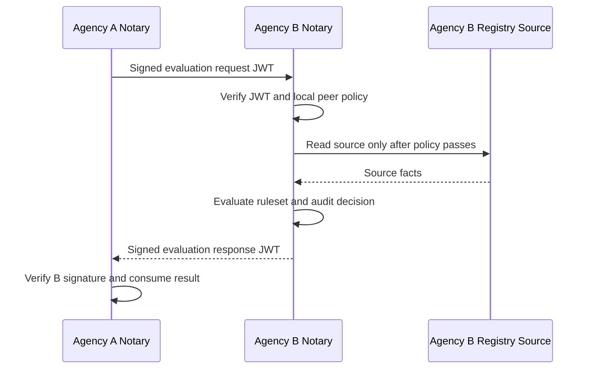
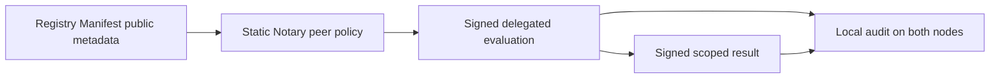
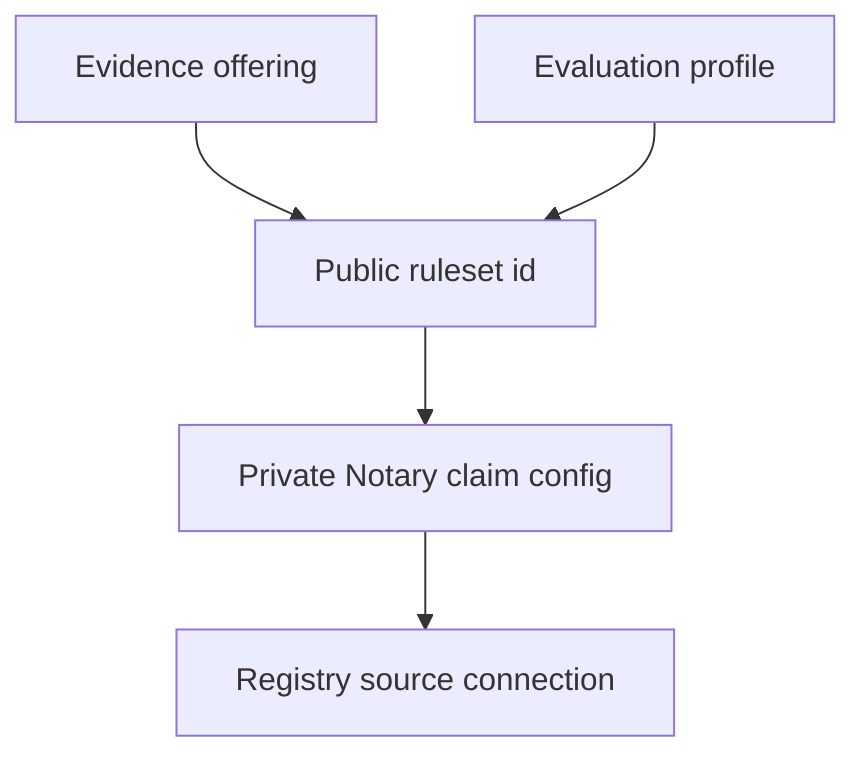
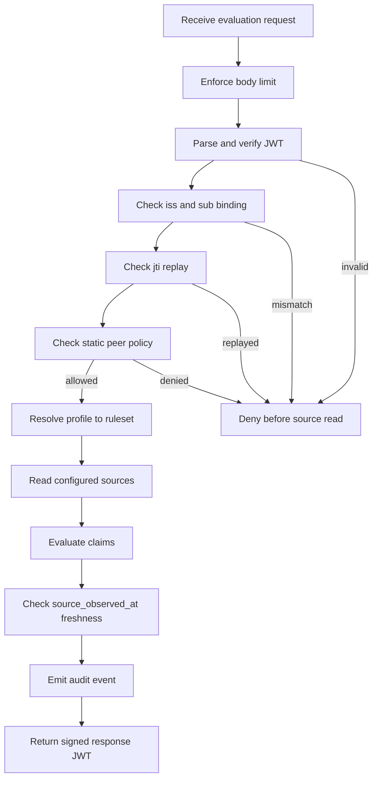

# Federated Evaluation MVP Spec

## Purpose

Define the first practical Registry Notary federation slice: one trusted
Notary asks another trusted Notary for a signed, scoped evaluation result.

This MVP deliberately implements delegated evaluation only. It does not attempt
full federation, federated credential issuance, trust-chain discovery, audit
checkpoint exchange, or open network participation.

The goal is a government-ready integration pattern that is simple to operate:

```text
Agency A Notary -> signed evaluation request -> Agency B Notary
Agency A Notary <- signed evaluation response <- Agency B Notary
```



Each agency keeps authority over its own registry sources, policies, keys, and
audit trail.

## Why This Is Enough For V1

Government data-sharing relationships usually start with formal partners,
written purposes, scoped authority, and auditable exchanges. This MVP fits that
model:

- no open federation;
- no raw registry rows shared by default;
- no central citizen database;
- explicit peer allowlists;
- signed requests and responses;
- local audit on both sides;
- fail-closed runtime behavior.

The MVP provides a solid base for later credential issuance and trust bundles
without putting wallet holder-proof semantics or multi-hop trust chains on the
critical path.



## In Scope

### Registry Manifest Metadata

Registry Manifest publishes enough public metadata for a partner to configure a
peer manually:

- `node_id`;
- `issuer`;
- `jwks_uri`;
- `federation_api`;
- supported protocol versions;
- `registry-notary` evidence offerings;
- evaluation profiles;
- public `ruleset` identifiers.

Manifest metadata is discovery and documentation. It does not grant access.



### Static Notary Peer Policy

Registry Notary uses static local config for the trusted peer:

```yaml
federation:
  enabled: true
  node_id: did:web:agency-a.example.gov
  issuer: https://agency-a.example.gov
  jwks_uri: https://agency-a.example.gov/federation/jwks.json
  federation_api: https://agency-a.example.gov/federation/v1
  supported_protocol_versions:
    - registry-notary-federation/v0.1
  inbound_body_limit_bytes: 16384
  max_request_lifetime_seconds: 300
  clock_leeway_seconds: 60
  signing:
    kid: notary-fed-2026-05
    key_env: REGISTRY_NOTARY_FEDERATION_RESPONSE_JWK
    alg: EdDSA
  pairwise_subject_hash:
    secret_env: REGISTRY_NOTARY_PAIRWISE_SUBJECT_HASH_SECRET
  peers:
    - node_id: did:web:agency-b.example.gov
      issuer: https://agency-b.example.gov
      jwks_uri: https://agency-b.example.gov/.well-known/jwks.json
      # Local Compose demos may use allow_insecure_private_network: true with
      # an HTTP service URL. Production peer JWKS URLs must use HTTPS.
      allowed_protocol_versions:
        - registry-notary-federation/v0.1
      allowed_purposes:
        - https://purpose.example.gov/social-protection/service-delivery
      allowed_profiles:
        - disability_status_predicate
      source_scopes:
        - disability_registry:evidence_verification
  evaluation_profiles:
    - id: disability_status_predicate
      ruleset: disability-status-v1
      claim_id: disability_status
      subject_id_type: national_id
      disclosure: predicate
      max_source_observed_age_seconds: 3600
  response_shaping:
    minimum_denial_latency_ms: 250
  emergency_denylist:
    node_ids: []
    kids: []
```

The local peer policy is authoritative. If Manifest says a profile exists but
local config does not allow it, the request is denied.

`allow_insecure_private_network` is permitted only as an explicit lab or
development escape hatch for peer JWKS fetches on private Compose networks. It
must not be enabled for production federation.

MVP `node_id` and `issuer` are both required and must be bound. When `node_id`
uses `did:web`, the DID host component must match the `issuer` HTTPS origin
host. For example, `did:web:agency-a.example.gov` binds to
`https://agency-a.example.gov`. Separate issuer origins are out of scope for the
MVP.

The pairwise subject hash secret must be a dedicated secret used only for
federation subject references. It must not reuse audit, cookie, source-token, or
credential-signing secrets.

### One Runtime Operation

V1 exposes one privileged peer endpoint:

```text
POST /federation/v1/evaluations
```

The endpoint accepts one subject and returns one signed evaluation response.
Batching is out of scope for the first implementation even though the
north-star protocol may later support it.

The MVP inbound request body limit is `16384` bytes. Operators may lower it, but
raising it requires an explicit config change and a focused oversized-body test.

### Signed Request JWT

Requests must be compact JWS signed JWTs using the V1 protocol profile:

- `typ = registry-notary-request+jwt`;
- compact JWS serialization only;
- `alg = EdDSA`;
- `kid` resolves only within the caller issuer's configured JWKS;
- `iss` is the calling Notary issuer;
- `sub` is the calling Notary node id;
- `aud` is the serving Notary node id;
- `iat`, `nbf`, `exp`, and `jti` are required;
- `protocol`, `action`, `profile`, and `purpose` are required;
- `purpose` must be an HTTPS URI. Compact purpose ids are deferred beyond the
  MVP. Future portable purpose semantics should align with a recognized
  vocabulary such as W3C DPV instead of local string substitution.
- requests where `exp - iat` exceeds `max_request_lifetime_seconds` are denied.

`typ = registry-notary-request+jwt` is an unregistered project JWT type for the
MVP. Registration or migration to a registered media type is deferred until the
protocol stabilizes.

Example payload:

```json
{
  "iss": "https://agency-a.example.gov",
  "sub": "did:web:agency-a.example.gov",
  "aud": "did:web:agency-b.example.gov",
  "iat": 1779878400,
  "nbf": 1779878400,
  "exp": 1779878700,
  "jti": "01J...",
  "protocol": "registry-notary-federation/v0.1",
  "action": "evaluate",
  "profile": "disability_status_predicate",
  "purpose": "https://purpose.example.gov/social-protection/service-delivery",
  "request": {
    "subject": {
      "id": "example-subject-id",
      "id_type": "national_id"
    },
    "claims": ["disability_status"]
  }
}
```

The serving Notary verifies the JWT before any source read.

`jti` must be a ULID string. Test fixtures should use deterministic ULIDs so
replay tests can assert exact values.

### Signed Response JWT

Responses must be compact JWS signed JWTs:

- `typ = registry-notary-response+jwt`;
- compact JWS serialization only;
- `alg = EdDSA`;
- `kid` resolves only within the serving issuer's configured JWKS;
- `iss` is the serving Notary issuer;
- `sub` is the serving Notary node id;
- `aud` is the requesting Notary node id;
- `iat`, `nbf`, `exp`, and `jti` are required;
- `request_jti` binds the response to the request.

`typ = registry-notary-response+jwt` is an unregistered project JWT type for
the MVP. Registration or migration to a registered media type is deferred until
the protocol stabilizes.

Example payload:

```json
{
  "iss": "https://agency-b.example.gov",
  "sub": "did:web:agency-b.example.gov",
  "aud": "did:web:agency-a.example.gov",
  "iat": 1779878401,
  "nbf": 1779878401,
  "exp": 1779879001,
  "jti": "01J...",
  "request_jti": "01J...",
  "protocol": "registry-notary-federation/v0.1",
  "action": "evaluate",
  "profile": "disability_status_predicate",
  "result": {
    "evaluation_id": "eval_01J9Z6Q6Q6Q6Q6Q6Q6Q6Q6Q6Q6",
    "subject_ref": {
      "hash": "hmac-sha256:...",
      "id_type": "national_id"
    },
    "claims": {
      "disability_status": {
        "satisfied": true,
        "disclosure": "predicate"
      }
    },
    "source_observed_at": "2026-05-27T10:00:00Z",
    "policy": {
      "ruleset": "disability-status-v1",
      "purpose": "https://purpose.example.gov/social-protection/service-delivery"
    }
  }
}
```

`evaluation_id` must be `eval_` followed by a ULID, for example
`eval_01J9Z6Q6Q6Q6Q6Q6Q6Q6Q6Q6Q6`. Denial `instance` values must be
`urn:ulid:<ULID>`, but cross-organization incident reports should redact them if
timing disclosure is a concern.

Stale source observations are returned as signed evaluation errors, not bare
HTTP denials. The signed response keeps `request_jti`, `profile`, and `purpose`
auditable even when the source observation is too old:

```json
{
  "iss": "https://agency-b.example.gov",
  "sub": "did:web:agency-b.example.gov",
  "aud": "did:web:agency-a.example.gov",
  "iat": 1779878401,
  "nbf": 1779878401,
  "exp": 1779879001,
  "jti": "01J...",
  "request_jti": "01J...",
  "protocol": "registry-notary-federation/v0.1",
  "action": "evaluate",
  "profile": "disability_status_predicate",
  "error": {
    "type": "urn:registry-notary:problem:federation:stale-source-observation",
    "title": "Source observation is stale"
  }
}
```

### Disclosure Limits

V1 allows only configured predicate or value disclosure. Raw source records are
out of scope. If `evaluation_profiles[].disclosure` is omitted, the runtime
uses `predicate`; value disclosures such as age band must opt in explicitly with
`disclosure: value`.

### Pairwise Subject Reference

`subject_ref.hash` is an issuer-generated pairwise handle. It is not a
consumer-verifiable proof.

```text
hmac-sha256:<base64url-no-pad HMAC>
```

The `hmac-sha256:` prefix is a project-scoped label for this MVP, not a
registered hash URI scheme. The HMAC key is owned by the serving Notary and
must not be shared. The input is this JCS-canonicalized JSON object:

```json
{
  "aud": "<consuming node id>",
  "issuer": "<serving node id>",
  "profile": "<profile id>",
  "id_type": "<normalized id type>",
  "subject_id": "<normalized subject id>"
}
```

Scoping the input this way prevents the same subject from being correlated
across different consuming peers by comparing handles.

### Replay Protection

V1 must reject repeated `jti` values within the request expiry window plus clock
leeway.

Notary rejects requests where `exp - iat` exceeds
`max_request_lifetime_seconds`. `jti` entries are retained until
`exp + clock_leeway_seconds`.

For single-instance development, top-level `replay.storage = in_memory` is
acceptable. Production or active-active deployments require a shared replay
store before federation can be enabled. The supported shared backend is
top-level `replay.storage = redis`, with the Redis URL read from the configured
environment variable. Redis readiness must verify write and delete capability,
and stored backend keys must hash replay scope and one-time identifiers rather
than expose peer ids, holder ids, subjects, nonces, or JWT `jti` values.

### Audit

Both Notary nodes audit:

- peer id;
- issuer;
- action;
- profile;
- purpose;
- request `jti`;
- allow or deny decision;
- redacted or HMAC-hashed subject reference;
- result status.

Audit events must not include raw source rows, bearer tokens, private keys,
private JWK fields, compact JWT strings, or raw source credentials. Parsed JWT
claims may be logged only after redacting subject identifiers and token ids.

## Out Of Scope

- Federated credential issuance.
- OpenID4VCI holder-proof proxying.
- Citizen wallet issuance through an intermediary Notary.
- Trust bundles.
- OpenID Federation trust chains.
- Dynamic peer enrollment.
- Audit checkpoint exchange.
- Transparency logs or inclusion proofs.
- Batch evaluation.
- DID document key resolution.
- Raw evidence sharing.
- Cross-node writes.
- Remote credential acceptance as source evidence.
- Push-based peer notifications.

## Request Processing Order

The serving Notary must process requests in this order:

1. Enforce the `inbound_body_limit_bytes` limit before buffering the full body.
2. Parse compact JWS without logging token material.
3. Validate `typ`, `alg`, `kid`, signature, `iss`, `sub`, `aud`, `iat`, `nbf`,
   `exp`, and `jti`.
4. Verify the `iss` and `sub` binding against configured peer policy.
5. Resolve peer by configured `node_id` and `issuer`.
6. Check emergency denylist for peer `node_id` and `kid`.
7. Check replay store for `jti`.
8. Check local peer policy for action, profile, purpose, protocol, and batch
   size.
9. Resolve the profile to its public `ruleset`.
10. Map `ruleset` to local private claim configuration.
11. Read configured sources.
12. Evaluate claims.
13. If `source_observed_at` is stale, prepare a signed evaluation error.
14. Write the audit event.
15. Return signed response JWT or signed evaluation error.

Any failure before step 11 must happen before source reads. Audit is
write-before-respond: if the audit sink fails after source access or evaluation,
the Notary must not send a successful signed response. It should return a
generic `503` denial and emit an operator log without raw subject or token
material.



## Denial Responses

Denials use a small RFC 7807-style body:

```json
{
  "type": "urn:registry-notary:problem:federation:forbidden",
  "title": "Federation request denied",
  "status": 403,
  "detail": "The request is not permitted by local federation policy.",
  "instance": "urn:ulid:01J..."
}
```

Problem `type` values use private, non-resolvable `urn:registry-notary`
identifiers in the MVP. The response body must not reveal whether a subject
exists.

`response_shaping.minimum_denial_latency_ms` should be set at or above the
observed 95th-percentile latency for allowed source reads on the protected
profile. Setting it lower is allowed only with an explicit deployment note that
accepts the residual timing side channel.

## Follow-On Work

After this MVP is working, consider these separately:

1. Batch evaluation.
2. Shared replay store as a production requirement.
3. Signed public federation documents.
4. Audit checkpoints.
5. Trust bundles.
6. Federated credential issuance through issuer-direct or transparent-relay
   flows only.

## Executable Definition Of Done

This section is the implementation gate for the MVP. A feature is not done
until every applicable item below is satisfied and reviewed.

- Registry Manifest validates a fixture containing `federation`,
  `evaluation_profiles`, and a `registry-notary` evidence offering with a
  matching `ruleset`.
- Registry Manifest rejects fixtures where `access.ruleset` does not resolve to
  an evaluation profile, `conforms_to` is not
  `registry-notary-federation/v0.1`, or required federation URLs are invalid.
- Registry Notary loads federation config with `enabled: false` and serves the
  existing API exactly as before in the existing test suite.
- Registry Notary rejects startup config when federation is enabled without
  `node_id`, `issuer`, peer policy, trusted peer JWKS URI, or signing key
  configuration.
- Registry Notary rejects startup config when `node_id` and `issuer` do not
  satisfy the MVP binding rule.
- `POST /federation/v1/evaluations` is not mounted unless federation is enabled.
- Request bodies over `inbound_body_limit_bytes` are rejected before full body
  buffering and before JWT parsing.
- A valid compact JWS request JWT with required `typ`, `alg = EdDSA`, matching `kid`,
  valid signature, `iss`, `sub`, `aud`, `iat`, `nbf`, `exp`, and unseen `jti`
  reaches claim evaluation only after local peer policy passes.
- A request with unknown peer, unsupported profile, unsupported purpose, bad
  audience, expired token, future `nbf`, denied algorithm, unknown `kid`, bad
  signature, `iss`/`sub` mismatch, replayed `jti`, emergency-denied `kid`, or
  `exp - iat` above policy is denied before any source read. Tests must assert
  the source reader was not called.
- Successful evaluation returns a signed response JWT with required `typ`,
  `alg = EdDSA`, `kid`, `iss`, `sub`, `aud`, `iat`, `nbf`, `exp`, `jti`,
  `request_jti`, `protocol`, `action`, `profile`, and a result body.
- Response verification succeeds using the serving Notary JWKS and fails if the
  payload or protected header is modified.
- `subject_ref.hash` is produced with the pairwise HMAC input defined in this
  spec and differs for the same subject when the consuming peer or profile
  differs.
- Raw source rows, bearer tokens, private keys, private JWK fields, compact JWT
  strings, and source credentials do not appear in federation responses, denial
  bodies, audit events, or test logs.
- Audit events are emitted for allowed evaluation, policy denial, signature
  denial, and replay denial, and include peer id, profile, purpose, request
  `jti`, decision, and a redacted subject reference.
- Audit write failure after source access prevents a successful signed response,
  with a focused test.
- `source_observed_at` older than `max_source_observed_age_seconds` is returned
  as a signed evaluation error, with a focused test.
- In-memory replay storage is bounded for public OID4VCI nonce reservations.
  Redis replay storage is required for active-active deployments and fails
  readiness when write or delete capability is unavailable.
- The repository commands listed in the project README for formatting, linting,
  and focused tests pass, or any skipped command is documented with the exact
  blocker.

## Spec-To-Code Checklist

This is the current MVP trace from this spec to implementation. Keep it updated
when behavior changes.

| Spec requirement | Implementation | Verification |
|---|---|---|
| Manifest declares `federation` and `evaluation_profiles` | `registry-manifest-core/src/lib.rs` federation structs and validation | `federated_evaluation_manifest_validates_and_renders_catalog_fields` |
| `access.ruleset` resolves to an evaluation profile ruleset | `validate_registry_notary_access` checks `evaluation_profiles[*].ruleset` | `validation_rejects_registry_notary_unresolved_ruleset` |
| Federation disabled by default and route hidden | `standalone_router` mounts federation router only when enabled | `federation_route_is_not_mounted_until_enabled` |
| Startup validates node/issuer binding and peer policy | `FederationConfig::validate` | `federation_config_validates_enabled_mvp_shape` and negative config tests |
| Request verification uses compact JWS, EdDSA, `typ`, `kid`, `iss`, `sub`, `aud`, time, and `jti` | `registry-notary-server/src/federation.rs` request handler and `TokenVerifier` integration | `federation_denial_happens_before_source_read` |
| Denials before policy pass do not read sources | `handle_federated_evaluate` orders verification before `evaluate_with_source_capability` | source hit counters in denial tests |
| Oversized request bodies are rejected before full buffering | `to_bytes(body, inbound_body_limit_bytes)` in federation handler | oversized body case in `federation_denial_happens_before_source_read` |
| Replay retains one-time identifiers through protocol expiry and rejects duplicates | `registry-notary-server/src/replay.rs` and `registry-platform-replay` | replay unit tests and `federation_evaluation_returns_signed_response_and_rejects_replay` |
| Successful response is signed and bound to `request_jti` | `FederationSignedOutcome::success` | `federation_evaluation_returns_signed_response_and_rejects_replay` |
| Stale source returns signed top-level `error` | `FederationSignedOutcome::evaluation_error` | `federation_stale_source_observation_returns_signed_evaluation_error` |
| Audit is write-before-respond | federation audit emission before response return | `federation_audit_write_failure_replaces_signed_success` |
| Two configured standalone Notaries can complete delegated evaluation | two `standalone_router` instances in one smoke test | `federation_two_standalone_notaries_smoke` |

## Wave Implementation Plan

```mermaid
flowchart LR
  W0["Wave 0: Fixtures and contracts"]
  R0["Review checkpoint"]
  W1["Wave 1: Manifest schema and validation"]
  R1["Review checkpoint"]
  W2["Wave 2: Notary config, JWT verification, replay"]
  R2["Security review checkpoint"]
  W3["Wave 3: Delegated evaluation endpoint"]
  R3["End-to-end review and verification"]

  W0 --> R0 --> W1 --> R1 --> W2 --> R2 --> W3 --> R3
```



## Registry Platform Work

The MVP should avoid copying shared security primitives into Notary when they
belong in `registry-platform`.

Push to `registry-platform` before or during the matching wave:

- Wave 0: add federation JWT fixture helpers to `registry-platform-testing`
  using existing Ed25519 fixtures. Fixtures live in `registry-platform-testing`
  and are owned by the platform crate maintainers; test-only keys rotate when
  platform fixture keys rotate.
- Wave 2: reuse `registry-platform-oidc::JwksFetcher` and JWT verification
  policy instead of writing a parallel JWKS cache. Layer the MVP `typ`,
  `alg = EdDSA`, compact-JWS, issuer/audience, and `iss`/`sub` binding checks
  in Notary if the platform verifier does not expose them directly.
- Wave 2: use `registry-platform-replay` for replay and consumable nonce
  semantics, backed by `registry-platform-cache` for in-memory and Redis cache
  operations. Notary owns configuration and route policy only.
- Wave 3: add pairwise HMAC helper and redaction test helpers to
  `registry-platform-crypto` or `registry-platform-authcommon` only if another
  service will consume them. Until then, keep the pairwise subject-hash wrapper
  local to Notary but use platform canonicalization and constant-time
  primitives.
- Future audit checkpoint work belongs in `registry-platform-audit`, not this
  MVP.

### Wave 0: Fixtures And Contracts

Parallel work:

- Worker A: add Registry Manifest valid and invalid federation fixtures.
- Worker B: add Notary federation config fixtures for disabled mode, valid
  static peer, and invalid enabled config.
- Worker C: add signed compact-JWS request/response JWT test fixtures using
  deterministic Ed25519 test keys from `registry-platform-testing`.

Wave DoD:

- Valid Manifest fixture parses and validates.
- Invalid Manifest fixtures fail on the expected field paths.
- Notary config fixtures cover disabled, valid enabled, and missing-required
  enabled cases.
- JWT fixtures include `typ`, `kid`, `nbf`, `exp`, `jti`, profile, purpose, and
  request payload.
- JWT fixture ids use ULID strings for `jti`, `evaluation_id`, and denial
  `instance`.

Review checkpoint:

- Code review verifies fixture names, expected failures, and no secret material.
- No runtime implementation starts until this review is approved.

### Wave 1: Manifest Schema And Validation

Parallel work:

- Worker A: add typed Manifest fields for `federation` and
  `evaluation_profiles`.
- Worker B: add validation for `ruleset`, `conforms_to`, URL fields, profile id
  uniqueness, and entity/lookup references.
- Worker C: update render/golden tests only after schema and validation tests
  pass.

Wave DoD:

- `cargo test -p registry-manifest-core` passes.
- Golden tests prove valid federation metadata renders deterministically.
- Negative tests prove each invalid fixture fails for the intended reason.
- Existing non-federation Manifest fixtures still validate.

Review checkpoint:

- Code review confirms serde compatibility, no unrelated renderer churn, and
  reuse of existing `EvidenceOfferingAccessManifest.ruleset` for the MVP.
- Wave 2 cannot merge until this checkpoint passes.

### Wave 2: Notary Config, JWT Verification, And Replay

Parallel work:

- Worker A: add Notary federation config structs and fail-closed validation.
- Worker B: implement JWT verifier by reusing `registry-platform-oidc`
  JWKS/verifier primitives where possible, with MVP `typ`, compact-JWS,
  `alg = EdDSA`, and `iss`/`sub` binding checks layered on top.
- Worker C: implement single-instance replay store abstraction and `jti`
  retention rules with max-entry eviction.

Wave DoD:

- Federation routes are absent when `enabled: false`.
- Enabled config without required fields fails at startup.
- Verifier accepts only valid fixture JWTs.
- Tests cover bad `typ`, denied `alg`, unknown `kid`, bad signature, wrong
  `aud`, `iss`/`sub` mismatch, expired `exp`, future `nbf`, long lifetime,
  emergency-denied `kid`, oversized body, and replayed `jti`.
- All verification failures happen before source-reader invocation in tests.

Review checkpoint:

- Security-focused review checks fail-closed order, `kid` scoping, replay
  retention, and absence of token material in logs.
- Wave 3 cannot start until denial-before-source-read tests are merged.

### Wave 3: Delegated Evaluation Endpoint

Parallel work:

- Worker A: mount `POST /federation/v1/evaluations` and map verified requests to
  existing claim evaluation.
- Worker B: implement signed response JWT generation and response verification
  tests.
- Worker C: implement audit events, raw-row redaction tests, and stale
  `source_observed_at` signed-error handling.

Wave DoD:

- Allowed peer/profile/purpose returns a signed response JWT.
- Unknown peer, unsupported profile, unsupported purpose, replay, stale source
  observation signed error, audit-write failure, and source error have focused
  tests.
- Pairwise subject hash differs across consuming peer and profile test cases.
- Audit tests cover allow, policy denial, signature denial, and replay denial.
- Existing Notary evaluation and credential tests still pass.

Review checkpoint:

- Code review validates the end-to-end path against the executable DoD above.
- The feature is marked complete only after focused tests, relevant package
  tests, formatting, linting, and README-documented verification commands pass
  or have documented blockers.
