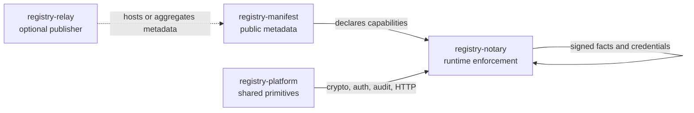
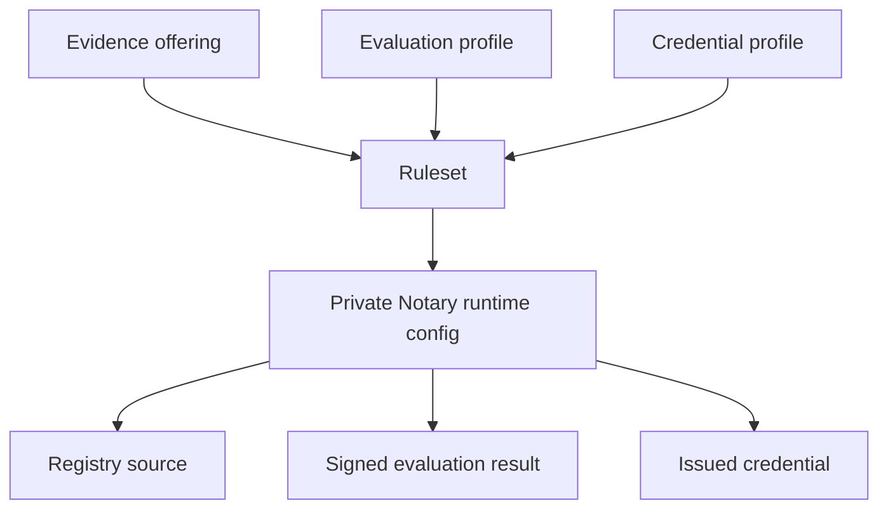
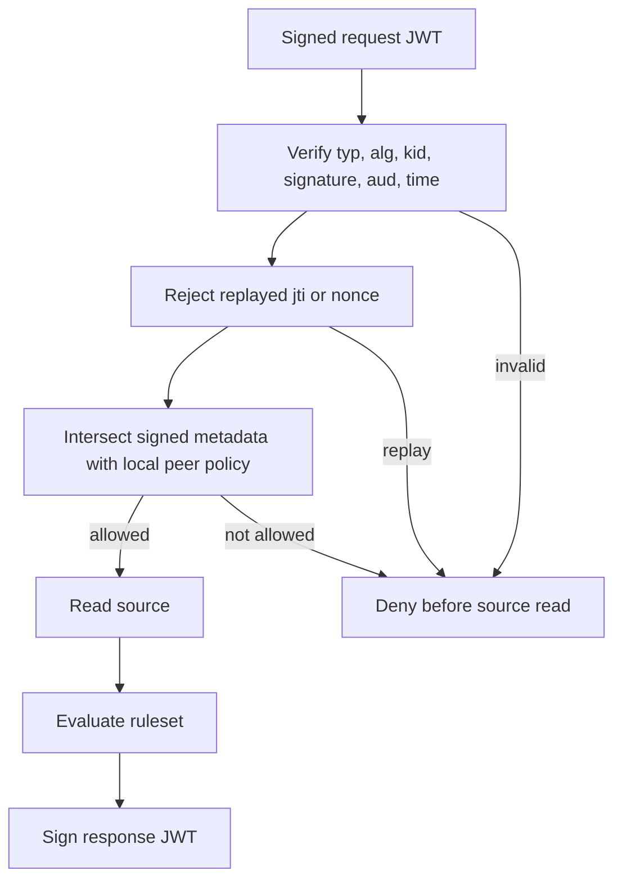
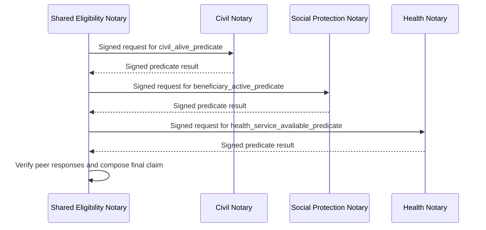
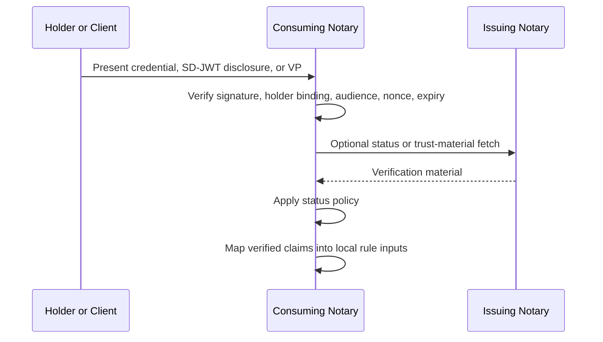
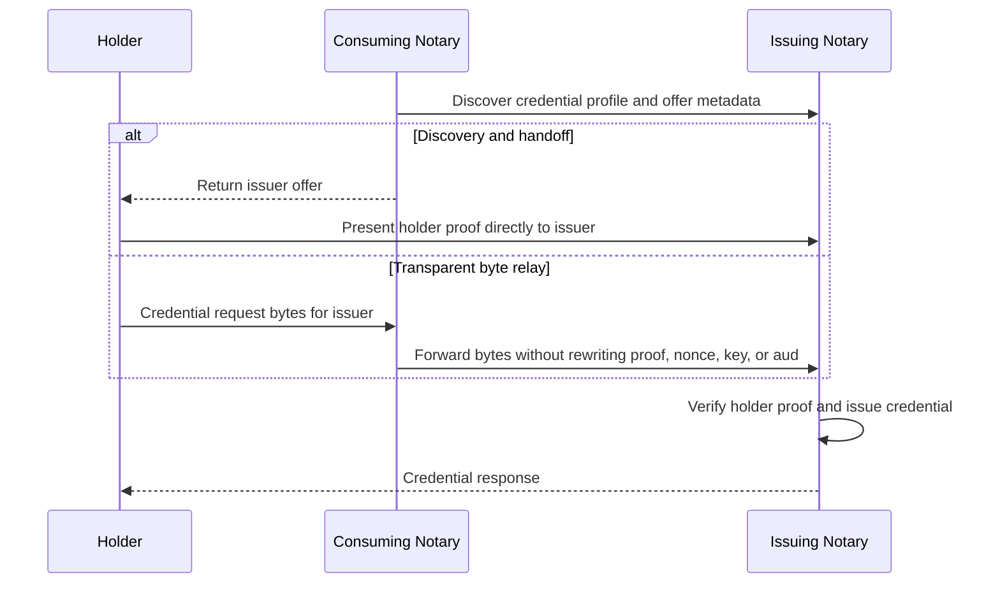
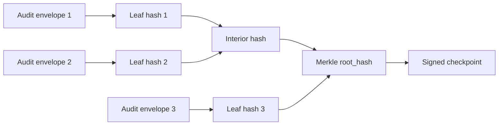
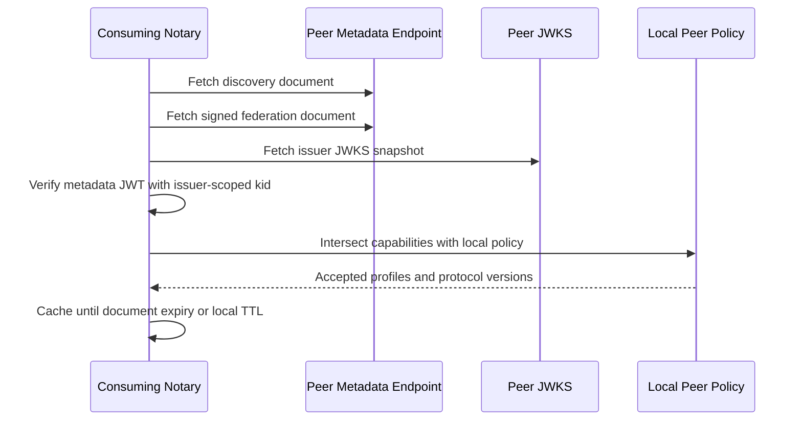
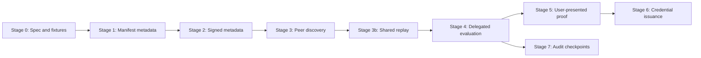

# Federated Notary Manifest Spec

For the first implementation slice, see
[`federated-evaluation-mvp-spec.md`](federated-evaluation-mvp-spec.md). This
document is the broader protocol and roadmap spec.

## Purpose

Define how Registry Notary nodes federate with each other while using
Registry Manifest as the portable metadata and discovery layer.

The design keeps the responsibilities separate:

- `registry-manifest` declares public capabilities, evidence offerings,
  service endpoints, credential profiles, and public trust coordinates.
- `registry-notary` performs peer authentication, authorization, claim
  evaluation, credential issuance, replay protection, audit, and policy
  enforcement.
- `registry-platform` provides shared HTTP, auth, OIDC, SD-JWT, DID/JWK, JCS,
  and audit primitives.
- `registry-relay` may publish or aggregate manifests, but does not own Notary
  federation runtime behavior.

Federation must exchange signed, policy-scoped facts and credentials. It must
not create a shared mutable registry database, unrestricted cross-node source
access, or implicit trust between discoverable nodes.



## Background

Registry Notary is designed to evaluate configured claims against authorized
source connectors and issue holder-bound credentials. Registry Manifest already
models portable registry metadata, standards-facing catalogs, data services,
evidence offerings, policies, and static discovery artifacts. It can therefore
serve as the control-plane artifact for a federated Notary network.

The missing pieces are:

1. Manifest fields that describe a Notary node, its federation endpoint,
   credential/evaluation profiles, protocol versions, public signing keys, and
   trust anchors.
2. A signed manifest or signed federation document that peers can verify before
   relying on published capabilities.
3. Notary runtime support for consuming peer metadata, validating trust,
   enforcing local allow policies, accepting delegated evaluation requests,
   sending delegated evaluation requests, composing signed peer evaluations into
   local claim workflows, and returning signed results.
4. Audit checkpoint publication so peers can verify continuity without seeing
   raw audit logs.

## Design Principles

- Discovery is not trust. A discovered node is untrusted until its metadata,
  signatures, trust chain, expiry, and local policy are accepted.
- Trust is scoped. A peer may be trusted for one profile and denied for another.
- Results are durable artifacts. Federation responses must be signed so they can
  be verified after transport.
- Credentials are preferred over raw evidence. Cross-node flows should exchange
  signed evaluations or credentials, not upstream registry rows.
- Local policy wins. A remote manifest can advertise capability, but the local
  Notary decides whether to call it or accept results from it.
- Sensitive configuration stays out of Manifest. API keys, bearer tokens,
  private keys, peer-specific secrets, and deployment-only rate limits belong in
  Notary config or secret stores.
- Audit sharing is checkpoint-based by default. Nodes publish signed chain heads,
  not raw audit events.

## V1 Protocol Decisions

These decisions are normative for `registry-notary-federation/v0.1` and remove
ambiguity from later stages:

- V1 defines Registry Notary JWT profiles. It does not claim that the signed
  federation document is an OpenID Federation entity statement.
- V1 signed metadata uses `typ = registry-notary-federation-metadata+jwt`.
- V1 signed peer requests use `typ = registry-notary-request+jwt`.
- V1 signed peer responses use `typ = registry-notary-response+jwt`.
- V1 signed audit checkpoints use `typ = registry-notary-audit-checkpoint+jwt`.
- The only allowed JWS algorithms are `ES256`, `ES384`, and `EdDSA`.
  Implementations must deny `none`, all `HS*`, all `RS*`, and any algorithm not
  explicitly configured in the local allowlist.
- `jwks_uri` advertised for the `iss` node is the authoritative V1 key source.
  `did:web` is used as a stable node identifier, but V1 does not resolve DID
  documents for keys.
- `kid` is scoped to the issuer's configured or discovered JWKS. A `kid` match
  in any other key set is irrelevant.
- JCS canonicalization is used for digest inputs only. Compact JWS/JWT payloads
  are not pre-canonicalized before signing.
- `metadata_digest` uses Subresource Integrity syntax:
  `sha256-<base64-standard-with-padding>` over the JCS-canonicalized unsigned
  federation JSON document.
- Peer-specific signed federation documents must include `aud`. Public
  well-known discovery documents and public metadata JWTs may omit `aud`.
- Top-level `credential_profiles` and `evaluation_profiles` are the V1 shape.
  Nested profile definitions are out of scope.
- `/.well-known/registry-notary` is an unregistered private bootstrap pointer
  in V1. Registration can be pursued later if the protocol stabilizes.
- `application/dc+sd-jwt` is the credential media type used by current Notary
  SD-JWT VC issuance because that is the target wallet and verifier ecosystem
  for this project. Other SD-JWT VC media types can be added by future profiles.
- `node_id` may be `did:web` or an HTTPS URL. For `did:web`, V1 treats it as a
  stable identifier string only; key material still comes from `jwks_uri`.

## Glossary

| Term | Meaning |
| --- | --- |
| Evidence offering | Manifest declaration that a node can provide evidence for a dataset/entity through a named access mechanism |
| Evaluation profile | Public profile for a signed claim-evaluation output, including output format, subject entity, lookup keys, and `ruleset` |
| Credential profile | Public profile for an issued credential output, including `vct`, output format, holder-binding requirements, and `ruleset` |
| User-presented proof | A credential, SD-JWT disclosure, or verifiable presentation supplied by a holder or client to a Notary for local verification and rule evaluation |
| Ruleset | Public stable identifier that binds an offering/profile to private Notary runtime claim configuration |
| Outbound composition | A Notary workflow that calls trusted peer Notaries for signed evaluations and uses those verified results as local rule inputs |
| Peer | A configured Notary node allowed or denied by local policy |
| Trust bundle | Signed public statement that can help validate peer metadata in later stages; not an allowlist by itself |

## Actors

| Actor | Responsibility |
| --- | --- |
| Publishing Notary | Publishes a Registry Manifest federation profile and serves federation APIs |
| Consuming Notary | Discovers peer metadata, validates trust, requests evaluations or credentials |
| Registry Manifest | Defines the portable metadata schema, validation, and renderers |
| Registry Platform | Supplies reusable crypto, auth, HTTP, audit, and test-fixture primitives |
| Trust Anchor | Signs or publishes trust-bundle statements for participating nodes |
| Registry Relay | Optionally hosts or aggregates published metadata artifacts |
| Holder or Client | Presents a proof or requests a local Notary workflow that may depend on remote evidence |

## Non-Goals

- Open federation where any internet node can request evaluations.
- Shared storage, CRDT state replication, or Matrix-style global room state.
- Raw registry-row federation.
- Cross-node writes to upstream registries.
- Peer-to-peer secret exchange.
- Replacing SD-JWT VC issuance or OpenID4VCI wallet flows.
- Solving consent, guardianship, or legal representation. Those require separate
  policy and authorization specs.
- Mandatory blockchain anchoring. Transparency anchoring can be added later.

## Registry Manifest Changes

Registry Manifest should gain an optional top-level `federation` block. The
block is public metadata and must be safe to publish.

```yaml
federation:
  node_id: did:web:social-protection.example.gov
  issuer: https://social-protection.example.gov
  federation_api: https://social-protection.example.gov/federation/v1
  jwks_uri: https://social-protection.example.gov/.well-known/jwks.json
  discovery_url: https://social-protection.example.gov/.well-known/registry-notary
  protocol_versions:
    - registry-notary-federation/v0.1
  audit_checkpoints_url: https://social-protection.example.gov/federation/v1/audit/checkpoints
  trust_bundles:
    - id: national-social-protection-network
      url: https://trust.example.gov/bundles/social-protection.jwt
  status:
    environment: production
    lifecycle: active
```

### Field Semantics

| Field | Required | Meaning |
| --- | --- | --- |
| `node_id` | yes | Stable node identifier. V1 supports `did:web` and HTTPS URL identifiers |
| `issuer` | yes | Issuer identifier used in signed federation artifacts |
| `federation_api` | yes | Base URL for privileged server-to-server federation APIs |
| `jwks_uri` | yes | Public keys for verifying node signatures |
| `discovery_url` | yes | Public discovery document URL |
| `protocol_versions` | yes | Supported federation protocol versions |
| `audit_checkpoints_url` | no | URL for signed audit chain checkpoints |
| `trust_bundles` | no | Public trust-bundle documents relevant to this node |
| `status` | no | Non-secret lifecycle and environment hints |

Production URLs must be HTTPS. Development fixtures may allow loopback HTTP
only when rendered or validated in an explicit dev mode.

`node_id` and `issuer` are intentionally separate. `node_id` is the stable
federation subject used in policy. `issuer` is the JWT issuer and key-discovery
authority. For `did:web` node ids they are often derivable from the same host,
but V1 still requires both fields so deployments can use HTTPS URL node ids or
separate issuer origins without changing the wire shape.

The discovery document example later in this spec intentionally omits optional
`audit_checkpoints_url`, `trust_bundles`, and `status` fields to keep the
bootstrap pointer small. Consumers must fetch the signed federation document for
complete metadata.

## Evidence Offering Extension

Registry Manifest already supports `datasets[*].evidence_offerings[*].access`.
Federated Notary should use that existing shape with a new `kind` value:

```yaml
datasets:
  - id: social-registry
    title: Social Registry
    evidence_offerings:
      - id: disability_status_evaluation
        title: Disability status evaluation
        evidence_type: disability_status_evidence
        issuing_authority:
          id: social-protection-agency
          name: Social Protection Agency
          country: TH
        entity: person
        lookup_keys:
          - national_id
        access:
          kind: registry-notary
          conforms_to: registry-notary-federation/v0.1
          endpoint_url: https://social-protection.example.gov/federation/v1
          discovery_url: https://social-protection.example.gov/.well-known/registry-notary
          ruleset: disability-status-v1
        policy:
          purpose:
            - https://purpose.example.gov/social-protection/service-delivery
```

`access.kind = registry-notary` means the offering is served through a
Registry Notary federation endpoint. It does not mean every peer may call it.
Runtime access is still controlled by local Notary peer policy.

For `access.kind = registry-notary`, `ruleset` is a public stable identifier
for the Notary runtime rules used to produce the advertised output. It is the
binding between an evidence offering and the profile declarations below.

Resolution rules:

1. `access.ruleset` must match at least one `credential_profiles[*].ruleset` or
   `evaluation_profiles[*].ruleset`.
2. A profile may share a ruleset with another profile only when both profiles
   are different renderings of the same runtime evaluation result.
3. A peer request selects a profile id. The serving Notary resolves that
   profile to its `ruleset` and checks that the selected evidence offering also
   advertises the same `ruleset`.
4. Local Notary config maps the public `ruleset` id to private claim
   configuration, CEL expressions, source connections, and disclosure policy.
   Those private details are not published in Registry Manifest.

`access.conforms_to` grammar is:

```text
registry-notary-federation/v<major>.<minor>
experimental:registry-notary-federation/v<major>.<minor>/<label>
```

Unknown non-experimental values are validation errors. Experimental values may
be rendered, but consuming Notary nodes must deny them unless local policy
explicitly opts in.

## Credential And Evaluation Profiles

Registry Manifest should add a profile declaration for the outputs a Notary can
evaluate or issue. This can be top-level in V1 so multiple datasets can
reference it.

```yaml
credential_profiles:
  - id: disability_status_sd_jwt
    version: "1"
    ruleset: disability-status-v1
    vct: https://social-protection.example.gov/credentials/disability-status/v1
    evidence_type: disability_status_evidence
    subject_entity: person
    lookup_keys:
      - national_id
    output_formats:
      - application/dc+sd-jwt
    holder_binding:
      methods:
        - did:jwk
      required: true
    status:
      credential_status_supported: false
```

```yaml
evaluation_profiles:
  - id: disability_status_predicate
    version: "1"
    ruleset: disability-status-v1
    evidence_type: disability_status_evidence
    subject_entity: person
    lookup_keys:
      - national_id
    output_formats:
      - application/vnd.registry-notary.evaluation+json
    disclosure:
      modes:
        - predicate
```

The manifest profile describes what the node can do. It must not embed CEL
expressions, source tokens, private source URLs, or deployment-only policy.

Profile ids are scoped by the publishing node id. When a globally stable string
is needed, use:

```text
<node_id>#<profile_id>
```

The fragment separator is `#`. Profile ids themselves must not contain `#`.

`vct` is a stable credential type identifier. It may be dereferenceable, but
dereferenceability is not required for V1 verification.



## Trust Metadata

Registry Manifest may publish public trust coordinates:

```yaml
trust:
  trust_anchors:
    - id: national-social-protection-network
      entity_id: did:web:trust.example.gov
      jwks_uri: https://trust.example.gov/.well-known/jwks.json
      trust_bundle_url: https://trust.example.gov/bundles/social-protection.jwt
  accepted_statement_types:
    - registry-notary-trust-bundle+jwt
```

This is not an allowlist. It only tells consumers which public trust framework
the node claims to participate in. A consuming Notary must still validate the
trust chain and local policy.

V1 should support static local trust first, then
`registry-notary-trust-bundle+jwt`. OpenID Federation-style entity statements
are a useful reference model because they provide signed metadata, trust
anchors, expiry, key ids, and trust chains, but OpenID Federation conformance is
not part of V1.

## Published Artifacts

Registry Manifest should render these artifacts:

```text
/.well-known/api-catalog
/.well-known/registry-manifest.json
/.well-known/registry-notary
/metadata/index.json
/metadata/evidence-offerings.json
/metadata/federation.json
/metadata/federation.jwt
/metadata/trust-bundle.json
```

`federation.json` is the unsigned, debuggable document. `federation.jwt` is the
signed form peers should verify.

`/.well-known/registry-notary` should be a small discovery document that points
to the canonical manifest and signed federation document:

```json
{
  "node_id": "did:web:social-protection.example.gov",
  "issuer": "https://social-protection.example.gov",
  "federation_api": "https://social-protection.example.gov/federation/v1",
  "jwks_uri": "https://social-protection.example.gov/.well-known/jwks.json",
  "manifest_url": "https://social-protection.example.gov/metadata/index.json",
  "federation_document_url": "https://social-protection.example.gov/metadata/federation.jwt",
  "protocol_versions": ["registry-notary-federation/v0.1"]
}
```

The signed federation document should include:

- protected header `typ = registry-notary-federation-metadata+jwt`.
- protected header `alg` from the V1 algorithm allowlist.
- protected header `kid`.
- `iss`: node issuer.
- `sub`: node id.
- `aud`: required for peer-specific metadata, omitted only for public metadata.
- `iat`, `nbf`, `exp`.
- `jti`.
- `metadata_digest`: digest of the rendered manifest or federation JSON.
- `federation`: the public federation block.
- `evidence_offerings`: the federated evidence offerings.
- `credential_profiles` and `evaluation_profiles`.

Example peer-specific claims:

```json
{
  "iss": "https://social-protection.example.gov",
  "sub": "did:web:social-protection.example.gov",
  "aud": "did:web:district-a.example.gov",
  "iat": 1779878400,
  "nbf": 1779878400,
  "exp": 1779882000,
  "jti": "01J...",
  "metadata_digest": "sha256-AbCdEf0123456789=="
}
```

The signing key used for `federation.jwt` is configured by the publishing
Notary or publisher. `registry-manifest-core` must not load private keys or sign
documents. Signing belongs in the CLI, publisher, or Notary runtime, using
`registry-platform-crypto` where available.

## Manifest Validation Requirements

Registry Manifest must reject invalid federation metadata:

- `federation.node_id` must be a supported DID or HTTPS URL.
- `federation.issuer`, `federation_api`, `jwks_uri`, and `discovery_url` must be
  valid URLs.
- Production federation URLs must use HTTPS.
- `protocol_versions` must not be empty.
- `access.kind = registry-notary` requires `conforms_to`, `endpoint_url`,
  `discovery_url`, and `ruleset`.
- `access.conforms_to` must match the grammar in this spec.
- `credential_profiles[*].evidence_type` must reference an existing evidence
  type.
- `evaluation_profiles[*].evidence_type` must reference an existing evidence
  type.
- `credential_profiles[*].ruleset` and `evaluation_profiles[*].ruleset` must
  not be empty.
- `access.ruleset` for `registry-notary` offerings must resolve to at least
  one credential or evaluation profile.
- `subject_entity` must exist in a dataset that can serve the referenced
  evidence type.
- `lookup_keys` must reference identifiers or fields on the subject entity.
- profile ids must be unique across credential and evaluation profiles unless
  namespaced.
- public trust URLs must be HTTPS outside dev fixtures.
- no manifest field may contain private keys, API keys, bearer tokens, or
  source tokens. Static validators can catch obvious key names and PEM/JWK
  private-key shapes, but final secret scanning belongs in CI.

`MetadataManifest` uses `#[serde(deny_unknown_fields)]`, so `federation`,
`trust`, `credential_profiles`, and `evaluation_profiles` must be added to the
typed manifest model before fixtures can use them. They cannot be treated as
late-bound extension fields.

`EvidenceOfferingAccessManifest.ruleset` is currently a required string for all
access kinds. If the implementation wants `ruleset` to be conditionally
required only for `kind = registry-notary`, that is a schema migration and must
check existing non-Notary fixtures before changing serde behavior.

## Notary Runtime Config

Notary should add an optional `federation` runtime config block. It is disabled
by default.

```yaml
federation:
  enabled: true
  node_id: did:web:district-a.example.gov
  issuer: https://district-a.example.gov
  signing:
    federation_document_key_id: notary-fed-2026-05
    federation_document_key_env: REGISTRY_NOTARY_FEDERATION_JWK
    request_signing_key_id: notary-request-2026-05
    request_signing_key_env: REGISTRY_NOTARY_FEDERATION_REQUEST_JWK
  metadata:
    manifest_path: /etc/registry-notary/metadata.yaml
    signed_federation_document_ttl_seconds: 3600
    public_document_cache_control: "max-age=300, must-revalidate"
  peer_policy:
    default: deny
    peers:
      - node_id: did:web:district-b.example.gov
        jwks_uri: https://district-b.example.gov/.well-known/jwks.json
        allowed_protocol_versions:
          - registry-notary-federation/v0.1
        allowed_actions:
          - evaluate
          - issue_credential
        allowed_profiles:
          - disability_status_predicate
          - disability_status_sd_jwt
        allowed_purposes:
          - https://purpose.example.gov/social-protection/service-delivery
        max_batch_size: 100
        max_source_observed_age_seconds: 3600
        require_signed_request: true
        require_trust_chain: false
  replay:
    store: redis
    url_env: REGISTRY_NOTARY_REPLAY_REDIS_URL
    max_request_lifetime_seconds: 300
    clock_leeway_seconds: 60
    request_nonce_ttl_seconds: 300
    idempotency_key_ttl_seconds: 600
    reject_process_local_store_in_multi_instance: true
  jwks:
    cache_ttl_seconds: 600
    negative_cache_ttl_seconds: 60
    unknown_kid_refresh_cooldown_seconds: 30
    max_document_bytes: 1048576
  rate_limits:
    per_peer_per_minute: 60
    per_peer_batch_subjects_per_hour: 10000
  response_shaping:
    minimum_denial_latency_ms: 50
  audit:
    publish_checkpoints: true
    checkpoint_interval_seconds: 300
  emergency_denylist:
    node_ids: []
    key_ids: []
```

Local peer policy is authoritative. Published peer manifests cannot grant
themselves access.

The replay store must be shared by all active Notary instances in a deployment.
Process-local replay storage is allowed only for single-process development and
must be rejected by production config validation when multi-instance deployment
is declared. This is a net-new subsystem unless a shared replay store already
exists in the deployment platform.

Notary must reject signed requests where `exp - iat` exceeds
`max_request_lifetime_seconds`. `jti` entries are retained until
`exp + clock_leeway_seconds`. `idempotency_key` entries are retained until the
earlier of `idempotency_key_ttl_seconds` or `exp + clock_leeway_seconds`.

If Redis is used for the shared replay store, the Redis client dependency should
live behind a small Notary replay abstraction first. Promote it to a shared
`registry-platform-replay` crate only when a second consumer needs the same
subsystem.

Discovery documents, signed federation documents, and JWKS responses should be
served with `Cache-Control: max-age=300, must-revalidate`, strong `ETag`, and
`Vary: Accept`. Consumers should use conditional requests when cached documents
approach expiry. JWKS may use a shorter `max-age` during key rotation. Unknown
`kid` lookups must use negative caching and refresh cooldowns so attackers
cannot force unbounded JWKS fetches.

For key rotation, an outgoing public key must remain in JWKS for at least:

```text
max(signed_federation_document_ttl, request_nonce_ttl, maximum_request_expiry)
```

after the last object signed by that key can be accepted.

`emergency_denylist` is a local V1 key-compromise stopgap. A matching node id or
key id causes trust validation to fail before profile or action checks on this
Notary instance. It is not a network-wide revocation channel; coordinated
revocation remains future trust-bundle work.

The signing block intentionally mirrors the existing credential issuer pattern:
key material is loaded from an environment variable and key ids are explicit.
Implementation may collapse request and federation-document signing onto one
configured key only if the operator accepts the blast-radius tradeoff.

## Federation API Surface

Federation APIs are mounted under the configured `federation_api` base. V1 uses
HTTP JSON with signed request and response envelopes.

### Public Discovery

```text
GET /.well-known/registry-notary
GET /federation/v1/node
GET /federation/v1/capabilities
GET /federation/v1/trust-bundle
GET /federation/v1/audit/checkpoints/latest
```

Public endpoints must not expose source connection ids, source tokens, private
upstream URLs, raw subject identifiers, internal claim expressions, or local peer
allowlists.

`GET /federation/v1/capabilities` returns public advertised capabilities only:

```json
{
  "node_id": "did:web:social-protection.example.gov",
  "issuer": "https://social-protection.example.gov",
  "protocol_versions": ["registry-notary-federation/v0.1"],
  "evaluation_profiles": [
    {
      "id": "disability_status_predicate",
      "ruleset": "disability-status-v1",
      "output_formats": ["application/vnd.registry-notary.evaluation+json"]
    }
  ],
  "credential_profiles": []
}
```

`GET /federation/v1/trust-bundle` returns either one
`registry-notary-trust-bundle+jwt` or a JSON collection of such JWTs:

```json
{
  "trust_bundles": ["eyJ..."],
  "next_cursor": null
}
```

V1 public collection endpoints use `limit` and `cursor` query parameters when a
collection can grow. `limit` defaults to 100 and must be capped by the server.
`GET /federation/v1/audit/checkpoints/latest` returns only the latest checkpoint
and is not paginated. `GET /federation/v1/evaluations/{evaluation_id}` fetches
one evaluation by id and is not paginated; a collection listing endpoint is out
of scope for V1.

### Privileged Peer Endpoints

```text
POST /federation/v1/evaluations
GET  /federation/v1/evaluations/{evaluation_id}
POST /federation/v1/credentials
POST /federation/v1/credential-offers
POST /federation/v1/audit/checkpoints
```

All privileged endpoints require:

- peer authentication;
- signed request envelope;
- accepted protocol version;
- known peer node id;
- local policy allow for the action and profile;
- replay check;
- bounded request body;
- audit event for allow and deny decisions.

`POST /federation/v1/audit/checkpoints` is optional in V1. When enabled, it is a
push endpoint for a peer to submit its latest signed checkpoint for monitoring.
The receiver verifies the signature and stores the checkpoint observation. It
must not merge the peer checkpoint into its own audit chain.

### Denial Responses

Federation denial responses use RFC 7807-style JSON with a stable reason class
and no subject-existence detail.

| Case | Status | `type` |
| --- | --- | --- |
| malformed JSON or JWT | `400` | `https://registry-notary.dev/problems/federation/bad-request` |
| missing or invalid authentication | `401` | `https://registry-notary.dev/problems/federation/unauthorized` |
| known peer denied by local policy | `403` | `https://registry-notary.dev/problems/federation/forbidden` |
| unsupported protocol or profile | `422` | `https://registry-notary.dev/problems/federation/unsupported` |
| replayed `jti` or nonce | `409` | `https://registry-notary.dev/problems/federation/replay` |
| rate limit | `429` | `https://registry-notary.dev/problems/federation/rate-limited` |
| source or issuer unavailable | `503` | `https://registry-notary.dev/problems/federation/temporarily-unavailable` |

Example:

```json
{
  "type": "https://registry-notary.dev/problems/federation/forbidden",
  "title": "Federation request denied",
  "status": 403,
  "detail": "The request is not permitted by local federation policy.",
  "instance": "urn:ulid:01J..."
}
```

Denial responses are not signed in V1. They are transport errors, not durable
federation artifacts. Both peers rely on local audit events for denial evidence.

Notary may add a constant-time response floor for denial classes that could
otherwise reveal subject existence through timing. V1 requires a configurable
minimum denial latency. Operators should set the floor at or above the observed
95th-percentile source-read latency for the protected profile. If operators set
it to zero or below source-read latency, subject-existence timing is a known
accepted risk and must be documented in deployment notes.

`instance` values may be ULIDs for local supportability. Cross-organization
incident reports should redact or replace `instance` values because ULIDs reveal
approximate event time.

## Signed Request Envelope

Privileged requests use a JWS envelope in V1. Compact JWS is preferred for
transport. JCS is not applied to the JWT payload before signing.

Protected header:

```json
{
  "typ": "registry-notary-request+jwt",
  "alg": "ES256",
  "kid": "notary-request-2026-05"
}
```

```json
{
  "iss": "did:web:district-a.example.gov",
  "sub": "did:web:district-a.example.gov",
  "aud": "did:web:district-b.example.gov",
  "iat": 1779878400,
  "nbf": 1779878400,
  "exp": 1779878700,
  "jti": "01J...",
  "nonce": "01J...",
  "idempotency_key": "01J...",
  "protocol": "registry-notary-federation/v0.1",
  "action": "evaluate",
  "profile": "disability_status_predicate",
  "purpose": "https://purpose.example.gov/social-protection/service-delivery",
  "request": {
    "subject": {
      "id": "redacted-example",
      "id_type": "national_id"
    },
    "claims": ["disability_status"]
  }
}
```

`jti`, `nonce`, and `idempotency_key` have distinct meanings:

- `jti` uniquely identifies the signed request object and must be rejected on
  replay until request expiry plus clock leeway.
- `nonce` is issued by the serving Notary when a flow requires a freshness
  challenge. It is consumed once.
- `idempotency_key` lets the caller retry the same operation after transport
  failure. It is scoped by `(iss, aud, action, profile, idempotency_key)` and may
  return the stored response while still rejecting a different payload under the
  same key.

The transport may also use mTLS or bearer tokens, but transport auth is not a
replacement for signed request objects. Notary must verify the durable object
signature before executing privileged work.

The selected `protocol` in the signed envelope must be present in the signed
federation document for both peers and allowed by local policy. Implementations
must not select protocol versions from the unauthenticated discovery document.



### Batched Evaluation Request

When local policy allows batching, the request payload uses `subjects`. A
request must include either `subject` or `subjects`, not both.

```json
{
  "subjects": [
    {
      "id": "redacted-example-1",
      "id_type": "national_id"
    },
    {
      "id": "redacted-example-2",
      "id_type": "national_id"
    }
  ],
  "claims": ["disability_status"]
}
```

The serving Notary must reject the request when `subjects.len()` exceeds local
peer policy `max_batch_size`. Batched responses preserve subject order and use
per-item success or error objects. One subject error must not be represented as a
successful claim result for that subject.

Batched response result shape:

```json
{
  "results": [
    {
      "index": 0,
      "ok": true,
      "evaluation_id": "eval_...",
      "subject_ref": {
        "hash": "hmac-sha256:...",
        "id_type": "national_id"
      },
      "claims": {
        "disability_status": {
          "satisfied": true,
          "disclosure": "predicate"
        }
      }
    },
    {
      "index": 1,
      "ok": false,
      "error": {
        "type": "https://registry-notary.dev/problems/federation/temporarily-unavailable",
        "title": "Evaluation unavailable"
      }
    }
  ]
}
```

## Delegated Evaluation Response

The response is also signed. It uses protected header
`typ = registry-notary-response+jwt`.

Signed response claims must include `iss`, `sub`, `aud`, `iat`, `nbf`, `exp`,
`jti`, `request_jti`, `protocol`, `action`, and `profile`.

```json
{
  "iss": "did:web:district-b.example.gov",
  "sub": "did:web:district-b.example.gov",
  "aud": "did:web:district-a.example.gov",
  "iat": 1779878401,
  "nbf": 1779878401,
  "exp": 1779879001,
  "jti": "01J...",
  "request_jti": "01J...",
  "protocol": "registry-notary-federation/v0.1",
  "action": "evaluate",
  "profile": "disability_status_predicate",
  "result": {
    "evaluation_id": "eval_...",
    "subject_ref": {
      "hash": "hmac-sha256:...",
      "id_type": "national_id"
    },
    "claims": {
      "disability_status": {
        "satisfied": true,
        "disclosure": "predicate"
      }
    },
    "source_observed_at": "2026-05-27T10:00:00Z",
    "policy": {
      "ruleset": "disability-status-v1",
      "purpose": "https://purpose.example.gov/social-protection/service-delivery"
    }
  }
}
```

`subject_ref.hash` is an issuer-generated pairwise correlation handle, not a
consumer-verifiable proof. It is computed as:

```text
hmac-sha256:<base64url-no-pad HMAC>

HMAC input = JCS({
  "aud": "<consuming node id>",
  "issuer": "<publishing node id>",
  "profile": "<profile id>",
  "id_type": "<normalized id type>",
  "subject_id": "<normalized subject id>"
})
```

The JCS reference here is the same digest-input canonicalization rule from the
V1 Protocol Decisions section.

The HMAC key is an issuer-owned secret scoped to federation subject references.
It must not be shared with consumers or reused for audit hashing. This prevents
cross-peer correlation when the same subject is evaluated by the same issuer for
different consuming peers. Consumers verify the response signature and policy,
not the HMAC itself.

Including `profile` in the HMAC input prevents a consuming peer from correlating
the same subject across profiles. It also means the issuer cannot use the
published handle alone for cross-profile audit deduplication. Issuer-side audit
deduplication should use a separate internal redacted identifier, not the
federation handle.

The default response must not include raw source records. If a future profile
allows raw evidence disclosure, it must be opt-in at the profile and peer-policy
levels, use an elevated audit event type, and have separate privacy review.

`source_observed_at` must satisfy the serving profile's
`max_source_observed_age_seconds` policy. Stale source observations are denied
or returned as per-subject errors in batch responses.

## Outbound Delegated Evaluation And Composition

Delegated evaluation has two runtime directions:

1. Inbound serving: a Notary accepts a signed peer request, evaluates a local
   ruleset against its own source connectors, and returns a signed response.
2. Outbound composition: a Notary signs requests to trusted peer Notaries,
   verifies their signed responses, and exposes the verified result to its own
   local claim graph as a typed input.

Outbound composition must be modeled as a Notary source connector, not as raw
HTTP inside a rule expression. A future connector shape should be explicit about
the peer, profile, purpose, subject mapping, and failure policy:

```yaml
source_bindings:
  civil_alive:
    connector: registry_notary_federation
    peer: civil-notary
    profile: civil_alive_predicate
    purpose: https://purpose.example.gov/social-protection/service-delivery
    subject:
      input: subject_id
      id_type: national_id
    result:
      claim: person-is-alive
      disclosure: predicate
    on_denial: evaluation_error
    on_timeout: evaluation_error
```

The composing Notary must verify each peer response before rule evaluation:

- response `typ`, `alg`, `iss`, `sub`, `aud`, `iat`, `nbf`, `exp`, and
  `request_jti`;
- response signature against the serving peer's configured or discovered JWKS;
- selected protocol against signed metadata and local peer policy;
- profile, purpose, action, and ruleset mapping against local policy;
- `source_observed_at` freshness for the selected profile;
- denial or error semantics before the peer result is exposed to CEL bindings.

Peer evaluation results become local runtime facts. They must not be treated as
raw registry rows, and they must not bypass the local disclosure, audit,
purpose, or credential-profile checks of the composing Notary.



Audit must distinguish:

- inbound federated evaluations served to peers;
- outbound federated evaluations requested from peers;
- local composed evaluations that used one or more peer-signed inputs.

If a composed workflow later issues a credential, the credential represents the
composing Notary's decision. It must retain audit links to the remote
evaluation response ids or request ids without embedding raw remote source
facts.

## User-Presented Proof As Evidence

User-presented proof is a separate federation-adjacent flow from delegated
evaluation and federated credential issuance. In this flow, the holder or client
brings an existing credential, SD-JWT disclosure, or verifiable presentation to
a consuming Notary. The consuming Notary verifies the proof locally and maps
accepted claims into its own claim graph.

The issuing Notary is not necessarily online during the presentation. It is
contacted only when the selected proof profile requires fresh metadata, status,
revocation, or trust material.



User-presented proof profiles must be explicit. Ordinary claim evaluation must
not accept arbitrary remote credentials just because their issuer is known. A
profile must define:

- accepted issuer or trust framework;
- accepted `vct`, schema, or credential profile id;
- required disclosures and claim paths;
- holder-binding requirement and allowed DID methods;
- presentation `aud`, nonce, `iat`, `nbf`, `exp`, and replay rules;
- credential status and freshness policy;
- mapping from verified proof claims to local typed rule inputs;
- redaction rules for audit and logs.

Representation is a separate boundary from holder binding. Possession of a
credential about a subject does not prove the presenter is authorized to act for
that subject. Until representation profiles are implemented, a Notary proof
profile must reject presentations where the actor or holder is not the evidence
subject, unless an upstream authorization layer has already made and audited the
representation decision outside Notary.

Profiles that support parent, guardian, power-of-attorney, case-worker, or
household-representative flows must define:

- `actor_ref`: the presenter or requester;
- `subject_ref`: the represented person, household, group, cooperative,
  organization, asset, or legal entity the evidence is about;
- `subject_kind`: the represented subject class, such as `person`,
  `household`, `group`, `farm`, `cooperative`, `organization`, `asset`, or
  `legal_entity`;
- `representation_ref`: the credential, capability, assignment, or policy
  record that authorizes the actor to act for the subject;
- accepted representation issuers or trust frameworks;
- accepted relationship or authority types, such as `parent`,
  `legal_guardian`, `case_worker_assignment`, `power_of_attorney`, or
  `household_representative`;
- member-scoping rules when a collective subject contains people whose evidence
  may be used by the workflow;
- scope and purpose matching rules;
- expiry, status, and revocation requirements for the representation proof;
- privacy-preserving audit fields for actor, subject, and representation
  references.

Accepted proof claims become local runtime facts. They must not bypass the
consuming Notary's local purpose, disclosure, rule, credential-profile, or
audit policies.

Audit records for user-presented proof must record issuer, profile, proof type,
status-policy result, presentation id or nonce hash, and redacted subject hash.
They must not log compact proof tokens, full SD-JWT disclosures, bearer tokens,
holder private material, or raw credential payloads unless a profile explicitly
allows raw evidence capture and the deployment enables elevated audit controls.

## Federated Credential Issuance

Credential issuance builds on delegated evaluation. A peer may request a
credential only when local policy allows `issue_credential` for the selected
credential profile.

V1 does not allow a consuming Notary to act as a trust proxy for a wallet
holder proof. Holder proof verification is end-to-end with the issuing Notary.
The consuming Notary has two allowed roles:

1. Discovery and handoff: the consuming Notary discovers the issuing Notary
   and returns or forwards a credential offer so the holder can call the issuing
   Notary directly.
2. Transparent byte relay: the consuming Notary forwards the holder's request bytes
   without modifying the proof, nonce, holder key, or audience. The issuing
   Notary remains responsible for nonce issuance and proof verification.

The consuming Notary must not substitute a holder key, mint an issuer nonce,
rewrite proof `aud`, or claim to have verified an issuer nonce. If the consuming
Notary needs a server-held credential for its own workflow, that must be a
separate credential profile where the consuming Notary is the holder and the
proof is addressed directly to the issuing Notary.

Credential issuance profiles must define the holder-binding ceremony before
they are enabled. The ceremony definition must specify who creates `c_nonce`,
which issuer or endpoint appears in the holder proof `aud`, how nonce replay is
detected, which bytes a transparent relay may forward, and how holder DID,
proof JWT, nonce, and credential offer identifiers are redacted from logs.

The issuing Notary returns an SD-JWT VC or an OpenID4VCI-compatible credential
response, depending on the profile. The credential issuer remains the issuing
Notary, not the consuming Notary. Verifier trust configuration must therefore
include all issuing Notary nodes whose credentials may be presented.

Transparent byte relay creates a metadata-collection surface: the relaying
Notary can observe which holder proof identifiers request which credential
profiles and when. Relay deployments must minimize logs and redact holder DID,
proof nonce, and proof JWT material from audit and operator logs.

Status policy defines how the consuming Notary treats credential status and
freshness when it later accepts a remote credential. For profiles with
`credential_status_supported: false`, status policy must either reject remote
credentials for workflows that require revocation awareness or explicitly accept
short-lived credentials without revocation checking.



Credential issuance must preserve current Notary invariants:

- holder binding is required when the profile declares it;
- `vct` is profile-controlled;
- signing `kid` is explicit;
- replay protection applies to holder proof and federation request envelope;
- credential validity is bounded;
- audit records distinguish local issuance from federated issuance.

The in-process replay store is single-instance only for the MVP; see the
operator guide's "Replay Limitation" section before enabling privileged
federation traffic.

## Audit Checkpoints

Notary should publish signed audit checkpoints instead of raw audit logs. V1
checkpoints commit to a Merkle structure even though inclusion proofs ship
later.

Leaf hash:

```text
leaf_hash = SHA-256(0x00 || JCS(audit_envelope))
```

The `audit_envelope` input is the JCS-canonicalized `AuditEnvelope` produced by
`registry-platform-audit`: envelope id, timestamp, previous record hash when
present, typed record value, and record hash. Implementations must hash the
persisted envelope bytes after redaction, not an application-specific preimage.

Interior node hash:

```text
node_hash = SHA-256(0x01 || left_hash || right_hash)
```

The checkpoint `root_hash` is the binary Merkle root encoded as
`sha256-<base64-standard-with-padding>`. A single-leaf tree root is its leaf
hash. The rightmost unpaired node at each level is promoted unchanged. Empty
audit ranges must not emit a checkpoint; the first checkpoint's
`previous_root_hash` is `null`.

`previous_root_hash` links the current checkpoint to the prior checkpoint's
`root_hash`. `sequence` is the latest monotonic audit sequence included in this
checkpoint. `record_count` is the number of records covered by the Merkle tree.
They are equal only when the deployment never compacts, skips, or scopes audit
records; both fields are present so scoped checkpointing can be added without
renaming the wire shape.

```json
{
  "iss": "did:web:district-b.example.gov",
  "sub": "did:web:district-b.example.gov",
  "iat": 1779878400,
  "nbf": 1779878400,
  "exp": 1779882000,
  "jti": "01J...",
  "checkpoint": {
    "sequence": 128817,
    "root_hash": "sha256-...",
    "previous_root_hash": "sha256-...",
    "record_count": 128817,
    "started_at": "2026-05-27T09:55:00Z",
    "ended_at": "2026-05-27T10:00:00Z"
  }
}
```

Peers may store and compare checkpoints to detect discontinuity. Later versions
may add transparency-log inclusion proofs or peer notarization, but V1 only
requires signed chain-head publication.



## Trust Resolution

V1 should support two trust modes:

1. Static local trust: the operator configures peer node ids, JWKS URIs, and
   allowed profiles.
2. Signed trust bundle: the operator configures a trust anchor and accepts
   signed statements binding peer node ids to metadata and capabilities.

Trust resolution order:

1. Fetch peer discovery document.
2. Fetch signed federation document.
3. Fetch and snapshot the issuer JWKS from the `iss` node's configured or
   discovered `jwks_uri`.
4. Verify document signature using only that JWKS snapshot.
5. Validate `typ`, `alg`, `kid`, `iss`, `sub`, `aud`, `iat`, `nbf`, `exp`, and
   `jti`.
6. Validate document digest against rendered metadata when present.
7. Validate trust chain if required by local policy.
8. Intersect advertised capabilities with local peer policy.
9. Cache accepted metadata until the earlier of document expiry or local TTL.

Unknown `kid` should trigger bounded JWKS refresh with negative caching to avoid
key-id probing.

JWKS fetches, discovery fetches, federation document fetches, and trust-bundle
fetches must all use bounded response bodies, decompression limits, redirect
denial, timeout budgets, and SSRF protection. Metadata fetches must not accept
gzip or other compressed responses unless the decompressed size limit is enforced
before allocation growth can become unbounded.

When both peers support multiple protocol versions, the requester proposes the
newest version present in the intersection of its local policy and the peer's
signed metadata. Operators may pin a lower version per peer. The serving Notary
must reject a signed request whose `protocol` is not present in that same
intersection.



## Failure Semantics

Federation must fail closed:

- missing or invalid federation config disables federation routes;
- unsupported protocol version is denied;
- unsigned privileged requests are denied;
- expired metadata is denied unless local policy explicitly permits stale
  metadata for diagnostics;
- trust-chain failures are denied;
- peer policy mismatch is denied before source reads;
- replayed `jti` or nonce is denied;
- source errors do not produce successful signed evaluations;
- denials are audited without logging raw tokens, private keys, or raw source
  records.

Externally visible denial responses should be generic enough to avoid subject or
capability probing. Detailed reasons belong in redacted audit events and
operator logs.

## Threat Model Notes

V1 mitigates the core integrity risks with signed request and response objects,
static peer policy, replay rejection, bounded metadata fetches, and issuer-scoped
key resolution.

Known residual risks:

- subject-existence timing can still leak when response shaping is configured
  below real source-read latency;
- local emergency denylists do not provide coordinated network-wide key
  revocation;
- signed denial bodies are out of scope, so denial evidence relies on each
  node's local audit trail;
- audit checkpoints without inclusion proofs can detect some discontinuities but
  do not fully prevent audit equivocation;
- user-presented proof creates a replay and over-disclosure surface unless
  presentation nonce, `aud`, status policy, and audit redaction are enforced;
- transparent byte relay for credential issuance exposes holder-interaction
  metadata to the relaying Notary and needs strict log minimization.

## Implementation Stages



### Stage 0: Spec And Fixture Alignment

Add manifest fixtures that describe a federated Notary node and a consuming
Notary fixture that references it.

Definition of Done:

- `registry-manifest` has a sample federated Notary manifest fixture.
- `registry-notary` has a sample federation runtime config.
- fixture docs identify what is public metadata versus local runtime policy.
- fixture docs state that signing happens in CLI, publisher, or Notary runtime,
  not in `registry-manifest-core`.

### Stage 1: Manifest Metadata And Rendering

Add federation metadata structs, validation, and renderers to
`registry-manifest`.

Definition of Done:

- manifest validation enforces the requirements in this spec;
- `render_catalog` includes federation-safe capability links;
- a dedicated federation JSON renderer exists;
- CLI can render `federation` format;
- golden tests cover public discovery, evidence offering access, credential
  profiles, evaluation profiles, and invalid URL/profile references.
- golden tests cover `ruleset` resolution, `conforms_to` grammar, profile id
  namespace validation, and missing top-level profile references.

### Stage 2: Signed Federation Documents

Add signing support for federation documents. Prefer shared platform crypto
primitives if available; otherwise keep signing outside `registry-manifest-core`
and in the CLI or publisher so the core crate stays portable.

If the CLI signs documents, it must add `registry-platform-crypto` or an
equivalent signing dependency. `registry-manifest-core` remains dependency-light
and does not load private key material.

Definition of Done:

- signed federation document includes issuer, subject, expiry, key id, document
  digest, capabilities, profiles, `typ`, `alg`, and `aud` when peer-specific;
- verification test rejects modified payloads, expired documents, wrong
  audience, wrong `typ`, denied `alg`, and unknown key ids;
- `metadata_digest` is tested as SRI-formatted SHA-256 over JCS-canonicalized
  unsigned federation JSON;
- no private key material enters `registry-manifest-core` data models.

### Stage 3: Notary Peer Discovery And Trust Cache

Registry Notary can fetch and validate a peer discovery document and signed
federation document, then cache accepted capabilities.

Trust-bundle validation is a net-new subsystem unless a compatible validator
already exists in `registry-platform`.

Definition of Done:

- federation is disabled by default;
- invalid peer metadata fails closed;
- static local trust works without a trust bundle;
- trust-bundle-required mode rejects peers without a valid chain;
- cache respects document expiry and local TTL;
- metadata and JWKS fetches use shared bounded-body, decompression, timeout,
  redirect-deny, and SSRF policy helpers;
- JWKS snapshots are used atomically for document verification;
- unknown `kid` refresh uses negative cache TTL and cooldown bounds;
- protocol negotiation is based on signed metadata, not public discovery.

### Stage 3b: Shared Replay Store

Add a shared replay and idempotency store before privileged active-active
federation routes can be enabled in production.

Redis support is a concrete deployment option, not a platform requirement. Start
with a Notary-local replay abstraction; extract a `registry-platform-replay`
crate only when another registry service needs it.

Definition of Done:

- production config rejects process-local replay storage for multi-instance
  deployments;
- `jti`, nonce, and idempotency-key semantics are tested independently;
- two Notary instances sharing the store reject replay across instances;
- idempotent retry returns the prior response only for byte-identical payloads.

### Stage 4: Delegated Evaluation

Registry Notary can accept and send delegated evaluation requests.

Definition of Done:

- signed request envelope verification is required;
- local peer policy gates action, purpose, profile, and batch size;
- source reads occur only after peer policy succeeds;
- outbound delegated evaluation uses a dedicated `registry_notary_federation`
  source connector or equivalent runtime abstraction, not ad hoc HTTP inside
  rule expressions;
- outbound requests are signed with the consuming Notary federation key and
  response JWTs are verified before results enter local rule evaluation;
- local claim rules can compose at least two verified peer evaluation results
  into one signed local evaluation result;
- peer denial, timeout, stale source, and unsupported-profile responses map to
  deterministic local evaluation errors or denials according to config;
- signed evaluation responses contain no raw source rows by default;
- replayed requests are rejected;
- audit records distinguish local evaluation, inbound federated evaluation,
  outbound federated evaluation, and composed evaluation;
- integration tests cover allow, deny, replay, expired request, unknown peer,
  batch allow, batch limit denial, subject-hash pairwise scoping, outbound
  response verification failure, and composed-evaluation failure mapping.

### Stage 5: User-Presented Proof As Evidence

Registry Notary can verify holder-presented credentials, SD-JWT disclosures, or
verifiable presentations as explicit evidence inputs in local workflows.

Definition of Done:

- proof profiles are explicit and ordinary claim evaluation rejects remote
  credentials unless a profile opts in;
- presentation `aud`, nonce, expiry, holder binding, issuer trust, status
  policy, and replay checks are enforced before rule evaluation;
- actor-not-subject presentations are rejected unless an explicit
  representation profile validates actor, subject, subject kind, authority,
  scope, expiry, status, and purpose;
- verified proof claims map into typed local rule inputs without exposing raw
  credential payloads to CEL expressions;
- audit records include issuer, profile, presentation id or nonce hash, status
  result, and redacted actor, subject, and representation hashes when
  representation is used;
- tests cover wrong audience, replayed presentation, expired proof, missing
  disclosure, untrusted issuer, stale or rejected status, missing
  representation authority, wrong represented subject, wrong subject kind,
  expired or revoked representation, collective-subject member-scope denial,
  and successful proof mapping.

### Stage 6: Federated Credential Issuance

Registry Notary can help a holder obtain a credential from an allowed issuing
Notary without breaking holder-binding or nonce ownership.

Definition of Done:

- holder binding and credential profile constraints are enforced;
- issued credentials use the remote issuer identity;
- consuming Notary does not proxy or rewrite holder proof material except as a
  transparent byte relay;
- audit records bind issuance to peer id, request id, profile, and redacted
  subject hash;
- tests cover profile mismatch, untrusted issuer, wrong holder proof audience,
  nonce replay, substituted holder key, expired credential, and relay redaction.

### Stage 7: Audit Checkpoints

Registry Notary publishes signed audit checkpoints and can monitor configured
peer checkpoints.

The Merkle builder should live in `registry-platform-audit` so audit sinks and
checkpoint publishers share one tree construction.

Definition of Done:

- checkpoint includes sequence, Merkle root hash, time window, issuer, expiry, and key
  id;
- checkpoint signing key is discoverable through node metadata;
- peer monitor detects root regression, sequence regression, or unexpected
  discontinuity;
- raw audit records are never exposed by checkpoint endpoints.

## Security And Privacy Requirements

- Federation routes must have inbound body limits.
- Metadata fetches must use strict outbound URL policy.
- Production federation must deny redirects and private network SSRF targets.
- Metadata fetches must enforce decompressed response size limits.
- Peer signatures must use the V1 algorithm allowlist: `ES256`, `ES384`, and
  `EdDSA` only.
- All signed objects must include `kid`.
- Signed requests must include `aud`, `iat`, `exp`, `jti`, action, profile, and
  protocol version.
- Signed requests with `exp - iat` above local policy must be denied.
- Peer-specific signed metadata must include `aud`.
- Signed objects must include the expected `typ` header for their object class.
- Subject identifiers in logs and audit must be redacted or HMAC-hashed.
- Federation response subject hashes must use issuer-owned pairwise HMAC keys
  scoped by audience and profile.
- Manifest renderers must not publish source tokens, bearer tokens, API keys,
  private JWK fields, PEM private keys, or source credentials.
- Batch federation must have per-peer and per-source concurrency limits.
- Federation errors must not reveal whether a subject exists.
- Purpose values should be HTTPS URIs. Compact purpose ids are allowed only when
  both peers configure the same local vocabulary mapping.
- Operators must be able to disable federation without changing claim
  definitions.
- Key compromise must be mitigable through local node-id and key-id denylist
  config before metadata expiry.

## Observability

Notary should emit metrics for:

- accepted and rejected peer requests by action and reason class;
- peer metadata fetch latency and failures;
- trust-chain validation failures;
- federation request latency;
- replay denials;
- per-peer rate-limit denials;
- remote evaluation result age;
- audit checkpoint freshness and discontinuity.

Metric labels must avoid raw subject ids, tokens, or high-cardinality request
ids.

## Compatibility

Existing Notary APIs must continue to work when federation is disabled.
Existing Registry Manifest files must continue to validate when the new
federation fields are absent.

`access.kind` remains open to non-Notary values. Existing `evidence-server`,
`partner-api`, and other portable access kinds must not change behavior.

## Open Questions

1. Should V1 use compact JWS, general JSON serialization, or both for signed
   request envelopes?
2. Should trust bundles follow OpenID Federation entity statements exactly, or
   define a smaller Registry Notary JWT profile first?
3. Do we need a public status endpoint for temporary suspension of a profile, or
   is signed metadata expiry enough for V1?
4. Stage 5 decision: remote credentials are accepted as evidence only by
   explicit user-presented proof profiles, not by ordinary claim evaluation.
5. Stage 7 deferred: V1 has pull-latest plus optional push observation. Do we
   need paginated historical checkpoint exchange?
6. Should the pairwise subject-ref HMAC include a deployment-specific salt
   version so issuers can rotate the subject-ref key while preserving a bounded
   continuity window?

## Recommended MVP

The first implementation should be deliberately small:

1. Registry Manifest renders unsigned federation metadata for one Notary node.
2. Registry Notary configures a static peer allowlist.
3. Registry Notary accepts a signed single-subject delegated evaluation request
   from an allowed peer.
4. Registry Notary returns a signed evaluation response with predicate/value
   disclosure only, no raw source rows.

Signed public federation documents, outbound composition, user-presented proof,
audit checkpoints, trust bundles, batching, and federated credential issuance
should come after the delegated evaluation path is working and covered by
conformance tests. User-presented proof should land before federated credential
issuance because it verifies credentials the holder already has, without adding
issuer nonce ownership or transparent-relay holder-proof semantics.

## Definition Of Done For This Work

This federation work is done only when all applicable criteria below are true
and verified in CI or by named local commands:

- Registry Manifest validates and renders `federation`, `evaluation_profiles`,
  and `registry-notary` evidence offerings with unresolved `ruleset` fixtures
  rejected by tests.
- Registry Notary starts with federation disabled and does not mount
  `/federation/v1/evaluations`.
- Registry Notary starts with federation enabled only when `node_id`,
  `issuer`, signing key, pairwise subject hash secret, replay config, peer
  policy, and evaluation profiles validate.
- `POST /federation/v1/evaluations` accepts only compact JWS requests with the
  expected `typ`, allowed `alg`, configured peer `iss` and `sub`, correct `aud`,
  valid `iat`, `nbf`, `exp`, ULID `jti`, allowed purpose, allowed profile, and
  non-replayed `jti`.
- Allowed delegated evaluation returns a compact JWS response with the expected
  `typ`, serving Notary `iss` and `sub`, requesting peer `aud`, `request_jti`,
  no raw source rows, and a pairwise `subject_ref.hash`.
- Denied delegated evaluation returns the specified RFC 7807 problem envelope
  and never performs a source read before peer policy succeeds.
- Audit records are emitted for allowed, denied, replayed, stale-source, and
  audit-write-failure paths, with peer id and subject redacted or hashed.
- Registry Lab has a runnable federation demo or smoke path that signs a request
  to a peer Notary, verifies the signed response, writes artifacts under
  `output/`, and proves at least one denial or replay case.
- Documentation and Registry Docs identify delegated evaluation as the MVP,
  outbound composition and user-presented proof as planned follow-on work, and
  federated credential issuance as later work with holder-binding constraints.
- Verification commands pass: focused Manifest tests, focused Notary federation
  tests, Registry Lab federation smoke, Registry Docs generation/checks when
  docs or catalog surfaces change, and `git diff --check` in each touched repo.

## Wave Implementation Plan

- [ ] Wave 0: Review checkpoint and fixtures.
  - Worker A: align this spec, MVP spec, operator guide, README, and Registry
    Legend wording so the same scope appears everywhere.
  - Worker B: add or update deterministic federation fixtures for Manifest,
    Notary config, request JWT, response JWT, denial, and replay cases.
  - Done when fixture files are committed, docs name the same stage boundaries,
    `git diff --check` passes, and code review confirms no fixture contains
    private keys, bearer tokens, or raw subject identifiers outside test-only
    material.

- [ ] Wave 1: Manifest metadata.
  - Worker A: implement or tighten Manifest structs, validation, and catalog
    rendering for `federation` and `evaluation_profiles`.
  - Worker B: update CLI/rendering tests and docs examples.
  - Done when valid fixtures render federation metadata, invalid `ruleset`,
    invalid HTTPS URL, invalid protocol, duplicate profile id, and invalid
    `did:web` binding tests fail closed, and reviewer signs off before Notary
    runtime work starts.

- [ ] Wave 2: Inbound delegated evaluation MVP.
  - Worker A: implement config validation, route mounting, request verification,
    peer policy, replay, and denial shaping.
  - Worker B: implement response signing, pairwise subject hash, stale-source
    handling, and audit emission.
  - Done when focused Notary tests cover disabled route, allowed request,
    unknown peer, bad `typ`, bad `alg`, bad `aud`, expired request, replay,
    unsupported purpose, unsupported profile, stale source, and audit failure.
    Code review must confirm source reads happen only after peer policy passes.

- [ ] Wave 3: Registry Lab federation proof.
  - Worker A: configure demo Notary peers, federation signing keys, pairwise
    hash secrets, and evaluation profiles.
  - Worker B: add `scripts/demo-federated-flow.py`, `scripts/smoke-federation.sh`,
    and a `just federated` recipe.
  - Done when the smoke signs a request, receives and verifies a signed response,
    verifies denial or replay behavior, writes artifacts under `output/`, and
    `scripts/release-check.sh` or a documented narrower release-equivalent check
    passes.

- [ ] Wave 4: Outbound composition.
  - Worker A: design and implement a `registry_notary_federation` source
    connector or equivalent runtime abstraction.
  - Worker B: implement response verification, failure mapping, audit events,
    and composed-rule tests.
  - Done when one local claim composes at least two verified peer evaluations,
    bad peer signatures never enter rule evaluation, denial and timeout mapping
    are deterministic, and code review confirms no ad hoc HTTP calls are embedded
    inside rule expressions.

- [ ] Wave 5: User-presented proof.
  - Worker A: implement explicit proof profiles, SD-JWT or VP verification,
    holder binding, `aud`, nonce, expiry, replay, issuer trust, and status
    policy checks.
  - Worker B: map verified proof claims into typed rule inputs and audit
    redacted proof metadata.
  - Done when tests cover wrong audience, replay, expired proof, missing
    disclosure, untrusted issuer, stale or rejected status, and successful proof
    mapping. Code review must confirm ordinary claim evaluation rejects remote
    credentials unless an explicit proof profile opts in.

- [ ] Wave 6: Federated credential issuance.
  - Worker A: define and implement discovery/handoff and transparent-byte-relay
    ceremonies with issuer-owned `c_nonce`.
  - Worker B: test holder proof audience, nonce replay, substituted holder key,
    issuer identity, credential profile constraints, and relay redaction.
  - Done when holder proof verification remains end-to-end with the issuing
    Notary, the consuming Notary cannot mint nonce or rewrite proof material,
    and verifier trust documentation covers remote issuer identities.

- [ ] Wave 7: Audit checkpoints and trust hardening.
  - Worker A: implement signed Merkle checkpoints and peer checkpoint monitoring.
  - Worker B: implement trust-bundle validation, key-rotation overlap tests,
    cache freshness, unknown-`kid` negative caching, and emergency denylist
    scenarios.
  - Done when checkpoint regression, sequence regression, root discontinuity,
    compromised `kid` denial, metadata expiry, and JWKS refresh tests pass.

Between waves, no feature is marked complete until a reviewer has checked the
diff against this spec, the wave's tests and smoke commands are named in the
review note, and any skipped check has an explicit blocker and owner.

## Default Registry Lab Federation Demo Definition Of Done

The default non-agricultural Registry Lab federation demo is done only when all
criteria below are true and verified by named commands:

- `civil-notary` serves federated profiles for `civil_age_band_value` and
  `civil_alive_predicate`.
- `social-protection-notary` serves federated profiles for
  `beneficiary_active_predicate` and `household_eligibility_band_value`.
- `age-band` is computed from Civil `birth_date` and returns only one of the
  documented values: `child`, `youth`, `adult`, or `elderly`.
- The demo benefits peer signs compact JWS requests with
  `typ = registry-notary-request+jwt` and verifies compact JWS responses with
  `typ = registry-notary-response+jwt`.
- The demo writes artifacts under `registry-lab/output/federation/` for each
  request payload, verified response payload, replay denial,
  unsupported-purpose denial, and composed support decision.
- The composed decision uses only verified federated response payloads. It must
  not read Relay rows or embed raw source records.
- The smoke proves replay denial with HTTP `409` and unsupported-purpose denial
  with HTTP `403`.
- Existing default commands still pass: `just smoke` and `just client`.
- Existing agricultural federation remains green: `just agri-federation`.
- `git diff --check` passes in every touched repository.

`is_woman` is not part of this DoD until an explicit `sex` or `gender` fixture
field exists. It must not be inferred from names.

## Default Registry Lab Federation Demo Implementation Plan

- [ ] Wave D0: Claim and fixture review.
  - Worker A: inspect Civil and Social source fields and confirm the exact
    source for `age-band`, `person-is-alive`, `beneficiary-active`, and
    `household-eligibility-band`.
  - Worker B: review existing default smoke/client artifacts and identify where
    the federation artifacts should be added without changing existing output
    names.
  - Done when the review note names the source field for each claim, the output
    artifact names, and whether a separate health Notary is deferred.
  - Code-review checkpoint: reviewer confirms no demographic predicate is
    inferred from names or undocumented fixture semantics.

- [ ] Wave D1: Civil and Social Notary profiles.
  - Worker A: add `age-band` claim and Civil federation profiles in
    `registry-lab/config/notary/civil-notary.yaml`.
  - Worker B: add or expose Social federation profiles in
    `registry-lab/config/notary/social-protection-notary.yaml`.
  - Done when both Notary configs validate at startup, profile ids resolve to
    existing claim ids, allowed purposes are HTTPS URIs, and focused local
    evaluations return the expected values for at least `NID-1001` and one
    non-child or inactive case.
  - Code-review checkpoint: reviewer confirms profile ids, rulesets, claim ids,
    subject id types, and source scopes match the local config.

- [ ] Wave D2: Default federation demo client and smoke.
  - Worker A: add `scripts/demo-federation.py` to sign requests, call Civil and
    Social federation endpoints, verify response JWTs, and compose the support
    decision.
  - Worker B: add `scripts/smoke-federation.sh`, `just federation`, and readiness
    checks for the peer JWKS and serving Notaries.
  - Done when `just federation` writes all required artifacts, verifies response
    signatures, proves replay and unsupported-purpose denials, and rejects any
    artifact containing configured raw secrets.
  - Code-review checkpoint: reviewer confirms compact JWS verification happens
    before composition and that artifacts contain no raw source rows.

- [ ] Wave D3: Metadata and docs alignment.
  - Worker A: update static metadata and evidence offerings so the default demo
    advertises the Civil and Social federation profiles.
  - Worker B: update `registry-lab/README.md` and any Registry Docs pages that
    describe the default demo.
  - Done when static metadata generation passes, the advertised `ruleset` values
    resolve to evaluation profiles, docs name delegated evaluation as the demo
    scope, and docs explicitly defer outbound Notary composition, user-presented
    proof, and federated credential issuance.
  - Code-review checkpoint: reviewer confirms generated metadata was produced
    through the documented generator and no generated-only source was hand edited.

- [ ] Wave D4: Regression and release check.
  - Worker A: run the default checks: `just smoke`, `just client`, and
    `just federation`.
  - Worker B: run the cross-demo guard checks: `just agri-federation` and the
    relevant script syntax or fixture-generation checks.
  - Done when all commands pass from a clean generated local environment, or any
    skipped command has a named external blocker and exact rerun command.
  - Code-review checkpoint: no feature is marked done until the review note
    lists command outputs, changed files, known pitfalls, and remaining risks.
