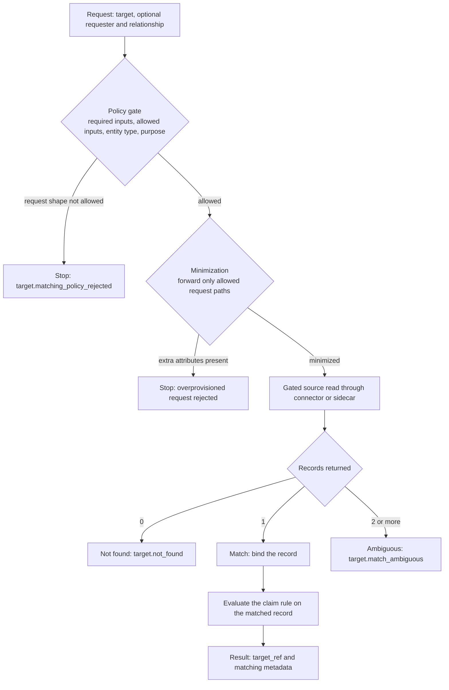

# Identity and record matching

> **Page type:** Concept · **Product:** Registry Notary · **Layer:** consultation, evaluation · **Audience:** integrator, operator · **Status:** current

When a caller asks Registry Notary to evaluate a claim, Notary has to bind the
request context to a source registry record before the claim rule can run. That
binding is matching. This page explains how matching works, what it deliberately
does not do, the outcomes it can return, and how operators shape it with policy.
For where matching sits in the wider request flow, start with the
[architecture overview](architecture-overview.md).

## What matching does, and what it does not

Matching resolves the **target** of an evaluation against the records a
configured source exposes, then locates the specific record the claim reads. It
answers two linked questions: which entity is this request about, and which
source record corresponds to it.

Matching does **not** establish identity. Notary does not prove that a caller is
who they say they are, does not inspect identity documents, and does not run
biometric checks. It trusts the request context it is given and resolves that
context against source records. Establishing and authenticating identity happens
upstream, before the request reaches Notary: see
[authentication](operator-config-reference.md#authentication) and
[self-attestation](self-attestation-operator-guide.md).

Matching also does not make Notary a registry. The source registry stays the
system of record. Notary sends a configured lookup through a source connector or
sidecar, reads only the fields the claim needs, and treats the source response
according to the binding's cardinality rule. Notary does not hold a copy of
registry data and does not implement its own fuzzy-matching engine.

## Boundary

Matching crosses several systems. Keep the responsibility split explicit:

| Owner | Responsibility |
| --- | --- |
| Identity provider | Authenticates a person or service and may provide assured attributes in a token |
| Registry Notary | Checks caller policy, binds request context to source lookups, evaluates claims, applies disclosure, and issues credentials when allowed |
| Source registry | Remains the system of record for the matched fact |
| Source owner | Approves which callers, purposes, lookup fields, and cardinality expectations are acceptable |
| Relying party or wallet | Consumes the result or credential and applies its own trust and business rules |

Do not treat a successful match as proof that the requester is allowed to act for
the target. Matching answers "which source record is relevant?" Authorization
answers "may this caller evaluate this claim for this target and purpose?"
Disclosure answers "what may this caller learn?" Credential policy answers "may
this result be issued?"

## Resolve, find, evaluate

Matching is easiest to read as three steps:

1. **Resolve the request context.** Turn the request's target context
   (identifiers or attributes) into a source query through the binding's lookup
   configuration.
2. **Find the record.** Read the source. The number of records returned decides
   the outcome.
3. **Evaluate.** The claim rule runs on the matched record and produces a result.

These map onto the canonical
[request lifecycle](architecture-overview.md#the-request-lifecycle): steps 1 and 2
are the "Read the source" step, and step 3 is the "Evaluate the claim" step. In the
current implementation, resolution and record location are not two separate calls:
a single gated source read does both, and the cardinality of its result is what
distinguishes a match from a miss or an ambiguity.

*How a matching request flows from the policy gate through one gated source read
to claim evaluation. Record cardinality decides found, match, or ambiguous; the
granular outcome codes and error collapsing are covered below.*

## Request identity model

A request carries a required `target` and, optionally, a `requester` and a
`relationship`. Self-attestation flows derive that context from the verified
token instead of trusting caller-supplied target identity. Each entity can be
matched, and each carries the same shape:

| Field | Purpose |
| --- | --- |
| `type` | Entity type, such as `Person`, `LandParcel`, `Animal`, or `Household` |
| `id` | Optional opaque system id |
| `identifiers` | Scheme and value pairs, such as a national id or a cadastral reference |
| `attributes` | Named values, such as `given_name`, `family_name`, or `birthdate` |
| `assurance` | Optional metadata about how the request attributes were obtained |

Persons are the leading case, but the same machinery resolves non-person entities;
only the entity type and the matched fields differ.

A binding can match on an identifier or on attributes:

- **Identifier match** compares a scheme and value exactly, for example
  `target.identifiers.national_id`. Use it when the request carries a stable,
  unique identifier.
- **Attribute match** compares named values, for example `given_name` plus
  `family_name` plus `birthdate`. Use it when no stable identifier is available.
  Attributes are how you reduce ambiguity when one field is not enough to land on a
  single record.

The request paths a binding may read are `target.id`,
`target.identifiers.<scheme>`, `target.attributes.<name>`, the same three under
`requester`, and `relationship.attributes.<name>`. How a binding turns these into a
source query is covered in
[source bindings](source-claim-modeling-guide.md#source-bindings).

## Source lookup design

Matching is policy-driven and source-side. The source connector or sidecar
performs the comparison; Notary core enforces a policy gate before the read and
minimizes what it forwards.

For OpenFn sidecar sources, the same boundary applies to both single reads and
batch matching. Notary decides which request paths may be used, collapses public
matching errors when configured, audits the decision, and applies disclosure.
The sidecar receives only the minimized source query terms, projected fields,
purpose, correlation metadata, source id, dataset, entity, and sidecar-owned
configuration needed to execute the adaptor workflow. It does not receive the
full target, requester, relationship, assurance, claim config, or disclosure
config.

Two controls run before any source query leaves Notary:

- **The policy gate** checks that the request is shaped the way the binding
  requires: the necessary inputs are present, the supplied inputs are within the
  allowed set, the entity type matches, the purpose is allowed, and any
  relationship or reauthentication rule is satisfied.
- **Minimization** forwards only the request paths the policy allows. A request
  that carries extra attributes beyond the allowed set is rejected rather than
  quietly passed through, so a binding cannot over-collect by accident.

Operators configure both through the `matching` block on a source binding. See
[matching policy](operator-config-reference.md#matching-policy) for the fields.

The source binding is the matching contract. It names:

| Binding choice | Why it matters |
| --- | --- |
| `lookup.input` | Request path Notary reads, such as `target.identifiers.national_id` |
| `lookup.field` | Source-side field the lookup is compared against |
| `lookup.op` | Comparison operation; current lookup examples use exact equality |
| `lookup.cardinality` | Expected number of records for a successful match |
| `query_fields` | Optional multi-field lookup when one identifier is not enough |
| `fields` | Source fields read after the match and exposed to the claim rule |
| `matching` | Policy gate for purpose, relationship, required inputs, allowed inputs, and error collapsing |

Use a stable identifier when the source owner can confirm it is unique and safe
for the purpose. Use multi-field lookup only when the source supports it and the
source owner has confirmed the fields are enough to distinguish one record.

## The outcome model

For bindings that require one source record, the read resolves to exactly one of
these outcomes, decided by how many records the source returns for the target:

| Records returned | Outcome | Problem code |
| --- | --- | --- |
| 0 | Not found | `target.not_found` |
| 1 | Match | success |
| 2 or more | Ambiguous | `target.match_ambiguous` |

Ambiguity is a hard stop. Notary never silently picks one record from several
returned candidates; an ambiguous result is an error, not a best guess. If a
source can emit duplicate rows for the same entity, normalize that behavior at
the source or sidecar boundary before Notary depends on the lookup.

Beyond cardinality, matching can stop for policy or quality reasons:

| Problem code | Meaning |
| --- | --- |
| `target.identifier_missing` | The binding needs an identifier the request did not supply |
| `target.attributes_insufficient` | The supplied attributes do not satisfy the binding's required input set |
| `target.matching_policy_rejected` | The request shape is not allowed by the binding's policy |
| `target.match_low_confidence` | The source reported a match it considers too weak |
| `target.not_in_valid_state` | The matched entity is in a state the source rejects, such as inactive |

The `requester` and `relationship` contexts have parallel outcomes, for example
`requester.match_ambiguous` and `relationship.match_ambiguous`. The full list lives
in the [matching outcomes](api-reference.md#matching-outcomes) reference.

By default, these granular outcomes are not revealed to the caller. The
`collapse_matching_errors` setting defaults to on, which maps every matching error
to the single public code `evidence.not_available` while keeping the granular
reason in the audit trail. This prevents a caller from using error differences as
an oracle to probe who exists in a registry.

## Self-attestation matching

In citizen and wallet flows, self-attestation policy changes where target
identity comes from. A citizen token is validated by OIDC policy, then Notary
derives `requester`, `target`, and `relationship: self` from the configured
subject-binding claim. A caller cannot choose an arbitrary target in the request
body for that flow.

Subject binding is exact by design. Do not rely on case folding, punctuation
removal, or local identifier normalization unless that behavior is implemented
and reviewed for the deployment. Use `allow_sub_as_civil_id: true` only when the
identity-provider owner has confirmed that `sub` is the correct registry
identifier. See the [self-attestation operator guide](self-attestation-operator-guide.md)
for the token policy, allowed operations, and rollout checks.

## What the response tells you

On a match, the result carries a target reference and matching metadata:

- **`target_ref`** has the entity `type`, an opaque `handle`, and the
  `identifier_schemes` that were matched. The handle is a hash, not the source id,
  so the response does not expose the raw source identifier.
- **`matching`** has `policy_id`, `method`, `confidence`, and an optional `score`.

Read `confidence` carefully. It is a policy-asserted value configured on the
source binding and matching method, and it is returned verbatim for successful
matches against that binding. A match on a full national identifier and a match
on name plus birthdate against the same binding report the same `confidence`,
and `score` is usually absent. Treat `confidence` as a policy assertion about
the method, not a measured quality of the individual match. Future measured
match-quality fields can be added alongside it without changing this field's
meaning.

The full result envelope is documented in the
[API reference](api-reference.md) and the
[client SDK guide](client-sdk-guide.md).

## Privacy properties

Matching is designed to disclose as little as possible:

- **Minimization and overprovision rejection** keep a binding from forwarding or
  collecting more than its policy allows.
- **Opaque handles** stop callers from correlating entities across requests by
  source id.
- **Error collapsing** hides matching cardinality and state behind
  `evidence.not_available` by default, with the granular reason kept only in the
  audit trail.
- **Purpose propagation** carries the request purpose through to the source read
  and the audit record, so reads can be reviewed by purpose. See
  [purpose propagation](source-claim-modeling-guide.md#purpose-propagation).
- **Disclosure policy** keeps matching separate from result disclosure. A caller
  may be allowed to learn a predicate or redacted assertion without receiving the
  matched source value.
- **Credential eligibility** is separate from matching. A matched and evaluated
  claim can be issued only when both the claim and the credential profile allow
  that issuance.

## Matching beyond the target

A claim can also match the `requester` and a `relationship` when the decision
depends on who is asking and how they relate to the target, such as a guardian
acting for a dependent. The binding's policy controls which relationship types are
allowed and which request paths each may carry, and the requester and relationship
produce their own outcomes.

The `profile` and `on_behalf_of` fields are accepted by the request model but
are not evaluated. Binding delegation scope to purpose and minimum-assurance
gating for target inputs are not implemented.

## Operator checklist

Before you expose a matching flow, confirm:

- The claim is narrow and names one decision or one extracted value.
- The source owner has approved the lookup field, purpose, caller class, and
  cardinality expectation.
- The request path used by `lookup.input` is supplied by a trusted caller or by
  a reviewed self-attestation token claim.
- The binding uses `sufficient_target_inputs` when one field is not enough.
- The binding uses `allowed_target_inputs` and `allowed_requester_inputs` to
  reject overprovisioned requests.
- No-match, ambiguous-match, and upstream-error behavior are acceptable to the
  relying party.
- `collapse_matching_errors` stays on unless revealing granular outcomes is an
  explicit deployment decision.
- The claim reads the fewest source fields needed by the rule.
- Disclosure defaults to the least revealing useful result.
- Credential issuance is explicitly allowed by both the claim and the credential
  profile, if issuance is needed.

## Integrator checklist

When you call Notary:

- Discover the claim and its allowed formats before sending production traffic.
- Send only the target, requester, and relationship fields the claim expects.
- Use stable, reviewed purpose values.
- Treat `evidence.not_available` as a privacy-preserving public outcome, not as
  proof that the target does or does not exist.
- Treat granular matching codes as policy outcomes, not transport failures.
- Do not log raw identifiers, request bodies, credentials, SD-JWT disclosures,
  Problem Details `detail`, or source values.
- Do not infer identity assurance from a successful match unless your upstream
  token policy, source-owner agreement, and relying-party policy support that
  interpretation.

## References and design influences

This page uses common digital identity and credential vocabulary from public
references. It does not claim conformance to those frameworks unless a separate
Notary conformance statement says so.

| Reference | Design influence |
| --- | --- |
| [NIST SP 800-63A](https://pages.nist.gov/800-63-4/sp800-63a.html) | Distinguishes identity resolution, validation, verification, authoritative sources, and exception handling |
| [NIST SP 800-63C](https://pages.nist.gov/800-63-4/sp800-63c.html) | Frames federation boundaries, relying-party responsibility, and minimization of personal identifiers |
| [GOV.UK GPG45 identity profiles](https://www.gov.uk/government/publications/identity-proofing-and-verification-of-an-individual/identity-profiles) | Treats confidence as the result of a profile of checks, not a single record lookup |
| [World Bank ID4D Practitioner's Guide](https://id4d.worldbank.org/guide) | Covers identifiers, uniqueness, deduplication, and privacy risks of raw identifiers |
| [OpenID Connect for Identity Assurance](https://openid.net/specs/openid-connect-4-identity-assurance-1_0.html) | Keeps verified identity claims distinct from ordinary claims |
| [W3C Verifiable Credentials Data Model 2.0](https://www.w3.org/TR/vc-data-model-2.0/) | Informs selective disclosure, credential claims, and data minimization boundaries |

## Troubleshooting

| Symptom | Cause | Resolution |
| --- | --- | --- |
| `evidence.not_available` on every failure | `collapse_matching_errors` is on (the default) | Inspect the granular `audit_code` in the audit trail; set the binding's `collapse_matching_errors: false` only in a controlled environment |
| `target.match_ambiguous` | The lookup matched more than one record | Add attributes to the lookup so it lands on one record, or tighten the source query |
| `target.attributes_insufficient` | The request did not satisfy any required input group | Supply one full group from the binding's `sufficient_target_inputs`; check for an extra attribute the allow-list rejects |
| `target.matching_policy_rejected` | The request shape is outside the binding's policy | Check entity type, purpose, relationship, and the allowed input paths against the binding |
| `target.not_found` | The source returned no record for the target | Confirm the lookup value and that the record exists in the source |

## Related

- [Architecture overview](architecture-overview.md)
- [Model sources and claims](source-claim-modeling-guide.md)
- [Matching policy](operator-config-reference.md#matching-policy)
- [Matching outcomes](api-reference.md#matching-outcomes)
