# Registry Notary Scenario Patterns

> **Page type:** Concept · **Product:** Registry Notary · **Layer:** consultation, evaluation, credential, federation · **Audience:** integrator

This page collects the reusable interaction patterns and the full set of scenario
stories, each with its sequence or flow diagram and what is supported today. The
status-labeled scenario matrix lives in `notary-capability-matrix.md`; the
per-scenario gap bullets and the rollup live in `../specs/notary-capability-gaps.md`.

## Reusable Patterns

### Local Evaluation

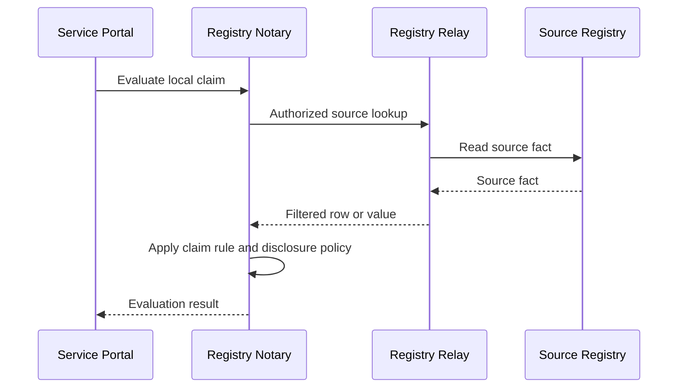

### Delegated Evaluation

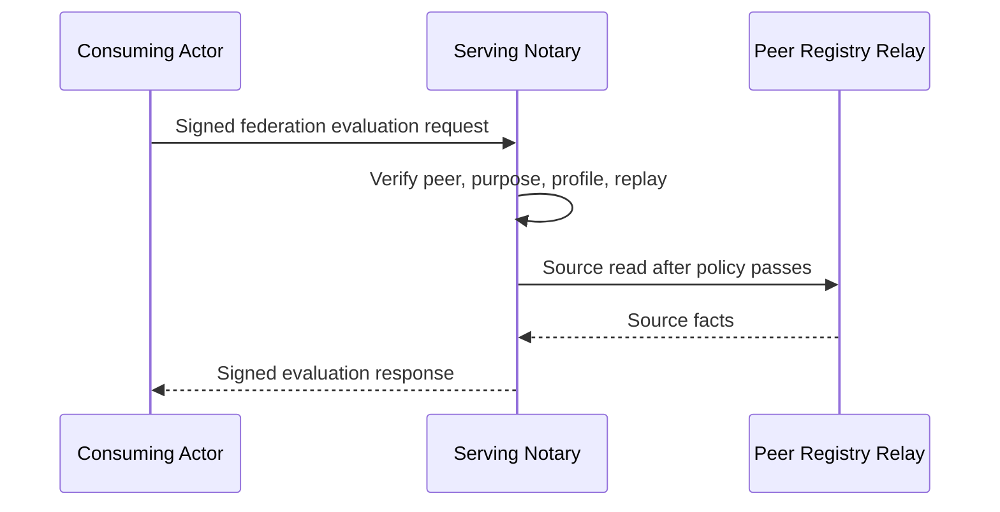

### Outbound Composition

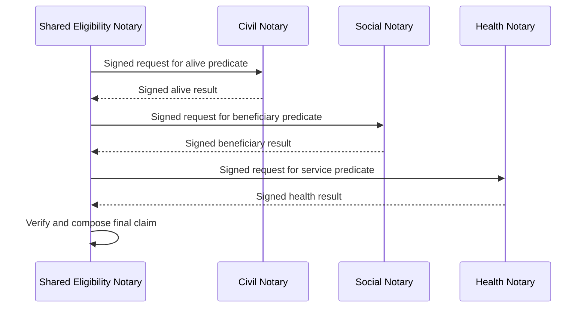

### User-Presented Proof

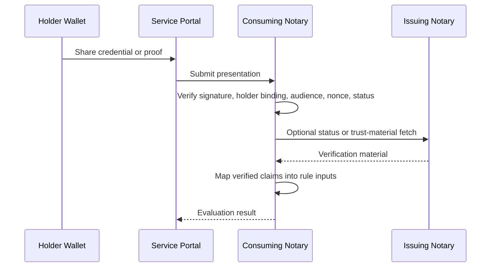

### Credential Issuance

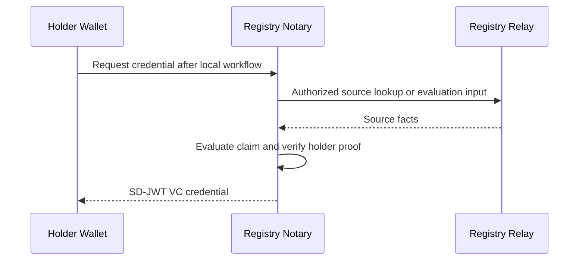

## Scenarios

### 1. Civil Alive Predicate

Pattern: Local evaluation  
Status: Supported  
Priority: High

Story: Bob is reviewing Alice's application and only needs to know whether the
civil registry still records her as alive. The Civil Notary checks the source
through the Civil Relay and returns a signed predicate, so Bob gets the answer
without receiving Alice's full civil record.

Personas: case worker, registry steward, auditor  
Systems: service portal, civil Notary, civil Relay, civil registry, audit store

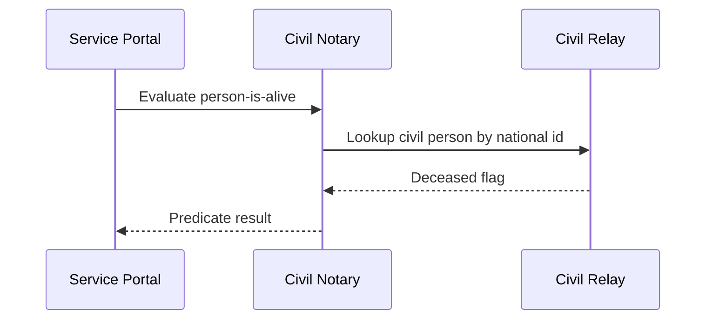

Supported today:

- Claim configuration with Registry Data API or DCI source connectors.
- Predicate disclosure.
- Redacted audit event.

### 2. Age Or Date-Of-Birth Evidence

Pattern: Local evaluation  
Status: Supported  
Priority: High

Story: Alice needs to prove that she meets an age requirement, but she should
not have to expose more civil data than necessary. Bob asks the Civil Notary
for a date-of-birth value or an age predicate, and the Notary applies the
configured disclosure policy before returning the result.

Personas: citizen, case worker, registry steward  
Systems: service portal, civil Notary, civil Relay, civil registry

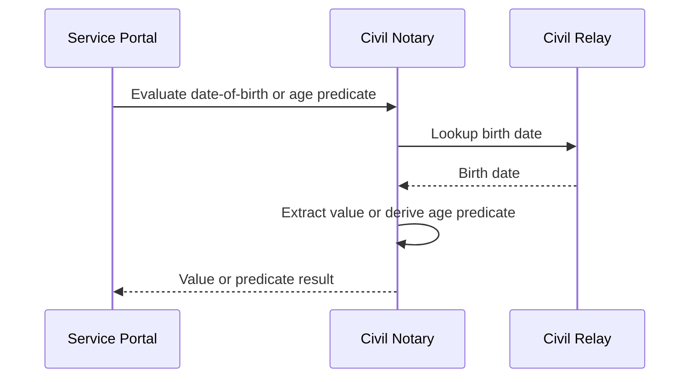

Supported today:

- Value and predicate disclosure modes.
- SD-JWT VC issuance for configured credential profiles.

### 3. Program Enrollment Active

Pattern: Local evaluation  
Status: Supported  
Priority: High

Story: Bob wants to confirm that Alice is actively enrolled in a social
program before approving a linked benefit. The Social Protection Notary checks
the program enrollment record and returns only the active-beneficiary evidence
that the workflow needs.

Personas: case worker, program administrator, registry steward  
Systems: social protection Notary, social protection Relay, source registry

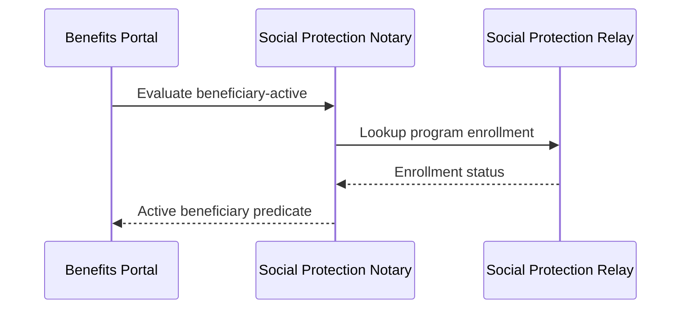

Supported today:

- Local claim dependencies and CEL rules.
- Predicate or value result formats.

### 4. Health Facility Service Available

Pattern: Local evaluation  
Status: Supported  
Priority: Medium

Story: Bob is processing a service request that depends on whether a nearby
facility is licensed and ready to provide care. The Health Notary evaluates
the facility facts behind the Health Relay and gives Bob a service-availability
predicate instead of raw facility rows.

Personas: case worker, program administrator, registry steward  
Systems: health Notary, health Relay, health facility registry

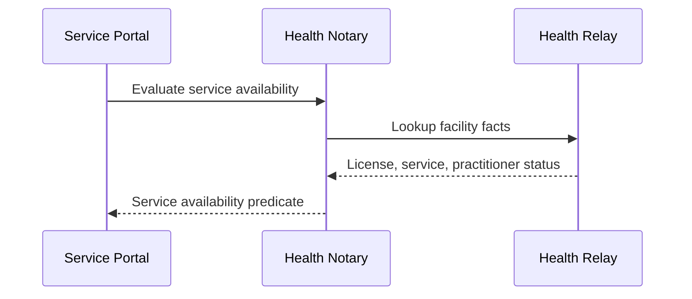

Supported today:

- Multi-field source bindings.
- CEL rules over filtered source facts.

### 5. Agriculture Voucher Eligibility

Pattern: Local evaluation  
Status: Supported  
Priority: High

Story: Alice is a farmer applying for a climate-smart input voucher. The
Agriculture Notary checks the farmer, parcel, and redemption facts needed for
Erin's program rules, then returns an eligibility result and reason without
handing the portal all of Alice's registry records.

Personas: farmer, case worker, agriculture program administrator  
Systems: agriculture Notary, agriculture Relay, farmer and parcel registries

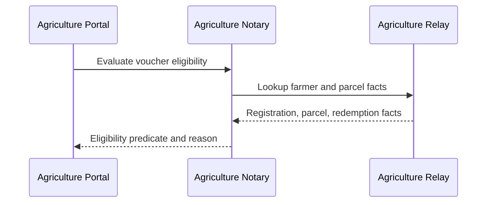

Supported today:

- Demo configuration can evaluate voucher eligibility.
- Reason-code style companion claims can explain denials.
- Local SD-JWT VC issuance can represent successful eligibility.

### 6. Livestock Movement Permit Eligibility

Pattern: Local evaluation  
Status: Supported  
Priority: Medium

Story: Alice needs permission to move livestock between districts. The
Agriculture Notary evaluates herd, vaccination, and quarantine facts and gives
Bob a permit predicate plus a reason code when the movement should be denied.

Personas: farmer, case worker, veterinary registry steward  
Systems: agriculture Notary, agriculture Relay, livestock registry

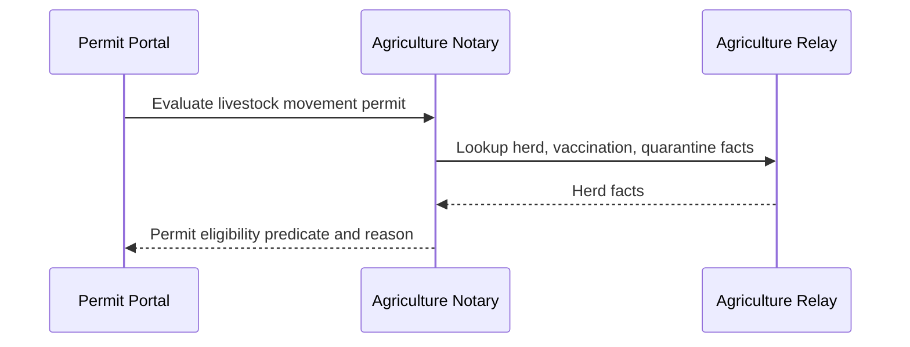

Supported today:

- Local multi-claim evaluation.
- Predicate results and reason-code claims.

### 7. Benefits Agency Asks Civil Notary For Alive Predicate

Pattern: Delegated evaluation  
Status: Partial  
Priority: High

Story: Bob works for the benefits agency, while Carol's civil registry owns the
source facts. Instead of giving Bob direct read access to the civil registry,
the benefits actor sends a signed request to Carol's Civil Notary and receives
a signed alive predicate back.

Personas: case worker, registry steward, auditor  
Systems: benefits portal or peer Notary, civil Notary, civil Relay

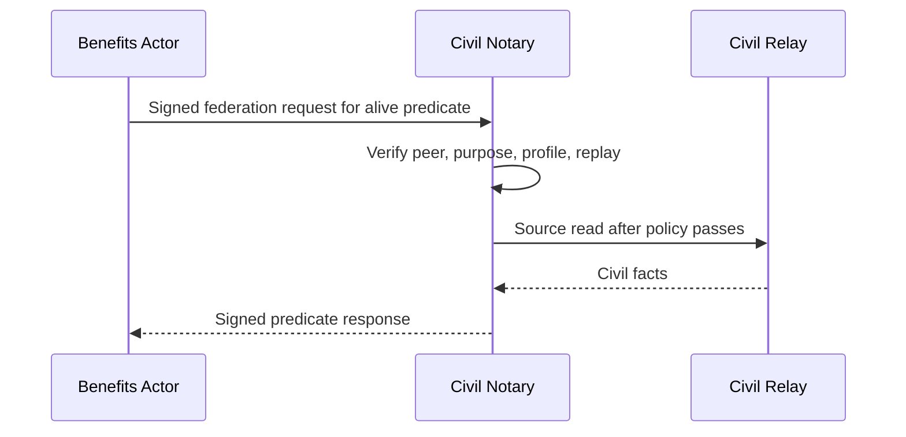

Supported today:

- Inbound `POST /federation/v1/evaluations`.
- Static peer policy, request verification, replay rejection, signed response.

### 8. Benefits Agency Asks Social Notary For Active Beneficiary

Pattern: Delegated evaluation  
Status: Partial  
Priority: High

Story: Bob needs to know whether Alice is an active beneficiary in another
agency's program. The benefits actor asks the Social Protection Notary for a
signed active-beneficiary predicate under a specific purpose, keeping the
social registry steward in control of the source data.

Personas: case worker, program administrator, auditor  
Systems: benefits portal or peer Notary, social protection Notary, social Relay

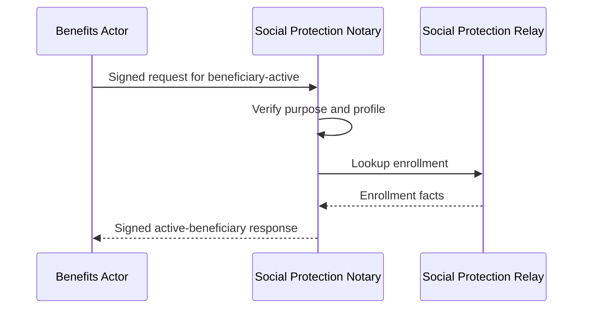

Supported today:

- Serving Notary side of delegated evaluation.
- Purpose and profile policy checks.

### 9. Health-Linked Child Support Across Three Authorities

Pattern: Outbound composition  
Status: Planned  
Priority: High

Story: Alice applies for health-linked child support, and no single agency owns
all the facts. A Shared Eligibility Notary would ask Civil, Social, and Health
Notaries for signed predicates, verify them, and compose one final eligibility
claim for Bob to review.

Personas: citizen, case worker, registry stewards, auditor  
Systems: shared eligibility Notary, civil Notary, social Notary, health Notary

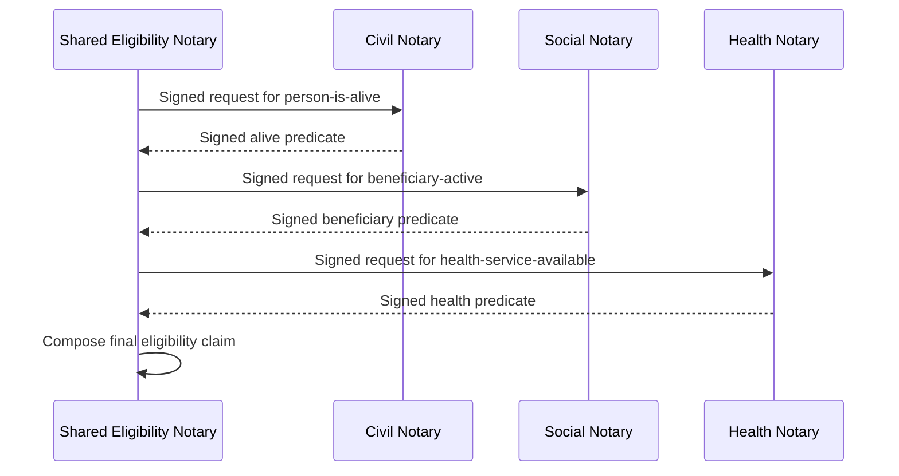

Supported today:

- Each domain claim can be evaluated locally.
- Inbound delegated evaluation exists.

### 10. Municipality Verifies Residency With A National Steward

Pattern: Delegated evaluation  
Status: Partial  
Priority: Medium

Story: Bob works at a municipality and needs to confirm Alice's residency
without receiving a national population record. The municipal service asks the
national Notary for a residency predicate, and Carol's national registry keeps
control of what can be answered and audited.

Personas: citizen, municipal case worker, national registry steward  
Systems: municipal portal, national civil or population Notary

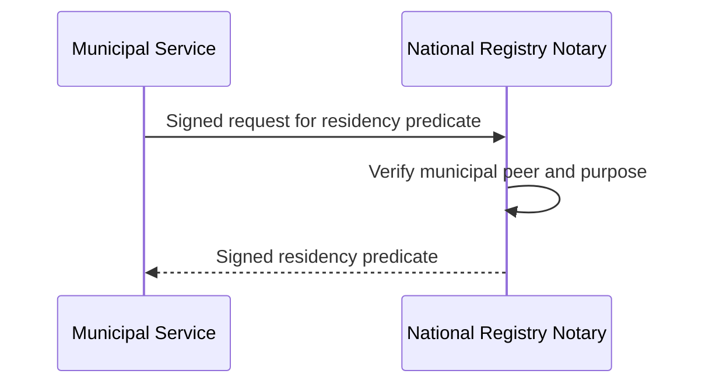

Supported today:

- Inbound serving pattern is supported.
- Static peer policy can restrict profile and purpose.

### 11. Citizen Presents Civil-Status Proof To Benefits Service

Pattern: User-presented proof  
Status: Planned  
Priority: High

Story: Alice already has a civil-status credential in her wallet and wants to
share it with a benefits service. Bob's Benefits Notary verifies the
presentation, holder binding, audience, freshness, and status policy before
using the disclosed claims as evidence.

Personas: citizen, case worker, registry steward  
Systems: holder wallet, benefits portal, benefits Notary, civil Notary

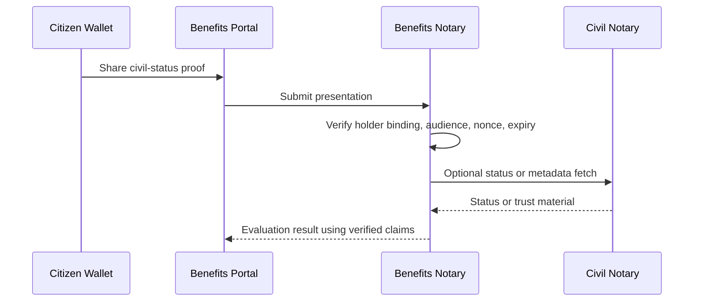

Supported today:

- SD-JWT VC issuance primitives exist.

### 12. Farmer Presents Landholding Or Registration Proof

Pattern: User-presented proof  
Status: Planned  
Priority: Medium

Story: Alice has a farmer-registration or landholding credential from a
trusted authority. Rather than asking a service portal to read the underlying
farm registry, Alice presents the proof and the Agriculture Notary maps the
verified claims into the voucher eligibility workflow.

Personas: farmer, agriculture case worker, registry steward  
Systems: farmer wallet, agriculture portal, agriculture Notary

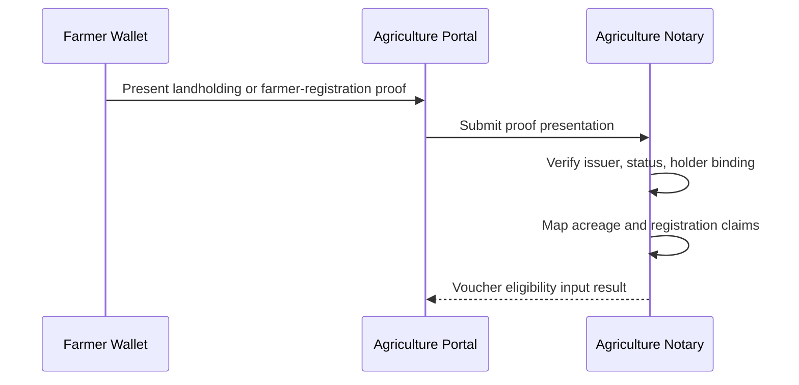

Supported today:

- Local agriculture eligibility can be evaluated against Relay sources.

### 13. Health Worker Presents Professional Credential

Pattern: User-presented proof  
Status: Planned  
Priority: Medium

Story: Alice is a health worker whose professional status affects whether a
facility can satisfy a service rule. She presents her professional credential,
and the consuming Notary verifies issuer trust and holder binding before using
that status in the local decision.

Personas: health worker, program administrator, auditor  
Systems: holder wallet, service portal, benefits or health Notary

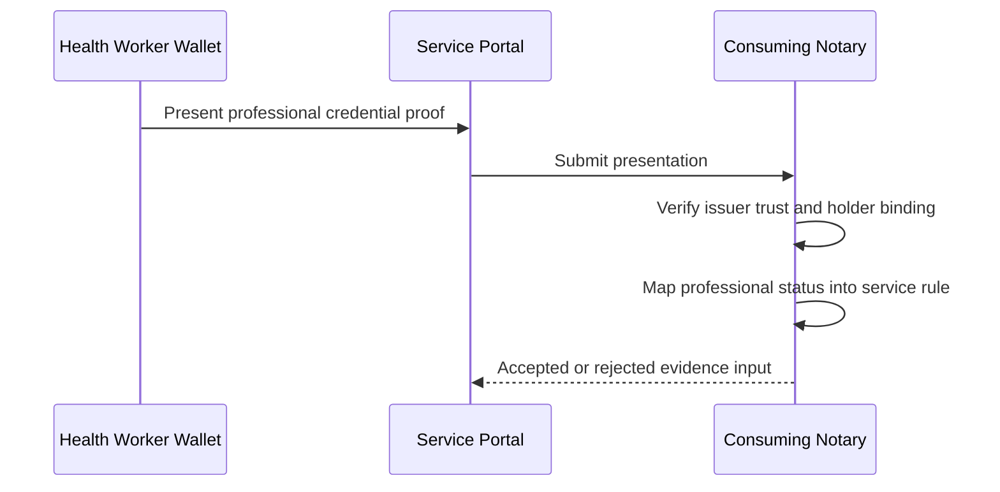

Supported today:

- Credential issuance and verification primitives exist in platform-adjacent
  crates.

### 14. Parent Or Guardian Requests A Service For A Child Or Dependent

Pattern: Representation plus proof  
Status: Planned  
Priority: High

Story: Alice is applying for a child benefit on behalf of Charlie. Bob needs
evidence about Charlie, but Alice is the person interacting with the portal, so
the Benefits Notary must verify both Charlie's eligibility evidence and
Alice's authority to act for Charlie.

Personas: citizen or resident, case worker, registry steward, auditor  
Systems: holder wallet, service portal, benefits Notary, civil Notary, social Notary

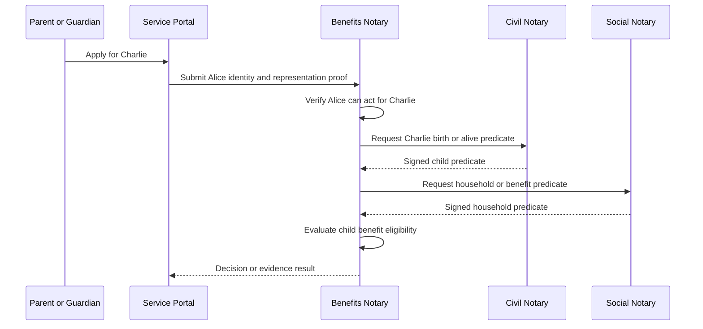

Supported today:

- Local and delegated claim evaluation can represent some child-related facts.
- User-presented proof is planned as the mechanism for representation evidence.

### 15. Household Or Group Representative Requests A Service

Pattern: Representation plus proof  
Status: Planned  
Priority: High

Story: Alice is the registered representative for the Rivera household, a farm
group, or a cooperative. Bob needs to evaluate a service for that collective
subject, so the Notary must verify Alice's authority to act for the household
or group before it evaluates household, member, parcel, or program facts.

Personas: citizen or resident, case worker, program administrator, auditor  
Systems: holder wallet, service portal, benefits Notary, social Notary, agriculture Notary

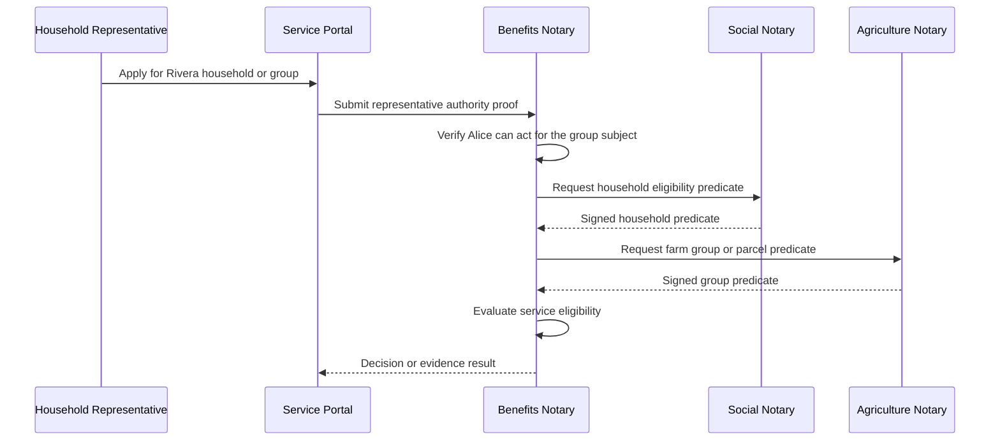

Supported today:

- Local claim evaluation can target non-person entities when configured.
- Delegated evaluation can request predicates about configured subject types.

### 16. Civil Notary Issues Date-Of-Birth Or Alive Credential

Pattern: Credential issuance  
Status: Supported  
Priority: High

Story: Alice wants a reusable civil credential so she does not need a fresh
registry lookup for every service. The Civil Notary evaluates the configured
claim, verifies Alice's holder proof, and issues a holder-bound SD-JWT VC.

Personas: citizen, registry steward, wallet operator  
Systems: holder wallet, civil Notary, civil Relay

```mermaid
sequenceDiagram
  participant Wallet as Holder Wallet
  participant Notary as Civil Notary
  participant Relay as Civil Relay

  Wallet->>Notary: Request credential with holder proof
  Notary->>Relay: Evaluate configured civil claims
  Relay-->>Notary: Civil facts
  Notary->>Notary: Bind credential to holder DID
  Notary-->>Wallet: SD-JWT VC
```

Supported today:

- Local SD-JWT VC issuance for configured credential profiles.
- Holder binding with `did:jwk`.

### 17. Agriculture Notary Issues Voucher Eligibility Credential

Pattern: Credential issuance  
Status: Supported  
Priority: High

Story: Alice qualifies for an agriculture voucher and wants portable proof of
that result. After the Agriculture Notary evaluates the voucher rules, it can
issue a holder-bound credential that Alice can present to a payment or voucher
system.

Personas: farmer, program administrator, wallet operator  
Systems: holder wallet, agriculture Notary, agriculture Relay

```mermaid
sequenceDiagram
  participant Wallet as Farmer Wallet
  participant Notary as Agriculture Notary
  participant Relay as Agriculture Relay

  Wallet->>Notary: Request voucher eligibility credential
  Notary->>Relay: Evaluate voucher eligibility
  Relay-->>Notary: Farmer and parcel facts
  Notary-->>Wallet: Holder-bound SD-JWT VC
```

Supported today:

- Lab agriculture flow can produce a demo credential after successful evaluation.
- Runtime credential profiles support SD-JWT VC issuance.

### 18. Shared Eligibility Notary Issues Combined-Support Credential

Pattern: Credential issuance plus composition  
Status: Partial  
Priority: High

Story: Alice's combined-support eligibility depends on facts held by multiple
authorities. The future Shared Eligibility Notary would verify peer-signed
predicates, compose a final claim, and issue Alice a credential that points
back to the remote evidence decisions without exposing raw source data.

Personas: citizen, case worker, auditor  
Systems: shared eligibility Notary, peer Notaries, holder wallet

```mermaid
sequenceDiagram
  participant Shared as Shared Eligibility Notary
  participant Civil as Civil Notary
  participant Social as Social Notary
  participant Wallet as Holder Wallet

  Shared->>Civil: Request signed civil predicate
  Civil-->>Shared: Signed civil result
  Shared->>Social: Request signed social predicate
  Social-->>Shared: Signed social result
  Shared->>Shared: Compose combined-support claim
  Shared-->>Wallet: Combined-support credential
```

Supported today:

- Local credential issuance exists.
- Local composed claims can depend on local claim results.

### 19. Service Helps Holder Obtain Credential From Remote Notary

Pattern: Federated credential issuance  
Status: Planned  
Priority: Medium

Story: Alice needs a credential from Carol's issuing Notary while starting
from Bob's service journey. Bob can help Alice discover the issuer or relay
bytes transparently, but Carol's Notary must still own the nonce, audience,
holder-proof verification, and issued credential.

Personas: citizen, wallet operator, registry steward  
Systems: holder wallet, consuming Notary, issuing Notary

```mermaid
sequenceDiagram
  participant Wallet as Holder Wallet
  participant Consumer as Consuming Notary
  participant Issuer as Issuing Notary

  Consumer->>Issuer: Discover credential profile
  Consumer-->>Wallet: Return issuer offer
  Wallet->>Issuer: Present holder proof to issuer
  Issuer->>Issuer: Verify nonce, audience, holder key
  Issuer-->>Wallet: Credential response
```

Supported today:

- Local issuance exists.
- Broader spec defines discovery/handoff and transparent byte relay constraints.

### 20. Replay And Emergency Peer Or Key Denial

Pattern: Governance  
Status: Supported  
Priority: High

Story: Dave sees suspicious activity from a peer key and needs the serving
Notary to fail closed immediately. Replay protection blocks reused requests,
and the emergency denylist lets the operator reject a compromised node or key
while the incident is investigated.

Personas: registry steward, auditor, security operator  
Systems: serving Notary, peer Notary, audit store

```mermaid
flowchart TD
  Request["Signed federation request"]
  Replay["Replay store"]
  Denylist["Emergency node/kid denylist"]
  Policy["Peer policy"]
  Result["Allow or deny"]
  Audit["Audit event"]

  Request --> Replay
  Request --> Denylist
  Replay --> Policy
  Denylist --> Policy
  Policy --> Result
  Result --> Audit
```

Supported today:

- Static peer policy.
- Replay protection for request ids.
- Emergency denylist configuration for peers and keys.

### 21. Auditor Verifies Minimized Decision Evidence

Pattern: Governance  
Status: Partial  
Priority: High

Story: Dave reviews Alice's benefit decision months later and wants confidence
that Bob used minimized evidence. The signed predicate result and redacted
audit event show which profile and purpose were used without disclosing raw
registry rows.

Personas: auditor, registry steward, program administrator  
Systems: service portal, Notary, audit store

```mermaid
flowchart TD
  Decision["Service decision"]
  Predicate["Signed predicate result"]
  Audit["Redacted audit event"]
  Policy["Profile and purpose policy"]
  Report["Audit report"]

  Decision --> Predicate
  Predicate --> Audit
  Policy --> Audit
  Audit --> Report
```

Supported today:

- Signed evaluation responses for federation.
- Redacted local audit events.
- Predicate disclosure avoids raw source rows by default.

### 22. Peer Audit Checkpoint Monitoring

Pattern: Governance  
Status: Planned  
Priority: Medium

Story: Dave monitors whether Carol's Notary audit trail is continuous over
time. Signed checkpoints let Dave detect root or sequence regressions without
asking Carol to share every underlying audit event.

Personas: auditor, security operator, registry steward  
Systems: publishing Notary, monitoring Notary, audit store

```mermaid
sequenceDiagram
  participant Publisher as Publishing Notary
  participant Monitor as Monitoring Notary
  participant Audit as Audit Store

  Publisher->>Audit: Append local audit events
  Publisher->>Publisher: Build Merkle checkpoint
  Monitor->>Publisher: Fetch latest checkpoint
  Publisher-->>Monitor: Signed checkpoint
  Monitor->>Monitor: Detect root or sequence regression
```

Supported today:

- Audit fields and spec direction exist.
