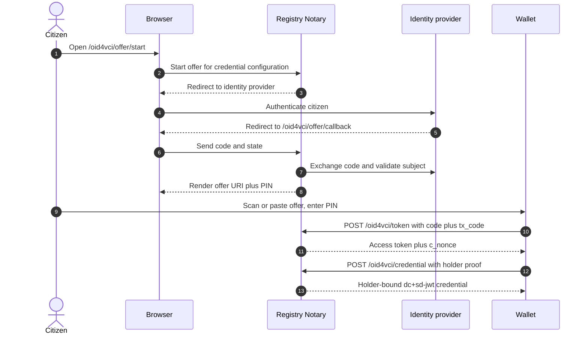

# OID4VCI Wallet Interop Guide

> **Page type:** How-to · **Product:** Registry Notary · **Layer:** credential · **Audience:** operator, integrator

This guide describes the implemented OpenID4VCI wallet facade for Registry
Notary adopters. It focuses on what wallet and platform teams need to configure
and test. It does not try to freeze the broader REST API design.

## Use Case

Use the OID4VCI facade when a citizen wallet should request a Registry Notary
SD-JWT VC directly. The wallet holds an access token from an authorization
server, proves control of a holder key, and receives a short-lived credential
for a configured claim.

The facade is intentionally narrow:

- Credential format is `dc+sd-jwt`.
- Issued VC media type is `application/dc+sd-jwt`.
- Proof type is JWT.
- Supported proof algorithm is `EdDSA`.
- Supported holder binding method is `did:jwk`.
- Issuance is backed by self-attestation policy and configured evidence claims.

It is not a full OpenID4VCI issuer product. It is an interoperability facade for
Registry Notary's current SD-JWT VC issuance path.

## Prerequisites

The wallet facade requires server-side OID4VCI and self-attestation
configuration before any wallet can request a credential. Self-attestation is
the policy gate that prevents a wallet from using any valid token to request
another person's credential. The operator who runs Notary owns these settings;
this guide assumes they are already in place.

For the full configuration, including the `auth.oidc`, `self_attestation`, and
`oid4vci` blocks and their constraints, see the
[operator configuration reference](operator-config-reference.md). For the policy
gate that binds a request to the token subject, see the
[self-attestation operator guide](self-attestation-operator-guide.md).

## Integration Quick Check

For a public holder wallet, the normal human-facing entry point is:

```text
GET /oid4vci/offer/start?credential_configuration_id=<id>
```

Open that URL in the citizen browser, complete the configured identity-provider
login, then use the rendered offer page:

- scan or paste the `openid-credential-offer://` URI into the wallet;
- enter the displayed numeric PIN when the wallet asks for the `tx_code`;
- let the wallet redeem the offer at the Notary `token_endpoint`;
- confirm the wallet stores a `dc+sd-jwt` credential.

A successful wallet run should leave these externally visible facts:

- issuer metadata is reachable at `/.well-known/openid-credential-issuer`;
- the configured Type Metadata is reachable at
  `/.well-known/vct/{vct_path}` without authentication;
- issuer metadata advertises `token_endpoint` only when the authenticated
  pre-authorized-code flow is enabled;
- the offer contains the
  `urn:ietf:params:oauth:grant-type:pre-authorized_code` grant and a `tx_code`
  object;
- the issued SD-JWT VC payload has `vct` equal to the requested configuration,
  `iss` equal to the Notary issuer DID, and holder binding in `cnf.jwk` /
  `cnf.kid` for the wallet's `did:jwk`;
- the only selectively disclosable claim disclosures are represented through
  `_sd` and `_sd_alg: "sha-256"` in the payload.



## Wallet Flow

The current wallet-facing flow is:

1. Wallet discovers issuer metadata.
2. Wallet obtains or receives a credential offer for a configured credential.
3. Wallet obtains an OIDC access token from the configured authorization server.
4. Wallet requests a nonce when nonce support is enabled.
5. Wallet sends a credential request with `format: "dc+sd-jwt"` and a JWT proof.
6. Notary validates the access token, subject binding, self-attestation policy,
   nonce and proof, then reads the source and issues the SD-JWT VC.

The credential request should not carry a raw subject id as a free-form wallet
choice. The subject comes from the OIDC token claim configured in
`self_attestation.subject_binding` and must match the Notary request context.

## Authenticated Pre-Authorized-Code Flow

A public holder wallet (for example walt.id `wallet-api`) is a PKCE client and
cannot authenticate to a confidential authorization server such as eSignet. For
those wallets the Notary additionally supports an authenticated
pre-authorized-code flow. The citizen still authenticates at eSignet; the wallet
never authenticates to eSignet and only ever talks to the Notary.

This flow is disabled by default. When `oid4vci.pre_authorized_code.enabled` is
false (or unset), the three endpoints below return `404`, issuer metadata
advertises no `token_endpoint`, and credential offers stay
`authorization_code`. The confidential-client `authorization_code` path above is
unchanged regardless of this setting.

When enabled, the flow is:

1. The citizen browser opens `GET /oid4vci/offer/start`, optionally with
   `?credential_configuration_id=<id>`. This endpoint is public and
   unauthenticated. It begins the eSignet authorization-code login as the
   configured confidential RP (PKCE S256), stores short-lived state, and
   `302`-redirects the browser to eSignet. It mints no `pre-authorized_code` and
   no credential material.
2. The citizen authenticates at eSignet. eSignet redirects back to
   `GET /oid4vci/offer/callback?code=...&state=...` (public, unauthenticated).
   The Notary exchanges the code with eSignet using `private_key_jwt`, validates
   the returned `id_token`, captures the exact `self_attestation.subject_binding`
   claim value (the civil id), and only then mints one single-use
   `pre-authorized_code`. By default it also mints one numeric `tx_code` (a PIN).
   It renders an HTML offer page carrying the `openid-credential-offer://` URI
   (the QR payload) and, when enabled, the PIN shown out-of-band from the QR.
3. The wallet reads the offer. Its `grants` carry
   `urn:ietf:params:oauth:grant-type:pre-authorized_code` with the
   `pre-authorized_code`. When the offer includes a `tx_code` object, the citizen
   enters the PIN.
4. The wallet redeems the offer at `POST /oid4vci/token` (public,
   unauthenticated). A `tx_code` is required when the offer includes a `tx_code`
   object; the token endpoint rejects a missing or wrong PIN in that mode. The
   request is form-encoded or JSON:

   ```sh
   curl -fsS -X POST https://notary.example.gov/oid4vci/token \
     -H 'content-type: application/x-www-form-urlencoded' \
     --data-urlencode 'grant_type=urn:ietf:params:oauth:grant-type:pre-authorized_code' \
     --data-urlencode "pre-authorized_code=$CODE" \
     --data-urlencode "tx_code=$PIN"
   ```

   The response carries a short-TTL Notary-signed `access_token`, `token_type`,
   `expires_in`, and a `c_nonce`.
5. The wallet calls `POST /oid4vci/credential` with the Notary-issued
   `access_token` and a `did:jwk` holder proof, exactly as in the flow above. The
   issued SD-JWT VC is bound to the eSignet-authenticated subject (the civil id
   determines whose claim is evaluated) and to the holder's `did:jwk` key.

The browser callback URL itself is not the wallet input. The callback renders an
HTML offer page after identity-provider authentication succeeds; the wallet
receives the `openid-credential-offer://` URI from that page and the citizen
enters the displayed PIN separately.

The `pre-authorized_code` is single-use and short-lived: a second redemption
fails, and the code expires after `pre_authorized_code_ttl_seconds`. When
`tx_code.required` is true (the default), repeated wrong-PIN attempts on one code
hit `self_attestation.rate_limits.tx_code_attempts_per_code_per_minute` and lock
the code. A flood of random codes from one client address is throttled by the
existing per-address invalid-attempt limiter.

Operators may set `oid4vci.pre_authorized_code.tx_code.required: false` for
wallets that cannot present a transaction code. Registry Notary reports this as
`bearer_offer` mode in the admin posture document. In this mode, the
pre-authorized code is bearer credential material until it is redeemed, so
validation requires `pre_authorized_code_ttl_seconds <= 300`. Use it only for
controlled demos or compatibility deployments where the wallet cannot send a
`tx_code`.

This bearer-offer window is separate from the issued VC lifetime. Wallet-held
credentials use the requested credential profile's `validity_seconds`, so demo
profiles can issue credentials valid for days while keeping offer codes and
Notary access tokens short-lived.

The Notary mints its access token with a dedicated signing key separate from the
SD-JWT VC credential key, with its own issuer, audience, and a distinct header
`typ`. It is verified by a second, separately-keyed trust anchor; the existing
eSignet single-issuer path is unchanged, so an eSignet token and a Notary token
each pass only their own verifier.

During governed key rotation, keep the outgoing access-token key as
`publish_only` and list it in `auth.access_token_signing.verification_key_ids`
until existing Notary access tokens and pre-authorized codes have expired. The
active `signing_key_id` signs new codes and access tokens; `verification_key_ids`
only accepts older public keys for verification.

## Metadata And Offers

Issuer metadata is derived from `oid4vci` and the configured credential
configurations. Wallets should verify that metadata advertises:

- `credential_issuer` equal to the public issuer URL.
- Authorization servers matching the wallet's token issuer.
- Credential endpoint matching the configured HTTPS endpoint.
- Credential configurations for the expected credential ids.
- `format: dc+sd-jwt`.
- `proof_signing_alg_values_supported: [EdDSA]`.
- `cryptographic_binding_methods_supported: [did:jwk]`.
- `vct` equal to a public HTTPS URL served by the Notary.
- `token_endpoint` equal to the Notary's `/oid4vci/token` endpoint, present only
  when the authenticated pre-authorized-code flow is enabled. Its presence is the
  metadata signal that the Notary is its own authorization server for the
  pre-authorized-code grant; the grant itself is advertised per-offer in the
  credential offer's `grants`. When the flow is disabled there is no
  `token_endpoint`.

For SD-JWT VC wallet interoperability, the Notary serves public Type Metadata for
each configured `vct`. Per the SD-JWT VC Type Metadata convention, a consumer
dereferences an HTTPS `vct` by inserting `/.well-known/vct` between the host and
the path: for `vct = https://{host}/credentials/citizen-civil-status/v1` it
fetches `https://{host}/.well-known/vct/credentials/citizen-civil-status/v1`.
walt.id (wallet-api `0.20.2`) does exactly this during offer setup and aborts the
flow if it does not get a `200`. The Notary serves the metadata at that
well-known location, `GET /.well-known/vct/{vct_path}`, and a wallet can fetch it
without authentication. The route uses a trailing-wildcard capture, so nested
configured paths such as `/.well-known/vct/credentials/dhis2/health-status/v1`
resolve. The bare `GET /credentials/{vct_path}` route is also served for
spec-compliant consumers that dereference the `vct` directly, but it is not the
path walt fetches. The response is `application/json`, returns `404` when OID4VCI
is disabled or no configured `vct` matches, and includes:

- `vct`: the configured `vct` identifier (`https://{host}/{vct_path}`), not the
  requested well-known URL.
- `name` and `display[].locale`/`display[].name`.
- `claims[].path` using the configured OID4VCI `claim_id`.
- `claims[].display[].locale`/`claims[].display[].label`.
- `claims[].sd: "always"`, because Notary emits evaluated claim results as
  selectively disclosable SD-JWT disclosures.

Browser-based wallets from configured self-attestation wallet origins receive
CORS headers on the `/.well-known/vct/...` metadata surface (the response echoes
the request `Origin` in `access-control-allow-origin`, and `OPTIONS` preflights
for an allowed method return `204` with `access-control-allow-origin` and
`access-control-allow-methods`).

Credential offers are intentionally lightweight. They tell the wallet which
credential configuration to request and which issuer metadata to use. If more
than one credential configuration is enabled, wallet tests should explicitly
select the intended configuration.

## Nonce Policy

Enable nonce support for real wallet interop:

```yaml
oid4vci:
  nonce:
    enabled: true
    ttl_seconds: 300
  nonce_endpoint: https://notary.example.gov/oid4vci/nonce
```

Nonce TTL must be between 1 and 600 seconds. When nonce is enabled,
`nonce_endpoint` is required.

For multiple credential configurations, the nonce request should identify the
credential configuration. That keeps a nonce from being reused across a
different credential configuration.

Use Redis replay storage for nonce-backed wallet traffic when more than one
process can receive requests.

## Credential Request

The wallet credential request uses:

```json
{
  "format": "dc+sd-jwt",
  "credential_configuration_id": "birth_record_sd_jwt",
  "proof": {
    "proof_type": "jwt",
    "jwt": "<holder-proof-jwt>"
  }
}
```

The proof JWT should demonstrate holder control of a `did:jwk` key and be fresh
within `oid4vci.proof.max_age_seconds`, allowing only
`max_clock_skew_seconds` of clock difference.

Notary rejects unsupported formats, unsupported proof algorithms, stale proofs,
replayed nonces, subject-binding mismatches, claims outside the allow-list, and
credential profiles outside the allow-list.

## Credential Response

Successful responses contain the issued SD-JWT VC:

```json
{
  "format": "dc+sd-jwt",
  "credential": "<sd-jwt-vc>",
  "c_nonce": "<optional-next-nonce>",
  "c_nonce_expires_in": 300
}
```

Wallets should store the credential as SD-JWT VC and verify:

- Issuer key resolves from Notary JWKS.
- `vct` matches the requested credential configuration.
- Holder binding is the wallet's `did:jwk`.
- Expiry is short and within deployment policy.
- Optional status URL is handled according to verifier policy.

The response does not need to echo every request field. Wallet tests should
assert the credential content, not just the response envelope.

## Compatibility Checklist

For each wallet product or SDK:

- Can it parse issuer metadata with `dc+sd-jwt` credential configurations?
- Can it request or accept a credential offer for a specific configuration id?
- Can it obtain an access token with the configured audience and scopes?
- Does the access token carry the subject-binding claim Notary expects?
- For public wallets, can it redeem `pre-authorized_code` offers with a numeric
  `tx_code` at the Notary `token_endpoint`?
- Can it generate a JWT proof using EdDSA and a `did:jwk` holder key?
- Does it include and refresh nonces according to issuer responses?
- Does it accept short-lived credentials?
- Does it preserve SD-JWT disclosures without logging them?
- Can it display status-free credentials and status-bearing credentials?
- Does it fail clearly on `invalid_token`, proof failure, nonce replay, and
  subject mismatch?

Record the wallet name, version, supported draft/profile behavior, and any
configuration overrides in your deployment notes.

## Security And Privacy Notes

- Notary validates token and policy before source reads.
- Subject binding is exact; do not use normalization that could join different
  civil identifiers.
- A holder DID can become a correlation handle if reused widely. Wallets should
  follow their privacy model for pairwise or purpose-specific keys.

For wallet-origin restrictions, secret handling, rate-limit layering, and
logging boundaries, see the
[deployment hardening runbook](deployment-hardening-runbook.md).

## Troubleshooting

| Symptom | Likely cause | Check |
| --- | --- | --- |
| Metadata route is unavailable | `oid4vci.enabled` is false or self-attestation is disabled | Expanded config and startup logs |
| Config fails validation | OID4VCI references a claim or credential profile outside self-attestation allow-lists | `credential_configurations`, `self_attestation.allowed_claims`, `self_attestation.credential_profiles` |
| Wallet token rejected | Audience, issuer, client id, scope, or algorithm mismatch | `auth.oidc`, `oid4vci.accepted_token_audiences`, wallet token header and claims |
| Wallet never asks for PIN | Offer is still `authorization_code`, pre-authorized-code flow is disabled, or wallet ignored the grant | Issuer metadata `token_endpoint`, offer `grants`, `oid4vci.pre_authorized_code.enabled` |
| PIN is rejected | Wrong `tx_code`, expired code, reused code, or rate-limit lockout | Offer age, token endpoint response, `tx_code_attempts_per_code_per_minute` |
| Wallet aborts before login or PIN | Wallet cannot resolve SD-JWT VC Type Metadata | `GET /.well-known/vct/{vct_path}` returns `200` JSON without auth |
| Subject mismatch | Token claim does not exactly match the requested subject context | `self_attestation.subject_binding` and identity-provider claims |
| Nonce rejected | Nonce expired, reused, or from another configuration | Nonce TTL, replay store, credential configuration id |
| Proof rejected | Unsupported alg, wrong holder binding, stale proof, or clock skew | Wallet proof JWT and `oid4vci.proof` |
| Credential issued but wallet cannot verify | JWKS, issuer DID, `kid`, or `vct` mismatch | Signing key config and credential profile |
| Works with one process but fails in active-active | In-memory replay store | Use Redis replay storage |
